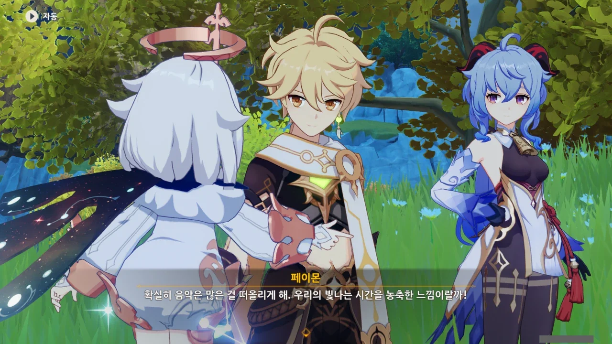
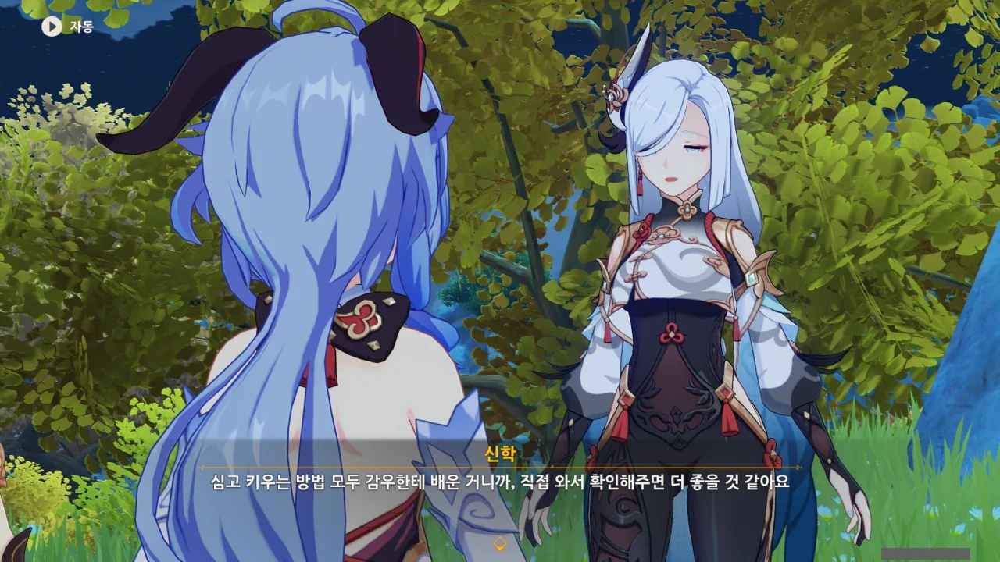
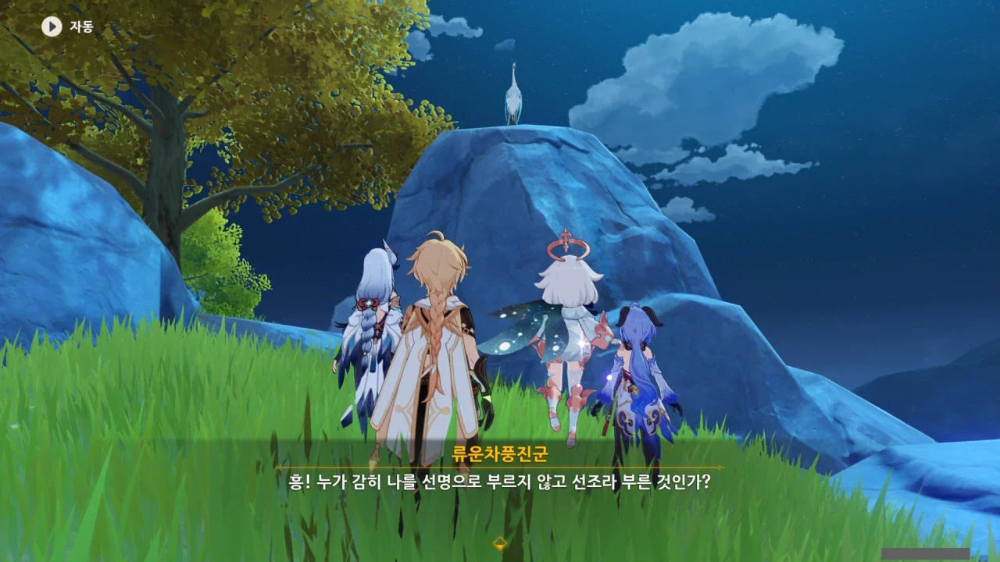
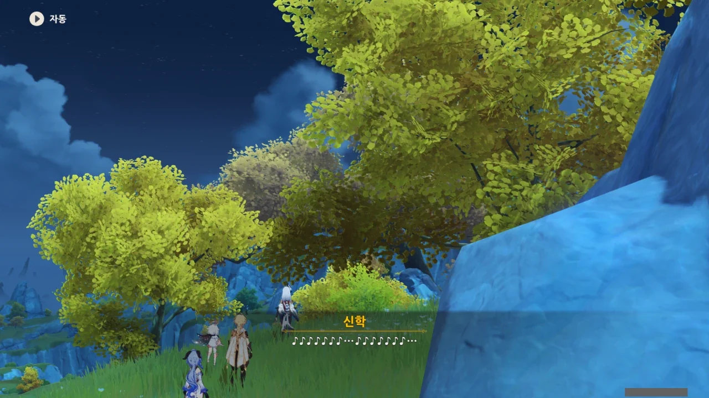



신학이 찍어준 곳은 여기서 그리 멀지 않은 곳이다.

그런데 여기도 아까처럼 뭐 보이는 게 전혀 없는데?



음악이라고 할 만한 건 전혀 들리지 않는다.

그리고 페이몬은 귀가 먹었다. 아무튼 귀가 먹었다.



자연의 소리도 음악으로 생각하는 사람도 있지만, 적어도 우리가 찾는 이야기에서는 아니다.

이게 다 음악에 관해 설명하다 만 페이몬 탓이다. 여행자는 말을 하고 싶어도 시스템의 한계 때문에 못한다고.



페이몬이 직접 부르는 동요를 듣는 것도 꽤 괜찮을 것 같은데... 아쉽다.

예전에 웹 이벤트 중, OST의 일부분을 듣고 누구의 PV에 삽입된 곡인지 맞히는 이벤트가 하나 있었다.

중국 쪽에선 페이몬 성우가 직접 노래의 가락을 허밍 했다는 이야기를 들은 적이 있다. 한국에선 그냥 노래를 재생해 줬지만...



이럴 때는 남행자가 아닌 여행자를 고른 사람이 부럽다.

남행자 성우분이 잘못을 한 건 아니지만, 남행자가 노래를 부르는 것에 심리적 부담을 느낀다.

처음 남행자가 노래를 랄랄라 부르는 걸 들었을 때, 나도 모르게 '으악 내 귀'라고 생각했을 정도였다.



어디서 들어보았던 멜로디라고 생각했는데, 운근이 처음 등장한 중간장에서 운근이 경극 가수의 목소리로 불렀던 노래의 곡조였다.

아, 그때 정말 여러모로 감동적이었는데.

운근 목소리가 갑자기 애애앵 대는 목소리로 바뀐 것에 처음 놀랐고, 곡 자체만 놓고 보면 꽤 괜찮은 노래라는 데에 두 번 놀랐다.



그때가 신학의 첫 사회 경험이었을 테니, 그때 이래저래 느낀 것이 많았을 것이다.

> 우리의 빛나는 시간을 농축한 느낌

오, 어쩐 일로 페이몬이 이런 시적인 말을 한 거래?



감우의 부모님이 불러준 자장가는 대체 언제 적 자장가였을까? 리월이 세워진 게 3,000년 전이었던가?



유독 감우만 이렇게 감우와 다른 사람과의 차이와, 그에 따른 괴리감에 대해 많이 서술되는 것 같다.

&nbsp;

원신을 제외한 다른 매체에서, 대다수의 장생종 캐릭터가 자신과 인간 사이의 차이에 대해 인간을 '찰나의 순간을 밝게 빛나는 불꽃'과 같이 비유하며, '인간은 인간대로, 자신은 자신대로'와 같은, 자신만의 삶의 법칙을 진작 깨우친 것으로 묘사되는 것과는 사뭇 다른 모습이다.

'찰나의 순간을 밝게 빛나는 불꽃'이라는 말을 들었을 때 처음 생각난 건 스파클라였는데.

&nbsp;

아무튼, 그러한 괴리감을 느끼는 것조차 감우의 캐릭터성일 것이다.





이제는 그 괴리감 자체가 자신의 만든 속박에서 비롯된 것임을 깨닫고, 다른 사람처럼 예술과 감정을 이해하게 된 감우라고 한다.



감우와 신학 사이는 뭐라 단적으로 말하기 어렵다. 선후배이자 친구, 상사-부하 사이면서 친구... 뭔가 알 것 같으면서도 손가락 사이로 빠져나가는 모래처럼 느껴진다.





각청과 감우를 자신의 꽃밭에 초대하는 신학. 신학이 만든 꽃밭은 과연 어떤 느낌일까?

아, 그 꽃을 심고 가꾸는 것도 감우가 알려준 거였어?

리월에서 살기 편하게 집도 알아봐 줘, 일자리도 알아봐 줘, 꽃을 키우는 것도 알려 줘... 이렇게 보니, 감우가 신학의 언니 역할을 톡톡히 하고 있다는 느낌이 든다.



> 감상용은 빼놓을 테니, 남는 건 다 먹어도 돼요.

으응? 그 꽃, 다 먹는 용도였어? 다 먹는 거였어? 게다가 감우는 거기에 부정도 하지 않고 "잘 먹겠습니다"라고 하네?

으음... 뭐, 감우는 따지고 보면 초식 동물이라고 할 수 있으니까. 그러고 보니, 신학도 풀떼기만 먹는 이미지가 있지 않았나?

아아... '꽃 먹기'라는 단어가 주는 충격이 아직도 가시질 않는다.

&nbsp;

페이몬이 류운차풍진군을 '선조(仙鳥)'라고 부르는데, 참으로 이치에 맞는 단어다. 그야, 류운차풍진군은 새잖아.

호랑이도 제 말 하면 온다고, 정말로 류운차풍진군이 나타났다.



> 저게 바로 내가 말한 하늘에서 내려온 대왕 선조야!

ㅋㅋㅋㅋㅋㅋ 대왕 선조 ㅋㅋㅋㅋㅋㅋ

페이몬, 너무 버릇없는 거 아냐? 배꼽 빠질 정도로 웃긴 단어 선택이긴 했지만...



오오, 역시 류운차풍진군! 우리가 찾는 선인이 누구인지 알고 있는 것 같다.



신학은 오늘 해야 할 수련이 있어, 여기서 헤어지기로 했다. 조금 아쉬운걸.

&nbsp;

그런데 나만 류운차풍진군의 "간만의 축제이니, 마음껏 요리를 즐기고 오너라"라는 말이 이해가 안 되는 걸까?

지금 신학은 수련하러 떠나는 상황이다. 그런데 마음껏 요리를 즐기라니? 설마 신학은 음식을 제대로 먹는 수련을 하는 건가?



그렇게 신학과 헤어졌다.

신학은 아까 여행자가 불렀던 곡을 흥얼거리며 떠난다.
