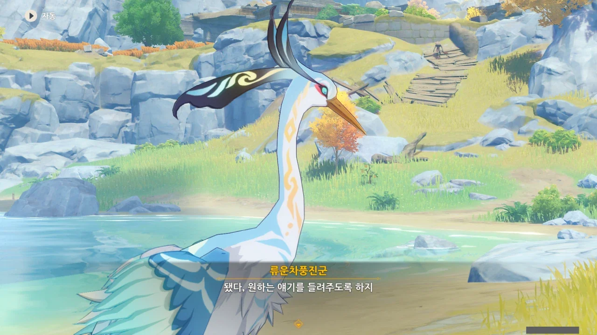





류운차풍진군이 안내한 곳은 귀리 평원이다.

류운차풍진군은 대체 왜 우릴 여기에 데려온 걸까?



아, 귀종. 이런저런 임무를 하며 자주 들은 이름이다.

가장 기억에 남는 건, '귀리 평원'이란 지명의 유래이다.

지금은 '귀리 평원'이라 불리는 곳이지만, 원래는 '귀리집'이라는 도시가 있었다고 한다. 그리고 두 이름에 붙은 '귀리'는 곡식 귀리(Oat)를 뜻하는 것이 아니라, '귀종'의 '귀', '종려(리)'의 '리'에서 한 글자씩 따와 지어진 이름이다.

처음 '귀리 평원'이란 말을 들었을 땐 귀리가 잘 자라 귀리 평원이라 부르는 줄 알았는데.

&nbsp;

귀종의 마신명이 '하겐투스'라는 건 이번에 처음 듣는 이야기이다.





현재 리월항에 있는 새 조각상이 바로 명해서하진군을 조각한 것이다.

저번에 응광이 명해서하진군에 대해 말할 때, '자유롭고 솔직하고 상당히 너그러운 성격을 지닌 선인'이라 했지만, 류운차풍진군은 '평소에 온화하다가도 자신이 좋아하는 물건 이야기를 하면 자랑질하기 바쁜 선인'이라고 말한다.

이렇게 한 인물에 대해 여러 사람이 다양한 관점에서 이야기하는 게 정말 좋다.

류운차풍진군과 귀종은 서로 기관 작품을 갖고 실력을 겨루었다고 한다.

지금 생각해 보니, 마신 오셀을 잡을 때 쓴 발리스타, 귀종기의 이름에 '귀종'이 붙어 있으니, 아마 귀종기는 귀종이 만들었을 것이다.



그러니까 류운차풍진군은 명해서하진군과 서로의 보물을 갖고 '이게 보물이지', '아니, 그것보단 이게 더 훌륭한 보물이지'라고 다퉜고, 귀종과는 서로의 기관 장치를 갖고 '이게 더 훌륭하지', '아니, 이게 더 훌륭하지'라며 다퉜단 거 아냐.

류운차풍진군, 생긴 것과 다르게, 굉장히 잘 다투는 성격이었나 보다.

&nbsp;

> 녀석의 보물이란 건 다 찾아낸 것이지 않나! 나처럼 직접 만든 게 아니라고!

아무튼, 옛날이야기를 하다 갑자기 급발진하는 류운차풍진군.



> 다들 싸우지 마. 어차피 나보다 못났잖아.
> 저 둘이 다 싸우고 나면 내려가서 고기 구워 먹자.

ㅋㅋㅋㅋㅋㅋ 아니, 귀종이 저런 말을 했다고?

평소 갖고 있던, 귀종에 대한 이미지가 산산이 조각나는 느낌이다.

&nbsp;

"어차피 나보다 못났잖아"라고 하는 건 대체 무슨 자신감의 발로였던 걸까? 저건 아무리 봐도 '너희 둘이 아무리 싸워도 나보다 못하다'라는 의미로밖에 보이지 않는데 말이다.

그래서 그런가, 류운차풍진군의 대사를 들으며 배가 들썩들썩 요동쳤다.

그런데, 그런 헛소리를 들어도 전혀 기분이 나쁘지 않았다고 한다. 사람 속 긁기 딱 좋은 말인데, 그걸 듣고도 기분이 나쁘지 않았다니, 대체 어떻게 말을 한 걸까?



이 여자, 뒤끝 쩌네. 아까 페이몬이 '선조', '저거'라고 자신을 부른 것에 대해 아직도 뾰로통해 있다.



마르코시우스는 지금 향릉 옆에 딱 붙어 다니는 누룽지의 원래 마신명이다.

위기에 빠진 리월을 지키기 위해 자신의 모든 힘과 기억을 희생했고, 그 탓에 지금의 모습이 되었다고 한다.



그 와중에 모락스가 가져온 잔은 네모난 잔이었다고 한다. 대체 왜? 대체 왜 그런 짓을 한 거야?

정말 류운차풍진군 말처럼 모락스도 의외로 맹한 구석이 있나 보다.

&nbsp;

초등학생 시절, 공작 시간에 찰흙으로 그릇을 만드는 체험을 한 적이 있었다.

그때 난 튀어 보이고 싶어 네모난 컵을 만들어 제출했었다. 그리고 거기에 대해 까맣고 잊고 있었다.

그런데 나중에 그 컵이 유약칠 한 후 가마에 구워져 정말로 쓸 수 있는, 울퉁불퉁하고 네모난 컵이 되어 되돌아왔다.

그런데 잔이 네모난 탓에, 뭘 담아 마시기 힘들었고, 그 컵은 결국 각종 필기구를 꽂아두는 필기구 통으로 전락했다.





평 할머니의 선인명이 바로 가진낭시진군이다.

귀종이 죽은 후, 적화주 대부분이 침수되어 멸종위기에 내몰린 걸 간신히 인공 재배에 성공해 멸종을 피했으며, 지금 필드에 보이는 유리백합은 그 인공 재배된 개체들의 후손이라고 한다.



그런데 만약 그 선녀가 귀종이라면, 드보르작이 찾는 그 선녀는 이미 죽은 것 아닌가?



그리고 류운차풍진군에게 분위기를 끊었다고 핀잔을 들었다.

아니, 옛 추억 곱씹기를 하는 건 좋은데, 우린 지금 드보르작이 만났던 선녀가 과연 누구인지 찾는 중이거든.

오, 드디어 본론으로 들어가는 건가?
