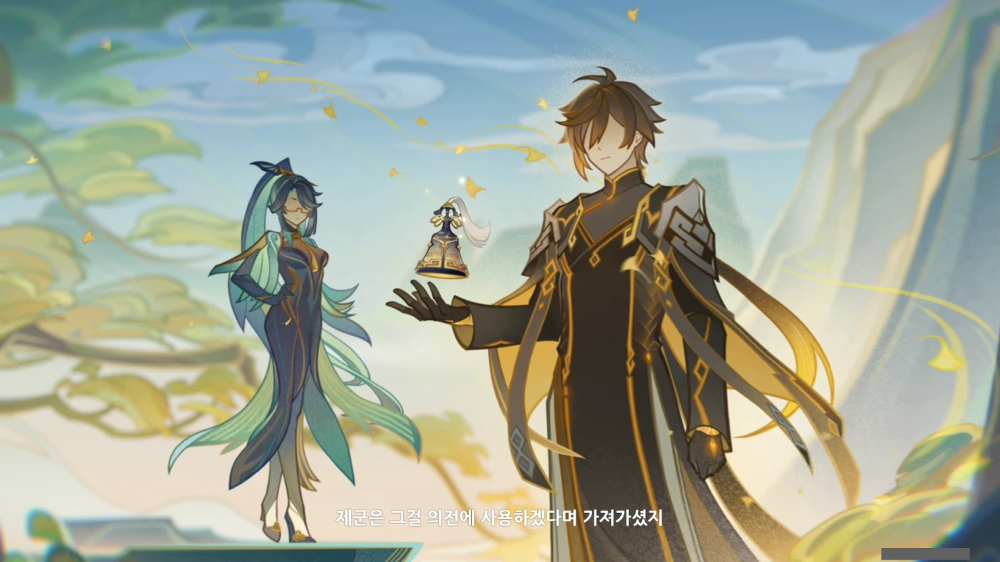
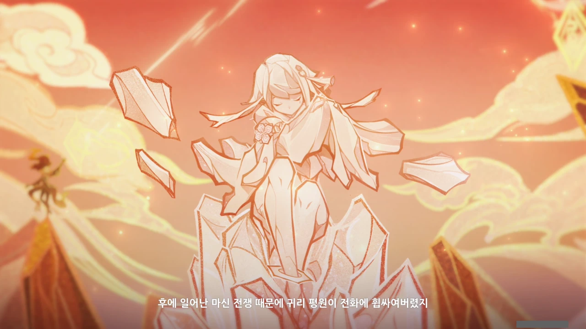



> 과거 나는 귀종과 기관술에 대해 논쟁을 벌이곤 했는데, 우리는 서로 양보가 없었지.

나무 밑 테이블의 모습으로 보아, 배경은 류운차풍진군의 거처 앞인 것 같다.



> 그리하여 가장 공정하신 암왕제군을 초대해, 두 기관의 고하를 평가해 주길 요청했느니라.

위쪽의, 쇠뇌와 같은 것을 앞에 둔 사람이 귀종 같다. 그러면 자연스럽게 왼쪽에 있는 사람이 류운차풍진군이 되려나.



> 하지만 제군께선 귀종의 「예호기관」이 더 뛰어나다 하시더군.

와! 해맑게 웃는 귀종, 너무 이뻐!

&nbsp;

귀종의 옷 안감이 별하늘과 같은 질감으로 되어 있는데, 이것도 무슨 떡밥인 걸까? 페이몬 옷 안감의 질감 역시 별하늘과 같이 되어 있는데 말이다.

와, 류운차풍진군도 이쁘다.

제자인 감우와 신학처럼, 그녀도 검은색이 들어간 옷을 입고 있는데, 아무래도 검은색 타이츠가 취향인 게 아닐까?



> 인정하긴 싫지만, 나도 알고 있었다. 귀종의 기관술이 나보다 한 수 위라는 것을.



> 귀종과 가진낭시진군의 이야기는 어느 방울에서부터 시작해야 하지.

웃는 귀종의 모습이 너무 이쁘다. 반한 것 같아.

그런데 이미 죽은 사람이지...



> 귀종은 기관술이 인간의 작곡을 완전히 대신할 순 없지만, 간단한 창작 정도는 가능하다 생각했는데

혀를 살짝 빼물고 있는 귀종의 모습이 너무 이쁘다. 이쁘다는 말밖에 할 수 없다.

귀종이 만든 기관 장치는 자동 오르골이 조금 더 발전해, 제한적인 창작도 가능한 정도의 악기 정도로 생각하면 되는 걸까?



> 가진낭시는 음악이란 영혼의 울림이니, 그 감성을 결코 기관 장치로 만들어 낼 수 없다고 했지.

와, 저게 평 할머니의 옛 모습이야? 그런데 왜 지금은 꼬부랑 할머니가 되셨습니까...

> 둘의 논쟁이 그치지 않아 난 제군을 모셔 왔고

미처 사진에 담기지 못했지만, 귀종과 가진낭시진군 사이에 찌릿찌릿 스파크가 튀더라.

볼을 살짝 부풀린 귀종의 모습이 너무 귀엽다.

> 제군은 그걸 의전에 사용하겠다며 가져가셨지.

나만 이게 '너희 둘이 이걸로 서로 싸우니, 내가 가져가 더 이상 싸우지 못하게 하겠다. 가져간 김에 잘 쓸게'라는, 군대식 해결법으로 보이는 걸까?



> 그 후, 그 둘은 종종 산에 모여 음악과 기관술, 그리고 인간에 대한 대화를 나누곤 했다.

의견 차이는 있었어도, 서로 아주 친했던 모양이다.

> 후에 일어난 마신 전쟁 때문에 귀리 평원이 전화에 휩싸여 버렸지.



> 적을 막지 못한 귀종은 결국 명을 달리했고, 나와 가진이 도착했을 때, 폐허 속에는... 옛 친구의 유해만이 남아있었다네.

마신이 죽을 때에는 그 힘이 주변으로 일시에 방출된다고 한다.

그래서 마신 중 정말로 최약체였던 소금의 마신, 훌리야가 자신을 따르던 인간들에게 살해당했을 때조차, 주변에 흩뿌려진 그녀의 힘이 인근에 있던 모든 사람을 소금 조각상으로 만들었을 정도이다.

그러니, 그녀가 살해당하며 주변의 모든 걸 흙먼지로 되돌려 폐허로 만든 것일 수도 있겠다.



> 그 후 가진낭시는 제군께 척진령을 자신이 보관하게 해달라고 요청했고

평 할머니가 갖고 있던 척진령은 원래 귀종이 만든 기관 장치였다는 거네.

친구의 유품이라 모락스에게 척진령을 달라고 했던 걸까?



> 나 역시 그리운 옛 친구의 뜻을 따라 「귀종기」를 조금 더 손봤지...

그러니까 「귀종기」의 원형은 귀종이 만든 「예호기관」이고, 류운차풍진군이 그걸 좀 더 다듬어 지금의 「귀종기」를 만들고 거기에 원설계자인 귀종의 이름을 붙인 거라고 보면 되는 걸까?

> 소등이 걸리고 내려지고, 사람이 모이고 흩어졌다네.



> 무얼 보고 있나? 귀리 평원인가?
> 산수를 보고 있었어.

와, 평 할머니는 이때는 목소리가 엄청 고왔구나...



> 인간이 등불처럼 사라지듯 선인 역시 그러하네.

저게 누구의 창인가 궁금해했는데, 아마 평 할머니(가진낭시진군)의 창이 아닐지 싶다.

일단 선인 중 창을 쓰는 것으로 알려진 건 모락스와 평 할머니, 소 셋밖에 없다.

모락스는 창을 쓴다고 하기보다, 모든 무기를 다 잘 쓴다고 봐야 하므로 제외한다.

이번 이야기에서 야차는 나오지 않았으므로, 소 역시 제외한다.

그러면 남는 건 평 할머니밖에 없다.

거기에 평 할머니를 사부로 둔 향릉의 대사 중에서 '사부의 창술'을 언급하는 대사가 있음을 생각해 보면, 저 창의 주인이 평 할머니라는 주장에 힘이 더 실리고 말이다.



> 언젠간 우리도 먼지가 되어 속세로 돌아가겠지.

아예 컷신에서 가진낭시진군과 평 할머니가 동일 인물임을 알려주고 있다.

왜 '먼지'와 '속세'를 언급했나 알아보니, 귀종은 '먼지의 마신(尘之魔神)'인데, 이 尘에는 '먼지'와 '속세'라는 뜻이 있다고 한다.

아마 선인 역시 귀종이 그리했듯, 언젠가 죽어 사라질 것임을 말하는 것 아닐까?
