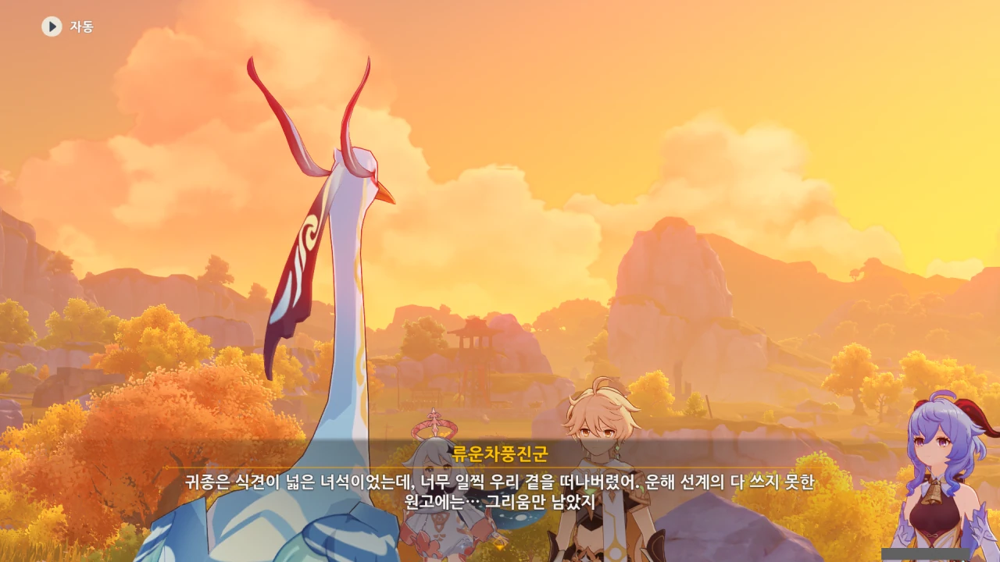
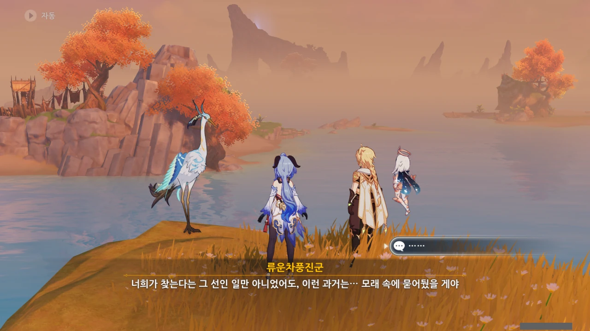
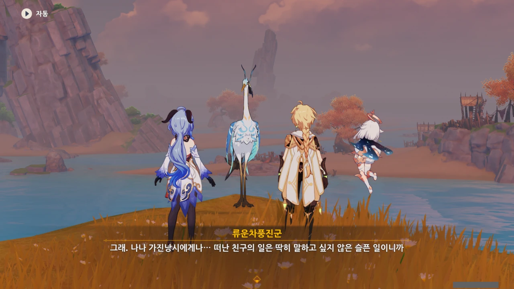
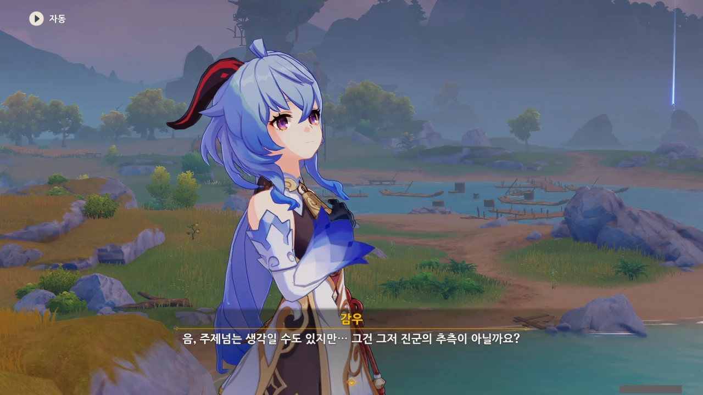
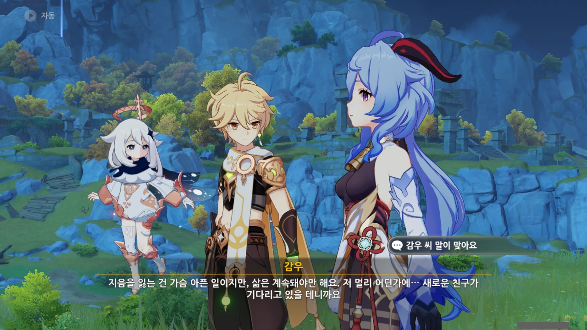
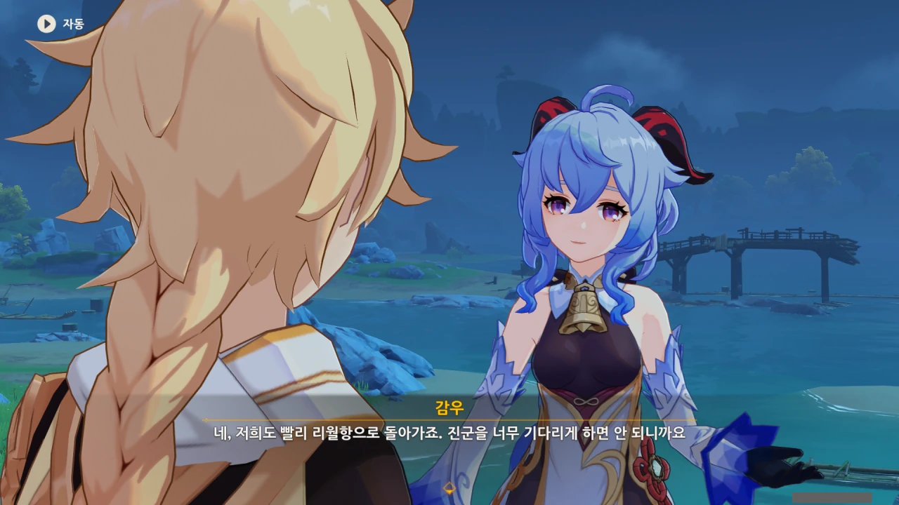



> 난 냉담한 성격에 감정을 숨기곤 하지.
> 난 그저 활발한 내향적 성격인 것뿐이다.

말은 저렇게 하지만, 류운차풍진군이야말로 선인 중 타인과의 교류가 제일 활발한 선인이다.

다른 선인들과의 관계로 좋은 편이고, 감우와 신학이라는 두 제자도 있으며, 종려가 한 말에 따르면, 귀종조차 '자질구레한 일을 알고 싶으면 직접 몇 날 며칠 온 동네에서 수소문하는 것보다, 류운차풍진군에게 물어보는 것이 더 빠르다'라고 했다고 한다.

츤츤대기는...



수차례 서로 작곡으로 자웅을 겨룰 정도로 친했던 귀종과 가진낭시진군이니, 귀종이 죽고 나서 그녀의 작품인 척진령을 받아온 건 그걸 보며 옛 친구를 떠올릴 수 있어서가 아닐까?





평 할머니가 옛날에 척진령에 관해 이야기할 때, 그렇게 말했던가? 적당히 얼버무린 건 기억나는데, 그때 정확히 무슨 말을 했는지 기억이 나지 않는다.

평 할머니의 '젊었을 땐 예쁜 물건을 좋아했다'라는 말에, 류운차풍진군이 코웃음을 친다.

뭐, 그 당시엔 척진령에 얽힌 진짜 이야기를 꺼내기에 좋은 시기가 아니긴 했지...



평 할머니가 척진령을 갖고 있다는 걸 아는 사람은 그 당시의 사람밖에 없으니, 「종려」라는 사람이 평 할머니에게서 척진령을 빌리려 한다는 이야기를 듣자마자 평 할머니는 「종려」가 암왕제군임을 알아차렸다고 한다.

다른 선인들과 리월 칠성에게도 그들의 꿈에 나타나 자신의 생존 사실을 알렸다고 하니, 리월의 정계 핵심 인물 중 암왕제군의 생존 사실을 모르는 사람은 없겠지.

듣고 보니 확실히 그렇네. 의례 곡을 연주할 때 실수하면 아주 곤란할 테지만, 기관 장치인 척진령은 실수할 리 없을 테니 말이다.



아, 가진낭시진군이 척진령을 받아 간 건, 척진령에 기록된 귀종의 곡을 듣기 위해서였다고 한다.

단순히 척진령을 보며 귀종을 추억하기 위함은 아니었던 것이다.



원래 떠들썩한 분위기를 좋아하던 가진낭시진군은 귀종의 죽음 이후, 이전과 달리 홀로 산 정상에 앉아 금을 타며 사색에 잠기는 일이 잦았다고 한다.

아까 봤던 컷신에서도 그런 장면이 나왔었지...



한참이 지나고 나서, 가진낭시진군은 마침내 척진령의 곡과 어울릴 수 있는, 만족할 만한 곡을 써냈고, 그 곡을 연주하며 자축했다고 한다.

그리고 그 당시, 주변을 지나던 드보르작의 조상이 물에 빠져 가진낭시진군에게 구함을 받았고.



> 현은 끊기지 않았으나 지음은 떠났으니, 류운, 난 이 곡을 누구에게 들려줘야 하는 걸까?

「백아절현」 고사성어의 이야기에서 따온 말이다. 백아처럼 현을 끊은 건 아니지만, 지음이 없으니 더 이상 그 곡을 연주할 가치가 없다고 생각한 거겠지.



감우도 귀종을 몇 번 본 적이 있었구나... 그런데 이 이야기에 대해선 왜 몰랐을까?

> 운해 선계의 다 쓰지 못한 원고에는... 그리움만 남았지.

굉장히 시적인 표현이다.

귀종과 친했던 건 가진낭시진군뿐만이 아니었다.

류운차풍진군 역시 귀종과 친했었고, 그래서 이런 가슴 아픈 이야기는 여태 가슴 속에만 묻어두었을 것이다.



글쎄다. 잘 모르겠다.

&nbsp;

게임 외적으로 생각했을 때, 원신은 정해진 노선의 스토리를 따라가는 게임이다. 여기서 내가 뭔가 고민을 한다 해도, 달라지는 건 없겠지.

하지만 만약 내게 선택지가 주어진다면, 정말 고민될 것이다. 이 이야기는 그리 행복한 이야기가 아니니까.

맞다. 이런 씁쓸한 이야기는 꺼내보았자, 당사자도, 듣는 사람도 침울해질 수밖에 없을 것이다.

그런데 여기서 감우가 이견을 제시한다.





감우의 말이 어느 정도 이해가 되기도 하고, 아니기도 하다.

그래, 감우의 말처럼, 숲속에선 선녀가 한 명 줄었고, 동시에 속세에는 인생의 선배가 하나 늘었다.

하지만 사람의 감정은 단순히 플러스마이너스로 표현할 수 있는 것이 아니지 않은가. 지음을 잃은 슬픔을 새로운 친우를 사귄 즐거움으로 무작정 덮어버릴 수는 없다고 생각한다.

새로운 즐거움이 그 슬픔의 고통을 덜어줄 수는 있겠지만, 그렇다고 그 고통이 영원토록 없어지는 건 아닐 것이다. 언젠가 다시 툭 튀어나와 우리의 마음을 툭툭 건드릴 테지.

&nbsp;

그래서 직접 가서 물어보아야 한다. 그 고통이 아직도 가슴을 후벼파는 슬픔인지, 이제는 보듬어 줄 수 있는 상처인지.



해등절에 음악회를 넣을지 말지 평 할머니와 상담했었는데, 거기서 긍정적인 대답을 얻었다는 건, 어쩌면 이제 그 이야기는 평 할머니에게 있어 아물어 가는 상처일지도 모른다.

잔머리라니. 이게 얼마나 사려 깊은 일인데.



지금까지 리월항에 있던 행사에 선인이 직접 참가하는 일은 없었던 것 같다. 이번 기회에 류운차풍진군도 함께 참가하면 좋을 것 같은데.



매년 보는 해등절에 참신할 게 뭐가 있냐고 하자, 곧바로 감우에게 하루하루 모두 다 다른 날이라고 반박당한 류운차풍진군.

그래, 어제와 오늘, 내일은 모두 다른 날이니까.



다른 녀석들이 몰래 성에서 놀고 있는지 확인도 할 겸이라는 핑계를 대며 류운차풍진군 역시 해등절 축제에 참여하기로 했다.

만세!

류운차풍진군도 리월항으로 떠났으니, 이제 평 할머니에게 그때 일을 물어보러 갈 시간이다.



못 할 것도 없지 않을까?

직접적으로 귀리 평원에 유리백합을 심는다고 생각해도 좋고, 상처 입은 마음을 보듬어 준다고 생각해도 좋을 것이다.

갑자기 류운차풍진군이 다시 나타나, '이리도 순진해서야'라며 감우를 까댄다.

아니, 리월항으로 간 거 아니었어? 그리고 아까 그 '잔머리가 잘 돌아가는 녀석'이 칭찬이었어?



어휴... 하여튼 정말...

이제 진짜 리월항으로 돌아갈 시간이다.
