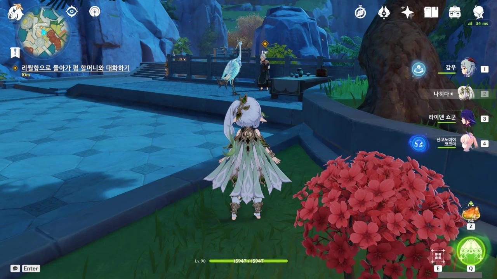

이렇게 동물형 선인이 리월항에 서 있는 모습을 대체 얼마 만에 보는 거지?

마지막이... 아마 리월 마신 임무 때였던 것 같은데.



'워프 포인트를 통한 이동보다 일찍 도착하다니, 류운차풍진군은 얼마나 빠른 걸까?'라고 생각했다가 피식 웃어버렸다.

너무 게임적으로 생각했어.





먼저 도착했으니, 평 할머니에게 그 이야기를 이미 꺼냈을 줄 알았는데, 아닌가 보다.

아니, 제일 오래 지낸 친구니, 그 이야기를 꺼내기 제일 덜 부담스러울 거 아냐?

그래도 류운차풍진군 본인조차 그리 좋아하지 않는 이야기이니, 그러려니 할 수 있다.





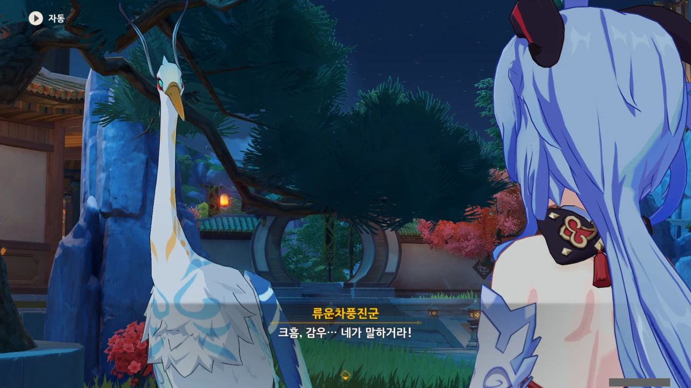

아니, 이 선조, 분위기 다 잡고 이야기 잘 꺼내다가 이걸 감우에게 던져 버리네 ㅋㅋㅋㅋㅋㅋ

쑥스러운 건 이해가 되지만, 이건 너무 갑작스럽게 던지는 거잖아! ㅋㅋㅋㅋㅋㅋ



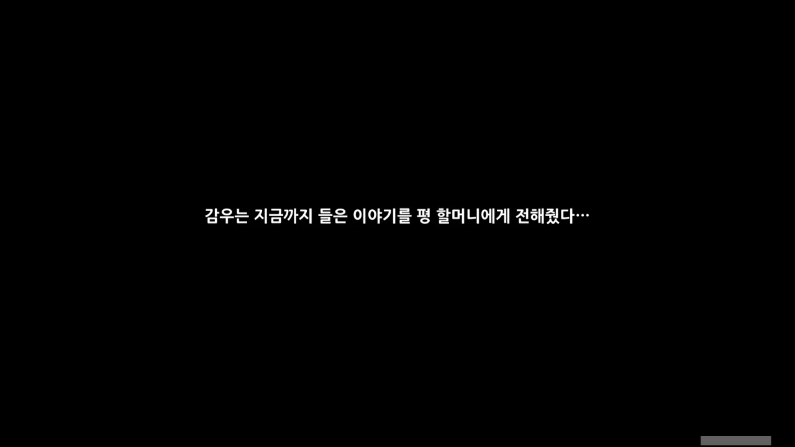

거 봐. 감우도 엄청 당황해 하잖아.

류운차풍진군에게 덤터기를 쓴 감우가 모든 이야기를 평 할머니에게 털어놓는다.



구전을 완전히 믿을 수 없다고는 하지만, 구전도 정보가 전해지는 중요한 과정 중 하나이다.

진시황의 분서갱유로 인해 소실된 유교 경전을 그 경전을 통째로 외운 사람이 그 기억을 바탕으로 나중에 다시 복원한 일이나, 호메로스의 기록이 소실되어 구전으로만 전해지다 다시 문서화된 걸 생각해 보면 알 수 있다.





대체 무슨 말을 귀종이 했기에 평 할머니가 저런 말을 하는 걸까?

평 할머니가 "류운의 눈빛을 보니 이미 다 얘기했나 보구나"라고 하자, 괜히 찔려서 "내가 먼저 말을 꺼낸 건 아니다"라고 둘러대는 류운차풍진군.



해등절은 리월의 영웅을 기리는 날이고, 귀종 역시 영웅이라 부르기 부족함이 없다고 말하는 평 할머니.

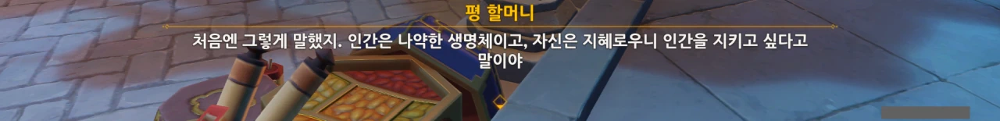

귀종도 처음에는 인간을 이끌어가고 지켜주어야 할 대상으로 보았지만

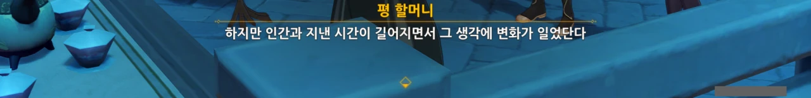

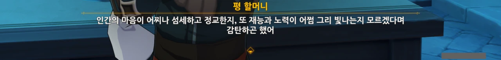

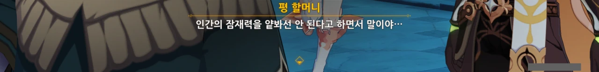

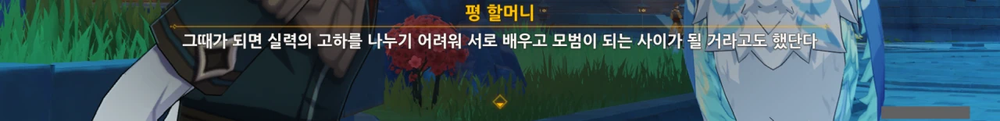

나중에는 인간의 잠재력을 얕보아서는 안 된다며, 언젠가는 선인과 실력의 고하를 나누기 어려울 정도로 강력한 힘을 발휘할 수 있으리라고 보았다고 한다.

&nbsp;

나 역시 이런 관점을 굉장히 좋아한다.

> 인간은 비록 불완전할지언정 무한한 가능성을 지녔으며, 파멸할지라도 패배하지 않는다.
{.bq}

이런 관점을 혹자는 '인간 찬가'라고 부르고, 다른 이는 '인본주의', '인류애'라고 부르기도 하더라.

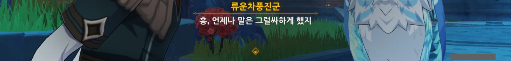

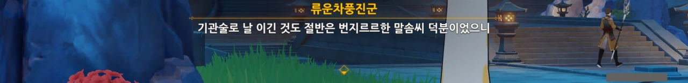

아하하...

귀종의 기관술이 자신보다 더 뛰어났음을 인정했음에도 여전히 "절반은 번지르르한 말솜씨 때문"이라는 류운차풍진군.



그런데 귀종과 류운차풍진군이 합심해 기관 분재를 만들어 평 할머니에게 준 적이 있나 보다.

그런데 대체 '기관 분재'란 뭘까? 설마 분재가 변신 로봇처럼 변신하는 건가?



나만 여기서 평 할머니의 분재는 리월항 그 자체라고 느낀 걸까? 그렇지 않고서야는 분재 이야기를 하는데 리월항 전체를 화면에 비춰줄 이유가 없지 않은가.



평 할머니는 귀종이 아직 살아있었다면 류운차풍진군과 기관 작품 대결을 벌였을 거라고 말하고, 류운차풍진군은 귀종이 아직 살아있었다면 평 할머니와 함께 음악을 감상하며 몇 마디 평가를 남겼을 거라고 말한다.

셋이 참 사이가 좋았던 모양이다.



페이몬이 평 할머니에게 예전에 평 할머니가 귀종을 위해 만든 곡을 이번 해등 음악회에서 연주하는 게 어떠냐고 제안한다.

솔직히 나도 듣고 싶다.



오랫동안 연주를 하지 않아 손이 굳었다고 하며 거절하는 평 할머니.

그 곡을 마지막으로 다시는 금을 잡지 않은 것 같다.



여전히 그 곡을 연주할 때마다 귀종이 생각날 것 같다는 평 할머니.

&nbsp;

여기서 평 할머니가 말하는 '이소도천', '명해서하' 모두 지금은 죽고 없는 선인이다.

푸른 사슴의 모습을 한 이소도천진군은 천형산에서 있었던 마신과의 사투에서 자신의 뿔을 잘라 천형산을 지탱하고, 마신에게 돌진해 동귀어진했다고 한다.

기러기의 모습을 한 명해서하진군은 예전 중간장에서 행추와 신학을 통해 이미 죽은 선인임이 언급되는 것으로 끝이다.

죽었으니 해등절 장식으로 조각된 것이겠지만...



과거를 놓기가 쉬울 리 없다.



나쁜 일이 있으면 좋은 일도 있는 것이 세상이니, 영원히 슬퍼지고 싶어도 좋은 일 때문에 그럴 수 없다는 말이다.



결국, 평 할머니는 해등 음악회 참여를 거절했다.

아쉽긴 하지만, 언젠가는 그 음악을 들어볼 날이 오겠지.

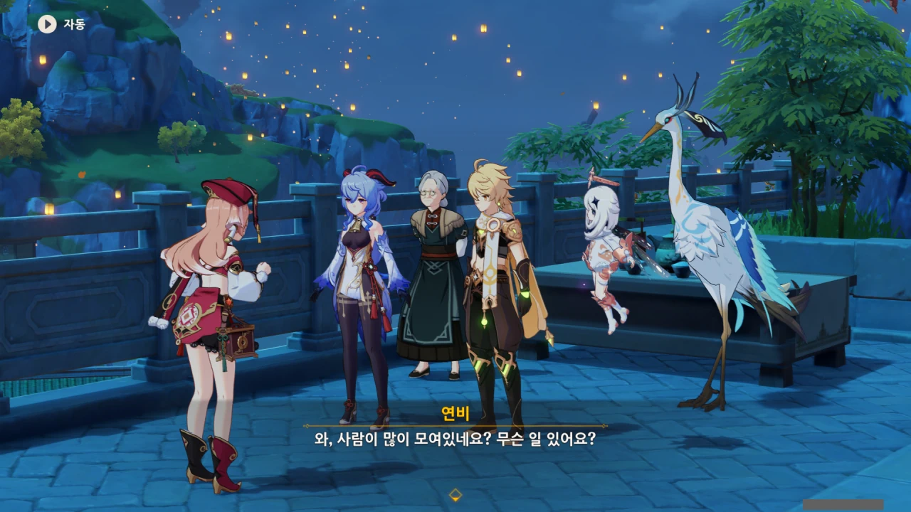

누군가가 이 장면을 가져다가 '여기 인간이 하나도 없는 거 아니냐'라고 하는 글을 본 기억이 난다.

* 연비: 반인반신수
* 감우: 반인반신수
* 평 할머니: 선인
* 여행자: 정체불명
* 페이몬: 정체불명
* 류운차풍진군: 선인

인간에 대한 정의가 아주 좁은 글이었지만, 재미는 있는 글이었다.



만난 김에 모두에게 안부 인사를 전하는 연비.



그런 연비에게 업무차 할 이야기가 있다며 먼저 연비와 함께 자리를 뜨는 감우.

흠... 너무 갑작스럽게 자리를 뜨는데? 뭔가 수상해.



나만 그렇게 느낀 게 아니었네. 평 할머니와 류운차풍진군 역시 감우가 거짓말을 못 한다느니, 자신에게서 대화의 기술을 반도 못 배워갔다느니 하며 혀를 찬다.

&nbsp;

하지만 류운차풍진군의 대화 기술도 영 시원찮은 거 아냐? 아까도 귀종 이야기를 꺼내다 말고 감우에게 억지로 떠넘기는 걸 보면, 류운차풍진군도 대화에 있어선 영 아닐 거 같은데...



오, 정말 그러고 보니, 둘이 오랜만에 만나는 것이긴 하겠네.

류운차풍진군은 자신의 거처에 틀어박혀 기관 연구에 몰두하는 타입이고, 평 할머니는 리월항에 상주하는 사람이니, 서로 평소 만나기 힘든 셈이다.



안타까운 일이지만, 평 할머니의 그 곡을 언젠간 들을 수 있겠지.

호요믹스에서 나중에 그 음악을 포함한 앨범을 내주겠지?

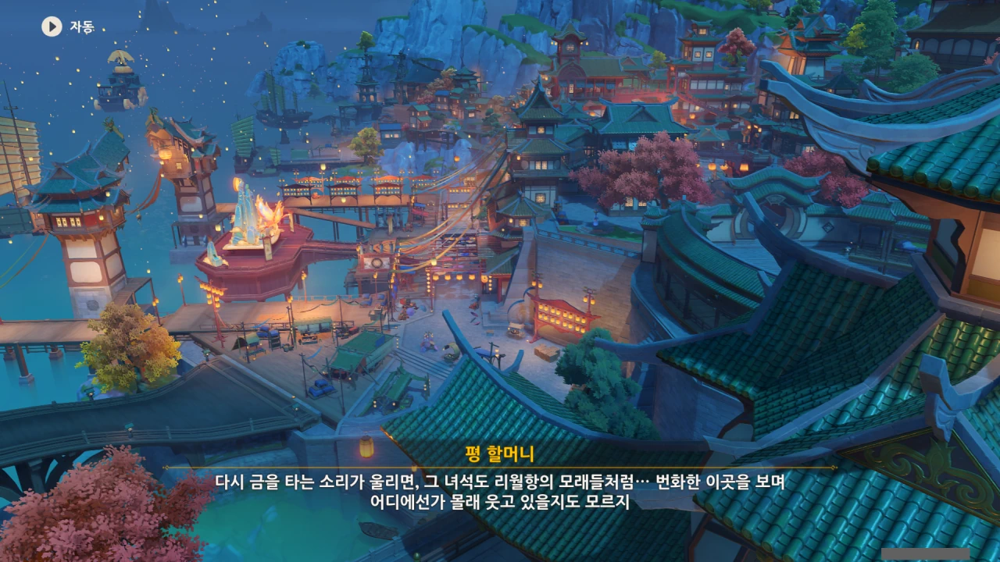

> 다시 금을 타는 소리가 울리면, 그 녀석도 리월항의 모래들처럼... 번화한 이곳을 보며 어디에선가 몰래 웃고 있을지도 모르지.

이다음은 드보르작과 대화하는 것이지만, 바로 앞에 평 할머니와 류운차풍진군의 대화가 더 있는 것 같다.

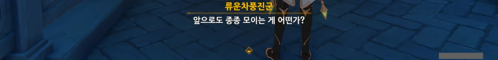

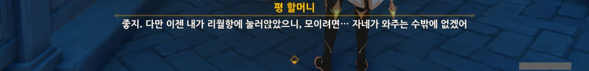

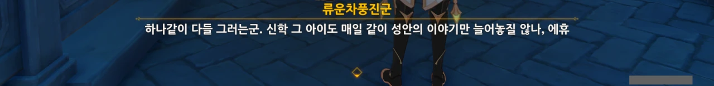

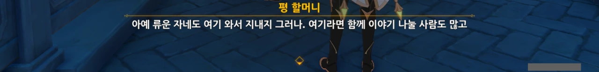

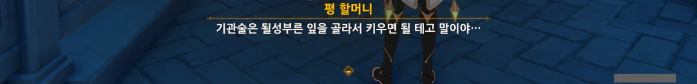

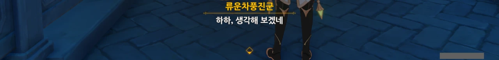

오, 나중에 리월항에 직접 찾아온 류운차풍진군을 볼 수 있는 걸까?

'하나같이 다들 그러는군'이라며 한탄하는 류운차풍진군과 그런 류운차풍진군에게 '너도 여기 와서 살지 그러냐'라고 꼬시는 평 할머니. ㅋㅋㅋㅋㅋㅋ

나중에 리월항으로 내려온 류운차풍진군과 그녀에게서 기관술을 전수한 제자를 볼 수 있었으면 좋겠다.
