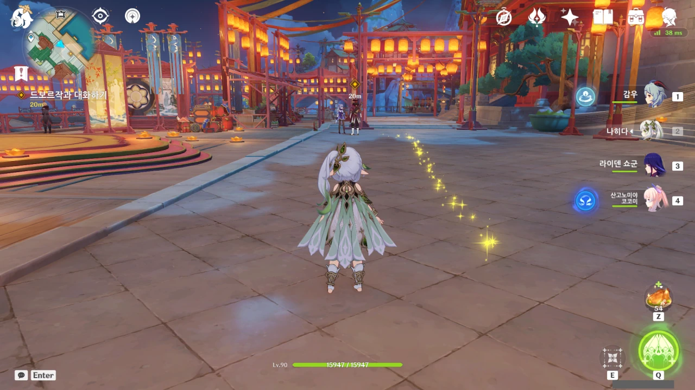
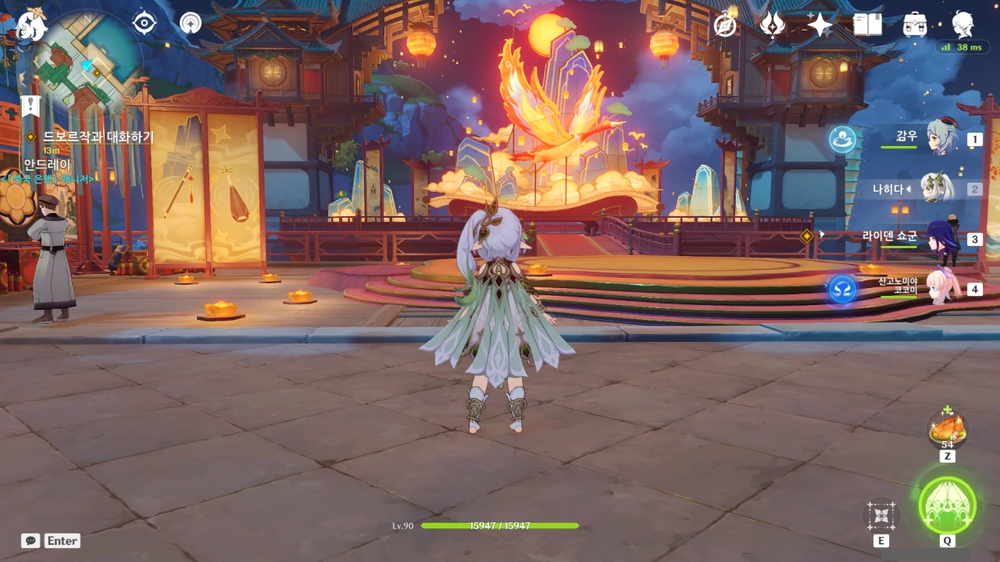
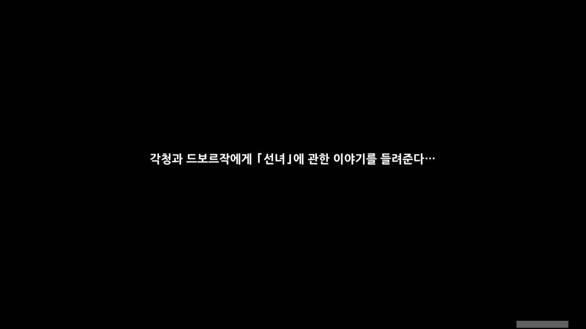
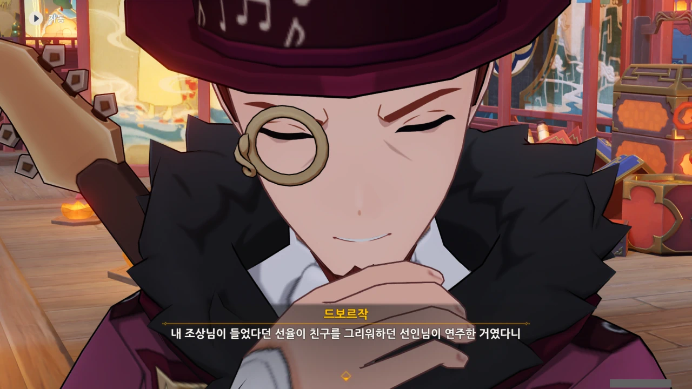
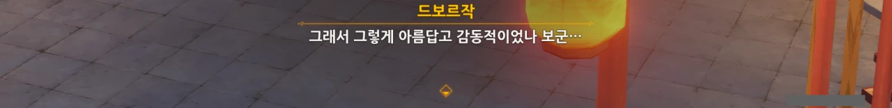
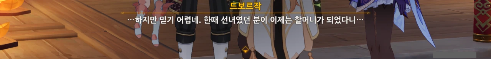
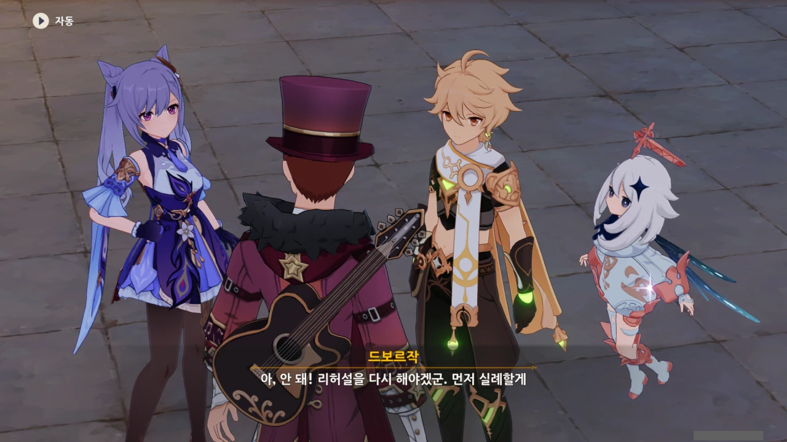

드보르작이 있는 곳으로 돌아왔다. 각청과 함께 해등 음악회 준비에 여념이 없는 듯하다.

여긴 뭔가가 바뀐 것 같으면서도 또 그대로인 것 같다. 단순한 내 착각이겠지?



드보르작에게 찾던 사람을 찾았다고 하니, 엄청 좋아한다.

드보르작은 한때 선녀였던 선인이 지금은 할머니가 된 것이 믿기 어려운 듯하다.

하지만 평 할머니는 다른 선인들과 달리, 본인이 늙고 싶어서 그런 모습이 된 거니까...



> 평 할머니의 지혜는 마치 횃불과 같아.

각청이 평 할머니의 지혜를 횃불에 비유한 건, 어떤 외형을 취하던 그 본질이 변하지 않는다는 뜻에서 한 것일 테다.



사연을 전해 듣고 느낀 감정과 지금 최고의 컨디션 모두를 이번 공연에 쏟아붓겠다는 드보르작.

아주 좋은 마음가짐이다.



그런데 평 할머니가 늘 있던 자리에서 이번 음악회를 지켜볼 것으로 생각하니 갑자기 긴장된다는 드보르작.

이번 공연을 더더욱 완벽히 하기 위해 리허설을 또 하러 가버린다.



이번 이벤트의 주요 키워드는 '음악'이었던 것 같다.

드보르작은 자기 조상이 겪었던, 음악과 관련한 이야기를 찾아 거슬러 올라가며, 음악이 사람들에게 주는 의미를 계속 찾고 있었다.

우리 역시 이번 이벤트 내내 음악이 사람들에게 어떤 의미를 주는가에 대해 여러 사건을 통해 알아보았고 말이다.

이번 이벤트를 통해 내가 느낀 건, 음악은 뭐라 한마디로 정의할 수 있는 것이 아니라는 것이다.

어쩌면 언어와 같이, 음악 역시 사람의 감정을 전달해 주는 매개체라고 생각할 수 있지 않을까?





아직 할 일이 남은 각청은 마무리 작업을 하러 떠난다.



이제 얼추 모든 일이 끝난 건가 하고 안심하고 있었는데, 종려가 '새로 돋아난 죽순'을 부탁한 걸 깜빡 잊고 있었다.

여기서 '세로로 돋아난 죽순!'이라는 개드립을 치기는 싫어, 고르지 않았다.



뭐, 분명 종려가 급한 일이 아니라 했으니, 늦어도 우리 책임은 아니겠지. 분명 만날 사람 다 만나고 오라고 했잖아?

종려는 평소 왕생당이나 세 대포 주점 앞 전달변 근처에 있으니, 거기로 가면 될 것이다. 사실, 왕생당보다 전달변 앞에 있는 경우가 더 잦은 거 같지만...
