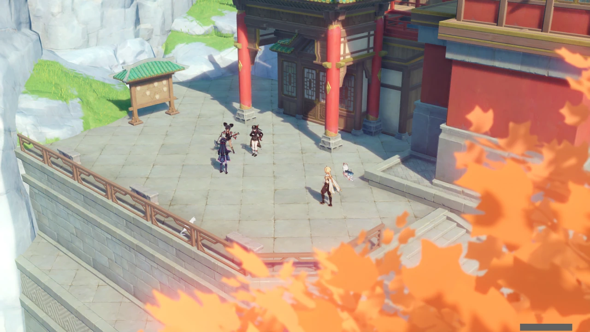
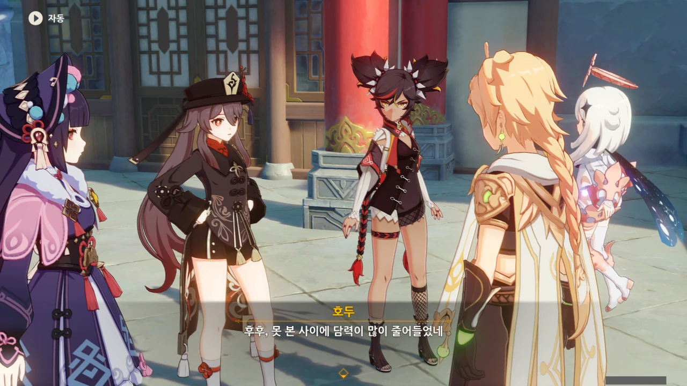

왕생당으로 가보니, 종려는 없고 호두와 신염, 운근 셋이 모여 무언가를 하고 있다.



지금 이걸 보며 내가 느끼는 감정을 정확히 표현할 수 있는 영어단어가 하나 있다. Cringe라고, '오글거려서 못 봐주겠네' 정도의 뜻이다.

대체 호두는 왜 갑자기 춤을 추는 거야? 신염과 운근이 함께 있는 것으로 보아, 해등 음악회 때 무언가를 하려는 모양인데...



벌건 대낮에 왕생당 앞에서 그렇게 춤을 추면... 부끄럽지 않나?

아니... 이건 담력과 상관이 없어... 분명히 없어...



너, 혹시 유령이 '보이지 않는 관중'이라고 말하는 거야?

야, 유령도 보다가 오글거려서 블랙홀에 빨려 들어가는 천체처럼 소멸하겠다.



> 처음엔 신염도 많이 놀랐잖아요? 꼭 커다란 개구리를 본 것처럼요.

ㅋㅋㅋㅋㅋㅋ 커다란 개구리 ㅋㅋㅋㅋㅋㅋ

아니, 호두가 얼마나 징그러웠으면 ㅋㅋㅋㅋㅋㅋ



'호두에 대해 알기 · 두 번째'에서 나오길, 호두는 자기 자신을 '골목에 숨어있는 어둠의 시인'이라고 칭한다.



누가 내 오그라드는 손발 좀 다시 펴줘...

안전 문제는 각청과 상의를 끝마쳤고, 신염 역시 무대 경험이 없는 건 아니니 괜찮을 것이라고 한다.

신염과 호두 둘 다 불 딜러니까 공연할 때 불이 나올 거 같은데...



종려는 오랜 친구를 만나겠다며 도시락을 싸 들고 산으로 향했다고 한다.

류운차풍진군도 비슷한 말을 했던 것 같은데...



와우, 종려, 참 대단한 사람이네. 난 그냥 신염이 머리 풀고 기타를 쳐줬으면 하는 소망이 있는데, 종려는 그걸 다 이해할 수 있다고 한다.



왕생당은 장례식장과 비슷한 곳이다.

그러니까 지금 장례식장 앞 주차장에서 공연 리허설을 하는 꼴인데... 여기가 좋은 곳이라고? 이거 맞아?



나에게 있어 호두는 4차원적인 캐릭터이다. 호두 하면 제일 먼저 떠오르는 대사 역시 '짜잔~! 사실 속으신 거예요!' 밖에 없거든.

어... 지금처럼 이렇게 장례식장 앞에서 공연 리허설을 하는 것도 '새로운 즐거움'인가...?

종려가 향한 곳은 호로산이라고 한다. 정보 고마워!

종려가 어디로 갔는지 호두가 정확히 알려주지 않았다면 리월의 산이란 산은 전부 뒤져봐야 했을 것이다.



호두는 종려에게 '이번 공연은 빠져도 연회 때에는 빠지지 말라'고 전해달라 한다.

저렇게 말하니까 종려가 오랜 친구를 만나겠다며 산으로 간 것이 호두의 공연을 피해 도망한 것처럼 보이는데?
