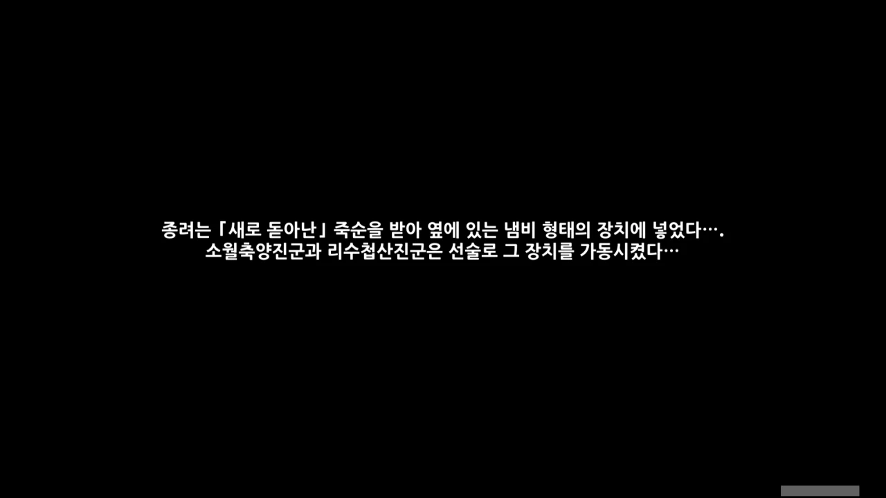

종려가 향한 호로산은 여기에 있다.

저기 보이는 사슴 선인은 분명 소월축양진군일거고... 그 옆의 두루미인지 학인지 모를 선인은 리수첩산진군일 것이다.

어휴, 왜 하나같이 선인들은 외우기 힘든 이름을 쓰는 건지...

&nbsp;

내 기억이 맞는다면, 저 둘은 서로 죽이 꽤 잘 맞아 곧잘 어울린다고 알고 있다.

무슨 이벤트였는지는 기억이 나지 않지만, 저 둘이 동시에 자리를 비우자, 류운차풍진군과 여행자가 하나같이 저 둘이 같이 어디론가 놀러 갔을 거라고 이야기한 것은 기억난다.

그건 그거고, 이 새 세 마리는 못 참지.

그리고 완벽하게 실패했다. 아니, 어떻게 세 마리중 단 한 마리도 맞지 않을 수가 있지?

난 완벽히 정중앙을 쐈다고 생각했는데, 감우의 강공격 2타의 범위가 예상외로 좁았나 보다.

앞에는 탁자가 있고... 저 장치는 분명 류운차풍진군이 만든 요리 장치였던 것 같은데. 뭔가를 요리하고 있는 건가?

선록(仙鹿) ㅋㅋㅋㅋㅋㅋ 선조(仙鳥) 2호 ㅋㅋㅋㅋㅋㅋ

처음에는 페이몬이 싸가지없게 군다고 생각했는데, 지금 와서 생각해 보니, 선인명을 외우기 더럽게 힘들어, 그냥 선인의 외형만을 갖고 부르는 것이 아닐지 생각된다.

노력은 가상한데, 너무 싸가지 없게 들리잖아 ㅋㅋㅋㅋㅋㅋ



아, 종려! 여기 있었구만.



꽤 늦게 왔다고 생각했는데, 오히려 제때 왔다고 한다.

종려가 만드는 죽순 수프라...



종려의 취향은 까다롭다고 할 수 있다.

당장 종려의 특제 요리조차 고급 재료가 아낌없이 잔뜩 들어간, '약불로 천천히 끓인 죽순 수프'이지 않은가.

그런데 저 장치를 쓰면 불길이 세도 알아서 요리를 잘해주는 모양이다.

&nbsp;

류운차풍진군이 아침에 저 장치를 싸서 호로산으로 갔다고 했는데, 그게 여기였네.

신학이 "리수첩산진군께 주시려는 건지... 자세히 물어보진 않았어요"라고 하기에 그냥 장치를 리수첩산진군에게 준다고 생각했는데, 그게 들어맞은 모양이다.



그냥 밥솥이라기보다, 압력밥솥이라 부르는 게 맞지 않을까?

그런데 장치 이름은 제대로 부르려고 하면서, 선인을 부를 땐 선조, 선록이라 부르는 건 좀 그렇지 않냐...?



> 옛일이 그립다고 지금을 슬퍼할 필요는 없지. 산다는 건 인연을 쌓는 것이니까.

여러모로 와닿는 말이다. 특히 이번 이벤트에서 더더욱.

그래, 앞일은 모르는 것 아니겠는가.

와, 맛있겠다!



종려에게 호두가 한 말을 전해주었다.



공연이라면 해등 음악회밖에 없을 테지만, 연회가 대체 무엇인지는 잘 모르겠다.

설마 왕생당에서 연회를 여는 건가?



선인들과의 모임 때문에 공연에는 불참했지만, 왕생당의 객경이라는 직위상 연회를 거절하기는 어렵겠다며, 연회에 가겠다는 종려.

그렇지. 직장 상사가 까라면 까야지... 안 그러면 괜히 눈치가 보이지 않겠는가.



말하는 사이, 수프가 모두 완성되었다. 거 참 굉장히 빠르네.

약불로 천천히 끓이는 시간이 절대 아닌 것 같은데, 이게 바로 「요리 기계장치」의 힘인 걸까?



종려에게서 따끈따끈한 죽순 수프를 받았다.



혹시나 해서 종려의 특제 요리, '약불로 천천히 끓인 죽순 수프'와 비교해 보았다.

&nbsp;

이번에 얻은 '따끈따끈한 죽순 수프'는 임무 아이템 취급이라, 먹을 수 없다.

> 선인 기술로 만든 음식이니 배낭에 넣어도 상하지는 않을지도?
{.bq}

음식을 배낭에 넣으면 무조건 상할 것 같다고 생각되지만, 막상 버프나 회복 목적으로 이미 수많은 요리를 배낭에 넣어 다니는 걸 생각하면 또 그럴듯하다고 생각된다.
