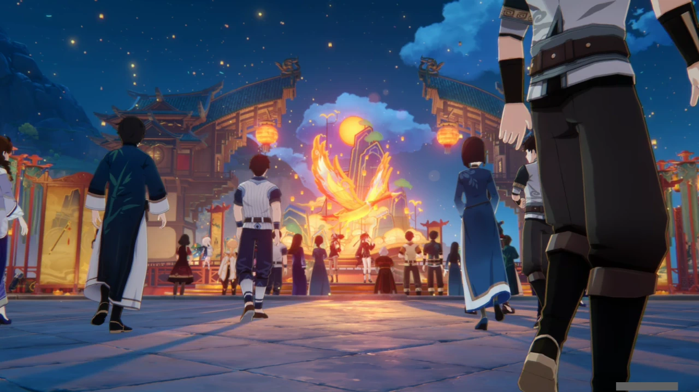
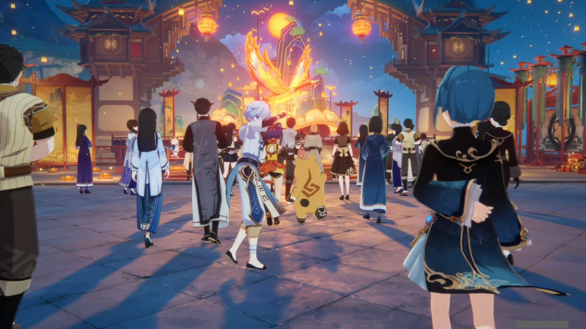
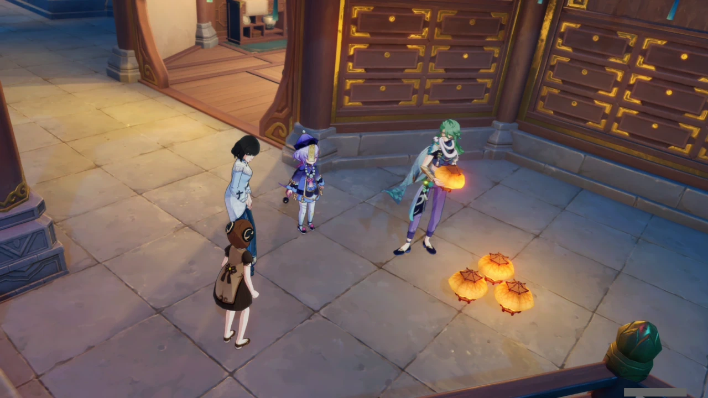
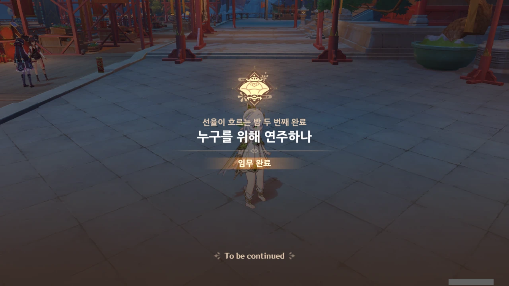

해등절의 마지막 하이라이트, 해등 음악회가 시작되려 하고 있다.



와, 호두가 이런 데서 나오는 건 정말 처음 보네...

운근도 같이 공연할 줄 알았는데, 그냥 관중석에서 여행자와 함께 구경만 하고 있다.

음, 이게 좋은 건지 나쁜 건지 잘 모르겠네.

왜 노래 제목이 《불타는 복숭아 가지》인 걸까? 무슨 뜻이 있는 건가?

*안타깝게도 속이 뒤집어져* 노래 가사는 제대로 듣지 못했다.

향릉과 누룽지, 중운과 행추가 공연장으로 다가간다.

여행자와 서로 눈이 마주치자, 손을 흔들며 반갑게 인사한다.

음악회가 진행되는 모습을 멀찍이서 북두, 각청, 응광이 내려다보고 있다.

야란은 그 뒤의 기둥에 몸을 기댄 채 잠자코 듣고만 있다.





응광이 모두를 식사에 초대한다.

뒤에 있던 야란도 같이 가나 싶었는데, 누군가에게 쪽지를 받더니 그 내용을 보고 코웃음을 치며 다른 곳으로 가버리더라.

불복려 앞에선 치치와 백출, 그리고 진향과 팥쥐가 소등을 날려 보내고 있다.

리월에서 일일 의뢰를 하다 보면 팥쥐가 불복려에서 만든 약을 먹기 싫다고 하는 걸 행인두부를 줘 달래야 하는 의뢰가 자주 들어와서, 저 둘이 진향과 팥쥐인 걸 기억하고 있다.



소는 망서 객잔 주변에서 유적 가디언을 처리하다 잠시 가면을 벗고 리월항에서 쏘아 올린 커다란 폭죽을 바라본다.

이럴 때는 소도 잠시나마 쉬었으면 좋겠는데...





평 할머니, 감우, 연비와 함께 해등 음악회를 감상하던 요요가 음악회에서 연주되는 노래를 듣고 평 할머니에게 달려간다.



종려는 호로산에서 조용히 다른 선인들과의 모임을 즐긴다.





류운차풍진군은 소등을 날리고 싶다는 신학의 말에 "겨우 소등 가지고"라며 핀잔을 주나 싶더니, "전에도 없었고 앞으로도 없을 만한 소등을 만들어 줄 테니 가서 모두에게 자랑하고 오너라"라고 말한다.

이 아줌마, 츤데레 맞다니까.

음악회에서 연주되는 곡에 합을 맞추듯, 평 할머니가 연주하는 금 소리가 울려 퍼진다.

사진에 담지는 못했지만, 드보르작 역시 금 소리를 듣고 잠시 멈칫하더니 평 할머니의 연주임을 깨닫고 이내 지휘를 계속하더라.



선율이 흐르는 밤 두 번째 에피소드, '누구를 위해 연주하나' 끝!
