

응? 아니, 왜 이게 있는 거야?

저번에 확인했을 땐 '선율이 흐르는 밤 두 번째' 임무까지밖에 없어서 이번 이벤트의 모든 스토리가 다 끝난 줄 알았는데!

날 속였구나, 원신!

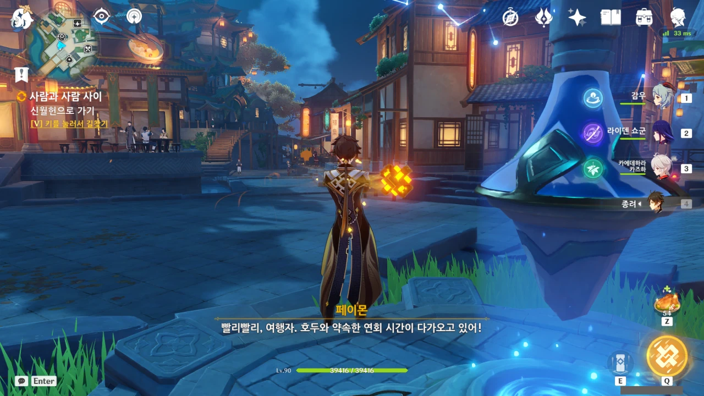

이벤트 스토리를 그냥 넘길 수도 없으니, 서둘러 호두의 연회가 열린다는 신월헌으로 가기로 했다.

저번에 호두가 말한 연회 이야기가 나오지 않길래, 그냥 알아서 했겠거니 하고 있었는데...

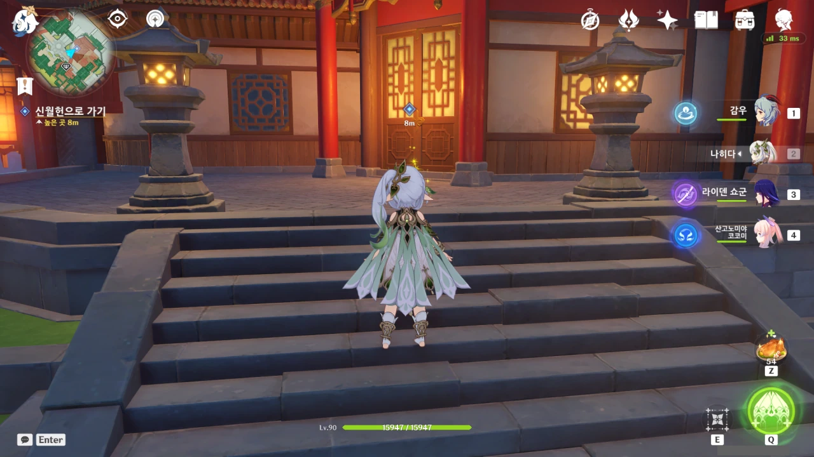

신월헌은 여기에 있다.

각각 '리 요리'와 '월 요리'를 대표하는 유리정과 신월헌은 서로 길 하나를 사이에 두고 마주 보고 있다.





안에는 종려 말고도 중운, 행추, 향릉이 있었다. 지금껏 요리를 주제로 이야기하고 있었던 모양이다.

> 내게도 부족한 점이 있으니 서로 배워야지.

종려도 참, 따지고 보면 여기서 제일 잘난 사람이 종려인데 저런 겸양의 말을 꺼내다니.

그래도 종려에게 부족한 건 있지. 금전 감각?



내 장담컨대, 종려가 말하는 '얕은 지식'조차 중운에게는 상당한 고급 지식일 것이다. 분명 그럴 것이다.

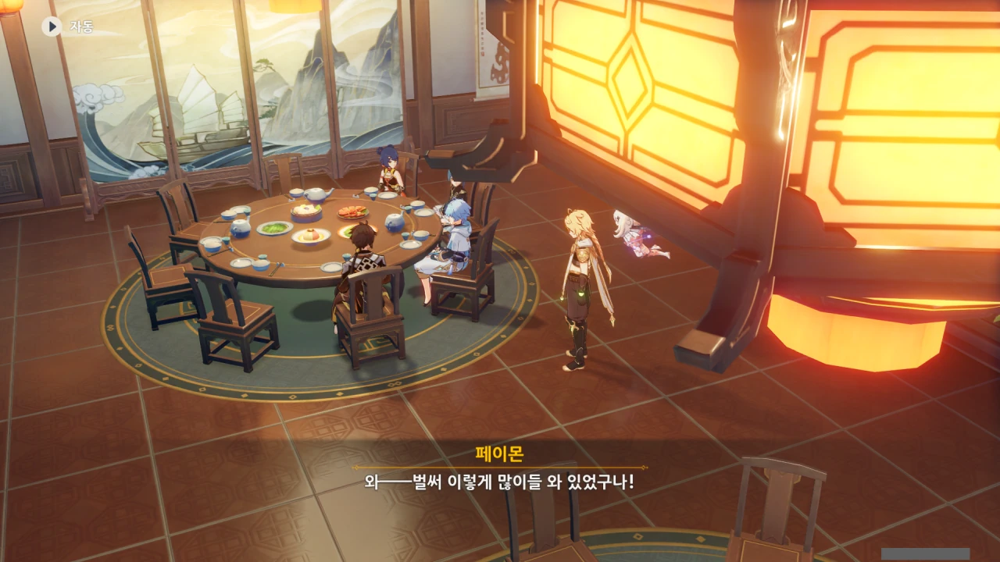

아무튼, 왔으니 서로 인사해야지. 종려 말고 다른 친구들을 여기서 만나게 될 줄은 전혀 몰랐지만.

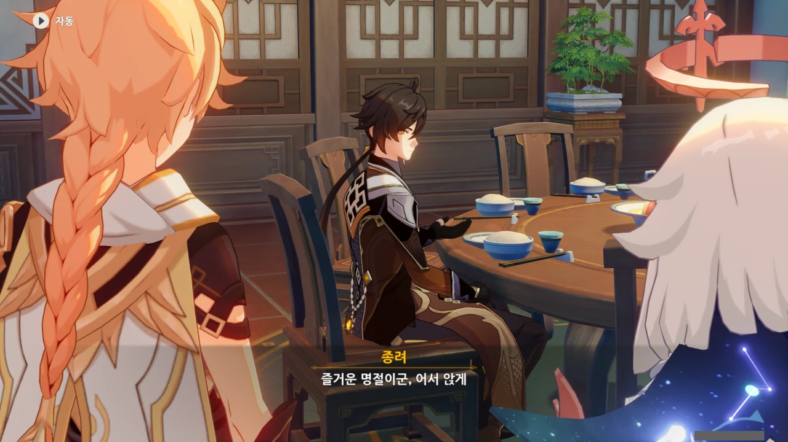

그런데 이 연회를 주최한 건 호두 아니었던가? 호두는 어디 가고 종려가 손님을 맞는 걸까?





이번 해등절의 주제는 '음악'이었고, 음악에 관한 다양한 이야기들을 볼 수 있었다.

지금껏 신염은 혼자서 공연했는데, 이번 공연은 --- 내 기억이 맞다면 --- 최초로 다른 사람과 함께 했다. 그걸 생각한다면 확실히 처음 보는 스타일이라고 할 수 있겠지.

그런데 운근이 도와줘야 할 정도로 신염이 슈퍼스타가 되었다는 건... 조금 생소하다. 지금까지의 신염 이미지는 '남들이 알아주지 않아도 나의 길을 가는 아티스트' 정도의 이미지였는데...

&nbsp;

호두가 향릉, 행추, 중운을 초대한 것으로 보아, 신염과 운근 역시 초대했을 것 같은데, 정황상 공연 때문에 호두의 초대를 거절한 것 같다. 공연뿐만 아니라 공연 이후에 할 것도 있겠지.

저 둘이 이번 연회에 오지 못한 것은 아쉽지만, 그래도 신염은 자신의 공연을 다른 사람들이 드디어 알아주었지 않은가. 좋은 일이겠지.





향릉의 영감이 대폭발했다는 것은 곧 향릉이 또 다른 괴음식을 만들었다는 걸 의미한다.

그리고 중운 골려 먹는 데의 전문가인 행추는 향릉의 괴음식을 향릉이 중운에게만 시식을 부탁했다는 거짓말로 전부 중운에게 떠넘긴 거 같고.

&nbsp;

명심하자. 행추와 중운이 함께 있을 때, 행추가 어떤 운을 띄운다면 그건 십중팔구 중운을 골려 먹기 위함이라는 것을.



식욕대마왕 페이몬은 향릉의 신메뉴 이야길 듣고 식탐이 도졌다.

음식 이야기만 나오면 '나도 먹어볼래!'를 무작정 들이대니, 말릴 방법이 없다.





아, 이번 향릉의 신메뉴는 종려의 조언을 듣고 만든 건가 보네. 그래서 처음 들어왔을 때 향릉이 종려에게 감사를 표한 거였다.

종려가 "맛이 마치 혀 위에서 춤추는 것 같지"라고 말하는데, 향릉의 요리 특성상, 정말로 요리가 혀 위에서 춤춘 것일지도 모른다. 맛은 훌륭하겠지만.





행추 이 녀석, 중운을 향릉의 신메뉴 베타테스터로 내세운 후, 종려의 조언을 통해 안정된 요리를 자신이 먹을 생각이다.

얌체 같은 녀석 같으니라고.

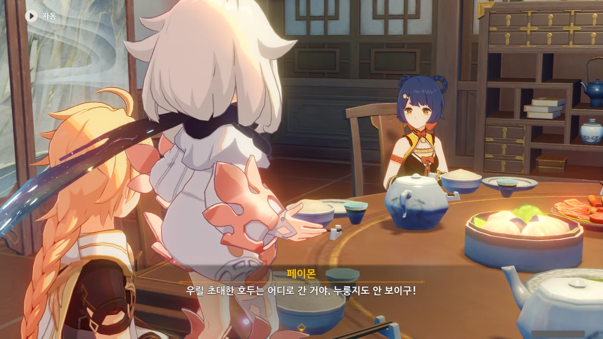

그래. 호두는 그렇다 쳐도, 늘 향릉과 붙어 다니던 누룽지는 대체 어디로 간 걸까?



아하, 누룽지가 향릉 대신 만민당에 남아 묘 사부를 돕고 있는 거였구나. 그렇지 않으면 향릉이 호두의 연회에 참가하지 못할 테니까.

그런데 누룽지는 대체 어떻게 묘 사부를 도울까? 한창때엔 직접 요리를 한 누룽지였다지만, 지금은 힘도 잃고 지성도 잃은 누룽지가 요리할 것 같진 않은데...

설마 서빙?



호두는 손님을 직접 모시러 갔다고 한다.

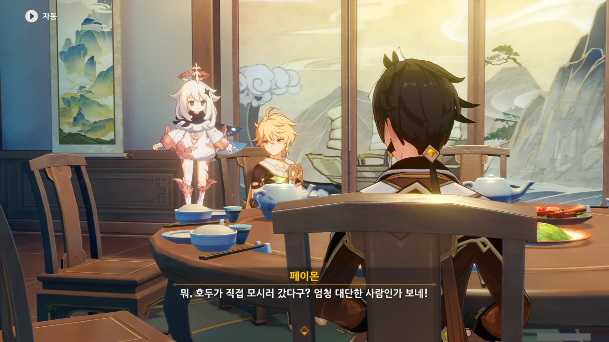

그 마이페이스, 자유분방함의 대명사 호두가 직접 모시러 갈 정도의 손님이라니. 대체 누굴까?

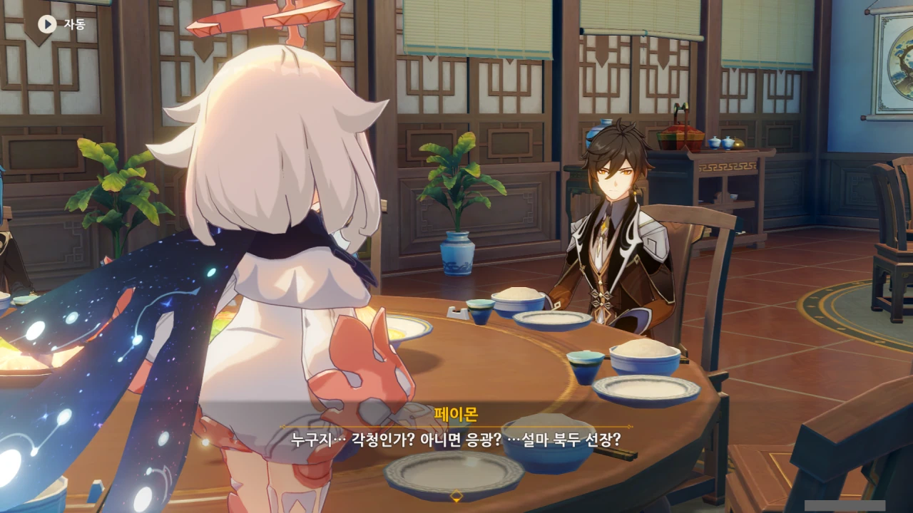

페이몬은 각청, 응광, 북두를 예상했지만, 아까 본 컷신의 내용에 따르면 저 셋은 응광의 초대로 응광과 따로 식사할 것이다.

그 컷신에서 언급한 '내일'이 바로 오늘이니, 아마 지금 다른 곳에서 식사를 즐기고 있겠지.

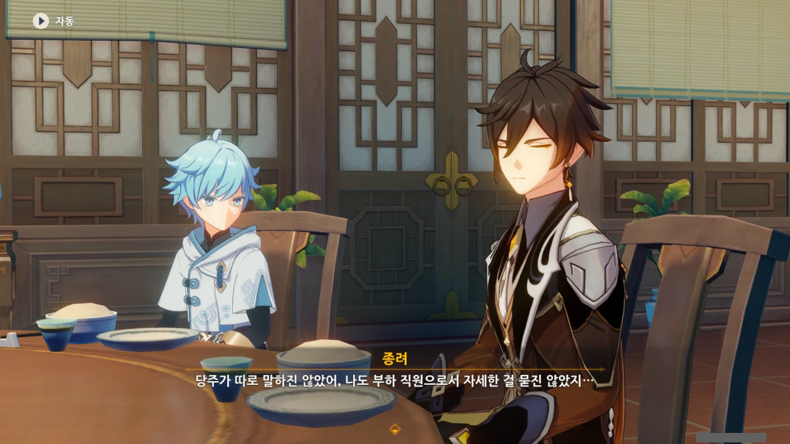

호두는 누구를 손님으로 데려올 것인지에 대해 종려에게 말하지 않았고, 종려 역시 부하 직원이라는 입장상 자세히 물어보지 않았다고 한다.

***

누가 왔는지 보지 않아도 호두가 돌아왔음을 알 수 있다. 호랑이도 제 말 하면 온다던데, 정말이네.



응, 역시 호두였어.

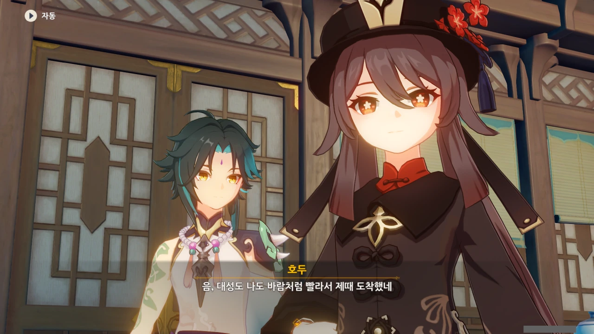

... 어? 호두 옆에 있는 거, 소아냐? 소가 왜 여기에 있어?



여기에 있는 사람 중, 종려가 정체를 숨긴 암왕제군임을 아는 건 여행자와 페이몬, 그리고 소뿐이다.

과연 종려는 소에게 어떤 반응을 보일까?



뭐, 그럼 그렇지. 내 예상에서 크게 벗어나지 않았다.

지금 종려는 '평범한 일반인'이다. 항마대성 소를 이번에 처음 본다고 하는 것이 자연스럽다. 그래서 종려는 처음 만난 사람에게 하는 인사를 소에게 한다.

만약 여기서 종려가 소를 아는 척했다면, 분명 나중에 '어떻게 항마대성과 알게 되었어요?'와 같은 질문에 대답하기 위해 또 다른 거짓말을 지어내야 할 테지.

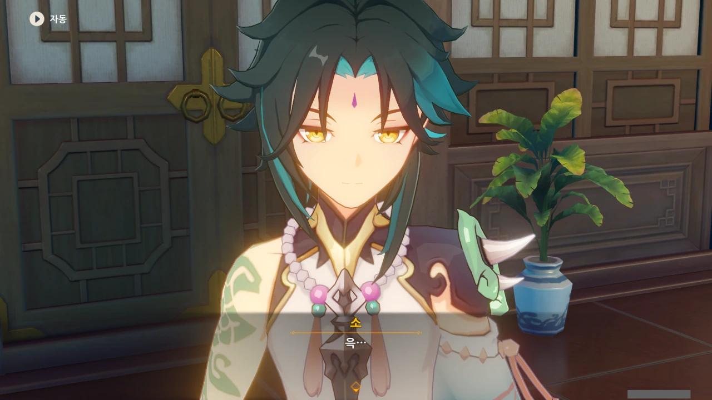

물론 소는 굉장히 난처해하고 있다.

그야, 자기 상관이 지금 일반인 코스프레를 하고 자기 앞에서 처음 만나는 것인 것처럼 인사를 하고 있으니 말이다.

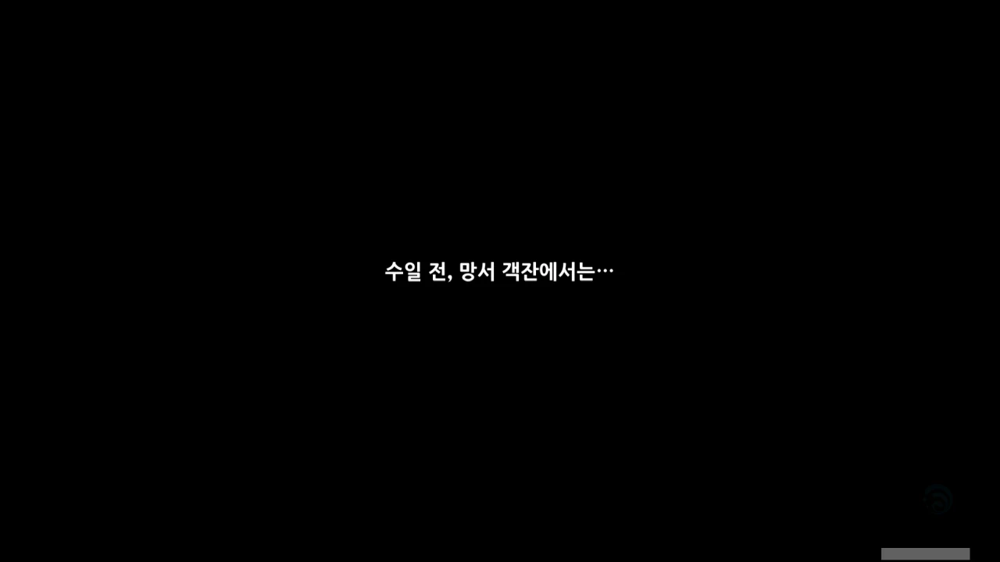

응? 갑자기 왜 여기서 과거 회상이 나와?



어쩐 일로 왔냐는 소의 질문에 "호 당주의 성격은 도저히 내가 감당할 수 없지"라며 운을 띄우는 종려.

분명 호두가 뭔갈 시켜서 온 게 분명하다.



아니 ㅋㅋㅋ 종려에게 참기름을 사 오라고 심부름을 시킨 거야?

호두가 종려의 정체를 알고 있는지는 잘 모르겠지만, 그래도 뭔가 범상치 않은 사람임은 알고 있는 거로 아는데, 그런 사람에게 태연하게 참기름 심부름을 시키다니 ㅋㅋㅋ

종려도 참 난처할 것이다. 기껏 죽은 척으로 암왕제군 자리에서 도망쳤건만, 직장 상사가 참기름 심부름 같은 잔심부름을 시키고 있으니 말이다.

물론 종려는 그것마저도 '나쁘지 않군'이라며 따르겠지만.



그런데 리월항에선 참기름을 팔지 않는 건가? 왜 망서 객잔까지 와서 참기름을 구한 걸까?

설마 종려 특유의 엘레강스 기질이 발동해, '최고급 참기름이 아니면 안 돼'라는 생각으로 향릉과 자웅을 다투던 언소가 쓰는 참기름을 사기 위해 여기까지 온 걸까?

하지만 종려가 언소에게서 산 건 송이버섯과 햄이다. 참기름은?



아니 ㅋㅋㅋ 참기름을 사 오라고 심부름을 보냈더니 사 오라는 참기름은 안 사 오고 애꿎은 송이버섯과 햄만 사 온 꼴이잖아 ㅋㅋㅋ

호두가 종려에게 장난스레 핀잔을 주는 모습이 절로 상상된다.

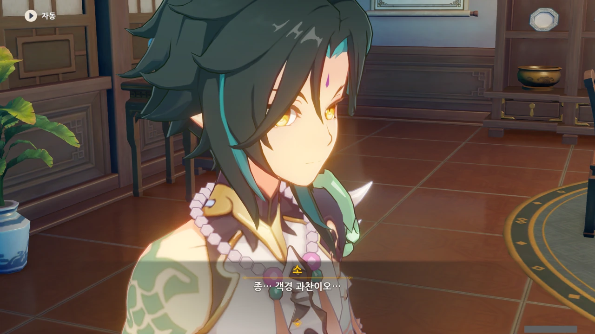

소는 종려를 '종려'라고 부르려다 객경으로 고쳐 부른다.

처음 보는 사이인데 대뜸 이름으로 부르면 무례해 보이니 그런 걸까?





어? 여행자와 소가 이미 구면인 걸 호두가 왜 알고 있는 거지? 여행자가 예전에 말해준 적이 있었나?

너무 오래전에 리월 마신 임무를 한 터라, 전혀 기억나지 않는다.



아니, 그런 의미로 종려가 호두에게 말한 건 아니지 않을까?

저거, 100% 일부러 저러는 거다.



지금도 식탁 위에는 여러 음식이 차려져 있는데, 호두의 말에 따르면 곧 내올 음식이 주메뉴인 것으로 보인다.

그럼, 지금 식탁 위에 있는 건 단순한 전채 음식인 건가?

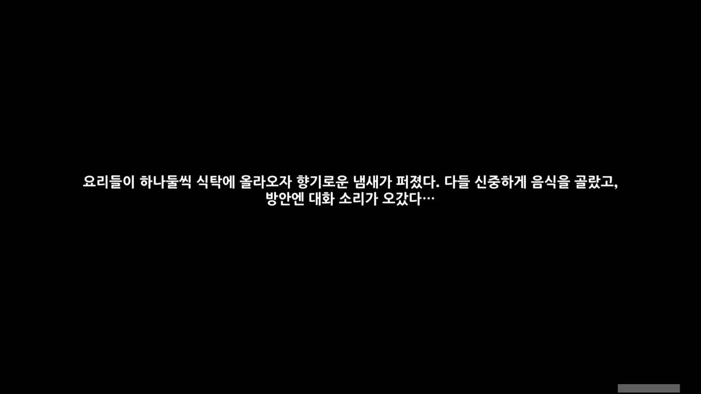
