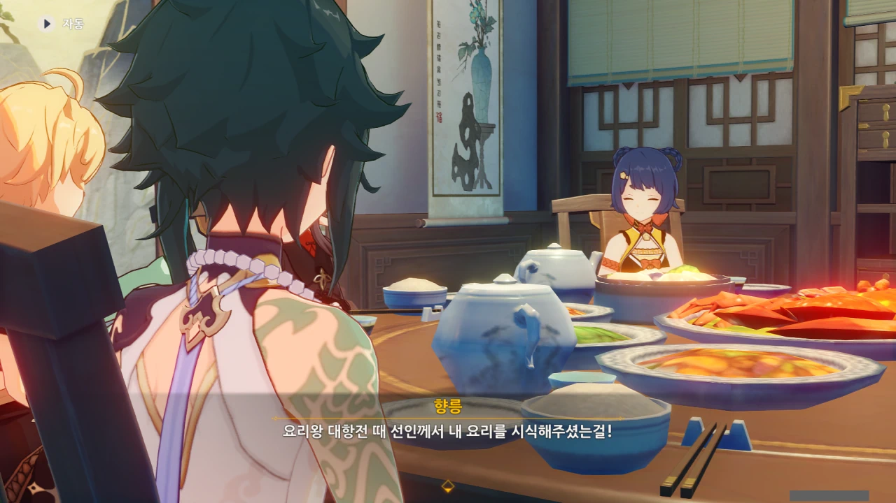
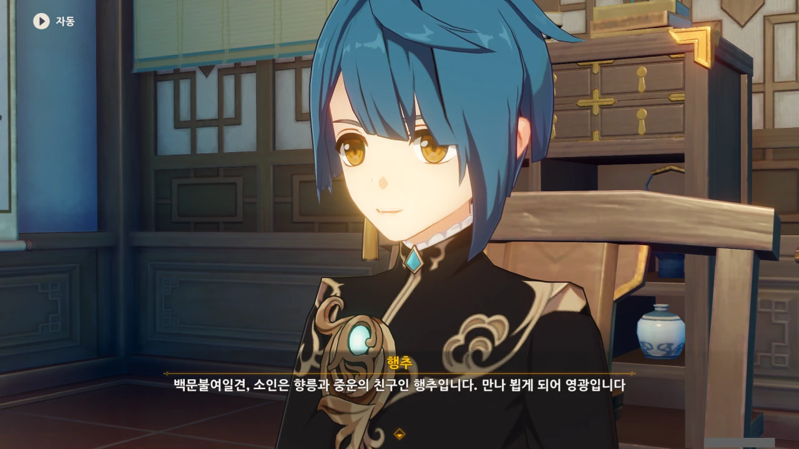
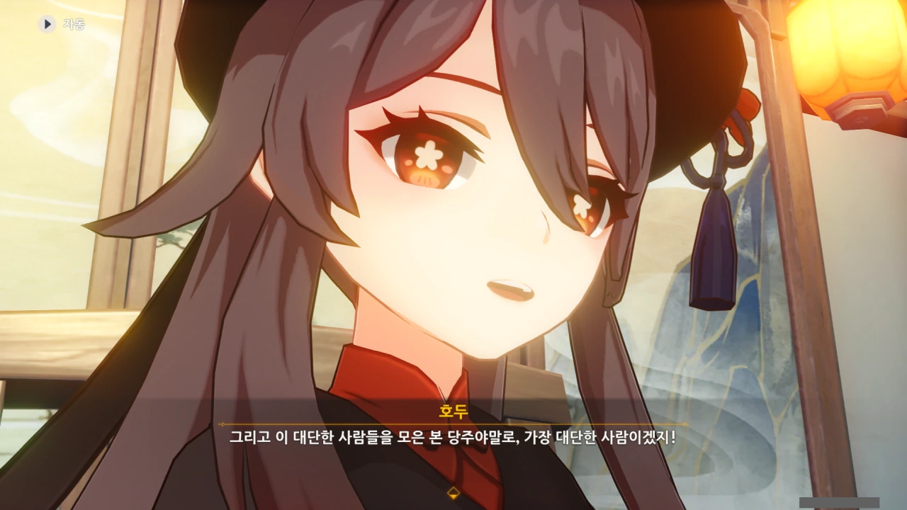
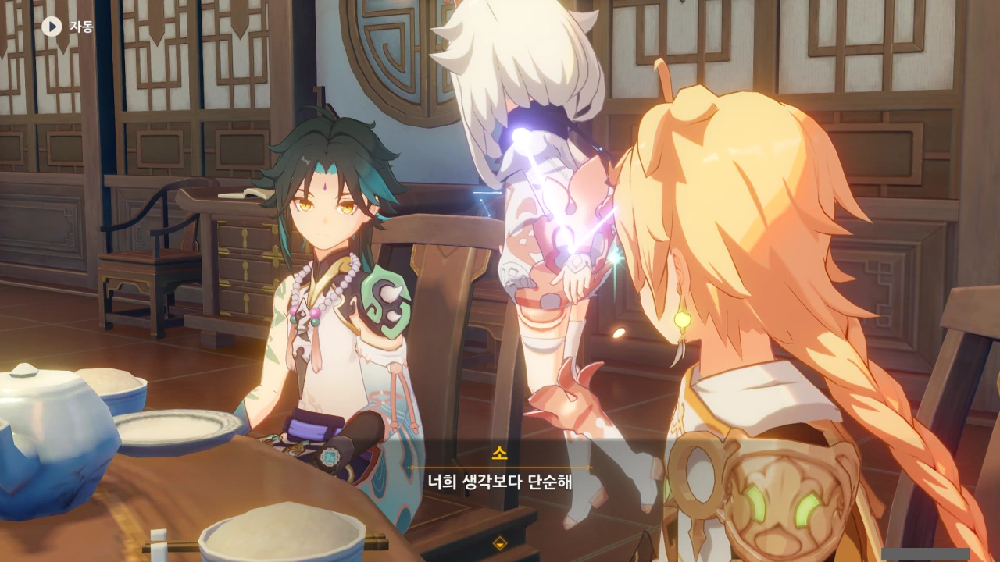
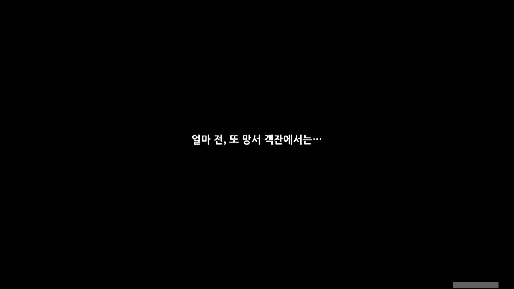
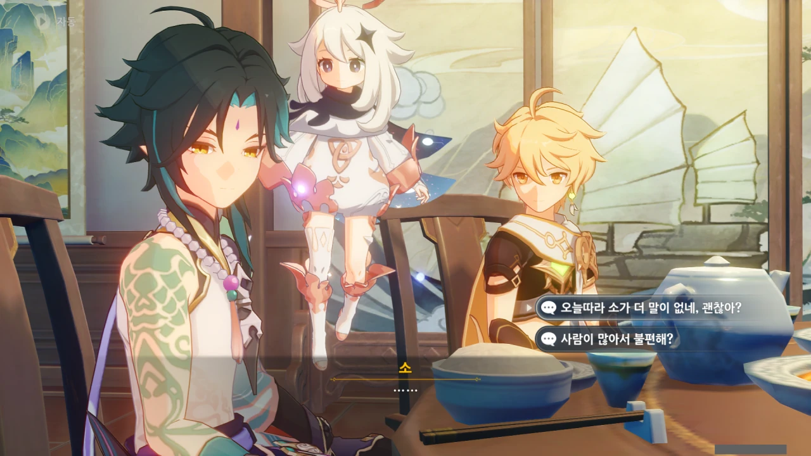
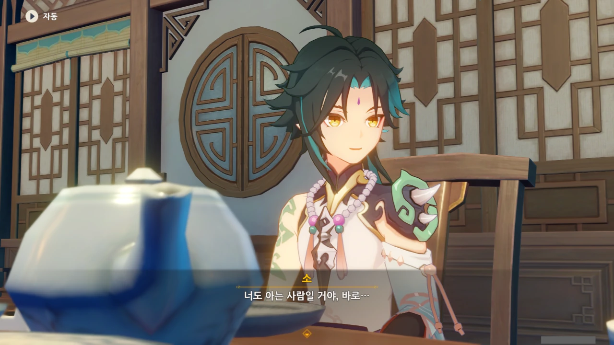
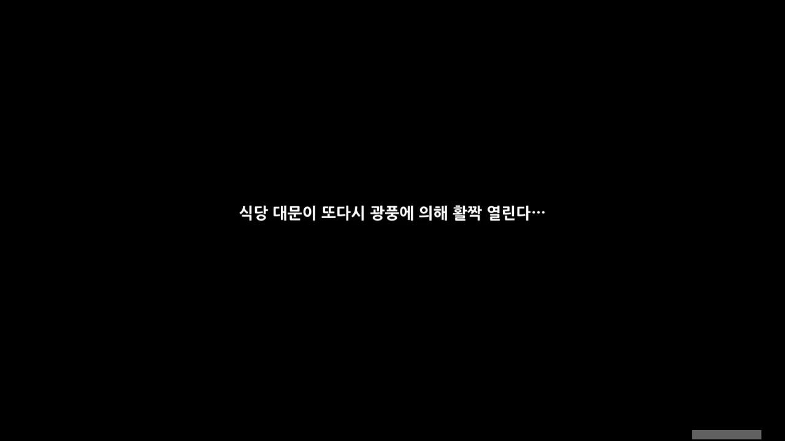



나 역시 호두가 소를 손님으로 모셔 온 게 상당히 놀랍다. 소의 평소 태도라면 호두가 연회에 초대해도 단칼에 거절했을 텐데, 어떻게 데려온 거지?

그런데 중운은 여행자와 소가 서로 아는 사이인 것이 굉장히 신기하게 보이나 보다. 대체 왜?





아, 그러고 보니 중운과 소 모두 퇴마와 관련된 일을 하고 있다.

그럼, 중운에겐 업계의 전설적인 선배와 내 친구가 서로 친구 관계라는 게 신기하게 보일만도 하겠다.



행추가 왜 중운이 옛날에 한 말을 지금 여기서 갑자기 꺼냈겠는가? 100% 중운을 골려 먹기 위해서이다. 이건 장담할 수 있다.

그런데 "퇴마 도사의 중요성을 증명"한다는 게 대체 무슨 말일까?

단순히 뉘앙스만 놓고 보면 소가 요마를 전부 해치우는 바람에 퇴마 도사가 할 일이 없어져, 퇴마 도사의 중요성을 증명하려 한다는 의미로 보이는데...

아, 요리왕 대항전. 분명 '달빛 속 광경' 이벤트에서 만민당의 향릉과 망서 객잔의 언소가 마지막 결승전에서 요리 대결을 펼쳤었지.

그 이외의 일은 전혀 기억나지 않지만.

행추가 소에게 자기소개를 하며 인사한다.

생각해 보니, 여기 있는 사람 중 종려와 행추만이 이번에 소와 처음 만나는 것이다. 그마저도 종려는 '암왕제군'의 신분으로는 소와 이미 구면이고.



다들 소에게 존댓말을 하며 인사하자, 페이몬도 따라 존댓말로 소에게 인사하려다 고장 나버렸다.

페이몬이 괜히 트집 잡지 말라고 하는데, 난 이런 식의 대화가 너무 좋은걸. 페이몬은 골려 먹는 재미가 있단 말야.





서로 친한 사람끼리 식사하는 자리인데 너무 예의를 차리면 되레 분위기만 어색해질 거라고 하는 호두.

그래, 친구 사이에는 적당한 예의 정도면 충분하다.



호두가 종려를 흉내 내며 한마디 한다.

저걸 들으니, 종려의 대기 대사가 떠오르더라.

> 이제어디가고싶어리월의명승고지를둘러보고싶다면괜찮은방법이있어유통을위해지은배는항구에정박하지그러니리월은모든재물이모이는곳이야계화꽃을사서좋은술을가지고옛친구와함께뱃놀이를가고싶으나옛친구는언제다시만날수있으려나
{.bq}

정말 종려를 잘 따라 했다. 종려 본인도 비슷하다고 했을 정도면 말 다 했지, 뭐.





> "다들 대단하긴 한데, 그 대단한 사람들을 모은 내가 제일 대단해!"

완전 이 말 아냐. 뭔가 얄밉게 느껴져, 반박하고 싶지만, 마땅히 반박할 말이 떠오르지 않는다.

나도 그렇게 생각해. 소는 항상 망서 객잔에 눌러앉아 있다시피 하는데, 대체 호두가 소에게 무슨 말을 했기에 소가 이렇게 얌전히 온 걸까?

응? 단순하다니? 그게 무슨 말이지?



> 사장님이라고 불러, 난 주인아주머니가 아니란다 ---

저런... ㅋㅋㅋㅋㅋㅋ



> 항마대성 --- 소 선인님 --- 망서 객잔의 수호신 --- 적화주의 영웅님 --- 계시죠 ---

와, 어떻게 저런 낯간지러운 말을 태연하게 쏟아낼 수 있는 거지?





그래도 그게 통했다.

사실 이 정도면 소가 '안 되겠어, 어떻게든 하지 않으면'이라고 생각해서 나온 거로 보이는데.



> 항마대성은 호두가 계속 말썽 피울까 봐 따라온 건가...

'호두가 말썽'이라고 하니 뭔가 웃기긴 한데, 소 입장에서 생각해 보면, 정말로 말썽이 맞다.

자신을 듣기 낯부끄러운 호칭으로 잔뜩 부르는 데, 이게 말썽이 아니면 대체 뭐란 말인가!



아니, 소를 부른 후의 뒷이야기가 더 있었어?





소를 부르는 데에는 성공했지만, 그렇다고 소를 대뜸 연회에 초대했다간 소가 칼처럼 거절할 것이 분명하니, 왕생당과 선중야차에 관한 옛이야기를 꺼내 어느 정도 친밀도를 쌓은 후, 연회에 초대했다는 거네.

&nbsp;

왕생당이 질병을 없애고 망자를 인도했다는 이야기는 간단한 이야기다.

시체를 제대로 처리하지 않고 방치하면 시체가 썩으면서 발생하는 악취는 물론이요, 시체에 온갖 벌레와 병균이 들끓게 된다. 그걸 그대로 놔두면 주변으로 질병이 퍼지고.

그래서 왕생당의 장례란 단순히 망자를 인도하는 일 이상의 것이다.



소가 다른 사람과의 접촉을 꺼리는 이유 중 하나가 소가 짊어진 업장 때문이다.

예전에 다른 임무에서 소의 업장이 대체 무엇인가 다루었던 것 같은데, 어디서 다루었는진 잘 기억나지 않는다.

하지만 거기서 들은 걸 내가 제대로 이해했다면, 업장은 단순히 살해의 업보나 원한 같은 것이 아니라고 한다. 그보다 좀 더 근본적인, 그래서 쉬이 떨쳐낼 수 없는 성질의 무언가로 알고 있다.

&nbsp;

하지만 이대로 호두의 초대를 계속 거절할 수도 없었을 것이다. 그랬다간 초대를 받아들일 때까지 호두가 소를 계속 쫓아다니며 소를 낯부끄러운 호칭으로 불러댔을 것이 분명하니 말이다.

결국 소가 이렇게 늦게 온 것도 업장이 타인에게 끼칠 영향을 최소화하기 위한 것으로 보인다.



오, 원소의 힘이 있으면 업장의 영향을 덜 받는 건가? 이건 처음 듣는 이야기인데. 예전에 들었던 것 같기도 한데, 잘 기억나지 않는다.

이래서 게임 스토리 같은 건 어디 한 곳에 잘 정리해 두어야 한다. 안 그러면 이렇게 '내가 예전에 이걸 들은 적이 있었나?'라고 생각하는 때가 온다고.





뭐, 지금까지 소의 업장에 영향을 받은 것으로 보이는 사람이 없으니, 아마 괜찮을 것이다.

&nbsp;

중운은 체질 때문에 제대로 일을 하지 못한다.

중운이 가지고 있는 양의 기운이 너무 강하다. 그래서 평소에는 양의 기운을 가진 매운 음식을 기피하거나 얼음을 아이스바 형태로 만들어 빨고 다니는 등, 양기를 억누르기 위해 최선을 다한다.

양기가 많으면 좋은 거 아니냐고? 중운의 직업인 퇴마사에겐 그게 안 좋은 거다.

중운이 퇴마를 위해 찾아가면, 귀신이 중운의 양기를 피해 멀리 도망가 버린다. 중운이 떠나면 다시 돌아오고 말이다. 그 탓에 제대로 된 귀신 퇴치를 하지 못한다.



그리고 그 말을 하면서 행추는 자신의 접시에 있던 당근을 슬그머니 중운의 접시에 옮겨 담았다.

행추는 당근을 싫어하거든. 당근이 얼마나 맛있는데...



누룽지는 편식을 싫어했구나. 이건 정말 처음 듣는 이야기인데.

그런데 그 싫어하는 음식을 강제로 먹일 정도로 편식을 싫어하는 건 좀 심한 게 아닐지 싶다. 알레르기가 있어서 싫어하는 거면 어쩌려고...



종려는 누룽지가 조왕신 마르코시우스임을 알고 있지만, 현재 일반인 코스프레 중이기 때문에 그 이야기를 그저 "민간 전설인가 보군"이라며 넘기고 있다.

예전에 누룽지가 종려를 보고 반가워하며 인사했는데, 종려가 자기 인사를 씹자 시무룩해하던데.

그런데 소가 지금껏 별말이 없다. 평소에도 말 잘 하는 캐릭터는 아니지만, 이번에는 유달리 말이 없다.

어디 속이 안 좋기라도 한 건가?



소가 자기 상태는 괜찮다고 한다. 평소 소를 괴롭히던 업장도 '옛 친구'를 만나 괜찮아졌다고 하고.

&nbsp;

소가 말하는 '옛 친구'는 벤티(바르바토스)일 확률이 높다.

소의 캐릭터 스토리 중, 이런 이야기가 있다.

밤새 동안 이어진 전투로 지친 소의 몸에 있던 마신의 원한이 발작해 소가 고통스러워하며 쓰러지자, 어디선가 들려온 피리 소리가 소의 업장을 진정시켜 주었다고 한다.

소가 누가 피리를 연주했는지 어렴풋이 깨달았다고 되어 있는데, 그다음에 '과거 그를 도울 힘을 가졌던 자는, 속세를 다스리는 일곱 신 중 하나였다'라고 적힌 것을 보아, 벤티가 소를 도운 것이 확실하다.

게다가 '그렇다면 이번에도 아마 ---'라고 적힌 거로 보아, 예전에도 벤티가 업장에 고통스러워하는 소를 구한 적이 몇 번 더 있는 것으로 보이고 말이다.

여행자 역시 아는 사람이라면 벤티가 확실하네.





벤티 녀석, 왔으면 바로 들어올 것이지, 저렇게 문 앞에서 시를 읊으며 분위기를 조성하고 앉아있다.



종려에게 어서 가 손님을 맞으라고 일 시키는 호두를 보는 소는 과연 어떤 느낌일까?

