

첫 등장부터 요란스러운 벤티.

> 예전에 만났는지 여부는 상관없어. 또다시 새로운 만남이니까!

어휴, 능청스럽게 말하는 것 좀 봐라. 말 그대로 각설이가 따로 없다.



벤티를 보고 '시원한 형씨'라며 친한 친구가 될 수 있겠다고 말하는 호두.

내가 봤을 때, 저 둘은 뭘 해도 죽이 척척 잘 맞을 것이다. 뭐랄까, 같은 부류의 성격이니 말이다.



> 이 아가씨는 마치 꽃과 태양처럼 활짝 빛나는구나.

이 대사는 좀 괜찮은걸.



> 아니! 이분은 침옥 선생...

그래, 그러고 보니 벤티와 행추는 이미 구면이었지, 참. 아마 이나즈마의 이로도리 축제에서 처음 만난 사이던가?

내 기억이 맞는다면, 벤티는 그때 배의 짐칸에서 쿨쿨 자고 있다 얼떨결에 이나즈마로 밀항하게 되었다. 벤티의 평소 행적을 볼 때, 얼떨결이 아니라 의도적으로 밀항한 거겠지만...

그때 행추가 필명으로 '침옥'을 쓰고 있단 것도 알게 되었다.

&nbsp;

그런데 행추는 이 필명을 다른 사람들에겐 비밀로 하고 있는데, 벤티가 이 말실수를 어떻게 수습할까?





오호라. '침옥 선생의 팬'으로 얼버무렸다. 게다가 라이트 노벨 독서회에서 만난 사이라는 배경 스토리까지 즉석에서 짜냈다. 대단한데, 벤티.

그 탓에 행추는 '자기가 쓴 신작을 세세하게 분석하는 팬'이 되어버렸지만, 여기서 '침옥'이라는 필명이 드러나는 것보단 낫겠지. 아마 벤티의 말에 맞장구를 치며 콩닥콩닥 뛰는 가슴을 애써 진정시켰을 거다.

그런데 이런 전개... 어디서 많이 들어본 것 같은데. 대체 어디서였지? 라이트 노벨 중 이런 전개를 가진 게 있었나?

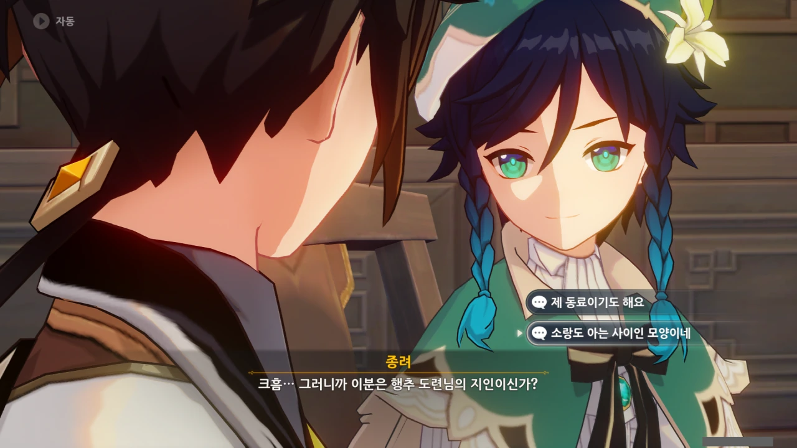

아, '종려'와 벤티는 지금 처음 만나는 거지, 참. 서로의 진짜 정체인 모락스와 바르바토스는 서로 오래전부터 알고 지낸 친구지만 말이다.

지금의 일곱 집정관 중 아직 세대교체가 되지 않은 집정관은 바르바토스와 모락스 단둘뿐이다. 나머지 집정관은 전부 세대가 최소 한 번씩은 바뀌었다.

물론, 라이덴 에이와 부에르는 이야기가 조금 애매하다.

라이덴 자매는 세대교체가 아니라 자매교체(?)에 가깝고, 부에르는 세계수 역사 개변으로 인해 전대 풀의 신인 룩카데바타가 한 모든 것이 부에르가 한 것으로 역사가 바뀌었으니 말이다.





이런 분위기에 영 익숙지 않은 것인지, 소가 자꾸만 말실수한다.

그럴 법도 한 게, 소의 입장에선 자기 상관과 그 친구가 일반인 코스프레를 한 채 옆에 앉아있는 꼴 아닌가. 마치 장성들이 사복 차림으로 잠행 나온 걸 알아본 장교와 같은 심정일 거다.

그래서 그런지, 벤티가 아예 '나는 평범한 음유시인이다'라고 대놓고 장단을 맞추라고 힌트를 던져준다.



아예 맞장구쳐줄 상황까지 말을 맞추라며 던져준다.



말은 저렇게 했지만, 실상은 예전처럼 벤티가 소의 업장을 달래준 것이 틀림없다.

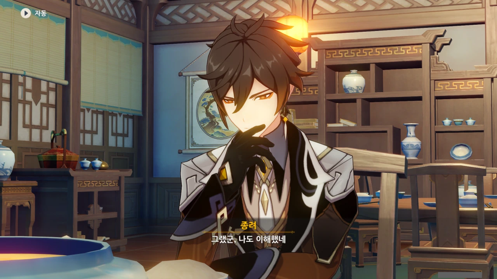

> 그랬군. 나도 이해했네.

마치 종려가 '아, 그런 설정이군요. 이해했습니다'라고 말하는 것처럼 들린다.



일단 '종려'와 벤티는 처음 만나는 사이이니, 첫 인사가 오간다.

서로의 속내를 숨기고 마치 처음 만나는 것인 마냥 인사를 나누는 이 장면이 보는 입장에선 너무 짜릿하다.



와, 호두가 "똑똑하고 믿음직스러운 사장"이란 칭찬을 듣는 거, 처음 보는 거 같아.

물론 호두가 왕생당 일을 제대로 처리한다는 점에서 저 칭찬을 듣는 게 당연하지만, 호두의 평소 행동이 그 평가를 다 깎아 먹거든...



별것 아닌 정보지만, 모락스 역시 선인이다. 마신이자 최초의 선인, 뭐 그런 거다.

리월의 선인들은 모락스에게서 삼안오현의 힘을 하사받았다는 설정이니, 모락스가 선인의 힘을 쓰지 못하는 것 자체가 이상한 일이다.

다만 지금 종려는 평범한 인간 행세를 하고 있으니, 대외적으론 선인이 아니라고 봐야겠지.



호두가 열심히 선인인 소에게 '종려, 선인 맞지? 그치?'라고 물어보지만, 어찌 소가 대답할 수 있겠는가. 종려는 지금 일반인 코스프레 중이라고.



그 와중에 페이몬은 눈치 없게 소가 지식이 풍부하고 아는 게 많다고 하는데... 눈치 챙기자, 페이몬.

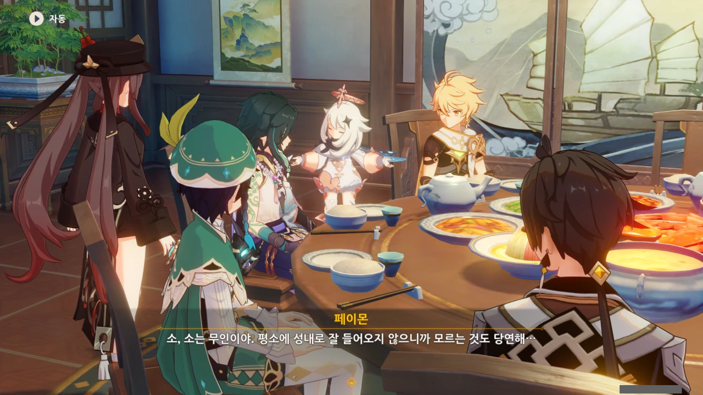

페이몬도 어찌저찌 말실수를 바로잡는 데 성공했다.



이건 내가 봤을 때, 벤티가 종려를 물먹이려는 것이 분명하다.

아무리 봐도 저건 '엌ㅋㅋ 술집에서 차를 시키는 사람이 어디 있음? ㅋㅋㅋ'이라고 놀리는 것 아닌가.



그에 반해 종려는 벤티의 말에 맞받아치지 않고 벤티를 "우아하고 친근하다", "작품이 참신하고 생동감 넘친다"라고 칭찬한다.

이... 이게 어른의 품격? 여기서 벤티가 더 촐싹대다간 '우아하고 친근한 음유시인'이 아니게 되어버리니까, 대놓고 맞받아치는 것보다 더 효과가 좋은 셈이다.



와, 저런 직설적인 표현의 노래가 몬드에 돌아다닌다고? 벤티가 매번 음유시인 1등을 먹는 게 곧바로 이해가 되네.





> 덩굴 위에 늙은 박이 지붕 위에서 꽃을 피웠네.

박이 봄에 꽃을 피우는지는 잘 모르지만, 조금 전 본 것보단 확실히 멋들어진 표현이다.



> | | |
> |:--|:--|
> | 호두 | 악수, 악수! |
> | 벤티 | 악수, 악수! |
> {_borderless=true,_thead=false}

어휴, 정말 둘이 죽이 착착 잘 맞는다니까...







나머지 사람들은 호두와 벤티의 대화 흐름을 전혀 따라가지 못하고 있다.

내가 봤을 때, 얘네들이 대화의 흐름을 따라가지 못하는 건 문학적 소양이 부족해서가 아니라 저 둘이 나사가 같은 방향으로 풀려있어서 그런 게 아닐까 싶지만...

&nbsp;

그래도 페이몬이 평소 별명 짓는 걸 보면, 페이몬은 그래도 책을 좀 읽어야 해. 페이몬이 짓는 별명은 너무 구려!



벤티는 해등 음악회가 열린다는 소식을 듣고 리월에 찾아왔다고 한다.

하지만 이번 해등 음악회는 예정에 없다 급작스럽게 개최된 것이라, 내년에도 개최될지 아직 확실치 않다. 드보르작이 리월 칠성과 협의한다고는 했지만, 결론이 아직 나지 않았고. 게다가 이번 음악회는 이미 끝났잖은가.

벤티, 너무 늦게 왔어.



응? 벤티가 이미 석문에서 드보르작을 만났었다고? 지금 드보르작은 리월항 부둣가에 있을 텐데? 설마 벌써 거기까지 갔다 온 거야? 그건 아닐 텐데...

아니면 이런 순서일 수도 있겠다.

드보르작이 리월로 향하던 중, 석문에서 벤티와 먼저 만났다. 이후 드보르작은 경책 산장 아래쪽을 지나다 여행자 일행과 만났다. 해등절 이벤트 스토리가 진행되고, 벤티가 맨 마지막에 리월항에 도착한다.

하지만 이것도 좀 이상한 설명인 것이, 드보르작은 폰타인 사람이므로 리월에 올 때 몬드와 리월 사이에 있는 석문을 거쳐 오기보다, 리월과 폰타인 사이에 있는 교영 마을을 통해 왔을 가능성이 더 높다. 굳이 빙 돌아서 올 이유가 없단 거지...

대체 뭔 일이 있었던 걸까?



아, 이럴 줄 알았으면 여기 들어오기 전, 주변에 벤티가 있나 없나 한 번 살펴보는 거였는데...

그런데 또 다르게 생각해 보면, 아마 주변을 둘러봤어도 벤티를 찾지 못했을 가능성이 높아 보인다.





갑자기 종려가 새로운 한 해의 시작을 함께할 수 있어 기쁘다며 모두에게 차를 올린다.

아니 갑자기 여기서 이러시면...



벤티가 불청객이니 뭐니 해도, 일단은 음유시인이다. 벤티가 있어서 분명 분위기가 더 재미있어졌을 것이다. 음유시인이 그런 거 하나 못하면 음유시인 딱지를 떼야지.

사실 벤티가 틈만 나면 종려를 물먹이려고 하는 게 제일 재미있지만.



호두가 사려 깊은 결정을 했다. 이 연회 이후, 다른 일정이 있는 참가자가 있을 수 있으니, 술 대신 차를 골랐다고.



그나저나 아까 전부터 종려가 차를 올리고 벤티도 차를 올릴 때, 소가 옆에서 '아...', '음...' 이러더라. 어디가 불편한가 하여 자리를 피할 구실을 만들어 주었다. 뭔가 할 말이나 마음에 짚이는 게 있는 걸까?

잠깐 나가서 걷자고 하니, 곧바로 한 치의 망설임도 없이 "그래"라고 답하는 소.





연회의 주인인 호두의 허락도 받았겠다, 소와 함께 자리를 뜬다.

페이몬이 같이 갔다간 소가 불편해할지도 모르니, 페이몬은 자리에 남겨두었다.

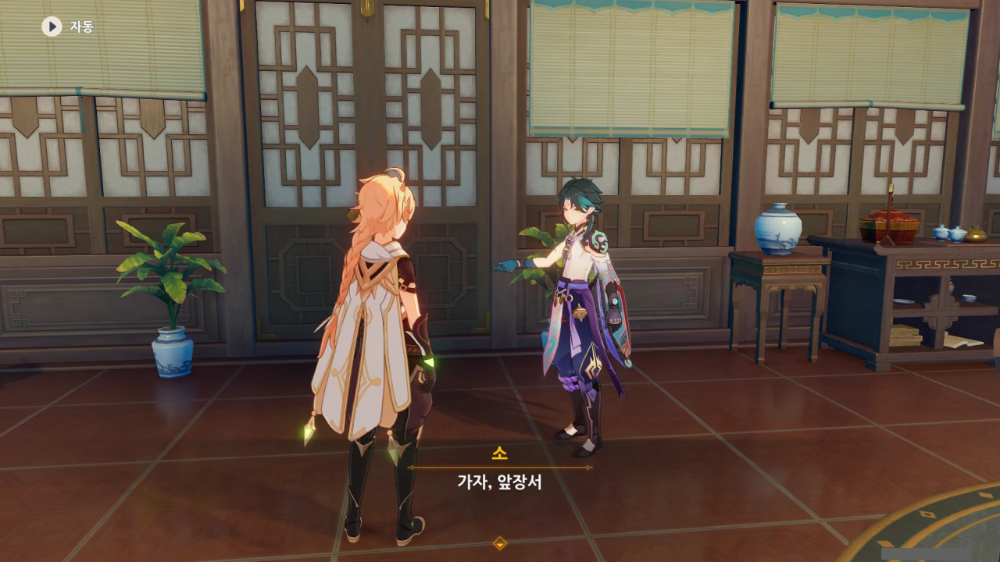

자리에서 일어난 후, 소에게 말을 걸자, 먼저 앞장서라고 한다.

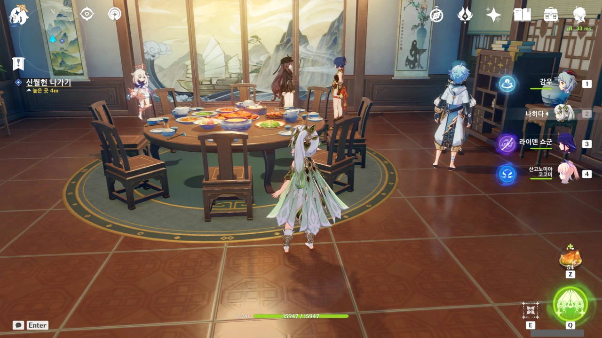

하지만 주변을 돌아보면 이렇게 말을 걸 수 있는 사람들이 더 보인다.

여기서 곧바로 신월헌을 나가는 건 이 스토리를 놓치는 일. 전부 하나하나 말을 걸어보기로 했다.

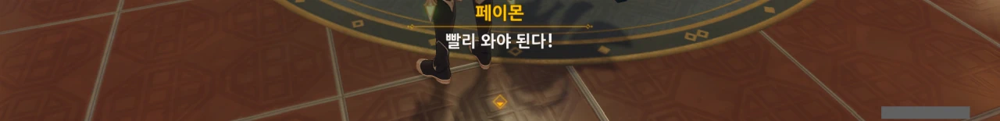

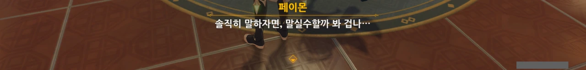

페이몬은 여행자가 없는 동안 저도 모르게 말실수할지 겁내며, 여행자에게 빨리 돌아오라고 한다.

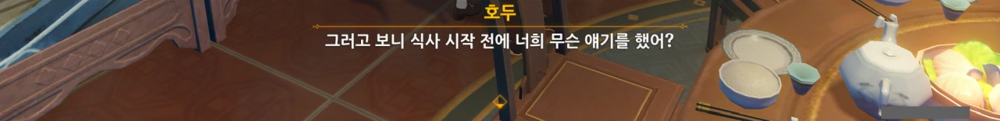

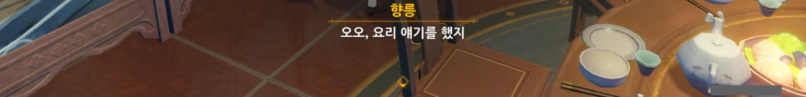

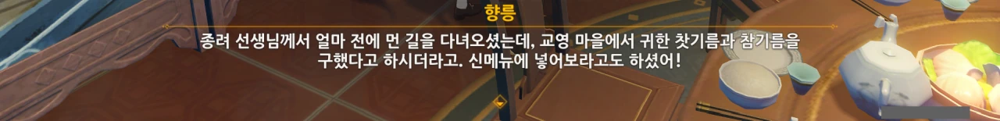

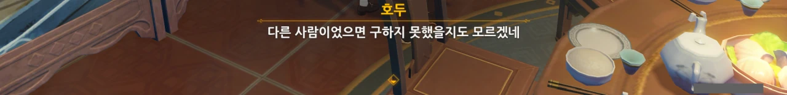

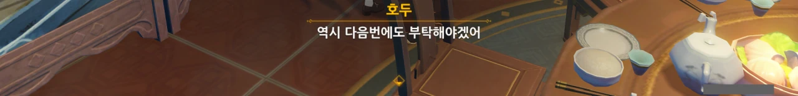

최근 교영 마을이 자주 언급된다.

처음 들었을 땐 발견해 놓고 까먹은 마을 이름인 줄 알았는데, 아직 구현되지 않은 지역에 있는 리월의 마을이라고 한다. 리월에서 유명한 마을이라고 하는데, 정작 원신 플레이어들은 단 한 번도 방문해 본 적 없는 마을인 셈이다.

이러니 마치 중간장 이야기로 끼워 넣은 신학이 생각나는걸.

교영 마을은 리월 북서쪽에 있다고 하는데, 아마 민림과 벽수원 인근에 있을 것이다. 본이 이벤트에서 본이가 한 말에 따르면 교영 마을은 폰타인과 맞닿은 곳에 있다고 하니, 아마 폰타인이 구현될 때 같이 구현되지 않을까 한다. 수메르가 구현될 때도 층암거연 쪽 일부 지역이 같이 구현된 걸 생각하면 더더욱 그럴 것 같다.

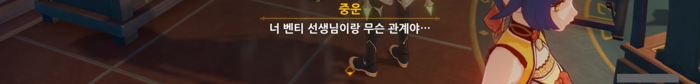

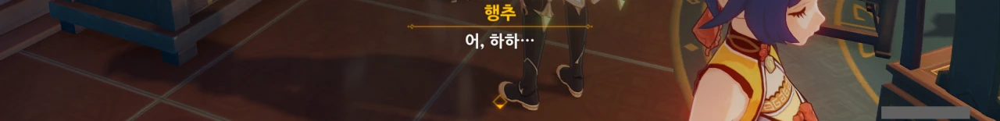

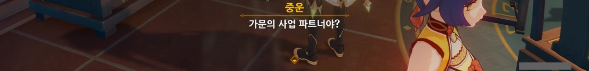

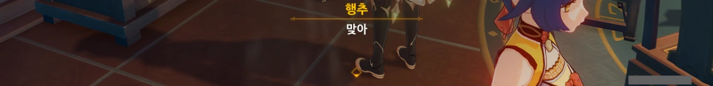

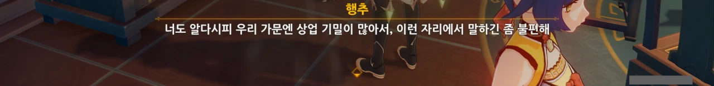

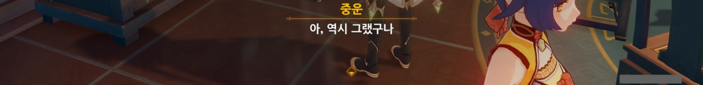

벤티와 어떻게 알게 되었냐고 묻는 중운에게 행추는 자기가 '침옥'임을 밝힐 수 없어 '가문의 상업 비밀'이라고 둘러대고 있다.

여기서 이로도리 이야길 꺼낼 순 없겠지...

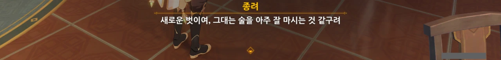

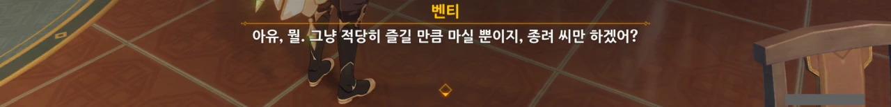

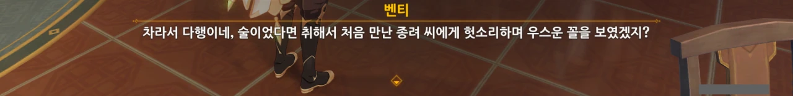

종려와 벤티 둘은 일단 처음 보는 사이지만, 서로 죽이 잘 맞는 모습을 보인다. 뭐, 둘이 알고 지낸 시간이 몇천 년이나 되니 당연한 말이지만.

벤티가 옛날에 술에 잔뜩 절어 종려 머리에 술을 들이부었다는 이야길 들은 적이 있는데, 벤티가 언급한 게 그 이야긴 아니겠지?
