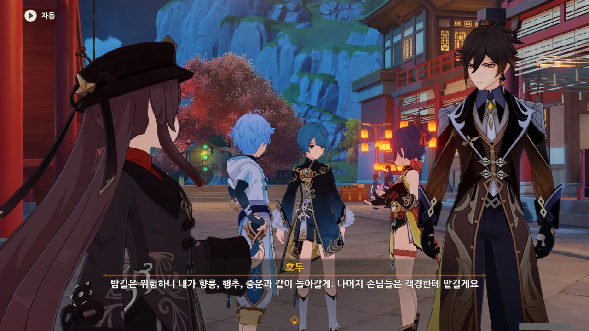



사람이 모였으면 헤어질 때도 있는 법. 마지막에 사람 배꼽 잡게 한 연회도 어느덧 끝날 때가 되었다.



이제 모두와 작별할 시간이다.

호두는 향릉, 행추, 중운을 바래다주고, 나머지는 종려가 바래다주게 되었다.

뭔가 인원 배분이 의도적인 것처럼 보이는데, 나만 그렇게 느끼는 걸까? 종려와 함께 움직이는 건 벤티, 소, 여행자, 페이몬 이렇게 넷이니까.



벤티는 배에 탄 친구를 만나기 위해 바다 쪽으로 갈 거라고 한다. 아마 카즈하를 말하는 거려나.

그런데 왜 이게 내 눈에는 그동안 종려를 실컷 놀려먹은 벤티가 머리 위에 종려의 천성이 떨어지기 전에 재빨리 도망가는 걸로 보이는 걸까.



> 봄바람이 불어올 때 다시 만나자!

바람의 신다운 말을 남기고 벤티는 먼저 떠났다.



호두 역시 다른 사람들을 바래다주러 떠난다.

그런데 호두가 종려에게 부탁할 만한 일이 또 뭐가 있을까? 설마 이번에도 참기름 심부름은 아니겠지?





자신을 여전히 암왕제군이라 부르는 소에게 종려는 지금 자신은 평범한 인간으로 살고 있으니 편하게 '종려'라고 부르라고 한다. 게다가 지금 지위로 따진다면 일반인인 종려가 오히려 소에게 '선인님'이라고 불러야 할 것이라고 덧붙인다.



소는 앞으로 종려에게 '선인님'이라고 불리는 것이 익숙해져야 할 테고, 장난기도 돌아, 소에게 '선인님'이라고 불렀더니 단순히 장난치는 것으로 받아들여졌다.

어... 음... 장난은 맞는데 무턱대고 친 장난은 아닌데.



> 같은 역사일지라도 시선에 따라 달리 보이는 법. 기록하는 자가 많아지면 같은 이야기도 전하는 감정과 형태가 달라진다네.

무슨 말인지 알 것 같기도 하다.

우리에게 있어 류운차풍진군은 좀 주책맞은 아줌마지만, 대다수의 리월항 사람들에겐 고고한 선인으로 보이겠지. 그런 것처럼, 역사도 누가 기록하냐에 따라 거기에 담긴 시선이 달라지는 것이다.



소라야가 누군가 했는데, 귀리 평원에서 만날 수 있는 수메르 역사학자였다. 여행자가 소라야에게서 귀리 평원에 있는 비석의 조사를 의뢰받아 해결하면서 그녀에게 귀종 등 과거의 마신들에 대해 많은 걸 들을 수 있었다고 한다.

소라야의 말이 그냥 배경지식으로 끝날 줄 알았는데, 종려의 말에 따르면 소라야의 연구는 진실에 가깝다고 한다.

여전히 암왕제군과 선인을 숭배하는 리월 사람들과 달리, 그녀는 제삼자인 수메르 사람의 시선으로 과거를 바라볼 수 있어 진실에 한층 더 가까이 갈 수 있었던 게 아닐까?





역사가 그러하듯, 사람 역시 보는 사람에 따라 평가가 달라진다.

류운차풍진군이 우리에겐 그저 친한 아줌마로 여겨지지만, 리월 사람들에겐 고귀한 선인으로 보이는 것과 마찬가지겠지.



> 그러니 어떤 일들은 너무 개의치 말게나.

응? 이건 무슨 뜻이지? 설마 다른 사람들이 종려를 편하게 부르는 것에 대해 너무 민감하게 반응하지 말라는 뜻인가?





거기에 소가 뭐라 말하려 하자, 종려는 '이 정도면 내 말을 충분히 이해했을 테니, 난 먼저 가보겠다'라는 말을 남기고 가버린다.

'일반인 종려'의 페르소나를 쓴 암왕제군을 받아들이는 걸 소에게 숙제로 남긴 셈이다.



분명 종려라면 여기서 '만남이 있으면 헤어짐 또한 있는 법'같은 말로 엘레강스한 장문을 하나 뽑아내지 않았을까?



이렇게 페이몬이 의기양양해하는 모습은 정말 처음 보는 것 같다.

페이몬이 '으에'라며 시무룩해하는 모습은 자주 봤는데.





소는 예정보다 더 오래 자리를 비웠다며, 돌아가려 한다.

소도 이제 리월항의 경치를 즐길 수 있는 여유를 가졌으면 좋겠는데...



소 이 녀석, 풍륜양립 남발하지 말라니까 또 기어이 쓰네... 어쩌면 이제 풍륜양립은 '소'하면 떠오르는 아이콘 같은 것이 되어버렸는지도 모른다.
