해등절 이벤트 메인 스토리는 모두 끝났지만, 후일담처럼 곳곳에 NPC가 남아있어 이야기를 더 들어볼 수 있다.

그리고 아니나 다를까, 누군가가 NPC 위치를 이미 다 정리해서 이미지로 만들기까지 했더라.



***

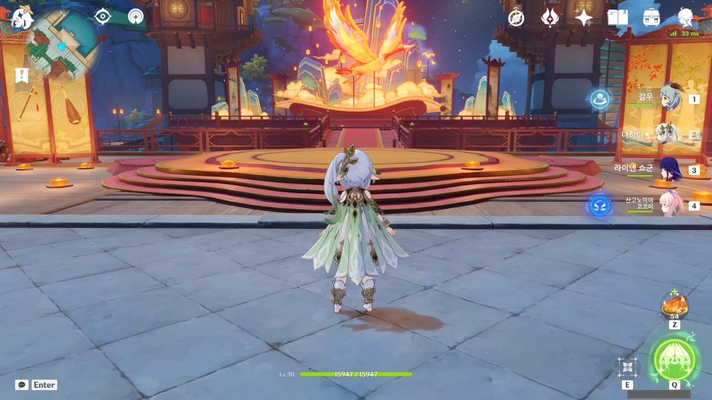

여긴 뭐 달라진 게 없는 것 같다. 아니면 너무 사소하게 바뀌어서 내가 발견하지 못한 것이거나...

# 신염 & 운근{id="xinyan-yunjin"}

여기엔 신염과 운근이 있다.

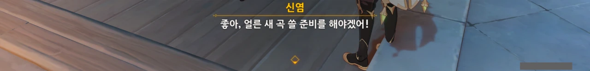

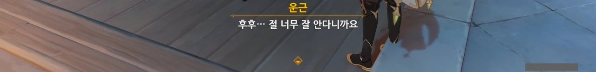

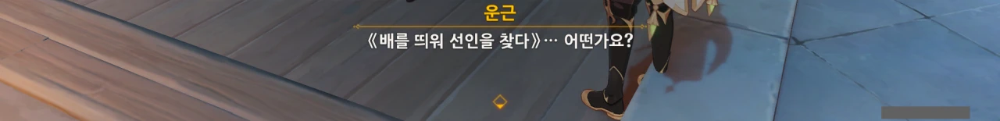

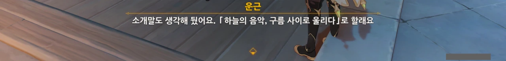

벌써부터 다음 곡과 연극에 대한 구상으로 여념이 없는 모습이다.

# 백출 & 치치{id="baizhu-qiqi"}

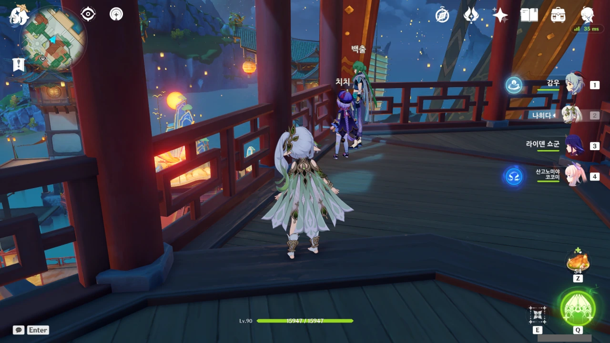

공연장이 내려다보이는 곳에 백출과 치치가 있다.

백출은 평소 하는 것만 보면 착실히 약사 일을 하는 것 같은데, 그러면서 뒤에서 뭔가 이상한 일을 꾸미고 있다는 정황이 곳곳에서 발견되는 탓에 볼 때마다 뭔가 불편하다.

당장 치치를 데리고 있는 것도 영생을 연구하기 위해서라는 말이 있거든.

***

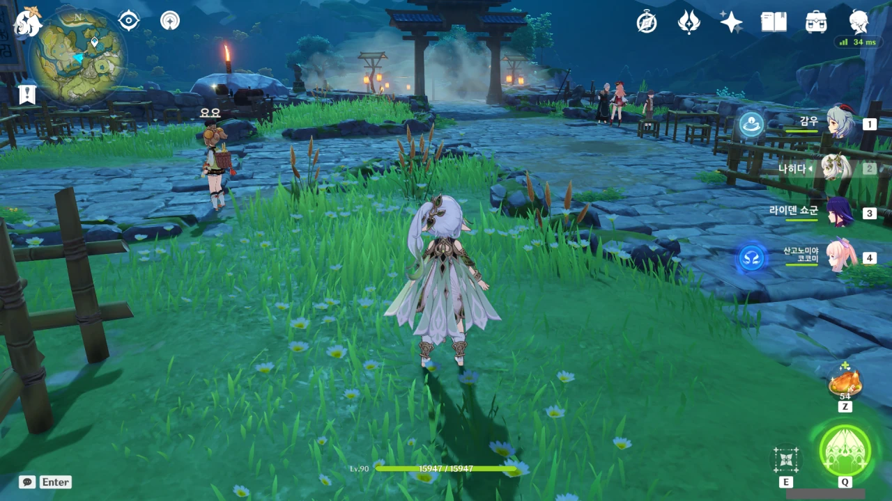

경책 산장에는 요요와 연비, 평 할머니가 있다.

일단 요요부터.

# 요요{id="yaoyao"}

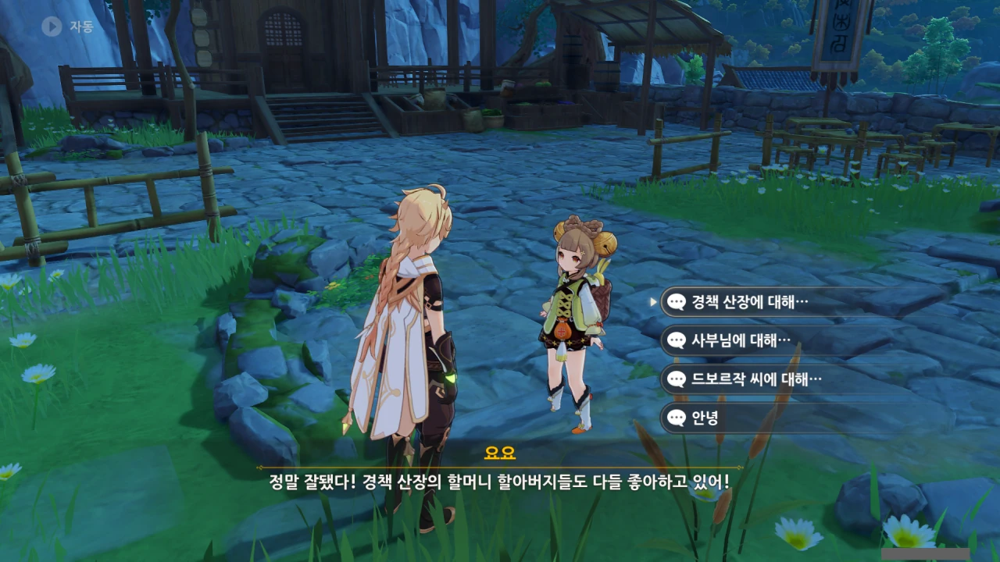









경책 산장은 아무래도 리월항에서 거리가 꽤 되니까 요요가 어르신들에게 노래를 해드린 것 같다.

경책 산장에 사는 사람 대다수가 노인이기도 하고...















평 할머니가 요요에게 지금은 없는 옛 선인들에 대한 이야기를 종종 해주었나 보다.













아, 귀여워라...



# 연비 & 평 할머니{id="yanfei-madame-ping"}

다음은 연비와 평 할머니다.

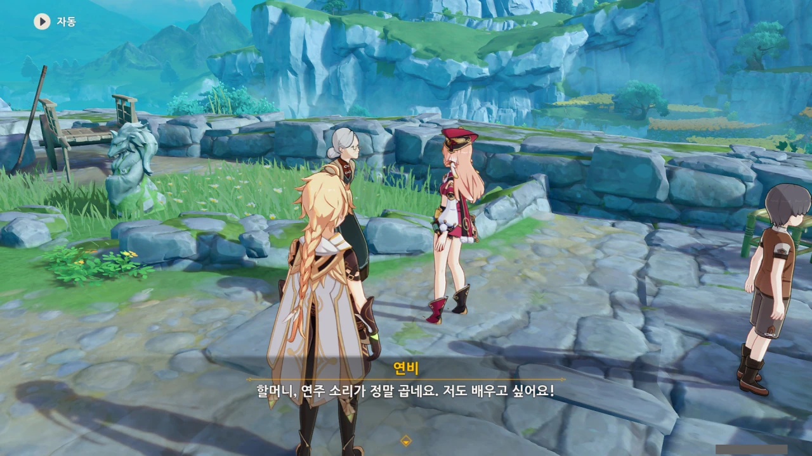

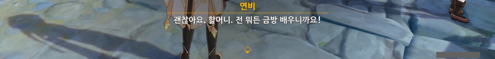

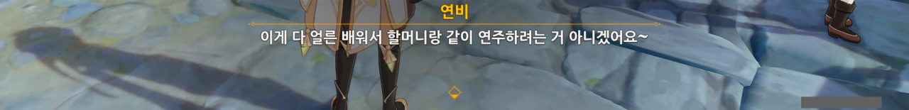

연비가 평 할머니에게 금을 배우려고 한다.

이렇게 연비가 평 할머니에게 금 연주를 배운다면, 나중에 평 할머니도 금을 뜯을 때 예전처럼 그렇게 슬프지만은 않을 것이다.

***

# 드보르작{id="dvorak"}

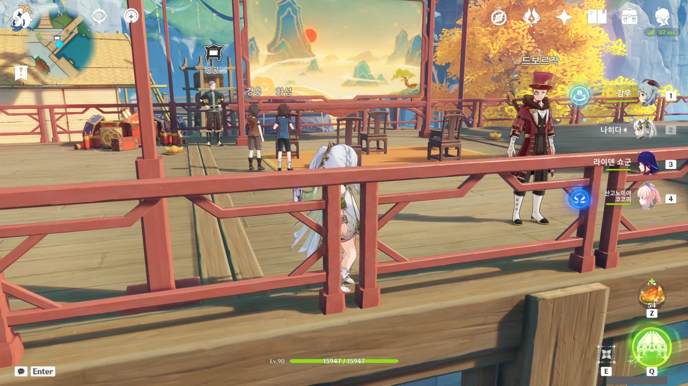

드보르작은 종이극을 공연하던 장소에 있다.

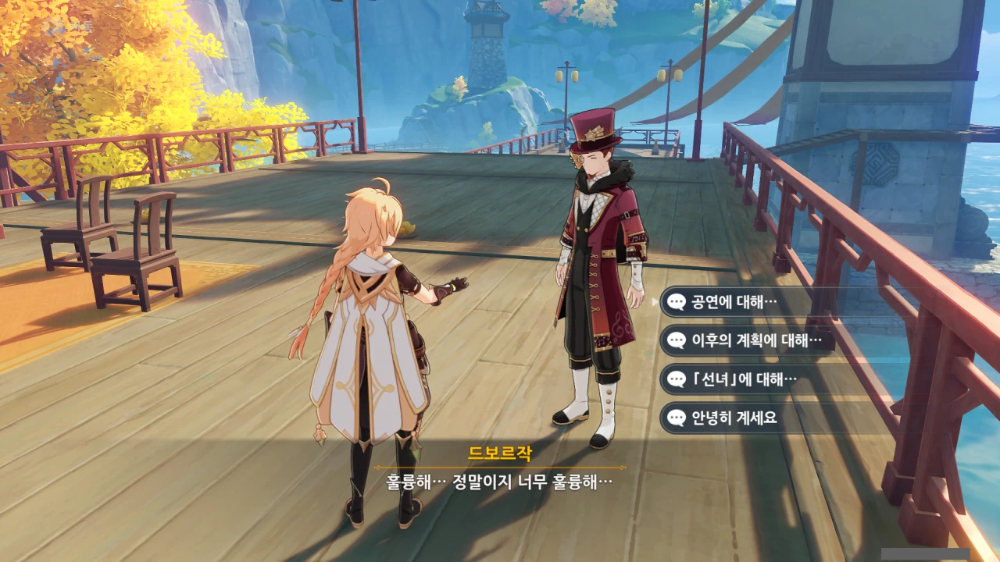









음악회 때 평 할머니의 연주를 말하는 거겠지. 확실히 마지막의 합주 부분은 정말 아름다웠다.











오... 해등 음악회가 이번처럼 일회성 이벤트에 그치는 게 아니라, 정기적으로 열리는 해등절 행사의 일부가 될 가능성이 보이는 것 같다.

이번 음악회가 무지갯빛 투어가 리월에서 열린 것이니, 아예 해등절과 분리해서 정기적으로 투어를 리월에 유치하는 것도 생각해 볼 수 있겠다.













음악회가 끝나자마자 곧바로 평 할머니에게 가서 감사 인사를 전했나 보다. 평 할머니의 말을 듣고 '우리 시대에 걸맞은 음악을 만들어내겠다'라고 각오를 다지는 모습이 매우 보기 좋다.



***

# 북두 & 응광{id="beidou-ningguang"}

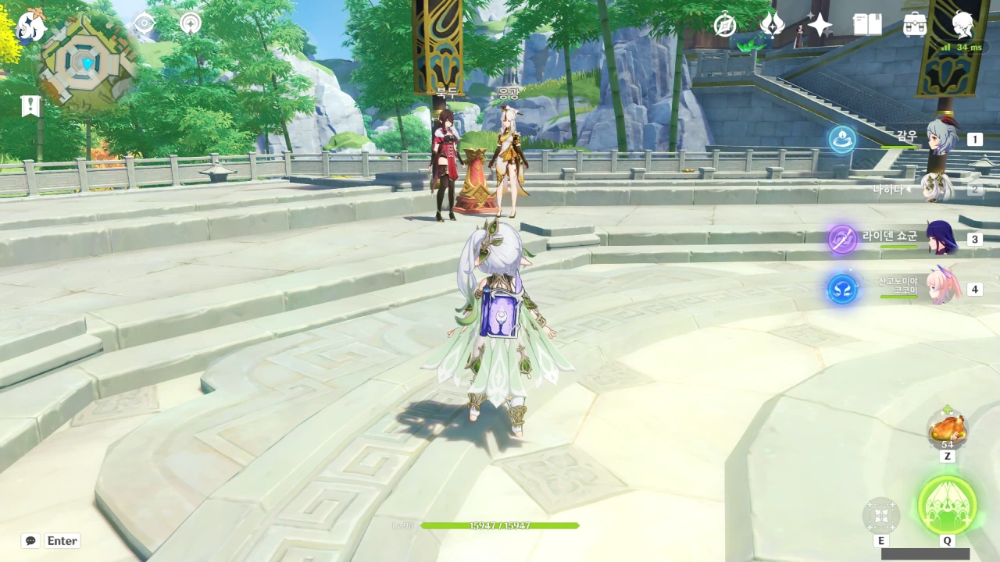

북두와 응광은 옥경대에 있다.

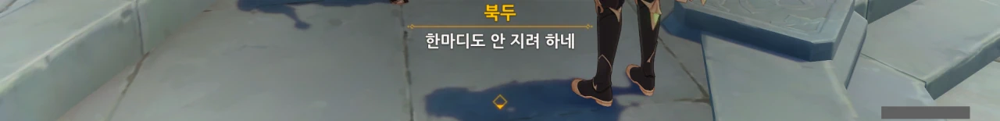

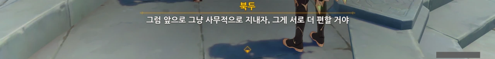

거 참... 둘이 참 살벌하게 다툰다. 처음 봤을 때 나도 모르게 '뭐야? 여기서 북두와 응광이 서로 갈라서는 거야? 분명 저번만 해도 같이 밥 먹는 사이 아니었어?'라고 생각했을 정도니.

그나저나 북두는 암상 찻집의 주인인 야란이 응광 밑에서 일하고 있는 걸 이미 알고 있었구나. 암상 찻집의 주인이 바뀐 것도 얼마 안 된 거로 아는데...

***

# 종려 & 누룽지{id="zhongli-guoba"}

종려와 누룽지는 만민당에 있다. 설마 호두가 시킨 심부름이 만민당 일을 도우라는 거였어?

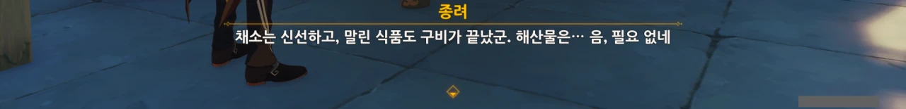

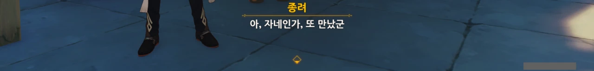

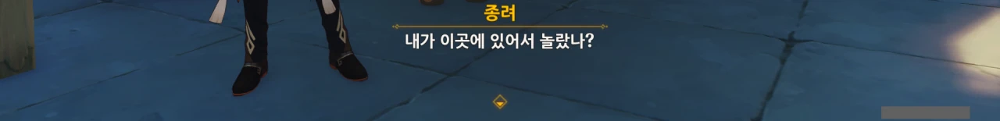

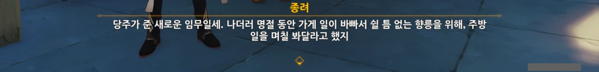

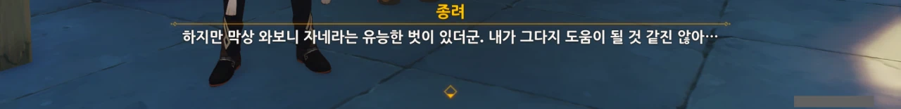

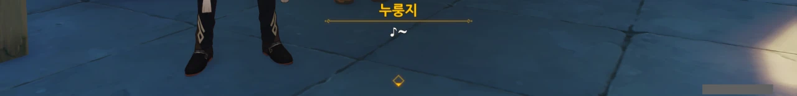

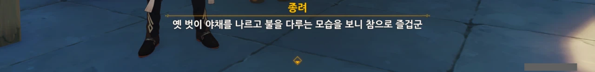

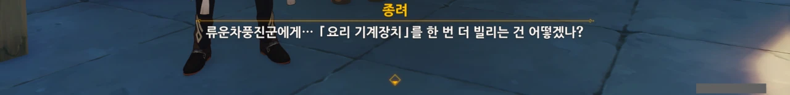

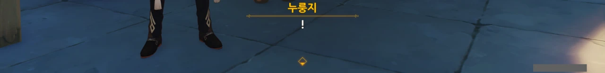

아니, 정말? 정말 호두가 만민당 일을 도우라고 종려를 보낸 거였어?

종려와 만민당 일은 뭔가 어울리지 않는다고 생각했는데, 정말로 종려는 "내가 그다지 도움이 될 것 같진 않아..."라며 난색을 보이고 있다.

놀라운 점이라면... 일단 누룽지가 요리 재료를 나르고 요리를 하고 있다는 거고, 그다음은 종려와 누룽지가 서로 말이 통한다는 거다.

여기가 비좁아서 그렇지, 공간이 충분했다면 분명 종려는 류운차풍진군에게서 「요리 기계장치」를 빌려와 요리했을 것만 같다.

***

# 중운 & 향릉 & 행추 & 호두{id="chongyun-xiangling-xingqiu-hutao"}

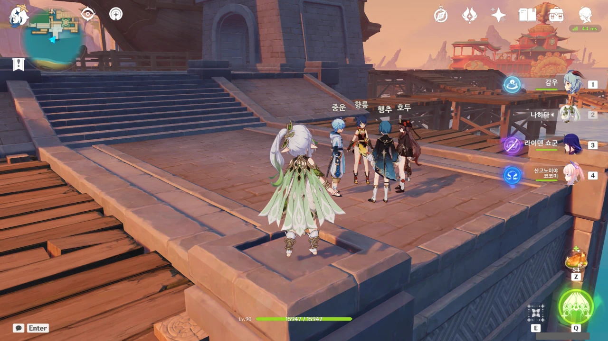

이 넷은 리월 부둣가에 모여 있다. 너무 길어서 이건 접은 글에 넣기로 했다.



























































아무래도 연회에서 벤티와 행추가 '침옥'에 대해 얼버무린 것이 호두에게 간파당한 건지, 호두에게 추궁을 당하고 있다. 그리고 행추는 이를 덮기 위해 거짓말에 또 다른 거짓말을 덧대고 있다. 이번엔 행추가 벤티의 팬이라는 설정이 추가되었다.

그나저나 중운 역시 행추의 필명에 대해 알고 있었구나. 난 왜 이렇게 까먹은 게 많은 거지?



***

# 벤티 & 카즈하{id="venti-kazuha"}

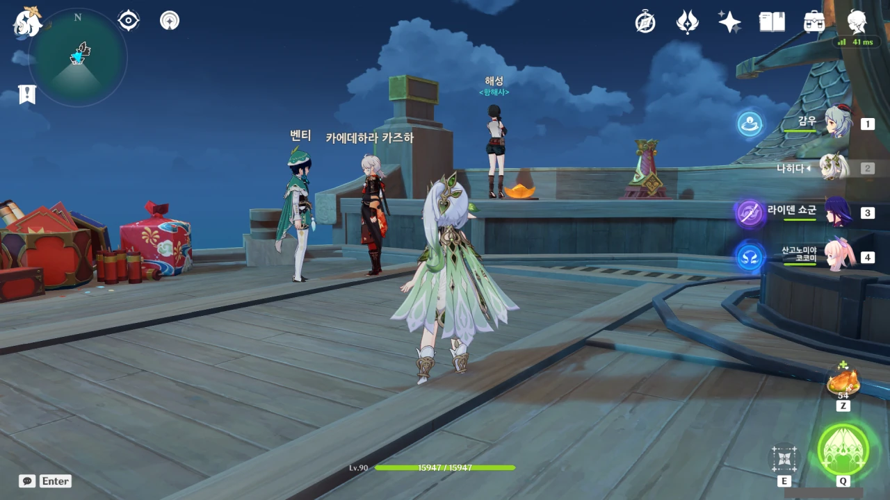

벤티와 카즈하는 사조성 호 위에 있다. 역시 벤티가 만나러 가는 사람은 카즈하였어.



































벤티는 몬드에서도 그러더니, 여기서도 체형 때문에 술을 마시지 못하고 있다. 저런 ㅋㅋㅋ

카즈하도 나이가 덜 찼다고 얄짤없이 술이 없는 자리에 앉히는 북두가 잘도 벤티에게 술을 주겠다.

아아, 벤티. 너는 술을 마시고 싶어도 마실 수 없는 운명이야! 어림도 없지!



***

# 소{id="xiao"}

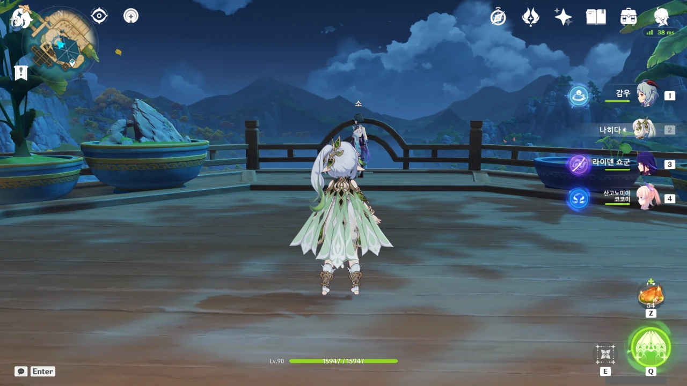

소는 늘 그래왔듯, 망서 객잔에 있다.

아직 향릉이 준 행인두부도 다 먹지 못했는데, 언소가 또 행인두부를 주고 갔다고 한다. 결국 다 먹지 못하고 받은 행인두부의 일부를 여행자에게 나눠주는 소.

흠... '속세의 불꽃'이라...

***

이리하여 '선율이 흐르는 밤' 이벤트가 모두 끝났다.
