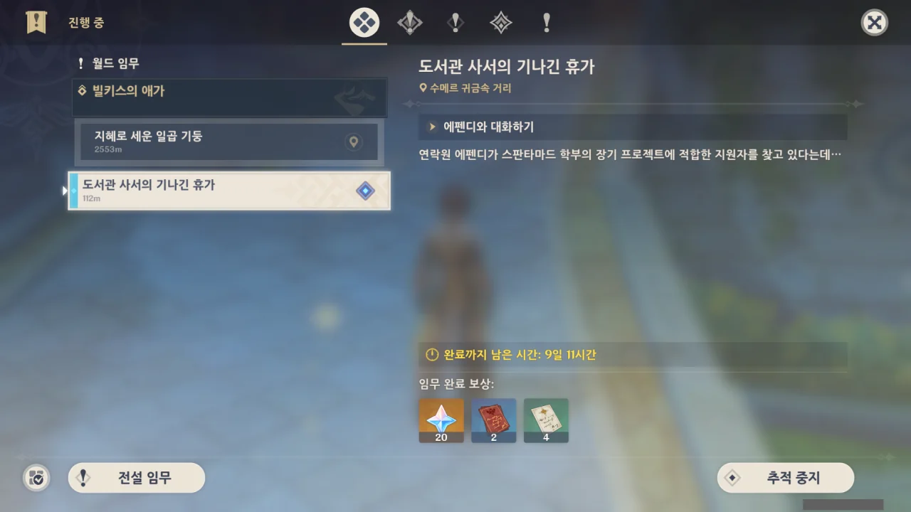

별생각 없이 임무 창을 열었다가 기간 한정 이벤트 임무를 발견했다. '도서관 사서의 기나긴 휴가'...? 이벤트 창을 확인해보니, 리사 신규 의상 관련 이벤트로 보인다.

&nbsp;

아아, 빌키스의 애가인지 밀키스의 애가인지 아무튼 그 월드 임무도 얼른 진행해야 하지만, 너무 귀찮다.

게다가 요즘은 다른 게임 하느라 원신은 뒷전인걸.

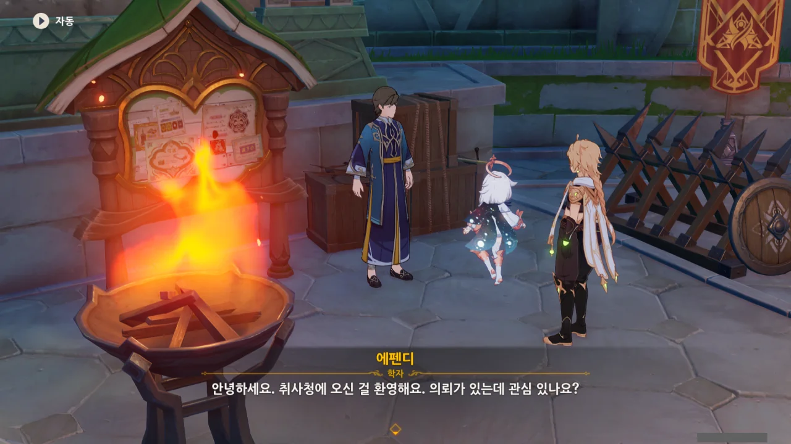

에펜디가 누구인지 잠깐 고민했었는데, 주간 수메르 평판 임무를 할 때 매번 마주치는 그 NPC이다.

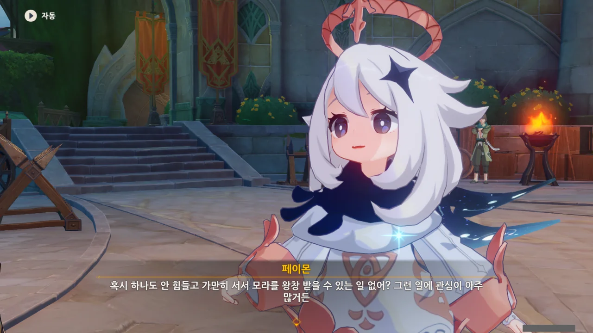

페이몬은 오늘도 무위도식의 삶을 꿈꾼다. 아무것도 안 하면서 모라는 왕창 버는 일이 있을 리가 없잖아.



음... 몇만 모라? 상점 한 번 방문하면 사라지는 돈이잖아. 비교적 쉬운 주민 의뢰라서 정말 심부름값만 주는 거야?

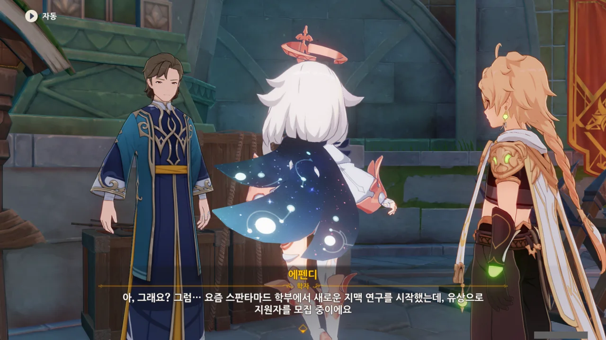

솔직히 말해, 아카데미아 학부 이름은 정말로 외우기 힘들고 직관적이지 않다. 대체 누가 '스판타마드'라는 말을 듣고 '아, 스판타마드는 원소를 주로 연구하는 학과구나!'라고 곧바로 떠올릴 수 있겠냐고.

위키를 뒤져보고 나서야, 스판타마드 학부가 '소론파'라고도 불리는 걸 알게 되었다. 소론파는 앞서 말했듯이, 주로 원소와 관련된 연구를 진행하며, 이때문에 파견 연구원인 '드라요쉬'가 제일 많은 학파라고 한다.

젠장, 이거 일일 임무에서 아카데미아 퀴즈가 나올 때마다 매번 틀린 문제였는데.



'아, 그런가 보다'하고 그냥 넘겨도 될 일이지만, 저 말을 듣고 '대체 원소와 지맥에 무슨 상관관계가 있는 거지?'라는 생각을 하지 않을 수 없더라.

그런데 정말 모르겠다. 내 기억 속의 지맥은 노란색과 파란색 버섯구름, 아니면 라이덴 전설 임무에서 나온, 신성한 벚나무의 수액에서 나온 과거의 기억 정도밖에 없다고.

&nbsp;

그나저나 대체 뭘 어떻게 해야 학부 학생들을 총동원해도 일손이 모자랄 수 있는 거지? 설마, 너희 또 이상한 일 꾸미고 있는 거 아냐?

수메르에서 이상한 일이 일어났을 때, 그 배후로 아카데미아 혹은 우인단을 찍으면 십중팔구 들어맞는다. 당장 저번 알하이탐 전설 임무에서 나온 '집단의식'인가 뭔가 하는 것도 아카데미아의 학자가 무단으로 꾸민 일이었잖아.

이거 수상한데...



게다가 지원자에 대한 요구 조건도 까다롭다.

난 여행자가 한손검 이외의 무기를 쓴 걸 본 적이 전혀 없으니, 솔직하게 "전 한손검에 통달했죠"라는 선택지를 골랐다.

원소에 대해 얼마나 아냐는 질문에는 원소 반응을 아주 잘 알고 있다고 말하면 '그 정도로는 충분치 않다'라는 대답을 들을 것 같아, "원소의 힘을 사용한 전투 경험이 풍부하죠"라는 대답을 골랐다.

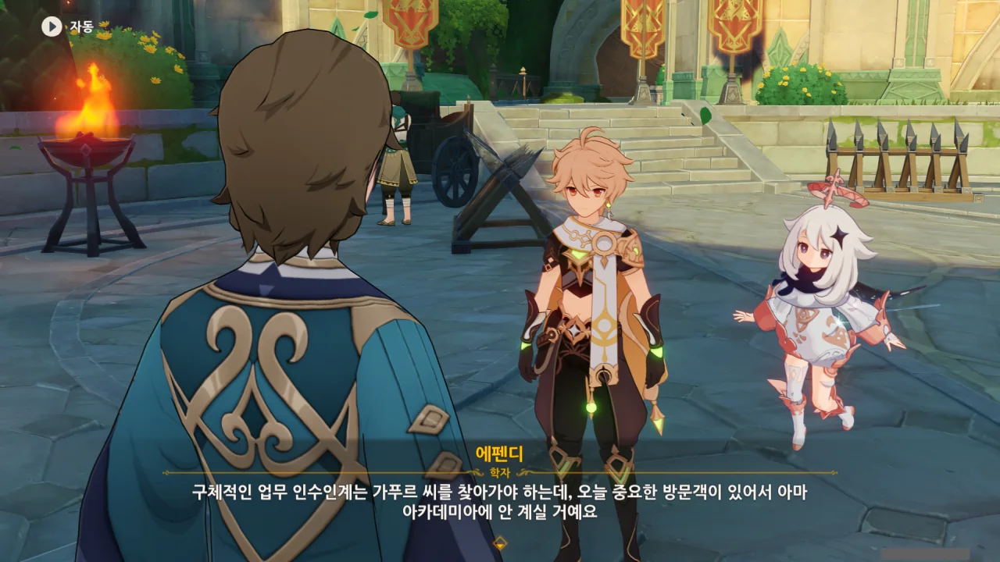

요구 조건은 충족했지만, 정작 업무 인수인계를 하기 위해 만나야 하는 '가푸르'라는 사람이 아카데미아에 현재 없다고 한다.

중요한 손님을 만나기 위해 자리를 비웠다는데... 분명 리사를 만나러 간 거겠지?

그런데 아카데미아를 떠난 리사가 왜 가푸르의 중요한 손님이 된 걸까?



평소 아카데미아와 얽힐 때마다 푸스파 커피숍에 방문하는 것 같다고 생각하고 있었는데, 정말로 그게 '아카데미아 방문객 접대 표준 절차'에 있는 내용이라고 한다. 아니 ㅋㅋㅋㅋㅋㅋ 정말 그럴 줄은 몰랐는데 ㅋㅋㅋㅋㅋㅋ

그러면 푸스파 커피숍은 단순 민간 사기업이 아니라, 공기업이나 그에 준하는 위치에 있는 걸까? 운영에 아카데미아가 깊숙이 개입해 있다거나 뭐 그런 거 말이다.

하지만 푸스파 커피숍에 자주 방문했다고 해서 가는 길에 익숙해진 건 아니다.

난 아직도 여기가 왜 커피숍인지 모르겠어. 이 정도만 보면 그냥 길가에 흔히 널린 가게처럼 보이는데.





커피숍에 들어가니, 두 사람이 대화하고 있는 모습이 눈에 들어온다.

번개 신의 눈의 모양을 보아하니, 저건 분명 리사가 틀림없다. 머리끈의 장미 장식마저도 저게 리사임을 강력히 뒷받침하고 있다.



당초의 프로젝트라... 리사가 아카데미아를 떠나기 전에 진행 중이던 프로젝트를 이야기하는 걸까? '키루스'라는 사람은 리사의 스승이었나 보다. 지도교수 뭐 그런 거겠지.



가푸르가 말한 '허배드'가 뭔지 찾아보았는데, '박학다식하고, 많은 사람을 인도할 수 있는 **현자**'를 부르는 호칭이라고 한다. 각 학부의 부장이 현자라고 불리니, 저 말은 '너라면 분명 학부장이 될 수 있었을 텐데'라고 말하는 것이나 다름없어 보인다. 그렇게 리사가 대단했나...?

정말 리사가 그 정도였나 궁금해하며 리사의 캐릭터 스토리를 살펴보았다. '이백 년에 한 번 나오는 우등생', '아카데미아의 수석 졸업생'이라는 표현이 있는 것으로 보아, 정말 현자가 될 수 있을 정도로 우수한 학생이었던 것으로 보인다.

그런데 내 기억이 맞는다면, 리사가 아카데미아를 떠난 게 '심연같이 끝없는 학식이 사람에게 남기는 흔적', '학식의 혹독한 대가' 때문이었다고 알고 있다.

풀의 신을 감금해 두고 새로운 신을 만들겠다고 덤빈 것이 지금까지의 아카데미아였으니, 당연히 그렇게 생각할 수도 있지...





그런 리사에게 다시 아카데미아로 돌아와달라고 이야기하는 가푸르.

어허, 도서관 사서가 사소한 일이라니. 도서관 사서도 머리가 좋지 않으면 쉬이 할 수 없는 일이라고.

게다가 "아카데미아로 돌아오면 네가 주축이 돼서 할 수 있는 프로젝트가 산더미야"라고 말하는 가푸르의 말에서 그의 검은 속내를 엿볼수 있다.



리사의 말을 들어보니, 리사의 스승인 키루스 역시 리사가 아카데미아로 돌아오길 바랐다고 한 가루프의 말은 새빨간 거짓말이었던 듯하다.

아니, 아무리 그래도 그렇지, 제 스승까지 팔아먹어? 이거 순 쓰레기네.



"지혜를 구하는 데 필요한 대가"... 그래, 저것 역시 리사가 아카데미아를 떠난 이유 중 하나였다.

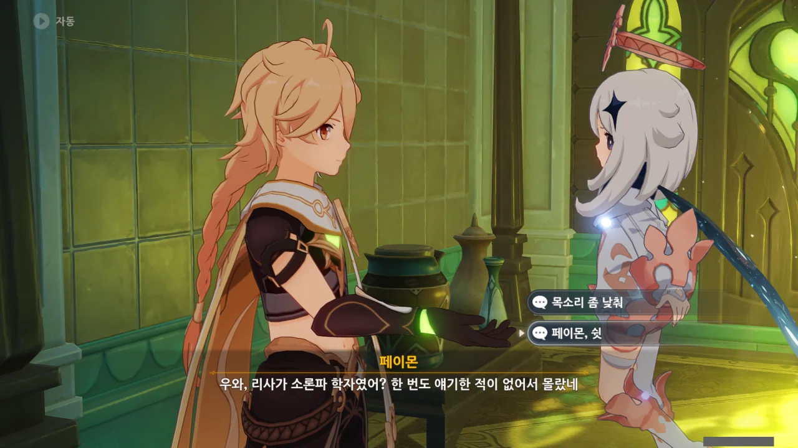

그나저나 페이몬은 눈치도 없이 옆에서 시끄럽게 이야기하고 있다.

이러다 들킨다고, 이 녀석아!



> 왜 네 시간을 도서관 관리같은 사소한 일에 낭비하는 거야?

> 「지혜는 세계의 모든 구석에 숨겨져 있으니, 작은 지혜라도 무시해선 안 된다.」 이건 선생님이 입에 달고 살았던 말이라고요.
> 훌륭한 학자는 사소한 걸 놓치면 안 되죠, 가푸르 선배.

이건 100% 가푸르를 물먹이는 말이다.

'은사 이름조차 팔아먹은 주제에 은사가 했던 말도 제대로 기억하지 못하는 게 말이나 되는 소리냐?'라고 하는 거랑 다름 없잖아.



아, 리사에게 들켰다. 이게 다 페이몬 때문이야.





여행자를 '귀염둥이'라고 부르는 건 여전한 리사.

그런데 리사가 여긴 어쩐 일로 온 걸까? 지금와서 말하긴 좀 이상하지만, 옷도 아카데미아 학생처럼 입고 말이다.



기분이 언짢은 듯한 가푸르가 무슨 일이냐고 묻는다.

아니, 너가 부른 거잖아. 정확히는 의뢰를 맡긴 거지만.



어우, 리사가 저렇게 말하는 걸 보니, 아카데미아에 들어갔다고 하면 '당장 도망쳐'라고 말할 것 같다.

하지만 다행스럽게도, 아카데미아에 들어간 적은 없고, 이번에 온 건 의뢰를 받고 온 거다. 페이몬 말처럼 달달한 모라를 위해 말이다.



그래. 나도 묻고 싶다. 대체 뭘 해야 학부생으로도 모자라 외부인까지 불러 써야 하는 건지 정말 모르겠거든.

가푸르가 정규적인 지맥 관측에 필요한 연구이고, 안전 기준에도 부합하는 작업이라고 하지만, 지금까지 보아온 아카데미아는 그런 규정이 있어도 무시하거나 우회해서라도 자기가 하고 싶은 걸 하는 집단이라 눈가리고 아웅하는 느낌이다.

난 지금 가푸르가 뒤에서 뭔가 이상한 일을 꾸미는게 아닐까 의심된다고.

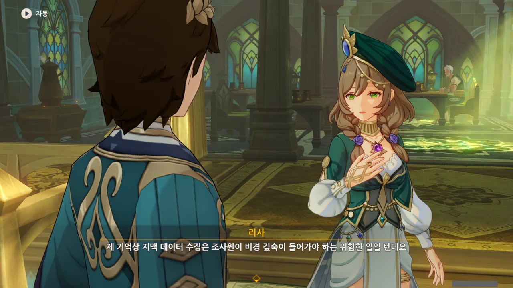

아, 아까 그래서 싸움은 잘하는지 물어본 거야? 비경 깊숙이 들어가서 데이터를 수집해야 하니까?



몬드를 떠난 이후, 여행자는 참 많은 일을 겪으며 성장했다. 리월에서는 선인의 힘을 등에 업고 마신과 싸워보기도 했고, 이나즈마에선 봐준 것이긴 해도 신과 칼을 맞대기도 했다. 수메르에선 미완성 마신과 싸우기도 했고...

이야, 진짜 티바트 전역을 다 들쑤시고 다녔네? 이정도면 비경 탐사 정도는 껌을 질겅질겅 씹으며 해도 될 정도겠다.

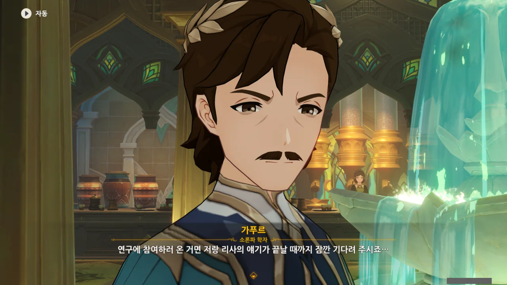

가푸르의 말이 틀린 건 아닌데, 말하는게 뭔가 좀 아니꼽다.

리사와의 대화에 우리가 끼어든 건 맞지만, 가푸르가 저렇게 말하니 '니가 뭔데?'라는 생각이 절로 들더라.







리사가 재차 아카데미아로 돌아갈 생각이 없음을 알리자, 결국 가푸르도 단념한다.

학부 모임이라... 졸업생인 리사가 참여할 수 있다는 점으로 미루어보아, 재학생과 졸업생 모두가 참여할 수 있는 것으로 보인다.

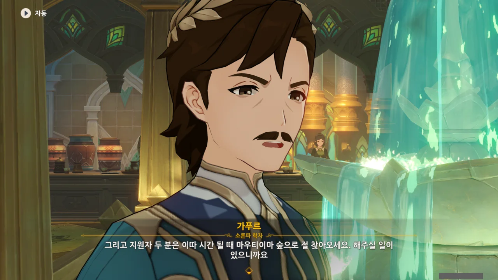

늘 이런식으로 두루뭉실하게 '어디어디 지역으로 와달라'라는 말을 들어왔지만, 가푸르가 저렇게 말하니 '아니, 그래서 마우티이마 숲 정확히 어딘데?'라는 생각이 절로 들더라.

가푸르에게 지나치게 까칠한 것 같지만, 뒤가 구린 것처럼 보인단 말이다.





리사의 칼거절에 악감정은 없는지, 몬드에서 하는 모든 일이 잘 풀리길 바란다는 작별인사를 건네는 가푸르.

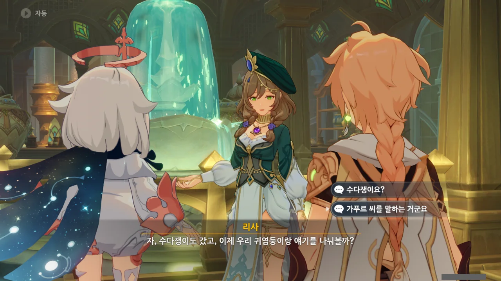

수다쟁이 ㅋㅋㅋㅋㅋㅋ 가푸르가 말이 좀 많긴 했지 ㅋㅋㅋㅋㅋㅋ

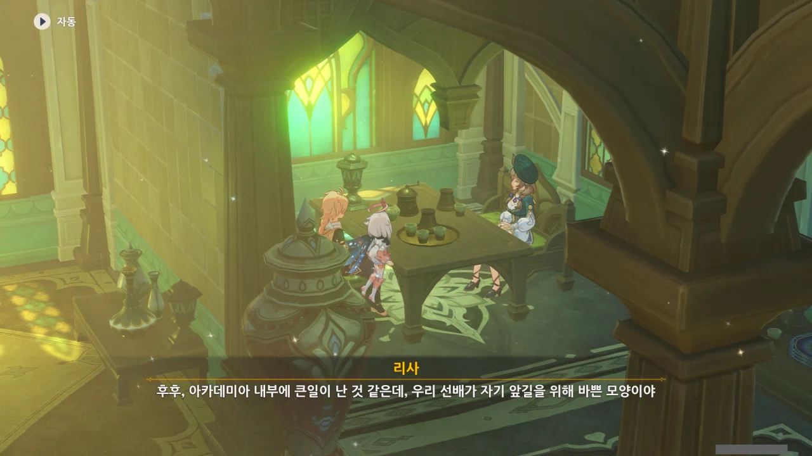

그래, 가푸르가 여태 저런 모습을 보인게 '자기 앞길'을 위해서였다면 충분히 납득이 된다. 잘만 하면 승진이나 실적을 손에 거머쥘 수 있는데 참기 힘들겠지.

아까 리사에게 말한 프로젝트도 리사와 공동 연구를 했다는 식으로 적당히 묻어가려 했던 모양이다.



리사가 수메르에 온 이유는 진이 리사에게 긴 유급 휴가를 줘서 그렇다고 한다. 뭔가 기분 전환도 하고 푹 쉬고 오라는 의미로 그런 것 같은데... 지금 몬드에서 제일 일을 많이 하는 건 리사가 아니라 진 아니던가?

휴식이 필요한 건 리사 뿐만이 아닌 것 같은데...





캐릭터 스토리를 통해 알게 되는 이야기도 좋지만, 이렇게 캐릭터 본인 입에서 나오는 이야기 역시 좋다.

대체 왜 리사는 아카데미아를 떠났던 걸까?





키루스가 진행한 연구가 보통 연구가 아니었던 것으로 보인다. '초인적인 지혜'? 설마 인공 신 제작과 연관된 연구는 아니었겠지? 마침 인공 신 제작 연구 역시 아카데미아의 핵심 연구였으니 상당히 의심스러운데...

그런 종류의 연구였다면 리사가 학을 떼고 아카데미아를 떠난 것이 충분히 이해가 된다. 당장 여행자가 수메르에 왔을 때만 해도 수메르성에 사는 사람들의 뇌를 병렬 연산 장치로 쓴 것이 아카데미아 아니던가.

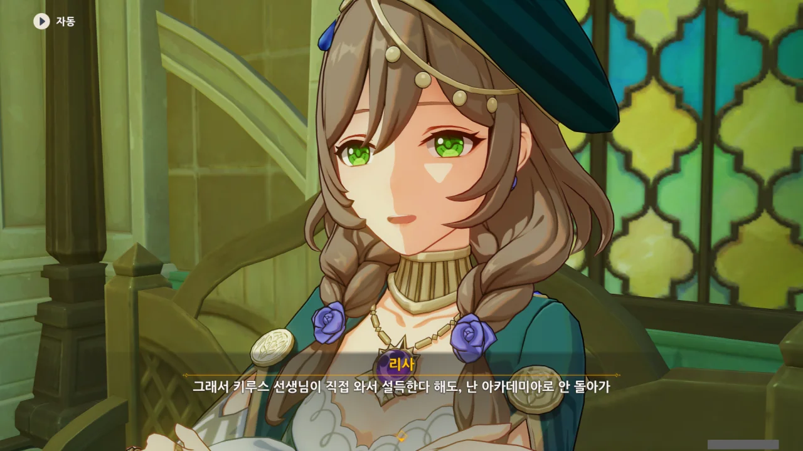

키루스가 직접 와서 설득하더라도 절대 아카데미아로 돌아가지 않겠다는 리사.

&nbsp;

그런데 만약 키루스가 아카데미아의 인공 신 제작 프로젝트에 깊이 관여했다면, 나히다 집권 이후 목이 썩둑 잘리지 않았을까? 당장 대현자인 아자르도 간다르바 성곽 외곽으로 종신 유배를 보낸 마당에, 거기에 깊게 관여한 사람이 무사할 리 없잖은가. 마침 리사가 있던 소론파 역시 해당 프로젝트에 현자가 참여했으니 더더욱 그럴듯하고 말이다.



여유로운 것도 좋고, 규칙적인 것도 좋고... 리사의 말에 전적으로 동감할 수 있다.

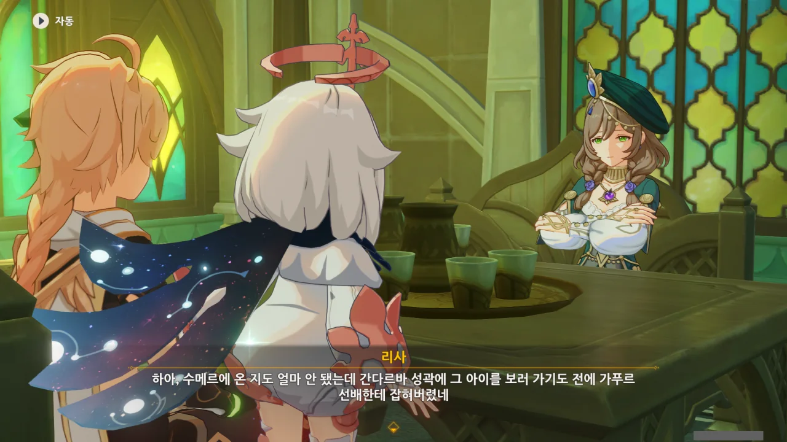

리사가 말하는 간다르바 성곽의 '그 아이'가 누굴까? 여행자가 아는 캐릭터 중 간다르바 성곽에 있는 캐릭터는 타이나리와 콜레이 둘밖에 없는데... 설마 콜레이인 걸까?



3.0 버전(22.08.24)부터 3.3 버전(22.12.07)까지의 기간을 생각하면 꽤 긴 기간이었다.

집착이라... 확실히 그건 집착이 맞았을지도.



어우, 오랜만에 리사가 하는 귀염둥이라는 말을 들으니 뭔가 닭살이 돋는 거 같아. '저, 이제 다 컸어요!'라고 하고 싶은 느낌이랄까.



사실 리사가 온 시점에서 뒤처리라고 할 것이 아예 없다. 일은 알하이탐과 나히다가 알아서 다 할텐데, 뭘.

지금도 수메르는 일일 임무를 하려고 오는 게 전부다. 중간장 임무까지 다 해버렸으니, 더는 할게 없다고.

아, 그 월드 임무는 제외하자. 하기 귀찮거든. 어디 도망가는 것도 아닌데, 천천히 할거다.





그러고 보면, 리사는 어떤 경로를 거쳐 수메르에 온 걸까?

지금 지도가 밝혀진 영역 기준으로, 몬드에서 수메르로 오려면 무조건 리월의 층암거연을 거쳐와야 한다. 하지만 그러려면 간다르바 성곽을 거쳐서 올 수밖에 없기 때문에, 앞서 리사가 한 말과는 앞뒤가 맞지 않게 된다.

으으, 이래서 얼른 폰타인이 나와야 한다니까.

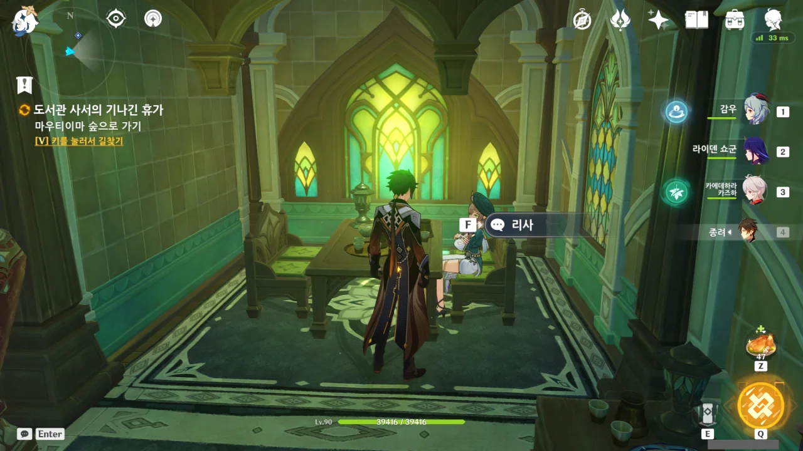

자리에서 일어나도 리사와 대화할 수 있다.



뭐, 먼저 가보라는 말밖에 없지만.
