

마우티이마 숲으로 이동하니, 처음 보는 워프 포인트가 하나 놓여있다. 이거, 분명 이벤트 비경 입구인데... 설마 리사 신규 의상 이벤트에도 전투를 넣어둔 거야?

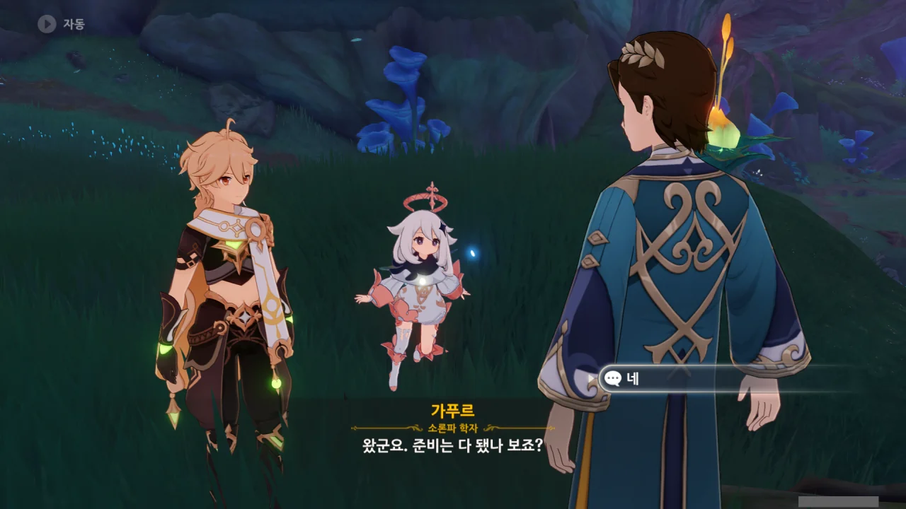

먼저 와있던 가푸르와 이야기한다.



와, 진짜 저 비경 안으로 들어간다고? 일단 저기가 지맥의 흐름이 이상한 곳이라고 한다.



일반적으로 저런 비경 내부는 위험하기 때문에, 전투 능력을 갖춘 사람만 보낸다고 한다.



와, 진짜로? 진짜로 전투를 넣었어?

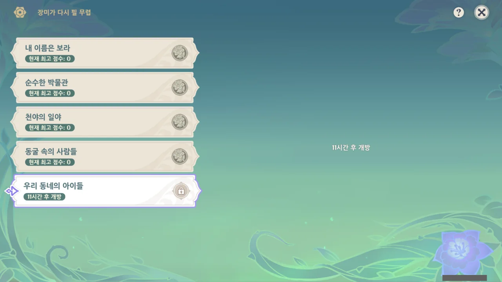

심지어 '너무 늦기 전에 이벤트 스토리를 다 밀어놔야겠다'라고 생각하고 이벤트 임무를 시작했는데, 11시간 후에나 마지막 전투가 열린다고 한다.

아잇, 이런 젠장맞을. 이러면 11시간 후에 또 해야 하잖아.

그래도 전투는 나름 재미있었다. 점수 배율을 x4로 해두니, 애들이 더 튼튼해져서 전투를 할 때 손에 땀이 절로 나더라고.

***



11시간 후, 마지막 도전까지 전부 끝마치고 나서야 리사의 신규 의상인 '잎새에 숨겨진 이름'을 획득할 수 있었다.

&nbsp;

이번 의상이 아마 내 기억이 맞는다면 네 번째로 얻는 이벤트 의상일 것이다.

첫 번째 의상은 바바라의 '빛나는 협주' 의상이었고, 그다음이 응광의 '비단 속 난초'였다. 그다음 피슬의 '극야의 진실된 꿈'이었고, 이번에 리사의 '잎새에 숨겨진 이름'을 얻는다.

허, 의외로 이벤트에서 뿌리는 의상은 꼬박꼬박 다 먹었네.

&nbsp;

리사의 의상에도 플레이버 텍스트가 있다. 여기에는 리사가 이야기해주지 않은, 아카데미아에 있을 때와 아카데미아를 떠날 때의 이야기가 적혀 있다.

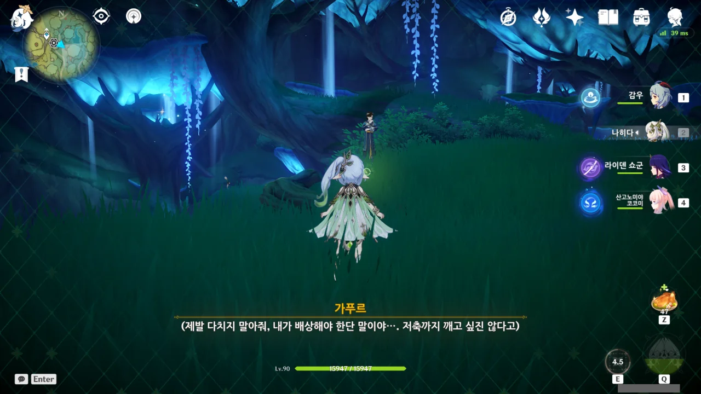

그리고 이제야 뒤늦게 깨달은 건데, 수메르 NPC들은 나히다를 통해 속마음을 읽을 수 있다. 으으, 왜 이걸 이벤트가 다 끝나고 나서야 깨달은 거지? 그동안 지나친 NPC들의 속마음이 얼마나 많았을까?

&nbsp;

나히다로 가푸르의 속마음을 읽어보니, 처음 생각했던 것과 다르게, 가푸르는 그냥 평범한 속물 학자에 불과했다.

승진욕 때문에 스승을 팔아먹긴 했어도, 여행자에게 다치지 말아 달라고 속으로 비는 정도의 양심은 남아있었다.

만약 가푸르가 정말 글러먹은 학자였다면, 여행자가 다쳤을 때 자기 적금을 깨서 배상할 생각을 하는 게 아니라 어떻게 해야 배상 책임을 피할 수 있을지 고민하고 있었겠지.

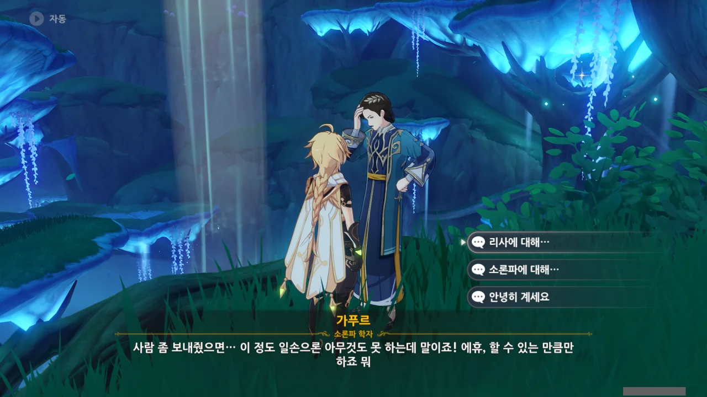

가푸르와 대화를 할 수 있다.

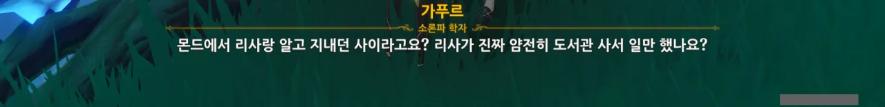

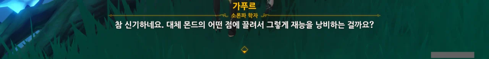

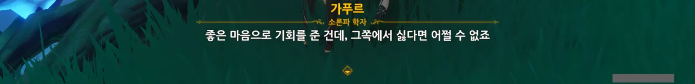

허, 아카데미아로 돌아오라 한 것도 제 딴에는 선의로 한 제안이었나 보다. 정말로 사서 일이 보잘것없는 일이라고 생각한 모양.

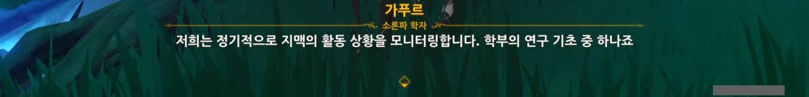

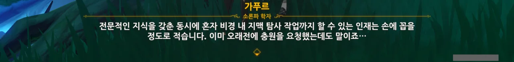

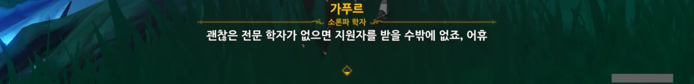

학자는 공부만 하느라 허약하다는 게 일반적인 인식이니, 그럴 수밖에...

굳이 예외를 꼽자면 알하이탐 정도가 있을 것이다. *문약한 학자(웃음)*

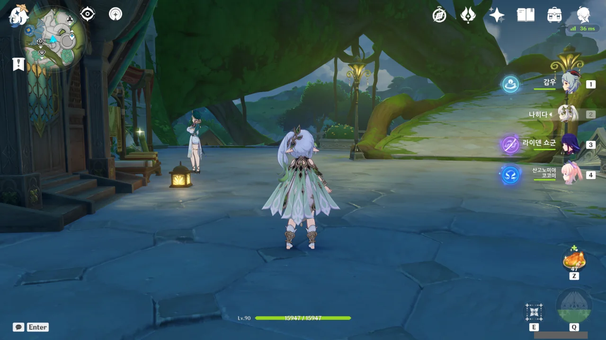

그리고 여기서 처음으로 '아, 이벤트 좀 일찍 할걸!'이라고 후회하게 되었다.

알고 보니, 리사는 이벤트 기간 내내 이곳저곳을 돌아다닌다고 한다.

오늘이 대충 5일 차라고 하던데, 지금까지 이벤트를 하지 않은 탓에 2일 차부터 4일 차까지의 리사와의 대화를 모두 놓친 꼴이 되어버렸다.

아이고!

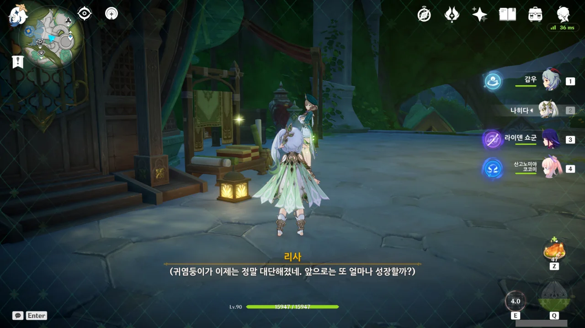

그래도 한 가지 위안점이라면, 리사의 속마음은 언제 봐도 똑같다고 한다.

나히다가 속마음을 읽는 건 수메르 출신 NPC에만 가능하다고 들었는데, 리사의 속마음도 읽을 수 있네?

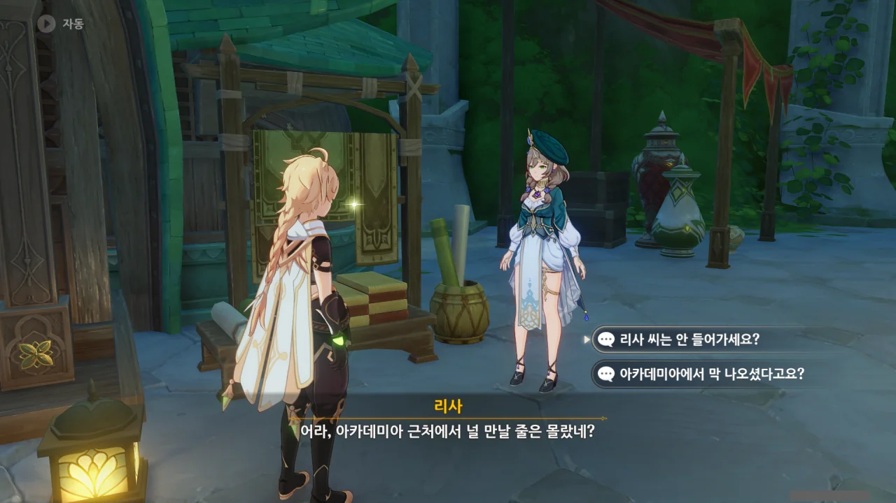

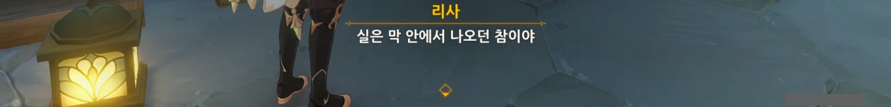

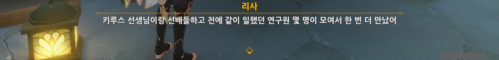

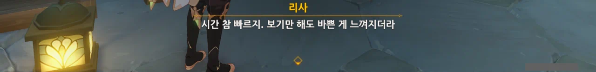

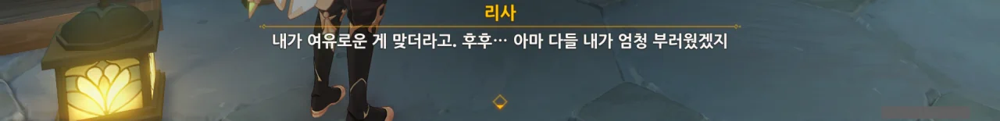

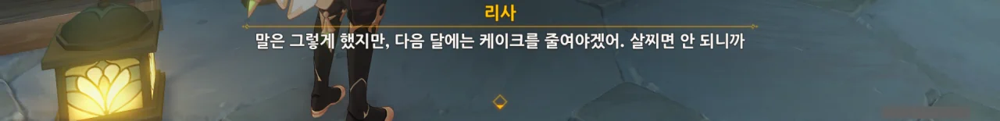

"한 번 더 만났다"라고 하는 걸 보니, 이미 학부 모임에 참가한 모양. 소감을 듣고 싶었는데, 아쉽네...

아무튼, '장미가 다시 필 무렵' 이벤트 끝!
