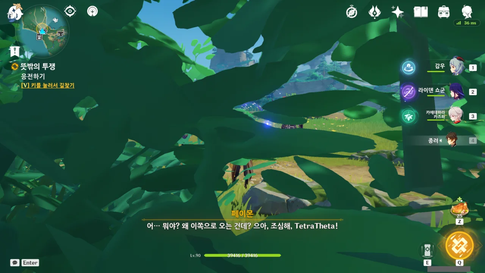
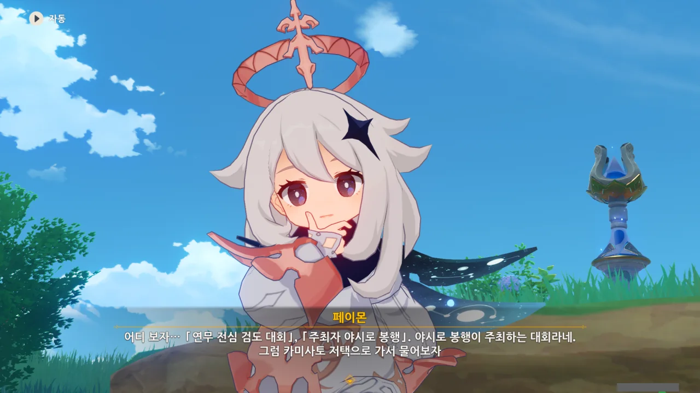
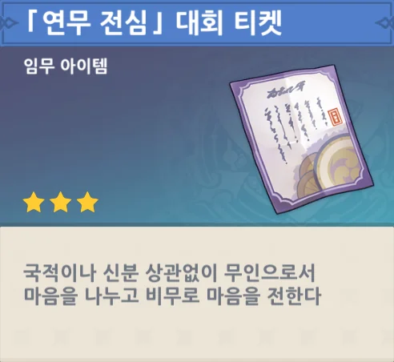
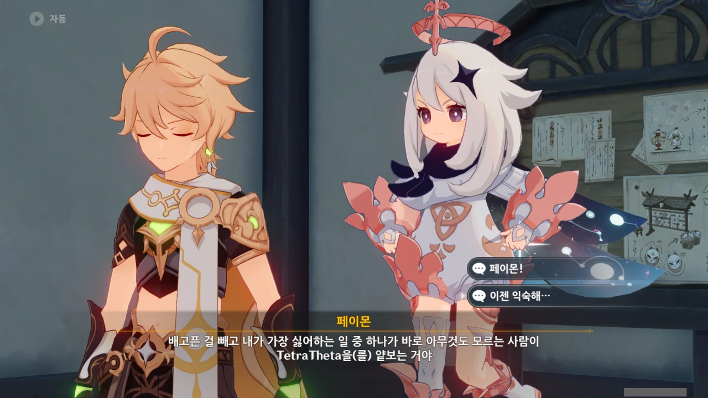
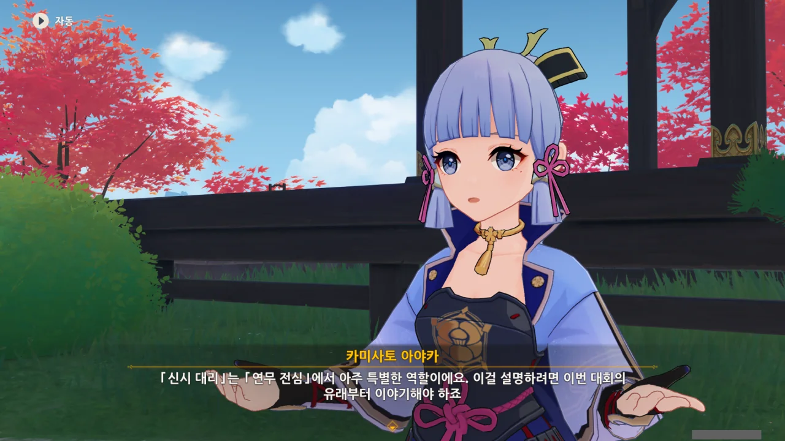

'연무'라는 단어로 미루어보아, 이나즈마에서 또 싸움판이 벌어지려는 것 같다.

생각해 보면, 다른 나라에서는 이런 식으로 싸움판을 벌이는 일이 거의 없었다. 혹여나 있다 하더라도 '연무'라는 말을 붙일 정도로 무武와 관련이 있는 것 같지도 않았고.

이건 이나즈마라는 나라의 특성이라고 생각해도 좋은 걸까?



임무 지점에 오자마자 두 무사가 길 위에서 무섭게 생사결을 벌이려 한다.

말하는 것을 보아하니, 저 둘은 서로 가족처럼 지내는 사이인 것 같은데, 대체 뭐 때문에 저렇게 한쪽이 꼭 죽어야 끝나는 생사결을 하려는 걸까?





그런데 이 둘, 사람이 지나다니는 길 위에서 대뜸 싸움을 벌이는 주제에 여행자에게 '조용히 갈 길 가라'라고 하거나 '검술을 모르는 외부인은 방해하지 말라'라고 하는, 뻔뻔한 모습을 보이고 있다.

그런 말을 할 거면 적어도 사람이 지나다니는 데 방해가 되지 않도록 저 멀리서 싸우던가. 적반하장도 유분수지.



저들의 뻔뻔함도 뻔뻔함이지만, 이번엔 페이몬이 '여행자의 검술이 얼마나 대단한데!'라고 하자마자 조금 전까지만 해도 서로 싸우려던 둘이 순식간에 태세를 전환하고 합심해 여행자를 협공하려 한다. 그러니까 뻔뻔함이 배가 되었다는 말이다.

참가 자격? 아니, 그러니까 그게 뭔데?! 왜 니들만 아는 이야기 해!

아니, 진짜로 둘이 동시에 덤빈다고?

안 되겠다. 공공질서를 해치는 분충은 용서치 않아요!

아니... 그러니까 그놈의 참가 자격이란 게 대체 뭔데. 그거부터 일단 설명을 해야 하는 거 아냐?

길 위에서 생사결을 펼치면 그 길을 지나다니는 다른 사람들이 불편해할 것이란 걸 생각조차 하지 못하고 길 위에서 칼질을 하려던 걸 볼 때, 저들은 그놈의 '참가 자격'이 뭔지 먼저 여행자에게 설명해야 한다는 것 역시 생각하지 못한 것으로 보인다.

이 뇌까지 근육으로 가득 찬 근육뇌 같으니라고.





나는 이 녀석들이 잠시 말이 없길래, 드디어 '무턱대고 덤벼서 죄송합니다', '길을 막아서 죄송합니다'와 같은 사과를 여행자에게 하는 것인가 하고 기대했었다. 그런데 그런 건 안중에도 없고, 저들은 그저 자신들이 진 것에 대해 분통해하고 있는 것이었다.

정말로 이 놈들은 뇌가 있을 곳까지 근육으로 채운 건가? 그래서 상식이란 걸 상실한 건가? 진짜 그놈의 망할 참가 티켓이 뭔데?! 아니, 니들만 아는 이야기 하지 말라니까?!



이제야 사과와 함께 자기소개를 하는 둘. 그래도 뇌 깊숙한 곳까지 근육으로 변하지는 않은 모양이지.

아무래도 '참가 자격'이라는 건 '연무 전심 검도 대회'의 참가 티켓을 말하는 것으로 보인다. 티켓이 없으면 검도 대회에 참가할 수 없다는 식의 이야기겠지.

그런데 여기가 인적이 드문 곳이라고? 말도 안 되는 소리. 여기가 인적이 드문 곳이었으면 이렇게 길이 나있지 않았겠지.

원한다면 인적이 정말 드문 곳을 알려줄 수는 있는데. 거기서 영영 나오지 못하겠지만.





그런데 갑자기 저들끼리 쑥덕쑥덕 대더니, '연무 전심 검도 대회'의 참가 티켓이 여행자에게 넘어오게 되었다.

이런 건 나도 이해하고 납득할 수 있게 이야기해 주면 좀 덧나나? 밑도 끝도 없이 "오직 진정한 검술 고수만이 연무 전심 대회장에 설 자격이 있다"며 자연스럽게 티켓을 넘겨주네.



심지어 제멋대로 참가 티켓을 여행자에게 떠넘겨놓고, "우리에겐 아무런 쓸모가 없으니 티켓을 쓰든 말든 마음대로 하라"며 가버린다.

... 아까 했던 말 싹 다 취소. 지들끼리 제멋대로 싸우고 덤비다가 얻어맞고 지들끼리 쑥덕대다 제멋대로 납득하고 떠나버리다니, 뇌 깊숙한 곳까지 근육으로 가득 차서 예의와 상식을 상실한 것이 틀림없다.

야시로 봉행이 연무 전심 검도 대회의 주최라고 하니, 백 명의 봉기 때처럼 비밀스러운 대회는 아닌 셈이다.

백 명의 봉기, 꽤 재미있었는데.

> 국적이나 신분 상관없이 무인으로서 마음을 나누고 비무로 마음을 전한다
{.bq}

아무리 설명을 읽어봐도 생사결을 펼치는 대회는 아닌 것 같다. 그런데 아까 저 둘은 왜 사형제끼리 생사결을 펼치려고 했던 거야?

정말 알 수 없는 놈들일세.

***



카미사토 저택으로 가니, 오늘은 아야토와 아야카 둘 다 자리에 없다고 한다. 음, 아쉬운걸.



연무 전심 대회가 꽤 인기가 좋은 모양인지, 참가 티켓이 이미 저번주에 다 팔렸다고 한다. 하지만 우린 방금 우연찮게 티켓을 하나 얻었거든.

그런데 시범 경기? 그건 또 뭐야? 뭔가 점점 더 알 수 없게 되어가고 있는 것 같은데.



티켓을 얻은 김에, 그 연무 전심 대회가 일단 뭔지 알아보고자 카미사토 저택으로 온 것이었다.

만약 별로다 싶으면 티켓을 갖다 팔아도 되고. 아, 그러면 암표가 되려나? 암표는 싫은데...





연무 전심 대회에 참가하는 건 무인에게 있어 자기 실력을 알아볼 기회일 뿐만 아니라, 명예이기까지 하다고 한다. 게다가 방구석 히키코모리 쇼군도 이번 기회를 통해 사람들에게 검도의 매력을 알리려고 한다고.

라이덴 에이가 벌써 이렇게 성장한 건가 생각했는데, 다시 생각해 보니 이런 일에 에이가 빠질 리 없었다. 이나즈마에 있는 대부분의 치도술, 검술, 단조술은 전부 에이가 전수한 것 아니던가. 평소 "아아, 무예를 갈고닦는 수련은 정말 짜릿하고 황홀해"라고 말하고 다니는 에이가 이런 일에 빠질 리 없는 것이다.



아니 넌 또 뭔데 되지도 않는 개소리로 시비세요? 그러고 보니, 이 히로타츠, 옛날에도 이상한 곳에서 투덜대며 시비 건 적이 있지 않았나?

게다가 여행자는 방금 연무 전심 대회가 뭔지 들은 처지거든? 참가한다 안 한다 아직 일언반구도 안 했는데 제대로 듣지도 않고 대뜸 와서 시비를 거는 꼬라지 하고는.





시비랍시고 거는 게 '얼마나 대단한지 보려 했는데 생긴 걸 보니 별 것 아니다'라니, 실소가 나오지 않을 수 없다.

히로타츠가 "패기도 없고 검술은 평범하겠지"라고 말하는데, 지금까지 몬드, 리월, 이나즈마를 돌아다니며 여행자가 뭘 했는지 보고도 저런 말이 나올 수 있을까 정말 궁금하다.

심지어 "검술은 평범하겠지" 부분은 여행자가 대회 이야기를 듣자마자 참가를 결정하지 않은 모습을 보고 하는 말이다.

&nbsp;

아아, 이걸 뭐라고 부르더라? 뭔가 단어가 생각날 것 같은데, 혀 끝에서 나올락 말락 하네.



하쿠베에가 무가 출신이 아닌 여행자에게 그런 소리를 하는 건 무리라고 말한다.

그래, 말 참 잘했다. 연무 전심인지 뭔지 하는 대회가 뭔지 조금 전에야 겨우 알게 되었는데, 거기에 대고 뭐라 시비를 거는 것 자체가 무례한 일이고 말고.

하... 오늘따라 재수가 옴 붙은 것 같다. 아까 만났던, 이제는 유파 이름도 까먹은 그 두 무사부터 시작해서 오늘따라 시비를 거는 놈이 많네.

하지만 어쩌겠는가. 이런 일이 하루이틀도 아니고 말이다. 듣도 보도 못한 사람에게 무시당하는 일은 이제 익숙하다.



아, 그래. 페이몬 오랜만에 말 참 잘했다. 앞으로 히로타츠 저 녀석의 눈은 옹이구멍이다. 그래, 이 단어가 생각나지 않았던 거였어!



어휴, 끝까지 싸가지없는 저 모습 좀 보라.

정 꼬우면 네가 오셀이랑 싸워보던가. 물론 그때에는 선인 버프를 받고 싸웠던 거지만.



아무튼, 저놈의 연무 전심 대회가 뭔지... 직접 참가해 보기로 했다.

다른 선택지가 있나? 분명 저 옹이구멍, 대회에 참가했을 게 뻔한데, 가서 한 번 밟아줘야지.



아까 난입한 옹이구멍 때문에 하쿠베에의 말이 끊겼었는데, 아아캬는 치사토와 함께 연무 전심 대회와 관련한 일을 확인하러 이도로 갔다고 한다.

&nbsp;

치사토가 왜 연무 전심 대회에 관여하는지 잠시 궁금해했는데, 이 일은 치사토, 아니 간조 봉행 역시 연관된 일이었다.

아까 본 연무 전심 대회의 티켓에는 "국적이나 신분 상관없이"라는 말이 적혀 있었다. 이 말인즉슨, 이 대회에는 이나즈마 사람뿐만 아니라, 다른 나라에서 온 사람도 참여할 수 있다는 말이다.

그렇다면 무역과 출입국을 담당하는 간조 봉행이 빠질 수 없다. 그리고 현 간조 봉행의 우두머리는 치사토이고. 원래는 치사토의 아버지가 간조 봉행의 우두머리였으나, 우인단과 손을 잡고 반란을 지원한 죄로 종신 자택 구금형에 처해졌기 때문에 우두머리의 자리가 그 딸인 치사토에게 넘어오게 되었다.

아야카 역시 행사를 주관하는 야시로 봉행의 핵심 중추이니, 아야카와 치사토 둘이 만나 대회를 주제로 이야기하는 건 전혀 어색하지 않은 것이다.

***



정말 오랜만에 만나는 아야카이다. 마지막으로 만났던 게... 대체 언제였더라? 아, 저번에 아키츠 숲 담력 시험에서 만나긴 했었지. 그때 동행할 캐릭터로 아야카와 요이미야를 골랐었다. 아니, 두 번째에선 사유를 골랐었나? 아무튼...



또 내가 모르는 단어가 나왔다. 신시 대리? 그게 뭐야? 뭘 대리하는 건데?



응? 아야카가 여행자에게 편지를 보냈었다고? 받은 적 없는데? 설마 서로 엇갈린 걸까?



아야카가 보냈다는 편지 이야기를 급하게 얼버무리는 아야카. 흐음... 대체 그 편지가 뭐였길래?

그래. 기왕 설명해 주는 것, 연무 전심이 정확히 무엇인지부터 설명을 듣는 게 나을 것이다.



그야 당연하지 ㅋㅋㅋㅋㅋㅋ 라이덴이 검을 한 번 쓱 그으면 사람이 잿가루가 되어버리는 걸. 해당 주장에 대한 증명은 지금 잿가루가 되어 스네즈나야로 보내진 시뇨라 양이 대신 해줄 겁니다.

그래서 라이덴 쇼군은 그 무인과 자신의 권속이 함께 팀을 짜 자신과 겨루도록 했다고 한다. 그게 신시 대리神示 代理라고 한다.

이러면 무인은 거의 장식과 다름없고, 라이덴 쇼군과 그 권속의 싸움이 주가 되겠네.





음, 그러니까, 연무라는 형식을 통해 상대방을 죽이지 않고도 이나즈마를 수호하고자 하는 마음을 전했다는 거네. 그래서 연무 전심演武 傳心이라고 하는 거고.

다만 시간이 지나면서 이 행사는 검도 대회로 바뀌었고, 그 기원이 된 '신의 기술을 전수하는 대결' 역시 마지막의 '시범 경기'로 대체되었다고 한다.

이게 연무 전심 검도 대회의 배경 이야기이다.



최근 시범 경기에 라이덴 쇼군이 참가하지 않았다는 말은, 그 이전에는 라이덴 쇼군이 직접 참가했다는 말이 된다.

여행자에게 '재대결 한 번 더 해볼래?'라고 제안하는, 무예와 수련이라면 사족을 못쓰는 라이덴 쇼군이라면 이렇게 수련할 수 있는 기회를 절대로 놓치지 않았을 테니, 당연하다면 당연한 이야기이다.

뭐? 라이덴 쇼군에게 있어 누가 상대로 나서던 다 약해 보일 거라고? 그런 맛에 뉴비를 핥는 겁니다. 뉴들박이라는 말이 괜히 있겠어?

&nbsp;

아무튼 다시 정리하자면, 연무 전심 대회에서 우승한 사람은 '무인' 역할을 맡고, 관아 출신 검사가 '신시 대리' 역할을 맡는다고 한다. 





그리고 이번에 신시 대리 역할을 맡게 된 것이 아야카이다. 음음, 아야카는 야시로 봉행 소속이며, 무인이니까 '관아 소속 무인'이라는 조건에 딱 들어맞네.

게다가 '백로공주'라는 말을 들을 정도로 이나즈마 사람들에게 인기가 높은 아야카이니, 아야카가 신시 대리로 참가하는 이번 연무 전심 대회에 사람들의 관심이 쏠린 것은 당연하다면 당연한 일이다.

라이덴 쇼군의 말처럼, "흡인력 있는 홍보 대사"인 셈이지.



게다가 이번 행사에는 야에 출판사의 오노데라 역시 참여한다고 한다. 말이 출판사이지, 나루카미 다이샤의 우두머리인 야에 미코의 수족이나 다름없는 것이 야에 출판사 아니던가. 저 말은 나루카미 다이샤, 아니 야에 미코 또한 이 행사에 손을 댔다는 말과 다름이 없다.

야에 미코가 대놓고 이번 대회에 참여하진 않았겠지만, 분명 암암리에 마수를 잔뜩 펼쳐놓고 뒤에서 '쿠후후' 웃으며 볼 거 다 보고 있을 게 뻔하다. 그 여우라면 분명 그럴 거야.

&nbsp;

라이트 노벨 출판을 주로 하던 출판사 소속답게, 대회 참여도를 높일 만한 여러 방도를 마련한 오노데라.





더 많은 사람들이 대회에 참여할 수 있도록, 이나즈마 검도 유파 소속만 참가할 수 있던 기존 규정 대신, 국적과 신분을 가리지 않는 새로운 규정을 채택했다고 한다.

또한 한손검만 사용 가능하던 규정 역시 일정 조건을 충족하기만 한다면 자유로이 사용할 수 있도록 바꿨다고 한다.

이 정도면 꽤 많이 바뀐 것 아닌가?





심지어 화제성 확보를 위해, 신시 대리가 시범 경기에서 입을 옷을 관중들이 직접 뽑을 수 있도록 했다고 한다.

라이덴 쇼군이 여기에 동의한 건 분명 '아무튼 싸울 수는 있을 테니까' 때문 아니었을까?

&nbsp;

사계절을 테마로 한 옷이라... 설마 이번 이벤트가 아야카의 신규 의상 이벤트였나? 그런데 내가 알기로 신규 의상은 폰타인과 연관된 테마라고 알고 있었는데...



생각해 보니, 이건 다 아야카가 신시 대리로 나섰기에 가능한 일이었다.

&nbsp;

만약 아야카 대신 다른 관아 출신 무인이 신시 대리로 나섰다고 가정해 보자.

일반 NPC가 나와봤자 화제성을 끌지는 못할 테니, 우리가 알고 있는 네임드 캐릭터들이 나온다고 봐야 할 것이다.

일단 쿠죠 사라. 하지만 쿠죠 사라는 장군이라서 이런 행사에 쉬이 나서기 힘들다. 사유는 카미사토 가문의 비밀 부대인 종말 번대 소속이니, 관아 소속이라 볼 수 없고.

남정네로 시선을 굳이 돌리자면 토마가 있긴 하지만, 토마 역시 카미사토 가문의 가신일 뿐이다. 시카노인 헤이조가 텐료 봉행 소속이라고는 하지만, 이런 일에 나설 캐릭터가 전혀 아니니 제외. 아야토 역시 한 가문의 가주인지라, 쿠죠 사라와 같은 이유로 나서기 어렵다.

그러니까 아야카 외에는 이런 걸 할 수 있는 사람이 없다.



오노데라는 투표 작업을 준비하기 위해 먼저 떠났고, 아야카는 여행자 일행에게 대회장을 구경시켜주려 한다.

미호요라면 리소스 절약을 핑계로 백 명의 봉기 대회장을 재활용했을 게 분명하다.
