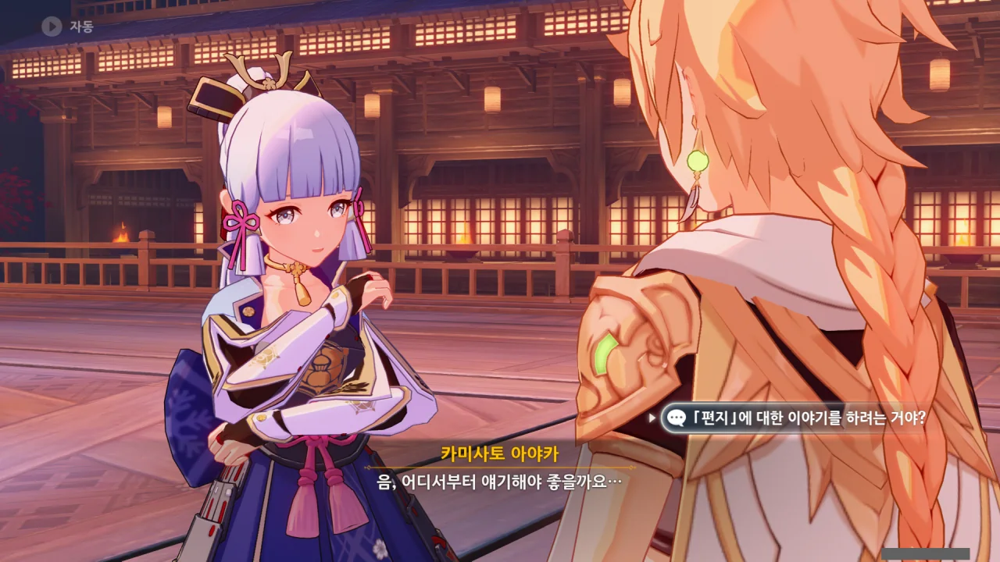
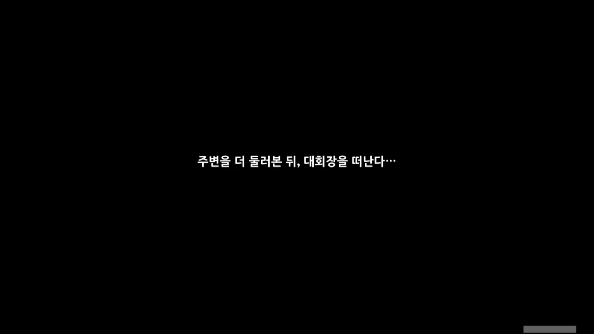
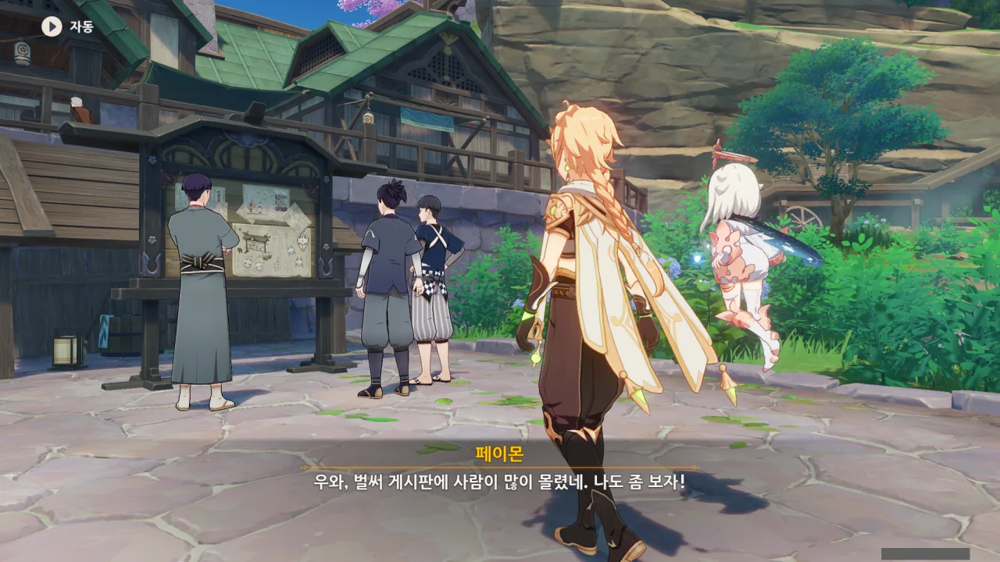
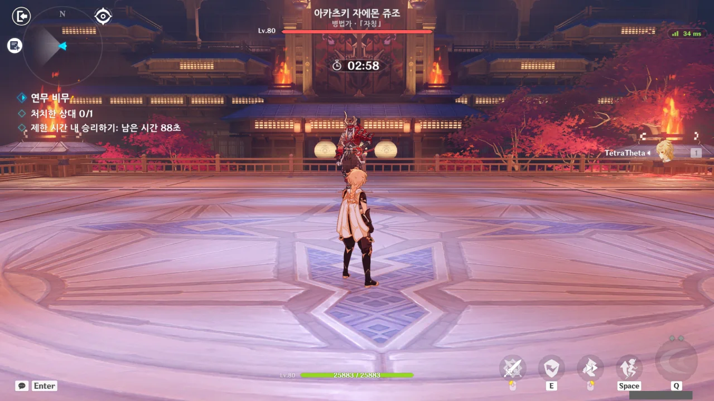
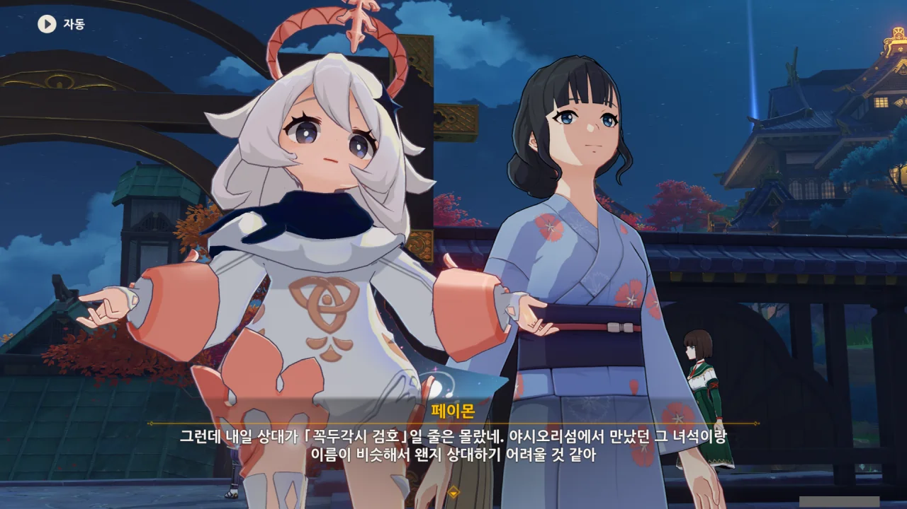



그럼 그렇지 ㅋㅋㅋㅋㅋㅋ 백 명의 봉기 대회장을 그대로 들고 왔네 ㅋㅋㅋㅋㅋㅋ

아냐... 생각해 보면, 오히려 역으로 백 명의 봉기 대회장이 이 원국감사의 모습을 본떠 만든 것일 수도 있어... 그게 더 개연성이 맞잖아?

그나저나 이곳은 간조 봉행의 실내 훈련장이라고 한다. 원국감사가 있는 곳은 이도인데, 이도는 꽤 좁은 섬이다. 그런데 그런 섬 지하에 이런 넓고 큰 훈련장을 만들다니, 건축 기술이 대단한가 보네.





치사토와 페이몬이 잠시 자리를 비운 사이, 아야카가 잠시 이야기를 나누자고 한다.

음, 그래. 그러고 보니 아까 아야카가 편지에 대해 얼버무렸었지. 그 이야기를 하려는 걸까?





그럴 만도 하지. 갑자기 떡하니 검도 대회에서 신시 대리라는 중책을 맡질 않나, 대중의 투표로 결정된 화려한 옷을 입고 시범 경기에서 검을 휘둘러야 하질 않나... 뭐 하나 부담가지 않는 것이 없다.

게다가 아야카의 전임자들이 모두 관아에서 검술이 제일 뛰어난 사람들이라고 하니, 아야카가 느끼는 부담감은 엄청났을 것이다.





자꾸 도움을 받으면 패배하는 느낌이라... 잘은 이해되지 않지만, 그렇게 느낄 수도 있겠다.



어느새 돌아온 페이몬이 무슨 이야기를 하고 있었느냐 물어보자, 아야카가 아까처럼 대충 얼버무린다.



사실 지금 재미보다는 과연 이 이벤트가 어떤 방식으로 진행되는 것인가가 더 궁금하다. 백 명의 봉기 무대를 그대로 가져왔으니 백 명의 봉기와 동일하게 진행되는 것일까? 아니면 다른 방식으로 진행될까?



경기 날에 보자고 하길래 정말로 다음날까지 기다려야 할 줄 알았는데, 그냥 다음날로 시계를 돌리면 되는 일이었다.



아무튼 시계를 돌렸으니 잘 잔 것 아닐까?

건물 밖을 나서자마자 시계를 돌렸으니, 따지고 보면 건물 입구에서 하룻밤을 지새운 것과 마찬가지인 것 같지만, 우리가 언제 그런 세세한 걸 따지는 사람이었던가.



여행자는 이 이야기의 주인공이니까 일단 이긴다고 봐야겠지. 그나저나 개막 경기라... 이렇게 말하니까 정말로 대회가 시작되었다는 느낌이 확 든다.

연무 전심 이벤트를 잔뜩 미뤄뒀다가 모든 이야기가 열리자마자 쉬지 않고 달리는 중이라, 이야기가 귀로 들어가는지 코로 들어가는지 모를 정도로 정신이 없다.





왼쪽은 연무 전심 투표 상자, 오른쪽은 다른 행사에 쓸 상자라고 한다. 오른쪽 상자의 투표 결과는 세 번째 시합 때 공개된다고 한다.

단순히 생각해 보면, 왼쪽의 상자가 '신시 대리가 시범 경기에서 입을 옷'을 투표하는 상자일 것 같다. 하지만 오른쪽 상자가 세 번째 경기 이후 열리는 것을 생각하면, 오른쪽 상자가 신시 대리 복장 투표 상자인 것 같기도 하다.

다른 행사용이라고 했지만, 지금 이나즈마에서 열리고 있는 행사가 연무 전심 말고는 없잖아.



결국 어느 상자가 아야카의 옷을 결정짓는 상자인지 알지 못한 채 상자가 떠나가버렸다.



그럼... 이제 대회 시작!



첫 번째 상대는 '긴장한 신입 참가자 - 이부키'였다. 일반 병사 NPC 답게 패턴이 단순해서 반격기로 체력을 쏠쏠하게 깎아먹었다.

두 번째 상대는 '창과 검을 모두 익힌 키타인류 창술사 - 히로타츠'였다. 처음엔 그냥 단순히 막부군 병사 1인 줄 알았는데, 이 녀석, 아까 여행자에게 뜬금없이 시비를 건 녀석이잖아. 창과 검을 모두 익혔다기에는 패턴이 방금 상대한 이부키와 별반 다를 없어, 눈치채지 못했다.

그러니까... 이제 누가 허접인지 잘 알겠지, 히로타츠?

***

모든 경기를 쉬지 않고 한 번에 모두 끝낼 수 있을 줄 알았는데, 두 경기를 끝내고 나니 이벤트 스토리를 보고 오라고 한다.

게시판 앞에 사람들이 많이 --- 3명 --- 모여 있다. 하나, 둘, 많다!





사람들이 뭔가 알 수 없는 말을 한다.

마사코가 대회 참가자 이름인 줄 알았는데, 그다음에 나온 「오르치 아가씨의 사건 파일」은 홑낫표가 사용된 것으로 보아 아예 출판사가 내놓은 라이트 노벨을 지칭하는 것 같다. 그러면 마사코 역시 그 소설에 나오는 등장인물의 이름이겠지.

그런데 왜 그게 연무 전심 이벤트 이야기에서 나와?

그 소설의 주인공 이미지가 아야카와 어울린다고 말하는 사람에게 다른 사람이 오르치 아가씨는 아야카와 달리 승부욕이 강하고 장난을 좋아하니, 전혀 다르다고 말한다.

어? 폰타인 옷을 입은 아야카? 이게 대체 왜 여기서 나와?



어라? 왜 연무 전심 투표 선택지가 「부탁해요, 나의 여우 신선 궁사님」과 「오르치 아가씨의 사건 파일」이지?

이 투표, 아야카가 시범 경기에서 입을 옷을 결정하는 투표 아니었어? 아까 오노데라가 아야카가 입을 옷은 사계절을 테마로 한 옷이라고 했던 것 같은데.

그나저나 첫 번째 선택지의 라이트 노벨 이름이 아주 노골적이다. 뭐? 여우 신선 궁사? 이거 완전 야에 미코잖아. 설마 여기에 야에 미코가 손을 댄 건 아니겠지? 단순히 재미있을 것 같다는 이유로 투표함을 바꿔치기했을 것 같은데.



아무튼, 이게 어찌 된 일인지 알아보기 위해 카미사토 저택으로 가보기로 했다.

그래, 카미사토 저택에 가보면 이게 야에 미코의 짓인지, 아니면 뭔가 다른 착오가 있어 생긴 일인지 알 수 있겠지.





어... 음... 이번 일은 야에 미코의 짓이 아니었던 모양이다. 정말로 착오가 생겨 두 상자가 바뀐 모양이다.

비밀 유지를 위해 투표함에 주제를 표기하지 않았고, 그 탓에 잘못된 상자가 투표 장소에 배치되어 엉뚱한 선택지로 구성된 투표가 진행된 것이다.



결국 재투표가 진행되나 했는데, 아야카가 다른 해결책이 있을지도 모른다고 한다.





현재 투표가 잘못되었다는 걸 아는 사람은 행사 진행자와 여행자를 제외하면 없다.

그러니 아야카는 기왕 이렇게 된 거, 시범 경기에 투표 결과인, 요즘 유행하는 소설의 의상을 입고 출전해 깜짝 이벤트로 꾸미려고 한다.

그렇게 하면 더 많은 사람들이 이번 행사에 관심을 가지게 될 테니, 위기에서 기회를 찾는 셈이다.





하지만 소설 캐릭터의 의상은 연무복처럼 전투를 위해 만들어진 옷이 아니다. 비유하자면 정장을 말끔하게 차려입고 미식축구를 하는 격이라고 할 수 있겠다.

하지만 아야카는 소설 캐릭터가 입고 있는, 폰타인 스타일의 치마가 자신의 움직임을 방해할 것 같지 않다며, 적응해보겠다고 한다.

뭐, 평소 아야카가 입고 있는 옷도 치마니까, 별 차이를 느끼지 못할 수도 있겠네. 옷에 갑주가 달리지 않으니, 오히려 몸이 더 가벼울지도 모르겠는걸.





팬미팅이라고 하는 걸 보면, 기왕 투표함을 만드는 김에 야에 출판사에서 자체적으로 쓸 투표함도 같이 만들었다가 이 사달이 난 것으로 보인다. 연무 전심에서 팬미팅을 할 리가 없으니 말이다.



아야카, 말은 저렇게 해도 아까 이야기했던 것처럼 무리하고 있는 건 아닐까 걱정된다.





뭔가 알 것 같네. '소설 캐릭터의 옷을 입으면 마치 그 소설 캐릭터가 된 것처럼 소설 캐릭터의 페르소나를 쓸 수 있다'라고 해야 할까?

당장 원신에서 다인 모드를 할 때에도 평소에는 조용하고 차분하던 사람이 클레를 들자마자 폭탄광으로 변해서 온갖 것들을 터트리고 다니는 걸 보면, 맞는 말 같다.

아, 물론 거기에는 나 역시 포함된다. 히힛, 통통 폭탄!





예전부터 평소와 다르게 꾸며보고 싶다고 생각해 온 아야카. 기왕 이렇게 된 것, 이번 기회를 통해 이국적인 의상을 입어보기로 한 것이다. 게다가 그런 일탈은 아야카 어머니의 소원이기도 했고.

그러니 꿩 먹고 알 먹고 도랑치고 가재 잡는 상황이란 거네. 착오로 인해 발생한 잘못된 투표도 잘 얼버무리고, 자신과 어머니의 소원도 이루는 거다.



그래서 아야카는 폰타인 스타일의 의상을 입게 되었다.

왜 아야카가 뜬금없이 이나즈마의 옷이 아닌 폰타인의 옷을 입게 되었나 궁금해했는데, 이런 일이 있어서 그렇게 된 거였구나.



세 번째 상대는 '유사의 창 - 유난'이었다. 수메르 사막 부족이 이나즈마까지 온 것이 상당히 신선했지만, 거기까지.

네 번째 상대는 놀랍게도 '지나가다 관심이 생겨서 참가 - 타로마루'이다. 말 그대로 개다.

&nbsp;

예전에 '빛나는 자색 정원' 이벤트에서 '검의 각축'이라는 결투 대회가 있었는데, 여기서 황당한 일이 잇달아 일어났다.

여행자에게 대회 참가를 독려한 '야스히코 타로' 역시 대회에 참가해 여행자와 검을 맞댄 건 귀여운 수준이었다.

제일 놀랐던 건, 코모레 찻집 사장인 개 '타로마루' 역시 대회에 참가했다는 거다. 심지어 타로마루가 최종 보스였더라? 그동안 만난 적들과는 차원이 다른 강함을 보여줘서, 고전을 면치 못했다.

그런데 그 타로마루가 연무 전심 대회에 참가했다고? 그것도 지나가다가 관심이 생겼다는 이유만으로? 이나즈마는 개까지도 전투광인 거냐?!

&nbsp;

다행스럽게도, 타로마루의 패턴은 검의 각축때와 크게 다르지 않아, 몇 번 맞아보고 패턴을 금방 파악할 수 있었다.

***

이번에는 두 경기를 진행했음에도 불구하고 다음 이야기가 나오지 않았다. 별 수 없이 다섯 번째 경기를 진행했다.

다섯 번째 상대는 '병법가 · 「자칭」 - 아카츠키 자에몬 쥬조'이다. 해란귀와 패턴이 비슷해, 별다른 어려움을 느끼지 못했다.

이름을 어디선가 들어본 것 같아 찾아보았지만, 처음 듣는 이름이었다. 왜 아카츠키를 예전에 한 번 만난 것 같지?



아, 이게 마지막 경기였어? 아무튼 내가 다 이겼다.



라이덴 쇼군의 권속이라고 하기에 야에 미코라도 나오는 건가 생각했는데, 그냥 꼭두각시 검호가 나온다고 한다.

뭐, 검을 겨루는 대회이니, 법구 캐릭터인 야에 미코가 나오긴 힘들겠지.



옆에서 아야카가 축하를 해주지만, 꼭두각시 검호를 상대한다는 생각이 머릿속을 가득 채운지라, 아야카의 칭찬이 귀에 들어오지 않는다.

그 거지 같은 녀석을 상대해야 한다고?

야시오리 섬에서 만난 토벌 보스의 이름은 '꼭두각시 검귀'이긴 하지만, 검귀나 검호나 거기서 거기잖아. 둘 다 패턴이 더럽게 까다로울걸?



아, 신의 눈을 쓸 수 있다면 이야기가 조금 쉬워질지도 모르겠다. 아야카의 궁으로 갈아버리면 어떻게든 되겠지.



아, 이건 무조건 이긴다. 미호요가 이길 수 없는 적을 대놓고 이런 이벤트에서 내놓지는 않을 거 아냐.

사실 수메르에서 무한하게 체력을 회복하는 파멸의 유적 가디언이 나오긴 했지만, 이나즈마에서까지 그런 게 나오진 않을 거라 생각한다.

게다가 그 파멸의 유적 가디언은 아란나라가 뿅 하고 봉인해 버렸다고.



그러고 보니, 다음 시합에서는 지금의 기본 의상이 아닌 폰타인 스타일의 의상을 입은 아야카를 볼 수 있겠네?



아니, 놀리는 게 아니라 순수하게 기대된다고 한 거야...



다음 날 카미사토 저택에서 아야카를 다시 보기로 했다.
