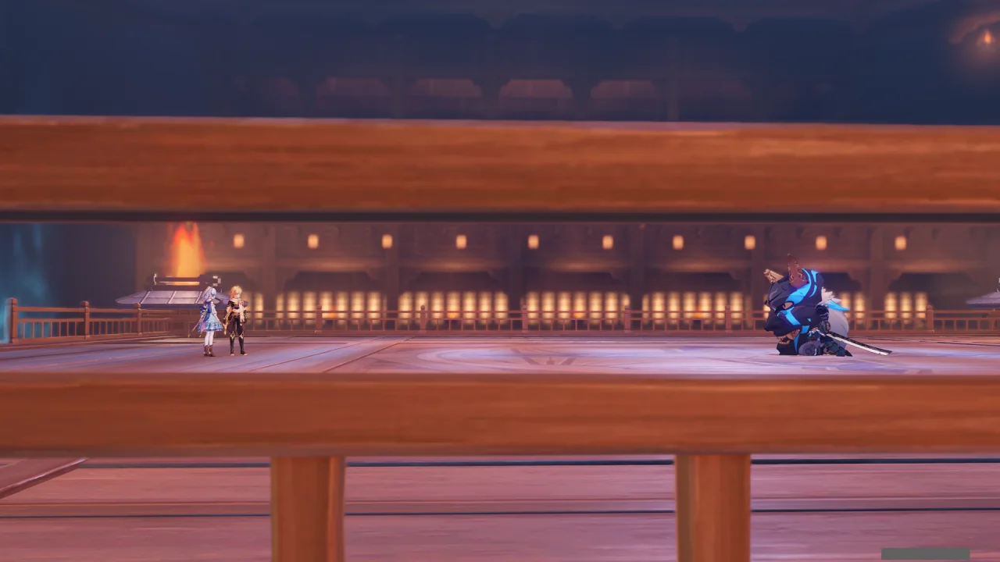
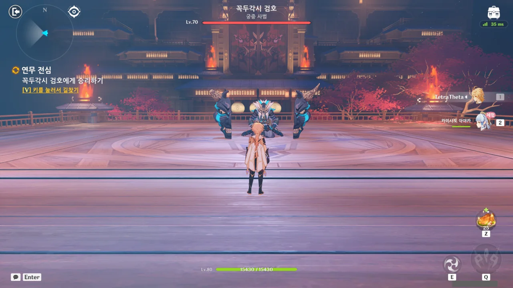
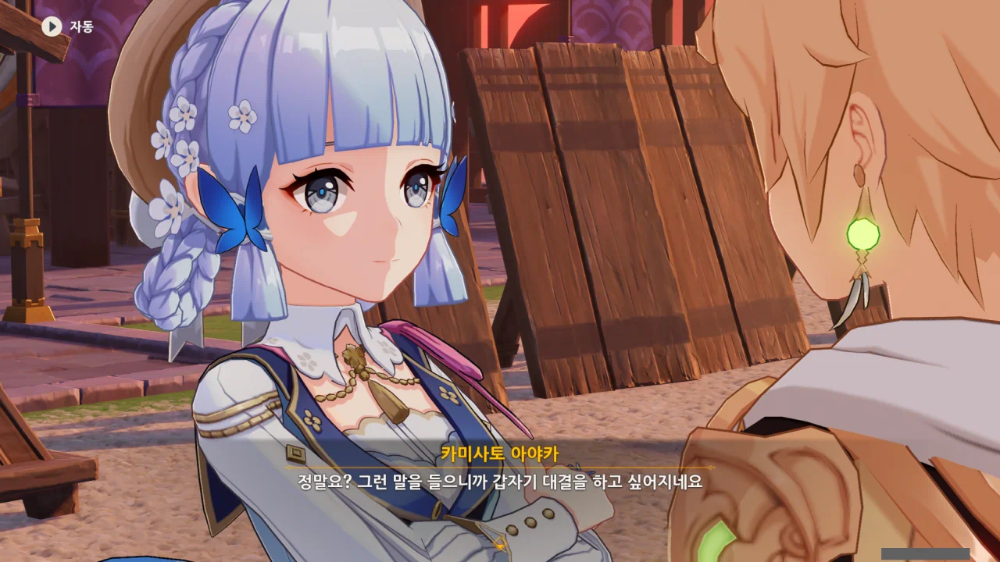



다음날, 시간이 되어 카미사토 저택으로 찾아갔더니, 뜬금없이 히로타츠가 맞아준다.

여, 허접.



이번엔 또 무슨 시비를 걸러 왔나 했는데, 놀랍게도 사과를 하러 왔다고 한다.

사과하는 사람 앞에서 대놓고 말에 날을 세울 수도 없으니, 받아주었다. 말 한마디로 천 냥 빚을 갚는다라는 말도 있는데, 처음부터 말을 곱게 했으면 옹이구멍이니 허접이니 하는 말을 들을 필요조차 없었을 것이다.





히로타츠가 무슨 부탁을 하나 싶었는데, 그냥 아야카를 도와서 이번 시범 경기에서 이겨달라고 한다.

아야카가 이번 경기를 위해 매일 저녁 몇 시간씩 검술 연습을 했다고 하는데, 아야카가 신의 눈을 얻게 된 경위도 이와 비슷했다.

카미사토 가문에 큰 변고가 생겨 아야토가 가주 노릇을 해야 할 때, 아야카는 아야토의 짐을 덜어주기 위해 잘하지도 못하는, 귀족의 기초 교양인 검술과 시를 열심히, 끊임없이 연마했다고 한다. 그리고 그 각고의 노력 끝에, 신의 인정을 받은 아야카는 얼음 신의 눈을 얻게 되었다.

아야카는 천재라기보다는 노력형 범재라고 보는 것이 옳다. 이번 일 역시 신시 대리라는 막중한 임무를 맡았기에 완벽에 완벽을 기하고자 매일 열심히 검술 연습을 했던 거겠지.



사진을 어디서 찍어야 할지 몰라 그냥 전부 넘겨버렸지만, 천천히 걸어오는 아야카의 모습이 여러 각도에서 천천히 비치고 있었다.

그 와중에 히로타츠의 얼굴도 보여줬는데, 분명 아야카의 모습을 넋 놓고 보고 있는 것으로 보여야 할 표정이 '어쩌다 저런 흉측한 옷을... 쯧쯧...'이라고 안타까워하는 얼굴로밖에 보이지 않더라.



신규 의상 이벤트가 다 그렇듯이, 이벤트 도중에 '아, 이 신규 의상, 지르고 싶다'라는 욕구가 들게 만드는 장면이 꼭 들어간다. 그리고 이번이 바로 그 순간이었다.

하지만 내게는 아주 좋은 치료제가 있었다. 바로 텅 빈 통장의 잔고였다. 그걸 보니까 아야카 신규 의상을 지르고 싶은 생각이 싹 사라지더라고.



치마에 동백꽃문양을 그려 넣은 걸 보면, 소설 캐릭터의 의상과 카미사토 가문의 이미지를 잘 섞은 옷으로 보인다.

팬미팅을 위해 만든, 소설에 묘사된 의상을 충실하게 구현한 옷을 아야카와 어울리게 다시 개조하느라 머리카락이 적잖게 빠졌을 사람들에게 묵념.





옷이 몸에 잘 맞는다니 정말 다행이네.

글을 쓰면서 발견한 건데, 이렇게 보니 등 뒤의 리본이 마치 나비처럼 보인다. 와, 이런 거 나 아주 좋아하는데. 코코미의 의상도 처음 봤을 때 정말 물고기처럼 생겨서 신기해했거든.



아니나 다를까, 아야카가 사람들의 이목을 한눈에 끌게 되었다.

그 와중에 경기 맨 앞줄 자리를 차지하기 위해 아침부터 줄 서서 기다린 사람이 있다. 여기는 그런 경쟁이 그리 치열하지 않은 것 같아 다행이라고 해야 할까? 실제로는 좋은 자리를 차지하기 위해 전날 새벽부터 줄을 서는 사람도 있거든.



... 드디어 시작이네. 꼭두각시 검호라... 검귀를 잡을 때 분명 토벌 보스임에도 불구하고 잡는 데 시간이 꽤 걸렸던 것으로 기억한다.

아마 이번에도 그럴 거 같고.



뭐, 그래도 잡긴 잡을 거다.

와, 진짜로 꼭두각시 검귀를 데려왔네? 게다가 색깔을 보아하니... 온갖 속성을 다 쓰겠구나.

번개 여행자와 아야카 단 둘이서 꼭두각시 검귀를 잡으라고? 여행자는 그냥 아야카 배터리 취급이겠네.

그래도 꼭두각시 검귀의 레벨이 70 정도밖에 되지 않아, 생각보다 오래 걸리진 않았다.



페이몬이 "꼭 예상이라도 한 것처럼 손쉽게 받아넘기더라"라고 할 때, 난 '아냐, 우리 엄청 얻어맞았어'라고 생각할 수밖에 없었다.

제대로 된 딜링 수단이 아야카밖에 없어, 여행자는 E 쿨이 찰 때마다 나와서 번개 찌릿찌릿 한 번 하고 다시 퇴장하는 배터리 역할밖에 할 수 없었다. 그렇다면 제일 많이 얻어맞는 건 아야카가 된다.

물론 피가 닳을 때마다 꼬박꼬박 요리로 힐을 하긴 했다만...





쿠죠 사라는 장군 일이 바빠 오지 않을 줄 알았는데, 라이덴 쇼군의 명령으로 이번 시범 경기를 보러 왔다고 한다. 조금 쉬라는 의미로 보낸 걸까?

&nbsp;

생각해 보면, 사라는 아야카나 아야토, 치사토처럼 직접적으로 가문에 엮여 일을 하는 사람이 아니라 여유가 있을지도 모르겠다.

사라는 계승권이 없는 양녀인 데다가, 지금 쿠죠 가문의 실질적 가주 역할을 하는 건 쿠죠 사라가 아닌, 가문의 둘째 아들, 쿠죠 카마지거든. 게다가 정치적 상황상, 사라가 쿠죠 가문에 개입하기도 곤란한 상황이다.



아, 쉬라고 보낸 게 아니라, 그냥 대신 보고 오라는 거였어?



치사토가 뒤풀이로 오유정에서 축하연을 여는 것이 어떻겠냐고 제안한다. 나야 좋지!



그런데 가는 도중, 아야카가 여행자를 멈춰 세운다.

그저 한숨을 쉰 것일 뿐 아니냐고? 이건 무언의 메시지다.



> 경기에서 몇 번이나 있었던 위험한 상황을 넘길 수 있었던 건 모두 여행자님이 제 곁에서 상대의 공격을 적절히 받아내 준 덕분이었다는 것을 말이에요.

사실, 아야카가 딜도 하고 탱킹도 했다. 여행자는 배터리 역할밖에 안 했다니까? 겸손하긴...

아니 왜 너까지! 이나즈마에는 대결을 하지 못하면 죽는 병이라도 있는 거야?



... 그래도 아야카니까... 소원이라면 해줘야지.



> 하지만 그때까지 검을 잘 간수하시는 게 좋을걸요? 만약 제가 그걸 훔쳐 가기라도 하면 그날로 여행자님의 목숨은 제 것이 될 테니까요.

나만 이 대사가 엉큼한 대사로 들리는 걸까?

아야카가 검을 잘 간수하고 말하며 가리키는 것은 여행자의 가슴, 즉 심장이다. 그러면서 하는 말이 '그걸 훔쳐가기라도 하면'이라니, 이건 여행자의 마음을 훔치겠다는 거잖아.

완전 라이트 노벨에서나 나올법한 표현인데, 이거.



또다시 페이몬의 질문에 둘러대는 아야카.

내 말 맞다니까? 그냥 한 소리였으면 사실대로 말했겠지만, 검술 대련 이야기로 흘려 넘긴 걸 보면 방금 건 고백에 가깝다고 말할 수 있다.



> 친구니까 더 자주 싸워보고, 또 서로를 격려해 줘야죠.

음... 왜 저 말을 들으니 저번 해등절 때 페이몬이 생각나는 걸까?



방금 전 한 이야기를 비밀로 해달라는 아야카. 아까 전 이야기는 고백이 맞았다.

&nbsp;

그나저나 뒷이야기가 더 있을 것 같아 오유정으로 가보았지만, 아무것도 없었다. 날 속였어!
