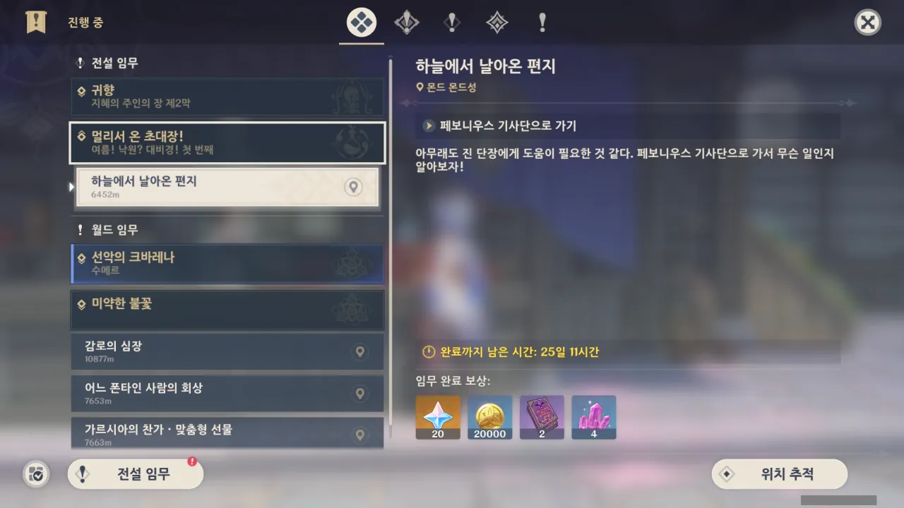
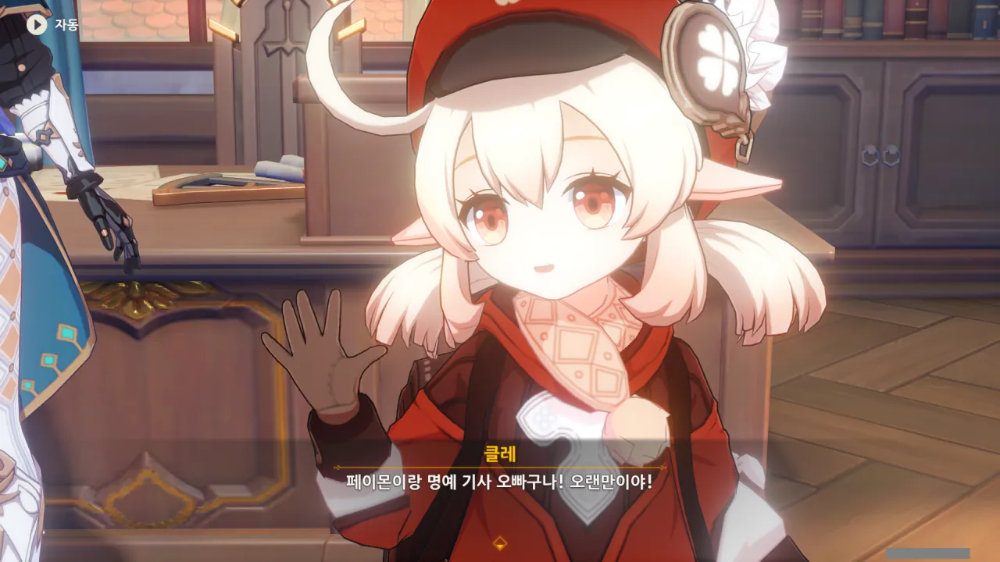
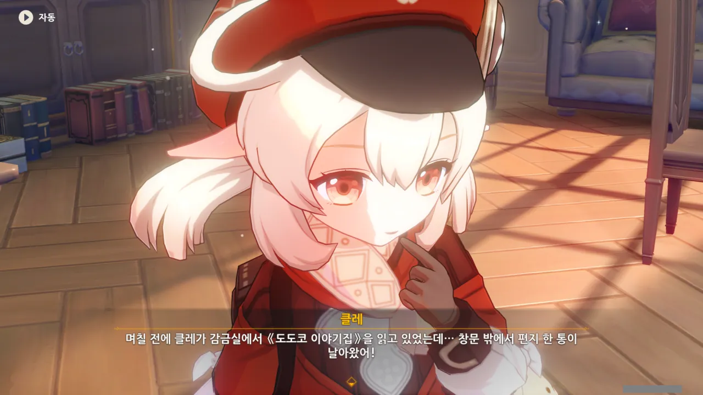
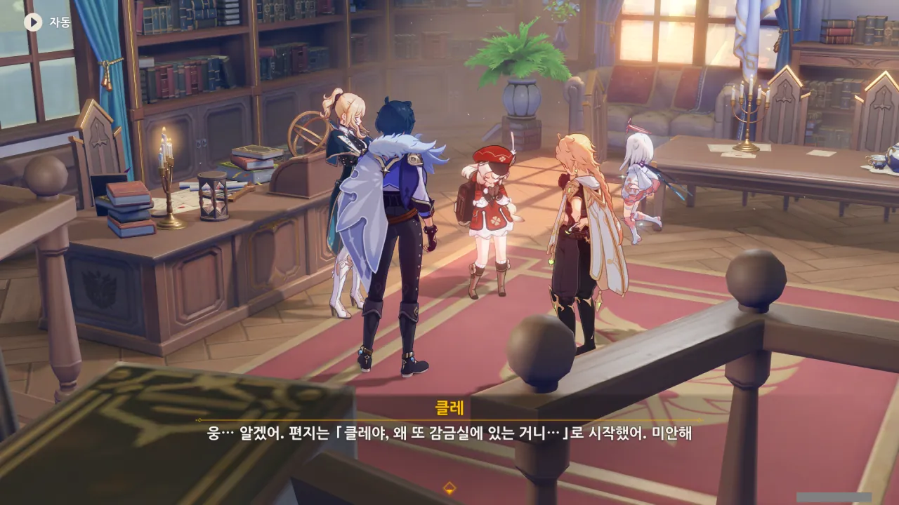
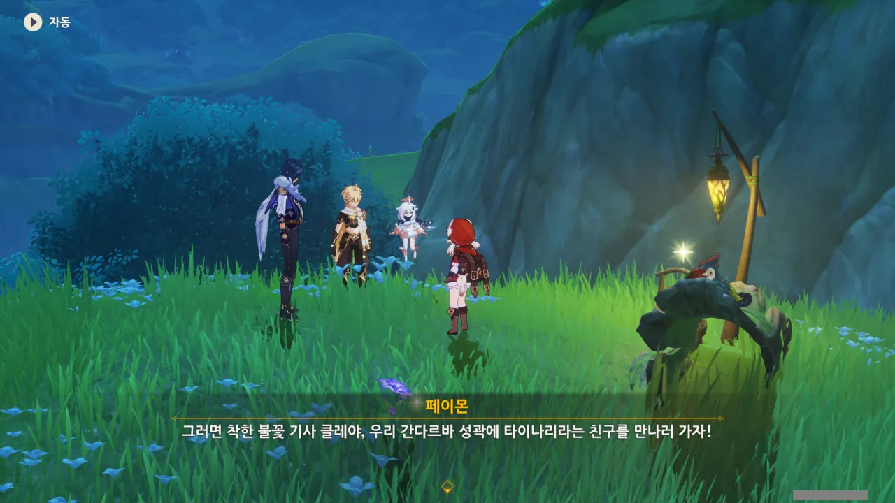
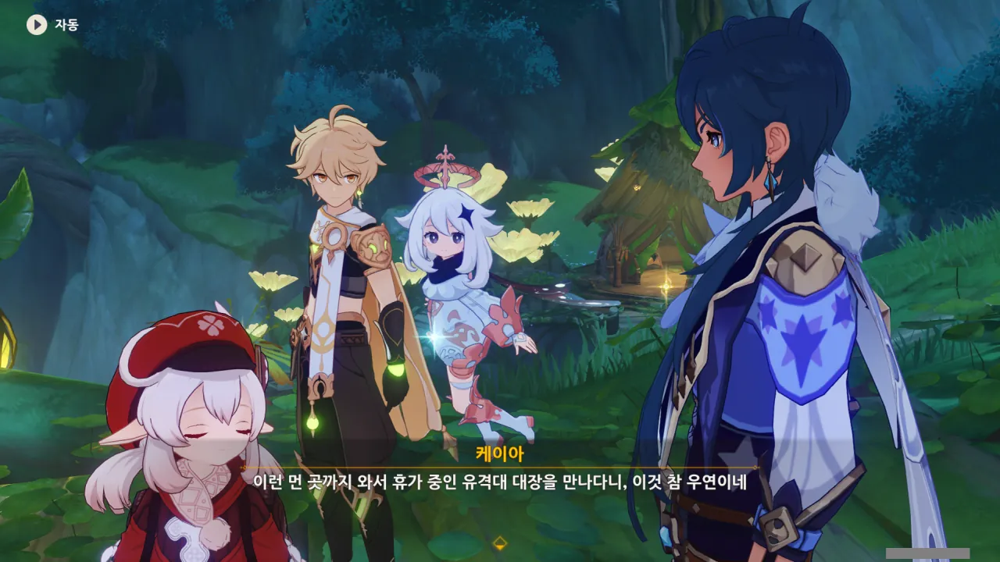
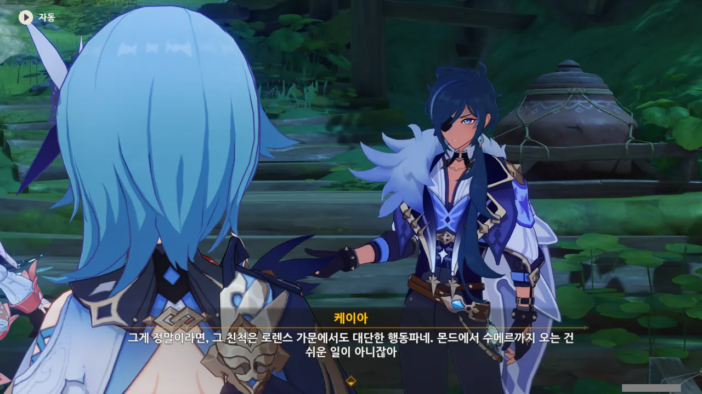
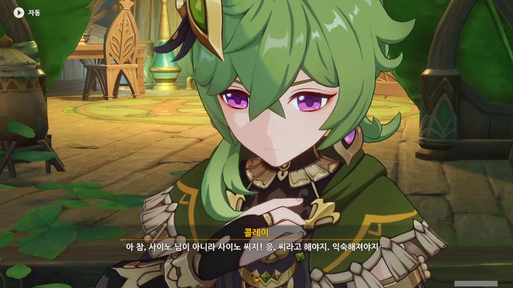
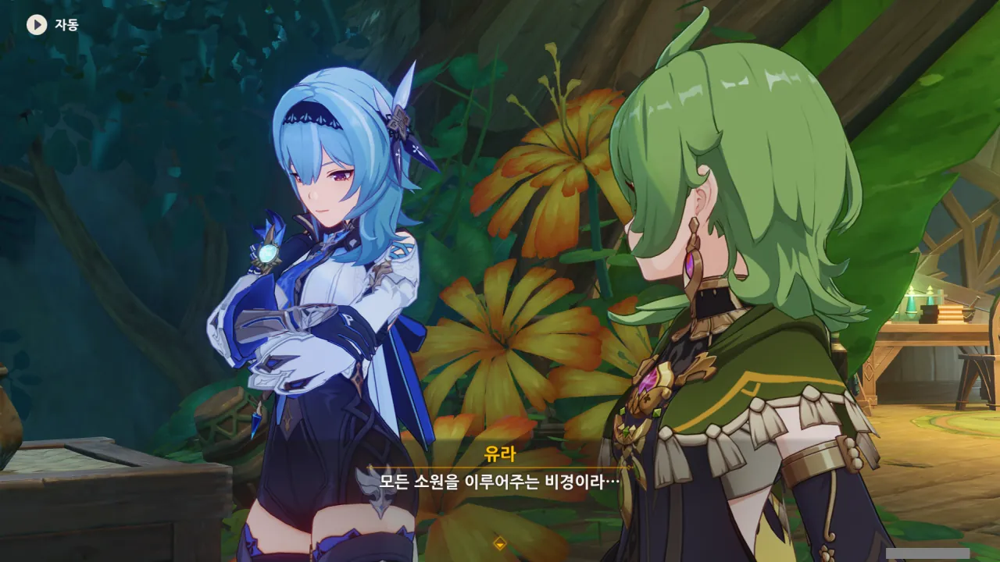

이걸 번아웃이라 표현해도 될지 의문이지만, 최근 하던 게임들을 절반 정도 그만두었다. 여전히 하는 게임마저도 매일 의욕 없이 게임을 켜고, 일퀘를 하고, 다시 게임을 끄는 생활을 반복 중이다.

그래서 저번 이벤트인 '듀얼! 소환왕 결정전!' 이벤트도 스토리를 보다 말고 내다 버렸다. 여태 원신을 하며 이벤트를 아예 하지 않은 적은 있었어도, 이벤트 도중 이벤트 진행을 포기한 건 이번이 처음이다.

여기에는 뜬금없이 등장한 기레기 캐릭터, 샤를로트와 영 허술한 이벤트 스토리 흐름 역시 한몫했다. 안 그래도 맥락 없이 붕 뜬 스토리 때문에 의욕이 없는데, 보면 볼수록 화만 나는 샤를로트가 합세하니, 게임을 하기 싫어질 정도더라고.

***

하지만 이번 이벤트에는 클레가 나온다.

원신에는 일단 등장했다 하면 스토리를 꿀잼으로 만들어주는 캐릭터가 몇 있는데, 그중 하나가 바로 클레다. 클레가 나왔다면 그 이벤트 스토리는 반드시 재미있다. 여태껏 깨진 적 없는 법칙이라 해도 과언이 아니다.

그래서 이번엔 이벤트 보상도 타먹을 겸, 이벤트 스토리를 진행하기로 했다.

임무 창을 열자, 그동안 의욕이 없어 유기한 월드 임무와 전설 임무가 제일 먼저 눈에 들어온다.

그건 그거고, 일단 이번 이벤트는 페보니우스 기사단에서 시작한다.



진과 케이아, 클레가 함께 모여 있다.

이벤트 배너에 있는 클레, 1.6 버전 때 있었던 이벤트인 '여름! 섬? 모험!'과 비슷한 이번 이벤트의 이름, '여름! 낙원? 대비경!'으로 미루어봤을 때, 이번 이벤트가 어떻게 흘러갈지 벌써부터 눈에 선하다.

클레는 보기만 해도 입꼬리가 올라간다니까. 아아, 귀여워.



케이아와 페이몬이 무슨 말을 하는 건가 싶었는데, 돌이켜 보니 처음 여행자가 들어올 때 문에 노크도 하지 않은 채 벌컥 문을 열고 들어왔었다.

문에 상호작용을 하니, 문에 노크를 하는 컷신이 나오지 않고 그냥 냅다 문을 열어버리더라고.



여행자가 디어 헌터 배달원인 척하며 너스레를 떨자, 페이몬이 혼자 배달원 행세를 하다니, 치사하다며 팔짱을 낀다. 저 표정... 정말 귀여워 죽겠다니까.

원신에서 날이 가면 갈수록 발전하는 건 바로 캐릭터 표정 묘사가 아닐까 한다. 늘 같은 NPC 얼굴이나 머리 모양을 돌려쓰면서 말이다.



대체 무슨 이야기를 하고 있었던 걸까?



이번에도 역시(?) 클레에게 무슨 일이 생겼나 보다.

첫 번째 금사과 제도 이벤트, '여름! 섬? 모험!'을 기억하는가? 클레가 '도도 대마왕'이라는 인물에게 의문의 편지를 받은 것으로 시작한 이벤트였다.

클레가 주역으로 등장하는 이벤트가 그리 많이 없긴 하지만, 클레가 주역 중 하나였던 그 이벤트 역시 이렇게 클레가 의문의 편지를 받는 것으로 시작했다.

내 장담컨대, 이번에 클레에게 편지를 보낸 사람은 그때도 그랬듯이, 클레의 어머니인 앨리스일 것이다. 그 이벤트에서도 '도도 대마왕'의 정체가 이벤트 막바지에 앨리스였음이 밝혀졌거든.

&nbsp;

그나저나 '도도코 이야기집'이라니. 그거, '여름! 섬? 모험!' 이벤트에서 얻은 후 클레에게 쥐여줬는데.



편지가 새처럼 퍼덕이면서 들어왔다고? 이건 분명 앨리스가 보낸 것이 틀림없다.

그런 기묘한 방법으로, 다른 이도 아닌 클레에게 편지를 보낼 사람이 앨리스 말고 누가 달리 있겠는가?



클레는 편지에 '이해가 안 되는 말'이 적혀 있었다고 했지만, 케이아의 말에 따르면 그건 감금실에 대한 언급을 쏙 빼놓고 한 말이었다.



아니, 거기서 정론을... 그게 옳긴 한데...

왜 ㅋㅋㅋ 또 ㅋㅋㅋ 감금실에 ㅋㅋㅋ 뭐, 클레가 감금실에 자주 갇히긴 하지 ㅋㅋㅋ

&nbsp;

하지만 클레가 자주 감금실에 갇히는 데에는 앨리스의 책임도 있다.

아까 말했던, 도도코 이야기집은 이벤트 배포 무기답게 동일한 무기를 소모해 재련하는 것이 아니라, 별도의 재련 전용 아이템을 소모해 재련한다.

그리고 그 재련 아이템인 '동심의 단편'의 아이템 이미지에는 문자가 적혀있다. 그 문자를 해독하면 다음 내용이 된다고 한다.

> (th)ey betray you, you may just blow them up. And therefore, the best friend that will never turn their back on you is...
{.bq}

누군가가 클레를 배신하면, 그냥 폭탄으로 날려버리란 말이 적혀있다. 도도코 이야기집은 앨리스가 만들어준 것이니, 앨리스가 클레에게 하는 말이나 다름없다.

사람을 폭탄으로 날려버리라니, 이게 어딜 봐서 제대로 된 가정교육이야?



앨리스의 친구? 설마 마녀회의 다른 멤버인 걸까?



흠... 마녀회는 몬드에서만 활동하는 건 줄 알았는데, 수메르까지도 그 활동영역에 넣은 건가?

물론 앨리스의 친구라는 사람이 마녀회의 일원이 아니라, 정말로 여행 중 사귄 수메르 친구일 수도 있겠지만, 그럴 가능성은 낮다고 생각하고 있다.

그야, 앨리스에 대한 키워드는 대충 \[클레의 엄마], \[마녀회의 일원], \[혼자 여행 중], \[걸어 다니는 광기 그 자체] 이 넷이 전부거든.



뭐? 클레를 혼자 수메르에 보낸다고?



분명 이 모양 이 꼴이 날 걸?

클레가 정말 나히다를 태우진 않겠지만, 수메르성 정도는 불탈 수 있을지도 모른다. 케이아가 교육을 철저하게 시켜서 그렇지, 클레 역시 앨리스를 닮아, 한 광기 하거든...



지금 얘네가 나에게 짬 때리고 있는 거, 맞지? 후... 클레라서 참았다.





그래, 우리 클레, 하고 싶은 거, 마음껏 다 해!



슬쩍 발을 빼려던 케이아 역시 함께 하게 되었다.

어 ㅋㅋ 딜도 ㅋㅋㅋ 망가 ㅋㅋㅋ

어딜 그리 급하게 가시나, 케이아. 너도 같이 가서 고통(?) 받아야지.



밀린 업무를 다 끝낸 걸 알고 있다며, 기분 전환이라도 할 겸 클레와 함께 가라는 진.

그런데 평소 케이아의 성격을 봤을 때, 케이아는 클레에게 온 편지를 보자마자 서둘러 밀린 업무를 끝냈을 것 같다.

케이아가 저래 보여도, 클레의 보호자나 다름이 없거든. 그냥 내버려 두면 어디로 튈지 모르는 클레를 붙잡을 수 있는 몇 안 되는 사람이자, 클레가 항상 외우고 다니는 '클레의 기사단 생존 수칙'을 만들어준 것이 바로 케이아이다.



클레에게 보내진 편지라는 걸 증명하듯, 클레를 상징하는 깃털과 네잎클로버로 장식된 편지.

목적지를 외치면 그 장소로 순식간에 이동한다는 것이, 해리 포터 시리즈에 나온 플루 가루를 떠올리게 한다.



이 '신기한 초대장'은 딱 세 번만 사용할 수 있다고 한다.

이런 사기적인 아이템을 무한정 사용할 수 있다면 그거야말로 큰일 날 일이겠지. 그런데 왜 하필이면 세 번일까?



케아아가 말한 "이렇게 신기한 물건은 아껴 써야지"는 페이몬이 말한 "왜? 왕복으로 두 번 써도 한 번이나 더 남잖아?"에 대한 답이 되지 않을 것 같은데...

아, 설마 "기회는 세 번<u>뿐</u>이니까"에 답한 거였나?



흠... 수메르 지리에 밝은 현지인 친구를 가이드 삼아 간다는 건 나름 괜찮은 선택 같아 보이지만... 클레를 초대한 건 그 앨리스의 친구잖아? 분명 이상한 곳이나 외딴곳에 살고 있을 것만 같은데...

당장 금사과 제도 역시 평범한 방법으로는 갈 수 없는 지역이었고 말이다.

그러면 현지인 가이드 역시 어떻게 가야 할지 모르는 곳에 앨리스의 친구가 살고 있을 확률이 높지 않을까?





숲의 순찰자... 좋은 생각이긴 한데, 숲의 순찰자들도 할 일이 각자 있지 않을까?

그렇다고 타이나리에게 부탁하기에는 타이나리 역시 순찰대장이라 할 일이 많을 것 같고 말이다.



어? 지금 바로 가는 거야? 짐을 챙길 필요는 없어?

그러고 보니, 저번에 금사과 제도로 갔을 때에도 짐을 따로 챙기진 않았던 것 같다.



나만 진이 클레에게 말하려던 게 몸조심하라는 것뿐만이 아니었다고 생각하는 걸까?





뭐? 간달파 성곽이라고? 클레야?

이거, 플루 가루 패러디가 확실하네! 꼭 누가 목적지를 잘못 말해서 이상한 곳으로 가더라고!



플루 가루와 다르게, 초대장에는 오류 보정 기능이라도 있었던 것인지, 간다르바 성곽으로 무사히 이동할 수 있었다.



순식간에 수메르로 왔다고 신기해하는 케이아.

하지만 난 평소에도 워프 포인트로 이곳저곳을 돌아다니는지라, 별 차이를 모르겠다.





처음 보는 생물이 많아 잔뜩 신난 클레.



왠지 클레가 버섯몬에게 한 대 맞고 '아얏!'하고 외치며 뒤로 구르는 모습이 생각된다만...

지금 안 건데, 클레 옷에도 후드가 달려 있었구나...





클레는 오늘도 귀엽다.

일단 여기 온 목적이 타이나리에게 가이드를 부탁하기 위함이었으니, 일단 간다르바 성곽으로 이동하자.



유라와 콜레이가 누군가에 대해 이야기하고 있다. 그런데 왜 유라가 여기에 있는 거지?



어라, 클레와 콜레이가 예전에 만난 적이 있었던가? 만약 그게 만화에서였더라면 그 만화를 본 적 없는 내가 모르는 게 당연하겠다만...



그래. 나도 유라가 왜 여기에 있는지 정말 궁금하다.

아하, 유라는 지금 휴가 중이었구나. 그럼 그럴 수도 있지. 난 또 유라가 무슨 임무를 갖고 여기에 온 줄 알았거든.

그런데 조금 전 콜레이와 한 이야기의 내용을 보면, 유라가 여기 온 건 단순히 쉬러 온 것이 아니라, 누군갈 찾기 위해 온 것 같다.



유라를 놀릴 생각으로 장난스레 애프터눈 티를 마시자고 했는데, 콜레이가 너무 순수하게 받아들여서 죄책감이 든다.



어... 음... 순식간에 분위기가 어색해졌다.



그 와중에 케이아는 제 일 아니라고 신나서, 유라에게 무슨 일로 수메르까지 온 거냐고 물어본다.

으음, 저게 이 난감한 상황을 타개할 정공법이긴 한데...



이번에도 또 로렌스 가문 때문이야? 유라가 고생이 많네...

로렌스 가문 사람들은 죄다 보수꼴통이고, 정상인은 유라밖에 없는 것 같다. 맹인만 있는 나라에서는 되려 정상인이 장애인 취급받는다고 하던데, 그래서일까, 가문 내에서 유라 혼자만 바깥으로 나돈다.



차라리 학문 공부르 대성해서 로렌스 가문의 명성을 드높이겠다는 전략이면 다행이겠지.

하지만 가문의 부흥을 위해서라면 국가 최중요 기밀도 망설임 없이 팔아치우는 로렌스 가문이 퍽이나 그러겠다.



'집착이 지나쳐 사고를 칠지도 모른다'는 말은 사고를 쳤거나 칠 것이라는 말이다. 저런 말이 나왔는데 아무런 일이 없으면 그거야말로 배신 아닐까?

집구석에 틀어박혀 에헴에헴 헛기침만 할 줄 알던 로렌스 가문 사람 치고는 대단한 행동력이긴 하다. 몬드에서 수메르까지 오기가 결코 쉽지 않았을 텐데 말이다.

아직 밝혀지지 않은 지역을 통해서 왔다면 모를까, 몬드에서 출발해 리월을 거친 후, 수메르 우림지역을 거쳐야 수메르 성으로 갈 수 있지 않은가. 그 거리는 결코 짧지 않다.

확실히 기억하는 건 아니지만, 리월 석문에서 리월항까지 오는 데 일주일이 걸린다고 했던가? 끈기가 참 대단해...





자신을 배척하는 가문 사람임에도 불구하고, 같은 가문 사람이니 챙기러 온 유라. 마음씨가 참 곱다.

피는 물보다 진하다고 하는데, 그래서일까?



이번엔 반대로 유라가 우리에게 여기에 웬일이냐 묻기에, 대답해 주었다.



으엑, 타이나리는 요즘 선나원에서 강의 중이라 자리를 비웠다고 한다. 타이나리에게 가이드를 부탁하기는 힘들겠네.

하지만 콜레이가 거기가 어디인지 안다고 한다. 그나저나 사막이라...



사막 이모... 설마 NPC니까 또 안일하게 바벨처럼 도금 여단 모델을 돌려 쓰는 건 아니겠지?

바벨도 따지고 보면 도금 여단 모래의 이야기꾼 모델을 그대로 쓴 것이지 않은가.



사이노에게 들었다는 전설에 따르면, 모든 소원을 이루어주는 비경이 사막에 있다고 한다.

하지만 내 직감이 외치고 있다. 그 비경은 절대로 사람들이 바라는 방향으로 소원을 이루어주지 않을 거라고 말이다.

그나저나 모든 소원을 이루어준다니, 분명 로렌스 가문의 그 사람도 그 비경으로 향했을 것이 분명하다.

사이노가 콜레이더러 편하게 부르라고 했던 게 대체 언제였더라? 타이나리와 함께 몬드에 방문했을 때였던가?

아무래도 콜레이가 사이노를 편하게 부르기까지는 시간이 좀 더 걸릴 것 같다.

유라도 역시 '모든 소원을 이루어주는 비경'에 대해 뭔가 짚이는 것이 있는 것 같다.



모든 소원을 이루어준다니, 그게 가당키나 한 이야기냐고...

게다가 여태 보아온 사막의 전설은 죄다 그 뒷맛이 떫고 쓰기만 했지 않은가. 특히나 적왕이나 옛 사막 왕국과 엮인 전설이라면 더더욱.



이건 그 행동가가 100% 그 비경을 향해 갔을 거라는 말이다.

수메르에 온 것 역시 책에서 본 '모든 소원을 이루어준다는 비경'을 찾기 위해서 온 것일 테고...





콜레이가 선뜻 가이드가 되어주겠다고 한다. 정말 고마운 일이다.

그러고 보니 이 일행의 명목상 대장은 클레였지, 참.

왜 명목상 대장이라고 하냐면, 그 클레를 적당히 쥐고 풀어주는 게 케이아라서 그렇다. 이상한 곳으로 공이 굴러가지 않게 옆에서 툭툭 치는 역할이라고 할까...





짜잔, 유라와 콜레이가 일행에 합류했다!
