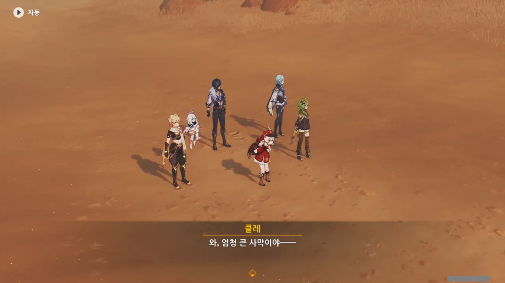

도착한 곳은 어딘지 모를 사막이었다.



이건 별 거 아니고, 그냥 다른 일을 하다 돌아오니, 회전초가 클레를 감쌌다가 뒤의 여행자에게 부딪혀 부서진 것이 웃겨서 찍었다.



아, 콜레이는 사막에 온 적이 없었나? 하기야, '숲의 순찰자'니까 사막에 올 일이 없긴 하겠다.



그런데 유라의 안색이 별로 좋지 않아 보인다. 어디 아프기라도 한 걸까?



유라의 말처럼, 이 근처에는 비경이라고 할 만한 것이 보이지 않는다.

우리가 각종 육성 재료를 캐기 위해 방문하는 그런 비경이라면 응당 돌로 된 입구가 있어야겠지만, 이벤트에 쓸 지역의 입구를 그런 식으로 만들었을 것 같지는 않다.

사막에 사람이 살지 않는 건 아니지만, 그래도 이렇게 주변에 물이라고는 코빼기도 보이지 않는 곳에서 살 수는 없다.

제대로 온 것이 맞을까?





클레이가 자신의 발음이 틀려 이상한 곳으로 온 것이 아닐까 걱정하지만, 아까 클레가 '간다르바 성곽'을 '간달파 성곽'이라 잘못 말했음에도 제대로 간다르바 성곽으로 온 것을 생각해 보면, 아마 그건 아닐 것이다.



분명 제대로 도착한 것은 맞을 테니, 다 같이 근처를 탐색해 보았다.



설마 초대장이 망가진 게 아닐까 의심하는 케이아.



하지만 주름 하나 없이 정말 멀쩡한 초대장에 뭔가 중대한 손상이 가해진 것 같지 않다.



응? 그게 무슨 소리지? 우리가 비경을 찾는 게 아니라, 비경이 우리를 찾게 한다고?



대충 이야기를 들어보면, 초대장이 우릴 올바른 장소로 인도한 것이 분명하니, 이제 비경이 우리를 찾아오도록 하면 된다는 이야기인데... 그게 과연 가능한 일인가?



이 상황에서 쓸 수 있는 필살기가 클레에게 있다고 한다.

필살기라는 단어를 듣자마자 곧바로 클레에게 "우리가 배울 수 있는 거야?"라고 묻는 유라.



음... 그 필살기라는 게 초대장에게 도와달라고 말하는 거라고?

클레의 엄마인 앨리스가 말한 것이니, 틀린 말은 아니겠지만... 무생물인 초대장에게 부탁한다는 건 쉬이 생각할 수 있는 내용이 아니잖아.



아니, 그런데 왜 그게 진짜예요?

안에 뭔가가 들어 있는 병이 날아온다. 생긴 게 마치 릴루페르가 들어있던 병처럼 생겼는걸.



케이아가 유라에게 "너도 클레의 필살기를 배워봐"라고 말하며 유라를 놀린다.

유라 성격 상, 절대로 다른 사람에게 자길 도와달라고 말할 리 없잖아. ㅋㅋㅋㅋㅋㅋ



리월에서 있었던 일이라면... 아마 주전자를 만졌더니 그 안으로 들어갔던 일을 말하는 거겠지.

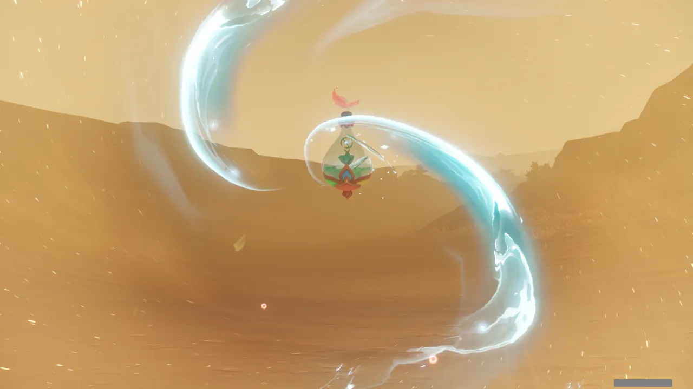

주전자, 아니 병을 만지자 안으로 빨려 들어간다.



수메르 우림지대를 생각나게 하는 초록이 반겨준다.

클레는 벌써 좋다고 먼저 뛰쳐나갔다.

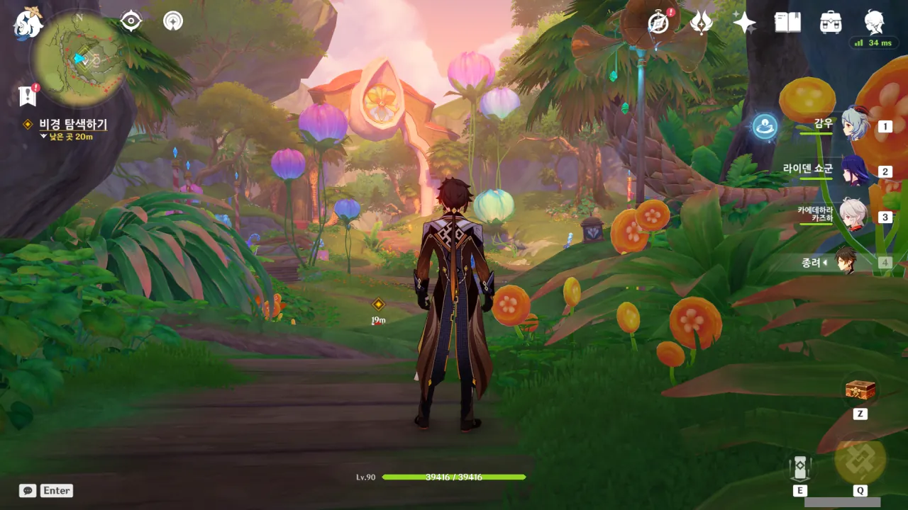

이곳의 분위기는 수메르 우림지대보다는, 아란나라와 함께 들어가던 비경처럼 생겼다.

뭐랄까, 약간 환상적인 분위기가 나는 수메르 우림지대라고 하는 편이 더 나으려나?



이 광경을 보고 제일 먼저 생각난 대사는 바로 '안이 밖보다 넓네'였다.

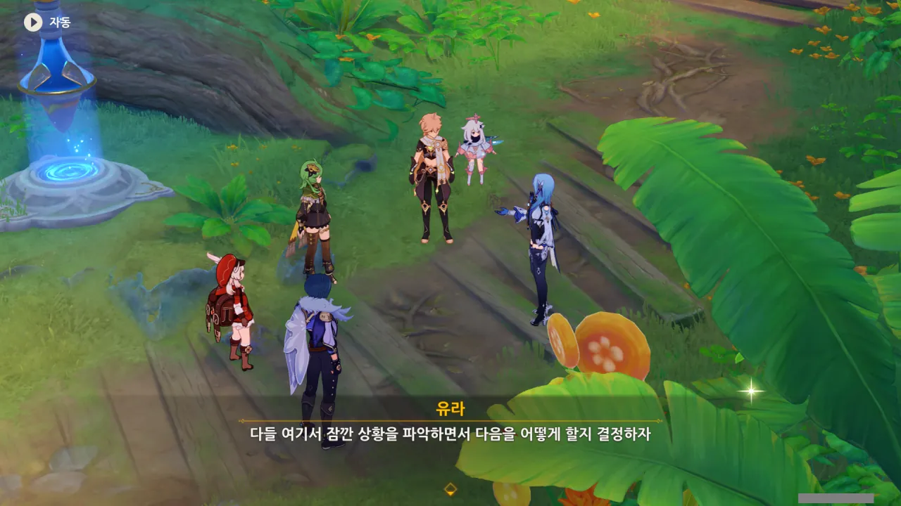

그래. 이곳은 겉보기에만 이렇지, \<프래그먼트\>에 나오는 '헨더스 섬'처럼 온갖 위험이 도사리고 있는 곳일지도 모르지 않은가.

일단 주변 상황을 파악하는 것이 제일 중요하다.



적왕과 병 속의 지니? 여기에도 알라딘 같은 이야기가 있었나 보다.

... 어쩌면 그게 릴루페르 이야기일지도 모르고.





나왔다, 클레 조련사!

클레가 요술병 이야기에 관심을 가지자, '자꾸 앞으로 튀어 나가면 그 이야기를 제대로 듣지 못할 거다'라며 클레의 목줄을 쥐는 케이아.



응? 뭐가 이상한 거야?



아직 여길 다 돌아다녀본 것이 아니니, 지금 그렇게 말하는 건 섣부른 판단 아닐까?



그래, 일단 계속 앞으로 가면 여기서 뭐가 어떻게 돌아가고 있는지 알 수 있을 거야.

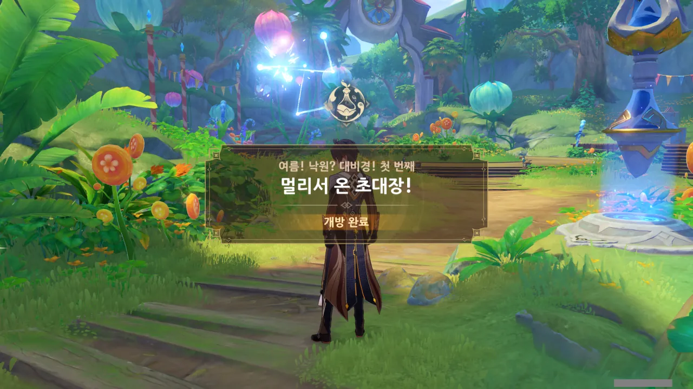

「여름! 낙원? 대비경!」 이벤트, 본격적으로 시작!

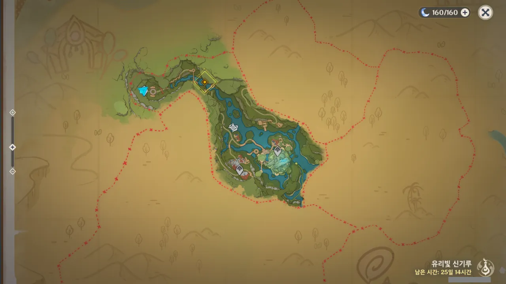

지도를 열고서야 알게 된 건데, 아직 밝혀지지 않은 곳은 마치 클레가 그린 듯한 손그림으로 채워져 있다.

ㅋㅋㅋㅋㅋㅋ 귀여워라...



오는 길에 온갖 퍼즐과 도전, 상자들을 보았지만, 스토리 진행이 우선이기 때문에 전부 무시했다.

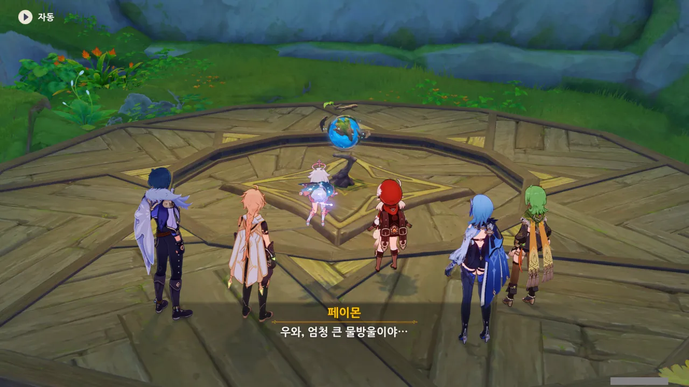

난 이걸 처음 봤을 때, 지구본 같다고 생각했다.

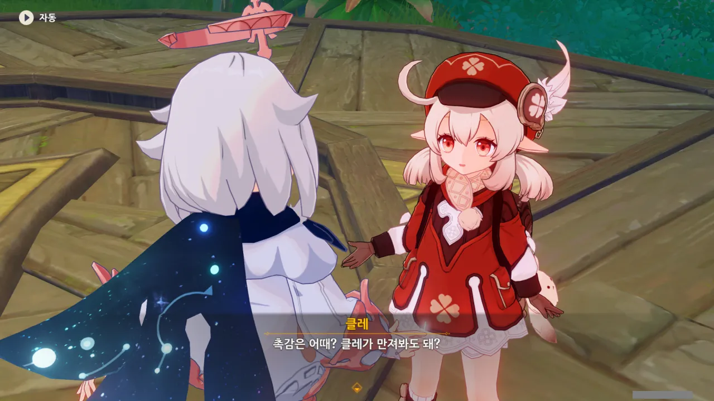

처음 보는 것을 섣불리 만져서는 안 된다는 건 일반적인 상식이다.

공포 영화를 보라. 대부분의 비극은 '처음 보는 무언가를 아무런 대비 없이 만져서' 시작되는 경우가 잦다. 에일리언 알이라거나, 에일리언 알이라거나, 에일리언 알이라거나.



여행자의 귓속말을 듣고 페이몬의 잔뜩 겁에 질린 표정 ㅋㅋㅋㅋㅋㅋ

내가 이래서 페이몬을 놀리는 걸 끊을 수 없다.



아직 이곳을 잘 모르니, 일단 만지지 않는 게 좋겠다는 유라의 말을 듣고 '그럴듯하네'라고 생각했는데, '아무것도 하지 않으면 아무 일도 일어나지 않는다'라는 페이몬의 말을 듣고서 또 '그럴듯하네'라고 생각해 버렸다.

난 설마 팔랑귀였던 건가?



어떻게 되긴. 잘 짜인 토마토케첩이 되는 거지, 뭐...

&nbsp;

오늘의 TMI: 영상 매체에서 문어나 주꾸미 등을 먹을 때 나오는 쭈압쭈압 소리는 고무장갑에 토마토케첩을 뿌린 후, 쥐어짜서 만든 소리다.



겁 하나는 확실히 잘 준 것 같다.



그럼 그렇지... 일부러 우릴 겁주려고 케이아가 거짓말을 한 것이었다.

괜히 나까지 쫄았네...

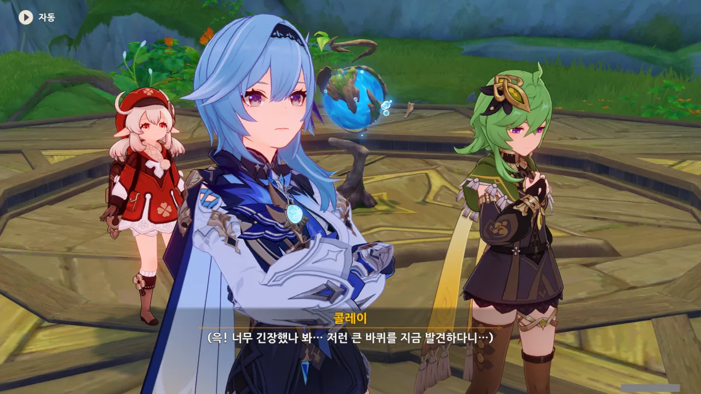

볼 때마다 자존감이 너무 낮은 것 같다는 생각을 지울 수 없는 콜레이.

충분히 그럴 수도 있지. 원래 사람은 긴장하면 시야가 좁아진다고.

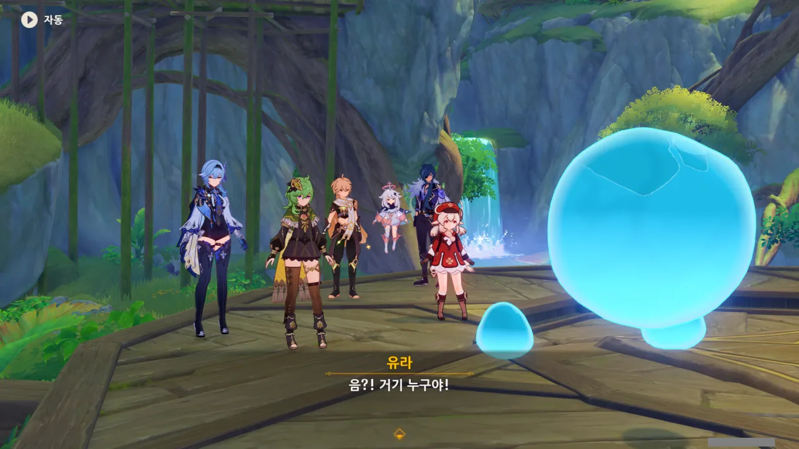

물방울 같은 것이 나타났다. 저런 건 처음 보는데.

이게 설마 그 야생의 포켓몬인가 하는 그런 건가?



페이몬은 아까 여행자가 속삭였던 '물방울 괴물'이 정말로 나타난 줄 알고 소스라치게 놀란다.



음... 일단 그렇게 보이긴 하는데...



마치 '그게 뭔 헛소리냐?'라고 말하는 듯이 의문을 표하는 모습을 보니, 이 녀석도 꽤 귀엽게 보인다.



이건 과연 긍정일까, 부정일까?

방금까지는 머리 옆에 감정을 표현하는 듯한 기호가 나타나서 뭘 생각하고 있는지 약간이나마 알 수 있었는데...



무슨 말을 하는 건지 알아듣기 힘들다고 케이아가 말하자, 갑자기 떫은 표정을 짓더니 어디론가 휙 사라져 버리는 「방울이」.



아, 저 밑으로 간 거였구나.

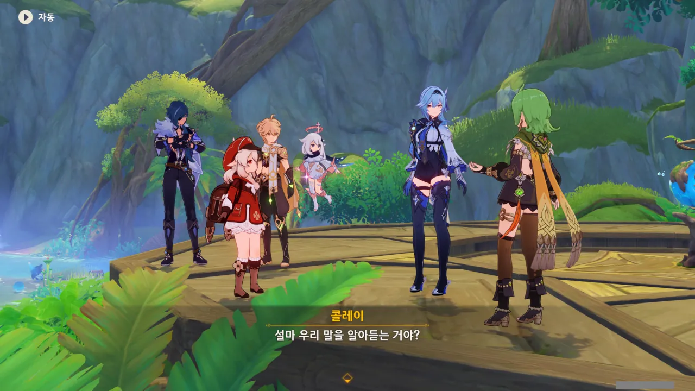

아, 설마, 자기가 뭐라 하는지 우리가 못 알아 들어서 직접 몸으로 보여주려는 걸까?



대체 왜 콜레이는 클레의 "성안의 고양이"라는 말을 듣고 의아해하는 거지?

설마 수메르에는 고양이가 없는 건가 싶었지만, 고양이는 분명 있었다. 일단 우림지대에 고양잇과의 큰 동물도 있고, 오르모스 항구에도 분명 고양이가 있었다.



그렇지. 몬드의 고양이는 죄다 캣테일 술집에 있으니... 그리고 거기엔 몬드의 주류 사업을 멸망시키려는 커다란 고양이(?)도 있다.

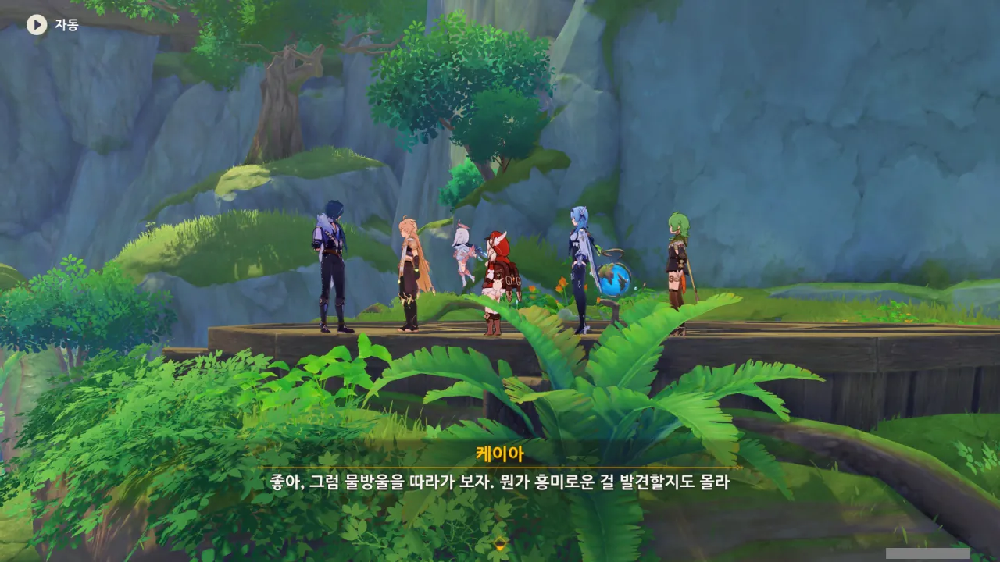

일단 물방울을 따라가 보기로 했다.



물방울은 앞에 있는 동굴의 안으로 들어갔다.

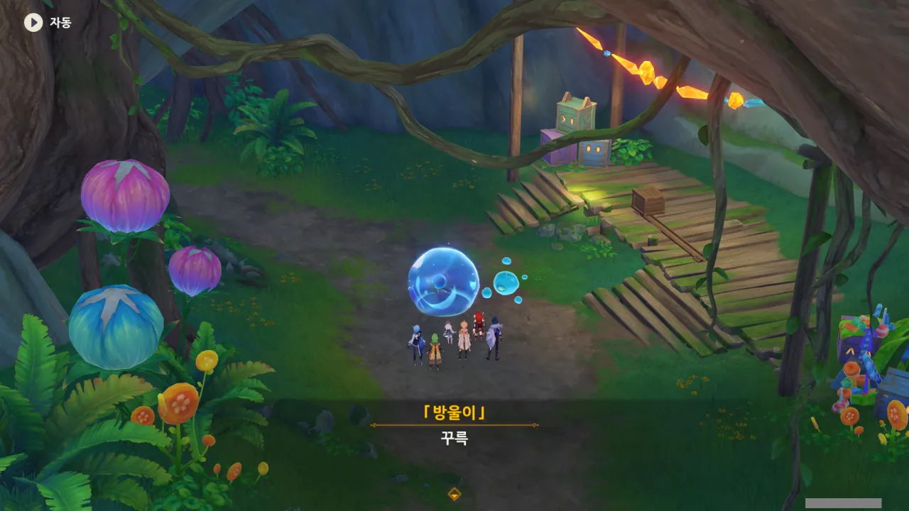

물방울을 따라 도착한 곳은 무대처럼 보이는 곳이다.



아, 척 봐도 알겠다. 여기서 뭔가 기믹을 수행하는 거겠지, 분명.



물방울이 하는 말이라고는 '꾸륵', '꾸르륵' 밖에 없으니, 대체 무슨 말을 하는 건지 알 수 없다.



그런데 클레는 대체 어떻게 물방울의 말을 알아들을 수 있는 거지?

설마 제트와 붐붐처럼 마음의 교감, 눈치, 뭐 그런 건가?



설마 바위벽 뒤에 물방울의 친구가 갇혀 있다는 말이었던 건가?



하지만 클레의 말에 따르면, 바위벽을 부숴서는 안 된다고 한다.

그럼 대체 어떻게 바위벽 뒤에 있는 친구를 꺼낼 수 있다는 거지?

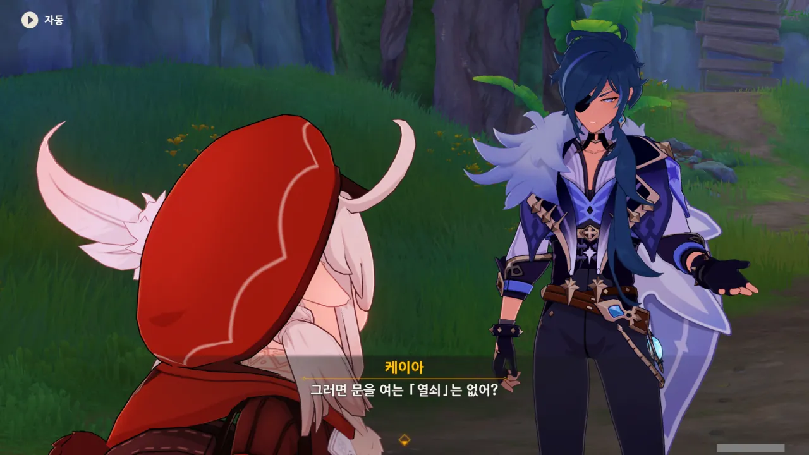

문? 열쇠? 아무리 봐도 문 같은 건 안 보이던데... 대체 무슨 말이지?



물방울이 바닥에 있던 물방울을 터트린 뒤, 그 안에 있던 장치에 들어갔다. 그러자 장치에서 빛이 나와 바위벽에 어떤 화면을 비춘다.

아, 이래서 바위벽을 부수면 안 된다고 했던 거였구나. 바위벽이 스크린 역할을 해야 하니까.

&nbsp;

여기서 2D 플랫포머를 하게 될 줄은 몰랐는데.



정황상, 2D 플랫포머를 끝내면 물방울의 친구를 꺼낼 수 있는 것 같다.



하지만 여기에는 화면 내부를 조작할 수 있을 만한 컨트롤러 같은 게 보이지 않는다. 설마, 안에 들어가서 직접 움직여야 하는 걸까?

하지만 저렇게 장치 안에 들어가는 건 물방울만 할 수 있는 일이잖아.





물방울이 이미 장치를 작동시켰으니, 우리는 이 비경에 들어왔던 것처럼 저 장치를 만지기만 해도 안으로 들어갈 수 있을 거라고 말하는 케이아.

음, 그게 지금 상황에서 가장 유력한 방법이긴 한데...

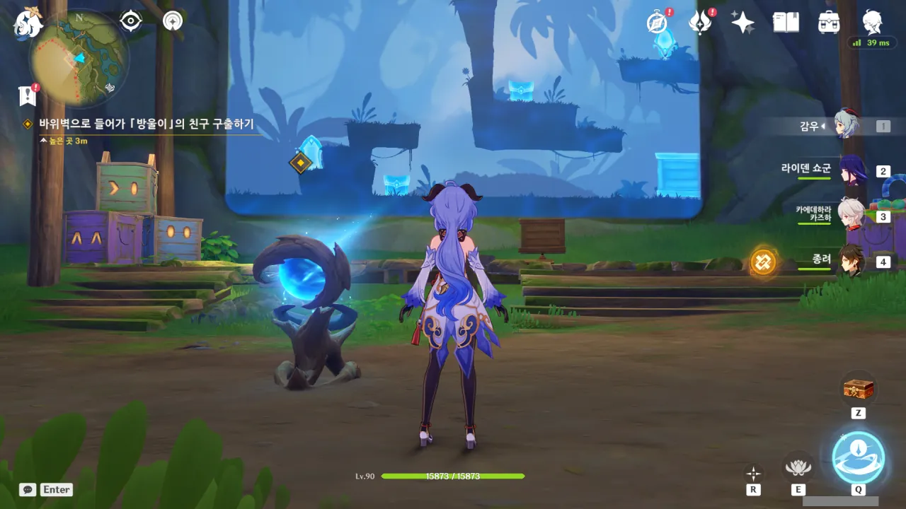

시작하기 전에, 혹시나 하는 마음에 무대 위에 있는 상자를 밀어보았다. 그러자 화면 속 상자 역시 같은 방향으로 움직였다.

그러니까 저 장치는 단순히 화면을 바위벽에 비추는 게 아니라, 주위 사물의 위치 역시 화면에 반영한다는 거네.





첫 번째 상자에서 또 다른 물방울이 나왔고, 두 번째 상자에는 일반적인 상자 보상이 나왔다.

원신에서 2D 플랫포머 게임을 하게 될 줄은 정말 몰랐다. 다만 옛날 고전 게임을 하는 것처럼 조작감이 영 어색하더라고.



둘이 다시 만나 기쁜지, 엄청 좋아하고 있다.



여행자는 여전히 물방울이 뭐라 말하고 있는지 알지 못하지만, 클레는 저 말들이 다 이해가 되나 보다.

동심의 힘인 걸까...?



그냥 장치를 건드리니 슉하고 페이퍼 여행자가 되어버렸으니, 특별한 느낌이 있을 리가.



맞아, 맞아. 따지고 보면 이건 케이아가 먼저 말을 꺼낸 거니, 케이아가 먼저 몸소 시범을 보였어야 하는 게 아니었을까?

나도 모르는 사이에 케이아에게 또 짬처리를 당했다.

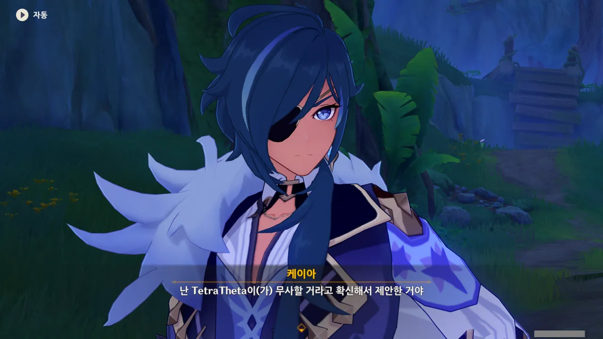

쯧, 둘러대기는 또 잘해요.





이곳에 다른 사람은 없냐고 묻자, 물방울이 어디론가 가버린다.

이번에도 물방울을 따라가면 다른 사람이 있는지 없는지 알 수 있겠지.
