



앞에 마을이 있는 걸 보고 클레가 "사막 이모도 안에 있을까?"라고 궁금해하는데, 아닐 것 같다.

그야, 여기 마을 주민은 전부 사람이 아니라 물방울인 것 같거든. 봐라, 곳곳에 있는 것이 죄다 물방울 아닌가.

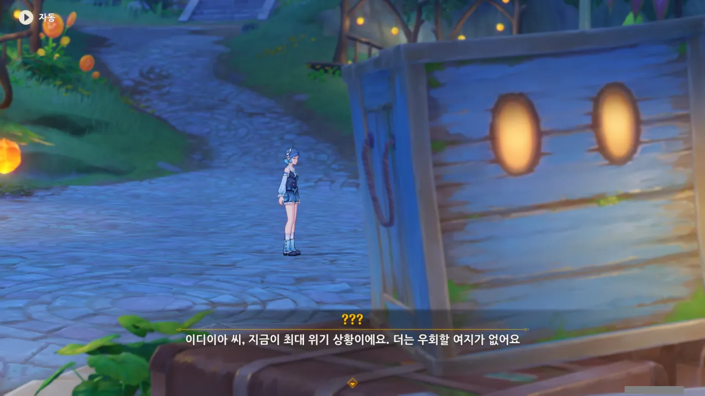

그런데 그 생각을 하자마자 곧바로 누군가와 대화 중인 사람이 나와버렸다.

무언가가 최대 위기인 상황이라는 말이 들린다. 그래, 이야기에 위기가 없어선 안 되지.

이야기의 흐름이 발단-전개-위기-절정-결말이 되지 않으면 무척이나 이상한 이야기가 될 것이다.



오, 게다가 심지어 최근 며칠 동안 상황이 더 악화되었다는 말까지 들린다.



어...? 이 모습은? 설마 코코미, 너 맞니?

왜 여기에 코코미가 있는 걸까? 여태껏 코코미가 이나즈마 바깥으로 나온 걸 본 적이 없는 것 같은데...

&nbsp;

드디어 이름이 밝혀진, '이디이아'는 자신이 이곳의 주인이 아니라고 말한다.

그러면 대체 코코미가 왜 여기 주인이 아닌 이디이아에게 이곳의 위기에 대해 설파한 걸까?





코코미 맞네.

&nbsp;

코코미의 말에 따르면, 지금 이 비경은 천천히 무너지고 있다고 한다. 여기까지 올 때, 딱히 여기가 무너지고 있다는 느낌은 들지 않았는데...

이디이아가 비경을 여태 방치하고 있었던 건지, 코코미가 이디이아에게 비경을 보수하라고 설득하고 있다.



아니, 코코미의 전신을 다 보여줘 놓고 '군사님?'이라고 하는 건 좀 너무하지 않냐? ㅋㅋㅋㅋㅋㅋ

이디이아의 이름은 처음부터 보여줘 놓고, 코코미만 이런 취급이라니...





코코미가 이디이아를 설득하는 데 성공했다. 대체 이디이아가 말한 '역전의 기회'란 뭘까?

그리고 그 '역전의 기회'가 뭔지 들을 수 있을 것만 같은 시점에, 페이몬이 눈치 없게 "히히, 난 벌써 누군지 알겠는걸"이라며 방해했다.

나도 저 '군사님?'이 누군지는 알아...

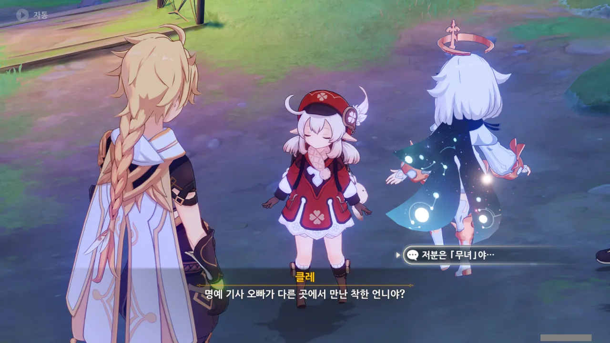

아, 그래, 맞아. 코코미는 '아라히토가미 무녀'였지, 참.

솔직히 말해, '코코미'라고 하면 '와타츠미 저항군의 지도자'라는 타이틀이 제일 먼저 떠오른다.

다들 '이나즈마의 무녀 캐릭터'라고 하면 제일 먼저 야에 미코를 떠올릴걸? 이건 어쩔 수 없다.

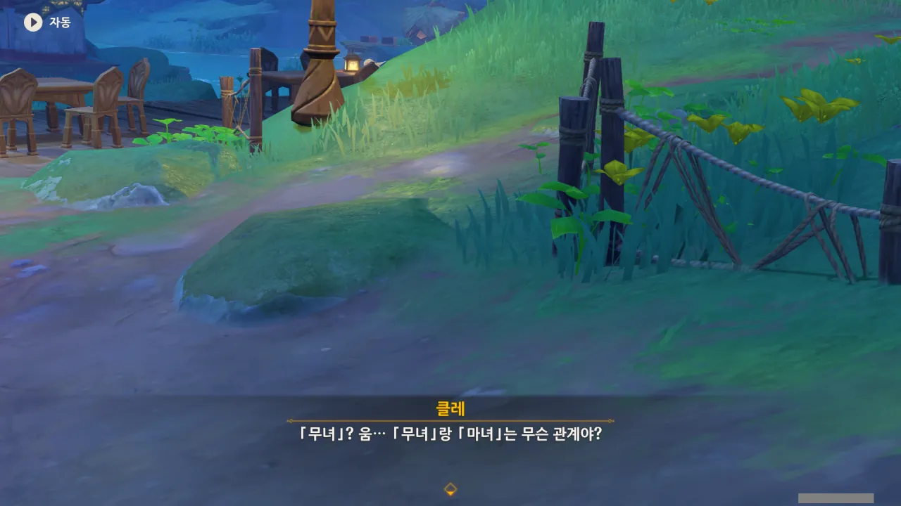

클레가 아직 어려서 그런 걸까, '무녀'와 '마녀'의 차이점이 뭔지 잘 모르는 듯하다.

그 둘... 완전히 다르지?



이디이아가 자신을 '유리빛 신기루의 관리자'라고 소개한다.

이 비경 이름이 '유리빛 신기루'였구나. 유리병에 담긴 비경이었으니, 정말 이름값 하는 비경이라고 생각한다.

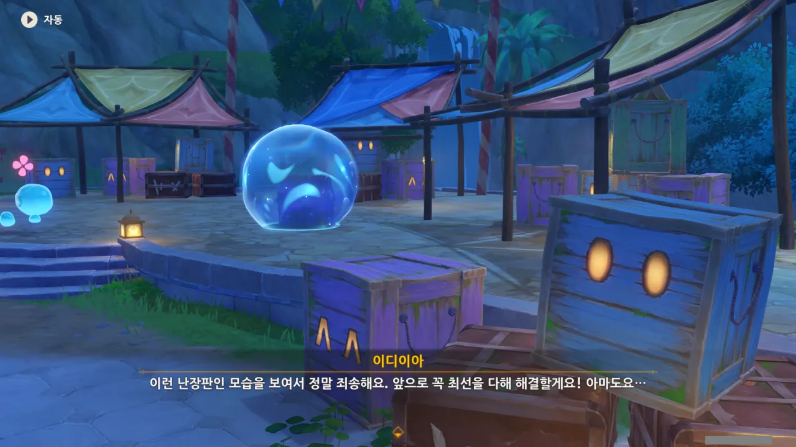

어... 이게 난장판이었어? 난 여태껏 그냥 '상자가 좀 많네'라고만 생각했는데.

그러면 상자 안에는 여길 장식해야 할 장식이 가득 담겨있는 걸까?



코코미가 자기소개를 하려 했지만, 이디이아에게 인터셉트당했다.



이나즈마의 음양료...? 처음 들어보는데?



이나즈마를 돌아다니며 '음양술' 같은 건 들어본 적이 없는 거 같은데... 대체 이게 어찌 된 일이지?

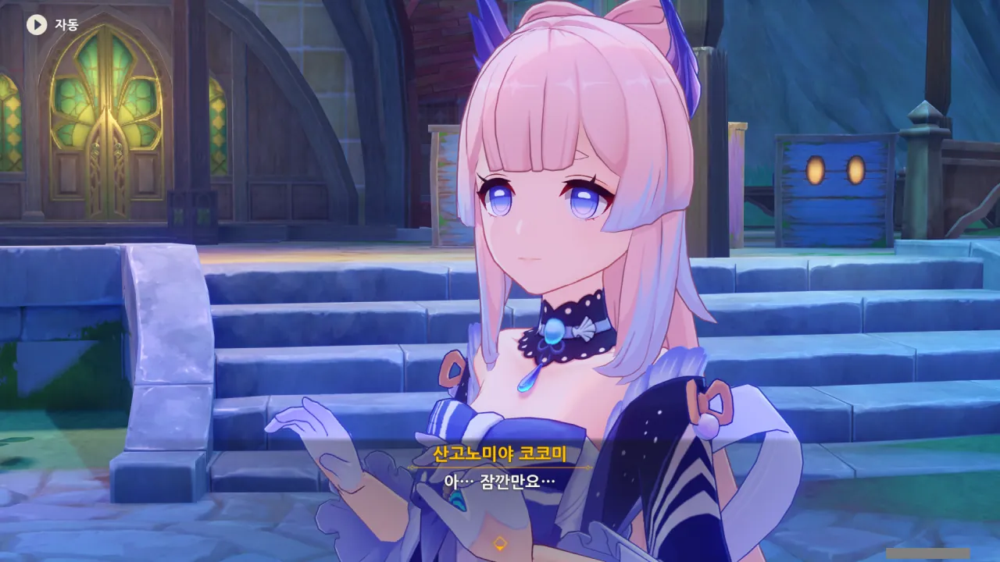

아, 대충 이해했다.

코코미가 이디이아를 말리려는 것으로 보아, 코코미가 이디이아에게 거짓으로 자기소개를 한 모양이다.





아, 그런 설정이었구나. 뭔가 라이트노벨 느낌 나는 설정인걸.

&nbsp;

코코미는 라이트노벨 출판사 사장인 야에 미코와 서로 '쪼꼬미 유부'와 '심해 혀넙치'라는 필명으로 펜팔을 교환할 정도로 교류가 깊다. 그녀가 즐겨 읽는 소설인 '침추습검록' 역시 야에 출판사에서 내놓은 책이고.

라이트노벨을 즐겨 읽던 코코미는 이디이아에게 자길 소개할 때, 라이트노벨에서나 나올 법한 설정을 대신 이야기한 것 같다.

대체 왜?

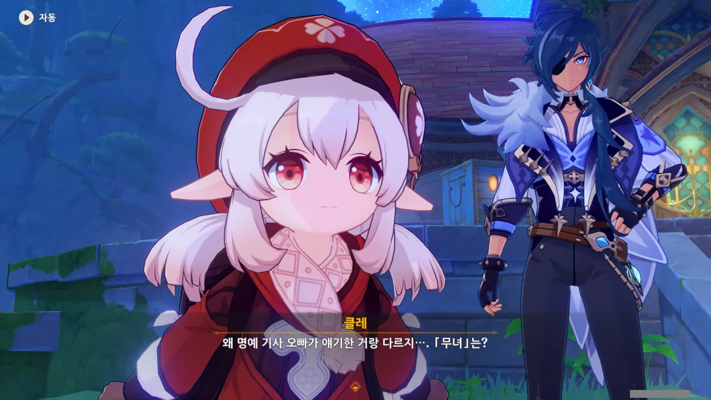

그리고 진실이 아닌, 중이병스러운 거짓 설정으로 자길 소개한 결과는 혹독했다.

순수한 클레가 '왜 여행자 오빠에게 들은 것과 내용이 다르지?'라고 묻는 걸 보라.

안 그래도 가뜩이나 거짓으로 자기소개를 한 걸 들켜 부끄러운데, 저런 소리까지 들으면 쥐구멍에라도 억지로라도 머리를 욱여넣고 싶어질걸?



으아악, 콜레이, 그런 거 아냐! 하지 마!



자신의 본명을 모두에게 소개하는 코코미.

나만 이게 코코미가 다급하게 상황을 수습하려 하는 것으로 보이는 것은 아닐 것이다.

여기서 앞으로 계속 「군사」로 불렸다간, 코코미가 잘 익은 생선이 될지도 몰라.

&nbsp;

'군사'라는 호칭을 '스스로 붙인 별칭'이 아닌, '다른 사람이 보내주는 찬사'라고 얼버무리는 데 성공한 것 같다.



앨리스가 클레에게 이야기를 들려줬다고? 흠... 그 이야기가 정상적인 이야기가 아닐 것 같다는 생각을 도저히 떨쳐낼 수 없다.

왜냐고? 그야, 앨리스는 걸어 다니는 광기 덩어리니까 그렇지...

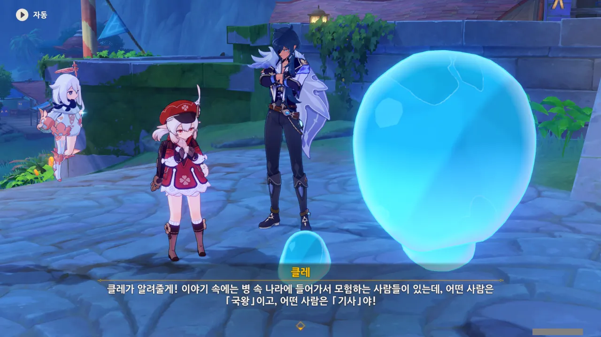

내 걱정과는 달리, 앨리스가 클레에게 들려준 이야기는 정상적인 '역할극이 가미된 모험담'이었던 것으로 보인다.

진짜 나라의 국왕이 국정을 내팽개치고 모험을 할 리는 없으니, 저 이야기에 나오는 「국왕」이나 「기사」 등은 진짜 국왕이나 기사가 아니라, 어떤 역할의 이름이겠지.





「군사」가 자신의 필명인 '심해 혀넙치'보다 귀엽다고 생각하는 코코미.

'군사'가 '심해 혀넙치'보다 훨씬 나은 별명이라고는 할 수 있겠지만, '군사'가 더 귀여운 건지는 잘 모르겠네.

&nbsp;

사실, 여태 있었던 대화 중 일부가 매끄럽게 이해가 되지 않았다. 지금 저 대화도 대체 왜 '군사'가 '심해 혀넙치'보다 *귀여운* 별명인 지 이해가 안 되거든.

설마, 중국어 원문에서 한국어로 번역할 때 오역이 발생한 게 아닐까?

이건 단순한 억측이 아니다. 같은 회사에서 만든 게임, '붕괴: 스타레일'이 지금 무수한 오역으로 홍역을 앓고 있거든.

출시한 직후부터 지금까지 곳곳에서 수많은 오역이 발견되었는데, 한국어 더빙조차 그 잘못된 번역을 기반으로 녹음된 것이 바로 '붕괴: 스타레일'의 현 상황이다.

사소하고 자잘한 오역은 여러 사람들의 제보로 수정되긴 했지만, 대다수의 오역은 여전히 잘못된 채 그대로 존재하고 있다. 더빙 역시 재녹음 없이 오역 내용 그대로 재생되고 있고 말이다.

그리고 지금 난, '붕괴: 스타레일'을 번역했던 팀이 이번 원신 이벤트 역시 번역한 게 아닐까 하는 의심을 품고 있다.



아, 그러네. 코코미는 여행자와는 아는 사이지만, 나머지와는 이번이 처음 만나는 것이다.

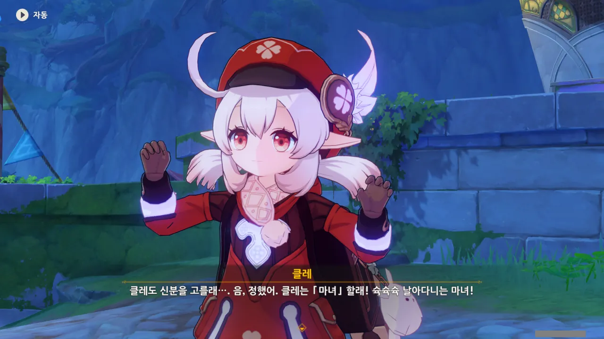

아, 여기서도 그 역할극을 하는 거야?

클레는 자신의 역할로 「마녀」를 골랐다. 분명 엄마인 앨리스가 마녀인 것 때문이겠지.



케이아는 「대도」가 되었다. 도적 ㅋㅋㅋㅋㅋㅋ

케이아 전설 임무에서 케이아의 할아버지가 해적이었다는 이야길 들었는데, 그 손자인 케이아 역시 이번 역할극에서 '도적'이 되었다.

&nbsp;

여행자는 「기사」, 페이몬은 「요정」이 되었다.



> 잠깐만, *이렇게* 「기사」 자리를 *뺏긴다*고?

유라는 자신이 '기사' 역할을 맡을 것으로 기대한 모양이다.

기사 짬밥은 여행자보다 유라가 더 많이 먹었을 테니, 당연한 일이겠지만... 게다가 정식 기사인 유라와 달리, 여행자는 명예직인 명예 기사일 뿐이지 않은가.

그 대신 유라는 모든 걸 베어버리는 「마검사」가 되었다.





콜레이는 「치유사」 역할을 맡게 되었다.

내심 자신의 역할이 「모험가」나 「음악가」 같은 것이 될 줄 생각하고 있었던 콜레이는 자신이 타이나리처럼 「치유사」 역할을 잘 해낼 수 있을지 고민하고 있다.

콜레이니까 잘하겠지, 뭐.

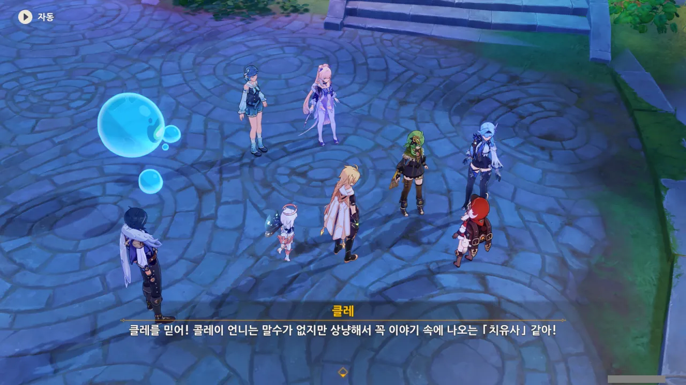

그런데 클레가 콜레이에게 「치유사」 역할을 준 이유가 뜬금없다. 콜레이가 이야기 속에 나오는 치유사처럼 말수가 없고 상냥해서라고?

어... 그게 맞나?



유라가 애써 콜레이를 위로해주려 한 것 같지만, 역효과가 난 것 같다. "붕대 맞지?"라니...

그래도 콜레이는 씩씩하게 최선을 다하겠다고 말한다. 아유, 귀여워라.

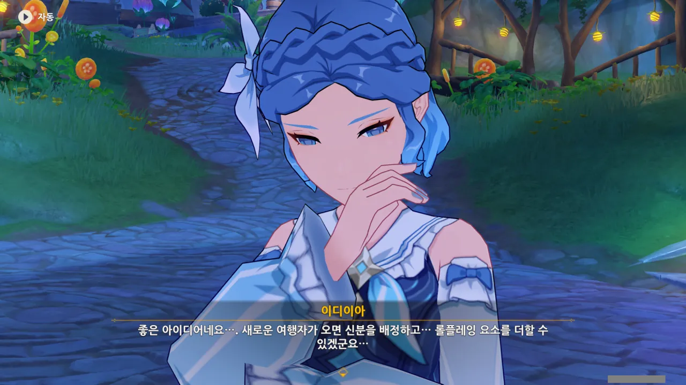

이디이아가 말하는 걸 들어보면, 여긴 비경이라기보다 뭔가 테마 파크 같은 곳인 것 같다.

비경에 롤플레잉이라니, 들어본 적 없거든.



그러네. 이디이아는 이미 관리인이니까 별다른 역할이 필요 없는 거 아닐까?



클레가 이디이아에게 「마스코트」 역할을 주자, 이디이아의 표정이 급격히 어두워진다.

그걸 눈치챈 케이아가 이디이아에게 다른 역할을 주는 게 어떻겠냐고 클레에게 말한다.



> 「마스코트」는... 그 아무 일도 안 하고, 일은 다른 사람에게 다 맡기는 안일한 캐릭터인가요... 이럴 수가, 들켜버린 건가요...

어이, "들켜버린 건가요"라니. 설마 우리에게 모든 일을 다 맡기고 혼자 탱자탱자 놀 생각이었던 거야?

그럼 곤란한데.



하지만 코코미가 '마스코트는 팀의 사기를 드높이는 아주 중요한 역할'이라고 하자, 대번에 마스코트 역할을 수락한다.



이디이아 역시 클레처럼 물방울의 말을 알아들을 수 있는 것 같다.

대체 클레와 이디이아 사이에 무슨 공통점이 있길래 그게 가능한 걸까? 아니면 이게 이디이아의 정체에 대한 떡밥인 걸까?



저 물방울들을 부르는 정식 명칭이 따로 있는 것 같다. 나중 가면 알 수 있겠지?





다시 본론으로 돌아와 이야기하자면... 얼마 전 이 비경이 일부 파괴되면서 비경 속 대부분의 장치가 작동을 멈췄다고 한다.

어... 그러면 우리가 지나오며 본 것들이 다 장치의 일부분이었던 거야?

어? 친구의 딸? 설마 이디이아가 앨리스의 친구였던 거야?





클레가 자신을 앨리스의 딸이라고 소개하자, 이디이아가 소스라치게 놀란다.

아니, 대체 예전에 무슨 일이 있었던 거야? 설마 앨리스가 이디이아에게 '말 안 들으면 전부 터트릴 거야~!'라고 윽박지른 건 아니겠지? 앨리스라면 충분히 그럴 수 있어...





> 그런 거였어. 마녀의 아이도 마녀였구나.

뭐... 틀린 말은 아니지. 그런데 그렇게 말하면 '마녀'가 그리 좋은 뜻의 단어가 아닌 것으로 보이는데... 설마 진짜 그런 건 아니지?

그나저나 신기루 코어 속에 백 년 동안 숨는다고 말하는 것으로 보아, 이디이아는 평범한 사람이 아닌 게 확실하다. 평범한 사람은 백 년 동안 살 수 없거든.



> 쿨레이, 네가 원래 이렇게 설명하는 캐릭터였어?

이건 과연 메타 발언인 걸까?



음... 물건 수리도 잘하고, 물건 파괴도 잘하고... 아무튼 이것저것 다 잘하긴 하지...

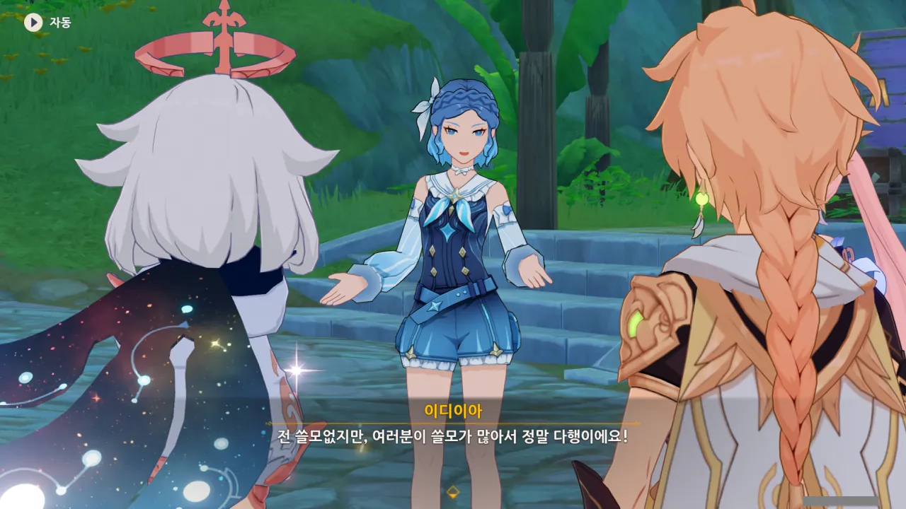

예전에 앨리스가 이디이아를 갈구기라도 한 건지, 이디이아의 자존감이 아까보다 더 하락했다.



아까 전부터 계속 생각하고 있었던 건데, 사실 '이디이아'의 진짜 이름은 '이디야'가 아닐까?

원래 이름은 '이디야'지만, 같은 이름의 상표가 있는 탓에, 그걸 조금 늘여서 '이디이아'라고 말하는 거지...





잠깐 쉬면서 다른 사람들의 이야기를 엿들었다.

어떻게 말해야 타이나리 같을지 고민하는 콜레이에게 타이나리의 말투를 따라 해 보라는 조언을 건네주는 케이아와, 그 조언을 듣자마자 대번에 "손에 든 버섯 내려놔! 그건 못 먹는 거야!"라는 말을 하는 콜레이.

타이나리... 콜레이에게 그런 이미지였구나... ㅋㅋㅋㅋㅋㅋ 케이아 역시 "네 스승님이 어떤 분인지 단번에 알겠다"라고 말하니, 웃음을 참을 수 없다.

그런데 케이아라면 왠지 옛날에 타이나리가 콜레이, 사이노와 함께 몬드에 방문했을 때 타이나리를 멀리서 몰래 관찰했을 것 같은데... 그때 케이아는 다른 일 때문에 바빴었던 건가?



「대도」가 듣기 좋은 역할은 아닌 것 같다고 말하는 콜레이에게 '대도는 적의 물건을 훔치니, 우리에겐 좋은 사람이다'라는 논리를 펼치는 케이아.

반... 반박할 수 없다!



물고기? 많지. 와타츠미 섬 지하에는 물고기보다 더 큰 물고기도 있어.

아, 왜. 심해 용 도마뱀도 일단 물에 살고, 고기니까 물고기라고 해도 틀린 말은 아니잖아.



'산고노미야 코코미'라는 이름에 바다라는 뜻이 있었던가?

찾아보니, 일본어로는 <ruby>珊瑚<rp>(</rp><rt>さんごの</rt><rp>)</rp></ruby><ruby>宮<rp>(</rp><rt>みや</rt><rp>)</rp></ruby> <ruby>心<rp>(</rp><rt>ここ</rt><rp>)</rp></ruby><ruby>海<rp>(</rp><rt>み</rt><rp>)</rp></ruby>라고 한단다. 이름에 바다를 뜻하는 海가 들어있긴 하네. 평소에는 기껏해야 Sangonomiya Kokomi라고 들어본 게 전부라서 전혀 모르고 있었다.

여기서 살짝 웃음 포인트를 짚자면, 코코미의 별명 중 하나가 바로 '물고기'이다. 옷의 생김새가 생선 꼬리처럼 생겼거든...



아, 이건 100% 카베 이야기다.



이건 유라의 친척 이야기가 분명하다.





유라의 친척은 비경에 변화가 생긴 후, 북쪽 구역으로 갔다고 한다.



자신의 새로운 역할인 「마스코트」에 완전히 몰입한 이디이아. 과연 그녀는 「마스코트」에 걸맞은 활약을 보일 수 있을 것인가!

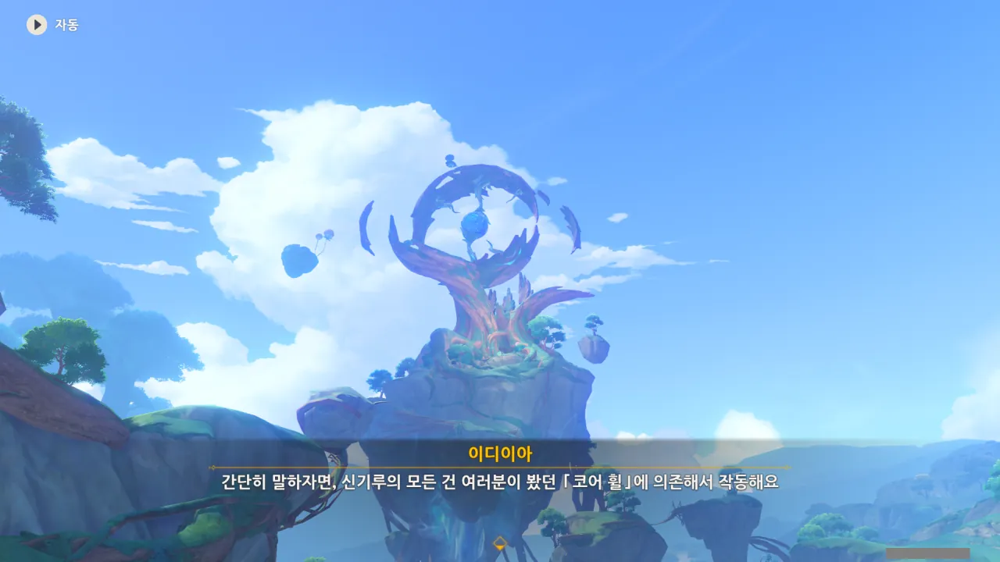

이전에 봤던 커다란 바위가 '코어 휠'이라고 한다.





하지만 신기루에 큰 혼란이 생긴 후, 코어 휠의 부품이 4개가 떨어져 나갔고, 그래서 신기루 비경이 작동을 멈췄다고 한다.

저 커다란 게 원래 빙글빙글 돌아가는 거였다니, 믿기지가 않는걸.



음, 알겠다. 어딜 가나 흔히 볼 수 있는, '조각 모음' 임무 되시겠다.

다만 이 문제를 해결하기 위해서는 일행이 나뉘어야 할 것만 같다. 다 같이 모여서 부품을 하나하나 찾느니, 일행을 나눈 후, 따로 떨어져 찾는 게 더 효율적일 테니.



콜레이가 "억지로 웃지 않아도 괜찮아요"라고 하자마자 금세 다시 시무룩해져 침울한 목소리로 나머지 내용을 말하는 이디이아.

마스코드 역할 대실패!



유라와 콜레이는 북쪽 구역으로 가게 되었다. 마침 유라가 찾던 친척 역시 북쪽으로 갔다 했으니, 꿩 먹고 알 먹기인 셈이다.

&nbsp;

그러고 보니, 유라와 콜레이는 서로 앰버라는 연결 고리가 있었네. 유라와 앰버는 서로 친한 사이이고, 콜레이와 앰버 역시 친하니까.

둘이 함께 다니며 어떤 모습을 보일지 궁금하다. 그걸 내가 보지 못하는 게 좀 아쉽네.



케이아와 클레는 서쪽 구역으로 가게 되었다. 클레와 클레 브레이크인 케이아를 같이 배치한 것 역시 훌륭한 인원 배분이다.

'행보'가 무슨 뜻인지 몰라 머리를 긁적이는 클레가 너무 귀엽다. 아주 귀엽다. 매우 귀엽다.

그럼 남는 게 여행자와 코코미, 이디이아가 된다. 이것 역시 나쁘지 않은 인원 배분이다.

여기 있는 사람 중 코코미와 안면이 있는 사람은 여행자뿐이고, 이디이아 역시 그나마 코코미와 함께 다니는 것이 더 편할 테니까.

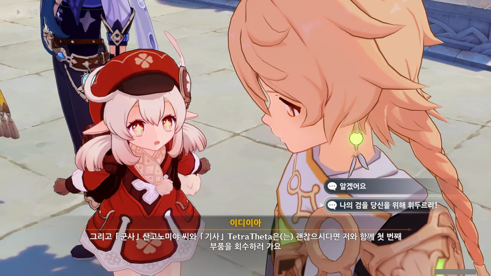

눈을 반짝반짝 빛내고 있는 클레를 보니, 나도 모르게 두 번째 선택지로 손이 가게 되더라.

하... 클레는 너무 귀엽다니까.

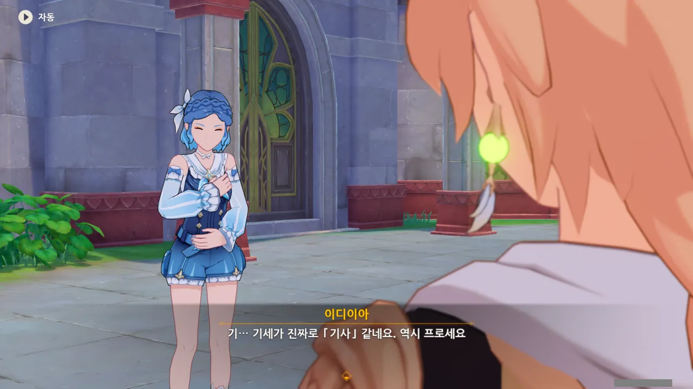

그야, 동심은 지켜줘야 하니까.



일단 흩어졌다가, 각자 뭔가를 발견하면 다시 이곳으로 모이기로 했다.



솔직히 말해, 클레가 케이아를 챙기는 게 아니라, 역으로 케이아가 클레를 챙기는 게 올바른 표현 아닐까?



그 모습을 보며 잠시 이디이아가 할 말을 잃는데, 대체 무슨 의미일까?

도저히 못 볼 꼴을 봤다는 경멸의 뜻일까? 아니면 클레에게서 앨리스의 모습을 보며 두려움에 떨고 있는 걸까?





이디이아는 첫 번째 부품을 발견했지만, 나머지 세 개도 마저 찾아야 한다는 생각에 의욕이 바닥나 그냥 돌아왔다고 한다.

거 참... 정말 의욕이 없구나.
