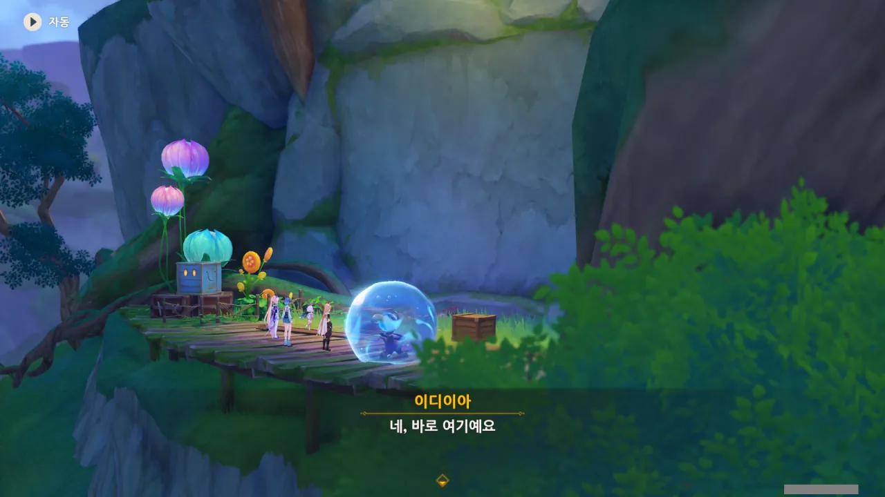
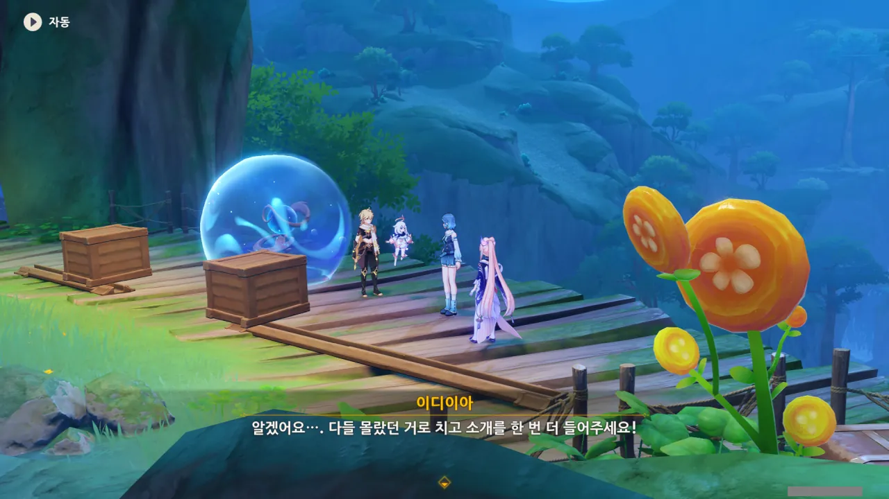
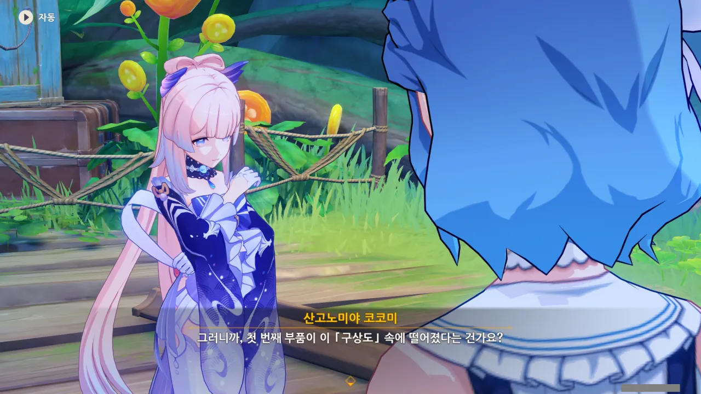
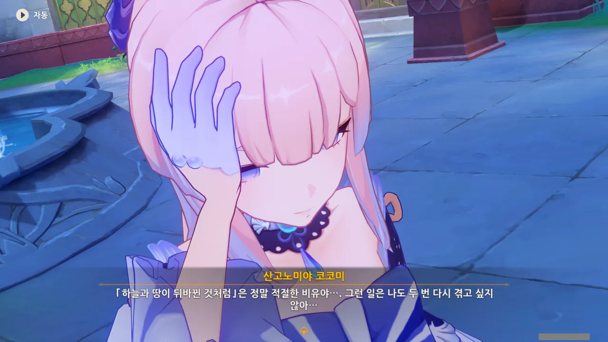
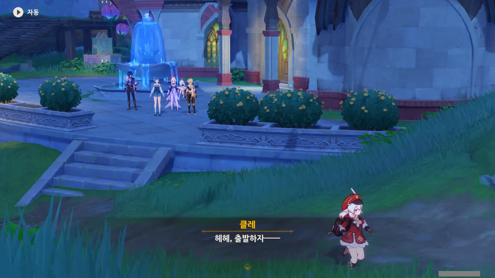

이벤트가 약 19일 남았다. 하지만 난 아직 이벤트 스토리의 1/3도 채 끝내지 못했다. 귀찮았기 때문이다.

어디 스토리뿐인가? 필드 곳곳에 놓여 있는, 원석을 주는 상자와 퍼즐 역시 그대로 남아있다. 지도 사이트에서 하나하나 체크해 가면서 할 예정이라, 귀찮음이 배가 된다.

마음 같아서는 이렇게 이벤트 스토리를 정리하는 걸 때려치우고 이벤트 스토리만 빠르게 즐기고 싶지만, 그렇게 한다면 귀여운 클레의 모습을 남길 수 없게 된다.

그건 있을 수 없는 일이지, 암.





와타츠미 섬에서의 일이 일단락된 후, 코코미는 모처럼 시간이 난 김에 바깥을 둘러보기로 결정했고, 멀리 가야 시야를 넓힐 수 있는 걸 볼 수 있을 거라 생각해 수메르까지 왔다고 한다.

그 외에도 다른 이유가 있다고는 하는데, 그건 아마 이벤트 스토리를 더 진행해야 알 수 있을 것 같다.

&nbsp;

그런데 코코미는 대체 어느 경로를 통해 수메르까지 온 걸까? 일단 이나즈마의 이도에서 리월항으로 이동한 후, 수메르까지 도보로 이동하는 방법이 있고, 이도에서 수메르의 오르모스 항구까지 곧바로 오는 방법도 있다.

아마 후자겠지...?

첫 번째 부품은 바로 여기에 있다고 한다.



아, 이거, 저번에 했던 그거잖아. 영사기처럼 빛을 비춰서 2D 플랫포머 게임을 하는 그 기믹 말이다.



저런. 원래 이디이아의 역할이 이 기믹을 설명하는 거였는데, 그걸 「방울이」에게 빼앗겨버렸다.

> 이것조차 물의 환령에게 뺏길 줄이야...

이디이아가 이 말을 할 때, 마치 '뭐, 내가 하는 일이 다 그렇지...'라고 한탄하는 것 같더라.

그나저나 「방울이」의 이름이 '물의 환령'이었구나.





낙담해하는 이디이아를 코코미가 잘 달래 기운을 북돋아준다.

코코미가 잘 달래준 덕분에, 이디이아가 기운을 차렸다.



이 장치의 이름은 「흐름 영사기」라고 한다. 적어도 '영사기' 부분은 맞췄네.



지금 신기루 비경의 상태가 영 좋지 않은 관계로, 현재 영사기는 평면 공간인 「구상도」의 사물만 구현할 수 있다고 한다.

음... 그러니까 '등불'은 '흐름 영사기'이고, '2D 플랫포머'는 '구상도'라는 건가?

그리고 우리가 구해야 할 첫 번째 부품은 저 구상도 안에 있다고 한다.

저번에 상자를 열어 물의 환령을 구출했던 것처럼, 이번에도 안에 들어가 상자를 열면 되겠지?





> 안에 들어가서 부품을 회수하는 동안, 전 밖에서 응원의 춤을 출게요!
> 사실 뻥이에요... 저 몸치라 춤도 출 줄 몰라요...

아하하... 저 느낌이 뭔 느낌인지 알 것 같기도 하다. 이상은 넘치는데 현실은 시궁창이라는 거 아냐.



아무튼 구상도 안에서 부품을 회수했다.

코어 휠의 생김새가 나무줄기처럼 생겼기 때문에, 그 부품 역시 나무줄기를 닮은 모양일 거라 생각했는데, 평범한 톱니바퀴였다. 그 크기도 굉장히 작고.

이거 정말 코어 휠의 부품이 맞아?

이디이아가 이게 코어 휠의 떨어진 부품이라고 하니, 정말 코어 휠의 부품이 맞겠지만... 대체 왜 크기가 작아진 걸까?

설마 구상도 안에 떨어지면서 그 크기가 작아진 건 아니겠지?



하지만 회수해야 하는 부품은 이것 말고도 3개나 더 있다.

3개를 더 찾아야 한다는 생각에 침울해하는 이디이아를 코코미가 말로 잘 구슬린다.



ㅋㅋㅋㅋㅋㅋ

코코미가 숨기고 싶어 하는 중이병 시나리오가 또다시 수면 위로 떠올랐다.

여기서 '그거, 사실 뻥이에요'라고 할 수도 없으니, 코코미의 마음은 오늘도 타들어간다...



이디이아가 코어 휠을 복구할 동안, 일행은 마을로 돌아가기로 했다.

그나저나 이디이아의 자존감이 너무 낮다. 이대로 있다간 이디이아에게 짜증을 낼 것만 같아...



코코미가 뭔가 마음에 걸리는 게 있는가 보다.





코코미가 등불의 사용법을 자세히 설명해 달라고 한다. 등불이 아까 그 영사기를 말하는 거잖아.

영사기면 영사기, 등불이면 등불. 명칭을 서로 좀 통일해줬으면 한다. 이렇게 하나를 부르는 여러 단어를 볼 때마다 '이게 그건가? 아니, 저건가?'라고 때려 맞출 수는 없는 노릇 아닌가.

코코미가 "그랬구나..."라고 하는 순간, 지진이라도 난 것처럼 땅이 심하게 흔들렸다.

오, 저게 진짜 돌아가네? 마치 햄스터 쳇바퀴처럼 돌아간다.

하지만 코어 휠은 잠시 돌아가다가 다시 멈췄다.



방금 코어 휠의 회전 속도는 예전보다 훨씬 느렸다고 코코미가 말한다.



알고 보니 코코미는 여행자 일행보다 '조금 더 일찍' 신기루에 도착했었다고 한다. 그 덕에 사고가 터지기 전의 신기루 비경의 모습을 볼 수 있었다고 한다.

와, 그러면 이 비경이 이렇게 된 게 여행자가 오기 조금 전에 터진 사고 때문이었던 거야?

난 여태 이디이아가 비경에 일어난 사고를 몇 달, 최소한 몇 주 동안 방치한 거라고 생각하고 있었는데...

NPC들이 '하늘과 땅이 뒤바뀐 것처럼'이라고 말할 때, 거꾸로 된 화면을 180도 돌려 다시 정상 각도로 돌려놓는 연출이 공통적으로 나온다. 그게 코코미의 말처럼 '세상이 뒤집히는 느낌'인가 보다.

이야, 그러면 머리에 피가 잔뜩 쏠리겠네.



아니, 이 사람아. 부품이 여러 개 떨어져 나갔는데 고작 그중 하나를 다시 끼워 넣었다고 코어 휠이 다시 멀쩡하게 돌아갈 리 없잖아...





클레와 케이아가 도착했다.

케이아가 말하는 내용으로 미루어보아, 저 둘은 코어 휠의 부품을 찾지 못한 것 같다.





케이아와 클레가 간 곳은 앞이 제대로 보이지 않아, 더 이상 전진할 수 없었다고 한다. 그런 와중에 갑자기 큰 협곡이 나타나, 곧바로 돌아왔다고 한다.

대체 어떤 현상을 겪었길래 앞을 제대로 볼 수 없었던 걸까? 짙은 안개?



클레의 '방금'이라는 말에 또 무언가를 곰곰이 생각하기 시작하는 코코미.

대체 뭘 생각하고 있는 걸까?





코어 휠의 부품을 다시 끼우느라 진이 다 빠져버린 이디이아를 제외한 나머지는 클레가 말한 협곡으로 향하기로 했다.

저 저 클레 또 혼자 튀어나간다.
