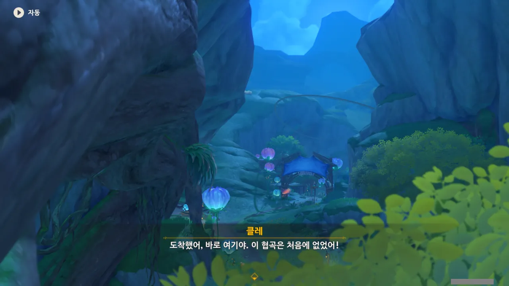
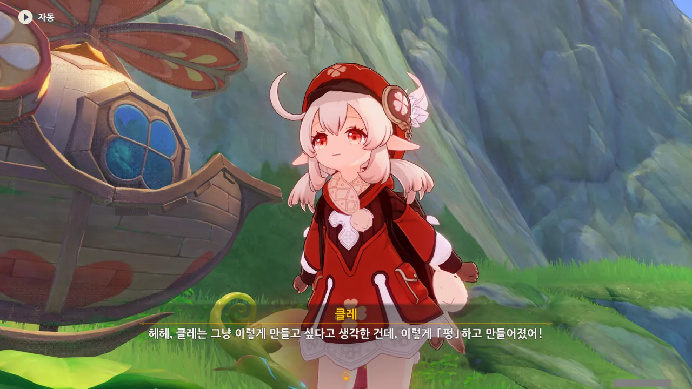
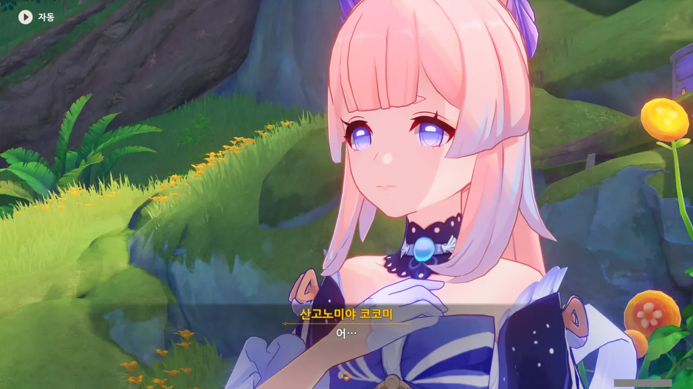
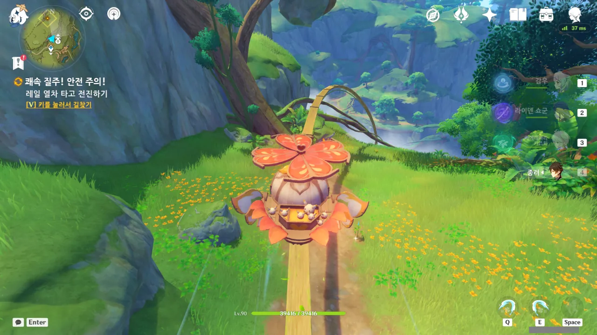
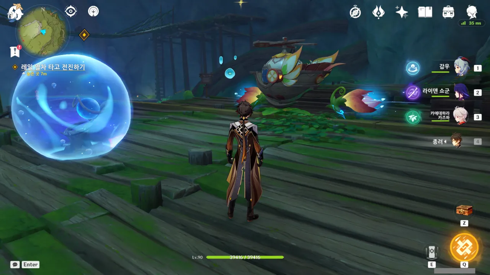
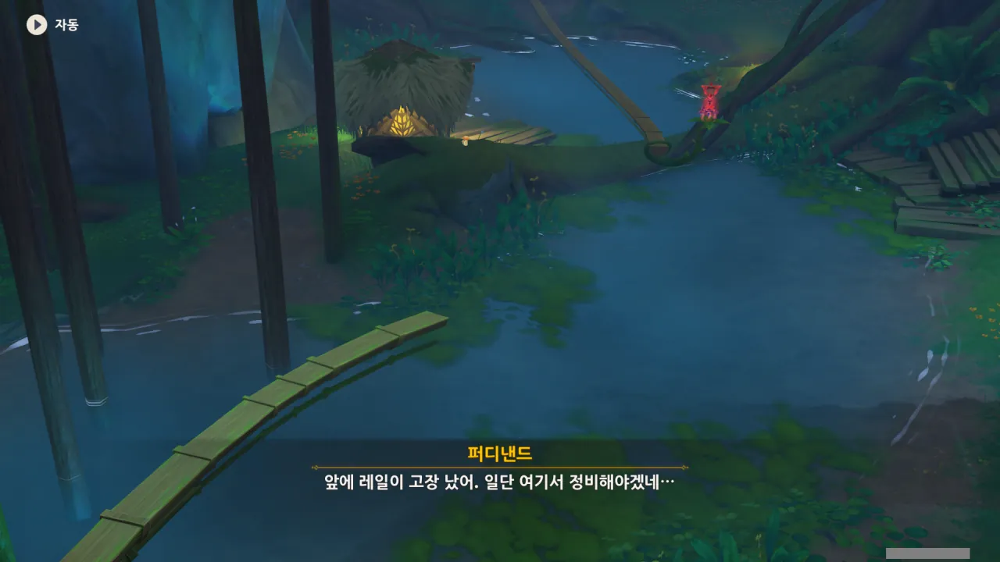
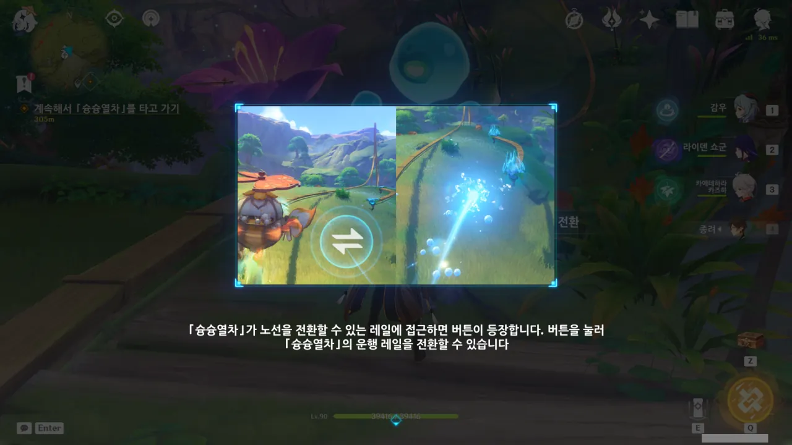
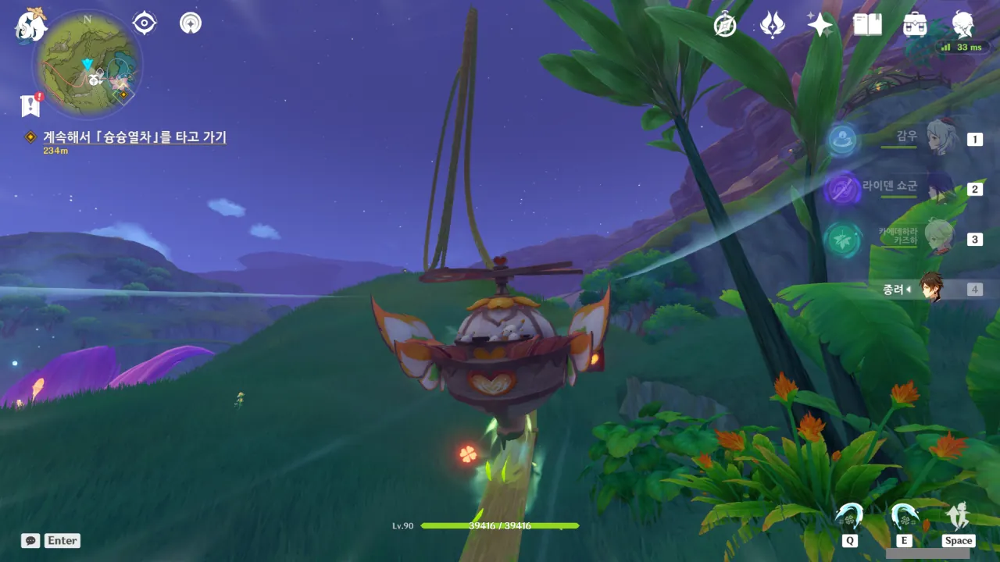
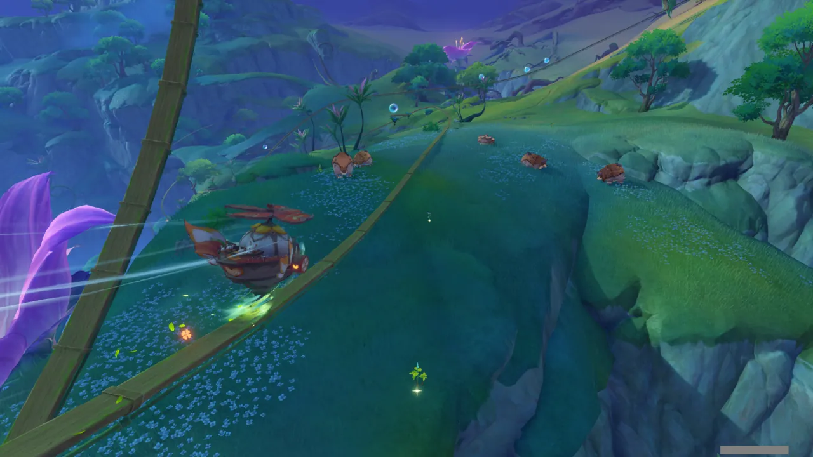

뭔가 현수막 같은 것이 쳐져 있는 걸 보니, 아무래도 여기서 뭔가 새로운 기믹을 발견할 것만 같은 기분이 든다.



정황상 아까 코어 휠이 잠깐 돌아간 덕분에 협곡이 드러난 것으로 보인다.

신기하네... 대체 무슨 원리인 걸까?



어라? 저 옷, 모험가 길드의 제복 아냐? 설마 여기까지 모험가 길드의 손길이 뻗친 건가?

심지어 저 사람은 이디이아와 이미 구면인 것으로 보인다.



이 사람의 이름은 '퍼디낸드'이며, 형제들과 함께 이 구역을 관리하고 있다고 한다.

열차에 레일이라... 이 드넓은 지역에 드디어 탈 것이 생기는 걸까?

물이 있는 곳에서만 쓸 수 있는 파도 배 워프 포인트도 오는 길에 발견했으니, 이번 이벤트에서는 열차와 파도 배를 탈 수 있을 것 같다.



정확히는 현실 도피를 하고 있었지... 그걸 코코미가 잘 어르고 달래서 일을 하게 만든 거고.



정류소?

열차는 원하는 곳을 아무렇게나 갈 수 있는 교통수단이 아니다. 레일이라는 정해진 길을 따라가야 하는 것이 열차. 그러니 정류장이 있는 것은 당연한 일이다.





클레가 앞뒤 상황 설명도 없이 대뜸 자신을 「마녀」라고 소개하자, 퍼디낸드는 '그게 무슨 소리냐?'라며 당황해하고, 그 옆에 있던 물의 환령 역시 머리 옆에 물음표를 띄운다. 물의 환령, 귀엽네...

그런데 사실 퍼디낸드의 말을 따지고 보면, 클레 일행은 *우연히* 이 신기루 비경에 온 게 아니지 않나? 엄연히 앨리스가 보낸 초대장으로 여기에 온 거잖아. 코코미는 잘 모르겠지만 말이다.





퍼디낸드가 상황을 설명하는 사이, 클레가 또 어디론가 먼저 가버린다. 아까 마을에서 협곡으로 출발할 때처럼 혼자 멀찍이 뛰쳐나간 줄 알았는데, 바로 옆에 있는 이 나무 레일을 구경하러 간 것이었다.

그나저나 이 나무 레일... 생긴 걸 보니 평범한 레일이 아닌 것 같다. 마치 롤러코스터 같이 생겼는데.



영사기는 단순히 2D 플랫포머 영상을 출력하기 위한 게 아니었나 보네.

저번에 '흐름 영사기'에 대한 설명을 들었을 때에는 그저 막연한 이야기로 들렸는데, 이렇게 '흐름 영사기 안에 열차로 만들 만한 물건을 넣어야 한다'라고 말하니 무언가 이해가 될 것 같기도 하다.



열차로 쓸만한 것에 대해 다들 고민하는 사이, 클레가 영사기를 이리저리 살펴본다.



일단 가장 먼저 생각할 수 있는 건 나무로 된 광차가 있다. 광차라면 튼튼한 금속을 쓰는 게 제일 좋겠지만, 이 근처에는 금속은커녕 캘 수 있는 돌조차 보이지 않으니, 나무를 써야지.

하지만 나무로 만들어진 광차를 열차로 쓰면 저 롤러코스터 레일 위를 달리다가 산산이 분해될 것만 같다.



뭔가를 뚝딱뚝딱 거리는 기미조차 전혀 보이지 않았는데, 클레가 어느새 그럴듯한 탈것을 하나 만들어냈다.

대체 어떻게 한 거지? 심지어 생긴 걸 보니 나무로 만든 게 확실해 보이는데...



클레의 '열차'가 필요한 조건을 모두 갖췄으며, 심지어 이디이아가 만든 '열차'보다 훨씬 더 귀엽다고 말하는 퍼디낸드.

클레가 만든 열차가 귀여운 건 맞으니 그렇다 쳐도, 이디이아가 만든 열차가 대체 어떻게 생겼길래?

응? 만들고 싶다고 생각하니까 펑하고 만들어졌다고? 여긴 상상만 하면 뭐든지 만들어지는 그런 비경이었던 거야? 클레의 상상은 현실이 된다, 뭐 그런 거야?



통통 폭탄을 재료로 열차를 만들었다는 클레.

폭탄으로 열차를 만들었다는 것도 놀랍지만, 난 폭약과 천을 주재료로 쓴 것이 분명해 보이는 통통 폭탄으로 어떻게 저런 나무로 된 열차를 만들 수 있는지가 더 신기하다.



맞아, 맞아. 폭약으로 된 열차는 진짜 위험할 거 같은데. 가다가 실수로 불꽃이라도 튀기는 날에는 그대로 공중폭발사산이 되는 거잖아.





열차에서 중요한 건 형체와 소재뿐이라고 말하는 퍼디낸드. 형체는 합격이라 쳐도, 통통 폭탄으로 만든 열차이니 소재는 여전히 폭약과 천이잖아. 여전히 위험한 거 아냐?

이론을 제멋대로 스킵해 버린 페이몬 때문에 자세한 설명은 듣지 못하게 되었다.

&nbsp;

그런데 "이러다가 별이 떨어지는 호수의 농어랑 만나게 될까 봐..."라는 페이몬의 말이 도통 이해가 가지 않는다.

별이 떨어지는 호수는 여행자가 몬드에 온 후, 제일 처음 만난 신상이 있는 곳이다. 혹시 페이몬을 처음 낚은 곳이 바로 거기였나 싶어 찾아봤지만, 페이몬을 낚은 곳은 그저 '몬드의 어느 강'이라고만 되어 있다.

그럼 대체 왜 저 말이 나온 거야?

그리고 하나 더. 대체 왜 코코미는 여기서 "어..."라고 말한 걸까? 뭔가 걸리는 게 있기라도 한 건가?

그러고 보면, 마을에서도 뭔가 걸리는 게 있었던 것 같은데, 그게 뭐였는지는 결국 못 들었다.





물의 환령이 클레의 열차 앞에서 터지더니, 열차 창문에 푸른빛이 들어온다.

설마 열차 안에 들어간 건가?



대충 열차 이용법에 대한 안내가 나온다.

이 열차는 중간에 있는 정류장에 임의로 정차하지 못하는 것 같다. 그러니까 무조건 종점에서 종점까지 쉬지 않고 달린다는 이야기다.

음, 그러면 돌아다니기 불편할 거 같은데...

오... 열차가 달리는 모습이 꽤 괜찮다. 진짜 롤러코스터를 타는 기분인걸.



그리하여 이 열차의 이름은 「슝슝열차」가 되었다.

진짜 롤러코스터처럼 빠르진 않지만, 속도감이 아예 없는 건 아니다. 무조건 일정한 속도로 움직이는 게 아니라, 레일의 경사에 따라 약간의 가속과 감속이 있는 것처럼 보인다.

정류장에서 멈춘 열차.

일단 정류장에 도착하면 자동으로 열차에서 강제 사출된다. 뭐, 이미 멈춘 열차 안에서 할 수 있는 게 없으니, 강제로 사출 되는 것이 오히려 좋지만.

열차가 멈춘 이유는 앞의 레일이 끊겨있기 때문이다.





어... 그러니까 신기루 비경 속의 모든 사물은 구상도의 형태로 존재하고, 그걸 흐름 영사기로 비추어야 실제 모습으로 변한다고 한다.

난 여태껏 구상도가 현실을 투영한 건 줄 알았는데, 사실 현실이 구상도를 투영한 결과였던 셈이다.

그러면 이 신기루 비경도 원래는 하나의 커다란 구상도였던 걸까? 물의 환령 역시 구상도 위의 그림이고?



영사기가 왜 물방울에 갇혀있나 궁금해했었는데, 영사기까지 구상도로 되돌아가버리면 나중에 시설을 복구할 때 복구하기 복잡해지기 때문에, 물의 환령이 일부러 물방울 속에 가둬 구상도로 되돌아가지 못하게 보호한 것이라고 한다.





우리가 지금까지 만났던 물의 환령은 전부 다 다른 개체 아니었어? 그런데 왜 다들 저 「방울이」라는 호칭을 하나같이 좋아하는 거 같지?



이제 이런 퍼즐은 눈감고도 풀 수 있지...



구상도 안에 갇혀있던 물의 환령이 레일로 변한다.

어... 그러면 아까 퍼디낸드가 했던 말과 같이 생각하면... 여기 있는 모든 것이 전부 다 물의 환령이 변해서 만들어진 건가?

뭔가 섬찟한데.





요약하면, 물의 환령이 이렇게 열차 안에 들어간 상태에서만 열차를 탈 수 있다고 한다. 정류장에서 열차의 방향을 바꿀 수는 있지만, 열차에서 내려야만 가능하고.

열차에 탄 채로 열차의 방향을 바꿀 수 있었으면 참 좋았을 텐데...

&nbsp;

이런 안내가 나왔다는 건, 분명 나중에 열차와 퍼즐 요소 중 하나를 선택적으로 활성화해야 하는 퍼즐이 나올 거라는 이야기겠지?



열차가 지나갈 선로 바로 옆에 타임어택 도전이 붙어있길래, '아, 저건 나중에 해야지'라고 생각하며 지나가려 했다. 하지만 열차가 그 도전 옆을 지나가며 도전을 자동으로 활성화한 탓에, 갑자기 시작된 도전을 다급히 완료해야 했다.

제발, 이런 건 강제로 시키지 말아 줘!



으아악! 도전하는데 말하지 마! 도전하랴 사진 찍으랴 아주 정신이 없다고!

다음 정류장에 도착하니, 이런 안내가 나타난다.

그러니까 나중엔 풍선 터트리랴, 선로 옮기랴 정신없는 도전을 넣겠다는 거지? 게다가 도전 중 방금 전처럼 대사도 넣을 거고. 맞지?

어우, 왜 이게 리듬 게임처럼 보이는 거지.

전환 버튼이 어디에 어떻게 나타날지 궁금해했는데, 열차 옆에 마우스 클릭 버튼으로 나타났다.

그런데 선로가 끊겨있는데 어떻게 저 선로로 갈아타는 거지?

선로를 갈아탈 때에는 그냥 물방울이 되어 다른 선로로 포로롱 날아간 후, 다시 열차가 되어 선로 위를 달린다.

이럴 거면 그냥 처음부터 끝까지 물방울 형태로 날아다녀도 되는 거 아냐?

와, 설마 저 앞에 저거, 롤러코스터처럼 360도 회전하는 그런 건 아니지?



진짜였네. 심지어 이쁜 장면을 더 잘 보라고 카메라까지 부드럽게 옆으로 옮겨준다.

사실 난 카메라가 열차 뒤에 우직하게 붙어서, 말 그대로 '하늘과 땅이 뒤집어지는' 경험을 보여줄 것으로 기대했었다.

처음에 이걸 봤을 때, '이야, 이걸 컷신 없이 자연스럽게 보여준다고?'라고 생각했다.

그런데 글을 쓰며 다시 보니, 이 부분은 컷신이 맞았다. 오른쪽 밑에 조작 버튼이 하나도 안 보이잖아.



어딘가의 막다른 정류장에 도착했다.

레일의 중심으로 가자는 말이 뭔지 전혀 이해하지 못했는데, 저 밑에 뭔가 중앙 허브처럼 생긴 것이 있었다.

거기까지 열차를 타고 갈 수 있었으면 참 좋겠지만, 그냥 걸어가야 했다.



여기도 코어 휠처럼 생긴 뭔가가 있다. 그 크기는 훨씬 작지만...



음, 이건 수메르에서 종종 보던 장치인데... 이게 아마 스위치였던가?



코코미와 퍼디낸드의 말에 따르면, 저 작은 코어 휠이 돌아가며 선로를 바꾼다고 한다. 그러니까 분기기라는 말이네.

'제로니'는 퍼디낸드의 형제 중 하나겠지, 아마.





정답이었다.

퍼디낸드와 제로니는 의견 차이 때문에 서로 갈라선 모양이다. 퍼디낸드는 정류소를 먼저 수리해야 한다고 주장했고, 제로니는 중추부터 수리해야 한다고 주장했다. 그렇게 서로 다투다, 결국 서로 갈 길을 간 것이다.

하지만 결과적으로 둘 다 아무것도 못했쥬? 둘 다 큰소리만 떵떵 친 꼴이 되어버렸쥬?



케이아가 조금 치켜세워줬다고 금세 기고만장해져서 제로니를 놀릴 생각으로 가득해지는 퍼디낸드. 흠...





제로니를 보러 가는 길 내내 제로니에 대한 불평을 늘어놓는 퍼디낸드.

퍼디낸드와 제로니 역시 클레 일행과 코코미처럼 외부에서 온 인물로 보인다. 사막에서 모래폭풍에 휘말려 길을 잃었는데, 거기서도 동쪽으로 가냐 서쪽으로 가냐로 다투다 갈라져 서로 갈 길을 가다, 운 좋게도 모두 신기루 비경 속으로 들어와 목숨을 부지할 수 있었다고 한다.

&nbsp;

그런데 퍼디낸드의 머리카락과 눈 색깔이 파란색인 걸 보면, 퍼디낸드와 그 형제들도 물의 환령과 뭔가 관계가 있는 게 아닐까?

그냥 우연이라고 치기에는 너무 공교롭거든.
