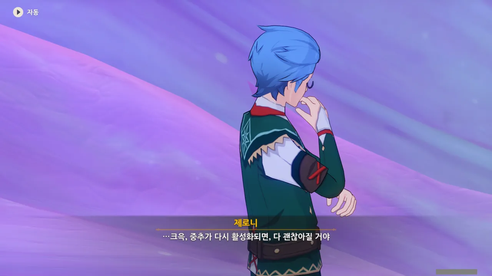

저게 제로니가 맞겠지? 제로니가 꽃잎 위에 서서 뭔가를 중얼거리고 있다.





그리고 제로니를 만나자마자 퍼디낸드가 비아냥대듯이 제로니를 놀려댄다.

작은 녀석들이란 건 물의 환령을 말하는 건가?



의기양양해하는 퍼디낸드에게 '매번 다른 사람에게 기대고, 공은 혼자 다 가로챈다'라며 비꼬는 제로니.

둘의 사이가 정말 좋아 보인다.

&nbsp;

퍼디낸드에 이어 제로니까지 푸른 머리카락에 푸른 눈을 가진 걸 보면, 이들 형제 모두가 물의 환령과 뭔가 연관이 있는 게 틀림없다.

마침 다음 신규 지역이 물의 신이 다스리는 폰타인이니, 마침 딱 적절하게 들어맞네.





> 이 둘은 왜 만나자마자 싸우지? 형제 아니었어?

형제니까 저렇게 싸우는 거다. 내 장담컨대, 저 둘은 나이가 그리 많이 차이 나지 않을걸?

나이 차이가 얼마 나지 않는 형제가 서로 으르렁대는 건 만고불변의 진리이거든.



아무튼, 계속 이렇게 싸워대다간 끝이 나지 않을 것 같으니, 코코미가 둘의 싸움을 말린다. 그러자 퍼디낸드 녀석은 "알겠어"라고 말하더니, 혼자 어디론가 가버렸다.

왜 그러는지 이해가 아예 되지 않는 건 아니지만, 예의가 없네.





퍼디낸드가 사라진 후, 제로니에게 여태까지 있었던 일을 말해준다.



이번에도 물의 환령의 힘을 빌리는 제로니.

형제 모두가 이곳의 '유지 보수 담당자'라고 하는데, 정작 일은 물의 환령이 다 하는 것 같다.





물의 환령이 꽃의 꽃술 부분을 빛내자, 꽃에 물이 고이더니 흘러넘쳐 밑에 있던 '미니 코어 휠'을 흠뻑 적신다.

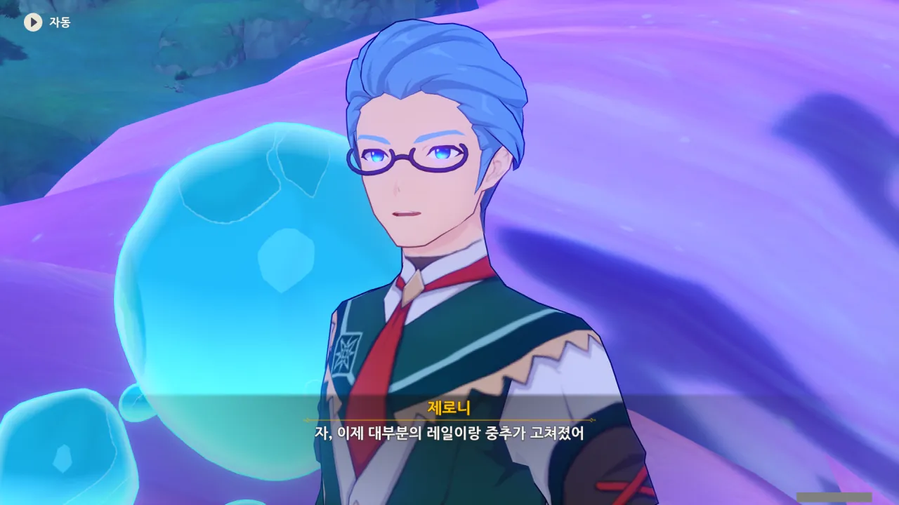

... 그런데 고작 이거로 레일과 중추가 고쳐진다고?

이렇게 간단한 일을 갖고 여태껏 끙끙댔다는 게 도저히 믿기지 않는다.





퍼디낸드와 제로니가 또 싸우기 시작한다. 이번에도 역시 퍼디낸드가 먼저 시비를 걸었다.

이 둘 말고도 '하도'라는 이름의 형제가 또 있는 것 같은데, 하도는 어디에 있는 거지?

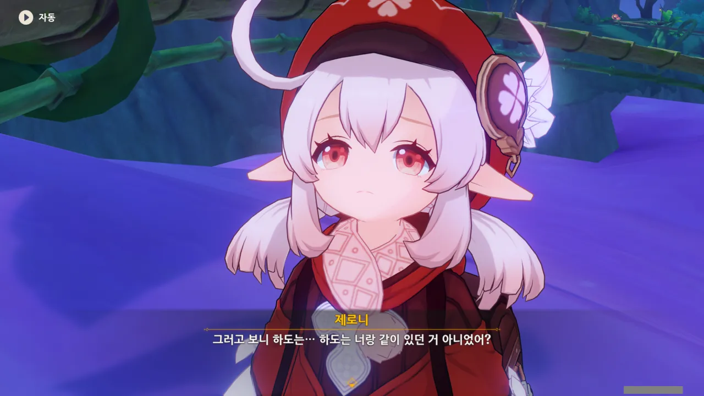

그나저나 애 보는 앞에서 참 잘하는 짓거리다. 클레 입가가 축 쳐진 거 봐라.



둘이 싸우는 내용을 들어보니, 하도 역시 이 둘과 갈라져 어디론가 간 모양이다.

음... 분명 다른 코어 휠 부품을 찾으러 갈 때 즈음, 새로운 기믹을 소개하기 위해 나타나지 않을까?





> 나쁜 짓 한 사람은 아무도 없는데, 왜 싸우는 거야?

그러게 말이다.





도저히 싸움이 끝날 것 같지 않아 보이자, 보다 못한 케이아가 개입해 강제로 둘의 싸움을 멈춘다.

> 입이 자제가 안되면, 다른 곳에서 싸우시든가... 아니면 내가 진정시켜 드릴까?

오오, 케이아...



할 말을 잃은 둘을 케이아가 어디론가 데려간다.

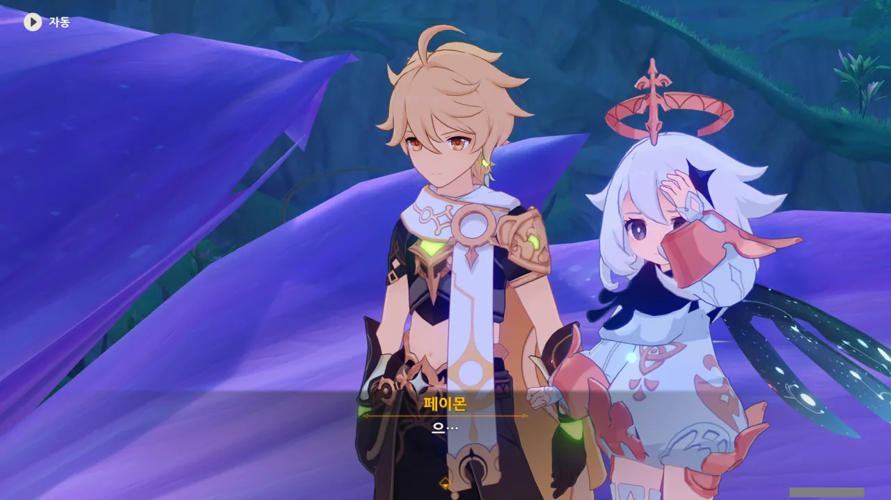

저 둘 때문에 순식간에 분위기가 개판이 되어버렸다.





'세상에는 가족 사이의 일처럼 다루기 어렵고 논리로 설명할 수 없는 복잡한 상황이 많다'라며 클레에게 애써 이 상황을 이해시켜주려 하는 코코미.

틀린 말은 아니다. 형제자매 사이의 싸움은 작은 일이 하나하나 쌓이다가 툭하고 터져 일어나는 일이 많고, 한번 다툰 후에는 감정선의 역치가 낮아져 예전보다 훨씬 더 싸우기 쉽게 된다. 그렇게 싸우고 싸우다 누군가가 선을 넘게 되면, 그때부터 둘 사이의 관계는 '원수보다 못한 사이'가 되어버리는 거고...



몬드 사람 모두에게 사랑받는 외동딸, 클레에게 이런 일은 이해하기 어려울지도 모르겠다.

물론, 클레에게 오빠인 알베도가 있긴 하다. 하지만 알베도는 클레의 친오빠가 아닌 데다, 아직 둘의 사이는 가깝지 않은가. 이 경우에 적용하긴 힘들지.



케이아에게 한 소리를 듣고 난 후, 퍼디낸드와 제로니가 클레에게 사과한다.





하도는 중추에서 열차를 타야 도달할 수 있는 「격류 레일」 근처에 있을 것이라고 한다.

여행자가 자신들을 한번 더 도와달라는 퍼디낸드의 말에 "싸우지 않겠다고 약속하면요"라고 말하는 걸 보고 피식 웃음이 났다.

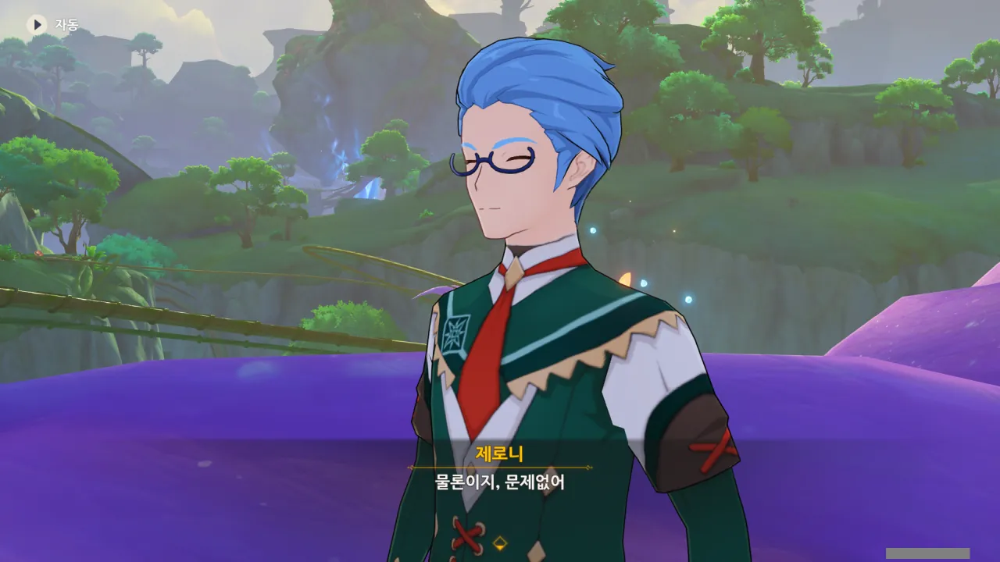

저렇게 즉시 "물론이지, 문제없어"라고 말이 나올 정도면, 둘 사이의 감정의 골은 그리 깊지 않았던 모양이다.

그럼 여태껏 사소한 일만 가지고 그렇게 싸워댔다는 거야? 어휴, 이건 뭐 애도 아니고...

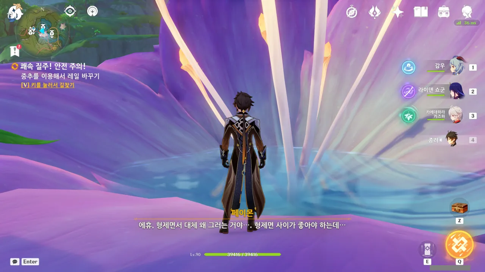

'사이좋은 형제'를 보기란 하늘에 별따기지...



'미니 코어 휠'의 스위치를 조작하면 열차의 선로를 바꿀 수 있다.

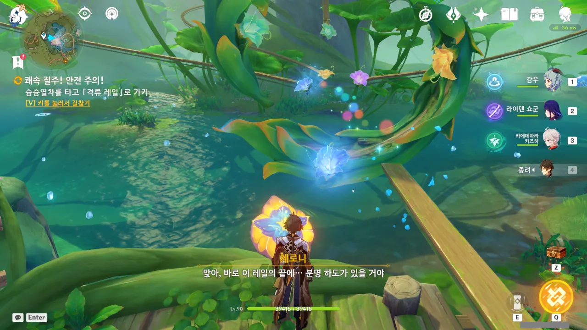

스위치를 조작해 선로를 바꿨다. 이제 이 선로를 타고 이동하면 된다.

선로가 바뀔 때 나무 선로가 구부러져 새로운 경로로 이어질 줄 알았는데, 그냥 이전 선로가 없어지고 새 선로가 생기는 식이었다.

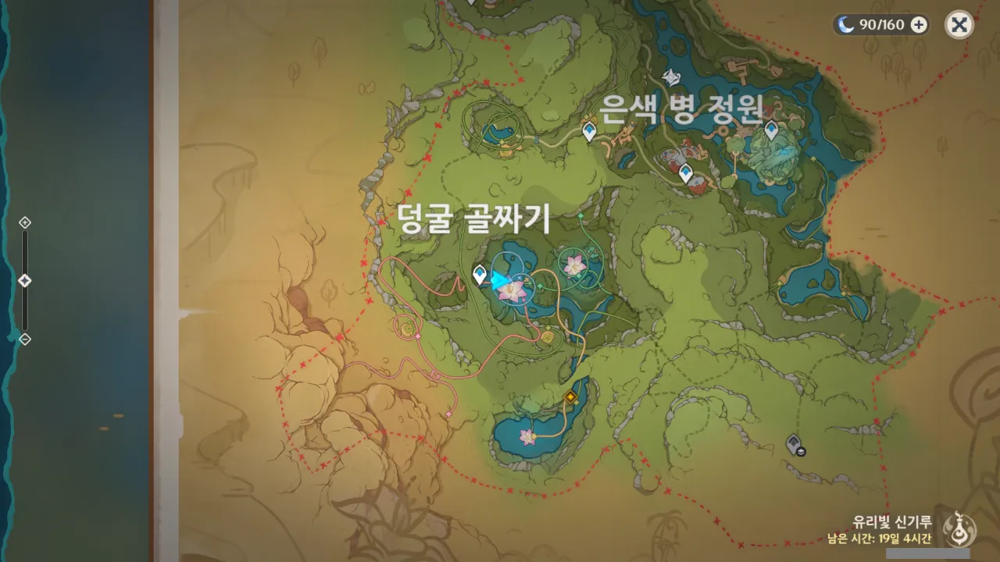

지도를 열어보니, 지도 곳곳에 선로가 굉장히 복잡하게 얽혀있다.

이거, 선로 부분만 따로 떼서 유람열차처럼 해놔도 좋지 않을까? 길이도 꽤 길어 보이는데 말이다.

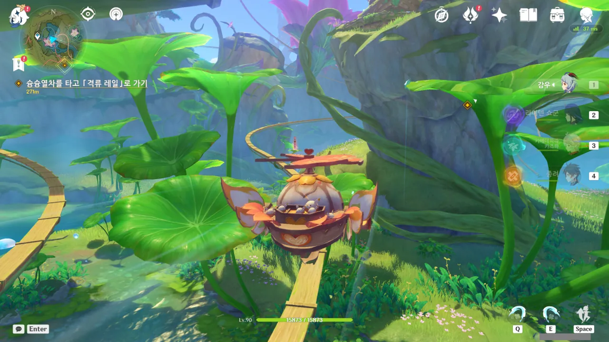

저 앞에 있는 모래시계가 보이는가? 그렇다. 또 유사 리듬 게임이 날 기다리고 있다.

그래도 다행스럽게, 이번엔 중간에 대사가 나오지 않았다.



계속 기침을 하는 데다, 안색도 별로 좋아 보이지 않는 하도.

그런데 하도가 설계한 「격류 레일」이란 건 대체 뭘까?





퍼디낸드와 제로니는 그렇지 않아도 몸이 안 좋은데 자꾸만 돌아다니는 하도에게 잔소리를 쏟아낸다.

> 무슨 문제가 생기면 나랑 퍼디낸드가 해결할 수 있어.

저기... 조금 전만 해도 둘이 엄청 싸워댔거든? 퍽이나 잘도 해결하겠다.



"두 사람이 싸우지만 않으면 다행이지"라고 말하는 하도에게 "우리 둘이 싸우는 건 우리 둘의 일이다"라고 말하는 퍼디낸드.

뭐지? '그건 그거고 이건 이거다', '내가 하면 로맨스, 네가 하면 불륜', 뭐 그런 건가?



클레가 퍼디낸드를 부르자, 퍼디낸드가 화들짝 놀라며 '우리 싸우는 거 아니다'라고 변명한다.

하지만 누가 봐도 이건 싸우는 거로 보이지 않을까? 뭐, 퍼디낸드와 제로니가 일방적으로 하도를 두들겨 패는 모양새이다만...





> 왜 좋게 얘기할 수 없는 거야?

이거, 정말 핵심을 찌르는 말인걸.

분명 그 깊숙한 곳에는 서로를 걱정하는 마음이 담겨 있겠지만, 아무리 봐도 저건 싸우는 모양새이지 않은가. 좋은 말로 해도 될 걸 말이다.



> 상황이 조금 달라.

과연 그럴까? 흠...





> 하지만 오빠들은 도와주고 있지 않잖아?

이거, 보면 볼수록 아주 재미있다. 다 큰 어른들이 어린아이인 클레에게 정곡을 거듭 찔려 아무 말도 하지 못하고 있지 않은가.





> 엄마가 도움은 돕는 사람이 기쁜 게 아니라 도움받은 사람이 기뻐야 한다고 했어.
> 원하는 게 뭔지 왜 안 물어보는 거야?

우리 클레, 말 잘한다!



코코미의 말에 드디어 진심을 털어놓기 시작하는 퍼디낸드와 제로니.



저 둘이 하도에게 잔소리를 한 이유는 이렇다.

형제가 이 신기루에 처음 온 날처럼, 몸이 허약한 하도가 갑자기 기절한 상태에서 퍼디낸드와 제로니가 서로 싸워 갈라진 끝에, 하도 옆에 아무도 남지 않게 되는 상황을 걱정한 것이다.

그런데 그러면 처음부터 싸우지 않았으면 되는 거잖아. 물론, 저들에겐 쉽지 않겠지만.





하도 역시, 마주한 문제를 자신이 먼저 처리하면 두 형이 더 이상 싸우지 않을 거라 생각해, 무리해서라도 문제를 해결하려 한 것이었다.

거기에다, 자신의 몸 상태 때문에 이동 중에도 거듭 쉬어야 하는 상황을 마주하며 자신이 형들의 발목을 잡고 있다고 생각한 것도 있었다.

&nbsp;

이렇게 간단한 걸, 서로 속마음을 털어놓지 않아 싸우고 갈라진 것이었다.



그래도 셋이 합심한 건 있었다.

제로니가 머리를 쓰고, 퍼디낸드가 힘을 쓰며, 하도는 레일을 설계하는 것 말이다.



어이구, 다 큰 어른이 칭찬받으려니까 쑥스러워서 아주 몸 둘 바를 모르네, 그냥.





클레가 퍼디낸드와 제로니를 각각 칭찬한다. 둘 다 칭찬을 받으니 아주 좋아라 한다.

클레, 아주 의젓해!



더 재미있는 열차? 설마 「격류 레일」을 말하는 거야?



음... 그게 그렇게 보이나? 그런 생각은 여태 단 한 번도 해본 적이 없다.

그냥 클레를 보고 있으면 입꼬리가 절로 올라가는걸.





중앙 허브에서 그랬던 것처럼, 꽃에 물이 차오르고 흘러내려 폭포가 된다.

다시 아까 전의 정류소로 이동한다.

다만 이번에는 정류소에 정차하지 않기 때문에, 중간에 스페이스 바를 길게 눌러 강제로 하차해야 했다.

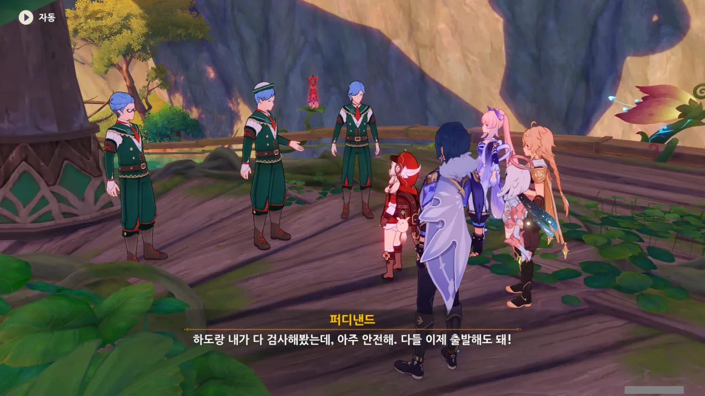

오오, 드디어 그 격류 레일이란 걸 타볼 수 있는 거야?



형제가 선물이라며 등산 밧줄을 준다.

혹시 이걸 쓰면 높은 곳을 단숨에 올라갈 수 있는 걸까? 그러기에는 이미 클로버 인장이 있는데...



세 형제 모두가 이번 일에서 뭔가 큰 깨달음을 얻은 것 같다.

'밧줄보다 중요한 무언가'라면... 형제간의 우애, 뭐 그런 거려나?





자신이 도움이 되었다는 것에 순수하게 기뻐하는 클레.

아아, 너무 귀엽다니까. 입가에 웃음이 떠나질 않아.





하도는 왜 클레에게 바깥에서 슝슝열차같은 걸 본 적이 있는지 물어본 걸까?

설마 숨은 의도가 있는 건 아니겠지?





아무튼, 세 형제의 사이가 이전보다 훨씬 좋아진 걸 보니, 나도 기분이 덩달아 같이 좋아졌다.

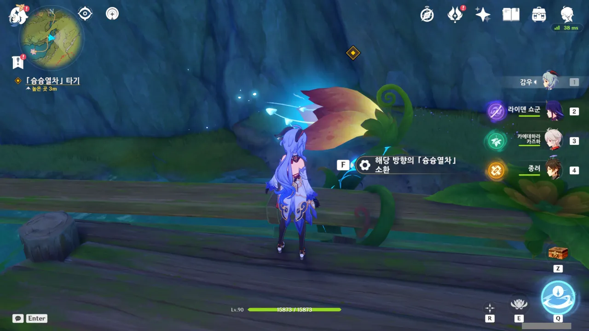

아, 이렇게 정류장에서 열차를 소환할 수 있구나.

열차가 종점에서 종점까지만 움직이다 보니, 중간에 하차하면 종점까지 걸어가야만 하는 줄 알았는데, 이렇게 정류장에서 열차를 소환할 수 있다니.

이러면 다시 돌아갈 때도 열차를 타고 돌아갈 수 있겠다.

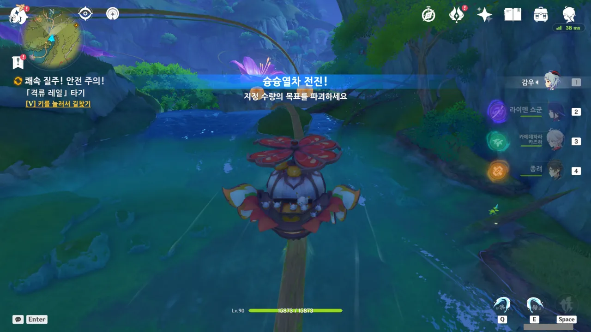

그리고 아니나 다를까, 이번에도 또 모래시계가 내 앞에 나타났다.

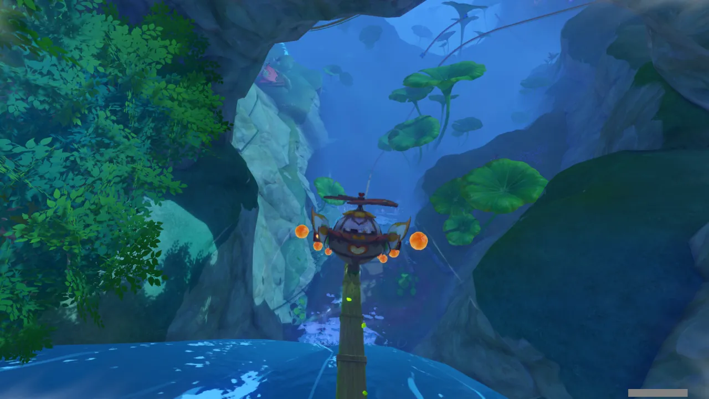

이야, 우리 지금 폭포를 따라 수직으로 내리꽂는 거야? 신난다!



코코미... 설마 이런 거에 약한 거야? 이건 또 의외네...



도전 중 나타난 물방울들을 모두 터트리면 이렇게 새로운 레일이 나타나 흙풍선을 피할 수 있게 된다.



잘 가다가 중간에 멈춘 열차. 왜 그런가 했는데, 물의 환령이 차례로 레일을 가로질러가고 있다.

애니멀 크로싱...?

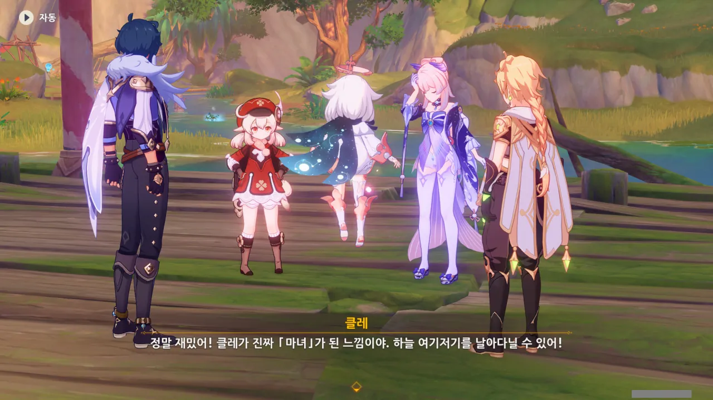

진짜 「마녀」가 된 느낌이라는 게 무슨 말인가 했는데, 마녀는 빗자루를 타고 날아다닌다고 하지 않은가? 아까 탄 격류 레일을 탈 때, 하늘을 나는 듯한 느낌이었다고 말하는 것 같다.

아까 폭포에서 수직으로 내리꽂을 때, 나도 신나긴 했었어...





페이몬이 '날 수 있어서 「마녀」라면, 케이아는 뭐가 되는 거야?'라고 묻자, 클레는 아무 망설임 없이 '케이아는 「대도」잖아'라고 답한다.

클레가 페이몬의 말을 오해한 것 같다. 페이몬은 '날 수 있어서 「마녀」가 되는 거라면, 같이 열차를 타고 날았던 「대도」 케이아는 대체 뭐가 되는 거야?'라고 물었고, 클레는 이걸 오해해서 '케이아는 대체 뭐가 되는 거야?'로 이해한 것 같다.



아, 맞아. 원래 이번 목표는 코어 휠의 부품을 찾는 거였지, 참.



클레는 귀여우니까 두 번 찍었다.

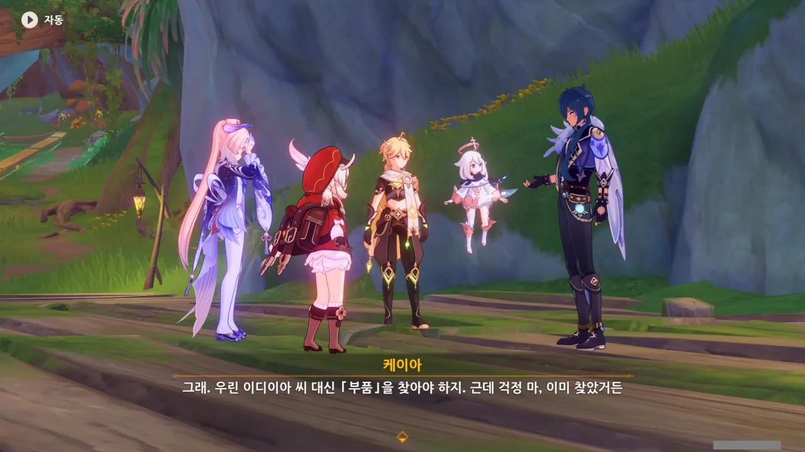

응? 벌써 코어 휠의 부품을 찾았다고?



대체 왜 퍼디낸드 형제가 준 등산 로프가 코어 휠의 부품이 되는 거지? 제로니가 '이 등산 로프로 밖에서 산에 오르곤 했다'라고 했으니, 그 등산 로프는 코어 휠의 부품이 아니라 바깥에서 온 물건일 텐데?

그리고 왜 등산 로프가 코어 휠의 부품이 되는 건지도 잘 모르겠다. 로프를 도르래에 맬 벨트 대신 쓰려는 건가?



더 놀고 싶지만, 이디이아를 생각해 참는 클레. 대견해!

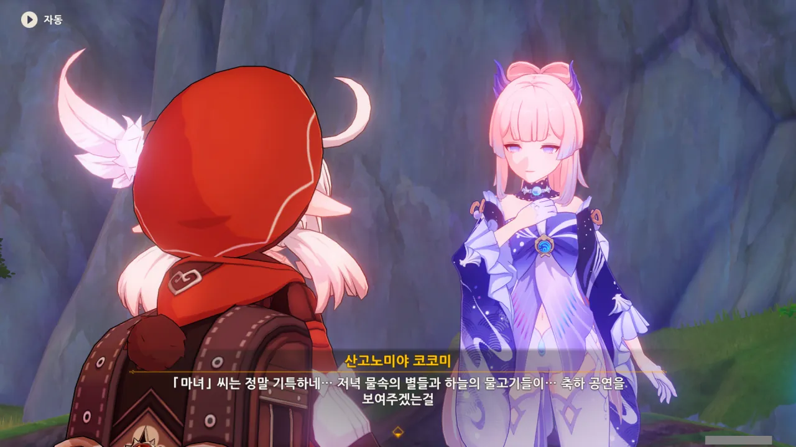

> 저녁 물속의 별들과 하늘의 물고기들이 축하 공연을 보여주겠는걸.

뭔가 굉장히 시적인 말을 하는 코코미.

그런데 아까 전부터 머리를 자꾸 짚는 걸 보면, 어딘가 몸 상태가 안 좋은 것 같다. 지금도 눈이 반쯤 감겨 있고 말이다.



티 안 나게 잘 버티고 있었다고 생각한 코코미지만, 말하는 내내 눈이 반쯤 감겨있고 안색도 영 좋지 않아 보이니, 티가 나지 않을 수 없다.



아아, 클레는 정말 귀여워!

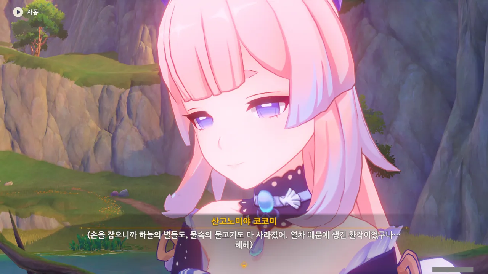

설마 클레의 손은 약손이었던 걸까?

난 아까 코코미가 말한 '저녁 물속의 별들과 하늘의 물고기'가 시적인 의미로 한 말인 줄 알았는데, 멀미 때문에 본 환각 속 내용이었다.

난 그것도 모르고 '와, 시적이다'라고 감탄했는데! 내 감동 돌려줘!



아무튼, 이디이아가 있는 곳으로 되돌아간다.

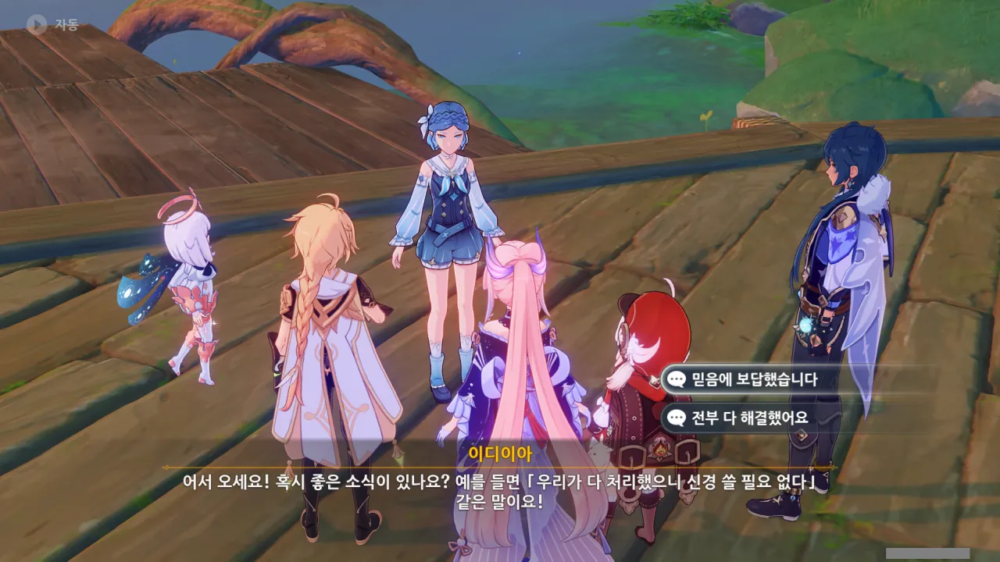

이디이아의 기대에 힘입어, 코어 휠의 또 다른 부품을 가져오는 데 성공했다.

아직도 난 저 등산 로프가 왜 코어 휠의 부품이 되는 건지 잘 모르겠어...





너무 신나게 놀아서 그런 걸까, 클레의 진이 다 빠져버렸다.

마침 시간도 늦었으니, 오늘은 여기까지 하고 일단 쉬는 것이 좋아 보인다. 코코미 때문에라도 말이다.

&nbsp;

코코미는 디자인 때문에, 눈을 똑바로 뜨고 있어도 어딘가 흐리멍덩해 보인다. 그래서 아픈 건지 아닌지를 잘 모르겠다.



클레가 재미있게 놀아서 정말 다행이라는 이디이아.

이디이아가 저런 말을 하니, 설마 앨리스가 클레와 놀아달라며 반강제로 클레를 떠넘긴 게 아닐까 하는 생각이 든다. 약간의 폭발과 약간의 협박... 그런 재료를 더해서 말이다.



그래. 왜 이 등산 로프가 코어 휠의 부품이 되는 건데?





이디이아에게서 왜 등산 로프가 코어 휠의 부품이 되는지에 대해선 듣지 못했지만, 퍼디낸드 형제가 처음 신기루 비경에 들어왔을 때의 상황을 들을 수는 있었다.

> 서로를 원망하다가 얼마 지나지 않아 서로 부둥켜안고 울면서 눈물 콧물 범벅이 되더니

ㅋㅋㅋㅋㅋㅋ



이디이아가 퍼디낸드 형제와 알고 지낸 지 오래되었다고? 그렇다면 이디이아와 퍼디낸드 형제가 서로 알게 된 지 시간이 꽤 흘렀다는 이야기가 되는데...

점점 뭐가 먼저인지 알기 어렵게 돼 가고 있다. 일단 내가 파악한 시간순으로 정리해 보자.

1. 퍼디낸드 형제가 신기루에 도착함
2. 퍼디낸드 형제가 서로 울고불고하다가 합심하여 신기루 곳곳에 레일 등을 설치함
3. 퍼디낸드 형제가 레일을 설치하는 과정에서 이디이아와 친분을 다짐
4. (한참 후)
5. 코코미가 신기루에 도착함
6. 코어 휠 고장
7. 클레 일행이 신기루에 도착함

이렇게 되는 건가?

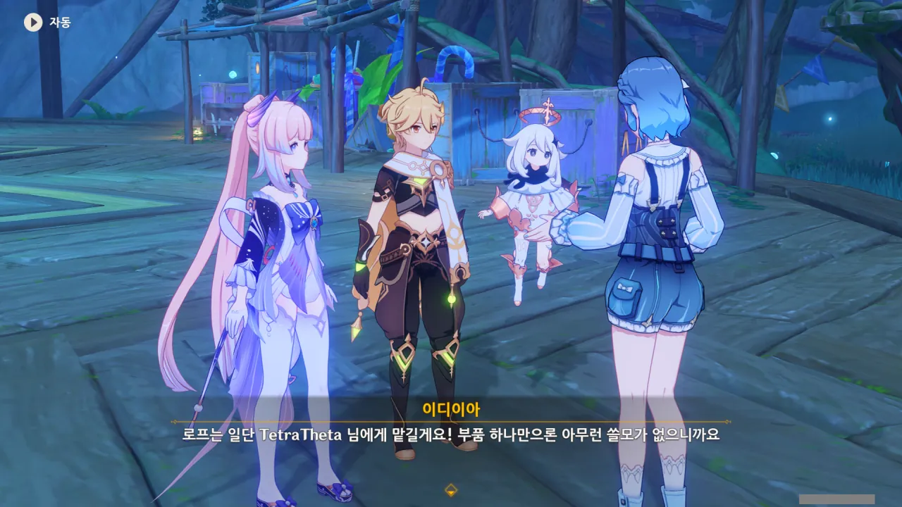

일단 이 등산 로프 하나만으로는 쓸모가 없기에 계속 갖고 있는 것으로 했다.

결국 로프가 왜 코어 휠의 부품이 되는지에 대해서는 듣지 못했다.



그러고 보니 유라와 콜레이를 까맣게 잊고 있었다. 분명 부품을 찾으러 가는 김에 유라의 친척도 찾으러 간다고 했었지, 아마.

그런데 거기서도 상황이 좋지 않았다고 한다. 일단 돌아온 유라와 콜레이는 클레 일행이 다 쉬고 나면 다 함께 북부 밀림으로 가겠다고 했다.

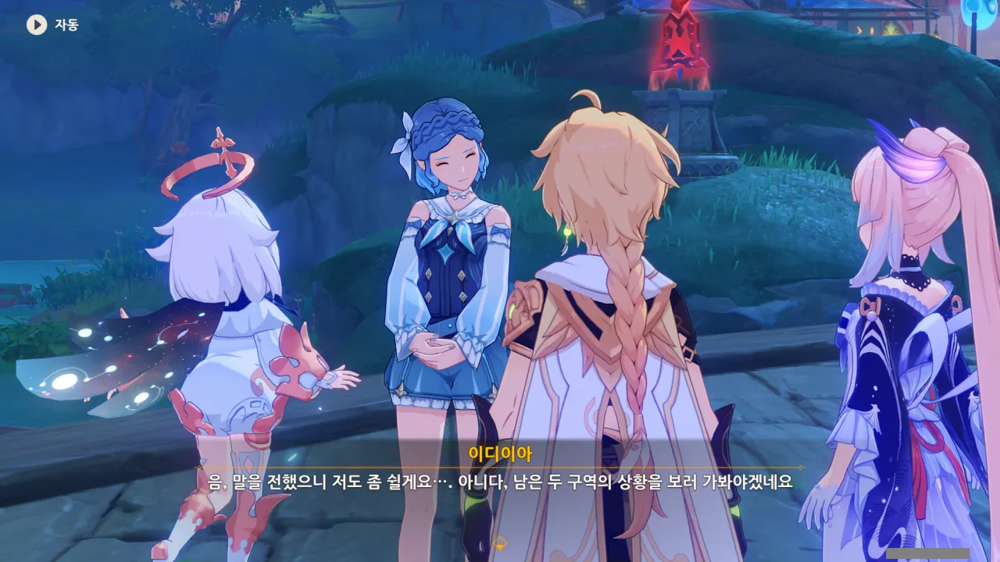

오오, 이디이아가 드디어 자발적으로 일을 한다! 땡땡이 칠 생각으로 가득했던 처음의 모습과는 완전 다른 모습이다.



이야, 드디어 이벤트 스토리의 1/3이 끝났다!

ㅋㅋㅋ 이제 ㅋㅋㅋ 1/3 ㅋㅋㅋ

&nbsp;

... 이거, 언제 다 찍지?



이디이아가 안절부절못했던 이유가 있었다. 앨리스에게 호언장담했는데 신기루 비경이 고장 나버렸으니, 졸지에 허풍선이, 거짓말쟁이가 될 처지였던 것.

앨리스가 윽박지른 것이 아니었구나... 다행인 걸까?
