이제야 이벤트 전체 스토리의 2/3을 향해 첫 발을 내딛는다.

어우, 이거, 스토리 언제 다 보지? 곳곳에 널린 퍼즐이나 상자 같은 것들도 전부 해결해야 하는데...



이번엔 유라, 콜레이와 함께 돌아다닐 예정이다.





그러고 보니, 여긴 사실 사막 한가운데에 있는 유리병 속이었지, 참. 사막이 진흙탕처럼 느껴진다는 이디이아의 말에 백번 공감할 수 있다.

콜레이는 우림 지역을 순찰하는 숲의 순찰자이니, 우림 지역과 매우 유사한 비경 안 환경이 매우 익숙할 것이다.



어라, 이 장면, 저번에도 본 것 같은데... 분명 케이아 역시 처음 여기 올 때, '어 딜도 망가'를 당했었지?

어딜 혼자 쓰윽 빠지시려고? ㅋㅋㅋㅋㅋㅋ 히히, 못 도망가 ㅋㅋㅋㅋㅋㅋ



「가든파티」 관리자가 이번 일은 이디이아만이 해결할 수 있다고 말했다고 하는 콜레이.

「가든파티」는 대체 뭐지?





「가든파티」 구역은 소론파 학자로 보이는 사람이 관리 중이라고 한다.

저번엔 모험가 길드의 사람이 구역 관리자였는데, 이번엔 아카데미아 학자라... 이 비경, 생각 외로 다양한 사람들을 볼 수 있네.

한 가지 마음에 걸리는 게 있다면, 여기서 만난 사람들이 전부 푸른색 눈에 푸른색 머리카락을 가졌다는 점이다. 설마 이 비경의 입장 제한 조건 중에 '푸른 눈에 푸른 머리만 입장 가능', 뭐 그런 게 있는 건 아니겠지?

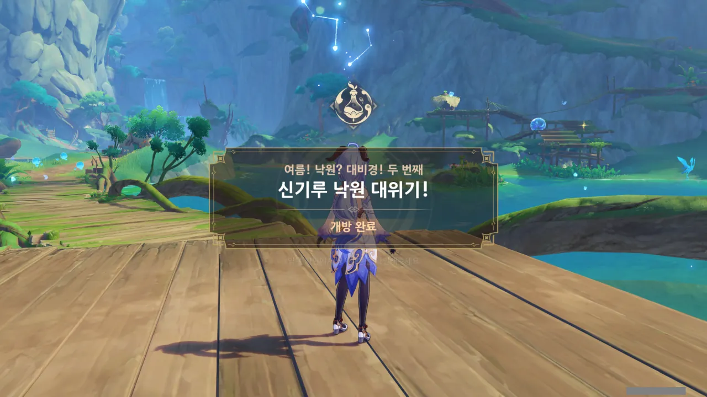

아무튼, 이벤트의 두 번째 스토리 임무, '신기루 낙원 대위기!' 임무가 시작되었다.

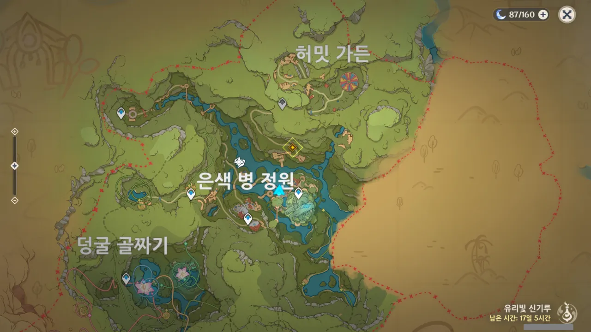

안타깝게도 새로 개방된 구역인 '허밋 가든'에는 레일이 없다. '덩굴 골짜기' 지역에 레일이 잔뜩 깔려 있길래 이 이벤트 지역 전체를 열차를 타고 돌아다닐 수 있을 줄 알았는데...

그래도 구역 크기가 그리 크지 않아 보이니, 많이 걸어 다닐 것 같지 않다는 게 그나마 위안인가...



가는 길에 「찬란한 램프」와 「찬란한 렌즈」의 사용법을 알려주는 간단한 퍼즐을 조금 풀었다.

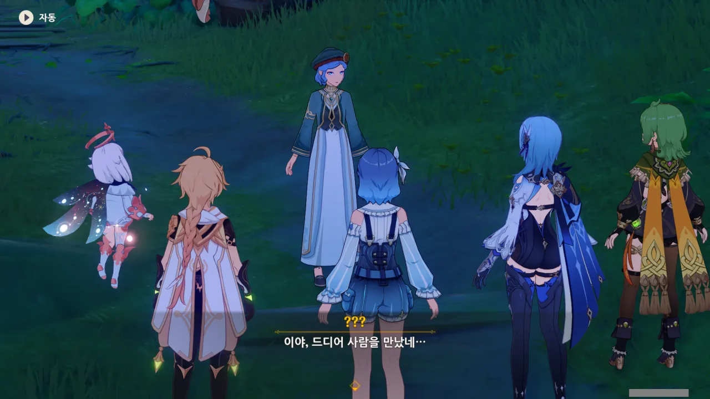

오, 정말 아카데미아 학자의 복장이네.

이번에 만난 사람 역시 푸른 눈과 푸른 머리카락을 갖고 있다.

퍼디낸드 형제까지는 그렇다고 쳐도, 이번에도 이런 건 단순한 우연이 아니다.



이 사람의 이름은 메이몬. 이디이아를 보자마자 이디이아를 "아무도 찾지 못할 곳에서 혼자 울고 있을 줄 알았어"라며 까댄다.

이상하다... 분명 이디이아는 이 비경 전체를 관리하는 관리자 아냐? 그런데 왜 만나는 사람마다 전부 이디이아를 까대기 바쁜 걸까?



내 장담컨대, 다음 임무에서 만나는 NPC 역시 이디이아를 보고 '어디서 울고 있을 줄 알았는데'라고 할 것이다. 내 직감이 그렇게 속삭이고 있다.



여기서 이디이아 성우의 연기에 조금 감탄했다. 금방이라도 울 것처럼 이디이아의 목소리에 물기가 가득하더라고.



그래도 악의로 한 말은 아니었는지, '그러면 안돼'라고 하자 곧장 '알았어, 내가 미안해'라고 사과한다.

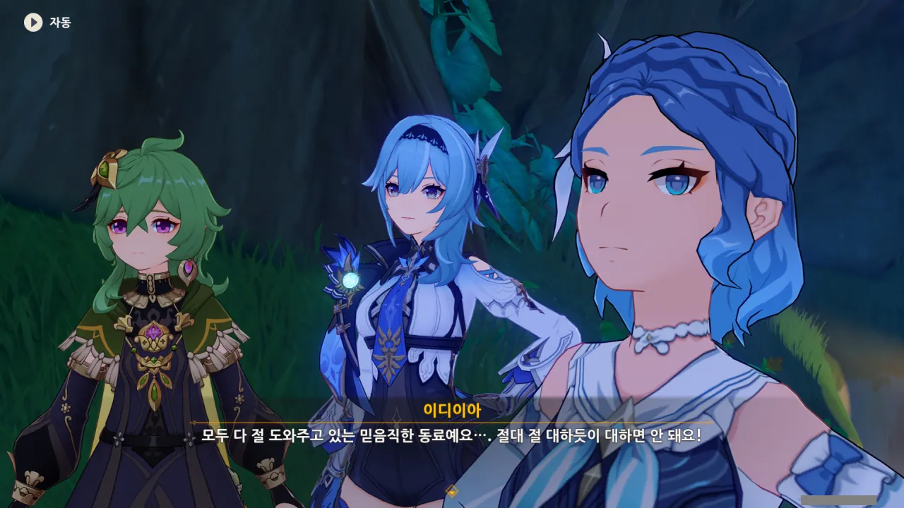

> 절대 절 대하듯이 대하면 안 돼요!

ㅋㅋㅋㅋㅋㅋ 아니, 이 말이 나올 정도면, 이 사람들은 대체 평소에 얼마나 이디이아를 까대며 살아온 거야? 너무했네, 정말...



메이몬이 안내한 곳은 거대한 천막 앞이었다. 서커스 공연을 할 때나 볼법한 그런 천막인걸.



비경 안에 커다란 텐트가 있다고 신기해하다니... '집 안의 집' 같은 감상인 걸까?



이 텐트는 이디이아가 만들어준 것이라고 한다.

아니, 그러면 이디이아는 그냥 단순한 관리인이 아니었던 거잖아. 이렇게 능력 좋은 이디이아를 왜 다들 까대지 못해 안달인 거지?





콜레이가 뭔가 이상한 점을 발견했지만, 산통을 깨는 발언이 될 까봐 말하기를 주저하고 있다.

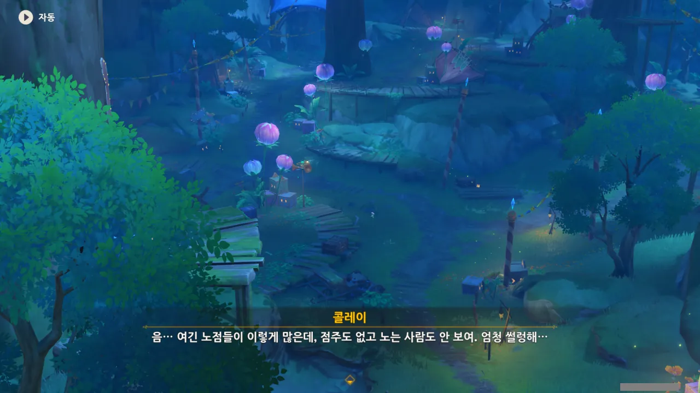

아, 저게 다 노점이었어? 난 그냥 가건물로 생각하고 있었는데...

그런데 사람이 없는 건 다른 곳도 마찬가지 아니었나? 관리인 아니면 물의 환령밖에 보이지 않던데?

메이몬의 말이 더 충격적이다. 여기가 원래 시끌벅적한 곳이었다고? 그러면 정말 콜레이 말처럼 원래 여긴 제대로 된 노점도 있고 사람들이 주변을 돌아다니기도 했다는 거야?



아이고, 이곳 역시 코어 휠의 고장으로 이렇게 되어버렸다고 한다.

그런데... 「크리스탈 램프」가 뭐길래, 그게 떨어졌다고 여기가 이렇게 돼버린 거지?



> 축제에는 예쁜 불빛이 있어야 한다

암, 맞는 말이다. 게임 내 대표적인 축제인 해등절 역시 예쁜 불빛으로 가득하지 않은가.







아무튼, 코어 휠이 고장 날 때, 그 부품이 텐트 안으로 떨어졌고, 그 탓에 크리스탈 램프가 떨어져 텐트 안이 엉망이 되었으며, 물의 환령 역시 그 안에 갇혀버렸다고 한다. 이 비경은 물의 환령으로 이루어졌으니, 대부분의 물건이나 장치 역시 망가졌다고 봐야겠지.

그리고 유라가 애타게 찾던 친척이 용감하게 텐트 안으로 들어갔지만, 마찬가지로 텐트 안에 갇혀버렸다고 한다.

어... 음... 로렌스가 그러면 그렇지...?





여기서 이렇게 이야기만 해서는 아무것도 바뀌지 않는다. 그러니 일단 진입해서 상황을 살펴보는 수밖에.



무대의 성질 자체가 변해버렸다고? 그게 대체 무슨 말이야?

다만 눈앞에 조명 퍼즐이 있는 걸 보아하니, 이번에는 조명 퍼즐을 푸는 것이 주된 일일 것 같다.



뭐? 불빛이 가장 큰 문제라고? 혹시 램프의 출력이 너무 강해져서, 조명을 쬐기만 해도 전신에 화상을 입는다거나 그런 거야?

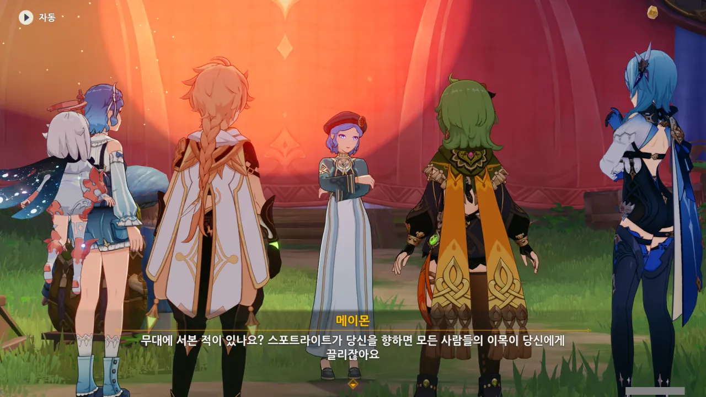

어... 그런데 그게 지금 상황과 무슨 상관인 거지?

아무튼, 질문에 대답하자면, 난 주목받는 걸 별로 좋아하지 않는다. 평범하고 평온하게 살 수 있다면 장땡이지.



나랑 비슷하네.

만전의 상태에서 주목을 받는다면 모를까, 미처 준비도 못한 상황에서 갑자기 주목을 받는 건 정말 질색이다.



"아직도 내려놓지 못한 거야?"라고? 콜레이가 주목받기 싫어하는 이유가 옛날에 있었던 일 때문인 거야?

그 이유로 짐작 가는 것이 하나 있다만, 내가 원신 만화를 보지 않아서 정확히는 모르겠다. 하지만 대충 들은 것만 해도 그때 콜레이가 겪은 일은 트라우마가 되기 충분해 보이더라고.

그리고 그런 트라우마는 쉬이 극복할 수 없다. 애초에 쉽게 극복 가능한 거였다면 트라우마로 불리지도 않았겠지.



나만 유라의 말이 공허하게 들리는 걸까? 마치 모든 걸 다 가진 사람이 '야, 너도 할 수 있어!'라고 말하는 것만 같다.

자수성가한 사람이 강연을 열고 '당신도 나처럼 하면 성공할 수 있습니다!'라고 말하는 상황 같다. 그건 허언에 지나지 않는다. 그 강연을 듣고 실제로 실천한다고 해도, 그 사람처럼 성공하는 사람을 손가락에 꼽을 수 있으면 다행일 것이다.



음, 음. 콜레이와 이디이아의 말에 깊이 공감한다.



유라가 앞장서서 걷다 뒤돌아 콜레이에게 손을 내미는데, 조명과 카메라의 각도가 절묘하게 배치되어 마치 유라에게 후광이 비치는 것만 같다.



확실히, 유라는 뒤에서 사람을 비웃을 성격이 아니긴 해. 만약 유라가 누군가를 비웃는다면, 그 사람 면전에 대고 비웃을걸?

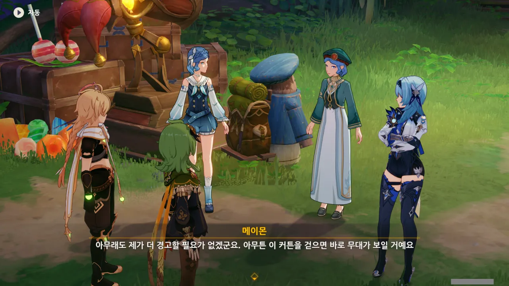

아니, 이목이 끌리는 것에 대한 이야기가 앞으로 있을 일에 대한 경고였다고?

여긴 대체 뭐가 어떻게 돌아가고 있는 거야?

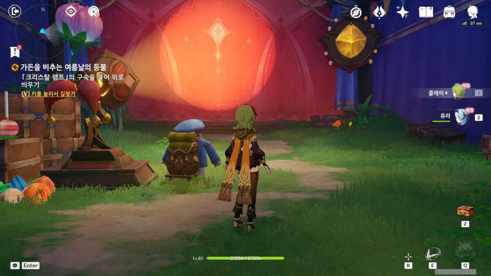

갑자기 콜레이와 유라로 플레이하게 되었다.





무대 중앙에는 크리스탈 램프가 놓여있다.

램프가 떨어졌다길래, 램프가 산산조각 난 모습을 상상했는데 의외로 멀쩡하잖아?



크리스탈 램프를 비추던 조명을 치우자, 램프와 램프를 받치고 있던 받침대가 위로 솟아오른다.

조명을 치우는 것도 퍼즐이었구나.

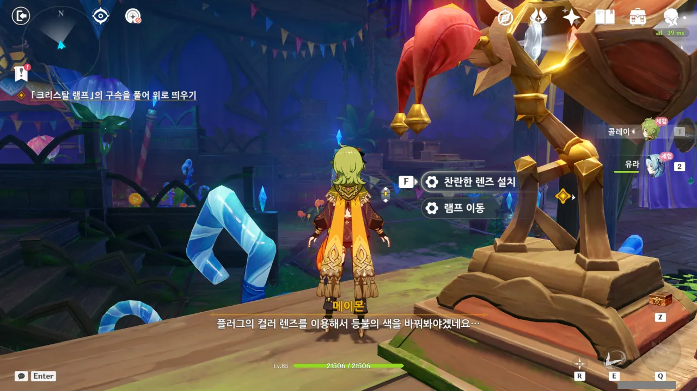

거 참, 메이몬 성격 참 급하다.

렌즈를 주워 램프에 끼워 넣어서 조명의 색을 바꾸려는 찰나에 저 대사가 나오네.

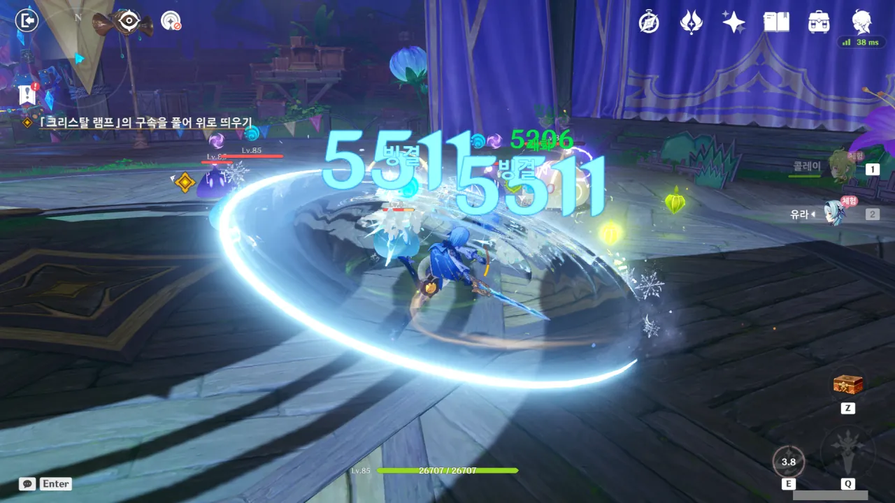

으아니, 대체 이게 무슨 일이야!

유라와 콜레이로 전투를 할 일이 없을 거라고 생각했는데, 다음 층으로 올라가려는 순간 슬라임이 나타났다.

풀과 얼음은 서로 반응하지 않기 때문에, 슬라임의 원소를 이용해야 한다. 그런데 이렇게 되니, 콜레이는 집어넣고 유라로만 때리는 게 제일 편하더라고.

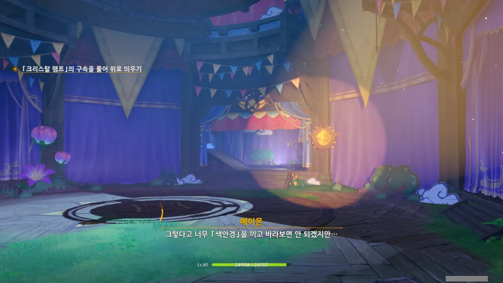

어... 설마 메이몬... 그걸 개그라고 친 거야?





ㅋㅋㅋㅋㅋㅋ 아재 개그 좀 쳤다고 곧바로 사이노와 엮여 버린다.

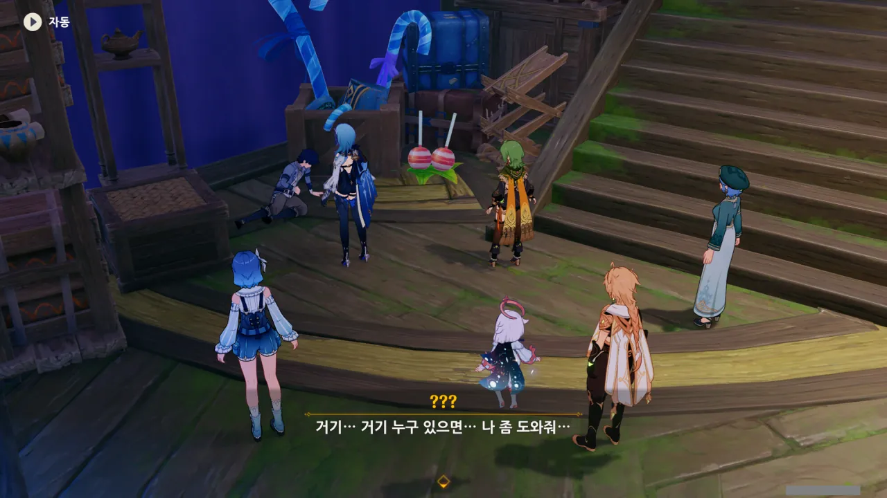

다음 층으로 가던 중, 쓰러져 있는 누군가를 발견했다. 이번엔 파란색 머리가 아니네.

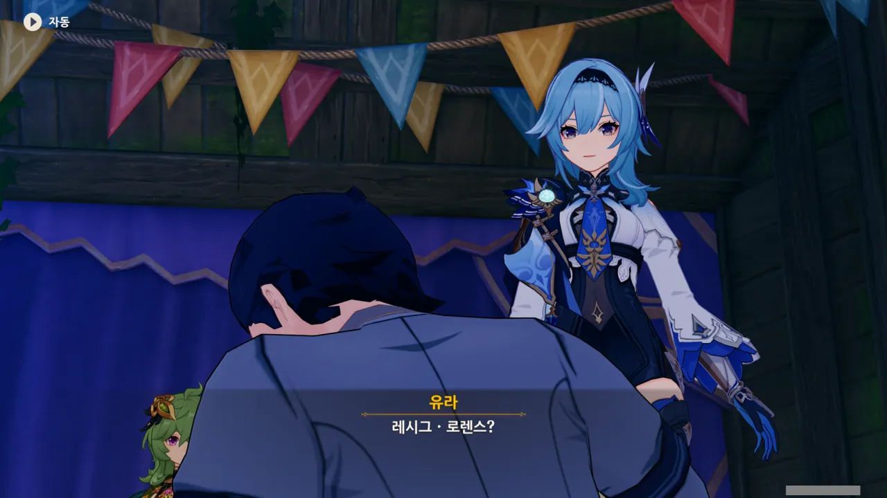

오, 이 사람이 유라가 그토록 찾아 헤매던 유라의 친척이었어? 이름은 '레시그'이고?



지나가던 아무나 붙잡고 도와달라고 할 정도로 상태가 좋지 않으면서, 고작 실명 좀 불렀다고 무례를 운운하다니...

이 녀석, 정말로 도움을 받고 싶은 거 맞아?

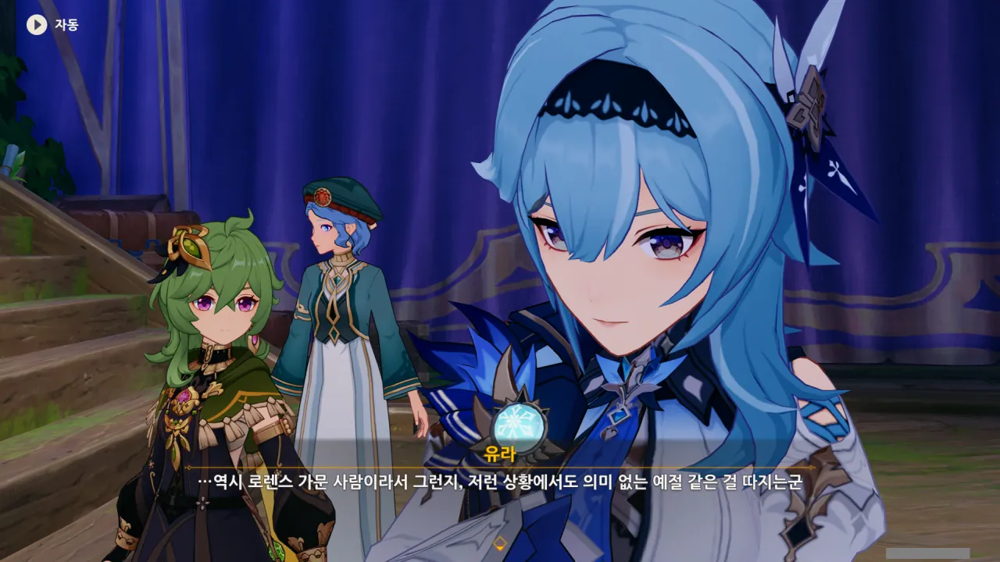

예전에 몬드의 기밀을 팔아먹으려던 로렌스 가문의 사람을 잡기 위해 잠시 어울릴 때, 로렌스 가문이 그토록 중시하는 예절이란 걸 본 적이 있다.

뜯어보니 헛웃음도 나오지 않던데, 대체 로렌스 가문에게 있어 예절이란 뭘까?





이야, 카메라 연출 죽이네.

레시그는 자신을 도와주러 온 유라에게 날을 세웠다가 "귀족은 태어날 때부터 독립적이니, 다른 사람의 도움은 필요 없지?"라며 역으로 도발당했고, 거기에 보기 좋게 낚여 도움의 손길을 뿌리친다.

병신.



콜레이가 보기에, 레시그는 실제로 도움이 필요하지만, 유라와의 자존심 싸움 때문에 마음에도 없는 말을 했고, 그래서 지금도 유라를 흘끗흘끗 곁눈질하며 눈치를 살피고 있다.

유라 역시 레시그가 그럴 줄 알고 일부러 도발한 모습이다.

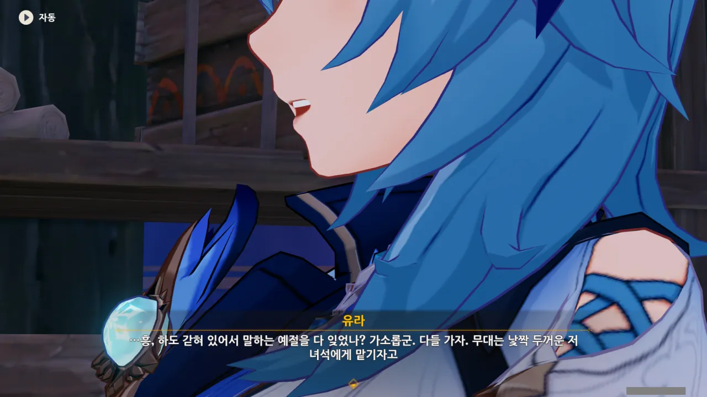

유라가 하는 말을 잘 보면, 이건 100% 레시그를 도발하는 말이다. 도움을 받고 싶으면 제대로 말하라는 의미지.



그리고 거기서 최악의 수를 둔 레시그.

가족 운운하는 것까지는 좋았을지 몰라도, 가문의 위엄과 존엄을 꺼낸 이상, 완벽히 아웃이 되어버렸다.



그래서 잔뜩 화가 난 유라는 이제 아예 대놓고 '네 신중하지 못한 행위 때문에 우리 모두가 여기에 왔다'라며 레시그를 쏘아붙인다.

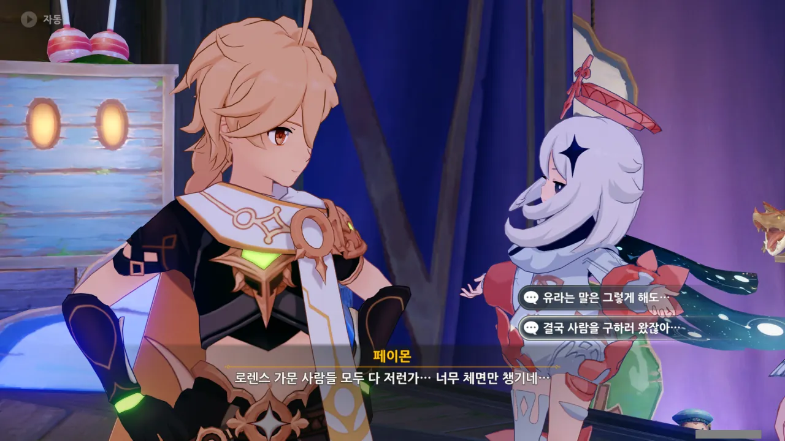

저 정도면 체면이 아니라 아집인데 말이지...





분위기가 엉망이 되었을 때, 이디이아가 '마따끄... 분위기가 엉망이 되었잖아?'라며 끼어들어, 두 사람에게 사탕을 하나씩 나눠준다.

갑자기 웬 사탕?

응? 렌즈에서도 사탕 향기가 났다고? 설마 렌즈는 사탕으로 만든 거였었나?



뭐, 그렇지... 기분이 나쁘더라도 일단 입 안에 달콤한 걸 넣으면 기분이 조금 나아지기 마련이다.

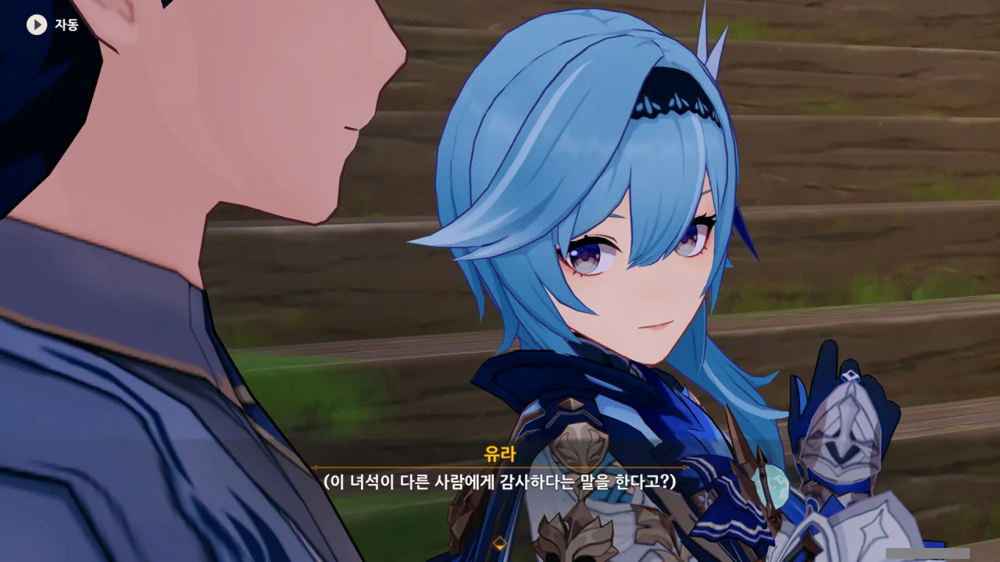

유라는 레시그가 무려 감사인사를 했다는 것에 놀라워한다.

그러면 로렌스 가문 사람들은 평소에 감사인사조차 하지 않았다는 거야? 뭐... 유라에게서조차 감사인사를 듣기는커녕 '이 원한은 나중에'라며 원한 드립만 들었으니, 정말 그런가 보다.



사탕을 나눠준 후, 레시그에게 그동안 유라가 레시그를 애타게 찾아다녔다는 걸 알려주는 이디이아.



... 유라도 보면, 쓸데없이 자존심이 높아서 절대로 낯부끄러운 말은 안 하려고 한다. 이걸 전문 용어로 뭐라고 부르더라? 「츤(ツン)」?

그리고 그걸 콜레이는 '입만 살았다'라고 한다. ㅋㅋㅋㅋㅋㅋ



사실 사탕을 하나 더 먹고 싶었던 거구나, 유라...



방금 것이 「츤」인지 아닌지는 이제 상관없다. 저 모습은 분명 츤츤대는 모습이다.

물론, 여기에는 '연인 사이의 애정' 같은 것이 전혀 없지만.



딱 적당한 때에 와서, 이 오글거리는 상황을 멈춰준 메이몬.

메이몬, 네가 우릴 살렸어!

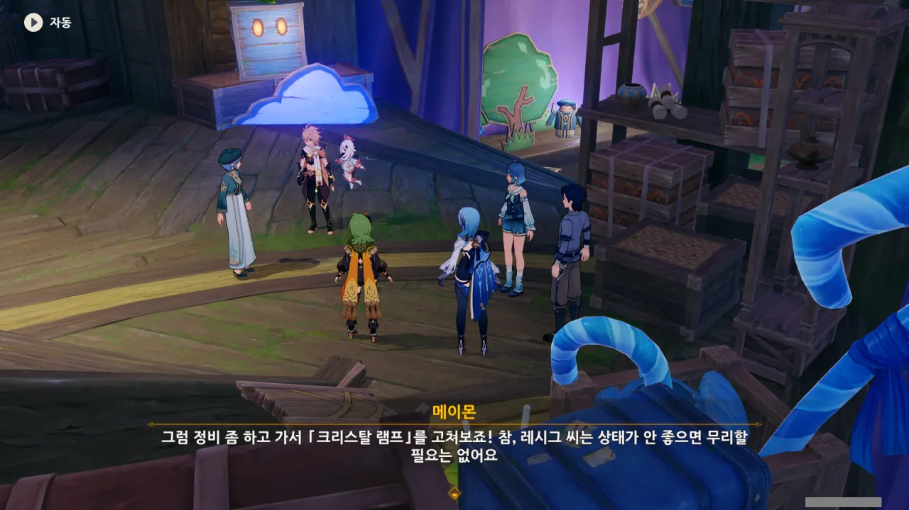

아무튼, 쉴 만큼 쉬었으니, 이제 마저 크리스탈 램프를 수리해야 한다.



이디이아는 레시그와 함께 쉴 곳을 찾아보기로 한다.

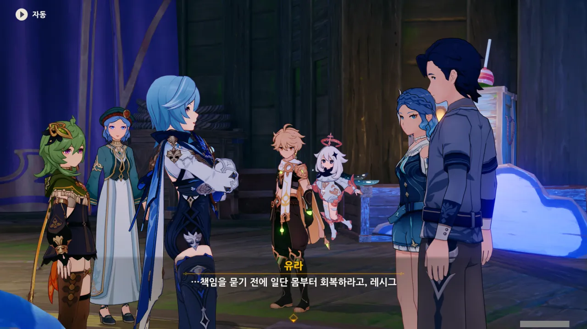

유라도 참... 솔직하지 못하긴...
