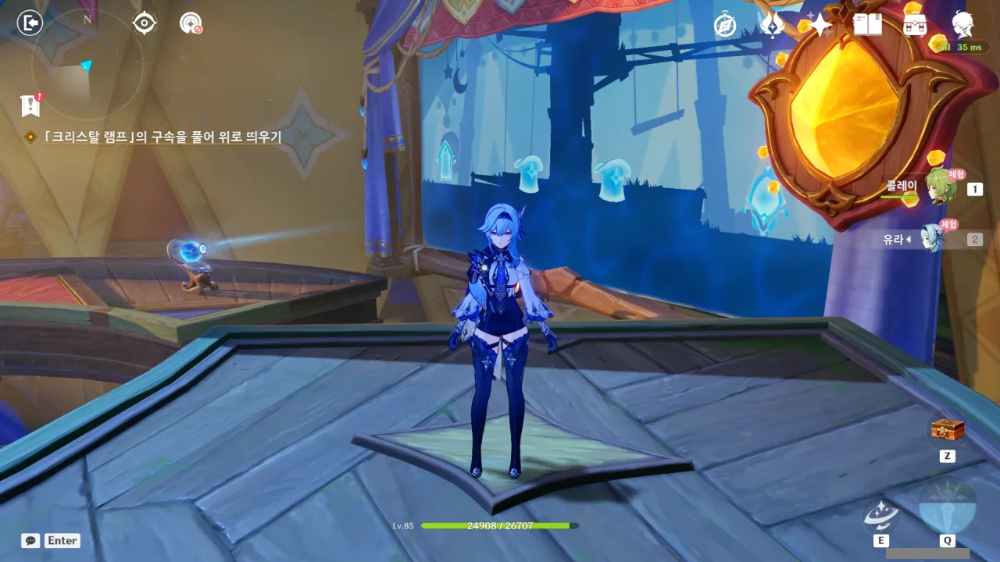
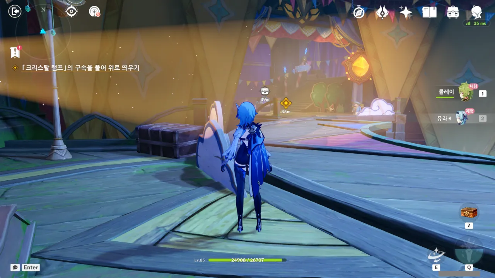
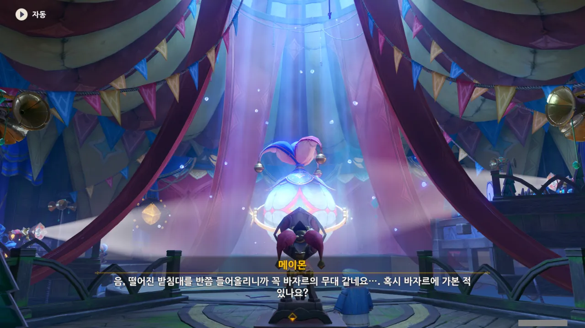
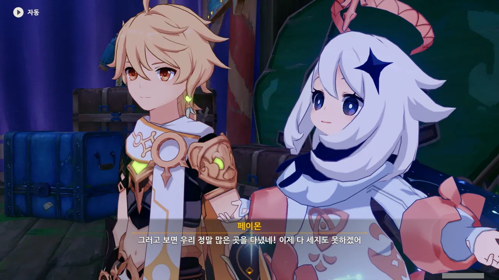
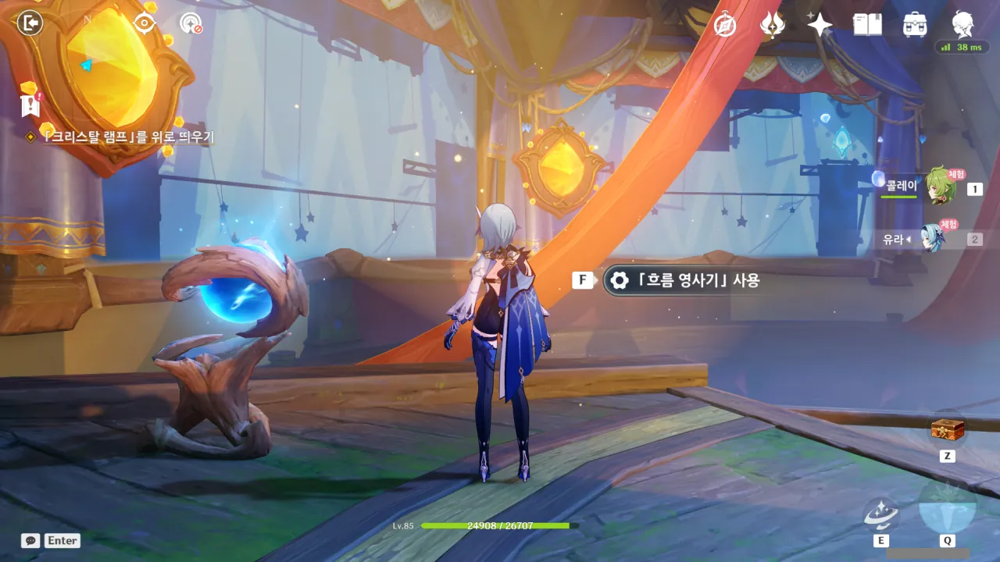
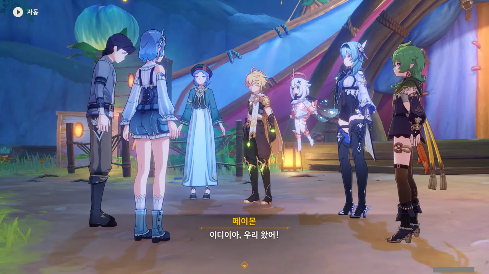
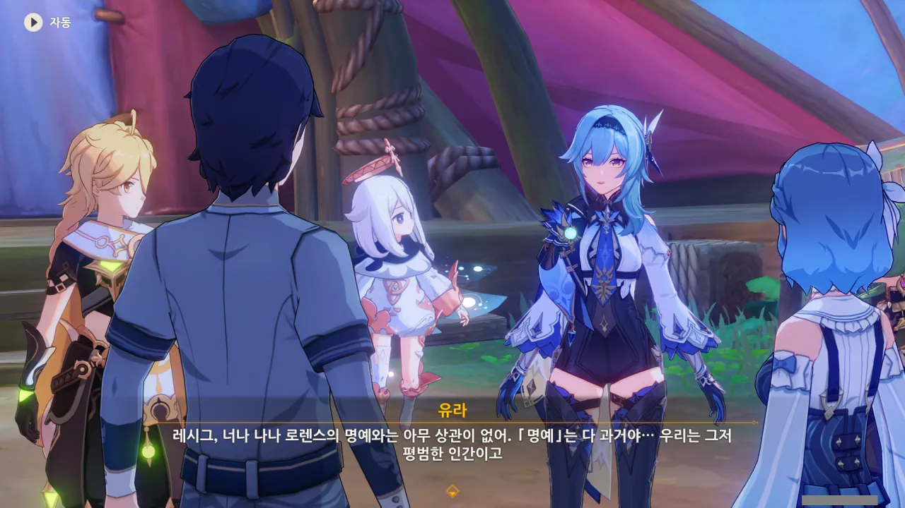
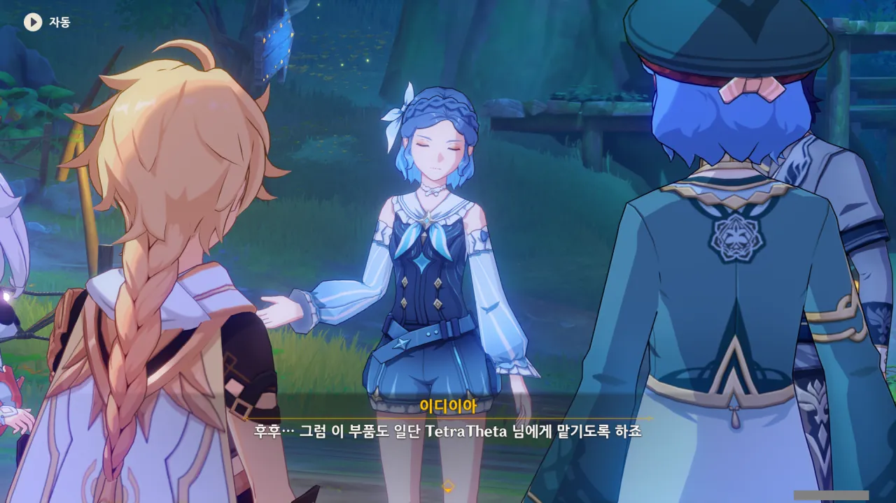
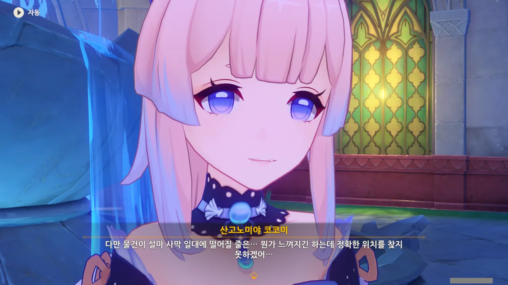
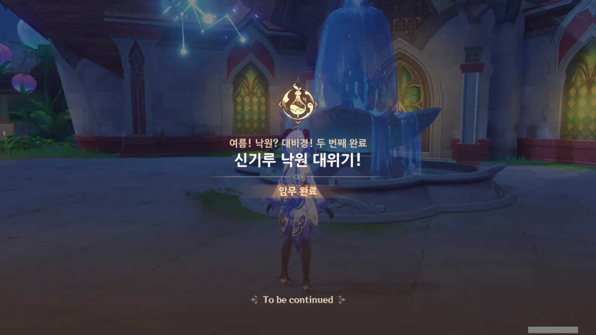



다음 층에서 마주한 퍼즐 역시 크리스탈 램프를 비추고 있는 조명을 치우는 퍼즐이다.

다만 이번엔 치워야 하는 램프가 하나 더 늘어, 2개가 되었다.



유라가 "저게 정말 내가 알던 레시그 맞나?"라고 의문을 표하는 걸 보면, 우리가 본 레시그의 모습은 유라가 알던 모습과는 좀 다른 듯하다.

아까 레시그가 감사인사를 표한 것을 보면, 수메르에 와서 경험한 것 때문에 뭔가 심경의 변화가 있었던 게 아닐까 싶다. 하지만 유라를 보자마자 서로 자존심 때문에 싸워댔고, 그래서 우리는 레시그가 어떻게 바뀌었는지 아직 보지 못한 것일 수도 있지...



조명을 치우는 일은 아주 순조롭게 진행되고 있다.



그런데 커튼이 걷히자, 그 뒤에 숨어있던 물의 환령이 모습을 드러낸다.



물의 환령은 손을 흔들더니, 구상도와 영사기로 변했다.

오... 그러니까 여기서도 또 2D 플랫포머를 하라는 건가.

영사기를 통해 구상도로 들어가고, 구상도에서 나오면 여전히 영사기 앞이었던 이전과는 다르게, 구상도에서 나와 도착한 곳은 영사기 옆에 있는 다른 플랫폼 위였다.

순조롭게 퍼즐 풀이 완료!



안쪽이 바깥쪽보다 넓다고? 이건 100% 타디스 오마주가 분명하다.

닥터 후가 처음 방송을 시작한 것이 1963년이니, '안쪽이 바깥쪽보다 넓다'는 드립도 꽤 역사가 오래된 셈이다.



이제 램프를 텐트 꼭대기로 올리는 일만 남았다. 뭐, 이번에도 역시 조명을 열심히 치우게 되겠지...

어... 갑자기 웬 바자르?



유라는 수메르에 온 것이 이번이 처음이니, 바자르에 가본 적이 단 한 번도 없다. 콜레이는 타이나리를 따라 몇 번 방문해 본 것이 전부이다.

여행자는 이미 바자르에 여러 번 다녀왔고. 그때 닐루가 춤추는 장면을 다시 볼 수 있으면 참 좋을 텐데...





유라와 콜레이의 사이가 갑자기 부쩍 좋아진 것 같다. 단순한 내 착각인 건지, 아니면 콜레이 덕분인 건지 잘 모르겠다.

만약 후자라면, 콜레이의 장점에 '누구나와 친해질 수 있는 높은 친화력'이 하나 추가되겠네.

뭐, 그렇긴 하다. 다만 어딜 가든 간에 한 번씩은 지명수배가 되는 것이 문제다.

처음 방문한 도시인 몬드에서는 그러지 않았지만, 이후 방문한 리월, 이나즈마, 수메르에선 전부 한 번씩 지명수배를 당했다.

이쯤 되면 몬드에서 지명수배를 당하지 않은 건 몬드가 튜토리얼 지역이라서 그런 게 아닐까 싶을 정도라니까.



갑자기 어릴 적 이야기를 꺼내는 메이몬.



메이몬은 아버지를 따라 축제 준비를 돕는 사람이 되고 싶었다고 한다.

하지만 과제 연구로 쉴 새조차 없는 아카데미아 학자에겐 축제 준비를 도울 시간이 없다.



「내가 되고 싶은 사람」과 「부모님이 바라는 사람」 중 고민하다 후자를 선택한 메이몬이지만, 자신이 되고 싶은 건 아카데미아 학자가 아니었기에 전혀 즐겁지 않았다고 한다.



그래서 뒤늦게라도 자신이 원하는 사람이 되어보고자, 신기루 안에서 텐트를 비롯한 여러 노점들을 설치해 축제 분위기를 내보려 한 메이몬.





하지만 축제에 참가하는 것과 축제를 여는 것은 전혀 다른 일이었다.

메이몬이 어렸을 적 아무런 걱정 없이 축제에 참가할 수 있었던 건 가족들의 보이지 않는 노력 때문이었고, 축제 준비의 고단함을 잘 알고 있던 메이몬의 아버지는 딸이 아카데미아 학자가 되어 조금 더 편한 길을 걷길 원했다.



'내가 되고 싶은 모습'과 현실의 괴리감에 고통받고 자포자기한 채 사막에서 지맥조사를 하다가 신기루에 떨어진 메이몬은 신기루에서나마 자신이 되고 싶은 모습이 되기로 마음먹고 도전했지만, 일이 이렇게 엉망이 되어버리자 좌절해버리고 만다.





콜레이가 좌절한 메이몬에게 '정말로 자포자기한 사람이라면 여행자 일행을 적극적으로 돕지 않았을 것이다', '메이몬에겐 용기가 있다'라며 위로한다.



응? 유라를 보고 '행동이 말보다 솔직한 것을 의식하지 못하는 사람도 있다'라는 걸 깨달았다고?

그거 정말 맞는 말이네! ㅋㅋㅋㅋㅋㅋ



유라가 그 발언에 대해 캐묻자, 다급히 화제를 돌리는 콜레이.

아 ㅋㅋㅋ 귀여워라 ㅋㅋㅋ

이번 영사기의 화면은 두 개다.

그러면 퍼즐 길이도 다른 구상도 퍼즐의 두 배가 되는 건가 기대했지만, 퍼즐의 길이는 다른 퍼즐과 다를 바가 없어 조금 실망했다.





천장을 막고 있던 물빛 뚜껑이 사라지고, 크리스탈 램프가 텐트 위로 솟아오른다.





그리고 그와 동시에 텐트 주변 곳곳에 조명이 들어오며 화려하게 빛난다.

마지막에 나온 저 나무 구멍은... 설마 저기로 들어가라는 건 아니겠지?

크리스탈 램프를 원상태로 복구하고 나와보니, 텐트 밖에 레시그와 이디이아가 있다.

어디 갔나 했더니, 여기 있었구나.



이디이아의 보살핌 덕분에 레시그가 거의 다 회복했다고 한다.

자신의 또 다른 장점을 하나 더 발견했다며 좋아하는 이디이아를 보니, 안쓰러움과 다행스러움이 교차한다.



그런데 레시그의 상태가 좀 이상하다. 아까 텐트 안에서 만났을 때에는 정신이 멀쩡해 보였는데, 이디이아가 대체 레시그에게 뭘 한 건진 몰라도, '거대한 그림자'를 운운하며 정신이 나가있다.

제대로 치료한 거 맞아, 이디이아?



제버릇 또 못 버리고 여행자 일행이 이디이아보다 40배 더 믿음직하다고 메이몬이 말하자, '40배 정도면 난 생각보다 훌륭하네'라고 긍정적으로 반응하는 이디이아. 그 모습을 본 메이몬이 되려 감탄한다.

대체 이건 무슨 콩트일까. '컵에 물이 반이나 차있네'도 아니고...





대체 이디이아가 레시그를 어떻게 치료했길래, 사람 정신이 저렇게 나가버릴 수 있는 건지 심히 궁금해진다. 레시그는 단순히 탈진한 거 아니었어? 설마 '신체에 누적된 대미지를 정신으로 옮기면 신체는 치료된다!' 같은 기괴한 논리로 레시그를 치료한 건 아니겠지?

아무튼, 레시그가 정신을 차렸다.





유라를 비롯한 모두의 예상대로, 레시그가 수메르에 온 건 '과격한 방법'을 써서라도 로렌스 가문을 부흥시키기 위해서였다.

그런데 지금껏 보아온 로렌스 가문의 사람답지 않게, 레시그가 뭔가 고분고분해졌다.







'과격한 방법'을 써서라도 로렌스 가문을 부흥시키고자 했던 레시그는 수메르로 오며 겪은 일 덕분에 현실을 깨닫게 되었다.

로렌스 가문에서는 '로렌스 가문 최고!'라며 가문의 가치를 지나치게 높게 잡고 가문의 구성원 역시 그 가치에 걸맞은 행동을 해야 한다며 구성원들을 엄격하게 가르쳤지만, 가문 바깥에서의 로렌스 가문은 정말 아무것도 아니었다.

유라는 가문 바깥에서 겉돌았기 때문에, 이 진실을 더 일찍, 더 많이 알아차릴 수 있었고.



레시그가 말한 대로라면, 로렌스 가문 사람들이 진정으로 바란 것은 남들과 평화롭게 지낼 수 있는 환경뿐이었다. 다른 사람들에게 손가락질받지 않고, 남들처럼 평범하게 다른 사람들과 지낼 수 있는 그런 환경 말이다.

하지만 과거의 일로 한 번 사람들에게 비난받기 시작하자, 로렌스 가문은 잘못된 길을 선택했다. 좀 더 사람들에게 가까이 다가가는 대신, 문을 걸어 잠그고 그 뒤에서 '로렌스 가문은 정말 대단한 가문이야'라고 스스로에게 말하며 꽁꽁 틀어박힌 것이다.

'가문의 명예'보다 더 헛된 것이 있을까?



유라에게 미안하다며 사과를 하는 걸 보면, 레시그가 정말 개심한 것이 맞나 보다.

사과라니, 로렌스 가문 사람들이라면 절대로 하지 않을 행동 아닌가.





음, 그러면 레시그에게 있어 「부모가 바라는 사람」은 '쓸데없이 콧대만 높은 로렌스 가문 사람' 정도가 되는 건가.





> 하, 그러면 그냥 맞아 죽을걸?

뭐, 그렇겠지. ㅋㅋㅋㅋㅋㅋ

다만 이번에 깨달음을 얻은 건 유라뿐만이 아니니, 유라 역시 이번에 다 함께 앉아 이야기를 나눠볼 생각이라고 한다.

로렌스 가문은 유라를 내놓은 자식, 없는 자식 취급할 줄 알았는데, 유라가 저렇게 말하는 걸 보면, 정말 로렌스 가문이 원했던 건 '남들과 평화롭게 지낼 수 있는 환경'이었던 모양이다.

어쩌면 이번 일을 계기로 로렌스 가문도 뭔가 변할 수 있지 않을까 하고 기대가 된다.



> 로렌스는 이 무대처럼 한때 휘황찬란했지만, 과거의 무대는 막을 내렸어. 이제 새로운 무대로 교체할 때야.

오... 유라, 꽤 시적인 말을 하는 걸?

콜레이는 그런 유라의 모습을 보고 감탄하고 있다.



메이몬이 레시그 옆에서 찾았다며 준 것은 무언가 작은 상자처럼 생긴 물건이었다.



아니, 이 상자가 코어 휠의 부품이라고?

대체 코어 휠은 어떻게 생겨먹었길래 등산 밧줄이나 작은 상자가 부품이 될 수 있는 건지, 참 신기하네.

이번에도 여행자가 코어 휠의 부품을 떠안게 되었다.



이 상자는 사탕을 넣는 상자라고 한다.

음... 내가 사탕 상자를 어디서 봤더라? 허공 루프 속에서였나?



심지어 이 휘황찬란한 텐트를 만들 때 쓴 것이 이 사탕 상자라고 한다.

... 통통 폭탄으로 열차도 만들 수 있는 비경이니, 더 이상 깊게 생각하지 않기로 했다.



어릴 때 느꼈던 사탕의 맛을 어른이 되고 나서는 더 이상 느낄 수 없다라...

어릴 적 친구들이 삼삼오오 모여 비디오 게임을 할 때, 자기 혼자만 엄격한 부모 탓에 게임 공략집을 보며 상상하는 것에 그쳤어야 했던 남자가, 커서 어른이 된 후, 추억의 그 비디오 게임을 사서 플레이해보았지만, 전혀 기쁘지 않았다고 하는 이야기가 생각난다.

인생의 어느 순간, 딱 그 순간에만 할 수 있고 느낄 수 있는 감정이 있는 모양이다. 그렇다면 페이몬의 '선택'이라는 단어도 어느 정도 이해가 되네.



이제 남은 부품은 단 하나.



이제야 안 건데, 처음 얻었던 톱니바퀴를 제외한 나머지 부품은 플레이어의 가방에 임무 아이템으로 여태껏 들어 있었다.

아마 이디이아가 톱니바퀴를 코어 휠에 끼워넣기 전까지, 톱니바퀴 역시 임무 아이템의 형태로 가방 안에 들어 있었겠지...

여태껏 받은 부품을 그냥 받은 셈 치고 넘어갔을 거라 생각하고 있었는데, 꽤 의외이다.



마을에 돌아와 보니, 코코미가 먼저 와있었다.



와타츠미섬이 옛날에 잃어버렸다고 하는 유물의 이름이 「신기루 옥갑」이라고 한다. 마침 이 비경의 이름도 「유리빛 신기루」라고 했는데...

어쩌면 그 유물이 이 비경의 핵이 되어 기능하고 있는 게 아닐까? 두 이름에 '신기루'가 공통적으로 들어가는 게 단순한 우연은 아닐 것 같은데 말이다.

아무튼, 코코미가 여기에 온 것도 보석의 빛을 따라온 것이라고 한다.

뭐야, 그러면 내 생각이 옳았다는 거잖아.



다만 코코미가 여기 온 목적에 대해 거짓말을 한 건 아니고, '시야를 넓히기 위해' 수메르에 왔다는 것 역시 맞는 말이라고 한다.

고로가 코코미에게 집 안에 틀어박혀 라노벨만 보지 말고 밖에 좀 나가라고 했다고 한다. ㅋㅋㅋㅋㅋㅋㅋㅋㅋㅋㅋㅋ

영미권에서 '게임 좀 그만하고 밖에 좀 나가서 놀아라'라고 할 때 'touch the grass'라고 하는데, 딱 이 상황에 어울리는 말이다.

비경에 들어오긴 했지만, 유물의 정확한 위치는 아직 찾지 못한 코코미.

아까 말했다시피, 와타츠미섬의 아라히토가미 무녀인 코코미는 여기서 이렇게 느긋히 비경 복구를 도울 게 아니라, 한시라도 빨리 유물을 찾고 와타츠미섬으로 돌아가야 하는 입장이다.



솔직히 말해, 이 비경에서 어떤 일이 일어나도 놀랍지 않을 것이다.

&nbsp;

이 비경에 클레를 초대한 건 다름 아닌 앨리스이다.

웃자고 '걸어 다니는 광기 덩어리'라고 말하는 거지, 사실 앨리스는 바람의 신 바르바토스에게 도전할 정도로 강력한 마녀들이 모인 마녀회의 일원이다. 앨리스는 우리가 생각하는 것보다 훨씬 더 강할 수 있다는 말이다. 그런데 그런 존재가 손을 댄 곳이 바로 이 신기루 비경이다.

비경의 특색이겠거니 하며 넘긴 '물의 환령', '투영', '코어 휠의 부품' 등도 의심스럽기 짝이 없는 것들이다.



코코미에게서 새로운 정보를 얻었다.

이 비경은 원래 이런 모습이 아니었다고 한다. 말하는 것으로 미루어보아, 대격변 수준의 변화를 겪은 모양이다.



윽, 콜레이가 영 좋지 않을 때에 나타났다. 코코미로부터 이 비경이 원래 어떻게 생겼는지에 대해 들을 수 있는 기회였는데...

뭐, 아직 이벤트 스토리는 1/3이나 남았으니, 나중에 들을 수 있을지도 모른다.



오, 유라와 콜레이가 함께 디저트를 만들었다고 한다. 이게 다 이디이아에게 오븐과 화덕이 있었기 때문이라고.



유라로 달빛 파이를 만들면 일정 확률로 유라의 특제 요리, '격랑 파이'가 나온다.

콜레이로 포켓 피타를 만들면 역시 일정 확률로 콜레이의 특제 요리, '동경'이 나온다.

이거, 분명 노린 거다.



솔직히 「마녀」니 「군사」니 하는 건 클레가 있을 때에만 하는 게 낫다고 생각한다.

클레가 좋아해서 하는 거지, 내가 좋아하는 건 아니니까.



놀랍게도, 레시그는 지금 오븐 앞에서 열심히 요리를 하는 중이라고 한다.

아무튼, 이벤트 두 번째 이야기, '신기루 낙원 대위기!'가 끝났다.



옆에 코코미와 콜레이가 대화하고 있길래 엿들었는데, 별 영양가는 없었다.





이벤트 두 번째 이야기를 끝내면 이렇게 도전 항목이 해금되는데, 겉보기에는 여기에도 무언가 이야기가 있을 것처럼 보인다.

하지만 저번 해등절 때였나, 뭔가 이야기가 있을 것처럼 해놨는데 아무런 이야기가 없었던 경우가 있지 않은가. 아마 이번에도 단순한 표지 사기일 것이다.
