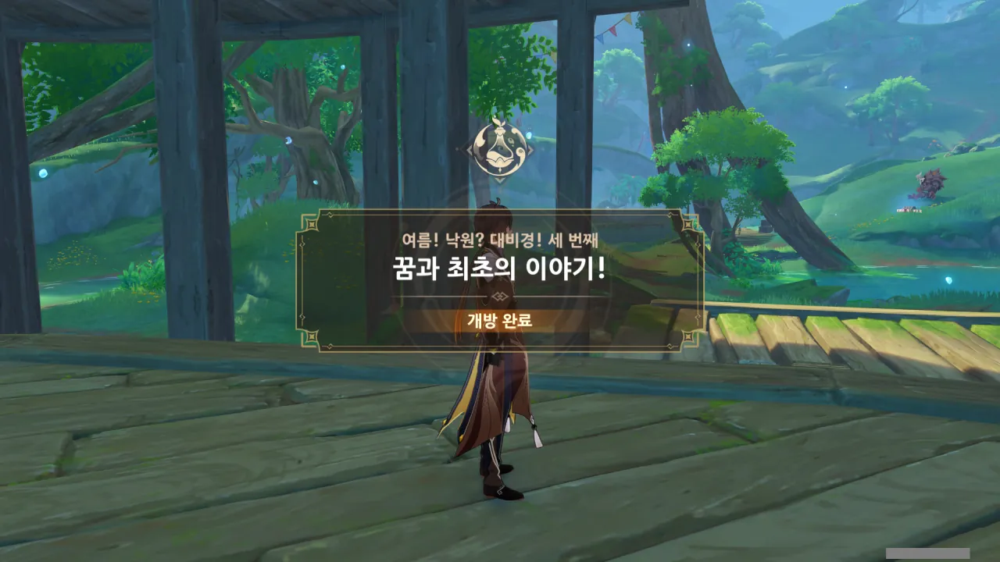

드디어 이벤트 스토리도 마지막을 향해 달려간다.

이벤트 기간이 약 2주 정도밖에 남지 않았기 때문에, 이벤트 스토리를 얼른 끝내고 필드 곳곳에 널려있는 퍼즐을 풀어 보상을 챙겨야 한다.



응? 레시그 때문에 뭔 일이라도 생긴 걸까?



레시그가 방금 뭔가를 유라와 이디이아에게 털어놓았다고 한다.



뭐? 레시그가 이 모든 사태의 원흉이라고? 대체 뭘 어떻게 했길래?



처음 이 비경에 들어왔을 때 본, 작은 물방울 같은 구체 기억하는가? 여행자는 페이몬을 놀려 먹었고, 케이아는 모두를 놀려 먹었던 그 구체 말이다.

레시그도 마찬가지로 그걸 봤는데, 그게 어릴 적 할아버지에게 받았던 천구의처럼 생겼다고 생각하며 무심결에 그걸 만졌고, 그러자 비경이 말 그대로 뒤집어지며 난리법석이 났다고 한다.



아니, 그게 진짜 이 비경의 코어였다고? 그걸 대체 왜 그런 곳에 보관한 거야...?

이건 정말 레시그를 탓할 수 없는 일이다. 중요한 것이라면 사람의 손이 닿기 힘든 곳에 잘 보관했어야지...



그래서 비경의 정상화를 위해 레시그가 보수 작업을 제안했다고 한다.

물론 이걸 혼자서 하기에는 절대로 무리이므로, 유라와 콜레이가 레시그를 돕기로 했다.





유라는 여전히 솔직하지 못한 모습을 보이고 있다. 이렇게 되니, 유라보다 개심한 레시그가 더 어른스러워 보일 지경이다.

콜레이가 그걸 지적하자, 헛기침으로 눈치를 주는 유라. 본인도 그게 유치하단 걸 아는 모양이지.





점심까지 레시그에게 떠넘기는 유라. 아니 이건 좀 너무한 거 아냐?



자기 대신 일해줄 사람이 나타나서 그런 걸까, 이디이아가 왠지 평소보다 더 팔팔한 느낌이다.



오, 그러면 콜레이와 유라 빼고 나머지가 다 같이 움직이는 건가? 그러면 클레 파티에 코코미만 더해지는 모양새네.



어지간히 기뻤던 건지, 이디이아가 걸어가지 않고 뛰어가더라.

그러면 이제 이번 이벤트 스토리의 마지막인 「꿈과 최초의 이야기!」를 시작할 수 있다.

이번에 갈 지역은 처음 갔었던 '덩굴 골짜기'와 비슷한 넓이를 가졌다. 걷는 건 질색인데...







편하게 갈 수 있는 방법이 보이지 않아 직접 목적지로 뛰어가던 중, NPC들이 서로 대화를 나눈다. 하필 이동하는 도중이라, 잠자코 멈춰서 들을 수가 없다.

&nbsp;

이번에 새로 만날 NPC는 '조시모스'라는 이름을 갖고 있다고 한다. 직업 혹은 역할은 '감독'.

아까 지도에서 봤던 '상상 극장'이라는 지역명, 대화 중 언급된 '무대', '감독'이라는 단어들을 조합해 보면, 조시모스는 아마 극장 무대에서 펼쳐지는 연극을 관리하는 감독인 것으로 보인다.



목적지가 꽤 높은 곳에 있더라.

조시모스가 평소 밖에 나가는 걸 싫어한다고 하니, 드넓은 지역을 이곳저곳 돌아다닐 일은 적겠네.



조시모스의 오두막이 어디에 있는지 기억나지 않는 것과 마스코트가 대체 무슨 상관이지?





그때 코코미가 조시모스의 오두막의 방향을 짐작해 본다.

조시모스는 감독이니, 소품을 옮기기 쉽고 극장의 전체적인 모습을 볼 수 있는 곳에 자리 잡았을 거라고 추측하는 코코미.



극장의 방향은 그 방향으로 갈수록 주변이 화려해지는 걸 보고 맞추었다고 한다.

대단한데...



열차를 탈 수 있게 해 주어서 이곳에서도 열차를 타고 돌아다녀야 하나 생각했는데, 이 노선의 목적은 그냥 꼭대기로 올라갈 수 있게 해주는 역할에 불과했다.

뭐, 그게 열차의 본래 목적이지...



오두막의 문을 열자, 집 한가운데에 서있는 푸른 머리의 남성을 발견했다.

장담컨대, 저 사람의 눈 역시 파란색일 것이다.



뭐, 어찌 보면 당연한 일이겠지만, 조시모스 역시 이디이아와 면식이 있는 사이였다.





이제는 너무 많이 들어 식상하기까지 한, '이디이아가 어디 구석에 쪼그려서 울고 있을 줄 알았다'라는 대사.



뭐? 조시모스가 이디이아에게 대본을 써줬다고?

순간 머릿속에서 '조시모스가 배후에서 모든 일을 꾸미고 자신의 각본대로 흘러가게 만든 장본인인가?'라는 음모론이 거품처럼 생겼다 사라졌다.





다행스럽게도, 조시모스가 코어 휠의 부품을 갖고 있다고 한다.

그런데 그게 기존 공연을 제대로 진행하지 못하는 것과 무슨 상관이 있는 거지? 코어 휠을 고치면 이 모든 혼란이 그치고 모든 게 제자리로 돌아가는 거 아니었어?





그리고 조시모스가 우리에게 뭘 고치길 바라는 것인지에 대한 추리 게임이 뜬금없이 시작되었다.

장치, 무대, 도구, 부품, 대본... 여기서 이렇게 떠들 바에는, 조시모스에게 직접 물어보는 게 더 빠르지 않아?



아, 그러니까 조시모스는 연극을 할 배우가 모자랐던 것이다. 코어 휠의 부품은 어디 고장 난 것 없이 멀쩡하고.

어... 그냥 여기서 코어 휠의 부품만 받고 가서 코어 휠만 고치면 안 될까?



아 ㅋㅋㅋ 클레가 하고 싶다고 하면 해야지 ㅋㅋㅋ







조시모스는 여행자 일행을 본 순간, 오랫동안 막혔던 대본에 대한 영감이 떠올랐다며, 황급히 대본을 작성하러 떠났다.



얼마 되지도 않았는데 대본을 다 완성해 온 조시모스. 심지어 '대본을 나눠줬다'라고 하는 것을 보면, 똑같은 대본을 여러 부 만들어 나눠준 것으로 보인다.

여기서도 설마 '생각만 하면 생각대로 비비디 바비디 부'인 거야? 대본을 작성하고 여러 부 인쇄하는 데 걸린 것 치고는 너무 짧은데?



「군사」 코코미를 보자마자 새로운 캐릭터가 하나 생각나서 대본에 여주인공을 추가했다고 한다.



그리고 시작되는 대본 정독 시간.





클레는 아직 많이 어린지라, 단어들을 잘 이해하지 못하고 있다.

케이아가 옆에서 케어해 줘서 정말 다행이야...





케이아에게 연기에 대한 재능이 있는 것 같다며 눈독을 들이는 조시모스.

뭐, 케이아가 연기를 잘하긴 하지. 얼마나 감쪽같이 연기를 한 건지, 페이몬이 케이아에게 완전히 속아 넘어가서 나중에 "흑흑... 구라쟁이! 사기꾼! 말미잘! 해파리! 기사단의 수치! 쓰레기!"라고 외치지 않았는가.





조시모스는 먼저 무대를 점검하기 위해 떠났고, 여행자 역시 무대가 어떻게 생겼는지 살펴보기 위해 극장으로 떠난다.
