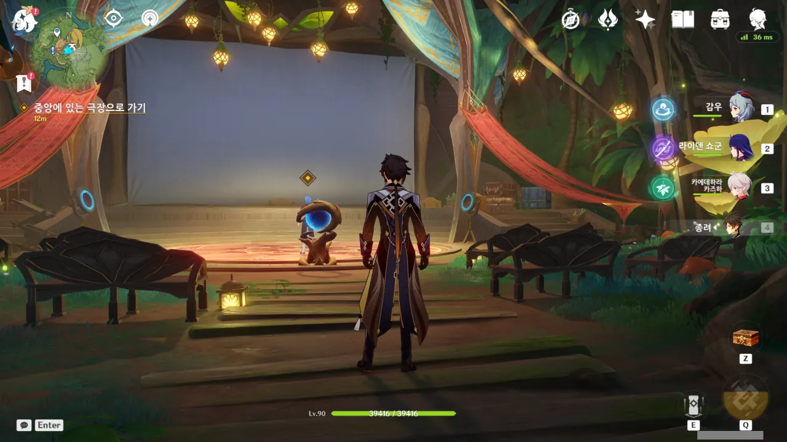
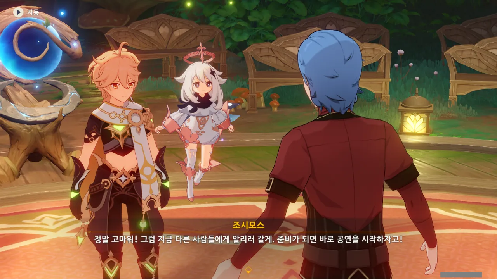
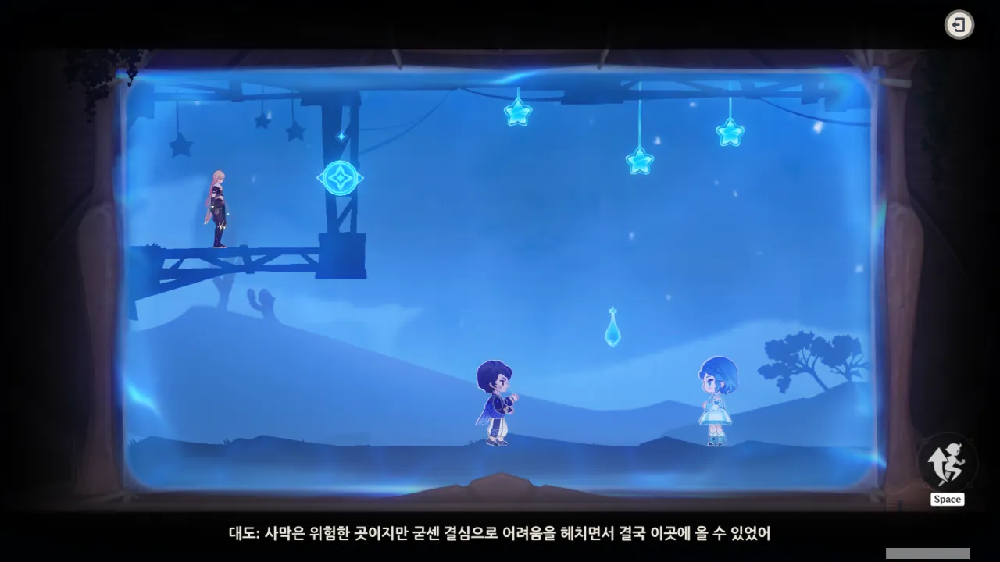
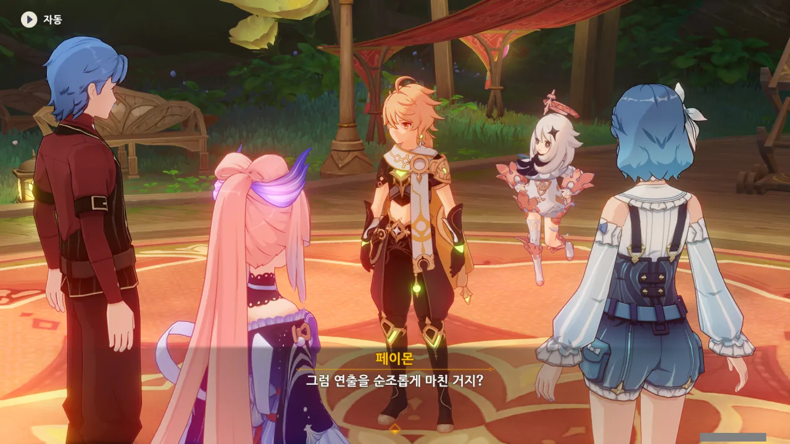
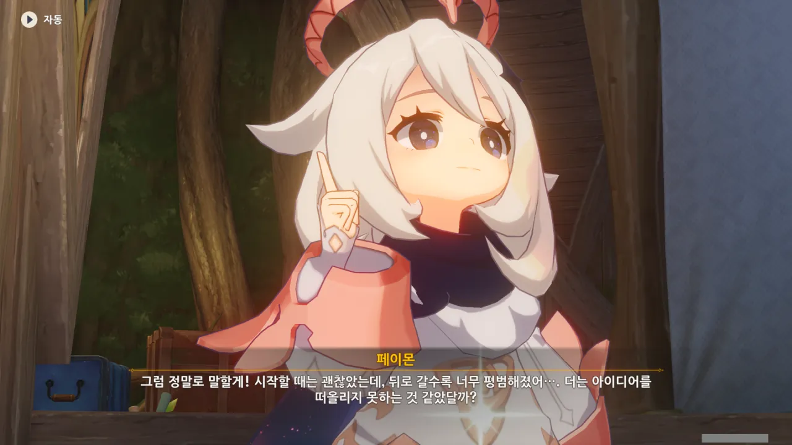
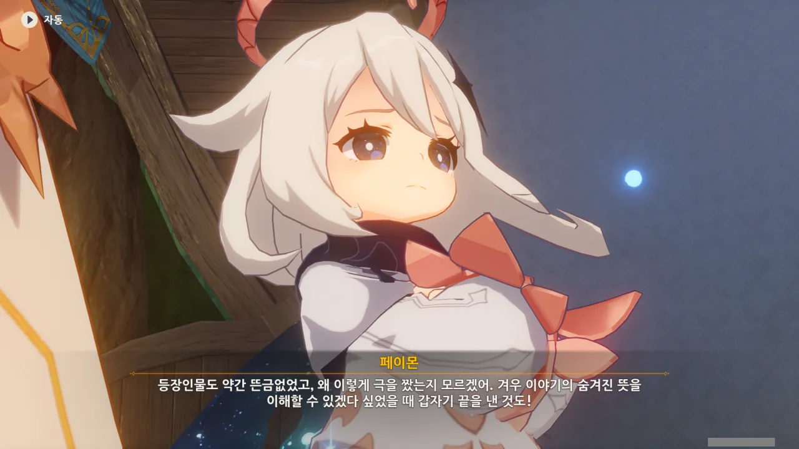
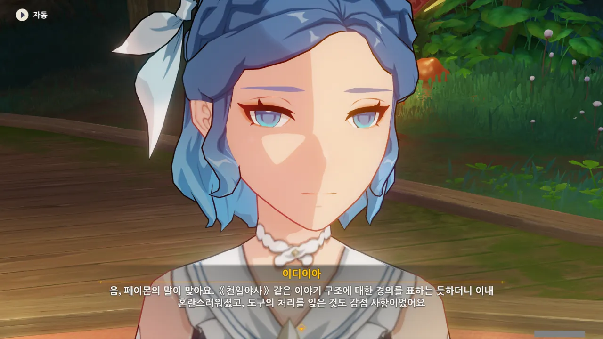
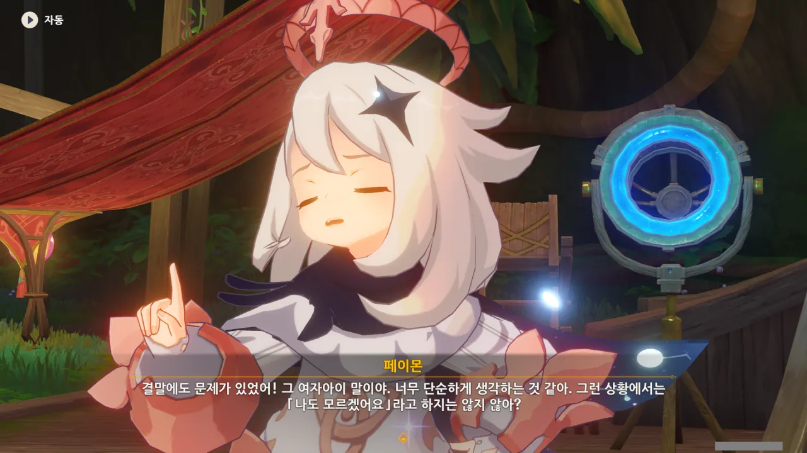
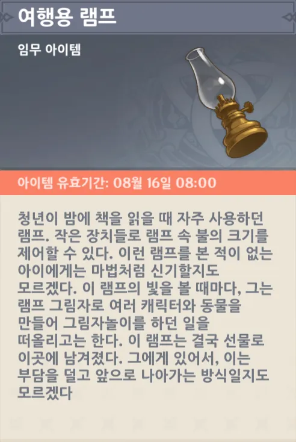

무대 앞에는 영사기가 놓여 있고, 그 뒤에 조시모스가 서있는 것이 보인다.





조시모스가 심혈을 기울여 설계했다는 무대는 꽤 멋들어졌다. 아마 이 무대를 그대로 바자르에 가져다 놓아도 꽤 어울릴걸?



조시모스가 무대 위의 모든 걸 관리한다고 했을 때 '혹시...?'라고 생각했던 게 정말이었네.

조시모스는 감독 역할 외에도 각본, 무대 담당 등 연극에 필요한 모든 역할을 혼자 맡고 있었다.

감독이 각본 역시 맡는 경우가 종종 있긴 하지만, 다른 역할까지 전부 혼자 할 줄이야...





그런 조시모스의 연극을 봐주는 건 이디이아밖에 없다. 그래도 성의 없이 보기만 하진 않고, 이런저런 비평도 같이 곁들어준다고 한다.

그런데 이디이아가 조시모스의 연극을 보고 '무슨 내용인지 모르겠다', '뜬금없다'라는 반응을 했다는데... 조금 불안해진다.





조시모스는 어릴 적부터 감독이 되는 것이 꿈이었으나, 손재주만 좋아서 결국 소품 관리나 무대 세팅과 관련된 일만 했다고 한다.

그러다가 이 신기루 비경에 들어와, 처음으로 꿈에 그리던 감독 역할을 할 수 있게 된 것이다.







아, 아까 조시모스가 그렇게 빨리 대본을 완성해 나눠줄 수 있었던 건, 모든 배우에게 총대본을 주지 않고, 각자 맡은 역할에 해당하는 부분만 줘서 그런 것으로 보인다. 총대본을 여러 부 인쇄하는 것보다, 총대본을 한 부 만들어서 각자에게 나눠주는 게 더 빠르지...

그런데 이번에 무대를 점검하던 중, 그 총대본을 잃어버렸다고 한다. 조시모스는 무대를 마저 점검하느라 바쁘니, 여행자가 조시모스 대신 총대본을 찾게 되었다.



"꾸륵?"이라고? 물의 환령이 여기에 있다는 건... 설마 여기도 퍼즐이 있다는 건가?



다행스럽게도, 퍼즐은 없었다. 그저 물의 환령이 조시모스의 대본을 관리하고 있었던 것뿐이었다.





대부분이 반쯤 쓰다 만 대본이다. 조시모스가 방금 완성했다던 이야기 역시 조금 전까지만 해도 여기 중에 섞여 있었을 것이다.

아무튼 최근 완성된 대본은 딱 하나밖에 없으므로, 그냥 이걸 조시모스에게 가져다주기로 했다.



연극 시간이 거의 다 되었지만, 아직 무대를 최적의 상태로 복구하지 못한 조시모스.





"연출이란 건 그 자체로 우연이니까"라는 이해할 수 없는 궤변으로 자기 합리화를 시도하는 조시모스. 하지만 여행자를 설득하진 못했다.



조시모스의 연극은 구상도를 이용한 연극이라고 한다.



구상도는 평면의 것을 현실에 투영해 물건을 만들지만, 조시모스는 반대로 물건을 구상도에 투영해 연극을 만든다. 음... 그림자 연극 같은 것이라고 보면 되겠지?

원래 사용 목적과 정반대로 쓰인 영사기. 그걸 보고 이디이아는 원래 생각했던 것과는 다르지만, 그래도 조시모스가 좋다면 받아들일 수 있다고 말했다고 한다.

이디이아는 정말 좋은 사람이라니까... 너무 소심해서 그렇지.



조시모스가 여행자에게 구상도 안으로 들어가 달라고 한 이유는 본인이 만든 연극을 직접 보고 싶어서였다.

그도 그럴 것이, 이디이아에게 연극을 보여주려면 조시모스는 구상도 안에 들어가 각종 장치를 조작해 연출을 해야 하니, 자신의 연극이 다른 사람에게 어떻게 보이는지 알 수 없는 것이다.





자기 작품을 직접 두 눈으로 보고 싶다는데 별 수 있나. 도와줘야지.

곧바로 연극이 시작된다.

***



시작부터 뭔가 삐걱대는 연극. 케이아가 마이크가 아니라 정면을 보고 말해, 소리가 작게 나온 모양이다.



신기루 비경에서도 도둑 역할을 맡은 케이아는 연극에서도 도둑 역할을 맡게 되었다.

의적도 일단은 도둑이잖아.



여행자가 구상도 안으로 들어간 이유가 바로 여기에 있었다. 연출을 위해서는 누군가가 장치를 움직여야 한다.





연극을 보고 있는 사람들은 대충 중간 밑 부분만 보고 있는 거겠지?

대사가 너무 오글거린다고 생각되지만, 연극이니까...



중간에 있는 발판을 먼저 내린 후, 별이 매달려있는 발판 위에 올라서면 된다.









갑자기 극중극이 시작된다.

초보 작가가 쓰는 이야기는 이야기가 대개 선형적으로 흘러감을 생각해 보면, 이 이야기는 조시모스가 절대 대충 쓴 이야기가 아님을 알 수 있다.





가시를 먼저 치우고 싶었는데, 가시가 활성화되는 때에만 누를 수 있었다.



가시를 치우는 일은 매우 순조롭게 진행되고 있다. 이야기의 흐름에 따라 가시를 치워야 하니, 좀 답답하긴 하지만...





가시를 치워야 하는데, 정작 가시를 움직일 수 있는 장치가 보이지 않는다.

이래서 아까 여행자에게 구상도 안으로 들어가 달라고 한 거였나...



이래서는 연극을 더 이상 진행할 수 없다.



클레가 통통 폭탄으로 가시를 태워버렸다. 슈퍼 굿잡!





아니 ㅋㅋㅋ 내레이션을 하다 말고 TMI를 풀면 어떻게 해 ㅋㅋㅋ



아니, 극중극 속에 또 극중극이라고? 이건 보기 드문 형태인데. 천일야화가 이렇게 엄청나게 중첩된 액자식 구성을 채택했다.

세에라자드가 살아남기 위해서 풀어낸 이야기 속 등장인물들이 각자 자신의 이야기를 시작하고, 그 이야기 속 등장인물들이 또다시 자신의 이야기를 풀어내고, 매일 밤 이야기가 중간에 끊기는 탓에 '현실' 속 사람들의 이야기도 함께 풀어나가는 것이 바로 천일야화의 구성이다.

다만 이렇게 액자식 구성을 여러 번 중첩하면 독자들이 혼란에 빠진다. 천일야화가 그렇듯이, 듣는 사람이 '여긴 누구? 난 어디?'라고 하며 길을 헤맬 수 있거든.



오, 설마 저거 클레야?



클레가 마치 국어책 읽듯 대사를 읽고 있다.

'넌 전혀 연극하고 있지 않아'라고 하고 싶지만, 클레니까 참아야지.

> 하지만 소원을 이룰 수 있는 건 병 안에서 뿐이었다

이 부분의 설명에서 왜 이 신기루 비경이 연상되는 걸까?



이런 걸 인터랙티브 연극이라 해야 하나? 클레가 병에 바람을 불어넣자, 정말로 병에서 빛이 난다.





몰?루

여자아이의 대사가 너무 성의가 없어 보이는데...





뭐야, 그러면 병에 담긴 '소원 성취권'은 결국 사기였던 거야?

여자아이는 분명 아무도 찾아올 수 없는 곳을 원했는데, 대도가 그곳으로 찾아왔지 않았는가.

아, 그러니까 집념, 끈기 뭐 이런 거로 돌파했단 이야긴가.

정교한 톱니바퀴로 이루어진 기계에서 톱니바퀴가 하나하나 떨어져 나가며 기계가 고장 나는 걸 보는 느낌이다. 뭐라 콕 집어서 말할 수는 없지만, 이야기가 이상해...







또 몰?루

여자아이가 너무 '몰?루'만 해대는데, 이게 과연 맞는 건가 싶다.





아니, 이야기가 여기서 이렇게 끝나버린다고? 이거 맞아, 조시모스?

중반부까지는 그럴듯했는데, 후반부로 가니 갑자기 이야기가 바람 빠진 풍선처럼 쪼그라들더니 급전개를 탈 새도 없이 끝나버렸다.

이디이아의 안목이 정확했네!

***

아무튼, 잘 가다가 중간 즈음에서 나사가 빠진, 이상한 연극이 끝났다.

연출 자체는 그럭저럭 순조로웠다. 중간에 가시를 치우는 장치 하나가 빠져서 클레가 가시를 태워버려야 했던 걸 빼면 말이다.



그런데 갑자기 클레가 연극에서 쓰인 마녀 복장을 입고 나타났다.

와! 귀여워! 사랑스러워! 이뻐! 격렬하게 쓰다듬어주고 싶어!





클레가 조시모스를 '감독 오빠'라고 불러준다.



감독으로 불려본 것은 이번이 처음인지, 조시모스가 감격의 도가니에 빠져버렸다.





클레가 지금 입고 있는 저 마녀 복장은 조시모스가 직접 도안을 그리고 만들었다고 한다. 그리고 그걸 이디이아가 조금 손봐서 클레가 입을 수 있도록 조정한 것이고.

조시모스가 직접 옷의 도안을 그리고 만든 것도 대단하고, 그걸 클레가 입을 수 있도록 개조한 이디이아도 대단하다.



이디이아는 칭찬을 듣더니 쑥스러워하며 얼굴을 붉힌 채 호다닥 도망간다.

저 봐라. 총총걸음으로 달리면서도 입가와 눈가에 웃음이 사라지질 않는다.



옛날엔 낮은 자존감 때문에 어디 구석에 처박혀서 울었다면, 이번에는 쑥스러워서 어디 구석에 처박혀 우는 건가?



자신의 연출에 굉장한 자신감을 드러내는 조시모스. 아, 그런 거라면 내가 또 해줄 말이 아주 많이 있지...

마녀가 여자아이에게 빛나는 병을 준 부분까지는 나쁘지 않았지만, '몰?루'가 나온 이후부턴 마치 이야기에 바람이 빠진 것처럼 급격하게 질이 떨어졌다.

뭐랄까, 요리를 하다 만 것처럼, 편지를 쓰다 만 것처럼, 말을 하다 만 것처럼... 딱 그런 느낌이었다.

분명 「군사」 코코미를 보고 영감을 얻어 여주인공을 추가했다고 했지만, 지금까지 본 바에 따르면, 여주인공은 굳이 없어도 상관없었을 것 같다.

아니, 있던 없던 똑같이 이야기에 맥이 없다. 마치 기승전결에서 꼴랑 기 부분만 던져준 것 같다고.

이디이아 역시 천일야화 이야기를 꺼낸다. 중첩 액자식 구조를 써놓고 그 뒤처리를 너무 대강으로 했다.



아 ㅋㅋㅋ 비평은 참을 수 없지 ㅋㅋㅋ

나도 연극을 보면서 속에서 뭔가가 부글부글 끓었는데, 이디이아 역시 그랬겠지.



이야기가 해피엔딩으로 끝난 것 하나만큼은 좋았다고 평가하는 이디이아. 그래도 난 이야기의 중반까지는 괜찮다고 생각했는데, 이디이아는 엔딩 하나만 좋았다고 이야기하니, 이디이아가 더 혹평을 내린 셈이다.

그런데 이게 본격적으로 시작하지도 않은 거라고? 두렵다, 이디이아!



코코미가 이디이아를 불러, 이디이아가 잠시 자리를 비운다. 대체 무대 뒤에서 뭘 하고 있는 거지?



아무튼, 비평은 계속된다.

그래도 여러 혹평 속에서도 꿋꿋이 계속 비평을 듣겠다는 걸 보면, 조시모스 역시 마음을 단단히 먹은 모양이다.

그래, 그래. 맞아, 맞아. 계속 여자아이가 '몰?루'만 말하니, '대체 얘는 생각이 있는 거야, 없는 거야?'라는 생각만 들더라고.



그래도 직접 무대를 보며 많은 것을 배웠다고 하는 조시모스.



뭐, 그럼 그렇지. 본인도 자기 연극을 보며 '이건 좀 아닌데'라고 생각했을게 뻔하다.



아무리 급하게 만든 대본이어도 그렇지, 기승전결은 좀 지켜야 할 거 아냐. 이야기의 기본이 안되어 있잖아...

아까도 말했다시피, 이 이야기에는 기승전결에서 오직 '기'만 존재한다.





> 침대에 누워서 상상을 펼치던 남자아이와 지금의 나는 본질적으로 똑같은 즐거움을 얻었다

오... 이거 꽤 괜찮은 표현인걸.



조시모스가 준 코어 휠 부품은 다름 아닌 유리 램프였다.

밧줄에 사탕 상자에 유리 램프... 난 이미 코어 휠이 대체 어떻게 돌아가는 건지 이해하길 포기했다. 동심이나, 뭐 그런 거로 돌아가는 거겠지.



병에 빛이 나는 이유는 병 안에 보이지 않는 작은 요정이 빛을 내기 때문이라고 생각하는 클레.



그걸 본 조시모스는 잠시 고민하다, 클레의 동심을 지켜주기로 결심한다.



대체 코코미와 이디이아는 케이아를 갖고 뭘 하고 있는 거야?





이디이아가 조시모스의 감독을 향한 꿈을 처음 들은 사람으로서 조시모스를 위해 뭔가를 해준다고 한다.

그 와중에 주제가 자신으로 변하자 당황스러워하는 이디이아. ㅋㅋㅋㅋㅋㅋ



오, 설마 케이아가 입은 옷이 연극 속 대도의 옷인 거야?



클레 말대로 케이아가 정말 대도가 되어버렸다.





조시모스가 그려놓은 무대 의상 도안과 샘플 의상을 이용해 케이아의 의상을 완성했다고 한다.



얼마나 감동을 받은 건지, 조시모스는 감동을 못 이겨 흐느꼈다.

상상으로만 생각해 왔던 등장인물이 '종이를 찢고' 현실에 나올 정도면, 뭐 그럴 수 있지.



조시모스의 연극도 다 끝났으니, 이제 코어 휠로 가서 신기루를 복구할 시간이다.





조시모스가 두 사람에게 무대 의상을 선물한다.





좋아, 이제 코어 휠을 수리하러 갈 시간이다.

이번에도 역시 코어 휠 부품이 배낭에 들어왔다.
