신기루 비경에 처음 들어왔을 때, 만질까 말까 고민했던 바로 그 장치가 이번의 목적지였다.



유라와 콜레이가 먼저 와 기다리고 있었다. 이디이아가 물의 환령을 통해 이들에게 먼저 소식을 전해준 덕분이었다.





안타깝게도 레시그는 고된 노동을 계속한 탓에, 지금은 방에서 아주 곯아떨어졌다고 한다.

이런 중요한 장면은 레시그도 같이 봤으면 좋았을 텐데... 조금 아쉽다.





이 비경, 「유리빛 신기루」의 코어는 가장 큰 「흐름 영사기」라고 한다. 그리고 신기루는 가장 거대한 「구상도」라고 하고.

영사기의 작동 방식이 '구상도를 현실에 투영시켜 물체를 구현하는 것'임을 생각하니, 뭔가 묘하게 신기한 기분이 든다.



우리가 구상도 퍼즐을 한두 번 푼 것이 아니지 않은가. 영사기가 나왔으니 퍼즐이 나오리란 것 역시 진작에 눈치채고 있었다.



그러면 이제 구상도를 복구할 시간이다. 복구 시작!





코어 휠 복구를 위해서는 지금껏 모아 왔던 부품들을 적당히 모양에 맞춰 넣으면 된다고 한다.

대충 해도 된다고 하는 이디이아의 말을 들으니, 옛날 이벤트에서 풀었던 그림자 퍼즐이 떠오른다. 최종 모양은 대충 짐작이 갔지만, 그림자가 그 모양이 되도록 모형을 회전시키는 게 정말 힘들었다.

&nbsp;

퍼즐을 풀기 전, 다른 캐릭터들과 대화가 가능했다.

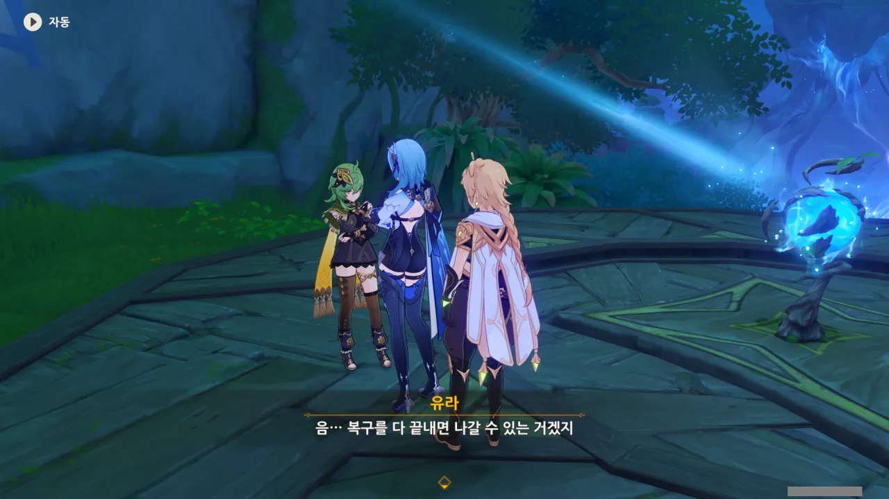

유라는 한시라도 빨리 여기서 나가고 싶은 모양이다.

뭐, 유라의 원래 목적은 여행이나 휴가가 아니라, 레시그를 찾아 몬드로 돌아가는 것이었으니까, 그럴 만도 하다.







다른 NPC들에게선 물건의 배치에 대한 힌트를 들을 수 있었다.

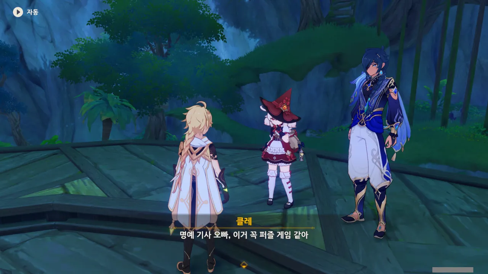

이거 퍼즐 게임 맞아. 아마도...

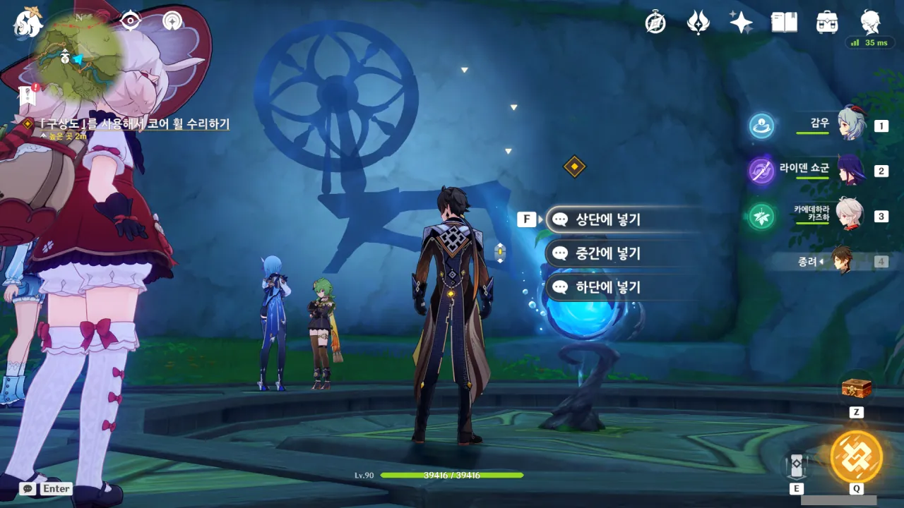

그런데 힌트를 들어도 뭘 어떻게 넣어야 할지 잘 모르겠더라. 그래서 그냥 대충 느낌이 오는 대로 넣었다. 뭐, 여섯 가지의 경우 중 하나이지 않겠는가.

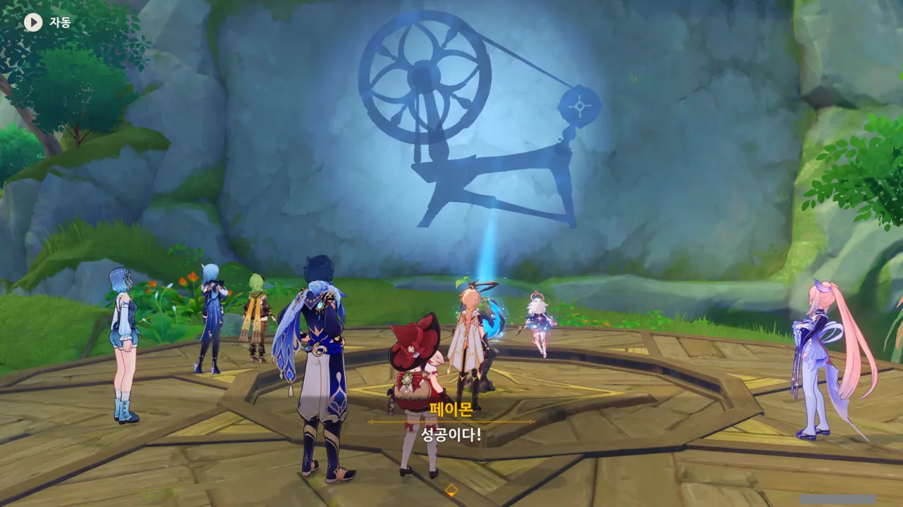

어찌어찌하여 결국 성공했다.

이렇게 보니 무슨 물레처럼 생겼다. 영사기라고 해도 좋고.



이디이아의 말에 따르면, 코어 휠이 모두 복구되었으니, 나중에 코어 휠이 원래대로 다시 돌아갈 거라고 한다.

> 흠? 이디이아 씨의 능력이면 지금 당장이라도 돌아가게 할 수 있을 줄 알았는데요.

갑자기 폭탄 발언을 하는 케이아. 아... 설마 여기서 그 떡밥이 풀리는 건가?



케이아의 말을 듣고 당황해하는 이디이아.



> 신기루의 원래 모습이든, 이디이아 씨가 꼭꼭 숨기고 있는 아름다운 모습이든, 모두 기대되네요.

응응, 이건 결론이 났네.

내 장담컨대, 이디이아의 진짜 정체는 물의 환령과 비슷한 부류의 무언가일 것이다. 물의 환령은 아닐 것 같고.

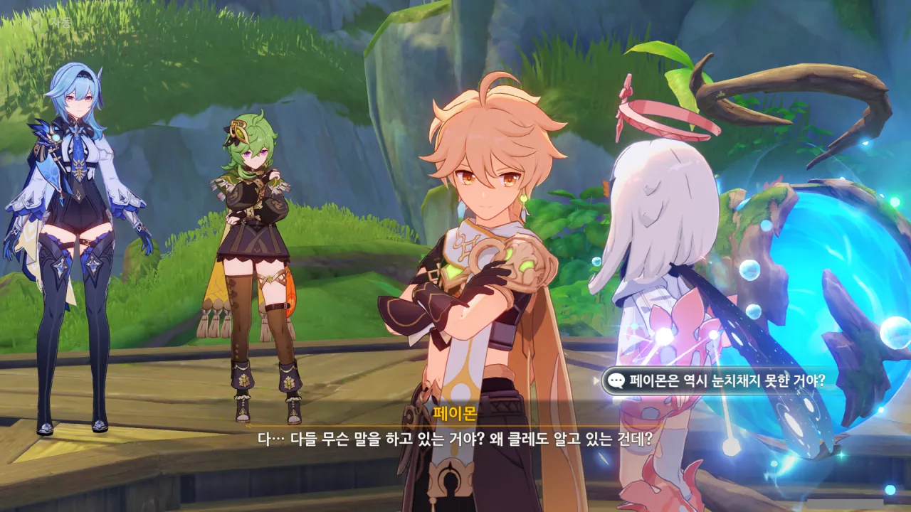

아무래도 페이몬을 제외한 모두가 이디이아의 정체에 대해 어느 정도 눈치챈 모양이다.





코코미가 제일 먼저 이디이아의 정체를 눈치챘고, 그다음은 유라 혹은 케이아였던 모양이다.

콜레이는 유라와 대화하다가 이디이아의 정체에 대해 눈치채게 되었고 말이다.



당연히 일부러 속일 의도가 아니었겠지, 뭐... 하지만 보이는 NPC들이 죄다 푸른 머리에 푸른 눈을 갖고 있으면 자연스럽게 의심하게 되지 않을까?





신의 눈을 갖고 있지 않지만 물 원소의 힘이 느껴지는 NPC들을 보며, 물의 환령은 여러 모습으로 변할 수 있으니, 저 NPC들은 물의 환령이 변신한 게 아닐까 하고 추측한 코코미.



> 전 옛 물의 신께서 돌아가실 때 이곳으로 도망쳐온 물의 정령, 이디이아예요.

이디이아의 정체는 물의 정령이었다. 아니, 이걸 내가 정말 맞췄다고?

&nbsp;

지금 물의 신은 예전 물의 신이 죽은 이후 집정관 자리에 오른 인물이라고 알고 있다. 로데이아가 리월 경책산장으로 도망쳐온 것도 새로운 물의 신이 싫어서였고 말이다.

음... 다음 버전에서 폰타인 지역이 나오니, 이번 이벤트는 폰타인을 어느 정도 소개하는 역할도 겸했던 건가?





클레와 유라가 이디이아의 지금 모습이 예쁘다고 하자, 이디이아가 굉장히 부끄러워한다.



> 아마 그 「물의 주민」들의 「원형」은 이미 이곳에 없는 거겠죠?

응? 원형? 케이아가 갑자기 저 말을 하니, '사실 이 비경에 들어온 사람들은 다시는 비경 밖으로 나가지 못했고, 죽어서도 유령 비슷한 것이 되어 「물의 주민」으로서 영원토록 이 비경에서 살게 되었다' 같은 불길한 상상이 떠오른다.



다행스럽게도 이 이야기는 그런 깊고 어두운 이야기가 아니었다.

여기 있는 「물의 주민」들의 원형은 이미 각자 갈 길을 찾아 이 비경을 나갔다고 한다.

그리고 그들이 남긴 선물이 코어 휠의 부품이 되었다.





> 정말 눈부신 빛이네요.

음? 이 대사, 아까 조시모스의 연극에서 나왔던 대사 아냐?

설마 그 연극에서 나왔던 '소원을 이루어주는 병'은 정말로 이 비경에 대한 이야기였던 거야?



코어 휠의 부품 역시 우리가 생각했던 것과 정반대의 순서였다.

처음에는 「물의 주민」들이 운영하던 구역에 코어 휠의 부품이 떨어졌다고 생각했다. 하지만 사실, 코어 휠의 부품이 떨어지자, 그 근처에 「물의 주민」과 그들이 운영하는 구역이 생겨난 것이었다.

그러니까 우리가 여태 만났던 퍼디낸드 형제, 메이몬, 조시모스는 전부 코어 휠의 부품에 의해 구현된 것이란 것이다.

&nbsp;

뭔가 무서운데...



그렇다면 우리가 코어 휠의 부품을 회수했으니, 그들이 다시 사라지는 게 아닐까 했지만, 이디이아는 우리가 그들을 기억하는 한, 그들은 사라지지 않을 거라고 한다.

&nbsp;

자꾸만 무서운 방향으로 상상의 나래가 펼쳐진다.

우리가 본 「물의 주민」들은 실제로 여기 방문했던 사람들의 마음을 비춘 것이다. 그렇다면 지금 그들이 하는 모든 생각과 행동은 그저 과거의 메아리일 뿐이 아닐까?

고개를 저어, 이 모든 무서운 상상을 애써 떨쳐내 본다.



모두에게 있어, 이번 여행이 잊을 수 없는 것이 된 것만은 정말 확실해 보인다.



이디이아가 이제 정말 코어 휠을 다시 회전시키려 한다.



... 응? 왜 코어 휠이 다시 돌아가지 않는 거지? 난 지금 컷신을 애타게 기다리고 있는데.





결과적으로 허풍을 친 게 되어버린 이디이아는 처음 만났을 때처럼 또다시 100년 동안 숨어있을 병을 찾는다.

하지만 따져보면 이미 이디이아는 병 안에 있잖아. 이 비경 자체가 병 안에 있는 비경이니까.

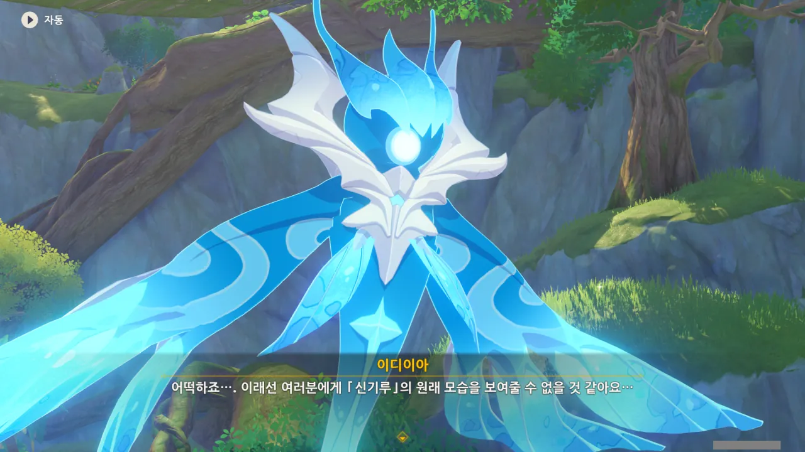

이대로 신기루 비경의 복원은 물 건너가는 걸까?



코코미에게 뭔가 생각이 있는 것 같다.



「신기루 옥갑」? 코코미가 그걸 찾기 위해 이 비경에 들어왔다고 했었는데.

설마 이 비경의 핵이 그 「신기루 옥갑」이었던 걸까?



이디이아가 건네준 「신기루 옥갑」은 와타츠미섬의 유물답게, 조개 모양이었다.

와타츠미섬 하면 제일 먼저 떠오르는 산호궁과 그 주변 지형 모두가 조개를 닮았었다.



과거 와타츠미섬 모운 신사에 모셔져 있던 「신기루 옥갑」은 「신기루」라는 이름의 요괴가 남긴 껍데기로 만든 것이라고 한다. 그 때문인지 이 유물은 사람들의 소원을 듣고 신기를 모을 수 있는 능력이 있다.

하지만 수백 년 전 최후의 야시오리 수호자가 「신기루 옥갑」을 갖고 출정을 나갔다가 실종된 탓에 행방을 알 수 없게 되었다고 한다. 이 유물이 어떤 연유로 이 비경에 흘러들어온 것인진 모르지만, 지금은 비경의 코어를 이루는 물건이 된 모양이다.

&nbsp;

코코미가 갖고 있는 구슬은 옥갑의 존재를 느낄 수 있는 유물인데, 옥갑의 존재를 감지하지 못하자 빛을 잃고 있었다가 최근이 돼서야 다시 빛을 되찾았다고 한다.



구슬이 왜 빛을 잃은 것인지 이해하지 못한 클레에게 케이아가 '소리를 깊은 방 안에 가두면 밖에선 잘 안 들린다'라고 비유하며 설명해 준다.

그리고 '깊은 방'에서 감금실을 연상한 클레는 '조개가 노는 걸 너무 좋아해서 감금실에 갇혔다'라고 엉뚱하게 이해해 버렸다.

어... 완전히 틀린 말은 아닌데... ㅋㅋㅋ...



신기루 비경의 코어가 약해진 탓에 옥갑의 신호를 다시 잡게 된 코코미의 구슬이 다시 빛을 발하게 되었고, 코코미는 그 신호를 따라 신기루 비경에 들어오게 된 것이었다.

이거 완전 보물찾기 나침반 아냐? ㅋㅋㅋ



본디라면 신사를 떠났기 때문에 빠르게 영기를 잃었어야 할 옥갑이지만, 이 비경 안에서 수많은 사람들의 소원과 선물을 '공물'로서 '공양'받은 덕분에 그 영기를 여태껏 유지할 수 있었다고 한다.

어찌 보면 모운 신사에 그대로 방치되는 것보다 나은 보관 방법이 된 셈이다.





옥갑에 쌓인 신기를 이용해 소원을 빌어, 신기루 비경을 복구할 수 있을 것이라고 한다.



옥갑을 어떻게 이용해야 할지 모르는 이디이아에게 자신의 소원을 예시로 들어보는 코코미.

코코미의 소원은 자신의 결정으로 인해 와타츠미섬의 사람들과, 자신이 소중히 여기는 사람들이 조금이나마 더 행복하게 사는 것이라고 한다.



막상 자신의 소원을 묻자 당황해하는 이디이아.





이디이아의 소원은 여태껏 신기루 비경에 왔던 여행자들이 신기루 밖에서도 그들의 소원을 이뤘으면 하는 것이었다.

그들의 소원은 이 신기루 비경에서나마 이뤄질 수 있는, 비현실적이거나 무척 힘든 것임을 알지만, 그럼에도 불구하고 그들의 소원이 이뤄지길 바라는 것이다.



코코미가 옥갑 안에 담긴 꿈과 소원의 힘을 이디이아에게 맡긴다.





만남이 있으면 헤어짐도 있는 법. 이디이아가 지금껏 만났던 사람들 역시 결국 이디이아와 헤어져 자신이 가야 할 길로 떠났다.

그리고 그 뒤에는 이디이아 혼자만이 남겨졌다.





'꿈과 소원의 힘'이 곳곳에서 모여, 코어 휠을 다시 돌리기 시작한다.





그리고 그 모습을 '사람들의 꿈'이 지켜본다.



이렇게 보니 이제야 코어 휠의 모습이 아까 영사기에서 봤던 물레 모습과 닮아 보인다.



아, 클레 참 귀여워라.



다시 돌아와 보니, 이디이아가 물의 정령의 모습이 아니라, 처음 만났던 그 모습으로 우릴 맞아준다.

아까 사람들의 칭찬에 도취되어 낯부끄러운 말을 잔뜩 해버렸다며 부끄러워해하는 이디이아.





하지만 자신의 행복이 아닌 타인의 행복을 바란 것만으로도 이미 이디이아는 훌륭하다고 할 수 있다. 그러기가 보통 쉬운 게 아니거든.



이디이아가 얼마나 좋은 사람인지 각 구역의 주민들이 몸소 증명해주지 않았던가? 그러니까 이디이아가 좀 자존심을 회복했으면 좋겠다.

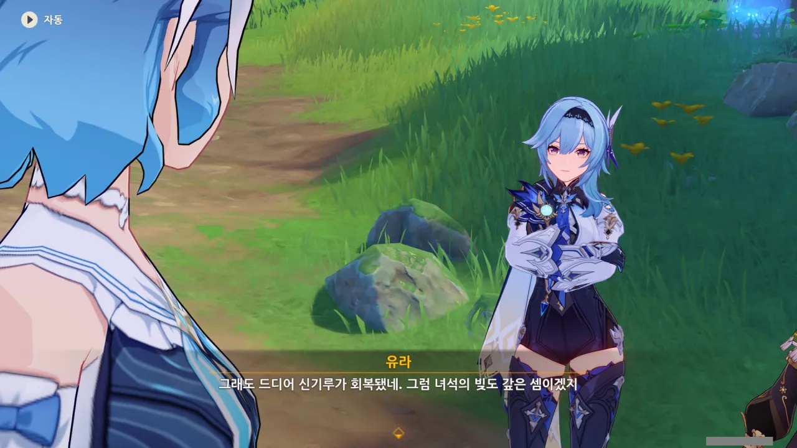

'녀석'은 분명 레시그를 말하는 거겠지.

레시그가 코어 휠을 실수로 망가트려 생긴 일들을 모두 해결했으니, 유라 말처럼 빚은 모두 갚은 셈이다.



클레는 슝슝열차도 타고 싶고, 커다란 관람차도 타보고 싶다고 한다.

아, 맞다. 클레 일행은 클레와 함께 휴가를 즐기려고 여기 온 거였지, 참.



다만 관람차에는 무게 제한이라도 있는 건지, 탈 수 있는 사람의 명수가 제한되어 있다고 한다.

그리고 당연하다면 당연하달까, 여행자가 클레의 동행인으로 선정되었다.



관람차가 너무 높다고 불안해하는 페이몬. 야, 너 맨날 날고 있잖아...

설사 관람차에서 떨어지더라도 여행자는 바람의 날개를 쓰면 그만이다. 클레 정도면 안고 활강해도 괜찮겠지. 클레는 분명 가벼울 거니까!

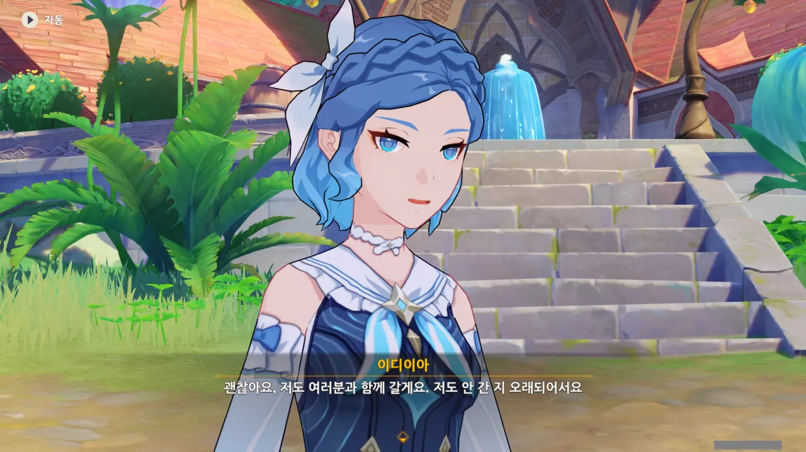

이디이아가 함께 한다고 하니, 안심이고 말이다. 물의 정령이니까 관람차에서 떨어지더라도 어떻게든 해주겠지!

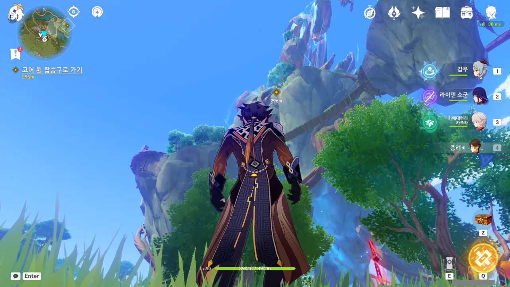

와, 근데 저기까지 가야 해? 저길 어떻게 올라가더라?

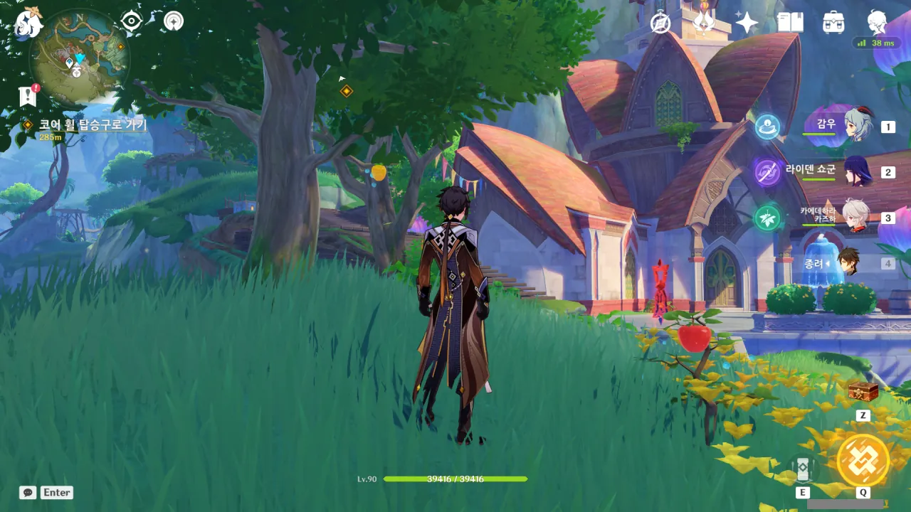

그런데 주변에 뭔가 이상한 것이 보인다. 왜 라즈베리 나무에 사과가 열리고, 사과나무에 라즈베리가 열리는 거지?

가까이 가보니 상호작용 프롬프트가 나타나는 것으로 보아, 물의 환령이 장난을 치는 것으로 보인다.

뭐랄까... 어이가 없다고 해야 할까, 어처구니가 없다고 해야 할까. 실소가 절로 나오는 모습이다. 귀엽네, 녀석들...

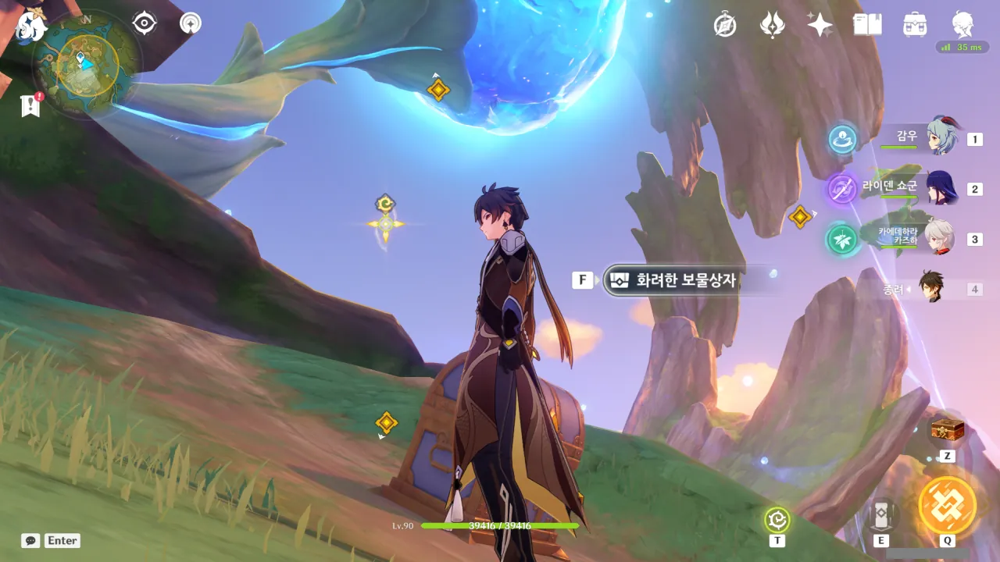

꼭대기까지는 워프 포인트가 있으니, 그걸 이용했다.

내 옆에 화려한 보물상자가 있지만, 원신 맵스 사이트에서 이벤트 상자 위치를 업데이트하기 전까진 단 하나의 상자도 열지 않을 생각이다. 이미 그런 식으로 지나쳐온 상자도 꽤 되고.

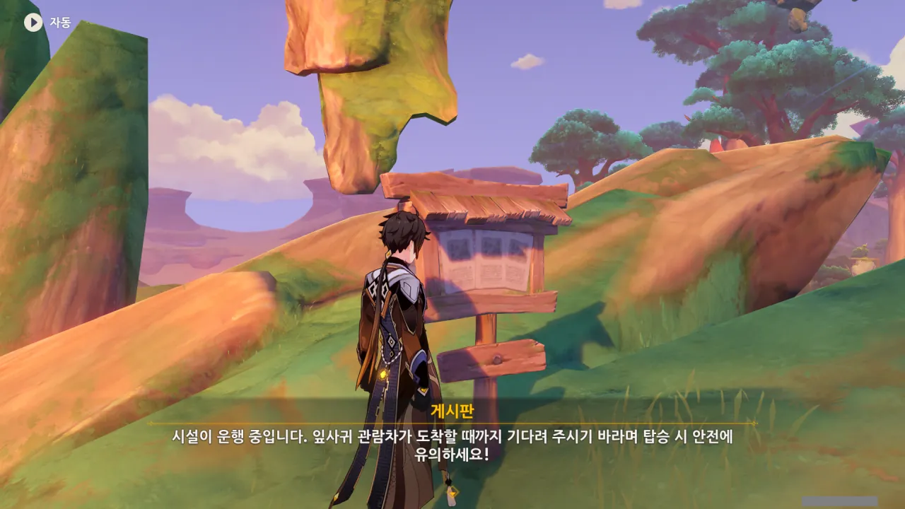

난 코어 휠 자체가 관람차 역할을 한다고 생각했는데, 관람차는 코어 휠 주변을 도는 커다란 원을 말하는 것이었다.

코어 휠은 말 그대로 관람차의 축 역할을 하고, 잎사귀 관람차는 그 주변을 뱅글뱅글 도는 것이다.

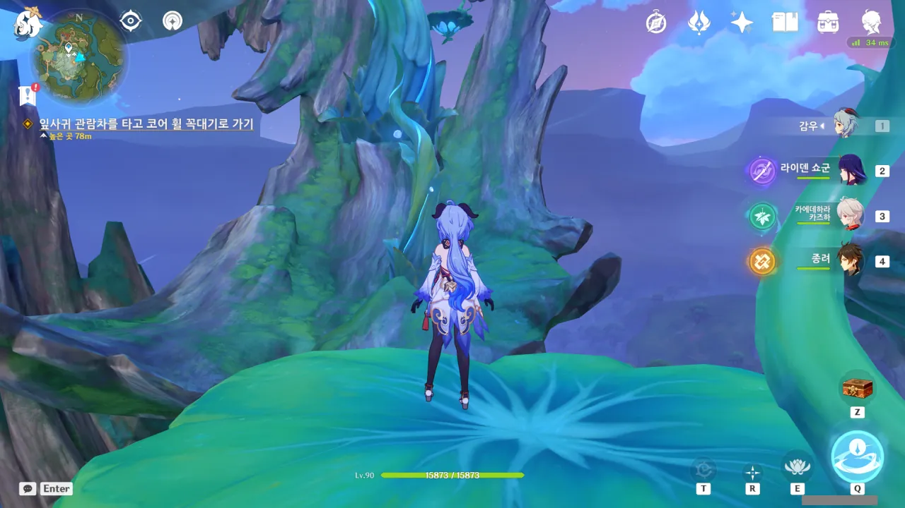

정확히 관람차 어디에 타야 할지 몰라서 몇 번이고 떨어진 끝에 겨우 잎사귀 잎에 탈 수 있었다.

저기 나무 부분은 올라설 수 없게 되어 있어서, 무조건 미끄러진다.



클레는 마음씨도 참 착하지. 케이아도 나중에 여기에 데려달라고 한다.

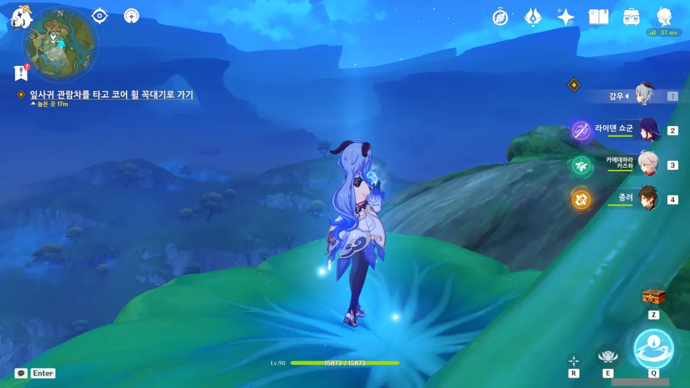

높은 곳에 올라오니 보이는 것이다만, 여기도 우림지대 바깥은 온통 사막이다.

이렇게 보니, 저번에 봤던 「영원의 오아시스」처럼, 여기도 사막 한가운데에 있는 오아시스처럼 느껴진다.

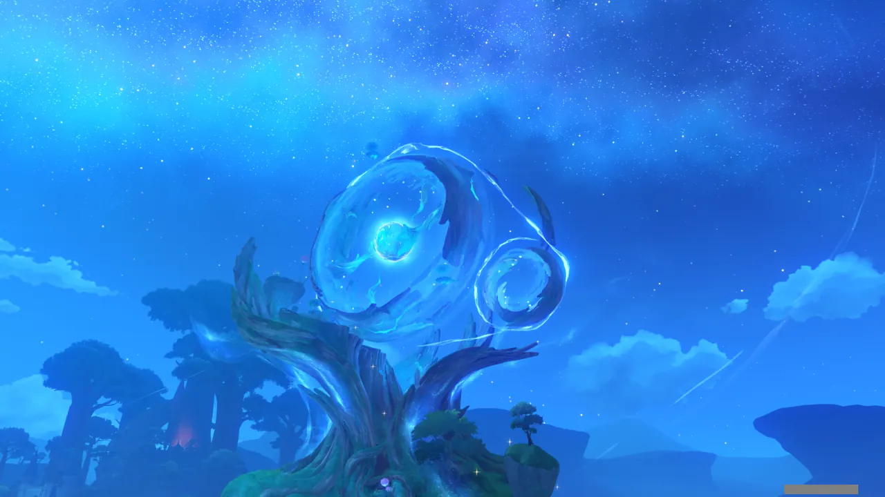

아, 정말 이쁘다.



이 비경에 들어온 여행자가 다시 세상 밖으로 여정을 떠날 때, 여행자를 배웅한 후 이디이아는 이곳에서 잠시 혼자 시간을 보내곤 했다고 한다.

사람들은 이곳에서 이런저런 것들을 만들며 즐거워했지만, 그걸 비경 밖으로 가지고 나갈 수 없다는 걸 알게 되면 미련을 가지거나 아쉬워하며 비경을 떠났다고 한다.



늘 그랬던 건 아니지만, 조금 전 봤던 것처럼 이디이아 역시 외로움을 느꼈구나.



자기가 만든 걸 전부 파괴하고 떠나는 사람도 있었구나. 이해가 되진 않지만...

&nbsp;

우리가 지금껏 보아온 푸른 머리와 푸른 눈의 주민들은 이 비경에 온 사람들이 비경을 떠날 때, 자신들의 꿈을 대신 보호할 「모형」을 만들어달라고 이디이아에게 부탁한 결과라고 한다.

이 주민들은 자신이 진짜가 아닌 「모형」 임을 알고 있을까?





'꿈의 종착지'... 뭔가 가슴 한편이 아련해지는 표현이다.



난 이 비경에 아무런 의미가 없다고 생각하지 않는다.

여기에서나마 자신의 소원을 이룬 사람들은 자신의 소원이 이루어진 모습을 눈에 담았을 것이다. 분명 그 모습은 비경 밖을 나가서도 꿈을 향해 걷는 원동력이 될 수 있을 것이다.



'그때의 앨리스 님의 은혜'라... 이디이아는 대체 앨리스에게서 어떤 도움을 받았던 걸까? 굉장히 궁금하네.

설마 앨리스가 이 비경을 만드는 데에 큰 도움을 준 걸까?

기왕 우림지대를 표현할 거면 지금처럼 외곽을 사막으로 설정할 것이 아니라, 지평선 너머까지 전부 우림지대로 만들었을 것 같은데...

어쩌면 온통 사막뿐이던 이 비경을 사막 속 우림지대로 만드는 데에 앨리스가 한몫했을 수도 있겠다. 바르바토스와 맞짱을 까려고 했을 정도로 강력한 앨리스이니, 불가능할 것도 없겠지.



아니, 하필 별명을 지어도 '흙물의 정령'이라니 ㅋㅋㅋㅋㅋㅋ 그건 별명이 아니라 멸칭 아냐?

그래도 그걸 잘 받아넘기는 이디이아의 모습은 예전보다 한층 더 밝아 보인다.



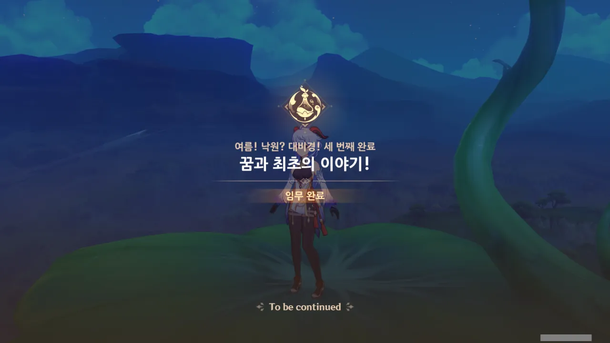

이렇게 「여름! 낙원? 대비경!」 이벤트의 스토리가 끝났다.
