「꿈과 최초의 이야기」를 끝으로 더 이상 남은 이벤트 스토리가 없을 줄 알았다. 그런데 필드에 널린 상자와 도전, 퍼즐을 풀고 다니던 중 페이몬이 이상한 소리를 하더라. 이디이아를 만나러 가자면서...

거기서 난 '아, 남은 이야기가 더 있구나'라는 것을 깨달아버렸다.

하지만 일단 상자와 도전, 퍼즐 먼저 좀 하고.

***

필드를 열심히 돌아다니던 중, 마을 근처에서 그동안 같이 돌아다녔던 캐릭터들을 발견했다.

보통 이런 부류의 이벤트가 있다면 이벤트 스토리가 끝난 후, 캐릭터들이 그냥 사라지는 것이 아니라 이런 식으로 필드 곳곳에 배치되어 일종의 작은 후일담 같은 것을 풀어놓기 마련이다.

일단 첫 타자는 레시그, 유라, 콜레이, 클레 이 넷이다.



콜레이가 사막에서 수메르성으로 가는 길을 알려주고 있다.



레시그가 너무 지나치게 밝아진 것 같다. 의욕이 넘치다 못해 흘러 쏟아지고 있다고 해야 할까...

그런 레시그에게 유라가 "선물 줄 사람이 뭐 그렇게 많다고..."라며 핀잔을 준다.

왜? 기왕 수메르에 온 김에 가족들에게 줄 기념 선물 정도는 사갈 수 있잖아.

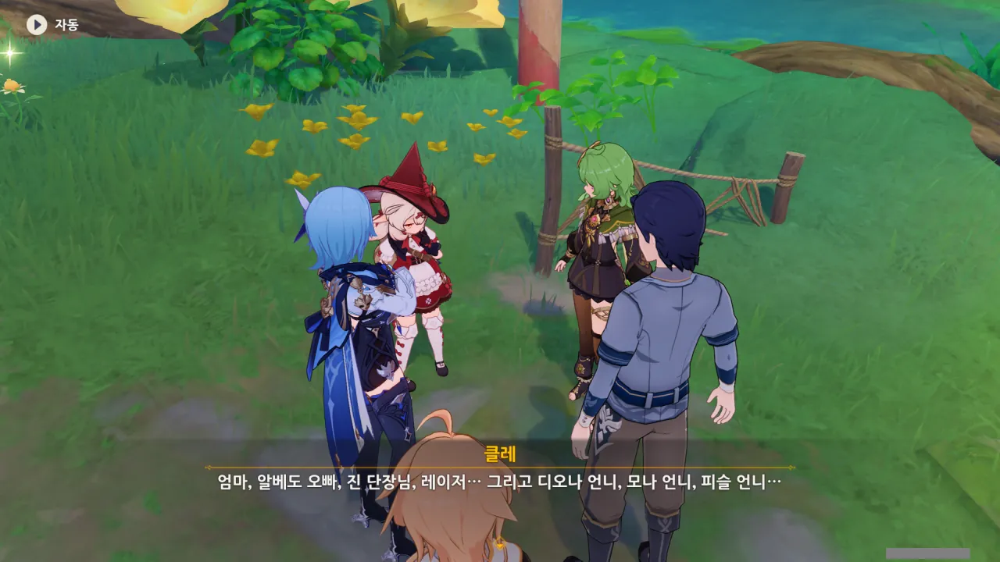

클레는 선물을 줄 사람이 아주 많다. 앨리스, 알베도, 진, 레이저, 디오나, 모나, 피슬 등등...



콜레이가 유라를 빤히 쳐다본 이유는 분명 '혹시 넌 선물을 줄 친구가 없니?'라고 묻는 것임이 분명하다.

유라도 선물을 사줄 사람이 없는 건 아니지. 앰버가 있잖아.



일몰 열매가 그렇게 달콤하던가? 일몰 열매의 맛이 어떤지 서술하는 걸 몇 번 본 것 같긴 하지만, 잘 기억나지 않는다. 직접 오감으로 체험하는 것과 글로 전해만 듣는 것에는 큰 차이가 있으니, 당연한 일이겠지만.

클레는 사고 싶은 것이 굉장히 많다. 방금 레시그가 다 산다고 했는데, 잘못하면 레시그의 등골이 빠질지도 모르겠다. 너무 많은 선물을 지고 옮기느라 등골이 빠질 수도 있고, 너무 많은 선물을 사서 등골이 빠질 수도 있겠네.



하지만 앨리스에게 줄 선물은 아직 결정하지 못했다. 그래도 유라나 콜레이가 있으니까 셋이 함께라면 앨리스에게 줄 선물을 잘 고를 수 있겠지.

그런데 앨리스는 클레를 보러 몬드에 오긴 하는 걸까? 앨리스의 목소리를 들은 적은 많지만, 항상 앨리스가 남긴 편지나 장치 등을 통해 듣는 게 전부였던 것 같은데.

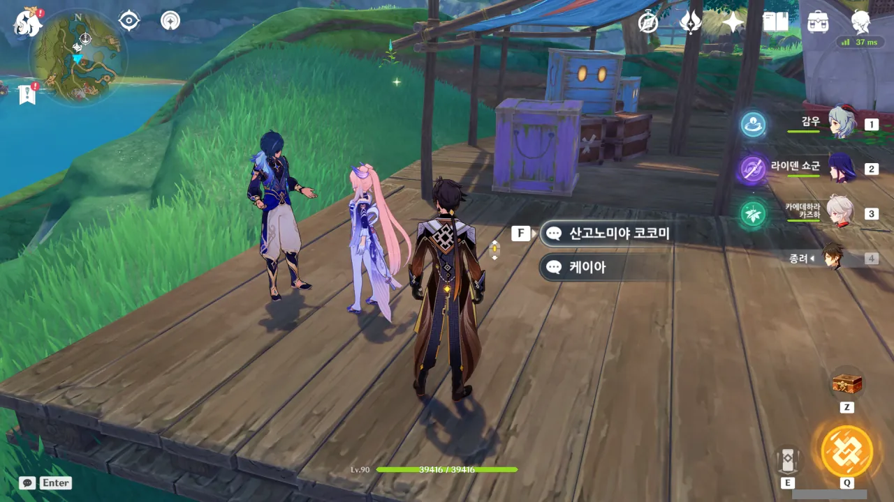

다음은 케이아와 코코미.





코코미의 본래 목적은 「신기루 옥갑」을 회수해 와타츠미섬으로 가져가는 것이었지만, 이번 일을 겪은 후, 유물이 지금껏 하던 대로 이 신기루 비경을 수호하며 여행자들의 꿈과 함께 하는 것이 더 좋을 것 같다는 결론을 내렸다.

뭐, 와타츠미섬에 다시 모셔봤자 옥갑이 지금처럼 사람들의 소원을 잘 모으진 못할 테니, 합당한 선택이다.

게다가 와타츠미섬에는 새로운 「보물」도 있지 않은가.

***

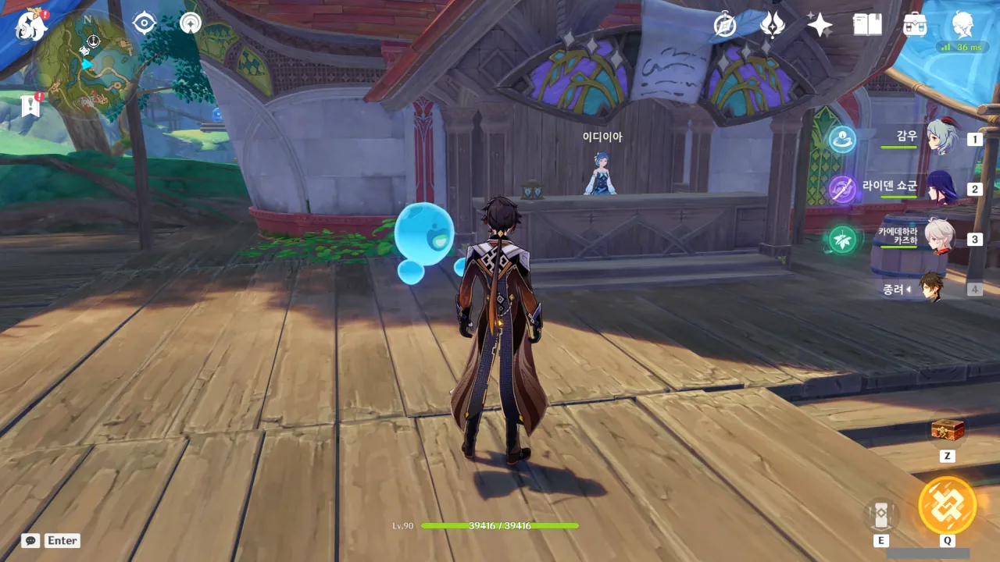

그다음으로는 이디이아를 보러 갔다. 분명 이디이아 역시 후일담 같은 것이 있겠지.

하지만 난 얼마 전, 페이몬이 이디이아를 보러 가자고 했던 걸 까맣게 잊고 있었다. 이디이아에게 말을 거는 것이 새로운 임무를 받는 트리거가 될 것이란 것도 완전히 잊고 있었다.



이디이아의 첫 대사를 보자마자 '어?'라는 생각이 머리를 가득 채웠다. 이건 절대로 일반적인 후일담을 시작할만한 대사가 아니잖아.

그리고 그제야 깨달았다. 내가 새로운 임무를 시작했음을.

&nbsp;

이번 임무는 이벤트의 주 임무가 아니라서 그런지, 더빙이 전혀 되어 있지 않다.



신기루 비경이 정상으로 되돌아온 후, 이디이아의 말투 역시 「안내인」 혹은 「마스코트」에 걸맞게 변했다. 좋은 일이다.



> 처음부터 환영이었거든요!

뭐... 본래 물의 정령인 이디이아가 사람 모습으로 나타나는 것 역시 '환영'이라고 할 수는 있겠네. 보통은 그럴 때 '변신'이라고 할 것 같지만.



아 ㅋㅋㅋ 원석을 주는 상자는 절대로 못 참지 ㅋㅋㅋ

듣기로는 이번 이벤트에서 나온 상자를 전부 열면 원석을 꽤 쏠쏠하게 벌 수 있다고 한다.

&nbsp;

그런데 왜 난 이 장면에서 기시감을 느끼는 걸까? 이디이아, 혹시 예전에도 이런 식의 대화를 우리가 한 적이 있었니?



「기묘한 물림」? '울림'도 아니고 '물림'이라... 거 참 기묘한 이름이네.



「기묘한 물림」이란 옛날 어떤 모험가가 만든 도전과제라고 한다.

도전과제? 이건 못 참지. 업적 작은 중요하다고?



그 모험가는 이 비경에 모라로 만든 회중시계 3개를 숨겨놓았고, 이디이아에게 시와 같은 암호를 알려준 후 비경을 떠났다고 한다.

그러니까 그 암호를 듣고 회중시계가 묻힌 곳을 찾으면 된다는 거네?



모라에 환장하는 건 페이몬뿐만이 아니었다 ㅋㅋㅋ

난 배낭에 모라가 천만 단위로 쌓여있어서 썩 내키진 않지만.

&nbsp;

아직까지 그 보물을 찾은 사람은 없다고 하는데... 혹시 나중에 '짜잔, 사실 숨겨진 보물은 이 비경을 마음껏 즐긴 당신의 추억입니다!'와 같은 헛소리를 하는 건 아니겠지?



그렇게 보물에 눈이 돌아가 비경을 뒤지고 다니던 모험가들은 점차 마음을 놓고 비경을 즐기다, 마지막에 처음 보물을 묻었던 모험가처럼 자신의 보물과 이야기를 비경에 묻은 후 비경을 떠났다고 한다.

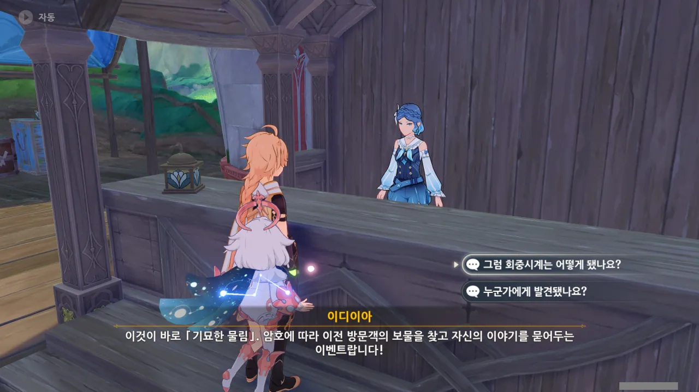

아, 그러니까 「기묘한 물림」은 그 회중시계를 찾는 게 아니라, 지금껏 신기루 비경을 거쳐간 사람들이 묻어둔 그들만의 보물을 찾고, 나 자신만의 보물을 묻는 릴레이 보물 찾기란 거네.



아니, 근데, 이디이아는 보물과 이야기를 맡았다면서, 정작 이야기만 기억하고 사람들이 보물을 찾았는지 못 찾았는지는 기억하지 못하는 거야?

최악의 경우, 기껏 보물을 찾았는데, 이미 다른 사람이 찾은 보물이라, 빈 상자만 나오거나 '이미 가져감'이라는 쪽지만 덩그러니 남아있을 가능성도 고려해야겠네...



에이, 그럴 거면 최소한 적어놓기라도 했어야지...



이야기도 중요하지만, 동기부여가 되는 보물 역시 중요하다고.



뭐, 어찌 되었건, 여행자 역시 오랜 역사와 전통에 따라 자신의 이야기를 이 신기루 비경에 묻어둘 수 있다고 한다. 물론, 같이 묻을 보물도 선택할 수 있고.



그래도 모라가 있다면 더더욱 기분이 좋겠지.

언제 한번 1억 모라를 찍어보고 싶거든... 1억 모라를 모으면 그다음은 10억 모라, 그리고 그다음에는 100억 모라... 생각만 해도 가슴이 두근거리지 않은가.

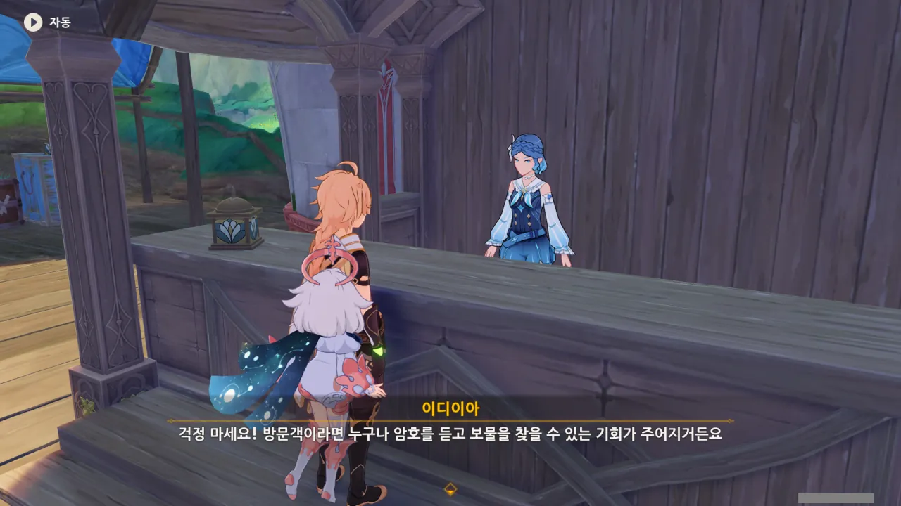

당연한 일이겠지만, 이 이벤트는 신기루 비경에 방문한 모두가 참여할 수 있는 이벤트이다.

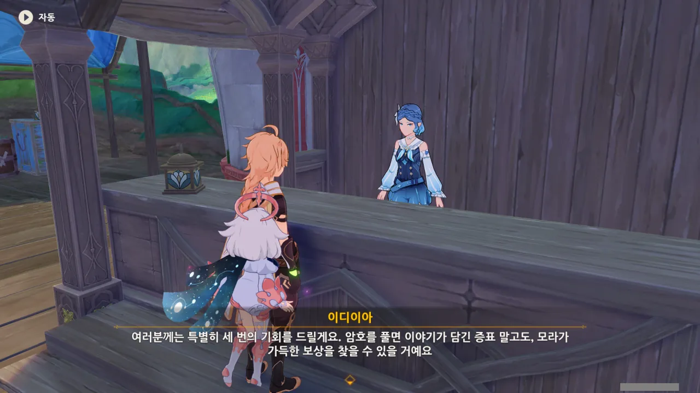

암호를 풀면 보상으로 이야기의 증표 외에도 모라를 추가적으로 얻을 수 있다는 거지? 나쁘지 않아...



여행자는 이 게임의 주인공이니, 분명 모든 수수께끼를 풀고 이전 모험가들이 숨겼다는 보물을 파헤칠 수 있을 것이다.



이디이아가 첫 번째 암호를 읊어준다.

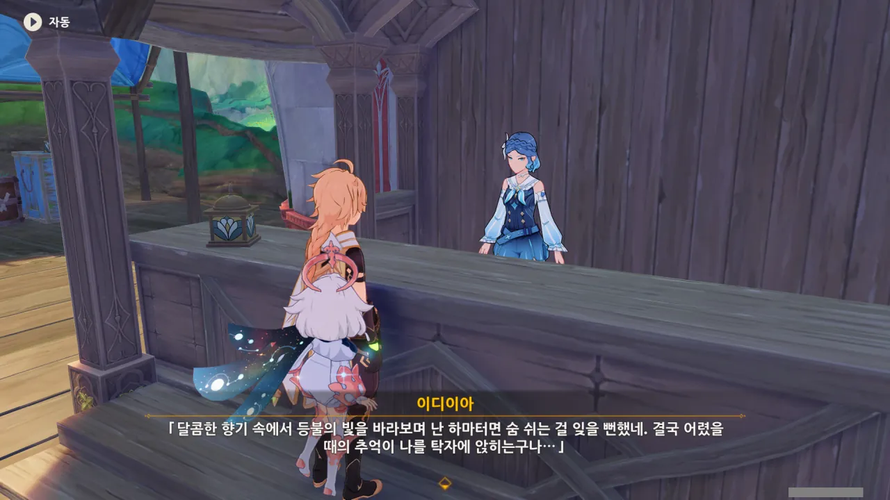

> 달콤한 향기 속에서 등불의 빛을 바라보며 난 하마터면 숨 쉬는 걸 잊을 뻔했네. 결국 어렸을 때의 추억이 나를 탁자에 앉히는구나...

파란색으로 강조된 단어가 없으니, 여기서 힌트가 될만한 키워드를 직접 찾아야 한다.

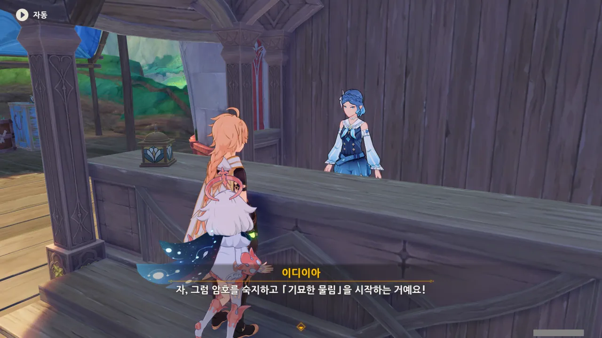

아무튼, 단서 하나만 갖고 기묘한 물림을 시작하게 되었다.

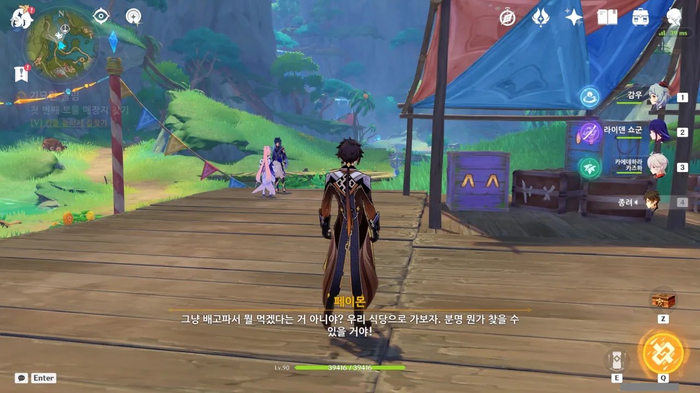

페이몬 이 녀석은 '탁자'가 나왔으니 식당으로 가보자고 한다.

탁자가 식탁보다 더 넓은 의미의 단어인데, 거기서 식탁을 생각하다니, 역시 페이몬은 돼지야.

***

아직 필드 곳곳에 놓인 상자와 퍼즐을 하던 중이었기 때문에, 식탁은 잠깐 미뤄두고 남은 퍼즐을 풀기로 했다.

그리고 돌아다니던 중, 메이몬을 발견했다.





> 제게 이 일을 넘긴 그 사람도 이런 일을 실컷 당해서 수메르로 야반도주한 거겠죠...

메이몬의 말을 보면, 아무래도 이곳 「물의 주민」들은 자신의 「원형」이 있다는 것도, 그들이 이미 이 비경을 떠났다는 것도 알고 있는 것 같다.

처음 「물의 주민」의 정체에 대해 상상했던 것보다 훨씬 밝은 설정이다.

난 처음에 이 「물의 주민」의 정체가 '이 비경에서 나가지 못하고 죽은 사람들의 유령'과 비슷한 것일 거라고 생각했거든. 자신이 죽은지도 모른 채 끊임없이 자신이 원했던 걸 이루기 위해 노력하는 그런 유령 말이다. 그게 아니면 「원본」을 죽이고 그 자리를 대신한 도플갱어와 비슷한 무언가이거나 말이다.

이디이아가 이미 다 설명한 것이지만, 그 설명을 듣기 전에는 정말 그런 건 줄 알았다고.

&nbsp;

「물의 주민」 메이몬은 원본이 시간을 좀만 더 들였다면 지금보다 더 잘할 수 있었을 것이란 걸 증명하기 위해 부단히 노력하는 중이다.





아아, 이런 건 전부 따로 빼서 글을 써야 하는데, 하필이면 새로운 임무와 섞여 버렸다.

그렇다고 지금 따로 글을 쓰기엔 너무 귀찮아...

***

모든 상자와 퍼즐을 처리한 후, 기묘한 물림을 다시 진행하기로 했다.

이제 이벤트 기간이 얼마 남지 않았기 때문에, 조금 서둘러야 한다.



음, 그러니까 힌트가...

> 달콤한 향기 속에서 등불의 빛을 바라보며 난 하마터면 숨 쉬는 걸 잊을 뻔했네. 결국 어렸을 때의 추억이 나를 탁자에 앉히는구나...
{.bq}

뭐, 여기가 맞겠지?

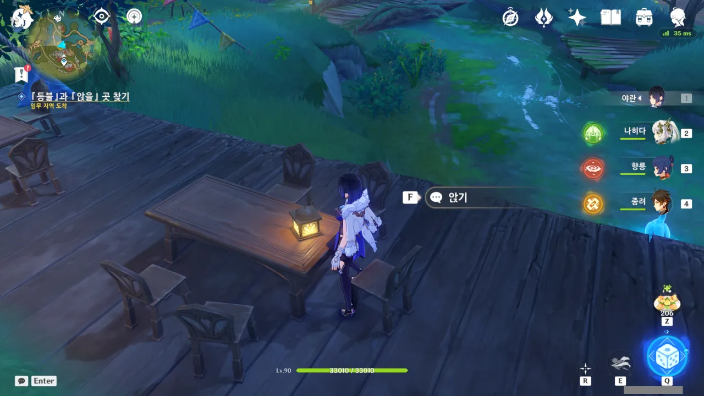

아마 여기 앉아야 할 것 같다. 여기 이 자리만 '여기에 앉으세요'라고 말하는 듯이 등불이 놓여있지 않은가.



의자에 앉으니, 등 뒤에 상자가 불쑥 나타났다.

모라를 제외하면 후줄근한 가방뿐이라고 하는데... 대체 왜 이게 보물인 거지?





페이몬은 그 가방을 두고 '식당의 향긋한 냄새라면 사족을 못쓰는 사람이 간식을 담은 가방'이라고 추측한다.

먹을 걸 좋아하는 페이몬다운 발상이다.



굳센 의지를 가진 투사...? 그런 투사가 간식에 사족을 못쓴다는 건 쉬이 상상하기 어려운데...



이디이아가 그 투사를 처음 만난 곳이 이 비경 안이 아니라 사막이라고? 그러니까 잔뜩 허기진 데다가 온몸이 상처투성이인 투사를 본 이디이아가 그를 이 비경 안으로 초대한 것인가?

만약 그랬다면 투사 입장에서 제일 인상 깊었던 것이 이 비경에서 피로와 허기짐을 해결할 수 있다는 것이라고 해도 과언이 아니긴 할 것이다.





그 투사가 어떤 이유에서 상처투성이로 이 비경에 온 것인지에 대해서는 투사가 남긴 이야기를 직접 읽어보라고 한다.

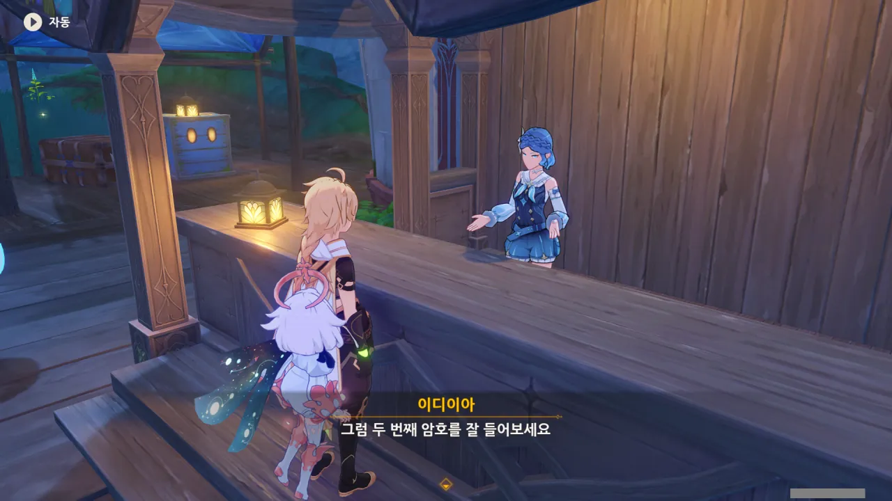

그전에 일단 두 번째 암호 먼저 듣고.



> 넝쿨의 유성을 타고 고요한 숲 속을 건너, 아무도 없는 맑은 꿈 속으로 들어가네...

여전히 감을 잡을 수 없는 힌트이다.



「유성」이라는 키워드로 「슝슝열차」를 생각해 낸 페이몬. 꽤나 그럴듯한 추론이다.

일단 슝슝열차로 가기 전에, 첫 번째 증표의 이야기를 먼저 보기로 했다.



상자에서 나온 그 후줄근한 가방은 투사가 늘 몸에 지니고 다녔던 건조식량 가방이라고 한다.

&nbsp;

도적에게 부모를 잃고 용병이 되어 홀로 도적과 싸우던 투사는 수년 전 자신처럼 도적에게 부모를 잃은 소년이 되려 도적이 된 데다가, 구해준 은혜를 잊고 자신을 찌르고 도망친 것을 보고 꽤 충격을 받았다고 한다.

자신이 지금껏 했던 일에 회의감까지 느끼던 그는 이디이아의 혼잣말을 듣고 새로운 깨달음을 얻었고, 이를 실천하기 위해 신기루 비경을 떠난 것으로 보인다. 건조식량 가방은 새로운 길을 걷겠다는 다짐의 증표이고.

&nbsp;

이 이야기를 보고 느낀 것은 딱 하나였다. 구해준 은혜를 잊고 되려 은인을 찌른 그 도적이 몹시 괘씸하다. 그런 녀석은 십자가에 못 박은 후 한 달 동안 사막 한가운데에 매달아놔야 하는데.

***

이제 두 번째 증표를 찾기 위해 슝슝열차로 가보자.



필드 위의 상자들을 열고 다닐 때, 왜 이 노선을 이용할 수 없는 걸까 궁금해했던 적이 있다.

이때 쓰려고 만들어둔 것이었구나.

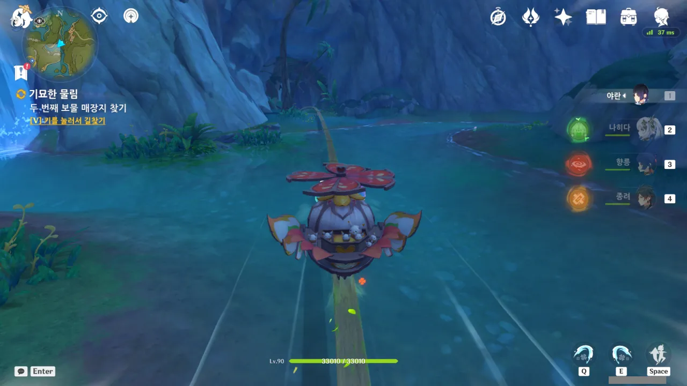

게다가 저 앞의 동굴이 여태껏 막혀있었던 것조차 난 알지 못했다.

와... 상자 먹겠다고 이곳저곳 돌아다니지 않은 곳이 없다고 생각했는데... 새로운 곳이 자꾸 나오네...



글쎄, 난 「넝쿨의 유성」이 이 레일과 열차 모두를 뜻한다고 본다.

레일은 넝쿨처럼 구불구불 굽어있고, 그 위를 열차가 유성처럼 내달리니까.



왼쪽의 길이 넝쿨로 막혀있었는데, 구상도를 통과하자 넝쿨 반대편으로 빠져나왔다.



흔들면 안에서 제법 큰 소리가 나는 상자를 얻었다.





아니, 상자를 열었을 때 뭔가가 불쑥 튀어나오는 건 정말 질색이다.

제발 그런 건 하지 말아 줘. 내게 있어 그런 건 서프라이즈가 아니라 호러라고.





상자의 주인은 길을 잃은 아카데미아의 학생이었다고 한다. 잠에서 깨어나보니 사막이었고, 그대로 이곳저곳을 헤매다 신기루 비경까지 들어오게 된 것이라고.

다만 다른 여행자들과는 달리 금방 이 비경을 떠났고, 이디이야 역시 그 학생을 제대로 돌보지 못했다고 한다.

&nbsp;

그 학생이 별을 바라보다 잠들 수 있는 혼자만의 조용한 휴식 환경을 원했기에, 동굴을 찾아 그 입구를 넝쿨로 막았다고 한다.

동굴 안에 누워 동굴 입구 너머로 보이는 별하늘을 바라보다 잠든다라... 꽤 낭만적이잖아.



'어디선가 들어본 것 같다'는 페이몬의 말을 듣고 생각난 것은 바로 레일라였다.

* _별을 바라보다가_  
  수메르 아카데미아의 학파 중 르타와히스트 학부(명론파)는 별하늘을 핵심 연구 소재로 삼는 학부이다. 그리고 레일라는 명론파 학생이다.  
  단순히 그저 취미가 별을 바라보는 것인 학생일 수도 있지만, 학업 때문에 금방 이곳을 떠났다고 하는 것을 보면 취미보다 학업을 우선시하는 학생일 가능성이 크다.  
  그렇다면 별을 보는 것 역시 학업과 연관되어 있을 것이라고 보는 것이 맞겠지.
* _잠에서 깨어나 보니 사막_  
  원신에서 등장한 캐릭터 중 몽유병이 있다고 언급된 캐릭터는 레일라가 유일하다.  
  다만 레일라의 몽유병에는 특이한 점이 있다. 몽유 상태의 레일라는 또 다른 자아라고 해도 좋을 정도로 멀쩡한 정신을 갖고 있다. 일반적으로, 몽유 상태에서 논문을 작성할 수 있을 리 없지 않은가.  
  만약 이 학생이 다른 일반 NPC였다면 페이몬이 '어디선가 들어본 것 같다'라고 말했을 리가 없다.  
  또한, 이미 이벤트 스토리에서 여행자는 레일라와 그녀의 또 다른 자아와 이미 대화를 나눈 적이 있다.

뭐, 이건 나중에 증표를 읽어보면 될 일이다. 지금보다는 더 자세한 이야기를 알 수 있겠지.





'다 읽어본 다음에 어떤 이야기인지 알려줄게'라는 선택지를 고르며 문득 한 생각이 떠올랐다.

페이몬이라면 분명 여행자가 '스포는 금물이니까 혼자만 알고 있을게'라는 선택지를 골랐어도 '맞아 맞아 스포일러는 안되지'라고 여행자에게 맞장구를 쳐줄 것 같다.



세 번째 암호는 이렇다.

> 먼지 하나 없는 파란 지붕과 하얀 사탕색 바닥. 보드라운 친구들과 함께라면 나도 날개를 펼칠 수 있어!

뭔가 아이가 쓴 듯한 문장이네.



듣자마자 떠오르는 곳? 멀리서 볼 때에는 잘 모르겠지만 막상 그곳에 가려면 쉽지 않은 곳?

그게 대체 어디지?



페이몬은 '파란 지붕'과 '하얀 바닥'을 푸른 하늘과 하얀 구름을 비유한 것이라고 추측한다. 여기서 푸른 지붕에 하얀 바닥을 가진 건물은 없었던 것으로 기억하니, 아마 저게 맞겠지.

&nbsp;

일단 두 번째 증표의 이야기를 살펴보자.



여기서도 학생의 이름이 정확히 무엇인지 나오지 않았지만, 아까 내가 했던 추측들이 들어맞았다.

이 학생은 명론파 학생이며, '관측'과 '기록'을 언급한 것을 보면 별자리 관측은 취미가 아닌 학업과 연관된 일임을 유추할 수 있다.

몽유병에 대해서는 뭐, 여행자가 지금껏 만났던 몽유병 환자는 레일라가 유일하지 않은가.



정말로 페이몬의 추측이 맞았다. 분명 예전에 여기에 왔을 때엔 없던 물의 환령 셋과 봉인된 꽃잎 주머니가 있네.

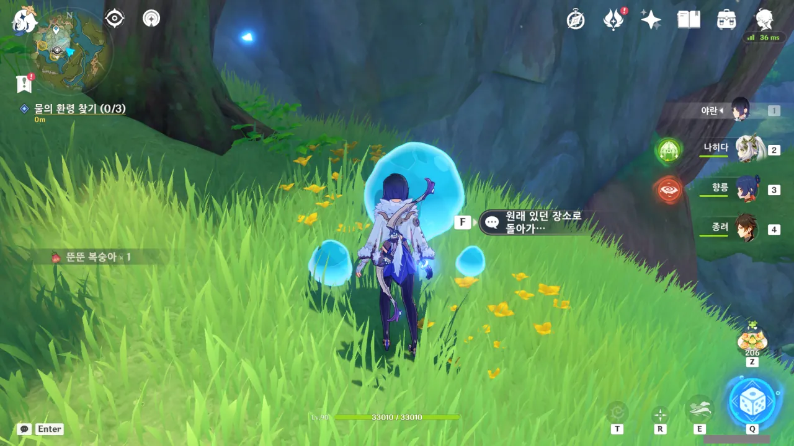

첫 번째 방울이는 그냥 열심히 따라다니면 되었다.



두 번째 방울이는 퐁퐁나무로 변신하는데, 풍선을 모두 터트리니 다시 돌려보낼 수 있었다.



세 번째 녀석은 열심히 도망치려 한 모양인데, 되려 버섯몬들에게 포위당했다. ㅋㅋㅋㅋㅋㅋ



세 방울이가 모여 꽃잎 주머니의 봉인을 풀고, 꽃잎 주머니에서 클로버 인장이 뿜어져 나온다.

코어 휠 옆에 인장이 생긴 것으로 보면... 설마 저 코어 휠 맨 위로 올라가라고 하는 건 아니겠지?



저기 방금 새로 생긴 클로버 인장이 보인다.



유람차를 타고 올라가니, 아까 그 클로버 인장이 어딜 향해 배치된 것인지 눈에 들어온다.

클로버 인장은 코어 휠 맨 꼭대기가 아니라, 코어 휠 옆에 있는 작은 공중부양 섬으로 향하고 있었다.



분명 처음 코어 휠에 왔을 때엔 이 섬이 없었던 것 같은데...



여기서 여태껏 지나온 곳을 한눈에 내려다볼 수 있다.

첫 번째는 슝슝열차, 두 번째는 연극 극장, 세 번째는 큰 텐트...



이번 보물은 어떤 도면이라고 한다. 웬 도면?



아무래도 이 보물의 원래 주인은 꼬마였던 모양이다. 그것도 대단한 발명가 겸 모험가 꼬마. 자연스럽게 클레가 연상되는 꼬마다.

'커다란 빨간 새'와 '젓갈'은 분명 성해 짐승인 것으로 보이는데, 이들 위에 탄 꼬마도 대단하고, 성해 짐승을 얌전히 집으로 되돌려 보낸 이디이아도 대단하다. 성해 짐승은 죄다 만나기만 하면 선공하는 선공 몹인데...

다만 이 꼬마가 남긴 도면은 당장 여행자가 쓸 수 없는 것 같다. 여행자가 쓰기에는 너무 작고, 페이몬이 쓰기에는 만드는데 너무 많은 공이 들어간다. 그거 좀 아쉽네...



이디이아가 알려준 모든 보물을 찾았다.





아, 그러고 보니 페이몬은 세 번째 보물의 이야기를 모르지, 참.

동화 작가나 꼬마나 둘 다 동심이 넘친다는 점에서 비슷할지도 모르겠다.







사실 보물 속 일기에도 아이가 연을 타고 나는 동안 겪은 일은 그리 많이 적혀있지 않았다. 그냥 성해 짐승 위에 타고 놀았다는 것 정도?



아, 그렇지. 이제 여행자가 자신의 보물을 다음 방문자들을 위해 남길 차례가 되었다.



선택지 중 '높은 곳'은 이미 꼬마가 선점한 자리인 것 같고, '정문'은 그리 매력적인 선택지가 아니다. 물론, 정문에 보물을 묻어둠으로써 '지난 행적을 되돌아본다'라는 의미를 부여할 수는 있겠다만...

그냥 이건 대놓고 두 번째 선택지를 고르라는 이야기이네.





이건 여행자가 아무렇게나 대충 둘러댄 것 같다.



이디이아가 상자를 하나 준다. 여기에 물건을 담으면 오랫동안 부패하지 않고 보관할 수 있다고 한다.



페이몬의 말처럼, 여기에 먹을 것을 넣어두어도 오랫동안 썩지 않을 것이다.

다만 그걸 열어본 사람이 어떻게 생각할지는...





그러니까 상자 안에 무엇을 넣어두었는지는 비밀로 하고, 이디이아에게 힌트가 될 문구만 알려주어도 된다는 것 같다.





이것 역시 이디이아에게 있어 하나의 즐거움일지도 모른다.

여행자에게 들은 힌트로 혼자 상자 안에 무엇이 들었을지 추리하는 거지. 그리고 나중에 다른 누군가가 여행자의 보물을 찾으면 자신의 추측이 옳았는지 틀렸는지 알 수 있을 테니까.

당연하다면 당연한 말이겠지만, 여태껏 보아온 보물 상자와 동일한 상자이다.

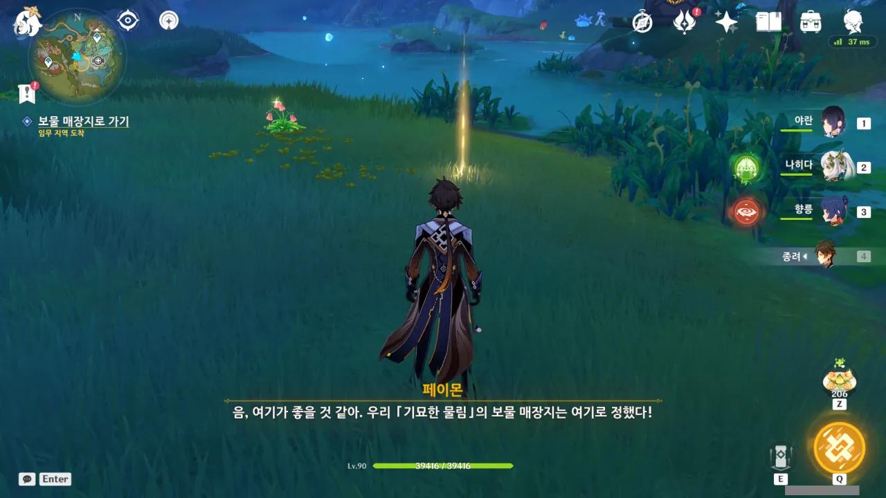

보물을 묻기 적당한 곳을 찾았다.





여기에 묻는 것은 다른 사람들에게 보물로 보일만한 것이 아니라, 자신이 보물로 여기는 것이기 때문에, 페이몬과 찍은 사진을 넣는 것이 제일 그럴듯해 보인다.





그런데 과연 오랜 시간이 지나도 여행자의 이야기를 기억하는 사람이 있을까?

가끔 여행자가 방문한 곳을 이미 한참 예전에 방문했다는 '노란 머리의 소녀'가 있긴 하지만, 전해져 오는 이야기는 희미하기 그지없는걸.

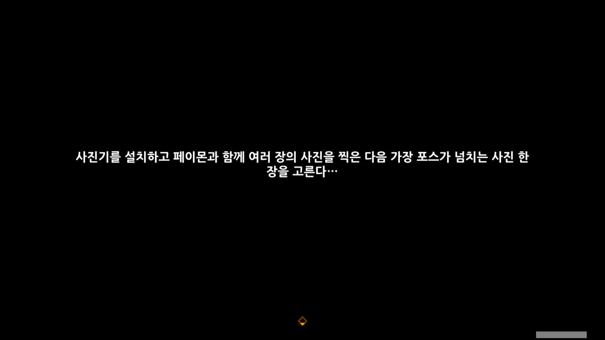

'가장 포스가 넘치는' ㅋㅋㅋㅋㅋㅋ



사진첩을 판다니... 여행자가 그렇게 유명인사였던가?

그런 것 치고는 가는 곳마다 현상수배 당하기 일쑤였던 것 같은데 ㅋㅋㅋ...



몬드부터 시작해 수메르까지 그동안 많은 일이 있었지만, 결국 이곳에 남기는 것은 이곳에서 겪었던 일이었다.





이리하여 「기묘한 물림」 이야기가 끝이 났다.

그런데 대충 보아하니 이 이야기가 끝이 아닌 것 같더라. 대충 두어 개 정도의 이야기가 더 있는 것 같다.

어우, 그건 또 언제 다 해?
