이상하다. 분명 맵에서 월드 임무를 나타내는 느낌표를 두어 개 정도 본 것 같은데, 정작 찾아보니 한 개밖에 찾지 못했다.

설마 이게 전부였던 건가? 에이 설마...





뭔가 어디서 많이 들어본 것만 같은 느낌의 광고가 스피커에서 흘러나온다.

뭐? 모라로 가득한 욕조에서 헤엄치고, 성의 유령을 물리치며, 중력의 속박에서 벗어나는 경험을 할 수 있다고? 그게 진짜일리 없다. 분명 과대광고의 일종이겠지.



"무대에 뛰어들면"이라고 말한 것으로 보아, 일종의 관객 참여형 연극이 아닐까 추측된다. 놀이공원의 어트랙션 비슷한 것일지도 모르겠네.



조시모스가 그러했듯이, 아마 스피커 뒤에 있는 사람이 이 연극의 감독인 「다이야」일 것이다.



생글생글 웃는 페이몬이 몹시 귀엽다.

그나저나, 저렇게까지 광고를 하는데, 설마 조시모스의 연극보다 못하겠어?

「다이야의 3일 공상」의 수준이 조시모스의 것과 비슷하거나 못하다면 정말 실망스러울 것이다.





분명 다이야는 "작은 소리로 암호를 말해보세요"라고 했던 것 같은데...

여행자와 페이몬이 연극에 참여하겠다고 하자, 다이야가 깜짝 놀란다. 설마... 다이야 너도 자신의 연극에 자신이 없는 건 아니겠지?





다이야의 연극은 총 세 가지로 구성되어 있다.

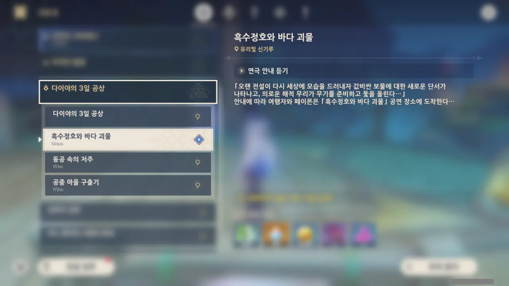

음, 그러니까 「다이야의 3일 공상」에는

* 「흑수정호와 바다 괴물」
* 「동공 속의 저주」
* 「공중 마을 구출기」

이렇게 세 이야기가 있다는 거네.

&nbsp;

그런데 저 「흑수정호와 바다 괴물」, 아무리 봐도 캐리비안의 해적 느낌이 물씬 난다.

일단 흑수정호는 블랙 펄의 패러디로 보인다. 흑수정은 영어로 Black Quartz, Black Rock Crystal이 되는데, 블랙 펄은 Black Pearl이거든. 수정이나 진주나 둘 다 보석이지 않은가.

시놉시스와 제목에서 유추할 수 있는 건, 연극에 해적과 바다 괴물이 나온다는 것인데, 캐리비안의 해적에서도 해적과 바다 괴물이 나온다.

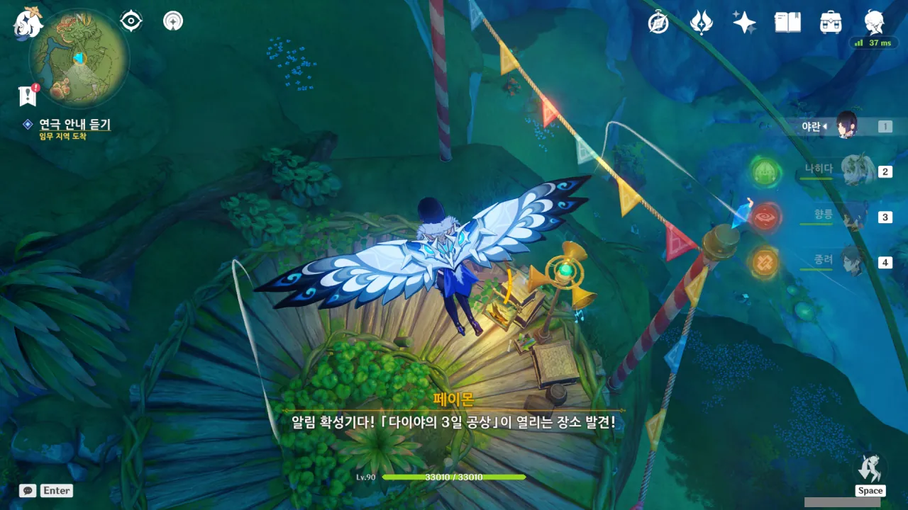

일단 첫 번째 연극인 「흑수정호와 바다 괴물」을 '경험'하기로 했다.



여행자가 도착하자마자 순식간에 연극을 시작할 준비를 모두 마치고 안내 방송을 내보내는 다이야.

아까 전 여행자가 구호를 외쳤을 때 마치 대화하듯이 서로의 말을 알아들을 수 있는 것을 보아, 아마 저 확성기에는 스피커 기능 외에도 마이크 기능이나 카메라 기능이 더 있는 것 같다.



뭔가 이야기를 들어보면 보물을 찾기 위해 떠나는 흑수정호의 이야기가 펼쳐질 것 같다. 아까 간략한 연극 소개에서도 보물 이야기가 나왔고...

> 오랜 전설이 다시 세상에 모습을 드러내자 값비싼 보물에 대한 새로운 단서가 나타나고, 의로운 해적 무리가 무기를 준비하고 돛을 올린다...
{.bq}

의로운 해적이라... 정말 안 어울리는 단어 조합이다.

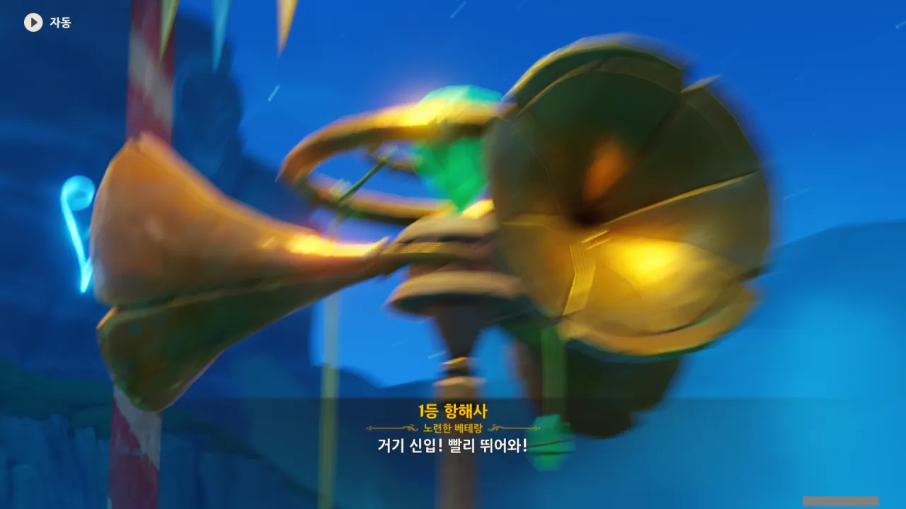

오우야, 화면이 흔들릴 정도로 우렁차게 1등 항해사의 목소리가 울려 퍼진다.



뭐 그렇겠지. 이게 바로 '관객 참여형 연극'이라는 건가... 초장부터 분위기를 바짝 잡고 간다.

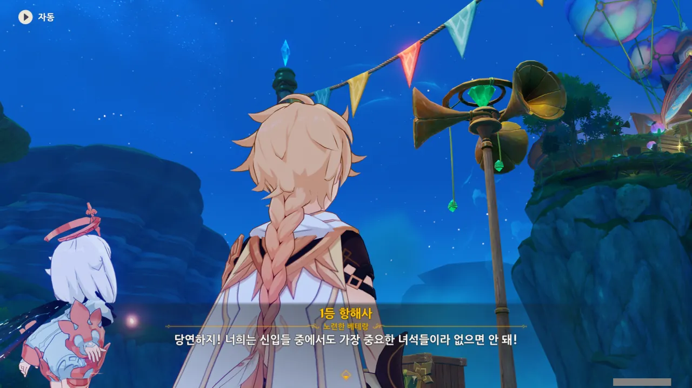

> 당연하지! 너희는 신입들 중에서도 가장 중요한 녀석들이라 없으면 안 돼!

'가장 중요한 녀석들'이라... 메타적으로 생각해 보면 당연한 말이다. 이 연극은 참여하는 관객이 없으면 아무것도 아니니까.

관객 입장에서도, 기껏 연극에 끌려다니는데, 이야기에서 주도적인 일을 하지 못하고 다른 캐릭터에 끌려다니기만 한다면 실망이 이만저만이 아닐 것이다.

그러니 관객은 '가장 중요한 녀석들'이어야만 한다.



저 그림은 이제 막 배에 타는 주인공을 묘사하는 그림인 걸까?

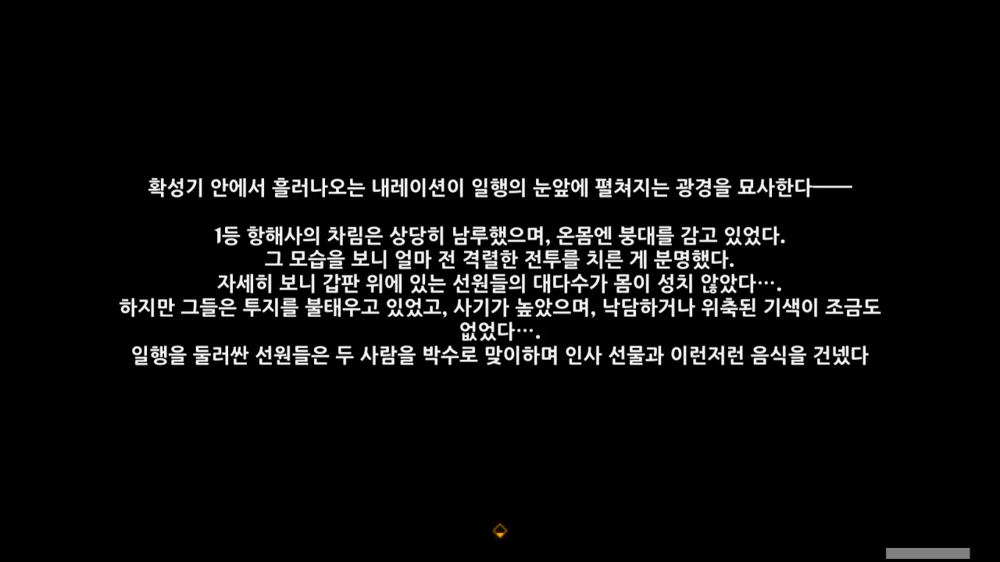

묘사를 들어보면 흑수정호는 얼마 전까지만 해도 격렬한 전투를 겪은 듯하다. 대체 무엇 때문이었을까?



연극이라고 하더니, 정작 다른 배우나 무대 장식 등이 보이지 않는다. 조시모스의 연극은 무대, 배우, 무대 장치 및 장식 등이 전부 갖춰져 있었는데...

설마 「다이야의 3일 공상」은 연극이 아니라 라디오 드라마였던 건가?



사실, 나는 트루먼 쇼 정도 되는 무대는 아니더라도, 최소한 해적선이라고 부를만한 무대 장식을 원했다. 다른 선원 역시 적당히 나무판에 그려놓은 그림 정도이면 족했고.

그런데 아무것도 없다. 이래서야는 여행자 혼자 북 치고 장구 치는 라디오 드라마나 다름이 없어 보인다.



그래. 일단 끝까지 가보자.

만약 처음부터 끝까지 이런 식으로 무대 장식도 없고 장소만 옮겨 다니는 수준이라면, 정말 잔뜩 실망할 것이다.

이런 건 연극이 아니라, 듣는 사람을 괜히 뺑뺑이 돌리는 라디오 드라마일 뿐이다.



흑수정 호의 선장은 '윌 선장'이라고 한다.



아, 이런 게 바로 텍스트의 한계인 건가.

페이몬이 윌 선장의 목소리가 묵직하다고 말하지만, 정지 영상과 텍스트만 보이는 내게는 전혀 와닿지 않는다. 그냥 페이몬의 말을 듣고 '어... 그런가?' 하고 넘어갈 수밖에 없다.

아까 1등 항해사의 우렁찬 목소리를 표현할 때에는 화면을 흔들어서 '와, 엄청 크게 말하고 있나 보다'라고 생각할 수 있었는데...

뭐, 이건 어쩔 수 없는 것이다. 우렁찬 목소리는 화면 효과로 표현할 수 있지만, 묵직한 목소리는 화면 효과로 표현할 수 없으니 말이다.

그래도 아쉬운 마음이 드는 건 어쩔 수 없다.



황혼새 동료? 윌 선장은 새도 동료로 생각하는구나. 보통은 애완동물 취급일 텐데...



이들은 마을의 평화를 위해 바다 괴물에게 주기적으로 제물을 바치고 있었던 모양이다. 해적질을 하는 것도 바다 괴물에게 바칠 제물을 구하기 위함이었고.

그런데 대체 '배은망덕한 상인'이 어떤 부류의 상인을 말하는 건지 잘 모르겠다. 상인이 마을에 뭘 했길래?



페이몬 말대로, 이 해적들이 보물을 찾아 나서는 이유가 개인의 사리사욕이 아니라 마을의 평화를 위협하는 바다 괴물에게 바칠 제물을 구하기 위해서라는 점은 꽤 신선하다.

일종의 생계형 절도라는 거네.



아, 설마 저 노선을 못 쓰던 이유도 바로 이 임무 때문이었어?



선로 위에 두 방울이가 노닥거리고 있다가, 열차가 다가오니 화살표로 변한다.

필드 곳곳에 놓인 퍼즐을 풀 때, 방울이와 숨바꼭질을 몇 번 했었다. 몇몇 방울이는 여행자에게 들키자, 나만 죽을 수 없다는 듯이 다른 방울이가 숨은 곳을 가리키는 화살표로 변하더라고. ㅋㅋㅋㅋㅋㅋ





거친 바다를 노선의 상태로 표현하려고 했던 것 같지만, 전반적으로 노선의 흐름이 부드러워서 그런 느낌이 별로 들지 않았다.

하지만 근처에 번개는 정말 많이 내리 꽂히더라고.



선장 역시 노련한 선원이라는 걸까? 선장이 키를 잡자 배가 안정되었다고 한다.

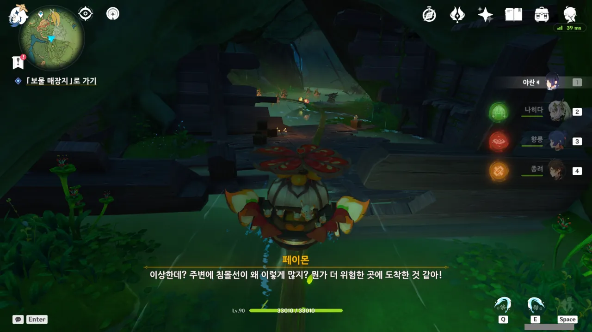

오! 아까 열차에 타기 전, 장면을 연상할 수 있는 소품이 있었다면 좋았을 것이라고 했었는데, 정말로 여기에는 난파선 같은 것이 배치되어 있다. 물의 색깔도 탁해지는 것이, 정말 앞에 뭐가 있을 것만 같다.

아까 라디오 드라마라고 했던 거, 취소!



그러니까 이 부서진 배는 일찍이 보물에 도전했다가 바다 괴물의 촉수에 부서진 배의 잔해라는 거네.



선원들의 말에 따르면 바다 괴물이 삥을 뜯은 것은 선장의 마을뿐만이 아니었던 듯하다.

마을 수십 개 정도면... 와우. 죽창으로 찌르면 뭐가 많이 쏟아져 나올 것 같은데?



촉수가 그려진 나무판이 물 밑으로 가라앉았다 다시 물 위로 솟아오르기를 반복하는데, 타이밍을 잘 맞춰 모든 촉수를 맞추는 데에 성공했다.





어... 뭔가 순한 맛 세이렌 같은데. 아니, 어떻게 유혹하는 방식이 '할머니의 맛있는 요리'인 거야? ㅋㅋㅋㅋㅋㅋ

게다가 세이렌의 노랫소리를 막는 방법이 '물에 불린 송이버섯으로 귀 막기'라니... 먹을 것으로 그러면 벌 받아!



오? 설마 슝슝열차로 급강하라도 하는 건가? 인정사정없이 무자비하게 내리꽂는 롤러코스터가 나오는 건가?

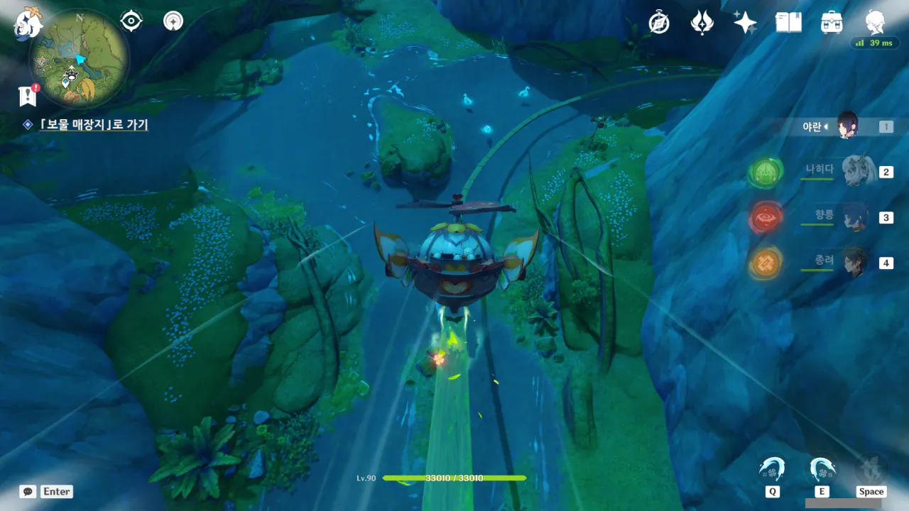

... 에이, 이 각도는 너무 완만하잖아...



그런데 기껏 폭포를 따라 내려왔다고 생각했는데 거기서 한번 더 내려간다.

이번엔 진짜 제대로 된 급강하를 볼 수 있겠지?

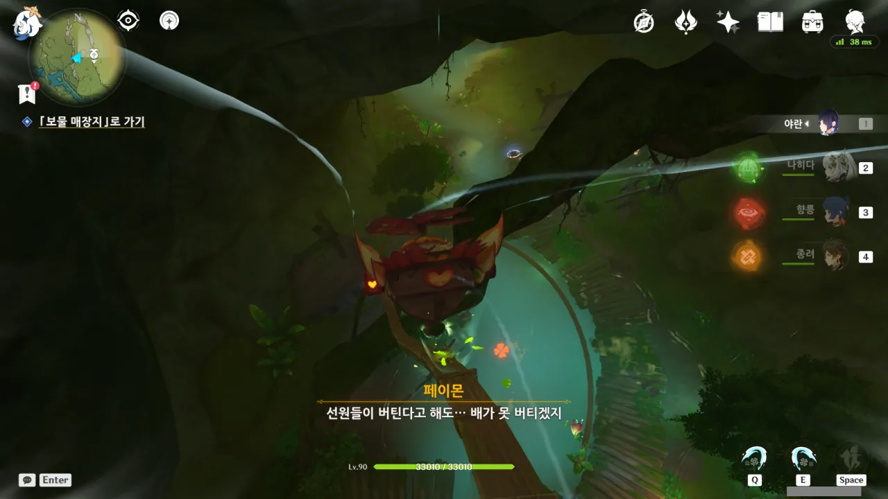

음... 좋아! 이 정도면 괜찮아! 이 정도 각도면 꽤 가파르다고 할 수 있지.



열차를 타고 도착한 곳은 꽤 그럴듯한 곳이었다. 곳곳에 난파선의 잔해가 있으니 말이다. 



좀 큰 난파선이라고 생각했던 배가 알고 보니 흑수정호였다. 뒤를 돌아보니 꽤 그럴듯한 배의 모습을 한 무대다.





대충 선장의 오랜 원수가 이곳에서 매복해 있다가 일행을 급습한다는 이야기.

해적에 동업자 정신이 있을 리 만무하지...



대체 화면 밑에 왜 체력 표시가 있는 것인지 궁금해하자마자, 붉은색 화살표가 나타나더니 그 경로를 따라 푸른색의 무언가가 나타난다.



나중에는 밟고 피하라는 듯이 나무통 같은 것이 바닥에서 솟아오르더라.



이제는 플레이어의 위치를 발사 직전까지 계속 따라다니는 화살표도 나온다.

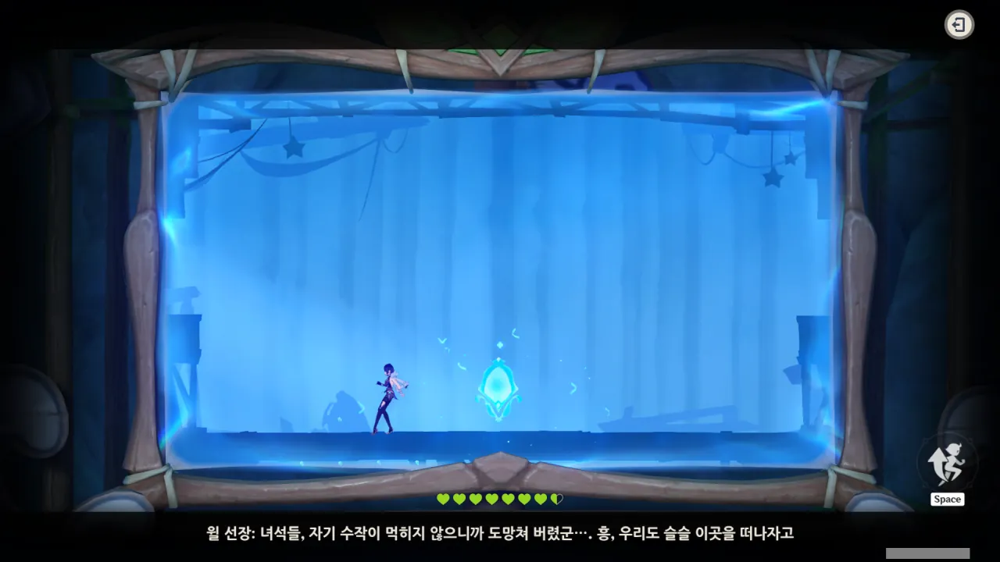

딱 한대만 맞고 클리어 완료. 아깝다... 한 대도 안 맞고 클리어할 수 있었는데.



어우, 보상을 아주 많이 주네. 좋다, 좋아.





선장의 오랜 원수는 흑수정호가 예상보다 훨씬 더 잘 버티자 그냥 포기하고 달아나버렸다.

여행자가 한 것이라고는 그저 구상도 안에서 파란색의 무언가를 피한 것 밖에 없는데, 그게 극 중에서는 엄청 열심히 싸운 것으로 되어있나 보다.

이렇게 할 거였으면 중간중간 부술 수 있는 뭔가라도 배치해 줬으면 좋았을 텐데...



페이몬도 어느새 연극에 몰입해 있다.



앞으로 가려면 이제 저 벽을 부숴야 한다. 물론, 그건 여행자가 한다.

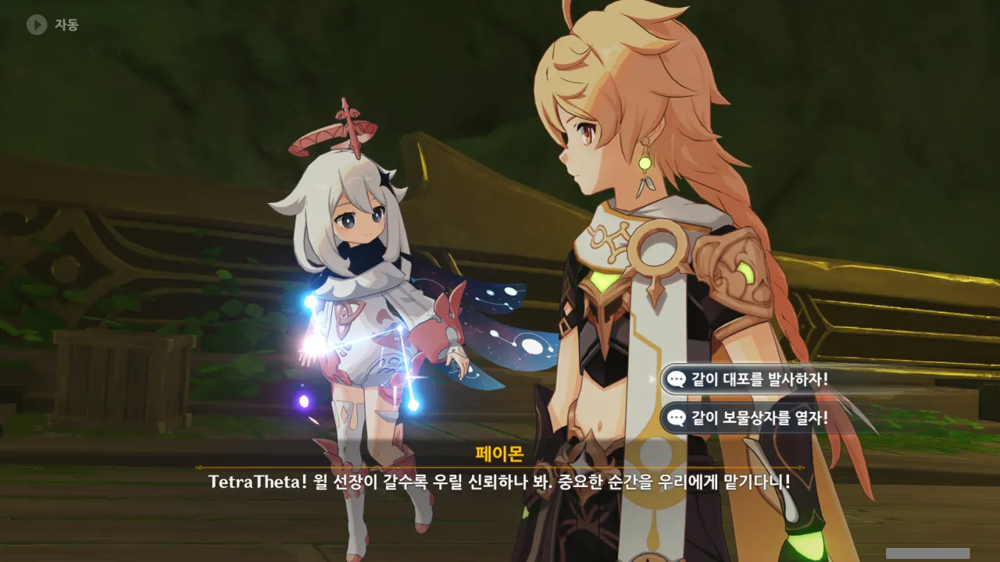

뭔가 참... 복잡 미묘하네...

메타적으로 보면, 연극이 계속 진행되기 위해선 관객의 개입이 필요하니, 당연한 일이다.

하지만 연극 속 등장인물의 관점에서 보면, 제일 많이 공을 세워 피곤할 사람에게 새로운 길을 개척하는 임무를 또 맡기는 셈이다.



1등 항해사는 여전히 목청이 기차 화통 삶아 먹은 듯 우렁차다.

어...? 저기 저거 모라 아냐?

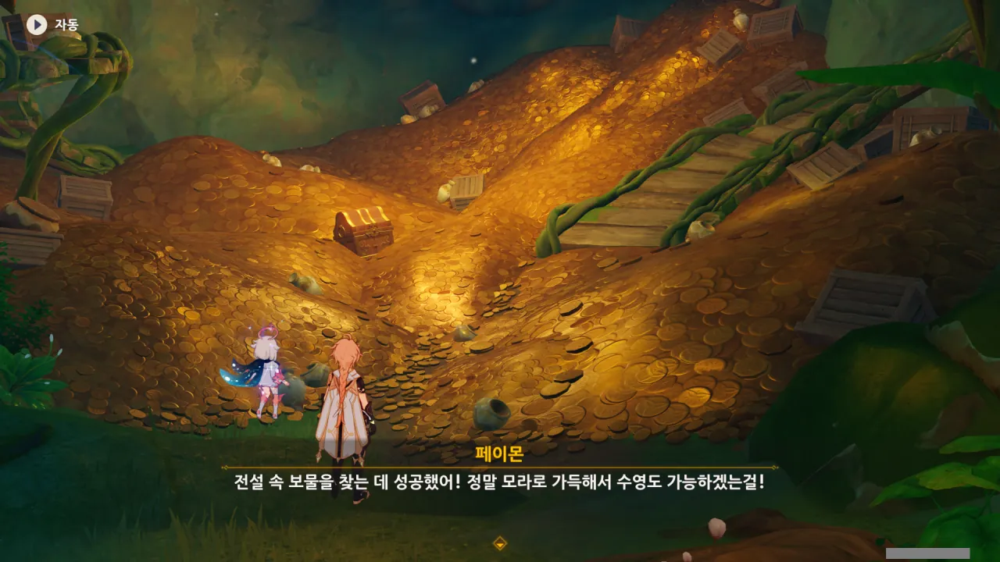

모라로 가득 찬 욕조는 아니지만, 모라로 가득 찬 욕조를 여럿 만들 수 있을 정도의 모라가 쌓여있다.



아니 ㅋㅋㅋ 이게 다 장식용 모라라고? 분명 생긴 건 수메르 사막에서 본 금화 더미랑 똑같이 생겼는데 ㅋㅋㅋ





선장의 말에 따르면, 이 모든 것을 준비한 세력의 진정한 목적은 여기까지 오느라 잔뜩 지친 선원들을 붙잡아 노예로 팔아치운 다음, 그들이 타고 온 배와 그들의 무기 역시 회수해 마찬가지로 팔아치우는 것이라고 한다.

그러면 분명 그 배후 세력인지 뭔지 하는 것이 곧 나오겠네.



진짜 모라로 만든 모라 욕조... 분명 만드는데 비싸긴 할 것이다.

그런데 여행자는 이미 모라로 가득 찬 욕조를 만들 수 있을 정도의 모라를 갖고 있지 않나? 대충 8,000만 모라 정도가 있으니까.

&nbsp;

모라로 가득 찬 욕조 하니까 생각난 것이다만, 실제로 금화로 가득 찬 욕조에 다이빙을 하면 죽을 수 있다. 거기에서 파묻히는 것도 마찬가지로 위험하고.

당연한 일이다. 금화는 스펀지처럼 말랑말랑하지도, 가볍지도 않다. 그게 가득가득 층층이 쌓여있는 곳에 다이빙을 하는 건 돌바닥에 다이빙을 하는 것과 다름이 없다. 거기에 파묻혀도 금화의 무게 때문에 숨을 제대로 쉴 수 없어 질식사할 테고.

금화 풀장에서 수영하는 것으로 유명한 '스크루지 맥덕' 역시 금화 풀장에 그냥 뛰어들면 두개골이 깨지겠지만, 자신은 힘과 요령으로 수영할 수 있다고 말할 정도이다.



다른 선원들은 어떻게 생각하는가도 들어봐야지.





분명 이곳을 향해 다가오고 있을 배후세력에 현재 상태로 대항한다는 것은 어리석은 일. 다들 아까 그 선장의 원수와 잔뜩 싸우지 않았는가?



여행자가 이번 항해에서 공을 많이 세웠다고 선장이 이곳의 유일한 보물상자를 여행자에게 양보한다.



빈손으로 돌아가게 생긴 다른 선원들은 잔뜩 실망했다.







그런 선원들을 설득해 모든 문제의 원인인 바다 괴물을 직접 쓰러트리자고 제안하는 선장. 이게 옳은 해결책이긴 한데... 과연 어떨지.

물론 바다 괴물을 쓰러트리면 더 이상 마을이 보물을 요구받지 않을 것이다. 만약 바다 괴물이 자신의 본거지에 보물을 쌓아뒀다면 그곳에 있는 보물 역시 얻을 수 있을 테고...

이른바 일석이조이긴 하나, 페이몬의 말처럼 모두가 바다 괴물에 대항할 힘을 가지고 있는 것이 아니다.





이야, 이 집 사람 잘 다루네. 순식간에 선원들을 설득해 버린 선장.

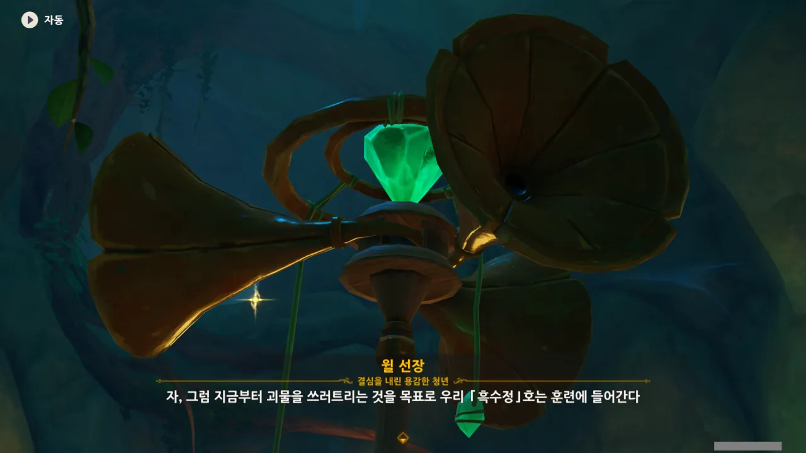

순식간에 이번 원정의 목표를 바다 괴물 토벌로 즉석에서 바꿔버렸다.





아 ㅋㅋㅋ 당연히 도와드려야지 ㅋㅋㅋ



여기서 바로 바다 괴물에게 돌격하는 분위기라고 생각했는데, 그래도 본거지로 돌아가 재정비 후 바다 괴물에게 도전하는 상황 판단은 할 줄 알았다.



어... 설마 여기서 끝나는 거야?





뭐, 잠깐 중간에 쉬는 것이라면 이해할 수 있다.

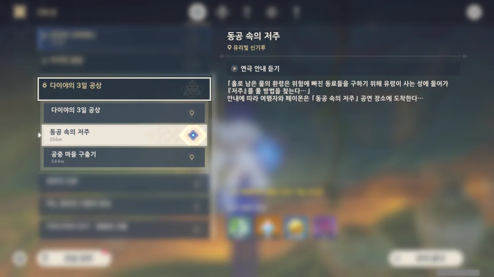

그런데 그냥 여기서 끝이네...?

아잇, 감질나게 정말!
