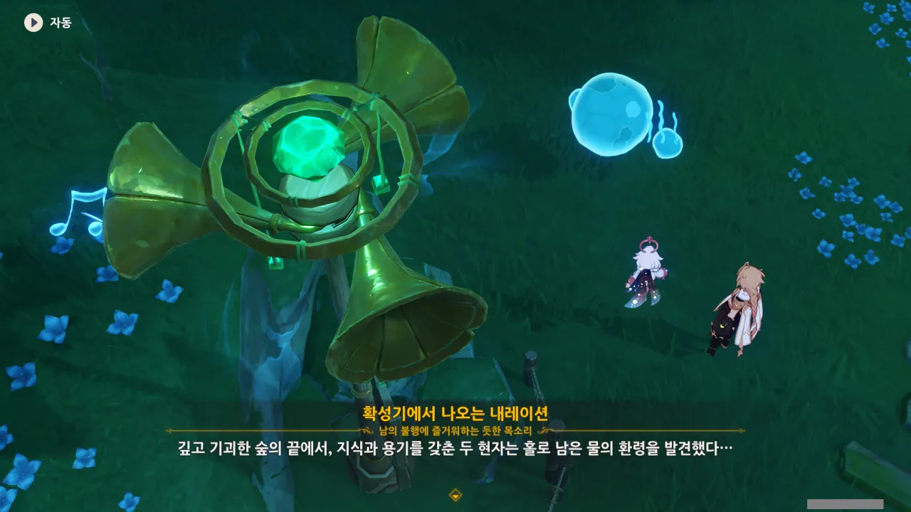
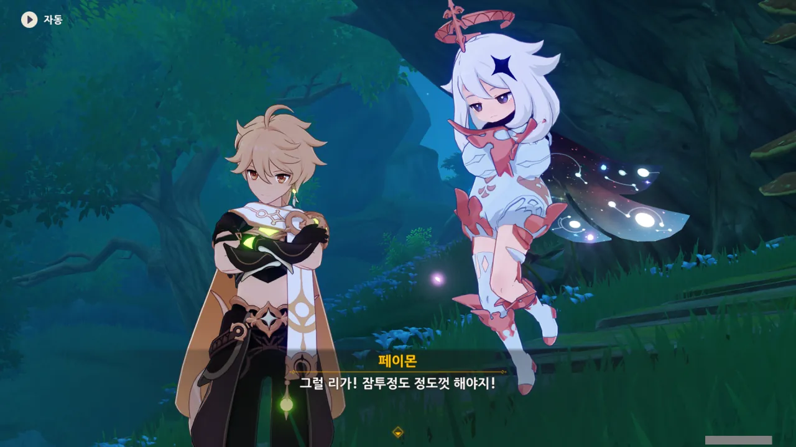
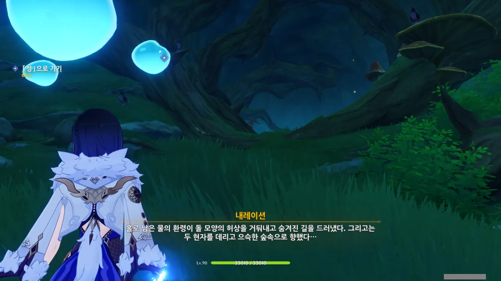
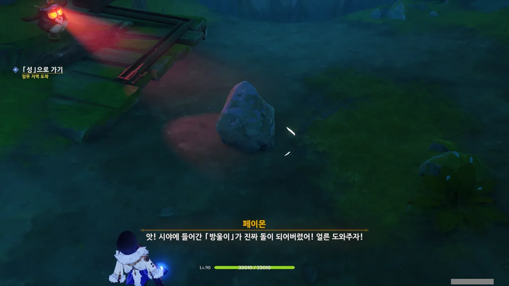
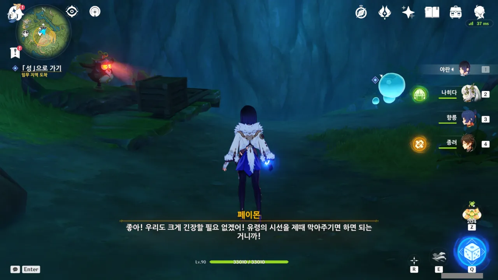
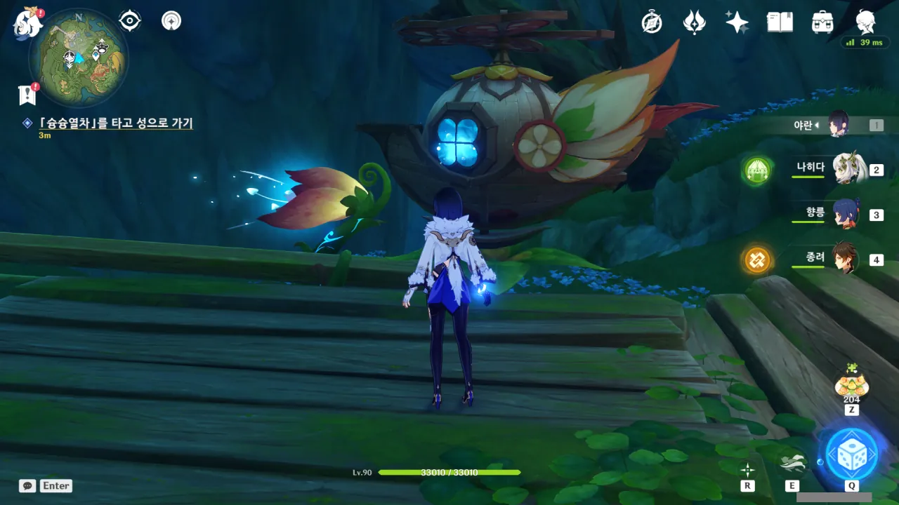
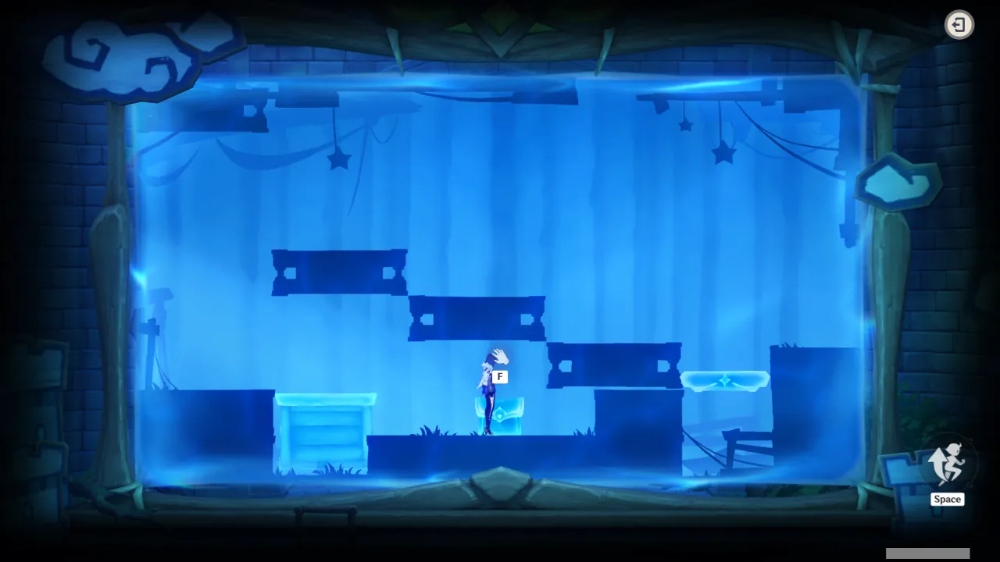
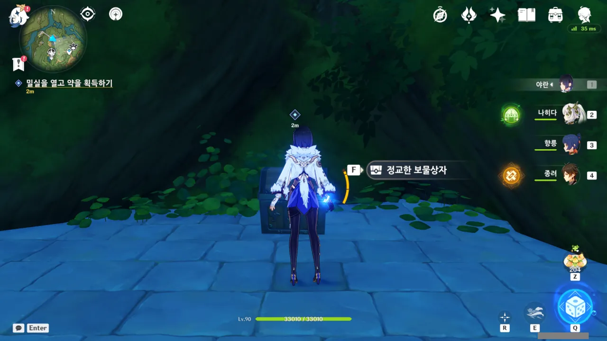
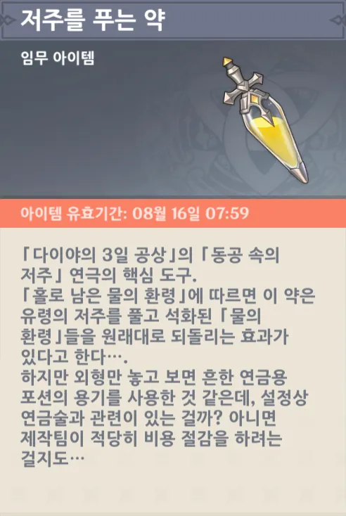



이번에도 가까이 다가가니 먼저 말을 꺼내는 다이야.

그런데 대체 저 '동공'은 무슨 동공일까? 瞳孔? 同功? 同工? 洞空? 銅工? 한자어는 동음이의어가 많아서, 가끔 이렇게 그 뜻을 알기 힘들 때가 있다.

이번 연극의 시놉시스는 다음과 같다.

> 홀로 남은 물의 환령은 위험에 빠진 동료들을 구하기 위해 유령이 사는 성에 들어가 『저주』를 풀 방법을 찾는다...
{.bq}

내레이션이 말한 '두 현자'는 아마 여행자와 페이몬을 연극 안에 등장시키기 위해 만든 등장인물인 것 같다. 만약 여행자 혼자 왔다면 그냥 '현자'라고 했겠지.



분명 물의 환령은 말을 할 수 없는데 대체 방금 어떻게 말을 한 걸까 궁금해하자마자 확성기에서 물의 환령의 대사가 나왔다고 알려준다.

그러니까 우리 앞에 있는 이 물의 환령이 우리와 함께 연극을 진행해 나갈 배우라는 거네.

첫 번째 연극에선 여행자와 페이몬을 제외한 등장인물이 전부 대사로만 등장해, 제대로 된 연극이 아니라 그저 일인극이라는 느낌이 들었지만, 이번엔 이렇게 다른 배우가 있으니 훨씬 연극다워졌다.



여행자와 페이몬이 물의 환령의 '말'을 어떻게 알아들을 수 있는 건지에 대해선 '두 현자가 물의 환령의 언어에 통달했다'라는 설정으로 무마한다.

실제로 물의 환령의 언어를 알아들을 수 있다면 참 재미있을 텐데...





숲을 헤매던 물의 환령들은 실수로 성 안의 유령들을 깨우고 말았고, 두 유령 두목들이 유령에게 모습을 들키면 돌이 되는 저주를 걸었다고 한다.

그리고 우리 앞에 있는 이 물의 환령은 가까스로 도망쳐 우리에게 도움을 요청하고 있는 것이다.

이래서 유령이나 귀신은 안된다는 거다.

사람이 살면서 실수로 잠을 깨울 수도 있는 것일 텐데, 그냥 사과받고 끝내도 되는 걸 거기다 꼭 심술을 부려서 저주니 뭐니 하는 걸 끼얹지 않은가.

게다가 귀신은 해코지하는 것도 사람을 가린다. 난 살면서 거부(巨富)가 귀신의 저주를 받았다는 이야기를 절대 들어본 적이 없다. 꼭 약하고 힘없는 일반인만 건들잖아.



유령을 직접 때려눕히면 되지 않을까 했지만, 성이 원체 넓은 데다 유령 두목은 절대 모습을 드러내지 않기 때문에 불가능한 방법이라고 한다.



성 깊은 곳에 있는 보물 상자를 열어야 한다고...?

스프린터 셀이나 메탈 기어 솔리드처럼 잠입 액션을 펼칠 것이라는 암시인 것인가?





잠입 액션을 펼칠 것을 생각하니 벌써부터 기분이 좋아진다.

그러고 보면 원신을 여태 플레이하면서 잠입을 한 적은 손에 꼽을 정도 아니었나?

* 몬드 페보니우스 대성당 지하에서 바르바토스의 하프 훔치기
* 이나즈마 이도에서 케이지로 미행
* 수메르에서 도토레 미행

기껏해야 이 정도가 전부인 것 같은데...

와, 이번에는 길을 반투명한 노란색 막으로 막아두지 않고, 아예 돌로 통로를 가려놓았다.

그리고 그걸 방금 방울이가 치웠고.



동굴 안으로 계속 들어간다.

갑자기 부엉이같이 생긴 무언가가 나타나 방울이를 비추자, 방울이가 돌로 변해버렸다.

난 방울이 모양 돌로 변할 줄 알았는데, 그냥 돌이 되어버리네.





그냥 때려 부수면 되는 것 아닌가 싶어 공격하려 하자, 연극 물품 훼손 시 10배의 배상을 청구하겠다는 말을 들었다.

아냐. 잘 생각해 봐, 다이야. 충분히 발달한 근육은 마법과 구분할 수 없어.



결국 상자를 부엉이 앞으로 옮겨 시선을 차단할 수밖에 없었다.

아무래도 이 앞은 잠입 액션이 아니라 부엉이의 시야를 막는 퍼즐로 가득할 것 같다.



방금 석화에서 풀어줬는데 갑자기 나타난 또 다른 부엉이에 의해 또다시 돌이 되어버린 방울이.

아니, 갑자기 나타나는 건 좀 아니지! 스탑 러커도 아니고!





이 부엉이는 먹을 것을 주면 시선을 돌리나 보다. 마침 라즈베리를 따서 주라고 옆에 라즈베리 나무도 있다.

아니, 진짜로 시선을 돌린다고?

중간에 좀 많이 귀찮은 퍼즐이 하나 있었는데, 잘 해결했다.

상자가 이동할 때 길이 막히면, 막힌 자리에 그대로 멈추는 것을 이용하면 되는 퍼즐이었더라고.

모든 퍼즐을 통과하고 나니, 이번엔 열차를 탈 시간이다.



열차를 타고 도착한 곳은 예전에 상자를 먹기 위해 돌아다녔을 때 잠깐 방문한 적이 있는 성이었다.

그때에는 '왜 여기에 성이 있는 거지?'라고 생각했었는데, 여기에 쓰려고 만들어둔 거였구나.

다행히도 가는 길에 부엉이는 보이지 않았다.



구상도를 이용해 밀실 열쇠를 찾아야 한다.



저 빨간색 원에 닿으면 구상도에서 강제로 내쫓긴다.





알고 보니 상자에는 아무것도 없었다. 유령 두목이 가짜 상자를 배치해 둔 것이다.

뭔가 빨간 원이 막 움직이던데, 수월하게 넘어갈 수 있었다.



두 번째 상자 역시 가짜 상자였다.

슬슬 꼬움 지수가 상승하고 있다. 만약 세 번째 상자도 가짜라면 좀 짜증이 날 것이다.



세 번째 상자는 가짜가 아닌 것 같긴 한데, 여행자가 밑으로 내려가자 또 다른 빨간 원이 나타나 양 옆에서 여행자를 쌈 싸 먹는다.



오, 설마 이제 저 부엉이를 합법적으로 때려 부술 수 있는 것인가?







방울이가 일부러 부엉이 앞으로 나서 돌이 되어 부엉이의 시야를 막아버렸다.

이러면 부엉이가 구상도에 붉은 원을 쏘아내지 못하게 된다.

방울이가 제 한 몸 희생해 벌어준 틈을 타 얼른 상자를 까기로 했다.

부엉이의 시야가 막힌 탓에 아무런 문제 없이 상자를 회수할 수 있었다.



밀실 열쇠를 얻자, 유령들이 죄다 뿔뿔이 흩어져 도망가버린다.



방울이는 여전히 돌이 된 상태이다.



아까 얻은 밀실 열쇠로 문을 연다.

와, 이 캔버스 전체가 문이었던 거야?

문 뒤에 건물 내부 모습이 나타날 줄로 기대했었는데, 그냥 보물 상자만 하나 덩그러니 놓여있었다.

아이템 이미지가 포션 같다고 생각했는데, 플레이버 텍스트에도 '외형만 놓고 보면 흔한 연금용 포션 용기를 사용한 것 같다'라고 적혀 있더라.

뭐... 이 경우에는 적당한 비용 절감 때문이겠지?



해독제인지 포션인지 모를 액체를 한 때 물의 환령이었던 돌에 뿌리자, 돌이 되었던 방울이가 다시 원래대로 되돌아왔다.





음, 그러니까 이게 그 유명한 '오이오이, 믿고 있었다구~'라는 건가?



연극에 몰입했다는 것은 그만큼 연극이 재미있었다는 것이겠지. 아무튼 좋은 일이네.



방울이에게 남은 해독제를 쥐여 보냈다. 이제 다른 방울이들도 돌 신세에서 벗어날 수 있겠지.





이리하여 「동공 속의 저주」가 끝이 났다.

아무래도 저 '동공'은 瞳孔이었던 것 같다. 바라보면 돌이 되니까...



얼른 다이야를 만나고 싶다. 분명 다이야 역시 푸른 머리에 푸른 눈동자를 가진 사람이겠지?
