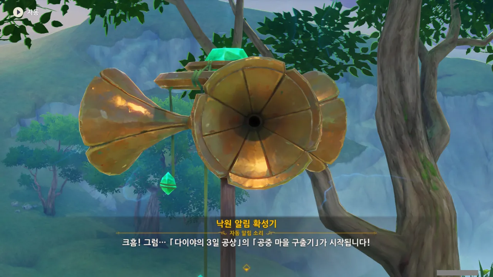
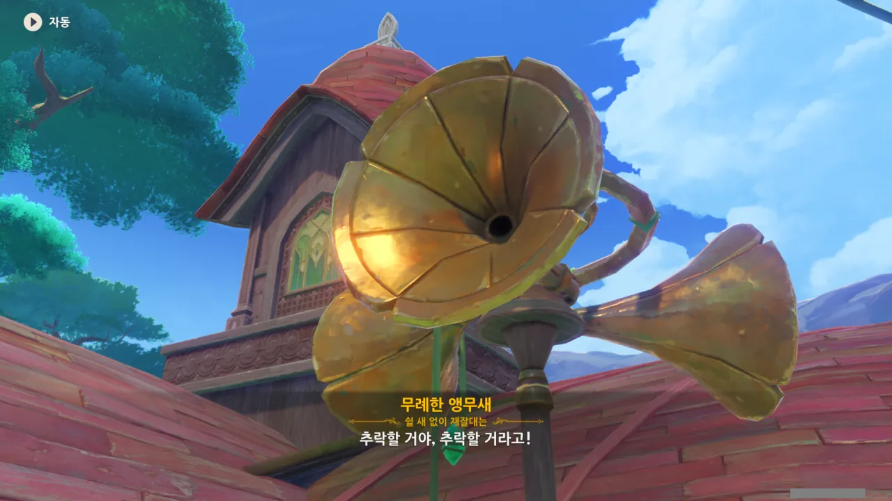
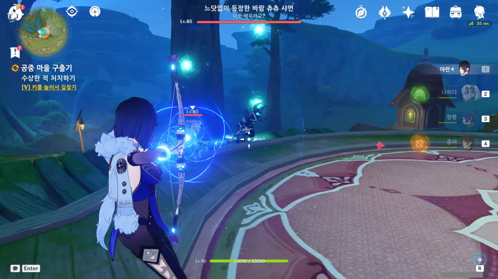
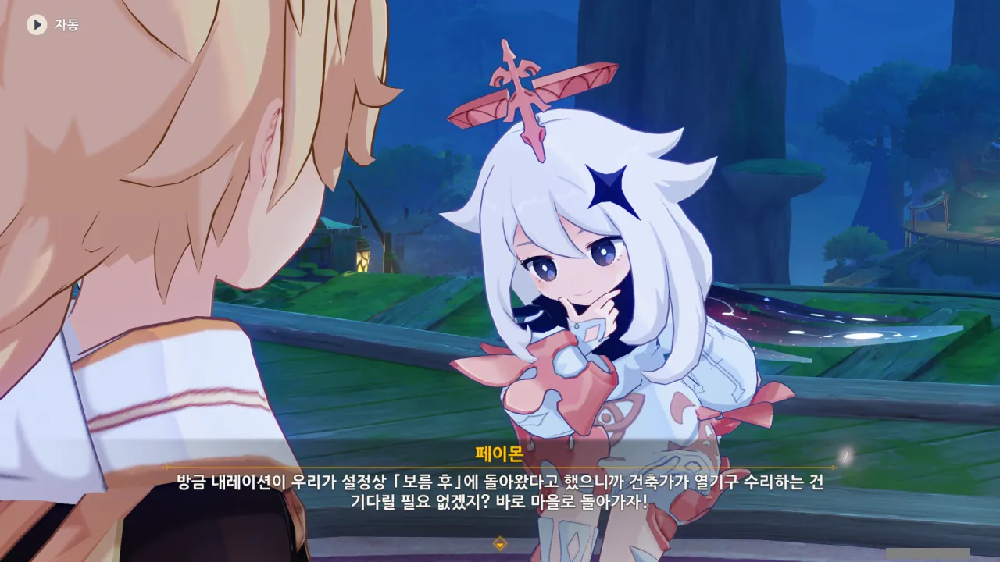
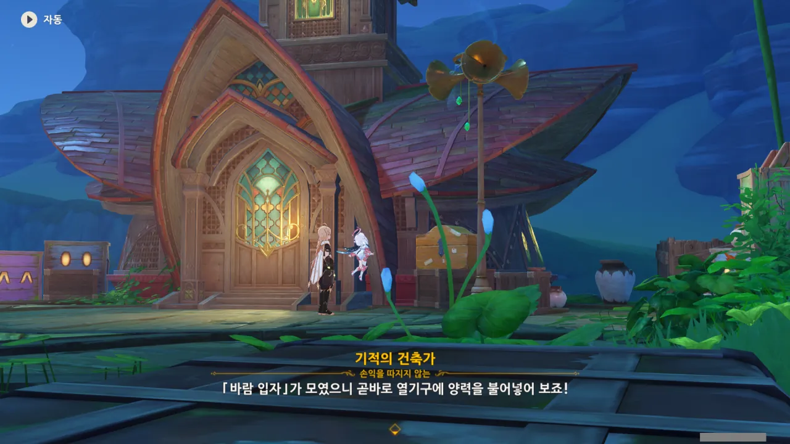
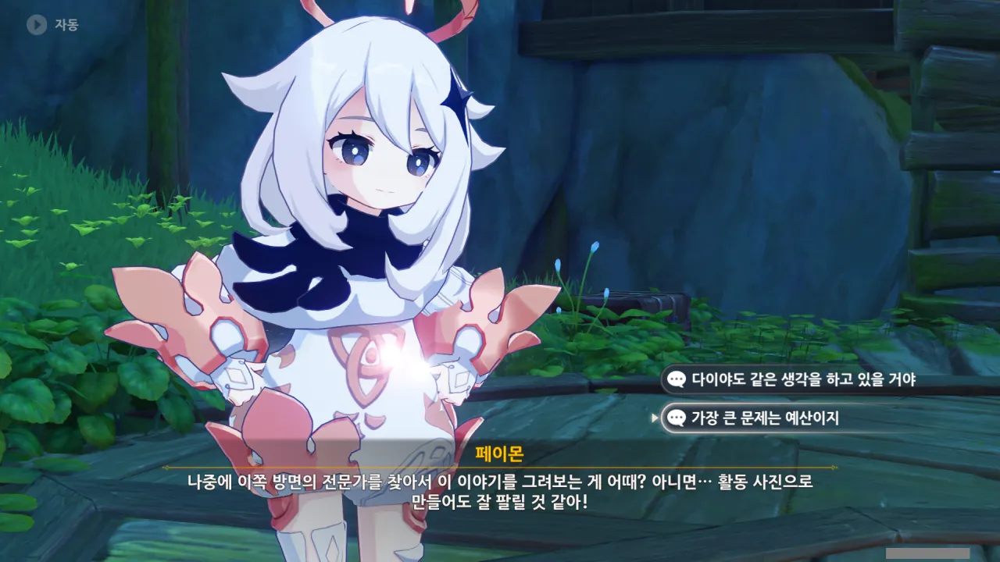
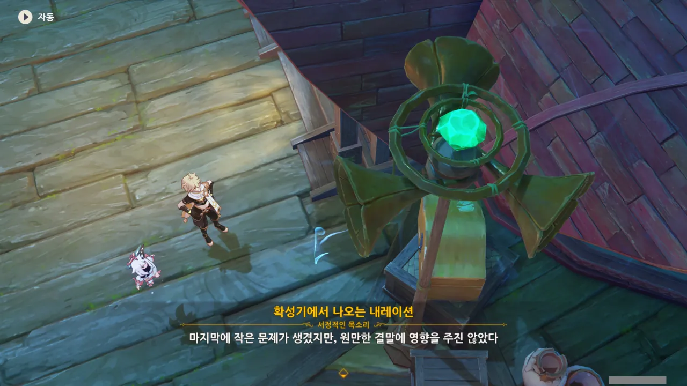

이제 남은 건 마지막 이야기뿐이다. 분명 시놉시스가...

> 공중 마을이 전례 없던 위기를 맞이했다. 기적을 만드는 건축가는 추락하는 고성을 제때 구해야 한다...
{.bq}

연극의 '주인공'은 분명 저 '기적을 만드는 건축가'임이 분명하다.



애석하게도, 바람 입자에 생긴 이상은 아직 해결이 되지 않은 것 같다.

바람 입자는 계속 뽈뽈거리며 돌아다니고 있고, 그 뒤를 방울이가 애타게 뒤쫓고 있거든.

다이야가 곧바로 연극을 시작하는 걸 보면, 저 정도는 정말로 '사소한 기술적 오류'인 것 같다.

뭐, 알아서 잘하겠지!



그러니까 어느 한 산골 마을 위쪽 절벽에 관측소를 세우고 그 주변에 살던 사람들이 나중에 새로운 부족, 「절벽 위 파수꾼」이 된 거라는 말이네.



물자 운송이 불편한 데다가, 마지막 남은 정상적인 집마저 잃게 되자, 절벽 위 파수꾼들은 공중 마을을 건설해 거기로 이사했다고 한다.

뭔가 이해가 되지 않는 설정이다.

절벽 위에 살고 있으니, 물자 운송이 어렵다는 건 충분히 이해할 수 있다. 하지만 집이 왜 망가진단 말인가? 설마 폭풍 때문인가? 홍수가 절벽 위까지 올라오진 않을 테고...

공중에 마을을 건설하는 것 역시 위험하기만 하고, 득 될 것은 전혀 없다.

잠수함의 밸러스트 탱크처럼 마을의 높낮이를 조절할 수 있는 장치가 있다면 모를까, 그냥 공중에 떠있기만 한 마을이라면 절벽 위의 마을보다 물자 보급이 어렵다.

홍수의 위협은 절벽 위에 사나 공중에 사나 똑같이 안전할 것이다.

폭풍의 높이는 대충 20km 정도가 되기 때문에, 공중 마을의 고도가 해발 20km 이상이 되지 않는다면 지상에 있을 때와 동일하게 폭풍의 영향을 받게 된다. 하지만 에베레스트 산의 높이가 8.8km 정도인데, 20km나 되는 곳에 살 수 있을 리가 없지.

공중에 마을을 지을 시, 오히려 폭풍의 강한 바람 때문에 마을에 지나치게 많은 힘이 쏠리게 되고, 그 탓에 마을을 땅에 고정하는 줄이 끊어지거나 말뚝이 뽑혀 마을이 정처 없이 표류하게 될 수도 있다.

게다가 이젠 마을이 천천히 추락하고 있다고 한다.

정말 선택을 잘못해도 단단히 잘못했다.



그래서, 뭔가 큰일이 벌어졌다는 건 잘 알겠다. 그런데 우린 뭘 해야 하지?



아무래도 이 바람 입자는 먹는 것인가 보다. 올라가는 길에 보이던 바람 입자를 먹으니, 방울이들이 좋아라 하네.



대체 왜 이 마을에 큰 진동이 발생하는 걸까? 풍선 안에 든 건 단순한 바람 입자잖아? 그저 공중에 떠있을 뿐인 마을에 진동이 발생할만한 일이 전혀 생각나지 않는다.

마을의 고도가 낮아지는 것과 무언가 연관이 있겠거니 추측은 할 수 있지만, 근거는 전혀 없고...

거 참, 저 앵무새, 사람 불안하게...



그야 뭐, 그렇겠지. 기적의 건축가라고 해서 모셔왔는데, 다 만들고 보니 마을이 점점 추락하고 있지 않은가.



마을을 공중에 떠오르게 하는 양력 열기구에 누군가가 사보타주를 했다고 한다.

대체 누가? 왜? 마을 사람 중 한 명이 그런 거라면 정말 바보 같은 짓이라고 말하고 싶다. 어떤 머저리가 자기가 살고 있는 마을을 추락시킬 행위를 하는 거야?



음음, 당연한 말이다. 고객 과실로 인한 AS는 비용이 청구되는 게 맞지.



기존에 지불했던 돈의 5배를 AS 비용으로 내겠다고 하는 마을 장로.

와, 정말 통 큰 사람이네.



건축가 역시 통 큰 마을 장로에게 놀랐다. 마을 장로가 마을 건설 때 지불한 돈 역시 다른 고객에 비해 많았는데, 그 돈의 5배를 내겠다고 하니, 당연히 놀랄 수밖에.

아니, 이 마을은 대체 돈이 얼마나 넘치길래, 이전 비용의 5배를 내겠다는 말이 자연스럽게 나오는 거야?



시장가의 20배를 부른 건축가가 있었다니... 이건 뭐, 제 손으로 황금알을 낳는 거위 배를 가른 격이다.

아무튼, 이 '기적을 부르는 건축가'의 견적은 시장가보다 한참 낮은 수준이기에, 그 가격의 5배를 불러도 그리 큰 문제가 되지 않는다고 말한다.

내가 놀라야 할 건 시장가보다 한참 낮은 수준에 공사를 맡은 건축가일까, 아니면 처음 냈던 돈의 5배를 AS 비용으로 선뜻 지불하겠다는 장로일까?





마을 사람들이 고생했다라... 생각해 보면 이들은 기상 관측을 위해 관측소를 세운 사람들의 후손이니, 그럴 만도 하다. 예나 지금이나 일기 예보는 중요하고, 힘들거든.

그리고 그 중요함을 아는 아래 마을 사람들은 파수꾼 마을에 재물을 기부한다고 한다. 뭐, 그 대신 앞으로의 기상 상황에 대한 정보를 조금 얻어갔겠지.

마을에 재물이 쌓인 것도 아마 절벽 꼭대기에서는 달리 사치를 부리기 힘들어서 그런 것 같다. 마을 전체의 무게 제한도 있을 테고 말이다.



기존 가격의 2.5 배면 AS 비용으로 충분하다고 말하는 건축가.

고객은 돈을 더 주려고 하고, 건축가는 돈을 덜 받으려고 하는 기묘한 상황이다.





저번 마을 건축 계약에서 건축가가 얻은 순이익은 고작 두 달 치 식비가 전부였다. 그리고 이번 계약에서는 순이익이 자신의 여비와 며칠 동안의 숙박비 정도만 되도록 비용을 불렀다고 한다.

물론 고객은 싼 값에 일을 맡길 수 있어서 좋겠지만, 건축가 넌 먹고 살 생각이 있긴 한 거니?

자꾸만 이 건축가에게서 카베가 떠오른다. 마침 카베도 이 신기루 비경에 방문한 적이 있다고 하던데.



자꾸 이 훈훈한 분위기에 초를 치는 앵무새 컷!





열기구의 양력을 보충하려면 흩어진 바람 입자를 모아야 한다. 그리고 마침 마을 사람들의 전문 분야가 그 바람 입자를 모으는 것이다.

그나저나, 바람 입자를 모아서 기상 예측을 한다고? 그게 가능한 일이야?





아하, 여기서 여행자와 페이몬이 등장한다. 처음엔 여행자가 건축가 역할을 맡을 줄로 예상했는데, 이번 연극에서 여행자와 페이몬은 '마을의 떠오르는 샛별', '마을 중 제일가는 파수꾼'의 역할을 맡는다.





그러니까 장로와 건축가가 열기구를 고치고 있을 동안, 둘이서 바람 입자를 모아 오면 된다는 이야기네.

식은 죽 먹기겠군.



바람 입자를 모으며 올라가 보니, 위에 영사기가 있다.

설마 구상도 안에서 바람 입자를 모으는 것일까? 난 정말로 이곳저곳을 쏘다니며 바람 입자를 모으는 것을 상상했는데...

별수 있나. 들어가 봐야지.

아니나 다를까, 구상도 안에서 바람 입자를 모아야 한다.





난데없이 바람 입자 3개가 구상도 바깥으로 도망친다.

아니, 이건 또 무슨 상황이야?



어... 설마 츄츄족이 마을 열기구를 사보타주했다는 설정인 걸까?

이 츄츄족이 그냥 난데없이 난입한 적인지, 아니면 이 연극의 배우인지 정말 모르겠다.

> 느닷없이 등장한 바람 츄츄 샤먼 --- 너도 배우라고?
{.bq}

ㅋㅋㅋㅋㅋㅋ

순간 '너도 배우라고?'가 무슨 뜻인지 헛갈렸는데, '너도 배우+라고?'라는 뜻이었다. 난 또 츄츄족이 뭔갈 배우려고 온 줄 알았지.



츄츄족들을 흠씬 두들겨 패주자, 황급히 도망가버린다.



아무래도 방금 그 츄츄족들은 연극의 배우가 아니었던 것 같다. 만약 저 츄츄족들이 연극배우였으면 저런 말이 나올 리 없지 않은가.

동시에 곳곳에서 다른 문제가 속속들이 터지는 것 같다. 바다 괴물 촉수 장치는 분명 그 흑수정호 이야기에 나오는 바다 괴물의 촉수와 관련된 장치일 텐데...

음, 정말 완벽한 연극이야!



ㅋㅋㅋㅋㅋㅋ 확성기가 켜진 줄도 모르고 말하고 있었구나.

방문객들이 돌발상황을 해결해 줬다고 말하는 것을 보아하니, 아까 그 츄츄족들은 정말로 느닷없이 나타나 연극을 방해한 것이었다.



그리고 순식간에 보름이라는 시간을 건너뛰어버리는 내레이션. 어... 이게 맞나?



연극 중 사소한 찐빠가 있었지만 아무튼 좋은 게 좋은 것이다.

바람 입자를 다 모았으면 된 거지, 뭐.

아무래도 보름을 갑작스레 건너뛴 이유가 건축가가 열기구를 수리하는 장면을 생략하기 위한 것 같다.

아까 전에 확성기에서 들리던 '사소한 사고'를 생각해 본다면 꽤 그럴듯한 추측이지 않은가?



들아와 보니 이미 열기구는 모두 수리가 되어있었다. 바람 입자만 다시 넣어주면 모든 게 정상으로 되돌아올 예정.



그래도 일단 고생했으니까 여행자들에게 맛있는 것 좀 먼저 먹이는 장로.

그 와중에 여행자와 페이몬은 건축가의 예상 소요 시간보다 5일이나 빨리 바람 입자를 모아 왔다고 한다.



열기구 복구 완료!

마을에 진동이 생기는 것은 양력에 문제가 있어서였다고 한다. 신기한 일이네...



그만큼 페이몬이 이 연극에 몰입해서 그런 것이 아닐까?

다이야 역시 같은 생각을 하고 있겠지만, 뭐 아무래도 제일 큰 문제가 예산 아니겠는가. 돈이 없어서 못한 것이겠지...





이번에도 건축가는 두 달 치 식비만 벌어 간다. 정말 겸손한 사람이다.





건축가가 양력을 상쇄할 닻줄을 다는 것을 깜빡한 바람에 마을이 원래 있던 고도보다 더 높이 올라가게 생겼다. 그래도 빠른 조치 덕분에 우려하는 일은 생기지 않을 것 같다.

마을이 계속 올라가는 것을 보고 장로는 '설마 건축가님은 우리가 더 높은 곳에 사는 것이 어울린다고 생각하는 것일까'라고 생각한 모양. ㅋㅋㅋ



아니 이 미친 앵무새가 ㅋㅋㅋ '더 땡겨?'라니 ㅋㅋㅋ



질릴 대로 질려버린 건축가는 '장로님이 네 버르장머리를 고쳐준다면 내가 장로님께 돈을 드리겠다'라고 말한다.

아아, 사소한 찐빠가 있었어요. 하지만 결말은 해피엔딩이랍니다!



이리하여 다이야의 3일 공상의 마지막 이야기도 끝이 났다.



다이야에게 시간과 예산만 더 있었더라면... 크흑...





다이야가 아주 특별한 선물을 준비했다며, 극장 중앙 방송실로 와달라고 한다.

설마 진짜 다이야를 만날 수 있는 거야?
