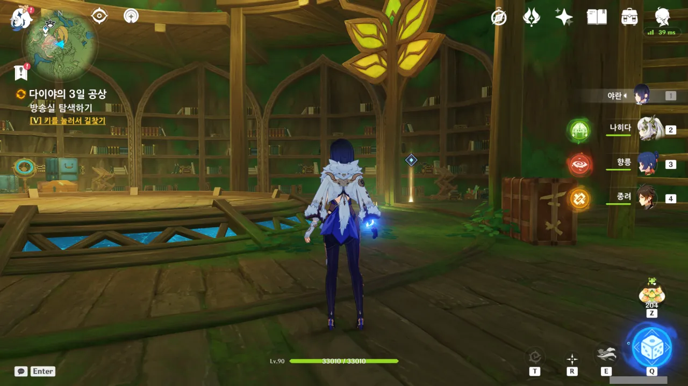

기껏 방송실로 왔지만, 아무도, 아무것도 없었다. 뭐지? 설마 나, 속은 거야?





알고 보니, 암호를 외치면 열리는 비밀문이 바닥에 있었다.

아니, 이건 누가 봐도 그냥 맨바닥이었는데...



좋아, 드디어 다이야를 볼 수 있는 거겠지?





그런데 어째 보이는 건 죄다 방울이들 뿐이다. 설마 지금 다이야는 잠시 자리를 비운 걸까?



가운데 있는 저 커다란 기계는 생긴 것이 마이크처럼 생겼다. 왜, 스튜디오 같은 곳에서 볼 수 있는 커다란 마이크 있지 않은가.



대체 뭘 보여준다는 거지?





「게으름뱅이」 방울이가 1호 위치에서 2호를 조작하자 '다이야의 3일 공상'을 처음 만났을 때 들었던 대사가 들린다.



「부지런쟁이」가 3호 위치에서 7호를 조작하자 이번엔 흑수정호 이야기에 나왔던 내레이션이 들린다.

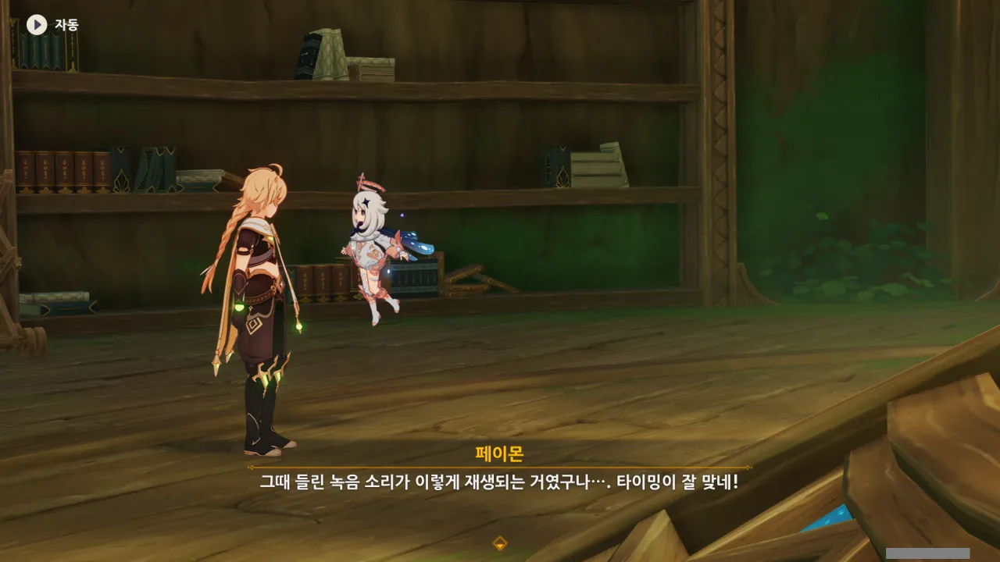

그러니까 지금까지 우리가 들었던 모든 내레이션과 대사는 미리 녹음된 대사를 재생하는 것이었다.

오, 그러면 매번 성우를 부를 필요가 없으니까 인건비를 상당히 절약할 수 있었겠네.



심지어 여기에서 관객과 무대를 모니터링하고 관련 장치를 조작할 수도 있다고 한다.

그러니까 여기가 중앙 통제실이란 거지?





역시나 가 역시나였다. 이곳은 '다이야의 3일 공상'의 모든 연극을 총괄하는 중앙 통제실이었다.

다만 방문객의 이탈이나 돌발 행동에 대한 대응책은 전혀 마련되어 있지 않아, 안내를 따르지 않으면 연극을 온전히 감상할 수 없다고 한다.



연극이 진행됨에 따라 실시간으로 장치를 하나하나 조작하려면 공이 꽤 많이 들 것이다. 게다가 적절한 타이밍에 알맞은 대사도 재생해야 하고...

정말 대단하다고밖에 할 말이 없다.



그런데 다이야는 왜 직접 나서지 않고 아직도 확성기와 방울이로 모든 것을 설명하는 것일까?





어... 그러니까 다이야가 사람이 아니라 하나의 시스템이라고?

연출 장치 조작이나 대사 출력 같은 건 기계적으로 처리할 수 있다고 쳐도, 각본은 대체 그럼 누가 쓴 것일까? 아까 「임시 각본가」라는 말이 나온 것으로 봐선 그런 이름의 방울이가 있다는 것으로 들리는데...

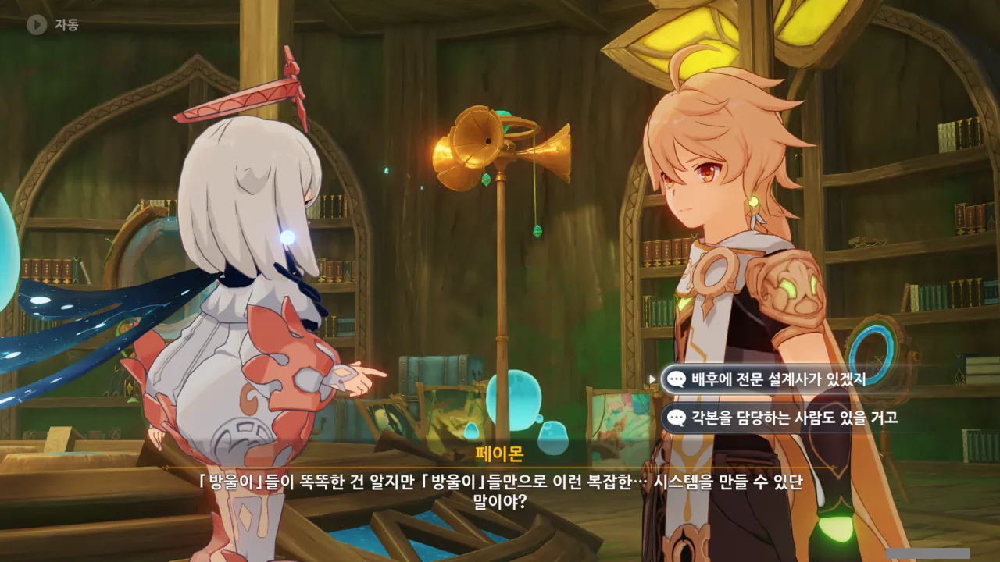

내 말이. 이 모든 것을 방울이들이 처음부터 스스로 만들었을 것 같지는 않다.



여기에도 조시모스의 손이 닿아있었다.









조시모스는 '가장 재미있는 연극'에 집중하느라, 다른 연극에 신경을 쓰지 못했다. 아마 그게 저번에 보았던 쓰다 만 각본들이겠지.

물의 환령들을 가르쳐 직접 연출을 시켜보고, 연극을 만들게 하면 어떨까라는 생각에 닿은 조시모스는 연극에 필요한 이런저런 것들을 물의 환령들에게 가르쳤고, 물의 환령이 이해할 수 있는 언어로 참고용 연극과 상세한 각본 제작 설명서도 썼다.

이디이아 역시 조시모스를 도와 중앙 제어기를 여기에 설치하고, 곳곳에 제어기 단말도 설치했다.

거기서 그치지 않고, 조시모스는 물의 환령들이 방문객들과 원활한 소통을 할 수 있도록 각본 속 대사뿐만 아니라 자주 쓰이는 단어들을 녹음했다고 한다. 그러니까 우리가 지금껏 들었던 목소리는 조시모스의 목소리였던 것이다.

그리고 조시모스의 가르침을 받은 물의 환령들이 참고용 연극을 연출한 것이 여태 경험했던 '다이야의 3일 공방'의 연극이었던 것이다.

&nbsp;

왜 연극의 길이가 짧거나 맥없이 끊겼는지 이제야 알겠네. 조시모스가 쓰다 만 연극의 대본을 갖고 만들어서 그랬던 것이다.



나도 그 장치들이 모두 중앙에서 제어되고 있는 줄은 정말 몰랐다. 그냥 사물로 변한 물의 환령들이 현장에서 내레이션을 듣고 적절히 움직인 거라 생각했거든.



조시모스의 연극과는 또 다른 물의 환령만의 연극은 꽤 신선했다.

사실, 구상도를 이용한 조시모스의 연극보다 훨씬 신선하고 재미있었다.







이들의 다음 목표는 조시모스가 써준 참고용 연극을 넘어 독자적인 연극을 쓰고 연출하는 것이라고 한다.

하지만 그러기 위해선 일단 다양한 자료를 모아 아이디어를 발전시켜야만 한다. 그걸 위해서 방문객들에게 직접 이야기를 듣거나, 방문객과 만난 물의 환령과 대화해 소재를 취한다고 한다. 정말 이리 뛰고 저리 뛰는 것이다.

더 나은 각본을 위해, 여행자와 페이몬 역시 「임시 각본가」에게 이야기를 들려줬으면 좋겠다고 말하는 「다이야」.



그러게. 왜 하필 3일인 걸까? 설마 연극이 3일이라서?



어제, 오늘, 내일이라... 꽤 멋들어진 해설이잖아, 이거.



아니 ㅋㅋㅋ 「내일까지 한참 남았네」,「내일은 컨디션이 더 좋을 거야」, 「내일까지 끝내지 못하면 끝장이야」라서 3일이라니 ㅋㅋㅋ

이러면 너무 불쌍하잖아 ㅋㅋㅋ 마감에 쫓겨서 그런 이름이 붙은 거라니 ㅋㅋㅋ

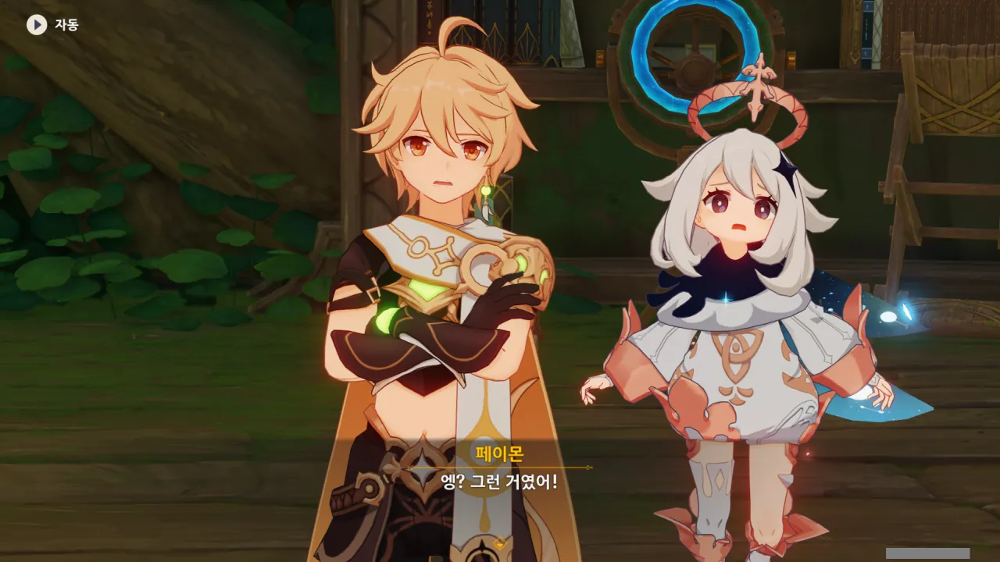

예상치도 못한 뜻에 여행자와 페이몬이 입을 쩍 벌리고 있다.

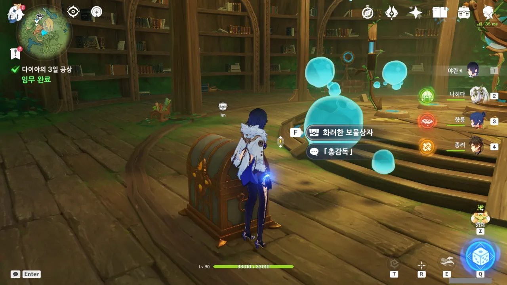

아무튼, 이리하여 다이야의 3일 공상이 끝났다.

하지만 여기서 완전히 끝난 건 아니고, 주변에 있는 방울이에게서 들을 이야기가 더 있다.

***

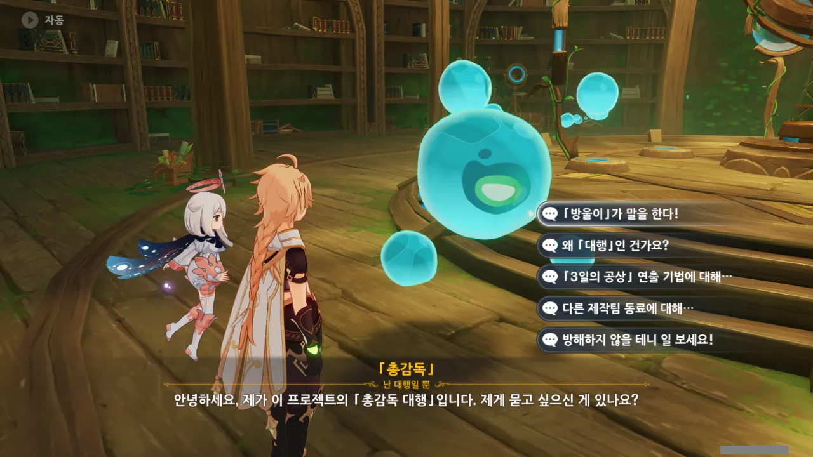

「총감독」 방울이와 대화를 시도하면 이렇게 다양한 대화 선택지를 볼 수 있다.





그러고 보니, 「총감독」과는 대화를 자연스럽게 할 수 있다.

「동공의 저주」 때에는 미리 녹음해 둔 대사를 재생한 거라고 쳐도, 이건 어떻게 된 일일까?

설마 이 녀석들, 사람 말을 할 수 있으면서 귀찮아서 여태껏 말을 안 한 거 아냐?





너 방금 '이디이야'라고 하려고 했지? '다이야'가 어디서 나왔나 했더니, '이디이야'에서 나온 것 같다.

그나저나 이디이아는 정말 손을 대지 않은 곳이 없었구나. 설비도 만들어주고, 대사 녹음까지 해주다니...

지금 하는 대화 역시 미리 녹음해 둔 것이라고 하는데, 녹음된 음성으로 이렇게 여행자와 자연스럽게 대화를 할 정도라면 다음 두 경우 중 하나라는 소리다.

1. 모든 대화의 가능성을 계산해 그에 대응하는 음성을 일일이 하나하나씩 녹음했다
2. 개별 음소를 녹음한 후, 음성 라이브러리에서 이를 조합해 실시간으로 음성을 생성한다  
   보컬로이드가 이 방식을 사용한다

작업의 효율성을 따진다면 후자가 더 가능성이 높겠지만, 텍스트로 대화를 접하는 것이다 보니 어떤 것이 진짜인지는 알 수 없다.



그래. 생각해 보면 여긴 온갖 일들이 태연하게 일어나는 세계 아닌가. 무슨 일이 일어나도 그런가 보다 해야지, 뭐...









총감독은 그저 자신이 총감독 자리에 걸맞다고 생각해서 총감독 자리에 있는 것일 뿐, 자신보다 더 나은 동료가 있다면 아무런 거리낌 없이 총감독 자리를 양보할 것이라고 한다.

실제로도 이들의 관계는 총감독을 위시로 하는 수직적 관계가 아니라, 수평적 관계이다. 제작팀이 총감독에게 거리낌 없이 조언을 하기도 하고, 각본가와 다른 물의 환령이 총감독과의 상의 없이 일을 벌이기도 한다.





난 어느 쪽이던 괜찮다고 생각한다. 어느 하나가 주도권을 잡아 밀고 나가던, 모두가 의견을 하나로 모아 진행하던 말이다.

결국 이 일이 좋아서 하는 것 아니겠는가. 어떤 방식이던 각 구성원들이 합의한 방식이라면 뭐가 어찌 되어도 괜찮을 것이다.

그리고 대화하며 자연스럽게 여행자와 페이몬을 「다이야」로 영입하려고 하는 총감독.





이것저것 전부 여행자에게 떠넘기면 결국 페이몬은 밥순이가 된다는 거네?

이 녀석, 은근슬쩍 자기는 하는 일 하나 없이 여행자에게 이런저런 일을 전부 맡기고 저 혼자 뒤로 쓱 빠지려고 한다. 이 30만 모라 영수증 같으니라고...





하겠다는 말을 한 적 없건만, 어째서인지 여행자 역시 연극 제작에 참여하는 모양새가 되어버렸다.







실제 무대를 완벽하게 만드는 대신, 관객으로 하여금 장면을 상상토록 하는 연출 기법은 꽤 괜찮다고 생각한다. 특히나 이렇게 자원이 한정된 상황에서 말이다.

뮤지컬 영화처럼 모든 무대가 완벽하게 구현된 것은 아니지만, 무대 위에서 하는 연극처럼 관객의 상상력을 이끌어내기 충분한 정도의 무대가 설정되어 있었으며, 관객이 직접 이동하고 참여하도록 하여 정적인 이미지를 타파한 모습이 인상적이었다.



여기서 실소가 나왔다. 그래... 다 돈이 문제지...







연극에 쓰일 무대 배경과 소품을 전부 제작하려면 막대한 자본 혹은 노동력이 필요한 상황.

이 비경 안에 그런 것이 있을 리 만무하다.





그래서 제일 중요한 체험 부분에 집중하고 나머지는 적당히 포기했다고 한다. 그렇게 한다면 최소한 잊지 못할 경험 하나는 챙길 수 있으니까 말이다.

이런 건 완급조절도, 선택과 집중도 된다고 생각한다.

처음에 빈약한 무대를 보여줘서 기대치를 한껏 낮춘 후, 슝슝열차 콘텐츠를 통해 감동을 팍 주는 것이라고 하면 완급 조절에 해당하잖아?



그런데 배우를 출연시키는 대신 내레이션과 대사만 들려준 것은 비용 문제가 아니라 일손이 부족해서였다고 한다.



원래 계획은 각자 맡은 역할을 끝내면 무대 위로 올라가 카메오로 연기를 하기로 약속했으나, 아무도 자신의 역할을 끝내지 못했다고 한다. 그래서 「과몰입쟁이」가 현장에서 다른 방울이들에게 속성으로 연기를 가르치려 한 계획도 그대로 물거품이 되었다고 한다.

그러니까 전형적인 일손 부족으로 인한 연출 변경이라는 말이다.



다들 연기를 하고 싶어 하지만, 각자 맡은 일을 끝낼 수 없어 연기를 하지 못한다니... 안타까운 일이다.









조시모스에게 영향을 받은 방울이들은 제각각 다른 개성을 지니게 되었고, 그 탓에 현재 발성 시스템으로는 각자를 제대로 소개할 수 없다고 한다.

음성 처리라고 한 것을 보면 역시 음소 조합을 통해 대사를 생성하는 모양이다.





아직 음성 처리가 되지 않은 부분을 총감독이 열심히 설명해보려 하지만, 물의 환령의 언어를 알아들을 수 없으니 그냥 허공에 헛손질하는 것으로밖에 보이지 않는다.

이 부분은 그냥 직접 가서 물어보는 것이 더 빠를지도 모르겠다. 거기에 대해서는 음성 처리가 미리 되어있기를 바라자.



***

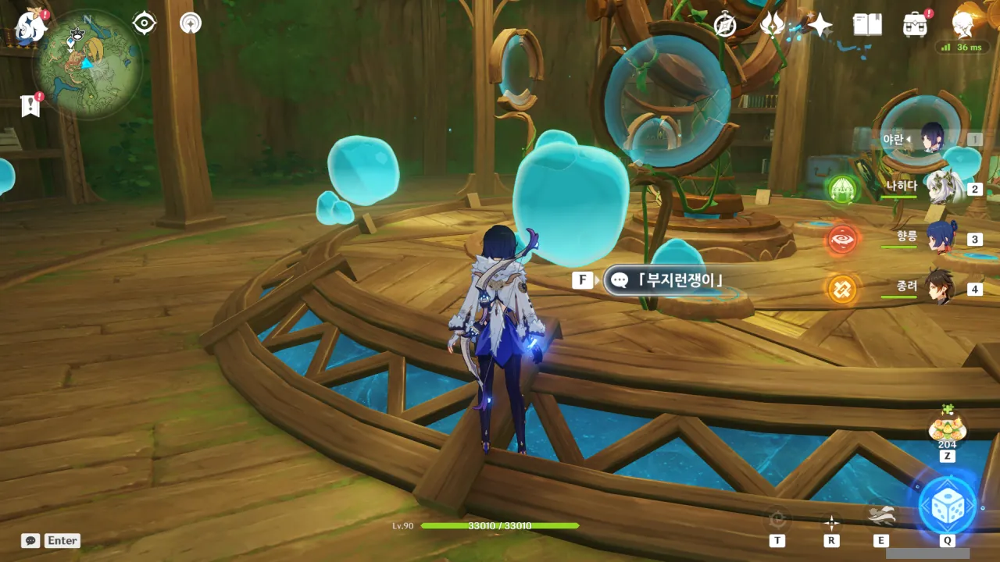

「총감독」 옆에는 「부지런쟁이」가 있다.

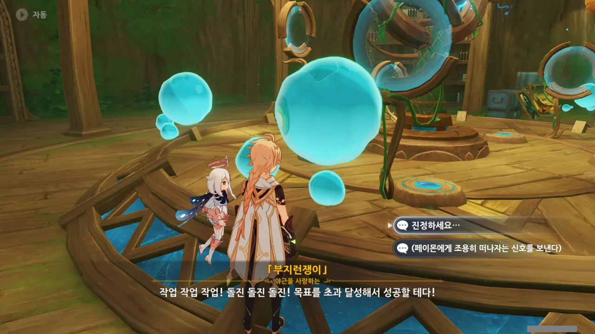

ㅋㅋㅋㅋㅋㅋ 두 번째 선택지가 '페이몬에게 조용히 떠나자는 신호를 보낸다' ㅋㅋㅋㅋㅋㅋ

마치 광인을 본 듯한 선택지가 아닌가. 뭐, 워커홀릭도 따지고 보면 광인이 맞긴 하지...

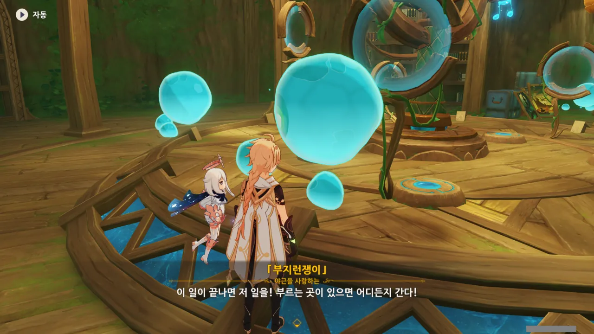

이러니까 진짜 미친 것 같아 보인다. 저기... 괜찮은 것 맞지?





왠지 걸렸다가는 같이 '체험 삶의 현장'을 찍을 것만 같다.



보자마자 하는 말이 '내 일감 가져가라'가 아니라 '내 일감 내놔'라고...?

이 정도면 워커홀릭을 넘어선 무언가로 보이는데...



아무래도 이 방울이를 오해한 듯하다.

이 방울이는 주변 사람까지 삶의 현장으로 끌고 가는 것이 아니라 본인만 이것저것 하느라 바쁜 타입의 워커홀릭인 듯싶다. 그게 남의 일일지라도 말이다...





좋게 말하면 만능이고, 나쁘게 말하면 허드렛일만 도맡아 하는 셈이다.



이 방울이의 목표는 연극에 필요한 모든 것들을 이해하고 완벽하게 소화해 내는 것이라고 한다. 그게 '입만 산 조시모스'를 넘어설 수 있는 길이라고 생각하는 모양.

입만 ㅋㅋㅋ 산 ㅋㅋㅋ 조시모스 ㅋㅋㅋ



대체 옛날에 조시모스와 무슨 일이 있었길래 이러는 것인지 궁금하지만, 왠지 그걸 물어봤다간 여러모로 굉장한 말을 듣게 될 것만 같다.





어우, 뭔가 부담되는 친구네...

심지어 마지막 작별 인사도 "언젠가 두 분에게서 끝없는 일감과 다양한 업무를 받게 되었으면 좋겠네요!"다.

무... 무서워...

***

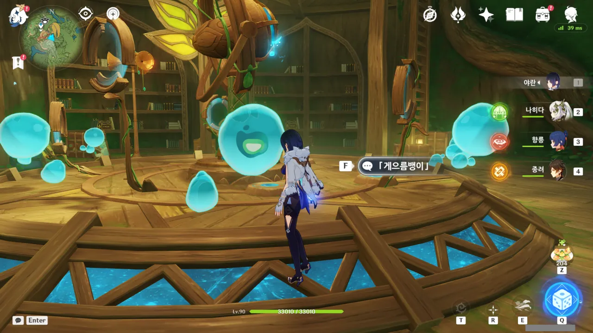

그 옆에는 「게으름뱅이」가 있다. 차라리 이 녀석이 대화하기 좀 더 편하지 않을까...?



가장 편한 해결책을 마련해 주겠다니... 게으름을 피우는 데에 천부적인 재능을 갖고 있다거나 그런 것일까?



아하, 이 방울이에 대해서도 단단히 오해한 것 같다.

독일 군부에서 나온 명언이자 분류법인 '장교의 4가지 유형'이 있다. 거기에서 말하길, 장교는 네 가지로 분류할 수 있다고 했다.

1. 영리하고 근면한 경우
   이른바 '교과서적인 엘리트' 유형. 고급 참모 역할에 적합함.
2. 멍청하고 게으른 경우
   다시 말해 일반인. 나쁘게 말하는 것이 아니다. 적당한 자리에 박아두고 정해진 일만 시키기에 적합함.
3. 영리하고 게으른 경우
   게으름을 피우기 위해 어떤 상황이던 대처할 수 있으므로 최고 지휘관에 적합함.
4. 멍청하고 근면한 경우
   최고로 위험함. 의욕만 앞서 엉뚱한 일을 벌일 가능성이 크므로 신속히 제거할 것.

그러니까 이 방울이의 경우는 세 번째 유형에 속한다고 볼 수 있다. 최소한의 시간과 노력으로 최대의 결과를 내기 위해 노력하는 유형이란 거지.



게으름뱅이가 예시로 든 것은 무대 배경 소품을 입체가 아닌 양면으로만 만드는 것이었다.

소품을 평면으로 만들어, 앞면과 뒷면만 그린다면 소품 제작 시간을 획기적으로 줄일 수 있다. 하지만 그렇게 하면 소품의 옆면이 없어진다.



측면이 없다는 문제는 연출로 때우면 된다고 말하는 게으름뱅이.

열차가 소품의 측면을 지나가려 할 때, 순간적으로 가속해 관객이 소품의 측면을 볼 시간을 주지 않으면 된다고 말한다.

&nbsp;

오, 듣고 보니 그럴듯한데? 실제로도 연극에서 소품이 평면으로 되어 있었던 것에 큰 불만을 가진 적은 없었다.



그러니까 이것도 일종의 선택과 집중이란 이야기다.



그런 의미에서 '게으름뱅이'는 부정의 뜻이 아니라 긍정의 뜻으로 쓰인 단어라고 볼 수 있다. '똑똑하고 게으른' 방울이라는 말이지...

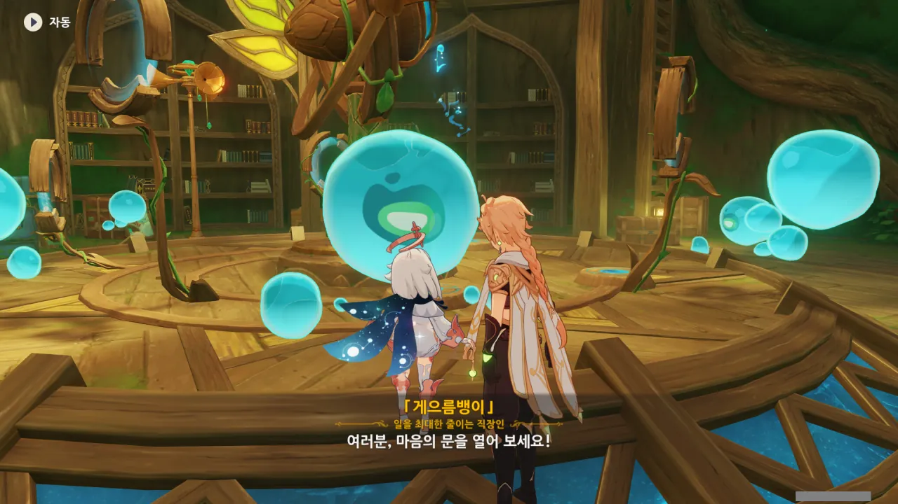

> 여러분, 마음의 문을 열어보세요!

어우, 난 개인적으로 저 대사에 안 좋은 기억이 있다.

원신과 관련한 건 아니고, 디비전 2를 할 때 아론 키너가 하는 대사 중 하나가 바로 "open your mind"였거든. 주인공의 스킬을 해킹해서 전부 못쓰게 만들어놓고서, 자기 혼자 온갖 스킬을 덕지덕지 바르고 나온 후, 주인공을 놀려댈 때 하는 대사가 바로 저 대사이다.



이 녀석도 조시모스를 까기에 바쁘다. '그 멍청한 조시모스' ㅋㅋㅋㅋㅋㅋ

아니, 이 녀석 저 녀석 모두에게 까일 정도라면 조시모스는 어떤 사람이었던 거야...?





아무튼, 이런 게으름도 자원이 부족해서 짜낸 고육지책임을 강조한다.

맞는 말이다. 돈을 충분히 벌었으면 재투자를 해야지, 안 그래?

***

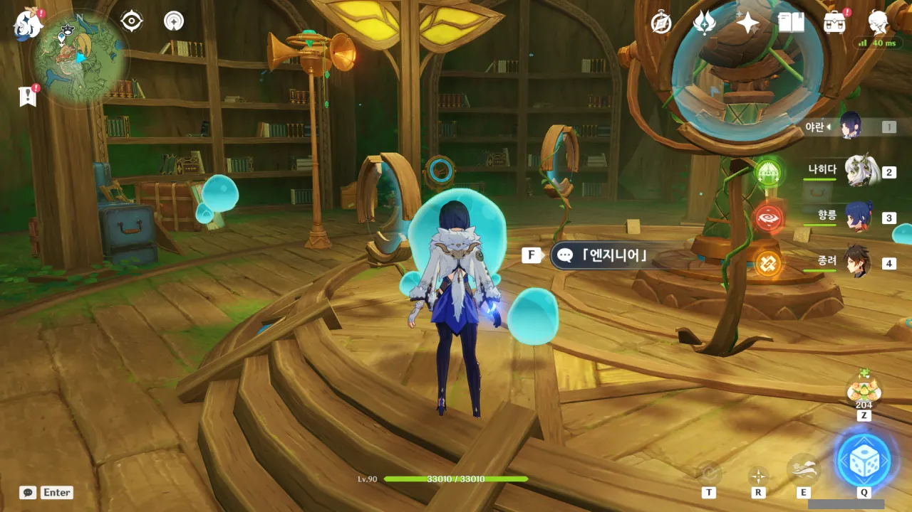

그다음은 「엔지니어」이다.



야근이라도 한 걸까? 이 방울이는 힘이 없어 보인다.

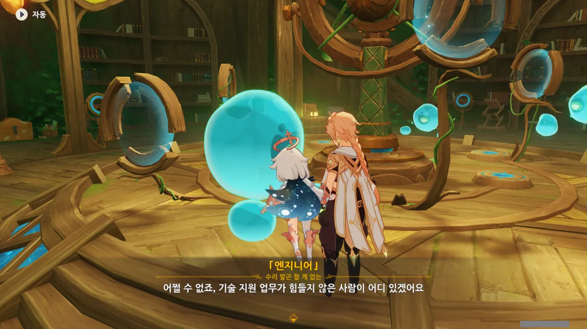

왜 난 이 모습이 굉장히 익숙하다고 느껴지는 걸까?





엔지니어의 말에 따르면, 아카데미아의 일부 연구를 참고해 만든 발성 장치는 설계상의 결함 때문에 때때로 굉장히 번거롭게 될 때가 있다고 한다.



그렇지. 지금까지 「대화」한 모든 방울이와는 전부 저 발성 장치를 통해 대화했었다. 지금 말하고 있는 엔지니어 역시 발성 장치를 통해 대화하고 있는 것이기도 하고.





역시... 내 추측이 맞았어...

발성 장치는 여러 음성 자료를 채집한 후, 단어 하나하나의 음절을 나눠 라이브러리에 저장한 후 조합해 사용하는 방식이라고 한다. 다만 자주 사용되는 대사의 경우 미리 녹음해서 쓰는 것이고.

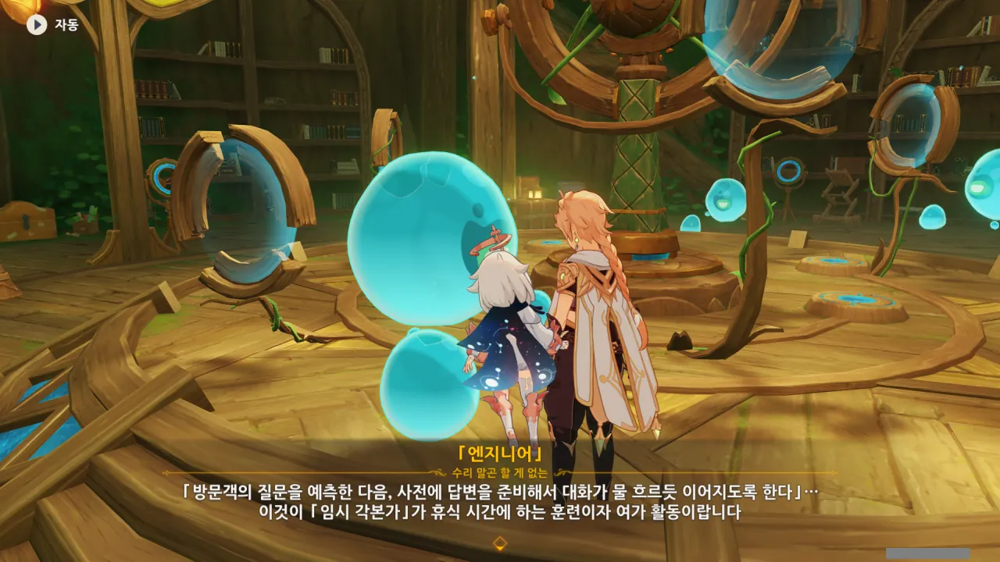

다만 그 합성을 실시간으로 하기에는 무리인지, 「임시 각본가」가 미리 질문을 예측한 후, 그에 대응하는 답변을 미리 준비해 대화가 끊임없이 이어지도록 하는 모양이다.

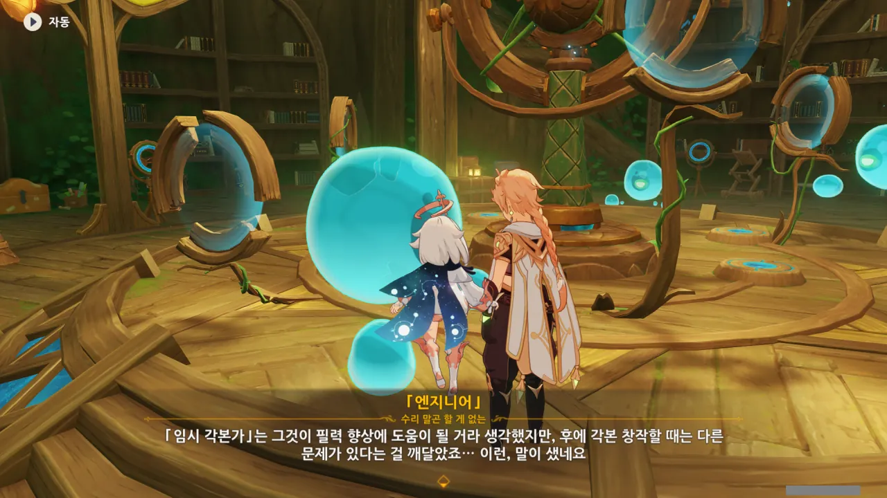

다른 문제가 있었다고...? 그건 나중에 직접 물어보는 것이 더 낫겠다.



그리고 이 모든 라이브러리를 엔지니어가 직접 관리하고 있다고 한다. 어우, 고된 일일 텐데...



그런데 제작팀의 성격이 개성적으로 바뀌면서 그에 따라 음성을 업데이트해야 했다고 한다. 쾌활한 성격에 맞게 쾌활한 목소리를 내게 한다거나 뭐 그런 것 말이다.

그런 건 지금 보이스로이드로도 그리 수월하게 되지 않을 텐데...



저런, 음성 관리 외에도 무대 장치도 엔지니어가 담당한다고 한다. 와! 업무량이 두 배 이상!

어딘가의 장치가 고장 나면 거기로 달려가서 장치를 고쳐야 한다고 한다.



이게 다 조시모스가 엔지니어 혼자에게만 모든 것을 가르친 탓이라고 하는 엔지니어. 모든 것을 혼자 도맡아 하다 보니, 제대로 쉬지도 못하는 상황으로 보인다.





아까 그 부지런쟁이를 조수로 임명하면 어떨까 싶지만, 부지런쟁이가 엔지니어와 관련된 일만 하는 것이 아닌지라 현실적으로 힘들 것 같다.

결국 신입이 들어와야 한다는 이야기인데... 아무래도 요원한 일이겠지...

***

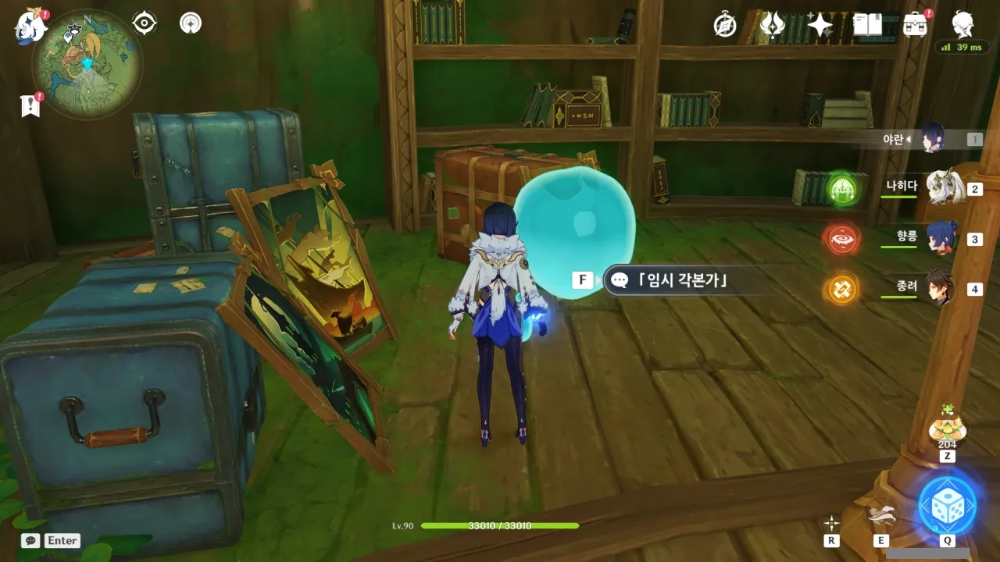

한쪽 구석에는 「임시 각본가」가 위치해 있다.

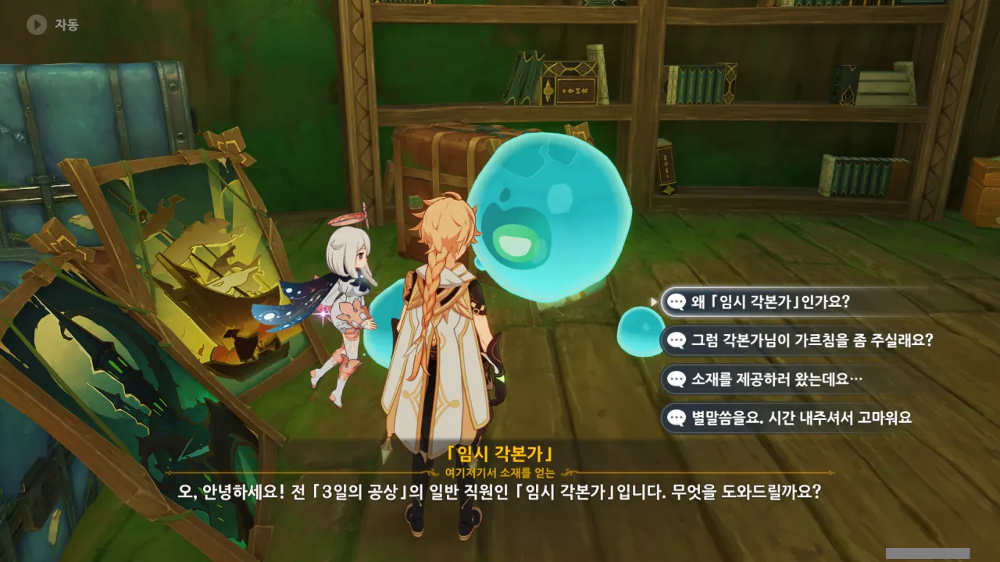

오, 너도 할 말이 많은 녀석이구나.





해고? 해고라고? 여긴 취향이 맞는 방울이들끼리 모여 만든 일종의 동아리 같은 것이라 생각했는데!



> 화려한 문체를 쓰면 관객들이 대사가 굉장히 심오한 것처럼 느낄 수 있거든요...

ㅋㅋㅋㅋㅋㅋ 틀린 말은 아닌데... 그걸 그렇게 대놓고 말해도 괜찮은 거야?



역할 분담에 웬 '적절함'?







그러니까... 현실적으로 어느 정도 구현이 가능한 설정으로만 각본을 짜야한다는 말로 보인다.

각본가의 말에 따르면, 예전에 현실적으로 구현 불가능한 설정 때문에 제작팀 전체의 일정이 꽤 지연되었던 모양.

그러니까 '하늘을 날고 불을 내뿜으며 마을을 불태우는 사악한 용' 이런 설정은 구현이 어렵다는 말이겠지... 하늘을 나는 용 소품도 만들어야 하고, 마을도 불에 태워야 하니까...





그러게. 만약 그렇게 중요한 등장인물이 아니라면 적당히 나무판에 그려서 쓰면 되는 것 아닐까? 앞서 「게으름뱅이」가 말한 것과 어느 정도 상통하는 면이 있는 것 같은데...





조시모스가 가져온 책에 따르면, 그런 방식은 '용서받을 수 없을 정도로 형편없는 연출'이라고 한다. 기껏해야 분량 적은 엑스트라에게나 쓸 수 있는 방법이라고 한다.

움직이지 않는 배우를 관객 앞에 세워놓고 수다만 떨 바에는 차라리 아무것도 놓지 않는 것이 낫다고 하는 각본가. 비유가 촌철살인급이다.



잔뜩 흥분해서 뭐라 열심히 말하는데, 정작 그 음성이 마련되어있지 않아 허공에 열심히 손만 흔드는 꼴이 되어버렸다.



어찌 되었건, 본인만의 확고한 길이 있다는 것은 분명 좋은 일이다. 그 방향을 끝까지 고수해 나아갈 수만 있다면 그것 역시 「정의」라고 할 수 있지 않을까?





음... 아마 조시모스 본인은 그 책을 제대로 읽지 않았을 것만 같다. 「조시모스」를 만났을 때를 생각해 본다면 말이다...







아, 가끔 그런 사람이 있다. 누군가가 자신에게 '님'자를 붙이면 비꼬는 것처럼 들린다는 사람이 가끔 있더라고.

정작 '님'을 붙여 부른 사람은 별 생각이 없었거나, 단순히 존중의 의미로 그렇게 부른 건데 말이지.

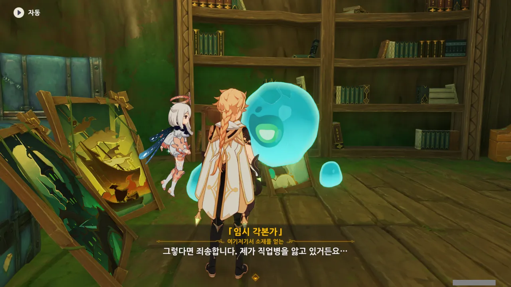

직업병? 웬 직업병?





아, 이것도 무슨 말인지 알 것 같아.

황순원의 「소나기」에 등장한 도라지꽃의 '보라색'이 죽음을 뜻하는 것 아니냐는 해석이 있는데, 작가 본인이 그 뜻을 알리지 않은 채 타계한 마당에 정답이 있을 리 만무하다.

그런 식으로 작가가 의도치 않은 해석이 덧붙여져서 비난받는 상황을 이야기하는 것으로 해석했다.



맞아. 그럴 땐 벤티처럼 ["에헤~"](https://youtu.be/1exK34r_BaU) 하고 웃으면 되는 것이다. ~~에헤떼난다요~~



초연? 웬 초연?





아, 그냥 '비판은 적당히 걸러들어라'라는 말이었다.

그게 쉽지 않긴 하지...





이 부분을 어디서 많이 들어봤다 싶었는데, 이전 대화에서도 끝마무리가 이런 대사로 끝났었다.

처음 말을 걸 때에만 대사를 돌려쓰는 줄 알았는데, 대화를 마무리할 때에도 대사를 돌려쓰는구나...







그러고 보니 각본가에게 우리 이야기를 들려달라는 부탁을 받았었다.



이야기를 잊어버릴까 걱정해 이야기를 녹음하는 각본가. 준비성이 좋은걸?



에... 뭐 그럴 것 까지야...



나도 기대되긴 하네. 우리가 그 이야기를 볼 날이 올진 잘 모르겠지만...



***

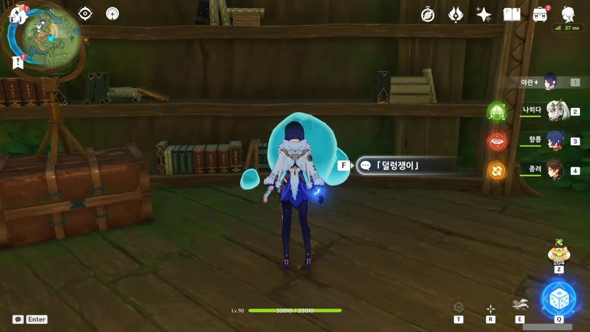

다른 구석에는 「덜렁쟁이」가 있다.



아, 여기서부터는 원신 제작자도 대사를 추가할 기운이 없었나 보다. 짤막한 상황 설명이 전부네.

이 녀석은 자신이 쓸 제어대조차 덜렁대며 잃어버려 말조차 할 수 없는 상황이다.

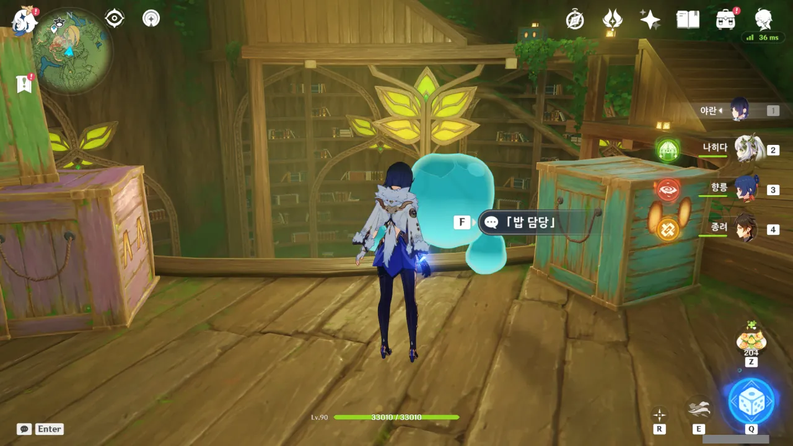

「밥 담당」? 여기에도 페이몬이 있었던 것일까?



아마 페이몬처럼 뒤에서 아무것도 안 하고 밥만 먹는 그런 역할 아닐까? 분명 그럴 것이다.

***

아우, 이제 진짜로 이벤트 끝! 정말 힘들었어...
