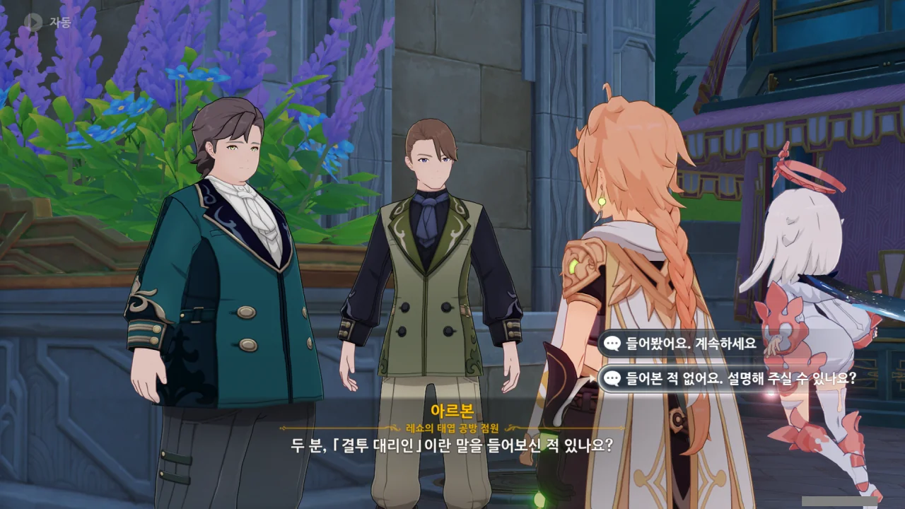
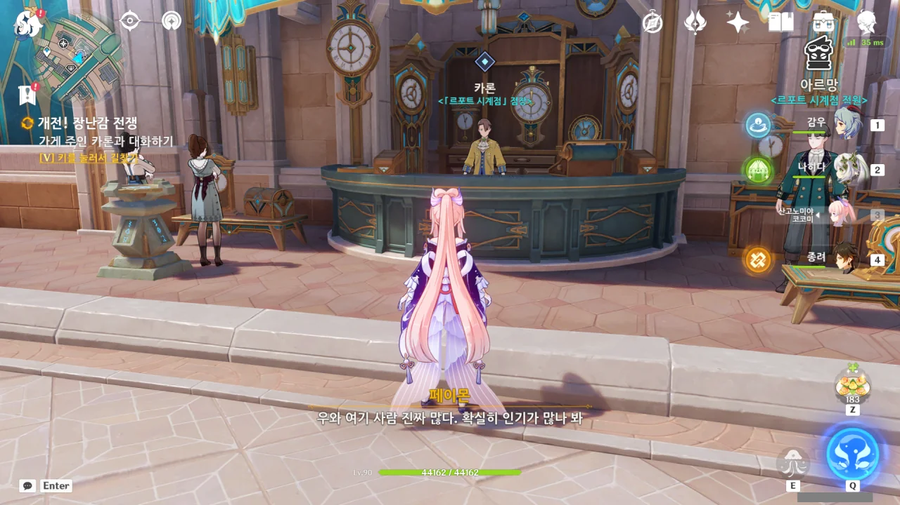
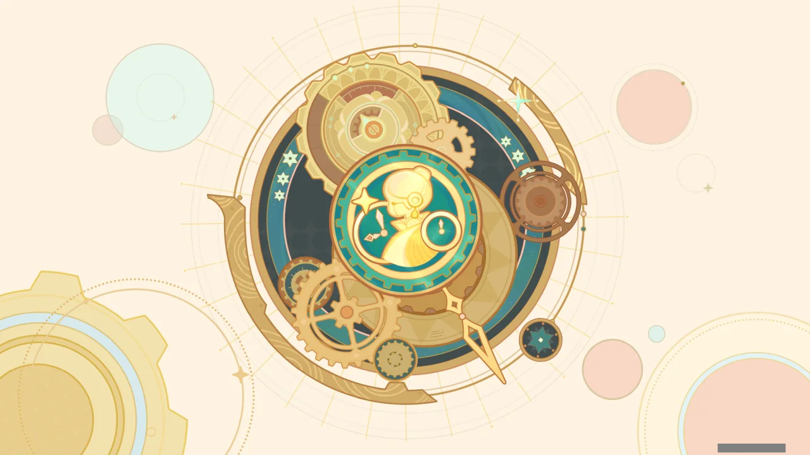
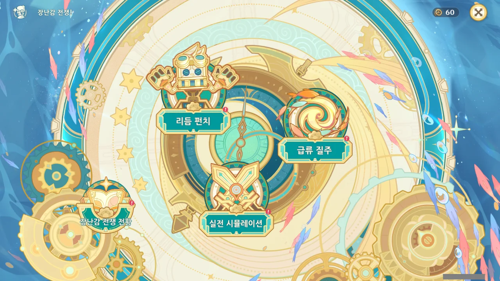
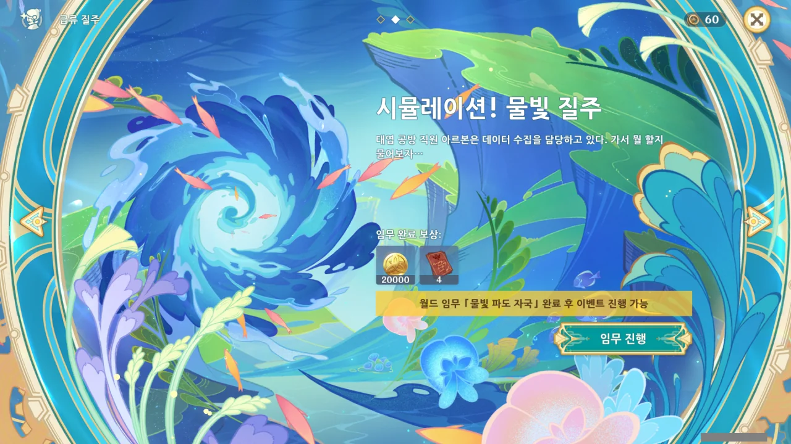

이벤트 기간이 얼마 남지 않은 지금에야 이벤트를 시작한다. 이거, 완전 스피드런 아니냐?





레쇼의 태엽 공방 점원인 아르본과 알베르가 "정말 싫다"를 중얼거리고 있다.

그러면서 '푸리나가 심판석에 앉은 것과 다름없다'는 말을 하는데... 분명 좋은 뜻은 아니겠지.







'푸리나가 심판석에 앉은 격'이 대체 무슨 말인지 물어보자, 재미있는 이야기가 나왔다.

일반적으로 폰타인의 심판석에는 최고 심판관이자 공명정대, 엄격, 근엄, 진지 --- 긍정적 의미로 --- 의 아이콘인 느비예트가 앉게 된다. 하지만 자국민에게 "물의 신님이 심판을 알 리가 없잖아!"라는 소리를 대놓고 듣는 푸리나가 느비예트 대신 심판석에 앉아 있다면? 누구라도 '아, 이건 파국이다'라고 생각할 것이다. 페이몬이 말한 '허위광고' 역시 이것과 일맥상통한다 볼 수 있다.

&nbsp;

그나저나 폰타인에서 푸리나의 이미지는 완전 허접이었구나. 「마스코트」도 꽤 심한 --- 하지만 매우 합당한 --- 소리라고 생각했는데, 아예 '심판석에 있어서는 안 될 존재' 취급이잖아.

뭐, 그게 다 자업자득 아니겠는가?





이야, 난 벌써 이 둘이 마음에 들었다. 이 둘을 스탠딩 코미디에 세워두면 아주 재미있을 거야.

> 당연히 안 괜찮죠. 물의 신님은 이런 농담을 *<u>정말 좋아하시거든요.</u>*
> 그분이 들으시면 저를 돌에 묶어서 호수로 던진 다음 흥미진진하게 구경하실걸요.
> 하지만 그럼 아마 입만 산 아르본은 물 위에 입만 둥둥 뜰 거예요.
> *<u>「살았구나!」 물의 신님은 분명히 신나서 박수를 치시겠죠. 「정말 낭만적이야!」라며 살짝 눈물을 흘리실 수도 있고요.</u>*
> *<u>잘하면 제게 「폰타인 낭만 시민」 훈장을 내리실지도 몰라요.</u>*

내가 이런 개그를 정말 좋아하거든. 비꼬는 듯 아닌 듯 묘하게 말하는 저런 개그가 난 정말 좋다.





와우. 지금껏 만난 사람들은 전부 페이몬을 '페이몬'이라고 불렀지, '페이몬 양'이라고 부르진 않았는데...



아무래도 공방 사장이 모험가 길드에 '최근 폰타인에서 활약 중인 대단한 모험가'를 찾은 것 같다.

페이몬과 여행자는 이 나라 저 나라를 돌아다니며 굉장한 업적을 쌓았으니, 대단한 모험가가 맞긴 하다.



아무렴요, 페이몬 양.

아우, 이거 낯간지러운데 묘하게 중독성이 있네...





「결투 대리인 프로젝트」? 설마 여행자가 결투 대리인과 싸워야 하는 건가?

저번에 마신 임무에서 타르탈리아가 결투 대리인을 언급한 일 때문에, 자꾸 타르탈리아가 떠오른다.



「결투 대리인 프로젝트」는 폰타인의 결투 대리인을 주인공으로 한, 새로 개발할 예정인 장난감 프로젝트라고 한다.

'레쇼의 태엽 공방'이라길래 시계 공방인 줄 알았는데, 장난감 가게였나 보다.

저번에 타르탈리아에게서 「결투 대리인」에 대한 설명을 듣긴 했지만, 같은 정보라도 다른 출처에서 들으면 새로운 정보를 얻을 수 있을지도 모르니, 한번 더 듣기로 했다.



이벤트 임무라서 그런가, 그렇게 자세하게 이야기해주진 않는다. 오히려 타르탈리아의 설명이 더 자세했어...

> 분명히 장난감 판매보단 어려울 겁니다.

당연히 어렵겠지, 이 사람아! ㅋㅋㅋ



공방 사장은 「결투 대리인」 제도를 폰타인 문화의 상징이라 생각해, 이를 주제로 장난감을 만들면 대성할 거라고 믿고 있다고 한다.

다만 그게 다른 나라에서도 잘 팔릴지는 모르겠다. 다른 나라는 재판을 공연처럼 생각하지도, 「결투 대리인」 제도가 있지도 않으니까. 훈장은 너무 큰 욕심이고.





결투 대리인의 데이터를 얻기 힘들기 때문에, 꿩 대신 닭이라고, 결투 대리인과 비슷한 일도 한다는 '대단한 모험가'의 데이터를 대신 쓰기로 했다고 한다.

이거야말로 허위광고, 푸리나가 심판석에 앉은 꼴 아냐? 모험가 데이터를 기반으로 만들었는데 그게 어떻게 「결투 대리인 프로젝트」야? 그건 그냥 「모험가 프로젝트」라고.



'바다 이슬 꽃을 버즘나무에 접목하는 것', '나무 기둥을 돌기둥으로 바꿔치기하는 것'이라고 말하지만, 죄다 헛소리다. 접목은 두 개체의 장점을 모두 가진 새로운 개체를 만들기 위한 것이고, 나무 기둥을 돌기둥으로 바꾸면 무단 설계 변경이다.

「결투 대리인」이라는 이름을 쓸 거면, 결투 대리인의 데이터가 조금이라도 들어가야 하는 거 아냐? 그래봤자 허위광고에서 벗어나진 못하겠지만.



저렇게 NPC가 옆으로 삿대질하는 모션은 「카리베르트」에서 처음 나왔는데, 이후 미호요가 삿대질에 재미가 들렸는지, 잊을만하면 NPC가 저렇게 삿대질을 한다.

원신에서 최초로 삿대질을 한 NPC, 아이드는 그 이후 원신 맵스에서 아이템이 어디에 있는지 알려주는 역할로 잘 쓰이고 있다. 처음에는 지경 팬아트가 사용되었지만, 엄연히 저작권이 따로 존재하는 팬아트라서 그런지, 아이드의 삿대질이 나오자 순식간에 자리를 빼앗겼다.







아르본이 페이몬에게 '먼 길을 걸어 「여행자 장난감 상점」에 도착했는데 정작 상점에서 여행자 장난감이 아닌 아르본 장난감만 판다면 어떨 것 같냐'라고 설명한다.

하지만 시계점은 장난감만 파는 게 아니라, 시계와 장난감을 같이 팔고 있을 공산이 높다. 오히려 저 비유에 걸리는 건 '레쇼의 태엽 공방'이다. 결투 대리인을 소재로 한 장난감을 만들 때 모험가의 데이터만을 썼으니 말이다.



그걸 지적하자, '수정 소라 케이크에는 수정 소라가 없지 않냐'라며 말을 돌린다.

이야, 이 사람들, 말 참 잘하네. 장난감 가게 직원이 아니라 어디 어용 언론 같은 곳에서 일했다면 훌륭한 나팔수가 되었을 것이다.



이젠 아예 '시계점에서 앞으로 시계를 팔지 않을 것이다'라는 말도 안 되는 추측성 궤변을 펼친다.

이렇게 이야기하다간 끝이 나지 않을 것 같으니, 그냥 본론으로 빠르게 넘어가는 게 낫다.



옆에 있는 르포트 시계점을 정탐해, 그곳 사장이 몬드에서 영감을 얻었다는 신규 장난감에 대해 알아봐 달라고 말한다.



일몰 열매보다 4배 달콤한 향기...? 나, 이거 어디서 한 번 들어본 것 같은데... 설탕과 이야기할 때였나, 그게?



왜 직접 가지 않냐고 물으니, 체면 때문이라고 한다.

뭐, 모험가가 하는 일이 다 그렇지. 모험가가 말이 좋아 '모험가'이지, 사실 '심부름꾼' 아니던가.



사장에게 보고를 올리러 가야 한다고 하니, 어쩔 수 없다. 마침 그 장난감이 어떤 장난감인지도 개인적으로 궁금하기도 하고.



보고를 하러 가는 건 아르본 혼자인가 보다.

손님 하나 없이 휑하던 '레쇼의 태엽 공방'과 달리, '르포트 시계점' 앞에는 손님이 많이 있다.



거짓말은 하지 않았다. 그 장난감이 뭔지 궁금해서 온 것 역시 맞으니까.



하지만 오자마자 시계점을 염탐하러 왔단 걸 곧바로 들켜버렸다.

그런데 '레쇼의 태엽 공방' 사장이 '르포트 시계점' 사장과 서로 형제 관계였다는 건 처음 듣는데?



시계점 점장, 카론은 여행자가 시계점을 염탐하러 왔단 걸 여행자 일행이 레쇼의 태엽 공방 앞에 있다가 온 걸 보고 알았다고 한다. 눈썰미가 대단한 사람이다.



그러게. 나도 동종업계 종사자끼리의 경쟁인 줄로만 알았는데, 형제간의 경쟁이었다니.

페이몬이 '동족상잔'이라는 부적절한 단어를 썼지만, 카론은 '사람도 부품이 버벅대는 장난감처럼 정비가 필요할 때가 있다'라며 관대하게 넘어간다.

그런데 이렇게 형제끼리 치열하게 다투는 걸 뭐라고 부르더라? 나도 정비가 좀 필요한 것 같다.





카론은 산업 스파이나 다름없는 여행자 일행에게 흔쾌히 장난감을 보여준다. 장난감은 개인적인 취미이고, 본업은 대대손손 이어져온 시계점이라고 한다.

> 장난감이란 기쁨을 가져다주는 물건이니까 더 많은 사람에게 알리면 기쁨이 더 널리 퍼지지 않겠어?

장사치는 으레 제 이익만 생각한다고 생각하고 있었는데, 정말 따뜻한 마음씨를 가진 상인이다.



얼마 전 몬드로 여행을 갔을 때 만난 모험가의 이야기를 장난감으로 만들었다는 카론. 생긴 건 구슬 추첨기처럼 생겼는데... 대체 뭘까?



'레쇼의 태엽 공방'에선 이 장난감을 연금술로 만든 것이라 추측했는데, 그냥 단순히 모험가를 소재로 만든 장난감이라고 한다.

카론이 인상 깊게 생각한 모험가는 과연 누구였을까? 몬드의 모험가 중 단순 배경 NPC를 제외하면 피슬과 베넷이 있긴 한데, 이 둘 모두 한 인상 하는 캐릭터라 잘 모르겠다.



장난감을 얼른 체험해보고 싶지만, 일단 의뢰를 먼저 해결해야 한다. 조금 있다 다시 오는 거로 하자고.



가게 이름이 '레쇼의 태엽 공방'이길래, 사장의 이름이 '레쇼'일 거라 생각했는데, '리브르'였다.

사장의 이름이 '리브르 레쇼'일 가능성이 있긴 하지만, 대대로 이어져 내려왔다는 '르포트 시계점'의 점장 카론과 리브르가 서로 형제지간임을 생각하면, 리브르의 이름은 '리브르 르포트'일 가능성이 더 커 보인다. 뭐... 둘이 이복형제라면 말이 또 달라지겠지만...

그런데 리브르는 왜 카론과 형제 사이였단 걸 미리 말해주지 않은 걸까? 괜히 갔다가 개쪽만 당했잖아.





카론과 리브르가 서로 형제지간이란 정보 역시 미리 알려줬어야 했지만, 아르본과 알베르가 까먹고 알려주지 않은 것으로 보인다.

둘이 사이좋게 "이런 놈과 형제라니요!"라고 하는 모습을 보면, 저 둘은 분명 형제가 맞다.



설마 아무것도 알아내지 못한 거냐고 리브르가 걱정하지만, 카론이 스파이라도 상관없다며 넘어간 덕분에 임무를 실패하진 않았다.

뭐 눈에는 뭐만 보인다고, 만약 카론이 리브르에게 스파이를 보냈다면 --- 스파이를 보낼 사람은 아니지만 --- 리브르는 그 스파이를 쫓아냈을 것이다.





카론의 장난감이 모험가 장난감이라고 말하자, 리브르는 아직도 모험가 타령이냐며 자신의 결투 대리인 프로젝트가 완성되면 그 인기도 곧 끝날 것이라고 말한다.

글쎄... 그렇다고 말하기에는 이미 첫 단추부터가 글러먹은 것 같은데. 리브르의 프로젝트 역시 모험가를 소재로 하고 있지 않은가. 표절 소리나 듣지 않으면 다행일 것이다.





리브르는 '스토리에 문제가 있는 건 중요하지 않다', '그럴듯한 거짓말과 함께 상품을 파는 것이 포장이다'라고 말한다. 그러면서 그걸 시장에서 먹히는 전략이라고 말하는데, 그가 간과한 것이 하나 있다.

그가 말했듯이, 거짓말도 진짜 그럴듯해야 포장이라고 할 수 있다. 하지만 리브르의 장난감은 카론의 장난감과 마찬가지로 모험가를 소재로 했으니 어느 정도 유사성을 띌 수밖에 없고, '결투 대리인의 성장 스토리'라는 거짓말의 설득력이 떨어지게 된다. 사람들의 눈에는 리브르의 장난감이 '표절 논란을 피하기 위해 되지도 않는 거짓말로 홍보한 표절 장난감'으로 보일 것 같은데, 누가 표절 장난감을 사겠는가?





아르본과 알베르가 「2인 희극」을 주제로 만든, 정말 진짜 같은 장난감 꼭두각시라면 어떨 것 같냐고 묻는 리브르와 거기에 같이 맞장구를 치는 아르본과 알베르. 셋이 정말 죽이 잘 맞는다. 누가 보면 진짜 아르본과 알베르가 장난감 꼭두각시인 줄 알겠네.



동생은 '상인'인데 형은 아무래도 '장사치'인 것 같다. 너무 교활해. 보통 저런 경우는 그 교활함이 제 발등을 찍더라고.



아무튼 두 형제 사이의 싸움에는 큰 관심이 없다.

여행자는 그저 '모험가의 데이터'를 제공할 뿐이니, 이 의뢰 자체에는 위법 요소가 보이지 않는다. 표절 논란은 리브르가 감당해야 할 일이고. 돈만 제대로 주면 된다고.

이번 이벤트의 주 콘텐츠는 '리듬 펀치', '급류 질주', '실전 시뮬레이션'인 것 같다.

아니, 근데 왜 이게 월드 임무 때문에 잠겨있는 거야?!
