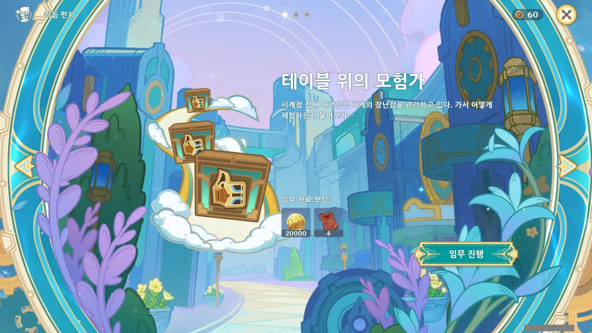
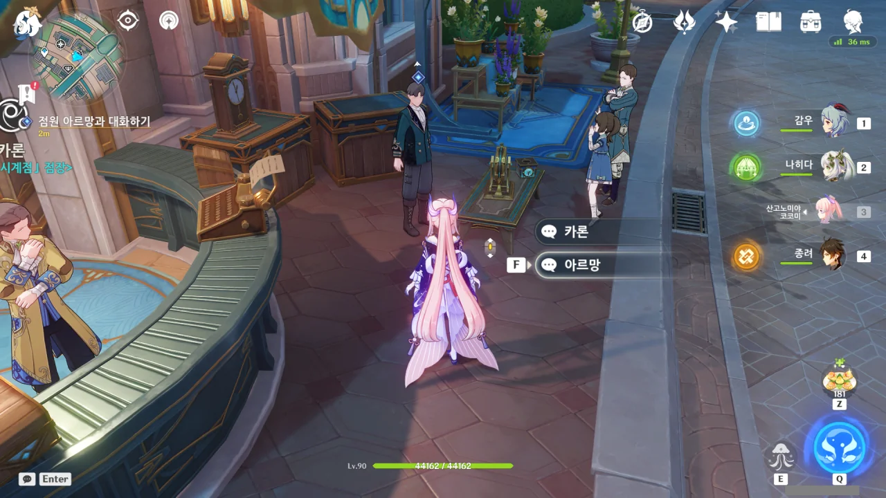
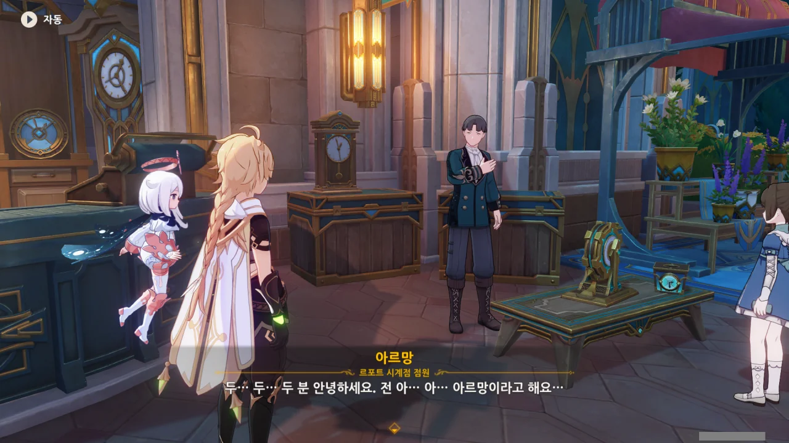
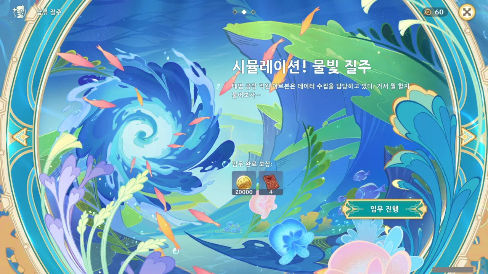
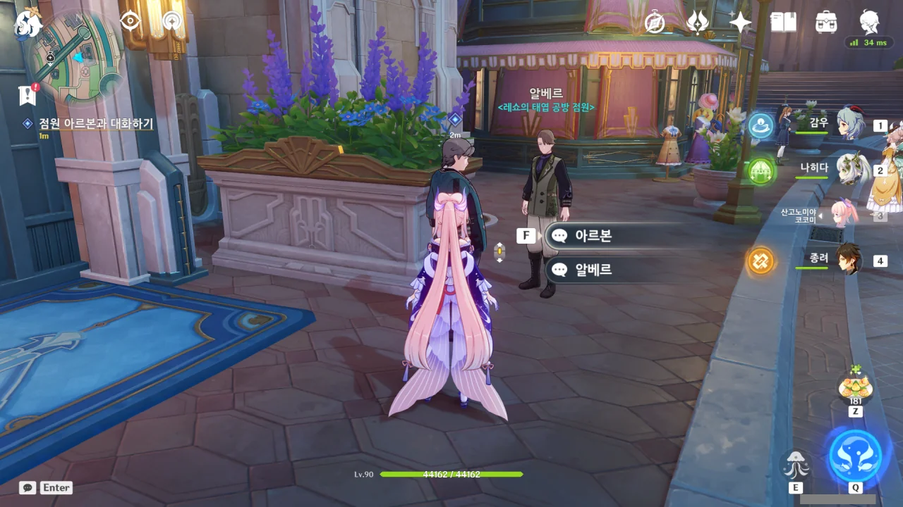
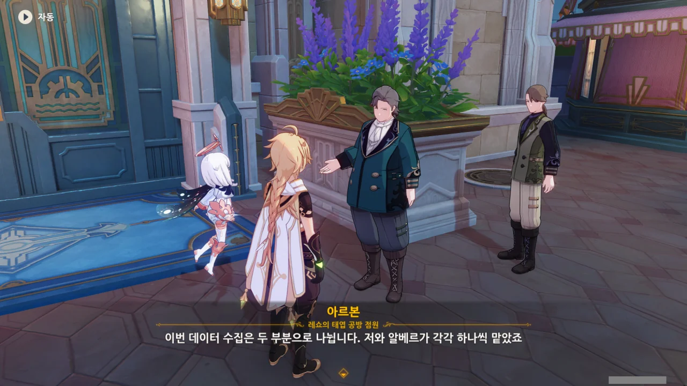
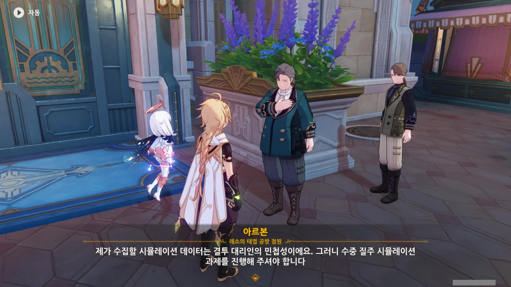
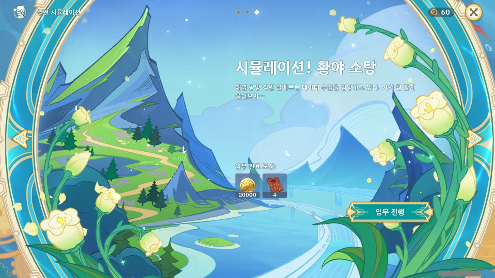
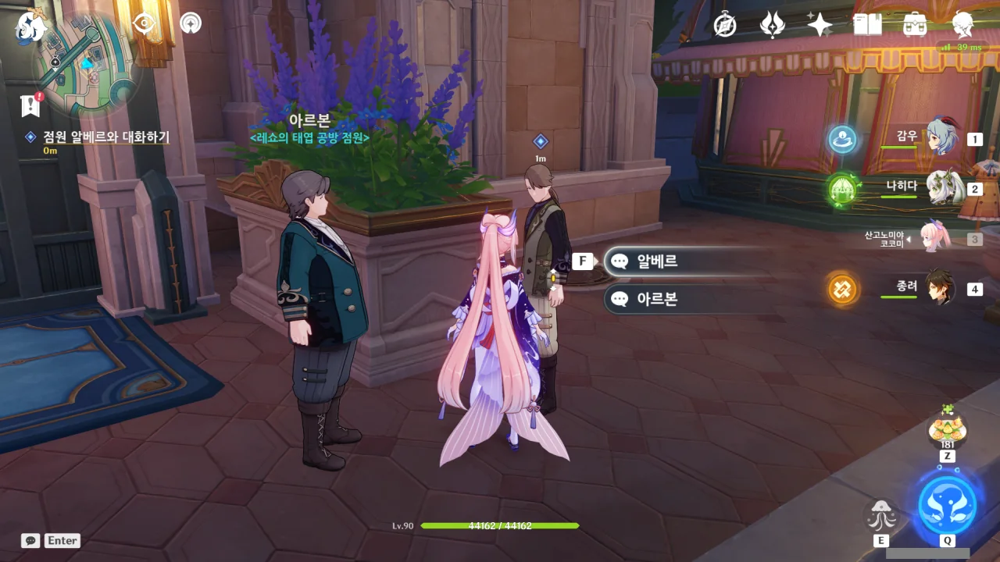

이번 이벤트의 주 콘텐츠에는 '리듬 펀치', '급류 질주', '실전 시뮬레이션' 이렇게 세 가지가 있다.

물론 각 콘텐츠마다 여행자가 왜 이걸 해야 하는지에 대한 짤막한 스토리가 붙어있다. 그게 바로 보조 임무이다.

# 테이블 위의 모험가{id="dance-dance-resolution"}

첫 번째로 살펴볼 것은 '리듬 펀치'의 스토리이다.

'르포트 시계점' 옆에 시계점 점원이 한 명 서있다. 그의 앞에는 카론이 만들었다는 장난감이 하나 놓여있다.

저번에 카론이 장난감 갖고 놀기를 권유했을 때, 임무 보고가 먼저라서 나중으로 미뤘던 적이 있는데, 이번에 저 장난감을 갖고 놀게 되나 보다.

'르포트 시계점' 점원의 이름, 아르망을 '레쇼의 태엽 공방' 점원의 이름인 아르본과 순간 헷갈렸다.



사람이 많으면 긴장해서 말을 더듬는 사람이 용케도 가게 앞에 나와 있다. 정말 대단한 용기인걸.



오, 장난감에 설명서까지 있다니. 생각보다 본격적이다.

장난감에 설명서라고 하니, 옛날에 즐겨 먹었던 '에그몽'이라는 초콜릿이 생각난다. 달걀 모양의 초콜릿 안에 노란색 플라스틱 캡슐이 있고, 그 안에 간단한 수준의 장난감 부품과 조립 설명서가 있었던 것으로 기억한다.

비록 간단한 수준의 장난감이긴 했지만, 내가 뭔갈 만들고 완성한다는 기분 하나 때문에 좋아했던 과자였는데, 이제는 단종되어 더는 나오지 않는 과자라고 한다.



설명서가 있기는 해도, 간단한 수준의 장난감이라 굳이 설명서를 읽지 않아도 좋다고 한다.

오히려 좋아. 장난감의 원리를 직관적으로 깨닫지 못한 사람들은 설명서를 읽으면 되니까.



'리듬 펀치'는 말 그대로 리듬 게임이었다. 레인이 두 개밖에 없고, 짧게 누르는 것과 길게 누르는 것 정도의 노트밖에 없는 정말 간단한 리듬 게임이다.

내가 리듬 게임을 하면서 100% 퍼펙트를 찍어본 건 이번이 처음이다.

# 시뮬레이션! 물빛 질주{id="torrential-turbulent-charge"}

그다음은 '시뮬레이션! 물빛 질주'이다. 방금 전 '물빛 파도 자국' 월드 임무를 완료하고 온 터라, '물빛' 단어만 봐도 움찔하게 된다.

'레쇼의 태엽 공방'의 아르본에게 말을 걸면 된다.



보면 볼수록 버질과 비교되는 사람이다.

버질이나 아르본이나 혓바닥이 매끄러운 건 동일하다. 하지만 버질은 실수로 내뱉은, 상대방을 깔보는 본심을 덮기 위해 혓바닥을 굴리고, 아르본은 상대방의 기분을 좋게 만들기 위해 혓바닥을 굴린다.

페이몬이 "너 알랑방귀 잘 뀐다!"라고 하자, 능청스럽게 "이런, 미움을 받다니 슬프군요."라고 부드럽게 넘어가지 않는가.

아, 그래, 맞다. 이번 의뢰는 「결투 대리인 프로젝트」에 쓸 데이터 때문이었지.

결투 대리인의 민첩성과 수중 질주 시뮬레이션 사이에 대체 무슨 연관이 있는 걸까?



> 그냥 사장님이 이게 멋질 것 같다고 하셔서요.

아, 그래그래. 리브르에게 이것에 대해 따지면 분명 포장이니 뭐니 하며 번드르르한 말만 해대겠지.



원래 계획은 장난감 팔 안에 열 가지 발사 장치를 달아서 물대포를 쏘게 하는 것이었는데, 원가가 너무 많이 들어가서 포기했다고 한다.

대체 리브르에게 있어 결투 대리인이란 뭘까...?



이번 이벤트에서 제일 인상 깊었던 것이 바로 이 '급류 질주'였다. 매번 윈드 필드니 뭐니 하는 것만 이용하다가 물속을 자유자재로 돌아다니니, 정말 재미있더라고.

# 시뮬레이션! 황야 소탕{id="efficacy-testing-simulation-arena"}

마지막으로 볼 것은 '시뮬레이션! 황야 소탕'이다.

마침 알베르가 아르본 옆에 있어, 찾아가는 수고를 덜었다.





알베르는 이 프로젝트에 가망이 없다고 생각한다. 내가 봐도 그렇긴 해.

결투 대리인을 소재로 했다면서 정작 참고하는 건 르포트 시계점과 동일한 모험가이고, 결투 대리인을 소재로 했다기엔 팔에 물대포 같은 것이 달리는 허황된 이야기뿐이다.

이게 성공하면 그게 더 이상한 일일걸?





결투 대리인의 전투력을 시뮬레이션하기 위해, 야외에 마물이 모인 지역을 몇 군데 돌아다니며 마물을 소탕해야 한다.

그리 나쁘지 않았다. 여태껏 했던 마물 소탕 임무의 경우, 임무 지역 사이를 윈드 필드를 이용해 날아다니며 이동해야 했는데, 그게 솔직히 좀 귀찮았거든. 하지만 이번엔 조금만 걸으면 바로 다음 지역이 나와서, 날아다니는 수고를 덜 수 있었다.

***

P.S.

이것도 '레쇼의 태엽 공방'에서 파는 장난감인 걸까? 차라리 이걸 주력으로 파는 게 더 나을 것 같은데...
