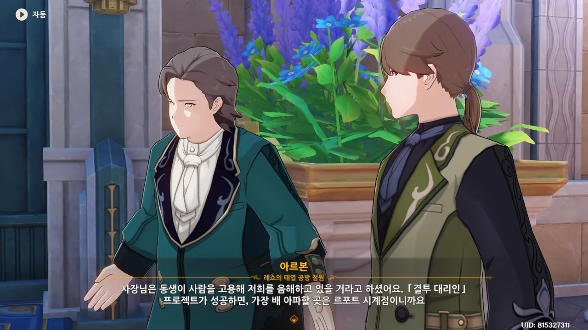
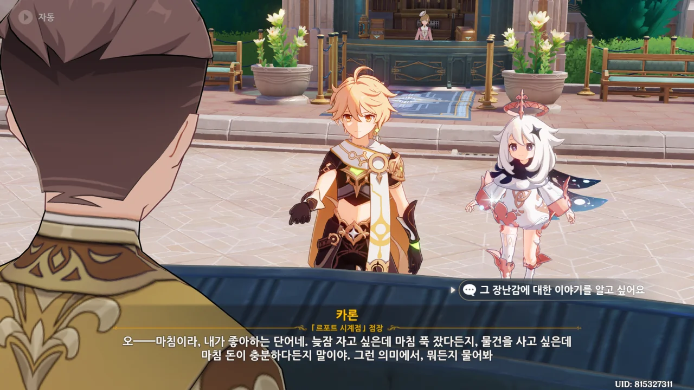
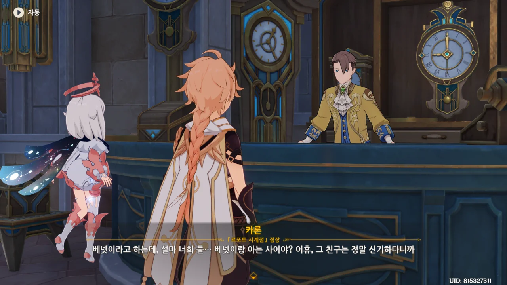
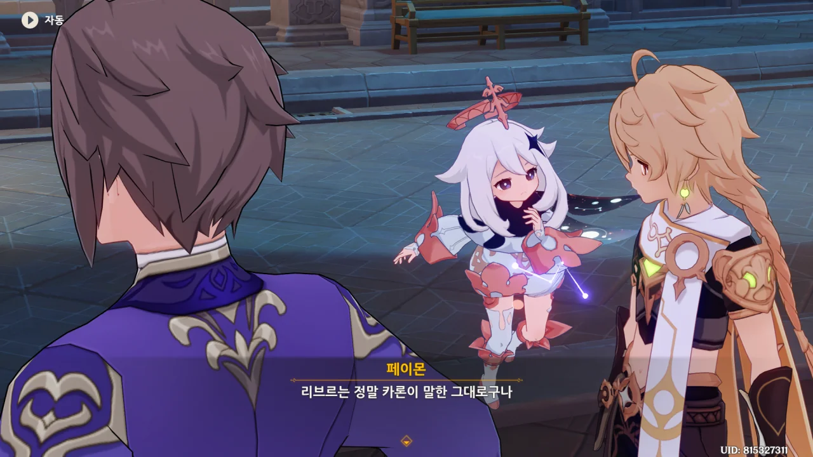
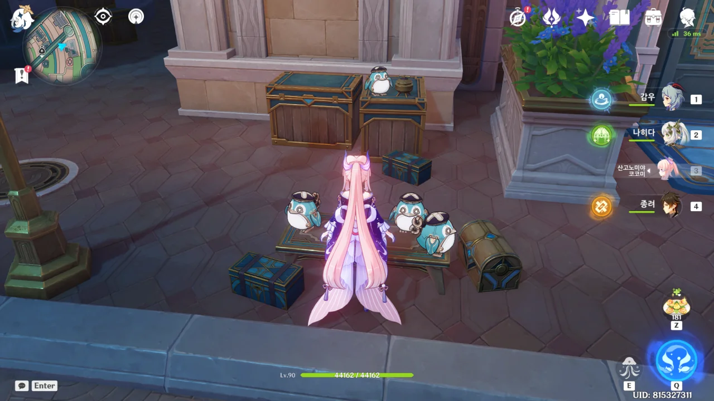

제목의 '백열화'가 대체 무슨 단어인가 했는데, 한자어로 白熱化라고 한다. '어떤 상황이 매우 열띤 상태로 되어 가는 것'이라는 뜻이다.

의외의 곳에서 새로운 단어를 배워간다.



예전과는 다르게 게시판의 평가가 열성적인 호평으로 가득 차있지 않은 걸 보고 '누군가의 음해일 것이다'라며 대뜸 짚고 보는 아르본과 알베르.

그건 좀 아니지 않나? 못 만들었으면 평가가 나쁠 수도 있지. 세상에 호평만 잔뜩 받는 회사가 어디 있다고?

게다가 이번 프로젝트는 결투 대리인을 소재로 삼았다면서, 정작 데이터를 얻은 건 모험가잖아. 이건 평가가 문제가 아니라 사기 문제라고. 평가가 나쁜 것만으로도 다행스럽게 여겨야 할 것 같은데.



사장이 대비책을 준비해 두어 다행이라는 아르본. 대체 그 대비책이 뭘까?



아니, 우리가 그 대비책이었어?





이틀 사이, 아르본과 알베르는 「결투 대리인 프로젝트」 광고를 온 도시에 뿌렸다고 한다.

그와 동시에 예약 구매도 시작했는데, 예약금의 절반 가격만 지불해도 장난감을 체험할 수 있는 혜택을 제공했다고 한다.

그리고 가게 앞에 게시판을 설치해, 장난감에 대한 평가를 남길 수 있게 해 두었다.



처음에는 예상대로 큰 인기를 끌었지만, 정작 예약 구매를 한 사람은 얼마 없었다고 한다. 게시판에 붙은 호평도 얼마 되지 않았고, 전부 '성의 부족', '내용 빈약', '유행 지남' 등의 부정적 평가로 가득했다고 한다.

그런데 그게 정상 아냐? 결투 대리인을 소재로 했다면서, 정작 그 알맹이는 모험가잖아. 모험가와 결투 대리인은 서로 다른 만큼, 사람들이 장난감에 성의가 부족하거나 내용이 빈약하다고 느낄 게 뻔하지.



이건 또 무슨 신박한 헛소리지?



> 악의적인 비방!
> 새빨간 거짓말!
> 트집 잡기!

이럴 때엔 또 죽이 잘 맞아요, 아주 그냥...

자신들이 장난감을 못 만들었을 거란 생각은 전혀 안중에 없다.

리브르는 '르포트 시계점'이 사람을 풀어 '레쇼의 태엽 공방'을 음해한다고 생각한다.

글쎄, '르포트 시계점' 점장, 카론을 봤을 때, 카론이 그런 짓을 할 것 같진 않던데... 오히려 음해는 리브르가 더 잘할 것 같다.





하지만 그렇다고 역으로 르포트 시계점을 음해할 생각은 없는 것 같다. 그럼 대체 뭘 어쩌라는 거지?

게다가 애당초 르포트 시계점을 염탐하고 오라고 한 건 너희였잖아. 그런 너희가 정정당당을 운운할 자격이 과연 있을까?





> 그 녀석들이 진심과 핵심 내용을 털어놓게 해 주세요!

가면 갈수록 웃긴 녀석들이네. 처음엔 뭘 팔고 있는지 염탐해 오라고 하더니, 이젠 사업 기밀까지 훔쳐오라고 한다.

심지어 그걸 공평이라고 주장한다. 공평은 무슨, 얼어 죽을.



우리는 그걸 표절이라 부르기로 사회적으로 약속했어요, 이 표절 사기꾼들아.



그러니까 카론이 장난감의 영감을 얻었다는 모험가의 이야기를 알아와 달라는 거네.

나도 궁금하긴 하지만, 사업 아이디어가 담겼을지도 모르는 이야기를 알아와 달라고 하는 이들의 인성은 대체 어떻게 생겨먹은 걸까?





썩 내키진 않지만, 카론이 모험가와 대체 어떤 일을 겪었는지 궁금하기 때문에 가서 물어보기로 했다.



곧장 카론에게 가, 장난감에 얽힌 이야기를 해달라고 한다.

> 늦잠 자고 싶은데 마침 푹 잤다든지, 물건을 사고 싶은데 마침 돈이 충분하다든지 말이야.

'마침'이라는 단어의 예시가 범상치 않은데? ㅋㅋㅋㅋㅋㅋ



깊은 인상이라... 대체 무슨 이야기일까?







몬드를 떠나려던 카론은 샘물 마을 앞에서 방금 음식 주문 의뢰를 망친 것 같은 한 모험가와 마주쳤다. 아, 음식 주문 의뢰... 몬드에서 일일 임무를 하다 보면 자주 마주치는 의뢰이다.

그 모험가는 오는 도중에 마물을 여러 번 만나는 바람에 시간도 낭비하고 요리도 흘렸다고 했다. 마침 카론이 요리를 할 줄 알았기 때문에, 모험가를 도와 새로 요리를 만들어주기로 했다.

하지만 카론과 모험가는 요리 하나를 하는데 엄청난 사고를 잇달아 겪어야만 했다. 불 피울 장작이 젖어버리거나, 냄비 바닥에 구멍이 뚫리거나, 접시에 음식을 담을 때 어디선가 날아온 돌멩이에 난장판이 되거나 말이다. 심지어 날아온 돌멩이 중 하나는 카론의 머리로 날아들었다고 한다.

엎친데 덮친 격으로, 기껏 요리를 해서 배달했지만, 요리에 돌멩이가 섞여 들어간 탓에 손님이 요리를 먹다가 이가 깨져 손님에게 고소를 당했다.

&nbsp;

이 정도의 불운 스탯을 가진 모험가라면 베넷 밖에 없을 텐데?

아니, 진짜 베넷이었네 ㅋㅋㅋㅋㅋㅋ



베넷은 도와줘서 고맙다는 의미로 카론을 몬드의 인적이 드문 절경 여러 곳에 데려다주었다.

처음 카론은 베넷이 탐험 애호가라고 생각했지만, 그 절경은 전부 베넷이 모험 중 발을 헛디뎌 떨어지거나 길을 잃다 찾게 된 곳이란 이야길 들었다.

&nbsp;

베넷이 정말 불합리하게 운이 없다는 것 정도는 알고 있었지만, 그런 와중에도 절경을 여럿 찾았다는 이야기는 처음 들어보네. 불운 중에서도 행복을 찾으려 하는 베넷답다.



카론이 베넷에게 불행 체질 때문에 힘들지 않냐고 묻자, 베넷은 이런 인상 깊은 대답을 했다.

> 세상엔 다양한 사람이 있고, 어쩌면 그중에 제가 가장 불행한 사람일지도 모르죠.
> 하지만 그 덕분에 전 가장 용기 있는 사람이 될 수 있었고, 이렇게 저만을 위한 풍경도 찾을 수 있었어요.

베넷답다면 베넷 다운 대답이다. 이런 초긍정적인 생각은 베넷이 아니면 쉬이 하기 어렵지...





> 이 정도 이야기면 가서 전하기에 충분하니?

엣, 또 들킨 거야?



처음부터 이 이야기가 궁금했다면 저번에 곧바로 물어봤을 테니, 이번에 이야기를 물으러 온 건 형의 부탁 때문이 아니겠냐고 말하는 카론. 정말 눈치가 빠르다.



배신? 카론이 배신? 이건 또 무슨 소리야?



카론과 리브르의 집안은 대대로 태엽 공예로 유명한 집안이라고 한다. 카론은 어릴 때부터 태엽 장난감을 만드는데 소질이 있었고, 리브르는 사업적인 감각이 뛰어났다.

장난감을 좋아하던 둘은 나중에 커서 세상에서 가장 뛰어난 장난감 가게를 열자고 약속했지만, 나이가 들고 나니 둘 중 누군가는 가업을 이어 이 시계점을 이어가야 한단 걸 깨닫게 되었다.

리브르는 아버지와 크게 싸우고 독립해 '레쇼의 태엽 공방'을 열었고, 카론은 그대로 남아 '르포트 시계점'을 이어나갔다.

이게 뭔 배신이야?



카론은 취미를 직업으로 삼는 스트레스를 견딜 수 없었고, 더군다나 사업에 실패했을 때의 후폭풍이 두려웠다고 한다. 그렇다면 안정적인 직업을 갖는 게 카론에게 최선의 선택이었겠지.

하지만 카론과 성격이 다른 리브르는 그렇게 생각하지 않았다.



정말 페이몬 말처럼, 이 두 형제는 복잡한 형제관계를 갖고 있다.





이번에도 리브르는 한 박자 늦게 나타났다. 일단 리브르가 원하던 이야기는 갖고 왔다.



왜 리브르는 베넷의 이야기를 듣고 눈살을 찌푸린 걸까?



지금껏 카론이 말한 것으로 판단할 때, 카론이 리브르의 가게를 험담하고 다녔을 가능성은 굉장히 낮다고 생각하고 있다.



> 리브르의 시선은 일행을 지나치더니 먼 것 같기도 하고 가까운 것 같기도 한 곳을 향한다.

아마 옛 일을 생각하고 있는 거겠지.



아니, 그럼 왜 카론의 이야기를 알아와 달라고 한 거야?







형이라는 체면 때문에 핑계를 댄 것이라 추측하는 아르본과 알베르. 본인 앞에서 그런 말을 해도 과연 괜찮은 건가 싶었는데, 곧바로 리브르가 "한마디만 더 하면 둘 다 확 날려버리겠다"라며 쏘아붙인다.

이 둘, 아마 무대 위에 세워두고 아무 말이나 하게 시켜도 꽤 재미있지 않을까? 둘이 아주 죽이 잘 맞는데.

ㄹㅇㅋㅋ





리브르가 카론을 한 번 보러 가야겠다고 말한다. 드디어 동생과 허심탄회하게 대화를 하려는 건가 싶었는데, 사과할 기회를 주려고 하는 것뿐이라고 한다. 어휴...



리브르가 남은 예약을 전부 취소하고 계약금을 되돌려주라고 한다. 설마 「결투 대리인 프로젝트」를 포기하려는 걸까?

여행자가 "아직 더 수정할 여지가 있어요"라고 말하지만, 이미 이벤트 콘텐츠는 모두 다 끝냈다. 더는 데이터를 얻을 수 없다고.



정말 모르겠네. 프로젝트는 그만두는 것 같은데, 데이터 수집은 계속하겠다고?

뭐, 정해진 보수만 제깍제깍 주면 프로젝트를 계속하던 그만두던 여행자가 알 바가 아니다.



아무리 봐도 아르본과 알베르 말처럼, 괜한 자존심 때문에 이러는 것 같은데...



리브르는 가게에 남은 일이 있다며 먼저 자리를 뜬다.





둘의 말에 따르면, 리브르는 예전에도 이렇게 카론에게 애매하게 으르렁댔다고 한다.



원래 '레쇼의 태엽 공방'은 '르포트 시계점' 바로 옆에 자리 잡을 생각이었지만, 북국은행이 그 자리를 먼저 차지한 탓에 두 가게 사이에 북국은행이라는 완충지역이 생겼다고 한다.

북국은행이 왜 갑자기 여기서 나와?

그러게. 보통 우인단은 존재하는 것만으로도 주변에 해악을 끼치던데 말이다.



이 둘의 콩트는 정말 질리지 않는다.

이 펭귄 모양 장난감이 설마 「결투 대리인 프로젝트」의 결과물은 아니겠지? 대체 어딜 봐서 결투 대리인이 떠오른다는 거야?
