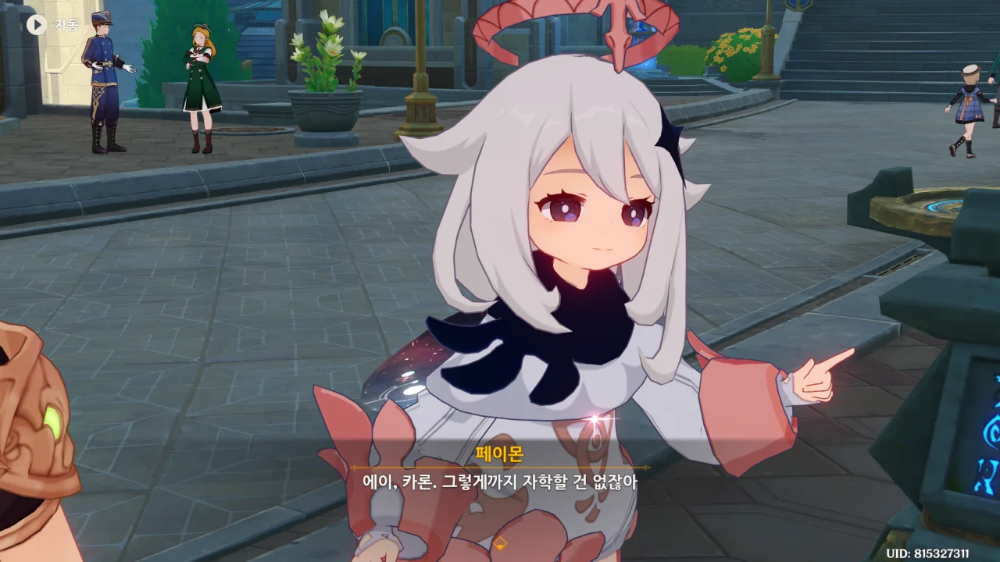
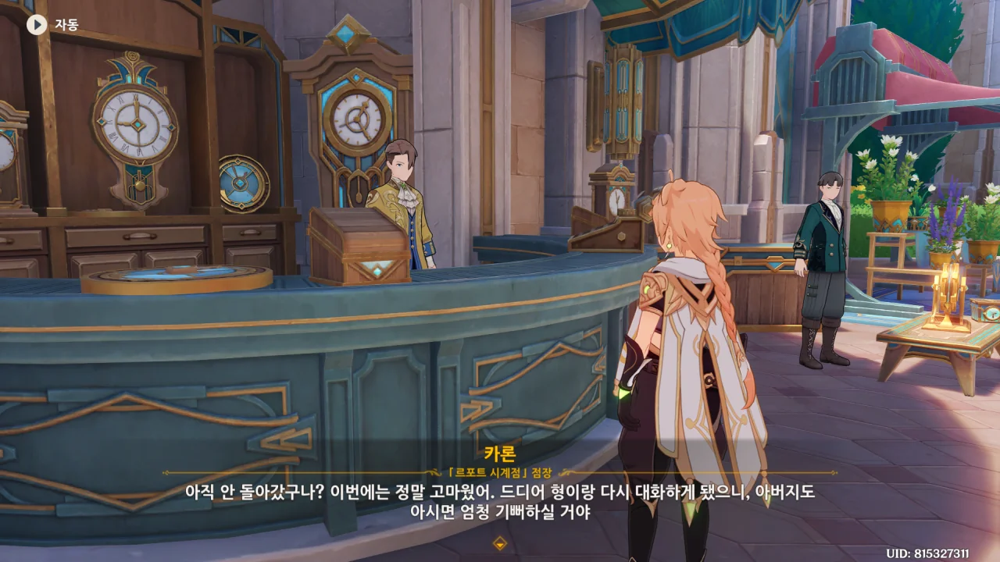
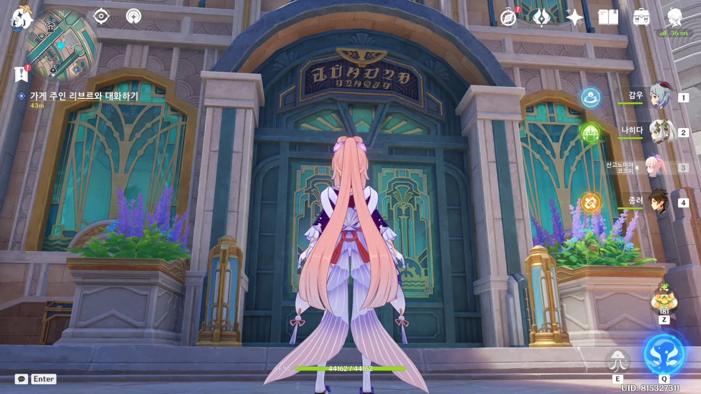
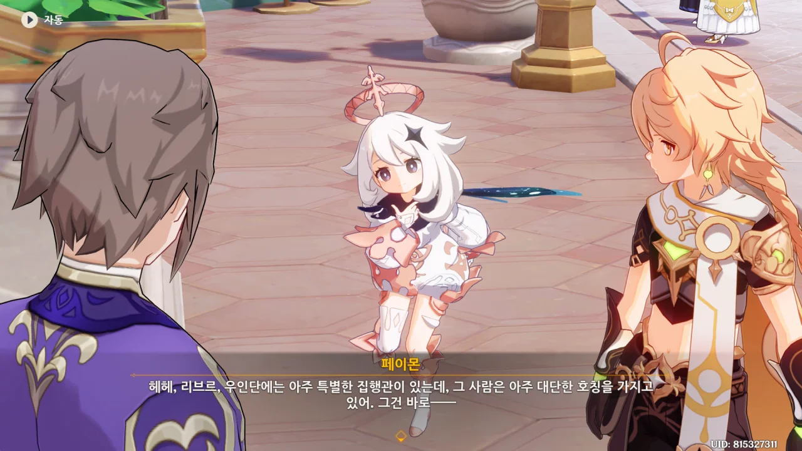
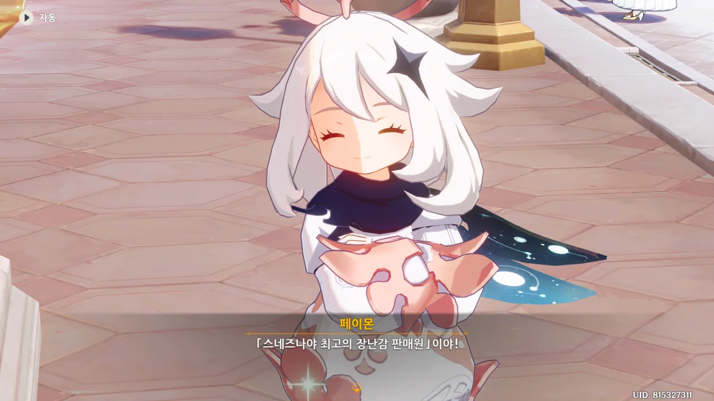





> 카론, 장사가 아주 잘 되는구나

동생을 만나자마자 시비를 거는 리브르. 오랜만에 만나서 하는 첫마디가 겨우 그거냐?



응? 카론이 모험가 장난감을 만든 이유가 리브르 때문이라고?



카론이 장난감을 만드는 데에 있어 베넷이 가장 중요한 영감을 준 건 맞지만, 장난감을 만드는 걸 포기하지 않은 건 리브르 때문이었다고 말한다.





듣고 보니 그렇네. 리브르는 확실하고 안정적인 가업을 버리고 뛰쳐나와 장난감 가게를 세웠지 않은가. 그것도 일종의 모험이라고 볼 수 있겠네.





카론은 최고의 장난감 가게를 만들기 위해 노력하는 형과 달리, 자신은 집에서 시키는 대로 늘 시계처럼 반복되는 삶을 살고 있다고 생각한다.

맞아, 그럴 수도 있는 거 아냐?



리브르가 르포트 시계점 바로 옆에 새 가게를 내려한다는 소식을 듣자마자 카론은 시계점 이사를 고민했다고 한다. 다행히도 그 자리에 북국은행이 대신 자리 잡았기에 시계점을 옮기지 않을 수 있었다고 한다.





그런데 알고 보니, 그 자리는 처음 리브르가 찜해둔 자리였으나, 그 자리에 자기가 입점하게 된다면 '최고의 장난감 가게를 만든 사람'이 아니라 '집안과 반목하고 동생을 내쫓은 사람'이 될 것 같아 일부러 북국은행에 그 자리를 헐값에 넘겼다고 한다.





아무래도 카론에게 사과를 받겠다는 건 그저 카론의 가게로 갈 핑계였던 것 같다. 시치미 뚝 떼는 것 좀 봐...





응? 이번엔 「결투 대리인 프로젝트」를 위해 모아 왔던 데이터마저 전부 카론에게 줘버린다.

시장변화가 예상보다 빨라 프로젝트를 멈췄기 때문에 더는 필요 없다는 모양인데, 내가 보기엔 이 「결투 대리인 프로젝트」 자체가 카론에게 모험가의 데이터를 주기 위해 시작한 것으로 보인다.



정말 뭐라 딱 잘라 말하기 묘한 형제관계다. 가장 비슷한 거라면 '츤데레'가 있겠지만, 또 츤데레는 아닌 것 같거든. 진짜 묘한 관계다.





그동안 모은 데이터를 어떻게 쓸지는 리브르의 자유이니, 별로 개의치 않는다. 오히려 형제가 이걸 계기로 화해할 수 있다면 나쁘지 않은 결말 아니겠는가.





페이몬이 이 기회에 둘이 다시 결합하는 게 어떻겠냐고 하자, 둘이 한 목소리로 "그건 좀..."이라고 한다. 이럴 때에만 죽이 잘 맞지?





두 형제가 서로의 삶에 대해 생각하는 것이 완전 정반대인지라, 어쩔 수 없다고 한다.

카론은 형인 리브르가 걷는 길이 너무 위험하다고 생각해 평범한 시계점 점장의 삶에 안주하지만, 리브르는 동생이 고른, 평범한 시계점 점장의 삶을 살기에는 너무 좀이 쑤시는 것이다.

삶에 있어 닥쳐오는 온갖 위험에 대해 리브르는 그것마저도 도전이라 생각하지만, 카론은 피해야 할 재난이라고 생각한다고 해야 할까?

둘이 성격이 이렇게 다르니, 재결합은 힘들겠지.





> 그럼 어쩔 수 없는 거지 뭐. 삶이란 종종 그런 거야.

저게 바로 카론과 리브르의 가장 큰 차이점이라고 할 수 있을 것이다. 카론은 그런 상황이 오는 것 자체가 굉장한 스트레스일 테니 말이다.





ㅋㅋㅋㅋㅋㅋㅋㅋㅋㅋㅋㅋ

> 안 그럼 내가 주먹으로 형을 날려버릴 거야.

누가 형제 아니랄까 봐, 하는 말도 어쩜 저렇게 똑같냐? ㅋㅋㅋㅋㅋㅋ



뭐, 어찌 되었건, 두 형제가 잘 화해한 것 같다. 잘됐네, 잘됐어.

설마 두 형제의 아버지는 리브르가 집을 나가 따로 가게를 차린 후, 세상을 떠난 걸까? 두 형제가 서로 화해하는 모습을 보지 못하고 세상을 떠난 아버지라... 하, 난 이런 건 좀 싫은데...

두 가게 사이를 여러 번 왔다 갔다 했으면서도 이 건물이 북국은행 건물인 걸 전혀 알아채지 못했다.

***



이번엔 리브르가 미리 가게 앞에 나와있다. 저번에 말했던 "다음엔 늦지 않을게"라는 약속을 지킨 것이다.

오늘따라 리브르의 기분이 좋아 보인다. 분명 저번에 카론과 화해한 덕분이겠지.



카론이 여행을 통해 장난감 제작에 관한 영감을 얻었듯이, 리브르 역시 여행을 통해 영감을 얻고자 한다.



여행자는 여행을 많이 다녀봤으니, 혹시 추천해 줄 만한 사람을 알고 있냐고 묻는다.

갑자기 이렇게 물어보아도... 다른 사람에게 물어보는 게 더 나을 것 같은데.





리브르와 페이몬이 서로 알아서 북 치고 장구 치고 하더니, 뭔가 결론을 도출해 낸 것 같다.

여행자의 본의가 어땠는진 몰라도, 난 여행자 말고 다른 사람을 찾아서 물어보란 의미였는데?

아... 설마 타르탈리아는 아니겠지?

ㅋㅋㅋㅋㅋㅋ 진짜 타르탈리아였네 ㅋㅋㅋㅋㅋㅋ

타르탈리아는 전설 임무에서 자기가 우인단에서 일하고 있단 걸 동생에게 들키지 않기 위해 자신을 '스네즈나야 최고의 장난감 판매원'이라는 되지도 않는 칭호로 부르고 다녔다.



페이몬은 재미가 들렸는지, 온갖 이상한 소리를 리브르에게 주입하기 시작한다.



어... 음... 앞으로 일이 잘못되더라도 그건 페이몬 탓이지, 여행자 탓은 아니다?



그럼 이제 폰타인에 우인단을 소재로 한 장난감이 팔리게 되는 걸까?
