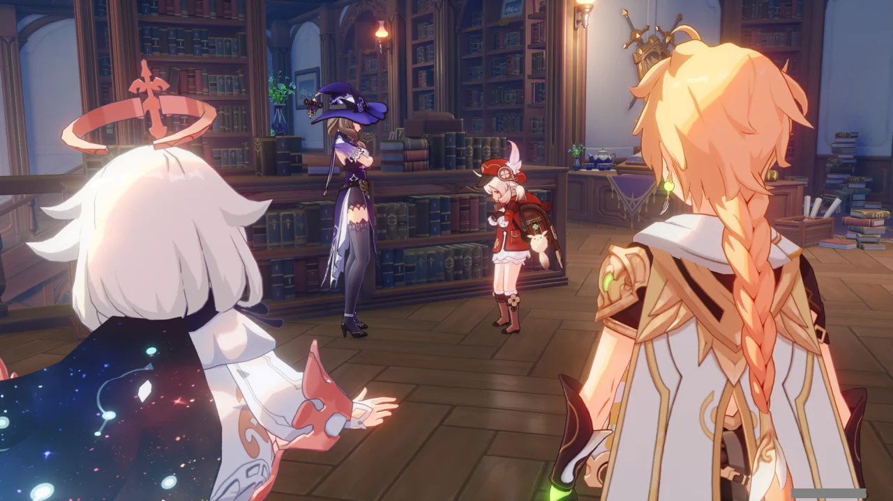
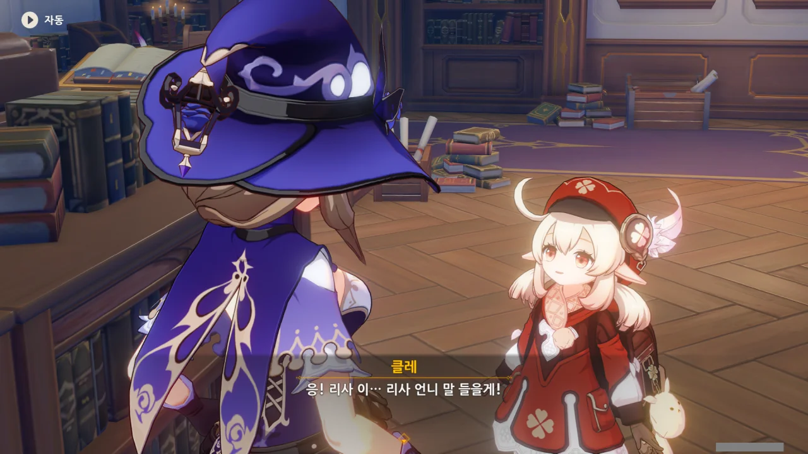
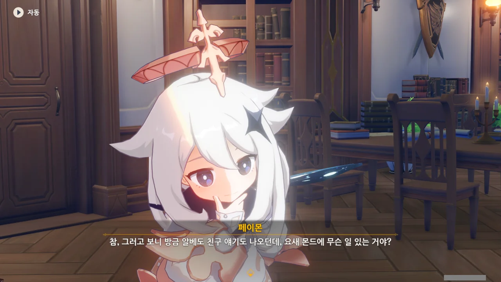
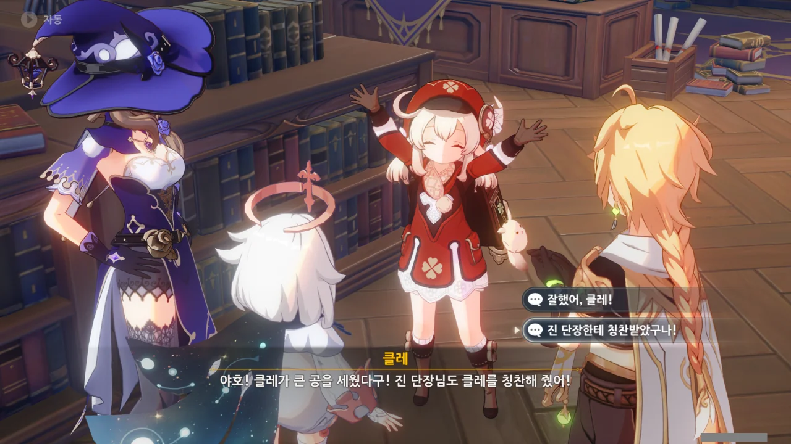
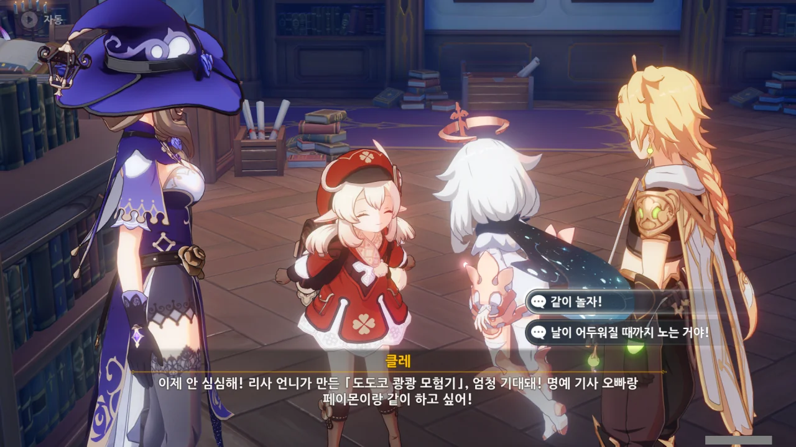

최근 들어 원신 이벤트는 이벤트가 끝나기 직전 일요일에 몰아서 하는 느낌이다.

그도 그럴 게, 다른 날에는 도통 이벤트를 할 시간이 없거나 의욕이 없거든. 더군다나 이벤트 콘텐츠가 모두 열리려면 꽤 오랜 시간을 기다려야 하므로, 그냥 끝나기 직전 몰아서 하는 게 제일 편하다.

사실 저번 주에도 다른 이벤트가 있긴 했지만, 굳이 사진을 찍을 필요성을 느끼지 못해 그냥 후다닥 끝내고 치워버렸다.

하지만 이번 이벤트는 클레가 나온다. 이건 무조건 사진을 찍어야 한다.

들어가니 클레와 리사가 있다.

뭔가 분위기가 클레가 뭔가 잘못을 저질러서 리사에게 혼나는 것 같은데...



설마 클레가 이번에도 물고기를 폭파한 것일까? 

클레가 하도 호수에 폭탄을 던져댄 탓에, 클레의 특제 요리조차 폭탄 때문에 물고기가 도망한 것을 어부들에게 사과하기 위해 만든 요리가 되었다.



> 어향 토스트 (Fish-Flavored Toast)
> ***
> 클레의 특제 요리. 폭탄을 마구 던져 물고기를 도망가게 한 클레는, 진의 지도 아래 이 토스트를 만들어 어부들에게 사과했다.
> 맛이 좋고 포만감을 오래 유지할 수 있는 이 요리 덕에, 폭탄으로 물고기를 도망가게 해도, 클레는 굶을 걱정을 하지 않아도 된다.
{.bq}



리사가 말하는 걸 들어보면, 클레를 꾸짖는 건 아닌 것 같다. 오히려 클레를 달래는 듯한 느낌인데?

분명 클레는 '리사 이모'라고 말하려다가 '리사 언니'로 말을 바꾼 것이 분명하다.

한국어 더빙엔 없지만, 일본어 더빙에는 클레 자료의 '리사에 대해...'에 '리사 아줌마'라고 부르려다가 급하게 '리사 언니'로 바꿔 부르는 부분이 있다. 아마 그걸 의식해서 이번에 그렇게 녹음한 모양이다.

리사를 '이모'나 '아줌마'라고 불렀다간 분명 전신이 짜릿짜릿해질걸?

클레가 성안에서 「도도코 쾅쾅 모험기」라는 걸 하며 가만히 있겠다고 한다.

물고기 폭파를 하지 않겠다는 건 그렇다 치겠는데, 알베도의 친구들에게 폐를 끼치지 않겠다는 게 대체 무슨 말일까?



클레가 여행자와 페이몬을 찾으러 가겠다고 하는데, 여행자와 페이몬이 바로 옆에 있다.

이렇게 공교로울 데가.



그러게. 참 신기하다. 여행자는 그저 독서하러 페보니우스 기사단 도서관에 방문한 것뿐인데 말이다.

정말로 클레의 간절한 마음이 우릴 부른 걸지도 모르지.



「도도코 쾅쾅 모험기」는 리사가 만든 게임의 이름이라고 한다. 이름은 리사와 클레가 같이 지었고.

나, 지금까지 페이몬이 칭찬받은 걸 단 한 번도 본 적이 없는 것 같은데... 축하해, 페이몬! 드디어 칭찬받았구나!



「도도코 쾅쾅 모험기」는 리사가 아카데미아 학생일 시절 종종 했던 「데굴데굴 펑펑 버섯」이라는 게임을 수정한 게임이라고 한다.

그런데 웬 「비상시기」?

그러고 보니 아까 클레가 '알베도의 친구들'이라는 말을 꺼내기도 했었다.

알베도가 페보니우스 기사단에서 맡은 역할이 뭐였더라? 수석 연금술사인 건 기억하는데...

위키를 찾아보니 '수사대 대장'이라고 한다. 수사대라면 무슨 사건이 터졌다는 이야기로 들리는데...





최근 시드르 호수에 수메르 어류가 나타났다고 한다. 수메르 어류의 무분별한 번식을 방치할 경우 몬드의 수역 생태를 크게 위협할 수 있는 상황.

이 사태의 심각성은 한국 수생태계에 큰입배스(배스)와 파랑볼우럭(블루길)이 끼친 영향을 생각하면 될 것이다. 둘 다 미친 듯한 번식력 때문에 생태계교란 생물로 지정되었거든.

다행스럽게도 몰래 나가 놀던 클레가 처음 보는 물고기를 몇 마리 잡아 와 케이아에게 물어본 덕에 조기에 발견할 수 있었다고 한다.

그냥 몰래 나가 논 것이었다면 분명 꾸중감이었겠지만 몬드 수생태계를 위협할 수 있는 수메르 어류를 조기에 발견한 공 덕분에 진에게 칭찬을 들은 클레.

소 뒷걸음치다 쥐 잡은 격이지만, 클레가 칭찬받았으니 아무렴 어떠랴.



수사대에서 대원들을 파견해 시드르 호수를 조사하고, 침입 어류의 둥지를 찾고 있다고 한다.

그런데 여기에 쓰이는 기계가 아주 민감해, 조금 멀리 떨어진 곳에서 발생한 폭발에도 영향을 받기 때문에, 조사가 진행되는 동안 클레는 호수 근처에 폭탄을 갖고 놀 수 없게 되었다.



몬드성에만 박혀 있으면 분명 클레가 심심해할 것이다.

하지만 수사대 대장인 알베도는 유격대의 실험형 장비 개량에 바쁘고, 케이아도 마침 다른 일로 출장 중이라 클레를 보살피는 일은 리사가 맡게 되었다.

진? 진은 항상 바쁘지 않은가. 진 전설 임무에서 진이 과로로 쓰러진 걸 생각해 보라.

아, 그러니까 클레가 심심해하지 말라고 리사가 학창 시절 종종 했던 게임을 수정해 「도도코 쾅쾅 대모험」을 만든 거구나.



게임 테이블은 기사단 화원 쪽에 있다고 한다. 그런데 「디어 헌터」에 식사도 주문했다고? 좀 과한 거 아닌가?



리사는 게임 제작자가 참여하면 반칙이라며, 클레와 여행자만 보낸다.

그런데 리사는 원래 나서는 걸 좋아하지 않는 사람이라, 적당히 빠질 핑계를 대는 것으로만 보인다.

뭐, 클레와 같이 놀 놀이를 만들어 준 것만 해도 감사하긴 하지만.



그러면 한 번 리사가 만든 놀이가 뭔지 보러 가보자.
