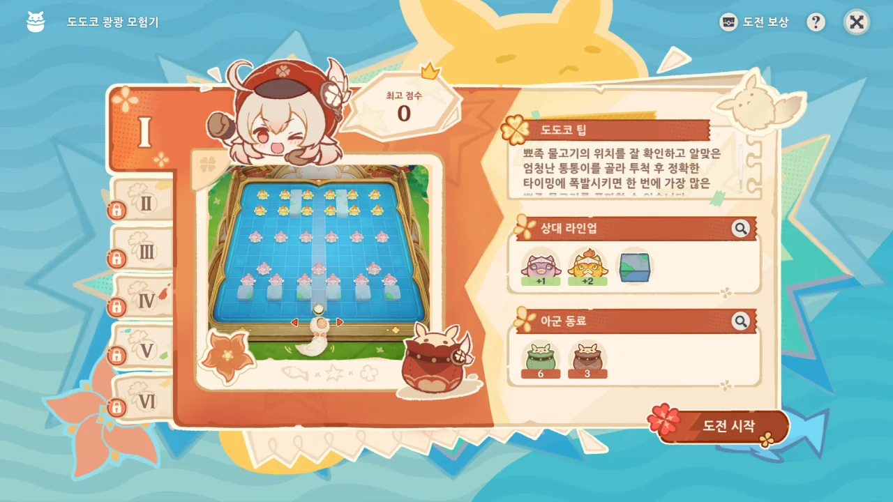
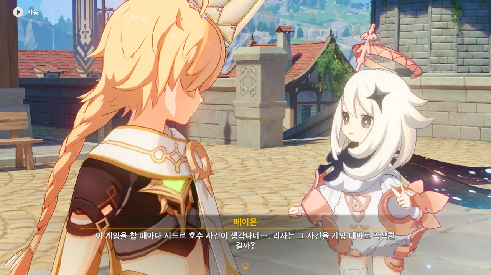
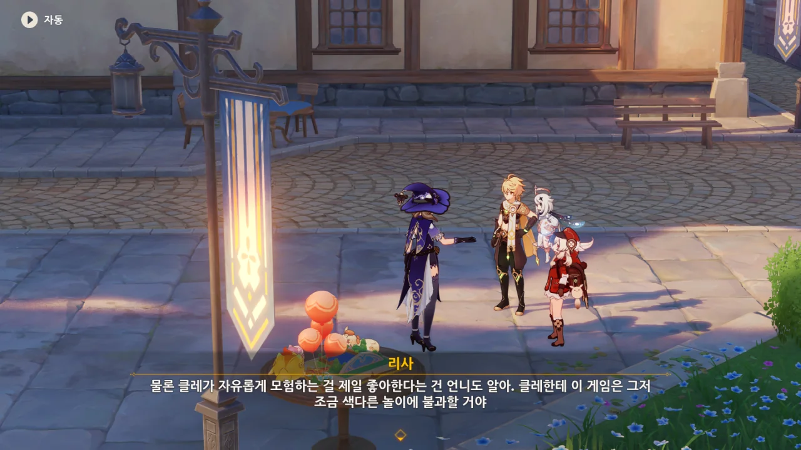
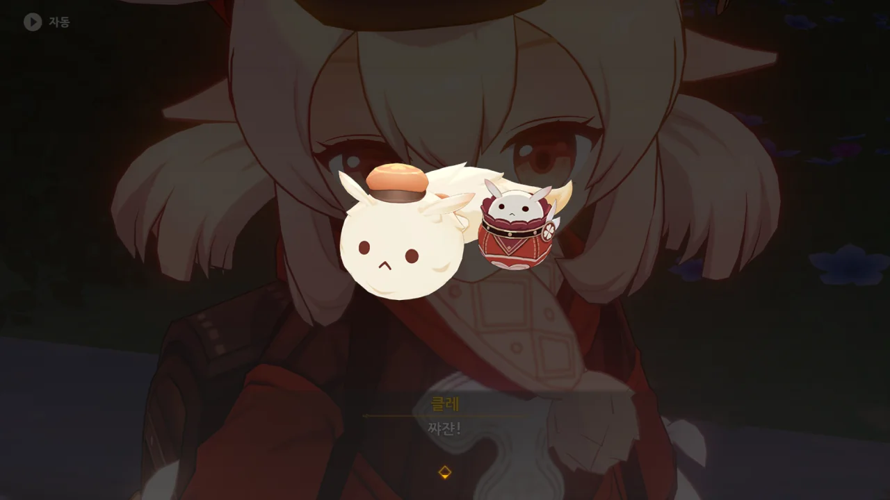
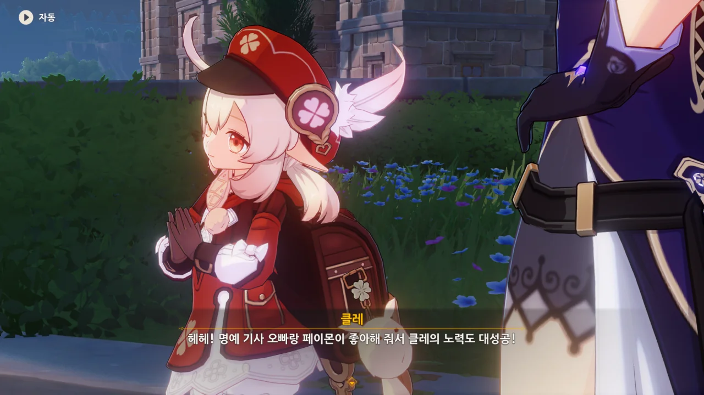
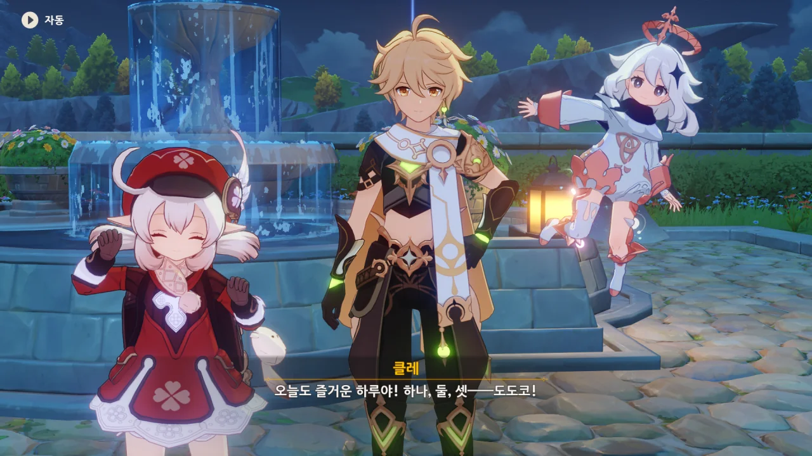
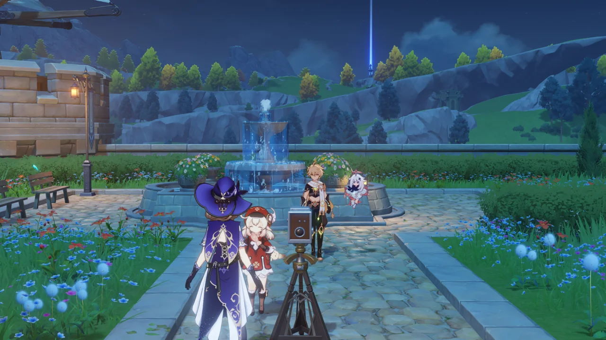
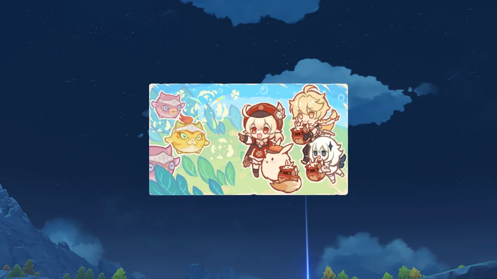

「도도코 쾅쾅 모험기」 게임은 제법 재미있었다. 모든 보상을 얻기 위해 그렇게까지 머리를 쓰지 않아도 되었거든. 그렇다고 게임이 지루하지도 않았다.

역시 클레가 함께 한 이벤트는 전부 다 재미있다니까.



「도도코 쾅쾅 모험기」의 모든 스테이지를 완료했다.

&nbsp;

그래, 통통 폭탄과 쾅쾅 불꽃은 최강의 조합이긴 하지. 원신 초기에 출시된 캐릭터라 최근 메타에 맞지 않을 뿐...

그러니까 원신 초창기에 출시된 캐릭터들도 좀 버프를 해줬으면 좋겠다.

어쩌면 정말 그런 것일 수도 있겠다.



페이몬 이 녀석, 클레와 같이 놀더니 클레의 사고방식이 옮았다.

물론 수중의 암초를 그냥 폭탄으로 다 터트려 버리는 것도 하나의 해결 방법이긴 하겠다만, 알베도가 이번 사건의 해결을 위해 나섰으니, 폭탄으로 다 터트리는 것보다 훨씬 깔끔한 방법을 쓰고 있을 것이다.



리사가 찾아왔다.



「도도코 쾅쾅 모험기」의 후속작이라고? 추후 있을 다른 이벤트에서 비슷한 놀이를 기대해도 되는 걸까?



도도코가 다른 곳에서 모험하는 이야기도 보고 싶다고 말하다가, 리사가 이 게임을 만드는 데 오랜 시간이 걸린 걸 기억해 내고 그만 두는 클레.

리사가 「도도코 쾅쾅 모험기」에 대해 말할 때, 게임을 만드는 데 별로 힘들이지 않았다는 듯이 말해서 그냥 넘겨 들었는데, 사실은 게임을 만드는 데 제법 시간이 걸린 모양이다.



클레가 얌전히 몬드성 안에서 게임 한다고 약속해 주면 시간이 얼마나 걸리든 만드는 보람이 있다고 하는 리사.

생각해 보니 클레가 얌전히 몬드성 안에서만 놀면 페보니우스 기사단 지도부의 걱정거리가 하나 줄어들긴 할 것 같다. 클레가 매번 하는 게 감금실에 갇혔다가 풀려나면 어딘가에서 또 사고를 쳐 감금실로 되돌아오는 것이니까.

&nbsp;

약간 다른 이야기이지만, 클레가 예전 자기 생일에 여행자에게 보낸 편지에 '도마뱀을 잡았다'라며 '설익은 옥'을 함께 보내주는데, 이 아이템은 리월에 있는 거대 바위 용 도마뱀을 처치해야만 얻을 수 있는 아이템이다.

그러니까 진 몰래 클레 혼자 리월까지 가서 단신으로 거대 바위 용 도마뱀을 아무렇지도 않게 처치하고 돌아온 것이다.

또한 클레는 집정관을 제외하면 티바트 대륙의 지형을 변형시킨 유일한 사람이다.

벤티는 몬드의 산을 깎아 평지로 만들었고, 종려가 마신 전쟁 당시 던진 돌기둥으로 고운각이 만들어졌으며, 라이덴 쇼군은 오로바스와의 전투에서 오로바스와 함께 섬을 두 동강 내어 무상도의 협곡을 만들었다.

그런데 클레는 폭탄만으로 바람맞이 산 지형을 바꿔버렸다.

&nbsp;

이러니까 리사가 클레가 얌전히 몬드성 안에만 있으면 된다고 말한 거겠지. 클레, 무서운 아이!

그렇긴 하겠지. 클레 또래의 아이라면 다들 몸 안에 에너지가 넘쳐 흐를 때 아닌가. 클레도 가만히 앉아서 보드게임만 하기보다는 바깥을 뛰어다니고 싶어 할 것이다.



리사가 선물과 좋은 소식을 들고 왔다. '귀염둥이들'이라고 한 걸 보면, 클레와 여행자, 페이몬 셋을 아울러 말한 거겠지?

클레 역시 여행자와 페이몬에게 줄 선물이 있다고 한다.

&nbsp;

정말 기대되는걸.



페보니우스 기사단이 수메르 어류의 둥지를 찾아 제거했으며, 그 이유 또한 조사가 끝났다고 한다.

정말 빠른데?



한 상인이 무심결에 한 행동에서 비롯되었다고? 왜 바로 직전에 있었던 「형광빛 수확」 이벤트가 떠오르는 걸까?

거기서도 사람들이 형광 해파리를 마구잡이로 폰타인 호수에 방생하는 바람에 일이 터졌는데 말이다.



클레가 잔소리하지 않아도 매일 일찍 집에 들어가서 준비한 선물이 과연 뭘까?



클레가 밤에 집에서 알베도의 그림 책자를 보고 배우며 만든 것은 도도코 인형이었다. 그 옆에 있는 건 통통 폭탄 인형이고. 통통 폭탄 인형은 정말 진짜처럼 생겼는데?



이 인형들은 「도도코 쾅쾅 모험기」의 게임 말을 보고 만든 것이라고 한다.





당연히 인형이니만큼 통통 폭탄을 던지진 못하지만, 인형을 볼 때마다 클레와 재미있게 놀던 기억을 떠올리고 고민과 심심함을 날려버리길 바라며 만든 것이라고 한다.

이 인형과 함께 다닌다면 클레와 함께 여행 다니는 느낌이겠네.

장하다, 클레!

클레 역시 페이몬과 여행자가 자신의 선물을 좋아해 줘서 기뻐한다.



리사가 준비한 선물은 「도도코 쾅쾅 모험기」 이야기책이다.



「도도코 쾅쾅 모험기」를 게임으로 만든 것에 그치지 않고, 하나의 이야기책을 만들었다.

이것도 미디어믹스의 한 종류겠지?



해피엔딩이야말로 가장 완벽한 결말이다. 정말 그래야 할 특별한 이유가 없다면, 배드엔딩은 기분만 나빠질 뿐이지.



리사는 클레와 페이몬, 여행자가 함께 완성한 이야기라고 하지만, 이 게임의 결말이 어떻게 될지 리사는 이미 다 알고 있었을 게 분명하다.

뭐, 클레가 좋아하니까 상관없는 이야기려나.



리사가 이야기책에 삽화 하나가 들어갈 자리를 남겨뒀다면서, 클레와 페이몬, 여행자가 모여 사진 한 장 찍는 게 어떠냐고 물어본다.

당연히 해야죠.



클레는 벌써 신나서 카메라 앞에 달려가 섰다.

치즈가 아니라 도도코네.

「도도코 쾅쾅 모험기」의 이야기는 여기서 일단 막을 내린다.
