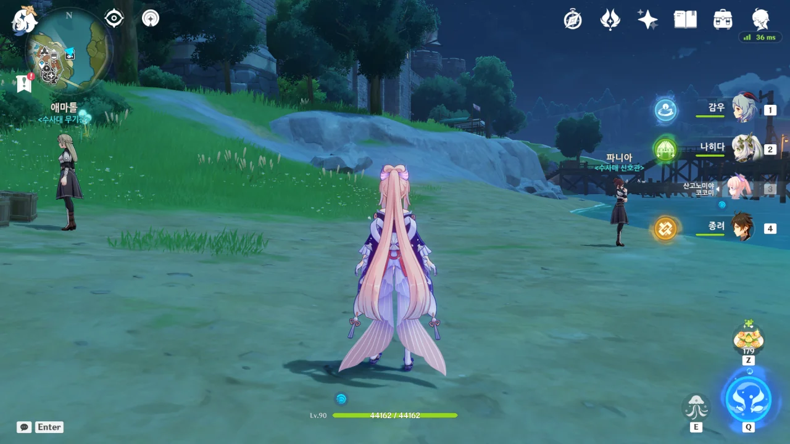
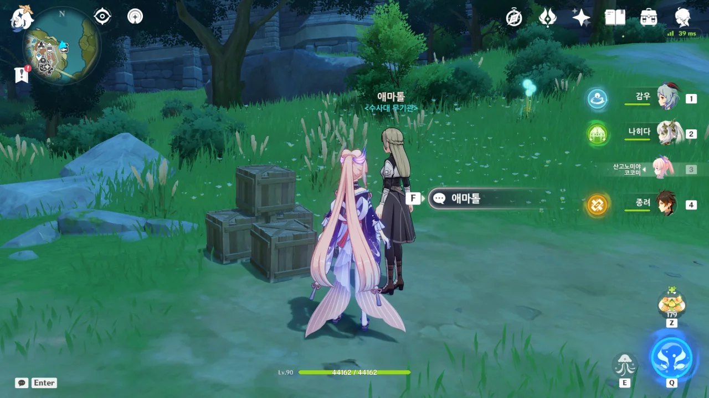
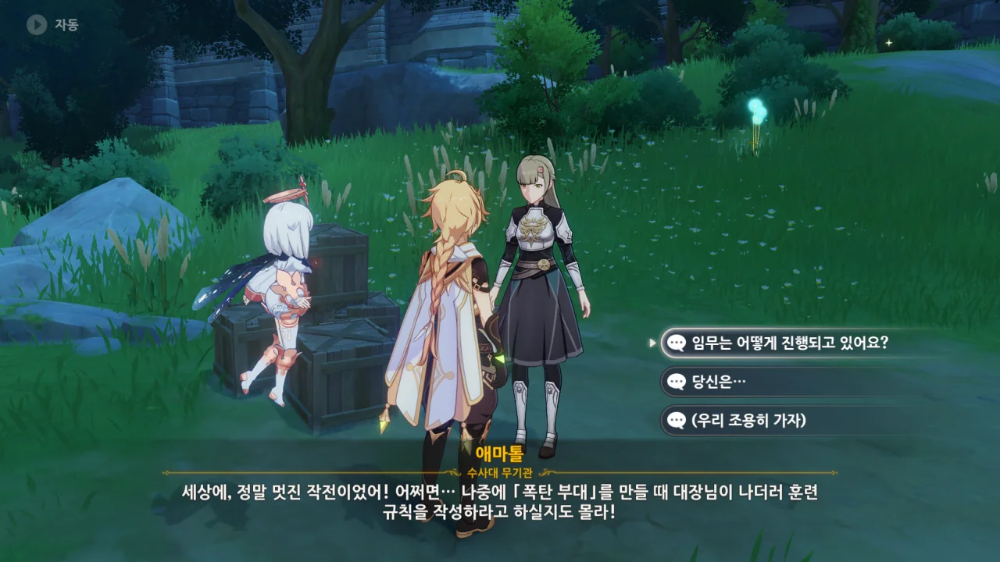
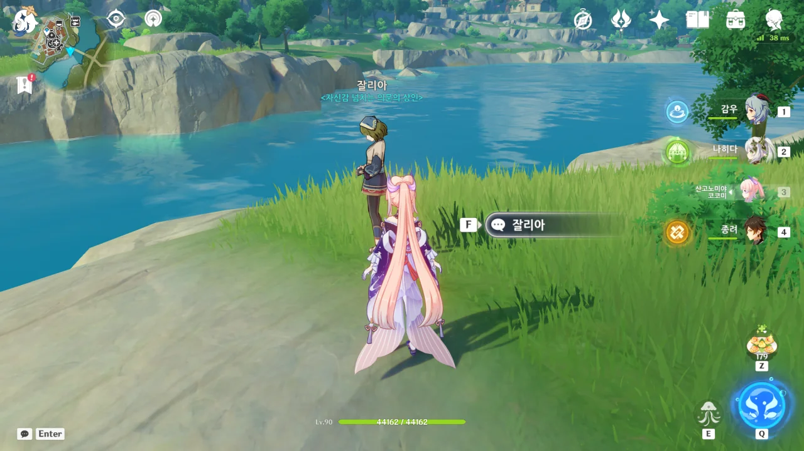
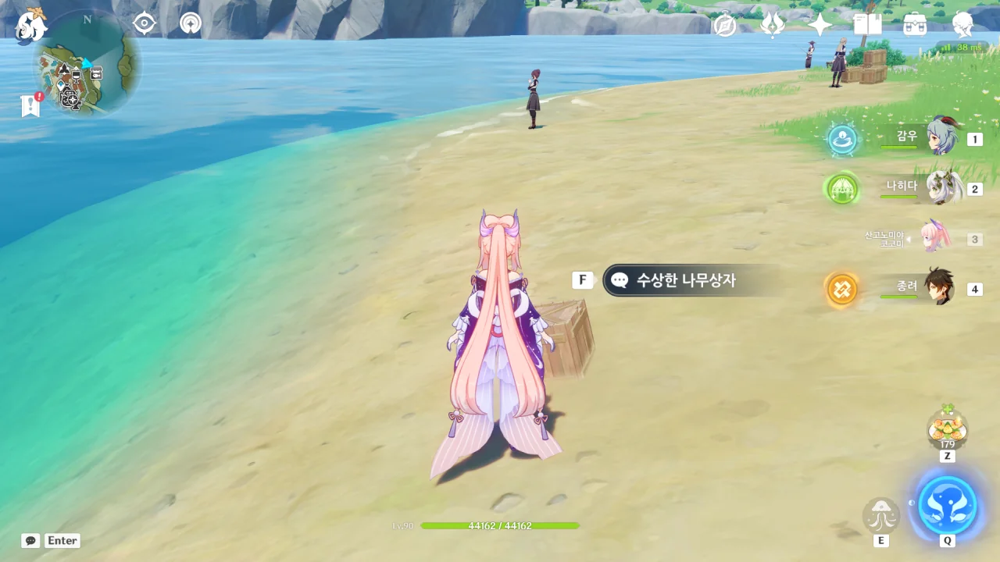
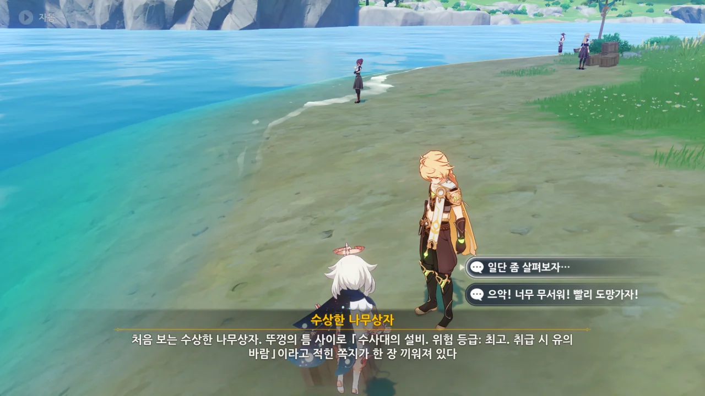
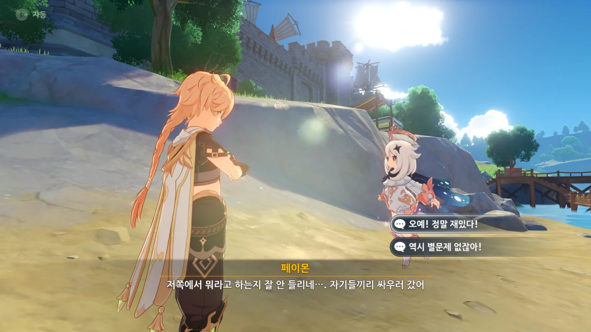
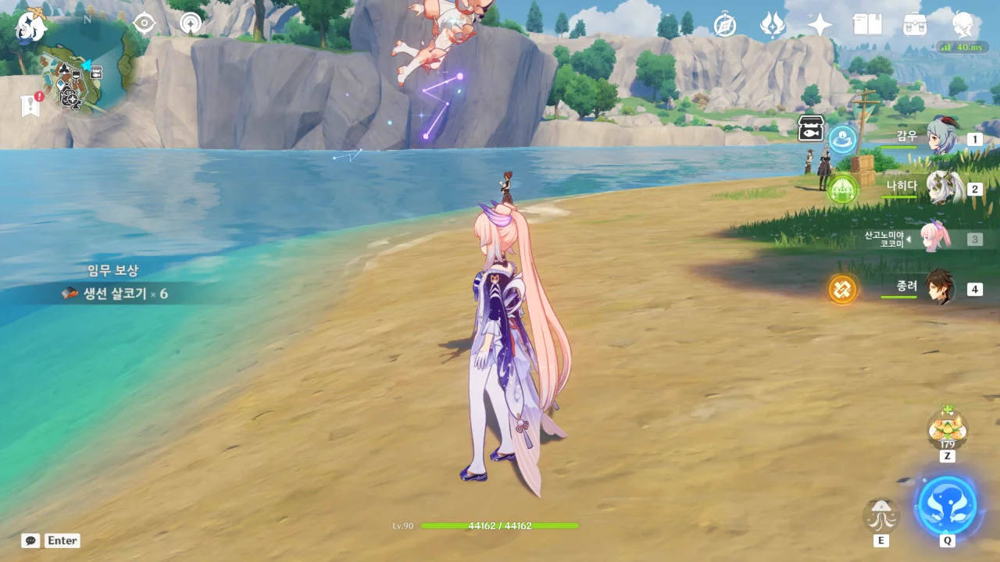

「도도코 쾅쾅 모험기」의 주된 이야기는 끝났지만, 아직 내가 보지 않은 이야기가 더 있다.

내가 미처 보지 못한 이야기라 할 수도, 후일담이라고도 할 수 있는 이야기이다.

몬드성 다리 북쪽에는 수사대원인 '애마톨'과 '파니아'가 서 있다.

수사대 무기관, 애마톨에게 먼저 말을 걸어본다.

「폭탄 부대」? 몬드도 드디어 척탄병을 도입하는 건가?





애마톨의 머리 위에 '&lt;수사대 무기관&gt;'이라는 직함이 적혀 있어 애마톨이 수사대의 무기관이라는 건 이미 알고 있지만, 대체 무기관이라는 직책은 뭘까?



> 기본적인 군사 정보 외에도 기사들의 전투 데이터를 조사, 통계, 분석하여 끊임없이 개선할 수 있는 전술을 탐색하고 전투력을 높일 수 있는 방법을 모색한다.
{.bq}

이건 수사대의 역할인 걸까, 무기관의 역할인 걸까?

방금 애마톨의 말을 들어보면 '무기관'의 역할인 것 같은데, 그렇다면 '무기관'이란 참모와 비슷한 역할이라고 이해하면 되는 걸까?



아, 앞서 말한 것은 수사대의 역할이고, '무기관'은 기사들의 전투력을 높이기 위해 실험 장비를 테스트하는 기사라고 한다.

한국으로 비유하면 국방과학연구소(ADD)의 역할인 것 같다.



이번 「침입 뿔복어 섬멸전」 임무에서 애마톨은 뿔복어를 제거하는 김에 특별한 폭탄을 테스트했는데, 무척 만족스럽다고 한다.

그 만족스럽다는 게 폭탄을 터트려서 만족스러운 거야, 아니면 폭탄의 성능이 출중해서 만족스러운 거야, 아니면 둘 다야?



애마톨의 말에 따르면, 애마톨은 전투 바보라 애마톨이 스무 명 있어도 멧돼지 하나 이기지 못할 것이라고 한다. 그런데 보통 '전투 바보'는 전투 말고는 아무것도 모르는 사람을 지칭할 때 쓰는 말 아닌가?

잠깐, 페이몬이 얼마나 있어야 멧돼지 하나를 잡을 수 있었지? 다섯 명이었나? 그러면 4 애마톨은 곧 1 페이몬이군.



어... 그게 명이 질기다고 그냥 넘어갈 수 있는 이야기인가? 통통 폭탄 제조법을 연구하는 동안 27번의 사고를 겪었다는 건 그럴 수 있다고 넘어갈 수 있지만, 그중 19번의 사고가 하늘로 날아갈 정도의 충격이었다고?

애마톨, 대체 넌 어떻게 살아있는 거냐?



심지어 하늘로 날아간 후에도 그저 붕대와 부목을 댄 채로 멀쩡하게 수사대 주둔지로 출근했다고 한다. 

애마톨, 너무 일중독 아냐?



너무 일만 생각하다가 몸을 축내기 딱 좋은 성격이다.



아무래도 이 대화 선택지는 「도도코 쾅쾅 모험기」 게임을 다 끝내기 전에 들었어야 하는 것 같다. 다음 대화 선택지의 존재를 생각해 본다면 말이다.





벌써 「침입 뿔복어 섬멸전」 임무가 완료되었다고 한다.



물속의 뿔복어 은신처는 전부 제거되었고, 그물을 빠져나간 물고기도 없다고 한다. 다만 일부 뿔복어의 은신처가 너무 견고해, 폭탄을 여러 개 투하하고 나서야 제거가 가능했다고 한다.

음, 왜 우리가 클레와 했던 「도도코 쾅쾅 모험기」 게임이 생각나는 거지? 그 게임에서도 수초가 폭발을 한 번 막는 장애물로 등장했거든.



무슨 말을 하는 건지 완전히 이해하긴 어렵지만, 클레의 통통 폭탄에는 화약이 많이 들어있고, 그 이유는 단단한 목표물에 대한 파괴 효과를 노리기 위함이라고 이해했다.

그래, 그 정도는 되어야 바람맞이 산 지형을 바꿀 수 있겠지.



괜찮아. 나도 잘 몰라.



폭발 에너지가 한 방향으로 집중되지 않고 여러 방향으로 퍼진다며, 자연스럽게 성형작약 이야기를 꺼내는 애마톨. 그거, 20세기나 되어야 나오는 개념인데?

애마톨은 잘만 하면 정말 클레를 뛰어넘는 폭탄 전문가가 될 수 있을 것으로 보인다.

클레의 통통 폭탄은 폭약의 성능이 좋은 거지, 폭발 에너지가 사방으로 흩어진다는 점에선 기존 폭탄과 다를 바가 없지만, 애마톨이 말한 성형작약은 폭발 에너지의 일부를 한 방향으로 집중시킬 수 있거든. 거기서 조금 더 발전하면 '폭발성형관통탄(EFP)'의 개념도 나올 수 있다.



애마톨의 머릿속은 지금 클레에게 감사의 의미로 대접할 식사와 새로운 구조의 폭탄으로 가득 차 있다.



그런데 이번 작전을 진행한 건 애마툴이지 않나? 물론 클레가 폭약 연구에 있어 많은 도움을 주긴 했지만 말이다.





애마툴은 자신의 폭탄 기술은 전부 클레에게서 유래한 것이라며, 클레가 없었다면 자신은 그저 체력도 모자라고 검술도 그저 그런 평범한 기사에 머물렀을 것이라고 말한다. 

그렇게 말한다면 클레도 별말 않고 애마툴에게 맛있는 식사를 얻어먹을 것 같다.





애마톨은 자신이 클레의 제자로 불리는 것조차 클레에게 부담이 될까 봐 만류한다. 그저 클레를 멀리서 관찰하는 것으로 만족한다고... 

이 정도면 진짜 클레의 광팬 아닐까?





그다음으로 &lt;수사대 신호관&gt; 파니아에게 말을 걸어보자.





왠지 모르게 여행자가 자꾸만 페보니우스 기사단 간부처럼 여겨지는 것 같다. 

여행자는 그저 명예 기사일 뿐이라고. 단순히 이름만 올려놓은 것이 전부인데 페보니우스 기사단 내부 문서를 볼 수 있을 리가...



파니아가 설명해준 사건의 개요는 다음과 같았다.

> 수메르에 살던 「뿔복어」가 어떤 상인의 악의 없는 방생으로 인해 시드르 호수에 대량 번식하게 되었다.
> 외래종이 시드르 호수의 수질과 몬드 주류업에 끼치는 영향을 막기 위해 페보니우스 기사단이 정찰 부대를 위주로 제한된 작전을 벌이는 중이다.
{.bq}

잠깐. '악의 없는 방생'이라고? 저번 이벤트인 '형광빛 수확'에서도 이런 일이 있었는데... 아냐, 일단은 정확한 이야기를 듣고 생각해 보자.



이번 작전에 투입된 건 파니아와 애마툴 단둘인 모양이다.

무력을 자제하고 외래종 물고기를 정확하게 퇴치하라니... 듣기만 해도 굉장히 어려울 것 같은 임무 내용인데?

파니아는 지금까지 폭탄을 정확히 몇 개 투하했고 몇 개의 뿔복어 은신처를 제거했는지 전부 기억하고 있다. 엄청난 기억력이야...

심지어 물속에 남은 폭발물 잔해가 환경에 미칠 영향까지 제대로 고려했다.



딱 봐도 어려워 보이는 임무였지만, 이번 임무에서 뭔가 배워간 것이 있는 모양이다. 그럼 다행이네.







페보니우스 기사단 사람들이 여행자를 자연스럽게 기사단 간부로 생각하는 걸 보면 가시방석에 앉은 것처럼 속이 불편해진다.

그야, 여행자는 명예 기사일 뿐이라서 기사단 간부가 아니거든. 현재 몬드에 있는 기사단 간부 대다수와 친분이 있긴 하지만...



페이몬의 장단에 맞춰줬는데, 오히려 분위기가 싸해졌다.



아, 분위기가 싸해진 것이 아니라, 그냥 이번 작전을 통해 얻은 경험을 일반화하기 어려울 것 같아서 입을 다물었던 거구나.





정찰 장비의 조작법을 크게 간소화했지만, 공간 인지 능력이 약한 사람들에겐 여전히 조작법이 어려울 것이라고 한다.

사용 중에도 크기가 비슷한 목표가 방출하는 난잡한 신호, 환경 소음, 교란 음원 등을 수신하게 되면 사용자가 정보의 홍수에 빠져버리게 된다고 한다.

이걸 각 소대에 보급하면 신호관들이 조작을 익히는 것만으로도 긴 시간이 걸리게 될 것이며, 이를 완화하고 진입 장벽을 낮추면 성능이 떨어지게 된다고 한다.

아직은 갈 길이 먼 장비라는 이야기네.

그런데 왜 파니아가 말하는 정찰 장비가 왜 「도도코 쾅쾅 모험기」 게임을 생각나게 하지?



이번에도 페이몬은 무슨 말을 하는 것인지 전혀 이해하지 못하고 있다.

저런... 가엾게도 멍청하군.



알베도가 제시한 기준, 너무 높지 않아?

> 미카의 1/3 정도 되는 공간 인지 능력과 교란 방어 능력

미카가 원정대에서 사전 정찰의 핵심 업무를 맡고 있으며, 기사단이 사용하는 군용 지도의 제작자이기도 함을 생각하면 이건 너무 높은 요구치이다.



대체 저 장치는 뭐지? 아까는 「도도코 쾅쾅 모험기」 게임과 비슷하다고 생각했는데, 지금 파니아의 말을 들어보면 그냥 광범위 스캔처럼 보인다.

여행자의 질문을 보면, 물속에서만 쓸 수 있는 것 같기도 하고...

내 추측이다만, 리사가 만든 「도도코 쾅쾅 모험기」에 등장한 뿔복어는 실제 시드르 호수에서 발견한 뿔복어 은신처를 게임에 맞게 도식화한 것이고, 여행자와 클레가 게임에서 제한된 폭탄만을 이용해 뿔복어를 제거하는 방법을 그대로 뿔복어 은신처 제거에 사용한 것이 아닐까?





물속에서만 정찰 장치를 쓸 수 있는 문제는 코어 부품에 쓰는 연금용 포션을 변경하면 해결된다고 한다.

정찰 장치의 탐지 범위가 일반 활의 사정거리의 3배나 되는 건 정말 대단해 보인다. 다만 여기서 '활의 사정거리'는 단순히 화살이 도달할 수 있는 최대 거리가 아니라, 맨눈으로 목표를 식별하고 맞출 수 있는 거리일 것이다. 유효 사거리라고 해야 할까?

정찰 장치와 관측 보고와 함께라면, 직접 맨눈으로 목표를 식별하지 않더라도 방렬을 통해 목표를 고슴도치로 만들 수 있다고 한다. 쏘는 게 포탄이 아니라 화살일 뿐이지, 포반과 매우 비슷한데?

진짜 말만 들으면 엄청난 장비다. 이 장비를 여행자가 쓰게 될 날이 올까?





아, 그야 여행자는 장병기나 활이 아닌 한손검을 쓰는걸...



몬드성 다리 옆에는 &lt;자신감 넘치는 의문의 상인&gt; 잘리아가 있다.





다른 사람에게 폐를 끼치는 나쁜 사람이 되고 싶지 않다고 흐느끼는 잘리아.

분명 호칭은 '자신감 넘치는 의문의 상인'인데, 호칭이 잘못된 거 아냐?



방금 기사단 본부에서 벌금을 물고 교육을 받고 나오는 길이라고 한다.

기사들이 인내심 있게 상황을 설명해 줬지만, 여전히 미안하고 후회되어 우는 중이다.



아, 시드르 호수에 수메르 어류를 풀어 놓은 게 바로 너였냐?





아잇, 젠장! 폰타인 헛소문이 티바트 생태계를 다 망치네! 폰타인 법률 집행청은 헛소문 똑디 관리 안 하고 뭐 하냐?!



악의를 갖고 한 짓도 아니었고, 이미 페보니우스 기사단에 의해 벌도 받았으니, 더는 뭐라 말할 수 없다.

잘리아 역시 몬드에 폐를 끼치려 한 방생을 한 것이 아니었다.



잠깐. 잘리아가 장거리 무역상이 된 이유가 아카데미아에서 유학한 적 있는, 그리고 몇 년 전 고향으로 되돌아간 몬드 학생 덕분이라고?

... 그거 리사 아냐? 조건에 맞는 사람이 리사 하나밖에 없는데?

아무튼, 리사는 고향으로 되돌아가기 전, **자신이 개발한** 「데굴데굴 펑펑 버섯」 게임의 운영을 잘리아에게 맡겼고, 그녀는 게임을 통해 사업 운영 자금을 꽤 벌었다고 한다.

리사, 분명 처음 말할 때는 그냥 학생들 사이에서 유행하는 게임이라고 하지 않았어? 그런데 그게 리사가 직접 개발한 거였다고?



울며 길을 걸어가는 잘리아를 보고 과자를 잔뜩 주며 위로한 빨간 옷을 입은 여자애는... 앰버 아니면 클레일 것 같은데, 앰버는 과자를 잔뜩 들고 다닐 것 같지 않다. 분명 클레겠지.





그냥 이번 일은 좋은 교훈을 얻은 대가라고 생각하면 될 것 같다.

벌금의 세기도 그저 이번 일로 인한 손해를 메꾸고 사태를 수습한 기사들의 급여를 주는 정도라고 하니, 그리 큰 것도 아닌 모양이다.

그리고 수메르와 폰타인에 돌아가면 사람들에게 생물을 방생한다고 복이 찾아오지 않는다고 좀 전해줬으면 좋겠다. 지금 폰타인에서도 비슷하게 형광 해파리를 방생한 사람들에게 복은커녕 불행이 찾아갔거든.

***

애마톨과 파니아 근처에 나무 상자 하나가 있다는 이야기를 들었다. 정말 있더라.

> 수사대의 설비. 위험 등급: 최고. 취급 시 유의 바람.
{.bq}

이 말은 '절 험하게 다뤄주세요'라는 뜻이다. '19금'이 '어서 들어오라'는 의미인 것과 같은 것이다.



이 상자는 애마톨과 파니아의 것으로 보인다. 안에 대체 뭐가 들었을까?



빨갛고, 동그랗고, 일몰 열매보다 훨씬 큰 공... 폭탄이네, 폭탄!

당장 갖고 놀자. 이걸 어떻게 참아? 폭탄이라고, 폭탄!



의외로 상식적인 말을 하는 페이몬을 살살 꼬신다.

페이몬. 폭탄을 던지는 느낌은 과연 어떨까? 폭탄이 터지면 어떤 느낌일까? 궁금하지 않아?



이런 건 원래 '하나쯤이야'가 '두 개 정도라면...'이 되고 '세 개까지는 괜찮잖아'가 되는 법이다.



어째 지문에서 '붕괴: 스타레일'의 냄새가 풍긴다. 물론 스타레일 쪽이 약을 더 빨았지만.



웁스. 사고를 친 모양이다. 아니, 이미 폭탄을 꺼낸 시점에서 사고 친 것이 맞지만.



파니아가 애꿎은 애마톨을 의심한다.

아니, 그런데 폭음의 성문을 구별할 수 있다고? 그게 가능해?



어우, 살벌하게 싸워댄다.



파니아가 다음 달 집세를 더 이상 깎아주지 않고, 그동안 참고 넘어갔던 물세, 가구 비용, 식비 등을 다 받아내겠다고 하자, 애마톨이 꼬리를 급하게 내리고 싹싹 빈다.

애마톨... 파니아 집에 신세 지고 있었구나...



애마톨의 폭탄은 물에 오래 잠기면 타이머 기폭 장치가 못쓰게 되나 보다.

그래서 둘이 예전에 츄츄족을 처리할 때 애마톨이 매복 장소로 기어가 기폭 장치를 작동시켰다고 한다.



> 하긴, 네 단순한 머리로는 타이머 기폭 장치를 이용해 날 놀릴 생각은 못 했겠지

아니 진짜, 너무 살벌하게 싸워대서 내가 다 미안할 지경이다.





파니아의 일은 청력과 크게 관련된 일인지, 파니아가 세세한 성문을 구별해 내지 못하면 실직하게 된다고 한다. 파니아는 감청수 같은 일을 하는 걸까?



말싸움에서 언제나 이기는 건 받아낼 빚이 있는 사람이다.

파니아가 직장을 잃으면 애마톨을 내쫓고 집세를 더 많이 주는 사람에게 집을 빌려주겠다고 으름장을 놓자, 애마톨이 또다시 꼬리를 내린다.



목소리의 높이를 낮춘 탓인지, 이후 둘의 대화는 더 이상 들리지 않는다.

아, 아무튼 우린 들키지 않았으니 아무런 문제가 없는 거다. 아무튼 그런 거다.



그래도 폭탄을 또 던지면 저 둘이 눈치채고 우릴 발견할 테니, 이쯤에서 그만하기로 했다.

아까 폭발에서 뿔복어 몇 마리가 튀어나왔다고 생선 살코기 6개를 주네 ㅋㅋㅋㅋㅋㅋ
