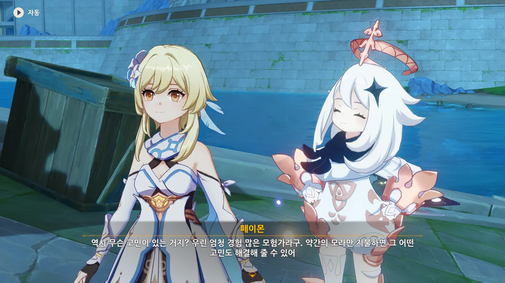
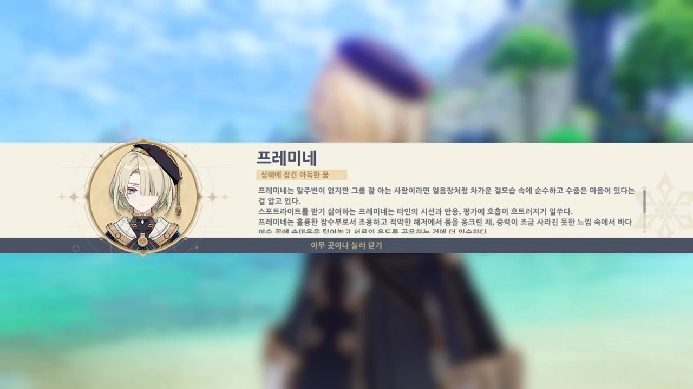
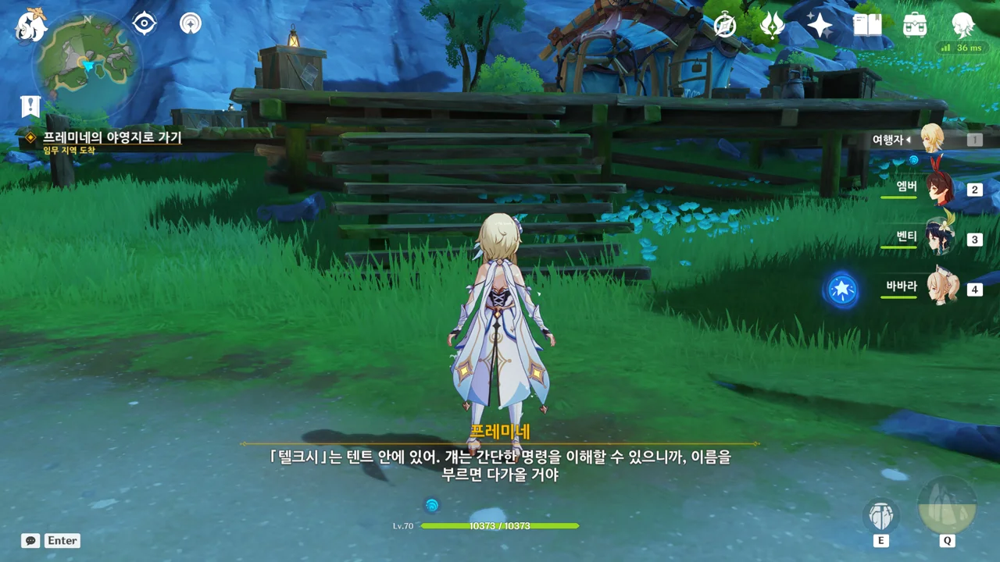
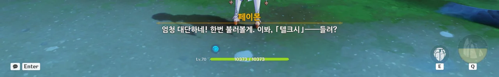
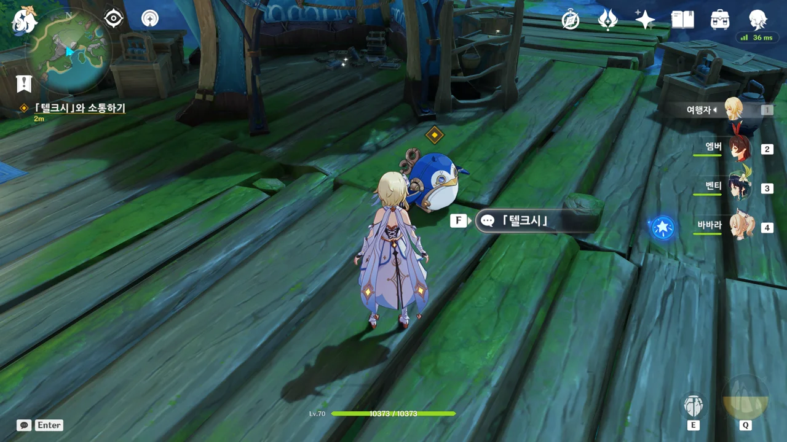
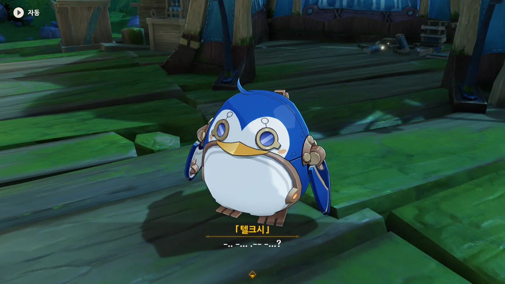
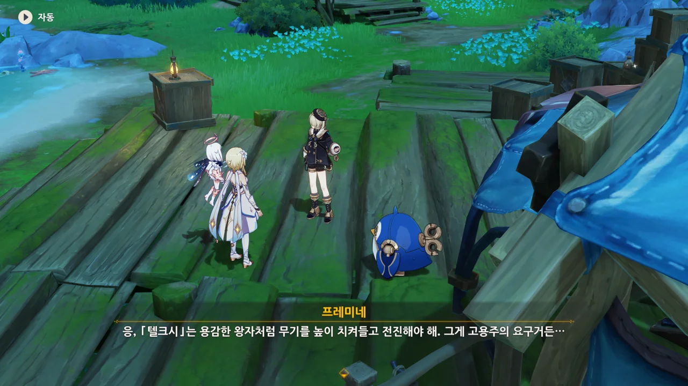
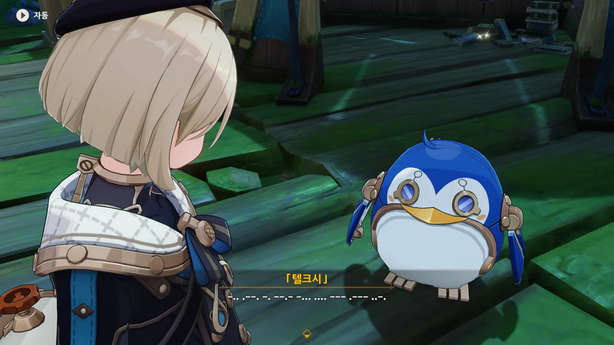
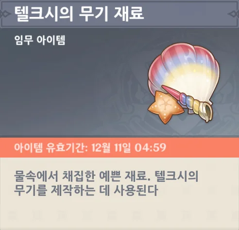

어휴... 이렇게 이야기가 있는 이벤트는 최대한 미루고 싶었는데, 하필이면 내일 푸리나 픽업이 끝나는지라, 원석을 하나라도 더 확보하기 위해 미루고 있던 이벤트를 진행하게 되었다.

아직 폰타인 마신 임무는커녕 리월 마신 임무도 다 못 봤는데... 아마 폰타인 마신 임무를 제1막까지만 보고 끝냈을 거다.

나중에 폰타인 마신 임무와 월드 임무, 전설 임무를 완료한 후 이 글을 다시 보면 분명 배꼽을 잡고 웃을 게 분명하다.



폰타인 낚시 협회의 대표, 들라로슈에게 가보니, 뭔가 알 수 없는 말을 중얼거리고 있다.



그래. 모험가란 원래 *약간의 모라*를 지불하면 일을 대신 처리해 주는 직업이니까.





에리니에스섬 낚시 포인트에 있던 물고기 떼가 갑자기 사라졌다고 한다. 물고기 떼가 *갑자기* 사라졌으니, 남획으로 인해 씨가 마른 건 아닐 거라고 한다.

여기까지 말했으면 뭐, 뻔한 이야기지. '내가 지금 자리를 비울 수 없으니, 너희가 가서 대신 조사해 달라'라는 말 아니겠어?



별것 아닌 거 같아 보이는데, 들라로슈는 이번 일이 '물 님프'의 소행 같다고 말한다.





폰타인 동화에 따르면, '텔크시'라는 이름의, 혼자 물가에 온 아이를 잡아먹는 물 님프가 산다고 한다.

신기한 건, 각자 텔크시의 외형에 대해 다르게 이야기한다는 것이다. 들라로슈의 아버지는 '미인 모습의 알록달록한 뱀'이라고 하고, 어머니는 '잘생겼다'라고 했다. 다른 사람은 '뚱뚱한 펭귄'이라고 하기도 했고.



그냥 단순히 어린 아이가 혼자 물가에 가는 걸 막기 위해 지어낸 이야기같이 보이는데... 폰타인 사람들은 동화를 잘 믿나 보네.





소문이긴 하나, 최근에 한 아이가 멍하니 물속으로 걸어 들어간 걸 봤다는 사람이 있다고 한다. 물 님프에게 홀려 물속으로 들어간 게 아니겠냐는데... 글쎄?

> 거기엔 오페라 하우스와 루키나 분수가 있는 데다, 수많은 수맥의 원천과 기이한 안개, 깊숙이 뿌리를 내린 거목도 있어. 심지어 그곳의 용 도마뱀은 말을 할 줄 안대...

저게 대단한 일인가...? 말할 줄 아는 용 도마뱀을 빼면 어딜 가나 하나쯤은 있을 법한 장소로 보이는데 말이다.

심지어 난 저 '말할 줄 아는 용 도마뱀'이 누굴 지칭하는 건지 알 거 같다. 이미 여러 임무의 이야기를 스포일러 당했거든.



어찌 되었든, 한 번 가보기로 했다.



생긴 지 얼마 안 된 발자국이 물속으로 이어진 걸 발견했다.

응? 소리? 무슨 소리? 아무런 소리도 안 들리는데?






물속에서 올라온 건 프레미네였다.



그러고 보니, 지금 이 계정으로는 프레미네를 처음 보는 거였지?

> 프레미네 --- 심해에 잠긴 아득한 꿈
> ***
> 프레미네는 말주변이 없지만 그를 잘 아는 사람이라면 얼음장처럼 차가운 겉모습 속에 순수하고 수줍은 마음이 있다는 걸 알고 있다.
> 스포트라이트를 받기 싫어하는 프레미네는 타인의 시선과 반응, 평가에 호흡이 흐트러지기 일쑤다.
> 프레미네는 훌륭한 잠수부로서 조용하고 적막한 해저에서 몸을 웅크린 채, 중력이 조금 사라진 듯한 느낌 속에서 바다 이슬 꽃에 속마음을 털어놓고 서로의 온도를 공유하는 것에 더 익숙하다.
> 내향적인 프레미네는 다른 잠수부들과 다르게 바깥 의뢰를 받지 않는다. 그는 오직 「부프 데테 저택」과 저택에 있는 소중한 가족들을 위해 움직인다.
{.bq}

저 「부프 데테 저택」이 곧 「벽난로의 집」이다.





물 님프 텔크시에 대해 조사하고 있다고 말하자, 의외라고 말하는 프레미네.



> 응... 그게 네 명령이라면...

명령이라니. 그저 부탁하는 것뿐인데.



프레미네의 장난감 펭귄?

흠... 태엽 공방에서 파는 장난감 펭귄을 예전에 어디서 한 번 본 것 같은데... 설마 그게 프레미네가 만든 건 아니겠지?

그나저나 장난감에 물 님프의 이름을 붙이다니, 희한하네.





다른 사람의 의뢰를 받지 않는 프레미네가 이번 의뢰를 받은 데에는 특별한 이유가 있는데, 그게 의뢰인의 사생활과 관련한 문제라 설명하기 곤란하다고 한다.

그래도 나중에 고용주가 진도를 확인하러 올 때, 여행자 일행을 고용주에게 소개해 주겠다고 한다. 그러면 물고기 떼가 사라진 이유에 대해 단서를 조금 더 얻을 수 있겠지.




여행자의 설명을 들은 프레미네는 물고기 떼가 사라진 것이 물속에서 「텔크시」를 테스트할 때 발생한 소음 때문이라고 추측한다.



심지어 들라로슈가 말해준, 누군가가 봤다는 '귀신에 홀린 듯 물속에 들어간 아이' 역시 프레미네일 것이라고 한다. 



그럼, 물고기 떼가 사라진 건 그냥 단순한 해프닝이었던 것으로 하자.

프레미네가 텔크시를 압력 테스트한 곳이 우연히 낚시 포인트 근처였고, 그래서 물고기 떼가 소음을 피해 사라진 것이었다.







프레미네의 일을 도와주면 프레미네가 일을 빨리 끝낼 수 있을 것이고, 그러면 압력 테스트도 질질 끌 필요가 없어진다. 그러면 물고기 떼도 더 일찍 돌아올 수 있겠지.

프레미네는 의뢰를 빨리 끝내서 좋고, 들라로슈는 낚시 포인트에 물고기가 일찍 돌아와 좋다.

이게 바로 누이 좋고 매부 좋다는 거다.







텔크시를 부르자, 텔크시가 텐트 안에서 폴짝대며 나온다.

정말 신기하네.



텔크시가 모스 부호처럼 보이는 말을 하길래 해석해 보았다.

```
-.. -... .-- -... ?
CAVA?
안녕?
```

이걸 어떻게 해석했는지는 다음 글에서 설명하겠다.



「페어」? 처음 듣는 단어인데. 아무래도 마신 임무나 전설 임무 등에서 나온 것 같다.

이래서 마신 임무 같은 건 제때제때 나오자마자 해야 한다.

그나저나 「펭귄 마을」이 어디냐고 묻자, 프레미네가 '별 볼 일 없는 곳'이라며 신경 쓰지 말라고 한다.

그러니까 더 궁금한데.



```
-.. -... .-- -... ?
CAVA?
Hello?
안녕?
```

아까랑 똑같은 반응이다.



원래 텔크시에 언어 출력 모듈을 설치할 예정이었지만, 일정이 촉박해 포기했다고 한다.

우리가 이해할 수 없을 뿐이지, 텔크시는 우리의 말에 반응 자체는 제대로 하고 있다고 한다.



다만 이렇게 언어 출력 기능을 넣으려던 건 고용주의 요구 사항이 아니라, 프레미네의 개인적인 시도였다고 한다.

그런데 이렇게 언어 출력 기능을 넣어도 괜찮은 걸까? 고용주가 이걸 좋아할지 잘 모르겠네.



프레미네가 부탁하고 싶은 건 두 가지이다.

1. 텔크시의 메인보드 회로 테스트
2. 텔크시의 무기 제작에 필요한 재료 수집

텔크시가 전투도 하는 건가?



고용주의 요구에 따라, 텔크시는 용감한 왕자처럼 무기를 높이 치켜들고 전진해야 한다고 한다.

고용주의 요구가 저랬다고? 텔크시의 사용 용도가 대체 뭐길래?



텔크시의 탄생 목적은 '동반자가 되기 위해'라고 한다.



```
-.. .--. -. --.- -... .... --- .--- ..-.
COMPAGNIE
Company
동반자
```



아까 말했다시피, 텔크시는 우리의 말에 있는 키워드에 반응한다고 한다. 다만 그걸 우리가 알아들을 수 있는 언어로 표현할 수 없어서 그런 거지...





곧바로 메인보드 테스트를 해보기로 했다.


아아, 이거 옛날 생각 나는걸.

이번 미니 게임은 목표 지점까지 최단 경로로 이동하면 되는 '거북이 로봇'과 비슷하다. 선이 아닌 칸을 따라 이동한다는 게 조금 다르지만.



튜토리얼이라서 그렇겠지.



이젠 물속에서 텔크시의 무기 재료를 찾아야 한다.





메아리 소라를 활성화하면 이렇게 목표 지점이 밝게 빛난다.

원소 시야와 비슷한 방식이네.



수집한 곳에 따라 아이템 아이콘이 달라질 줄 알았는데, 전부 같은 아이콘을 쓰더라.
