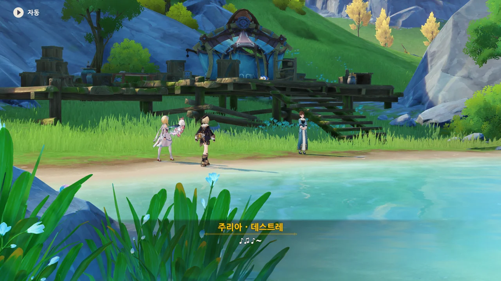

프레미네의 야영지로 돌아오니, 누군가가 야영지에서 노래를 부르고 있다.



이 사람이 누군가 했는데, '주리아·데스트레', 프레미네를 고용한 사람이다.

> 서두를 것 없어. 난 고용주지 현장 감독이 아니니까.

저렇게 말하는 걸 보니, 마음이 굉장히 넓은 사람이 틀림없다.



여행자와 페이몬을 "절 도우러 온 믿음직한 동료"라고 소개하는 프레미네의 말을 듣고, "믿음직한 사람 주변에는 늘 믿음직한 친구가 있기 마련이지"라고 말하는 주리아.

나, 벌써 이분이 마음에 들었다.



페이몬은 물론이요, 여행자에게도 "작은 요정처럼 사랑스럽다"라고 말하는 주리아.



와, 반쯤 장난으로 던진 말이었는데, 물론이라고 하네...

그런데 주리아에게 아이가 있었다고? 처음 듣는 이야긴데.



프레미네가 의뢰인의 사생활과 관련한 이야기라 말하지 않았다고 하자, 생각보다 더 믿음직한 사람이라며 프레미네를 칭찬하는 주리아.



사실 주리아의 이야기가 굉장히 궁금하다. 대체 무슨 일이 있었기에 장난감에 물 님프 이름을 붙인 걸까?





주리아의 아이는 다른 아이들과 다르게 텔크시의 이야기에 푹 빠졌다고 한다.

그 아이는 물 님프가 노래를 부르는 건 물 님프가 외로워하기 때문이라고 생각해, 어른들의 바람과는 다르게 종종 혼자 물가로 갔다고 한다.

그런데 '고독증'은 대체 뭐지?



고독증은 정신 질환 중 하나로, 고독증 환자는 깊은 외로움을 느껴 대부분의 일에 흥미를 잃고 말수가 극히 적어진다고 한다. 말수가 0.1% 정도로 줄어드는 거면 굉장히 많이 줄어드는 거지.

&nbsp;

말수가 극도로 줄어든다는 것에 정확히 들어맞는 진단 기준은 없지만, DSM-5의 '자폐성 장애'에는 이런 문구가 있다.

> 사회적-감정적인 상호성의 결함 (예. 비정상적인 사회적 접근과 정상적인 대화의 실패, 흥미나 감정 공유의 감소, 사회적 상호작용의 시작 및 반응의 실패)
{.bq}

고독증은 여기에 포함되는 걸까? 뭐, 의사도 아닌 내가 번역된 DSM 내용만 보고 판단할 근거는 없지만...



주리아의 아이는 고독증에 더해 '통제 불능 환상'이라는 증세까지 겪고 있다고 한다.

'통제 불능 환상'은 주체할 수 없는 환상과 환각에 사로잡혀, 현실과 환상을 혼동하는 증상이라고 하는데, 조현병 양성 증상 중에 환각과 망상이 있다.

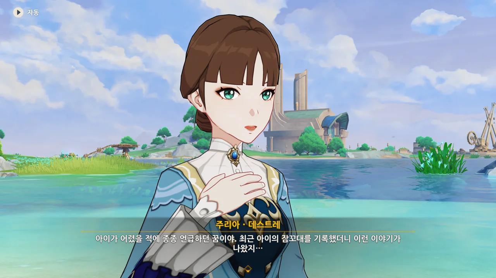

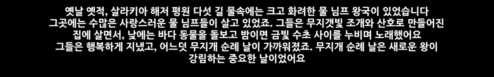

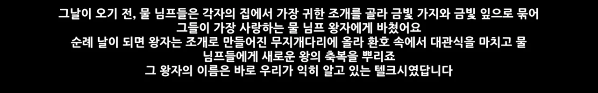

그냥 평범한 동화 속 이야기 같은데? 고독증만 아니었다면 동화 작가를 해도 되겠어.



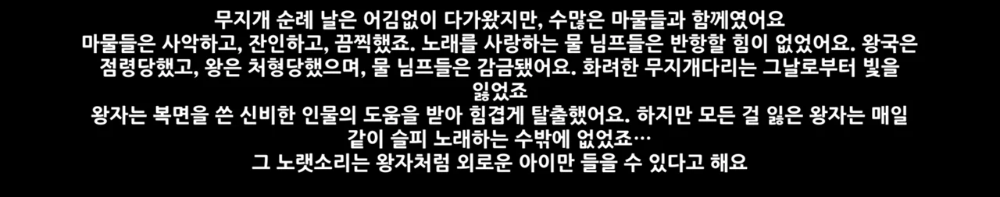

하지만 그다음 이어지는 이야기가 너무 비극적이다.

설마 여기서 이게 다인가? 그다음의 이야기는 없는 거야? 보통 이런 비극적인 이야기가 나오면 그다음 이어지는 이야기는 고난과 역경을 극복하고 '영원토록 행복하게 잘 살았습니다'라는 게 정석이잖아.





주리아의 아이는 갈수록 그 동화에 과몰입하게 되어, 급기야는 자신이 동화 속 왕자인 텔크시라고 믿게 되었다고 한다.

페이몬이 하루빨리 통제 불능 환상을 통제해야 한다고 하는데... 그게 쉬울 리 없을 거 같은데. 그게 쉬웠다면 프레미네가 이렇게 여기서 「텔크시」를 만들고 있을 리 없잖아.



주리아가 주치의와 상의한 후에 내린 결론은 아이의 환상을 다른 방향으로 유도한다는 것이었다.

무작정 환상을 차단하기보다, 그 환상을 역으로 이용한다는 발상인데... 과연 괜찮을까? 오히려 악화하는 건 아닐까?

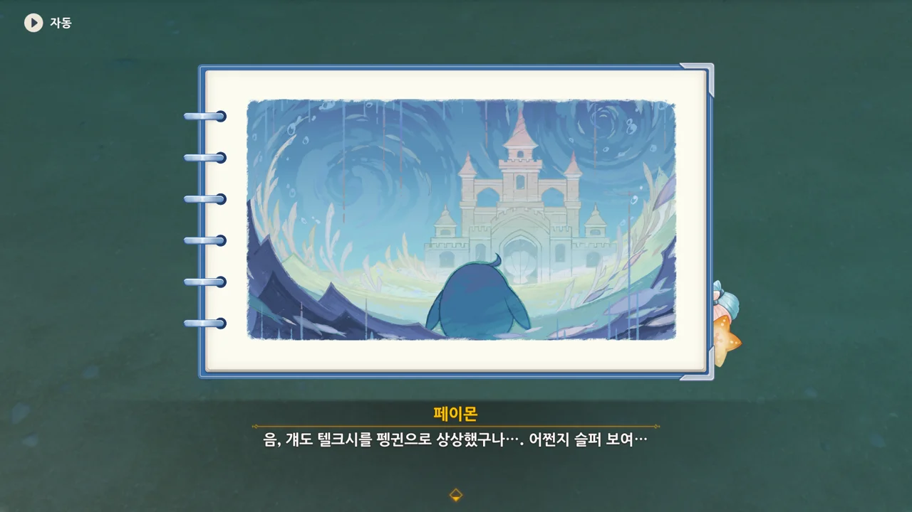

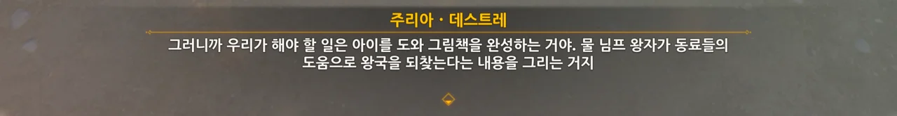

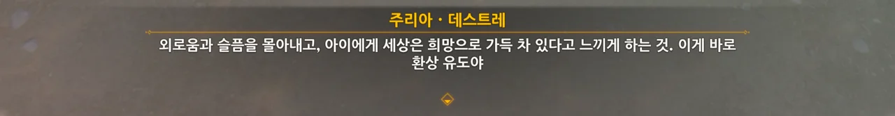

프레미네가 만든 펭귄 모양을 한 장난감이 텔크시라는 이름을 갖게 된 이유가 바로 여기에 있었다. 주리아의 아이가 상상한 텔크시가 펭귄 모양이었으니까.

그림책을 희망찬 내용으로 채워, 아이의 환상을 유도한다고 하는데... 난 좀 불안하다. 잘 안될 것 같거든.



현재 주리아의 아이가 여행을 떠날 수 없는 상태이기 때문에, 「텔크시」를 아이의 분신으로 삼아 함께 물 님프 왕국으로 향하고, 그 과정을 그림책에 담을 거라고 한다.

보통은 물 님프 왕국의 모습을 적당히 꾸며낼 텐데, 주리아는 직접 물 님프 왕국에 가 그 모습을 그림책에 담겠다고 한다. 정말 지극정성이네...

그런데 물 님프 왕국은 주리아의 아들이 본 환상에서 나오는 장소잖아. 설마 실존하는 장소는 아닐 테고...



아, 살라키아 해저 평원에 있는 한 수중 유적을 물 님프 왕국으로 삼았다고 한다.



음... 잘 모르겠다. 진짜가 아님을 알지만, 진짜처럼 생각하고 행동하라고? 그게 메소드 연기잖아.

뭐, 직접 해보면 되겠지. 원래 이해가 잘 안될 때는 직접 부딪혀보는 게 최고다.



우울은 전염된다며, 긍정적으로 생각하자고 하는 주리아. 그래, 맞는 말이다. 우울한 생각은 하루라도 빨리 떨쳐내야 해.

이야, 그나저나 저기 저 꼭대기에 있는 집에 이사한 거야? 굉장히 높은 곳에 있네.



「텔크시」가 완성되는 이틀 후, 물 님프 왕국으로 출발하기로 했다.



아까 주리아가 있어 미처 하지 못한 말이 있다며, 텐트 쪽으로 가자고 하는 프레미네.

주리아가 있어 하지 못한 말이라면 분명 듣기 거북한 말이겠지? 아니면 주리아가 알면 안 되는 일이거나...

하지만 그 전에 주변에 있는 것들을 먼저 읽어보기로 했다.

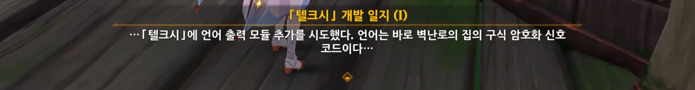

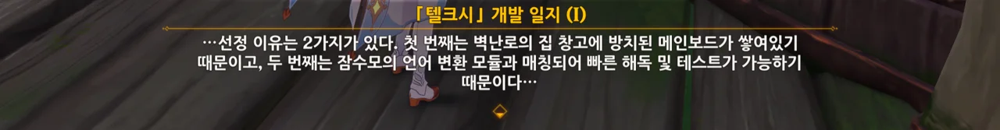

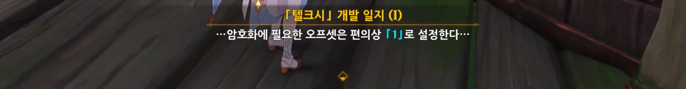

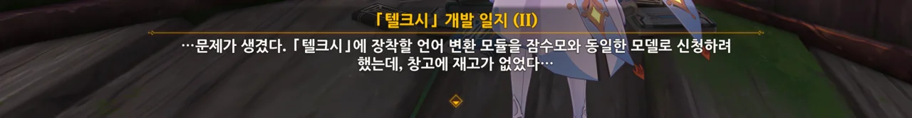

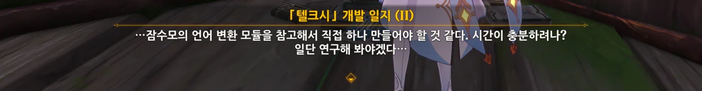

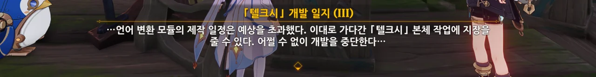

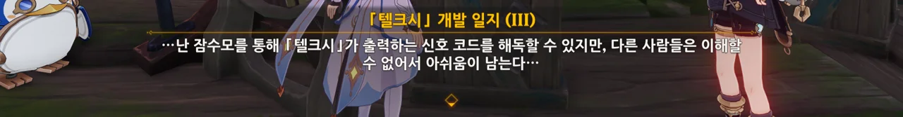

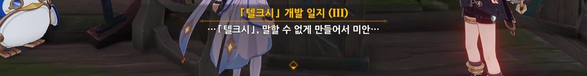

텔크시에게 「벽난로의 집」 창고에 방치된 메인보드를 이용해 언어 출력 모듈을 추가하려 했지만, 재고 부족과 시간 부족으로 인해 개발이 중단되었다고 한다.

&nbsp;

그리고 바로 이 개발 일지에서 「텔크시」의 모스 부호를 해석할 힌트를 얻을 수 있다.

이전에 「텔크시」가 처음으로 말한 모스 부호를 보자.

```
-.. -... .-- -... ?
```

[모스 부호 복호화 사이트](https://morsedecoder.com/)에서 해당 모스 부호를 해독하면 다음과 같은, 알아볼 수 없는 문자열이 나온다.

```
DBWB?
```

여기서 프레미네의 개발 일지에 나온 '오프셋'이 활약한다.

암호화 기법은 크게 두 가지로 나눌 수 있는데, 비밀키(대칭키) 암호화 기법과 공개키(비대칭키) 암호화 기법이다.

공개키 암호화 기법을 썼다면 공개키와 개인키, 두 가지 키가 필요하므로, '오프셋'이라는 단어가 나올 필요가 없다. 따라서 암호화에 쓰인 건 비밀키 기법이다.

여기서 복잡한 현대 암호화 기법을 썼을 리 없으니, 고전 암호화 기법 중 '오프셋'이 나올 만한 암호화 기법을 찾아보면 '카이사르 암호'가 나온다.

이제 조금 전 얻었던 `DBWB?`를 오프셋 1로 해독하면 `CAVA?`가 나온다.

폰타인은 프랑스에서 모티브를 얻은 국가이니, 프랑스어로 해당 단어를 번역하면 영어로는 'Hello?', 한국어로는 '안녕?'이 나온다.

&nbsp;

모스 부호 해독 끝!

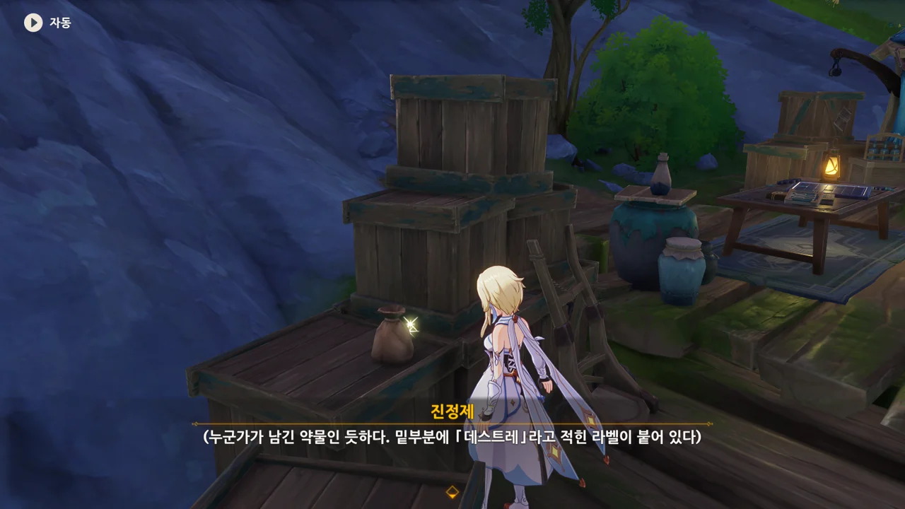

진정제...? 주리아의 아들이 먹는 약인 걸까? 그러면 주리아의 아들 이름이 여기 붙어있어야 하는 거 아닐까? 왜 헷갈리게 성씨를 쓴 거지?



여행자에게 마음의 준비를 단단히 해두라는 프레미네. 왜?



이번에 원하는 결과가 나오지 않아도 너무 자책하지 말고 받아들였으면 좋겠다고 말하는 프레미네. 아까 주리아와 이야기할 때 서로 긍정적으로 생각하자고 한 것과는 정반대의 이야기이다.

대체 왜? 설마 고독증과 통제 불능 환상은 난치병인 거야?



고독증과 통제 불가 환상에 대해 뭔가 알고 있는 눈치던데, 전임 원장 시절 벽난로의 집에서 해당 질환을 겪는 환자들을 본 적이 있다고 한다.



프레미네가 본 대부분 환자의 예후는 좋지 않았다고 한다. 최악의 경우, 환자가 죽어버리기까지 했다고.

&nbsp;

자폐성 장애를 가진 환자는 자신에게 벌어지는 상황을 잘 이해하지 못해, 치료에 협조하지 않는 경향이 크고, 이에 따라 치료를 하고 싶어도 치료를 할 수 없어 죽는 경우가 많다고 한다.

> 치료를 못 받는 여건이어서가 아니라 도저히 치료할 수 없어 죽음에 이르곤 한다.
{.bq}



하지만 난 이 이야기의 끝을 보고 싶다.





그래. 나도 계속 그게 궁금했다.

아무리 주리아의 아들이 환상 속에 갇혀 있다지만, 해피 엔딩을 그린 그림책을 보여준다고 그 환상이 긍정적인 방향으로 틀어질 것 같지는 않던데...

하지만 프레미네는 주리아의 아이가 환상을 만들어 낸 이유가 자신을 구하기 위해서이고, 그 환상을 통제하지 못해 환상이 무너져 내렸다고 생각하고 있다. 그래서 우리가 그림책을 통해 그 환상을 통제하고 어둠 속에서 탈출할 수 있도록 도와준다면 증세가 호전될 것이라고 말한다.

그렇게 본다면 가능할 것 같긴 한데...






알고 보니 프레미네 역시 동화 세계를 꿈꿨고, 거기서 많은 도움을 받았다고 한다.

그러니까 저번에 프레미네가 말한 '펭귄 마을'도 프레미네의 동화 세계의 일부란 거지.

그걸 지적하자, 프레미네가 부끄러운지 잠수모를 꺼내 써버렸다.



왜긴 왜겠어. 쑥스러우니까...



주리아의 아이가 본 환상에서 나온 「텔크시」가 펭귄의 모습을 한 것도 그렇고, 프레미네의 '펭귄 마을'도 그렇고, 저번에 장난감 전쟁 이벤트에서 나온 장난감의 모습이 펭귄인 것도 그렇고...

폰타인 사람들은 펭귄을 정말 좋아하는 게 틀림없어!



> 내가 「페어」를 만든 게 아니라, 「페어」가 내 필요를 감지하고 날 선택한 게 아닐까?

이 말을 했다가 곧바로 페이몬에게 '너도 통제 불능 환상을 앓고 있는 거 아냐?'라는 신랄한 말을 들은 프레미네.

&nbsp;

솔직히 말하자면, 나도 페이몬과 비슷하게, '환상 속 세계'를 부정한다. 더 정확히 말하자면, '상상 속 세계는 복수의 정상 관찰자에 의해 실제로 관찰되기 전까진 존재하지 않는다'라는 생각이다.

여기에 관해 설명하자면 좀 길어지니, 그건 언젠가 있을 다음 기회에 하도록 하자.





그래도 현실과 환상을 구분할 줄 안다니, 다행이네.

프레미네에게 있어, 현실과 환상을 구분하는 트리거가 잠수모를 쓰는 것인가 보다.



물속에서 바깥을 바라보는 것과, 잠수모 속에서 바깥을 바라보는 건 아마 비슷한 느낌일 거다. 둘 다 외부와 격리된 환경에서 바깥을 관찰자의 시점으로 보는 거니까.



그래도 프레미네가 저렇게 말하니, 한번 잠수모를 쓰고 바깥을 보고 싶긴 하다.

그런데 그걸 명령이라 받아들이는 프레미네 앞에서 '맞아, 명령이야'라고 할 수는 없겠더라.

프레미네는 왜 이렇게 명령에 집착하는 건지...



프레미네는 「텔크시」의 무기도 만들어야 하니, 이틀 후에 다시 여기서 보기로 했다.
