

주리아의 아이의 상태는 현재 안정적이라고 한다. 아이와 기분 전환 겸 산책하러 나가도 좋다고 주치의가 말할 정도면 정말로 상태가 꽤 나아진 것으로 보인다.





오, 텔크시가 무기와 방패를 들었다.

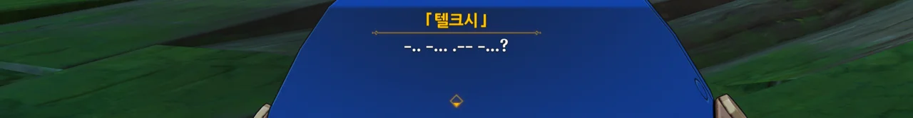

```
-.. -... .-- -... ?
CAVA?
안녕?
```

모스 부호 해석하는 것도 일이다...



응? 저게 검이었어? 난 단창인 줄 알았는데...



프레미네가 물 님프 왕국으로 출발하기 전, 대관식에 쓸 왕관의 재료를 모으는 걸 여행자에게 부탁한다. 재료는 가는 길에 채집하면 될 거라고 한다.



물 님프 왕국으로 출발하기 전, 주리아가 텔크시의 새로운 모습을 그림책에 싣자고 한다.



거기에 프레미네가 그림책의 내용이 너무 슬프지 않도록 기존의 그림을 수정하자고 제안한다.

난 개인적으로 원래 이야기 내용에 그대로 왕자가 기운을 차리고 물 님프 왕국을 수복하는 내용을 덧붙여도 좋다고 생각하지만...



좌절을 딛고 어둠과 싸우겠다는 왕자의 결심을 상징하는 용기의 검과 결의의 방패를 추가한다.



텔크시는 이제 혼자 싸우지 않는다. 동료도 추가하자.

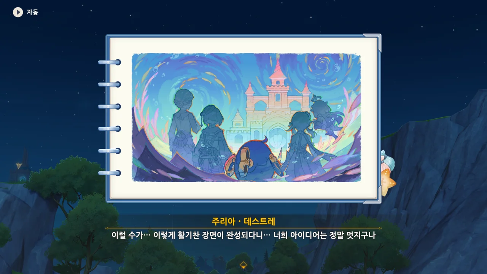

텔크시의 앞날은 더 이상 어둡지 않고 알록달록하고 희망으로 가득 찰 것임을 나타내도록, 그림의 색감을 수정한다.



> 내 아가, 보고 있니? 너도 분명 격려받았겠지?

으응? 주리아의 말이 좀 이상한데. 저건 마치 이미 죽고 없는 사람에게 하는 말 같잖아...

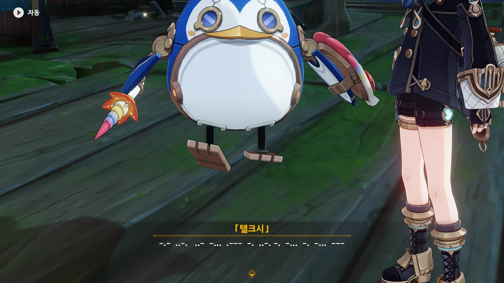

```
-.- ..-. ..- -... .--- -. ..-. -. -... -. -... ---
JE T'AIME MAMAN
엄마, 사랑해요
```

주리아가 마치 죽은 사람에게 하는듯한 말을 한 데 이어, 그에 대한 텔크시의 대답도 수상쩍기 그지없다.

설마 주리아의 아이는 이미 죽었으며, 텔크시에게 그 유령이 빙의되어 있다거나 그런 건 아니겠지...?






아무튼, 서둘러 물 님프 왕국으로 향한다. 방금 건 분명 착각이었을 거야...

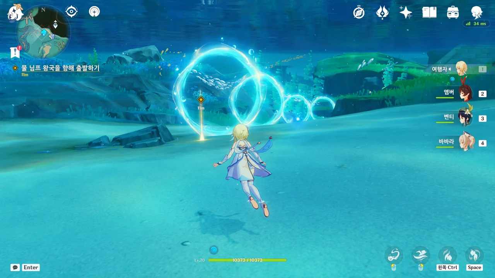

여긴 신기하게 되어 있네... 마치 미니 게임을 하듯이 이동하게 되어있다.

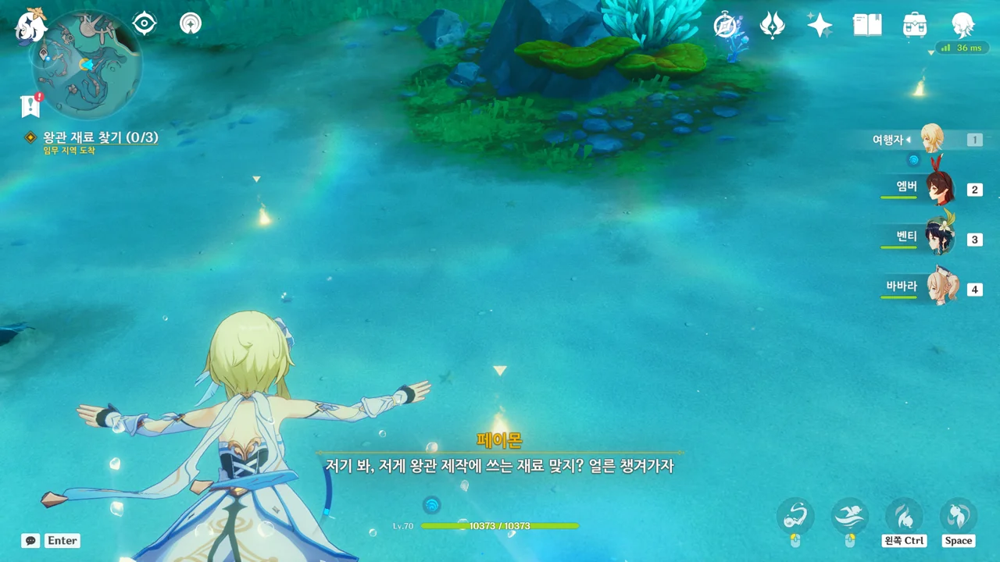

이동 중 텔크시가 쓸 왕관을 위한 재료를 수집한다.

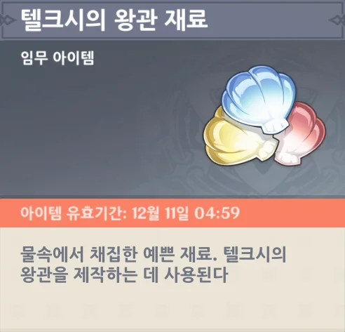

> 텔크시의 왕관 재료
> ***
> 물속에서 채집한 예쁜 재료. 텔크시의 왕관을 제작하는 데 사용된다.
{.bq}

아이템 설명이 참 성의 없다고 생각했는데, 예전에 모았던 '텔크시의 무기 재료'의 설명과 비교해 보니 별반 다른 게 없었다.

> 텔크시의 무기 재료
> ***
> 물속에서 채집한 예쁜 재료. 텔크시의 무기를 제작하는 데 사용된다.
{.bq}



이벤트 비경 입구를 이렇게 물속에서 보게 되니, 뭔가 기묘한걸.

지면에 있을 때는 문 앞에 계단이 있었는데, 물속에 있다 보니 계단 없이 비경 문만 덩그러니 놓여있다.

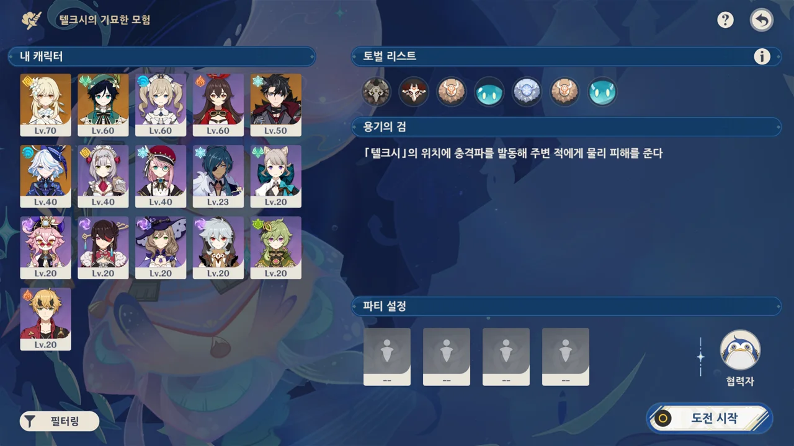

으응? 설마 여기서 전투해야 해? 그냥 이야기만 보는 게 아니었어?

지금 캐릭터 레벨을 보면 알겠지만, 여행자 혼자만 70 레벨이고, 나머진 기껏해야 60 레벨이다. 이 상태로는 뭘 하기가 힘든데...



오... 꽤 그럴듯한 곳이잖아, 여기.

그런데 다시 보니, 여기는 다른 이벤트에서도 한번 썼던 곳이었다. 으음, 이렇게 공간을 재활용하는 건 나중에 있을 이벤트에서도 이 장소를 몇 번 더 보게 될 거란 건데...



페이몬은 정말 동화속 세계가 눈앞에 펼쳐질 거라 기대했는지, 조금 실망한 모습이다.

프레미네 역시 그렇게 꾸미고 싶었지만, 인력과 시간이 모자라 그냥 있는 그대로 모습을 쓰기로 한 모양.

> 저에게 시간과 예산이 조금만 더 있었더라면...

이거 완전 니트로 박사 아닌가?



맨 처음 이야기했을 때, 이걸 단순한 연극으로 생각하지 말고, 진짜 물 님프 왕국인 것으로 생각하기로 했잖아. 뭘 새삼스럽게...



갑자기 '물 님프 왕국을 수호하는 여신 페이몬' 역할을 자처한 페이몬.

어... 음... 에라, 모르겠다. 어떻게든 되겠지.





그러더니 갑자기 이야기가 '금도끼 은도끼'로 바뀐다. 페이몬, 이게 맞아? 지금 프레미네와 주리아 모두가 급전개에 의문을 표하고 있잖아.

&nbsp;

나도 검색하다가 알게 된 건데, 금도끼 은도끼 이야기는 사실 그리스 이솝 우화에 수록된 이야기라고 한다. 난 지금껏 이게 한국의 전래동화인 줄 알고 있었는데 말이다. 원제는 '나무꾼과 헤르메스'라고 하더라.



아무튼 이건 여신의 시련이라며, 우리의 마음속에 일말의 탐욕도 없음을 알게 되었으니 그 보상으로 금 영광과 은 영광, 동 영광을 전부 주겠다는 페이몬. 텔크시에겐 특별히 무지갯빛 영광을 하사한다.

금도끼 은도끼 이야기가 너무 급작스럽게 시작했다 끝나버렸어...

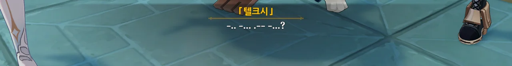

```
-.. -... .-- -... ?
CAVA?
안녕?
```

거 봐. 텔크시도 지금 고장 났잖아.



주리아와 프레미네가 장단을 잘 맞춰준 덕분에, 어찌저찌해서 이야기가 부드럽게 흘러간다.

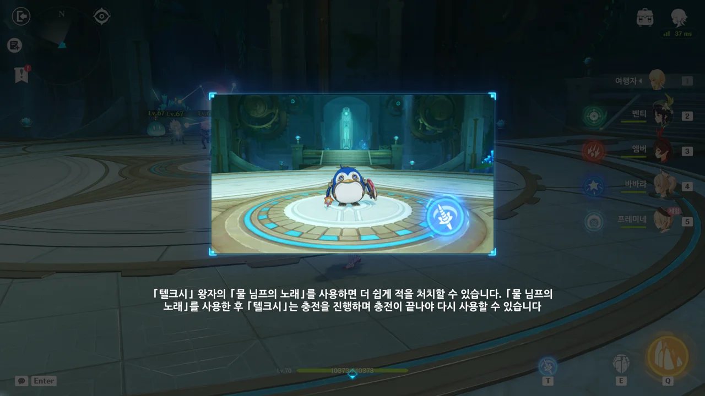

아니... 진짜로 싸우는 거야?

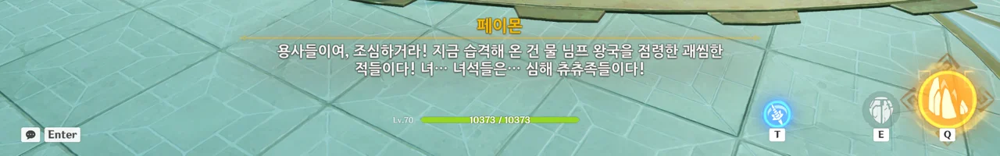

심해 츄츄족이라니... 너무 이름을 대충 지은 거 아냐? ㅋㅋㅋ...

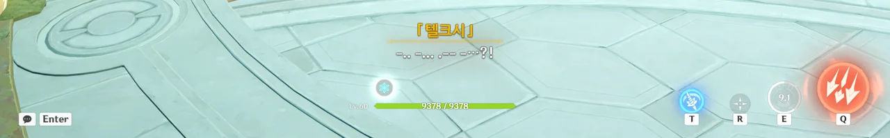

```
-.. -... .-- - …?!
CAV?!
안녀?!
```

느닷없이 공격해 오는 츄츄족 때문에 텔크시가 말하다 말고 깜짝 놀란 듯하다.

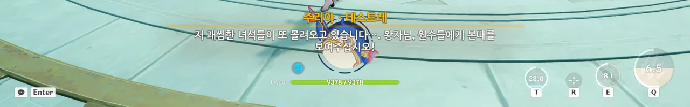

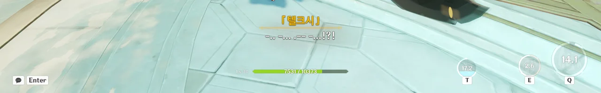

```
-.. -... .-- -... !?!
CAVA!?!
안녕!?!
```

그래도 이번엔 말을 안 더듬네.

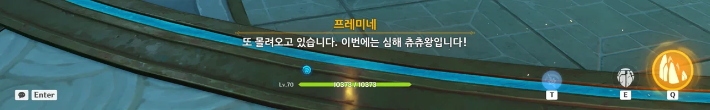

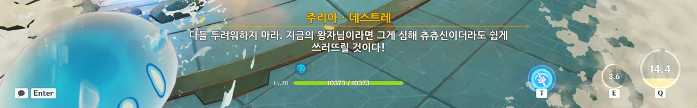

심해 츄츄신 ㅋㅋㅋㅋㅋㅋ

정말 티바트 어딘가에 그런 몹이 있는 건 아니겠지...

&nbsp;

저장공간의 제약 때문에 사진을 잘라 지금은 전혀 보이지 않지만, 저 전투, 너무 힘들었다. 진작 캐릭터들을 70 레벨로 키워둘 걸...

하지만 앰버를 70 레벨까지 키우기에는 자원이 아까웠다고.





물 님프 왕국을 수복하는 건 조금 나중의 일일 줄 알았는데, 단숨에 모든 츄츄족을 처치한 탓에 일정이 예상보다 훨씬 앞당겨지게 되었다.

그래서 물 님프 왕국을 수복하고 진행할 대관식에 쓸 왕관이 아직 준비되지 않은 상황.



그래서 일단 철수한 후, 왕관을 만들고 다시 오기로 했다.

> 내 아이 「텔크시」야, 너도 참 잘해줬단다.

자꾸만 아까 주리아가 한, 마치 주리아의 아이가 이미 죽고 없다고 해석할 수 있는 말이 떠올라 흠칫했는데, 우리, 「텔크시」를 주리아의 아이로 여기고 물 님프 왕국을 탈환하기로 했었지, 참...

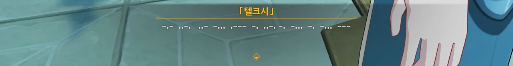

```
-.- ..-. ..- -... .--- -. ..-. -. -... -. -... ---
JE T'AIME MAMAN
엄마, 사랑해요
```





일단 야영지로 복귀하기로 한다. 거기서 아까 수집한 재료로 텔크시가 쓸 왕관을 만든 다음, 마저 이어서 이야기를 진행하는 거다.

겸사겸사 그림책에 추가할 새로운 내용도 그려 넣을 수 있을 테고.



페이몬 이 녀석, 자기가 '여신 페이몬'으로 나왔다고 그림책에 그려 넣을 새 내용에 아주 열심이다.

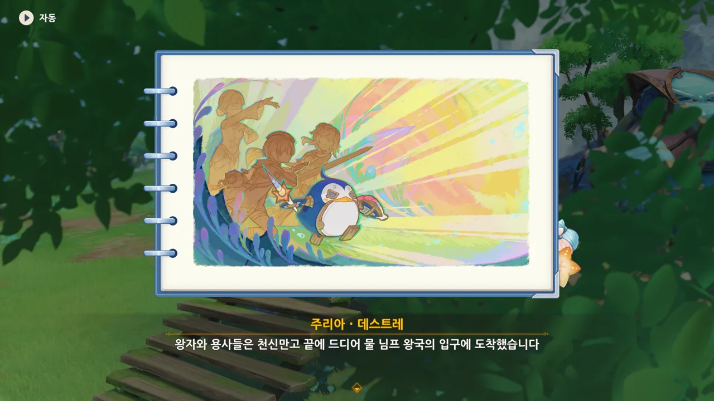

이전에 이야기했던 대로, 칙칙한 색감이 아니라 화려한 색감을 쓰고 있다.



여신이라고 주변이 온통 반짝반짝한 거 봐...

아까 페이몬의 뜬금없는 금도끼 은도끼 이야기는 적당히 가위질 당했다.





왕관이 없어 이야기를 마저 진행하지 않은걸, 마물들이 왕관을 훔쳐 도망쳤다고 적는다. 훨씬 그럴듯한걸?

&nbsp;

사실 난 즉석에서 왕관을 만들어 쓸 줄 알았다. 옛날에 어디서 읽은 만화인진 기억나지 않지만, 인상 깊게 읽은 만화가 하나 있었거든. 정확한 이야기는 기억나지 않지만, 대충 이런 내용의 만화였던 거로 기억하고 있다.

반란으로 인해 겨우 몸만 건져 도망친 왕자는 자신의 지지 세력을 하나하나 모아갔고, 자신을 따르는 백성들이 철로 만들어 바친 왕관을 쓰고 왕국을 탈환하기 위한 전투에 나선다. 반란을 진압하고 왕위에 오른 왕자는 여전히 그 투박한 철 왕관을 소중히 여겼다고 한다.

그래서 즉석에서 왕관 재료로 투박한 왕관을 만들어 텔크시에게 씌워준 후, 이것은 물 님프들이 마음을 모아 만든 왕관이라는 말로 장식할 줄 알았거든.



그래. 다음엔 텔크시가 왕위에 오를 차례일 것이다.

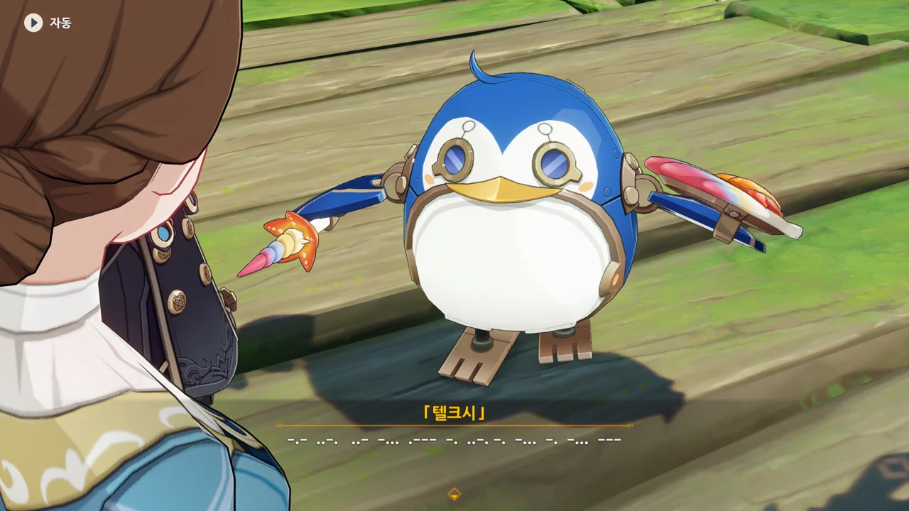

```
-.- ..-. ..- -... .--- -. ..-. -. -... -. -... ---
JE T'AIME MAMAN
엄마, 사랑해요
```

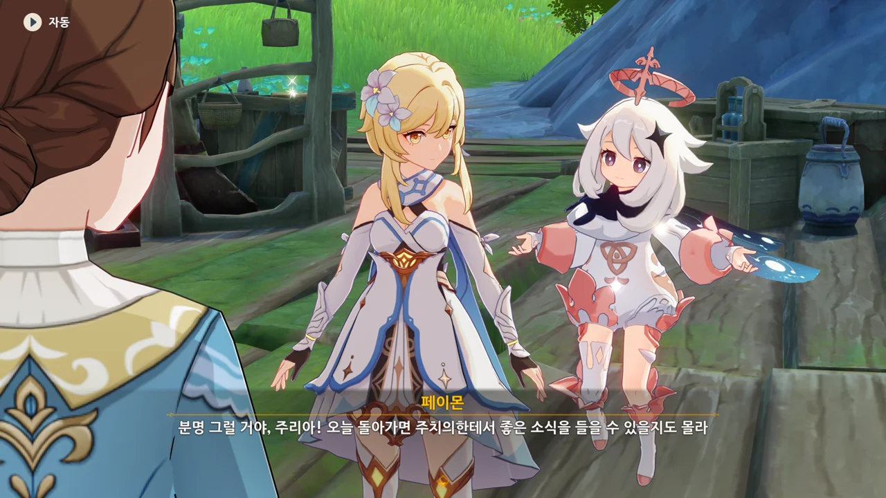

이 그림책이 희망찬 결말로 완성되면, 분명 주리아의 아이도 환상에서 벗어날 수 있겠지...



이번에도 이틀 후 모이는 것으로 결정되었다.



주리아는 처음 만났을 때 흥얼거리던 노래를 흥얼거리며 저 멀리 언덕 위에 있는 집으로 돌아간다.



프레미네는 왕관 받침대를 만들 부품을 폰타인성에서 살 예정이라고 한다.

텔크시에 언어 출력 모듈을 넣으려는 것도 그렇고, 프레미네는 이번 일에 정말 열심인 듯하다.





프레미네가 수줍게 뭔갈 말하려는데, 페이몬이 '너 얼굴 빨개졌어'라고 말하자 급하게 목구멍으로 삼켜버린다.

야, 이러면 또 프레미네가 잠수모를 쓸 거라고...



이틀 후, 다시 여기서 만나기로 한다.



> ... 난 어려움에 처한 모든 사람들이 아름다움과 기적을 봤으면 해...

떠나는 여행자의 뒷모습을 보며, 잠수모를 쓴 프레미네가 혼잣말한다.


그러고 보니, 지인이 '이벤트 일람 화면을 미리 찍어둬라'라고 해서 찍어두었다. 뭔가 나중에 변화가 생기는 걸까?
