

이번엔 여행자가 조금 일찍 도착한 모양이다. 아직 주리아가 오질 않았네.

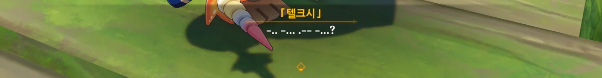

```
-·· -··· ·-- -··· ?
CAVA?
안녕?
```



주리아가 아직 도착하지 않았지만, 조금 더 기다려보기로 했다. 잠시 뭐 다른 급한 일이 생겨 늦을 수도 있지... 아이의 상태가 갑자기 악화하였을 수도 있고...



누군가가 갑자기 달려오길래 누군가 했는데, 들라로슈였다. 그러고 보니, 이 모든 일의 발단은 들라로슈가 의뢰한, 텔크시에 대한 조사였지...

처음 의뢰로부터 닷새 정도는 지났을 것 같은데, 그동안 들라로슈가 노심초사 우릴 기다렸을 걸 생각하니 조금 미안해지는걸.



들라로슈는 우리에게 의뢰를 맡긴 이후에도 마음이 놓이지 않아, 물속에 들어간 아이에 대해 좀 더 알아보았다고 한다.

들라로슈에게 이 모든 일은 프레미네의 테스트 때문이었다고 말해준다. 프레미네가 「텔크시」를 물속에서 테스트할 때 발생한 소음 때문에 물고기가 도망한 거였지.

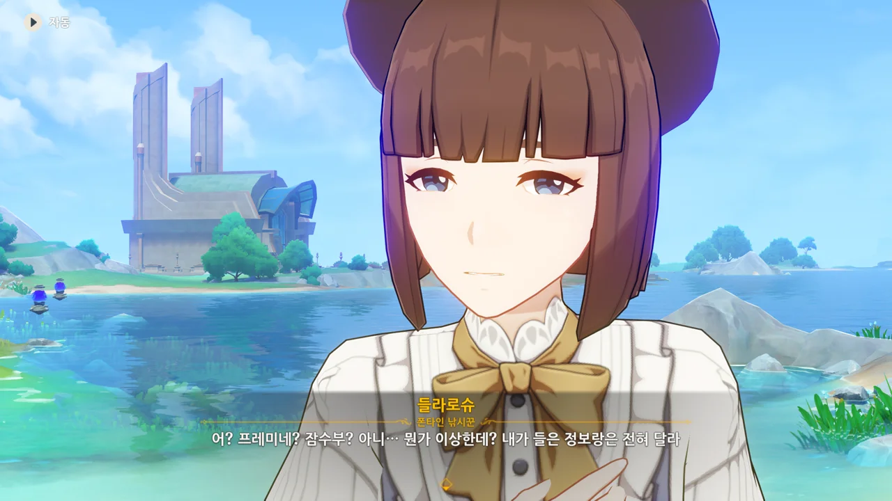

응? 대체 무슨 이야기를 들었길래?





들라로슈가 들은 이야기는 다음과 같다.

> '레스코 데스트레'라는 8살 아이가 약 한 달 전, 무거운 조개껍데기를 몸에 잔뜩 묶고 물속에 들어가 죽었다.
> 데스트레 가족은 스트레라는 곳에서 이사를 왔으며, 레스코의 엄마는 유명한 미술 상인이고, 아빠는 사고로 일찍 세상을 떠났다.
> 레스코의 사망 이후, 레스코의 엄마는 충격을 받아 앓아누운 후 폰타인 성을 떠났고, 현재 행방을 알 수 없다.

죽은 아이의 성씨가 '데스트레'인 것도 그렇고, 주리아가 한 말에서도 들라로슈의 이야기와 겹치는 부분이 많다.

* 주리아의 아이는 8살이다.
* 주리아는 아이가 좋은 환경에서 요양할 수 있도록 최근 에리니에스섬으로 이사했다.



들라로슈에게 양해를 구하고 주리아를 보러 가기로 했다.




주리아의 집에서 들려오는 남자의 목소리. 만약 주리아의 아이 이름이 레스코라면, 저 남자는 레스코의 아빠가 아니라 주치의겠지...



어째 불안하더라니.

예상대로, 주리아의 아이 이름은 레스코였으며, 약 한 달 전, 고독증을 앓다 익사해 죽었다. 그리고 주치의의 말처럼, 고독증은 '주리아에게 옮았다'.






레스코가 그랬듯이, 주리아 역시 고독증과 통제 불능 환상을 앓고 있다. 그 환상 속에서, 주리아는 레스코가 여전히 살아있다고 믿고 있다.

역설적으로, 주리아는 레스코를 위한 전시회를 준비하느라 레스코의 마지막 모습을 볼 수 없었다. 그 때문일까, 주리아 역시 고독증에 걸리게 되었다.



심지어 주리아가 우리에게 긍정적으로 살아야 한다고 말했던 것조차, 환상과 현실을 구분하지 못한 모습이라고 한다.



주리아의 시간은 레스코가 죽기 전의 시점에 멈춰있다고 한다. 그래서 여전히 레스코가 고독증과 통제 불능 환상을 앓고 있다고 상상하여 이미 죽고 없는 레스코의 병을 고치기 위해 프레미네에게 의뢰를 맡긴 것이었다.



비록 환상 속이었지만, 주리아의 최근 상태는 꽤 호전된 상태였다고 한다. 산책하러 다니거나, 고독증의 통제 불능 환상을 환상 유도를 통해 치료하는 방법에 대해 주치의와 의논할 정도였으니 말이다.

하지만 레스코의 유언이 새겨진 조개 유품을 보게 된 주리아는 상태가 악화하였고, 지금은 진정제를 투여받은 상태라고 한다.

잘라캉이 '주리아가 쉬고 있다'라고 말하지만, 말하는 내용을 들어보면 진정제를 투여해 주리아를 일단 재운 것으로 보인다.






프레미네가 주리아의 그림책을 가져와달라고 말하자, 잘라캉이 환상 유도법을 시도하려는 프레미네의 의도를 단박에 파악하고 그림책을 가져다준다.



레스코를 위한 그림책을 만들며 주리아의 상태가 호전되었으니, 그림책을 완성하면 주리아의 상태가 좋아질 거라고 말하는 프레미네.



처음 우려했던 것처럼, 그렇게 한다면 주리아가 오히려 환상 속에 더 깊숙이 빠지는 게 아닐지 걱정되지만, 잘라캉은 통제 불능 환상은 무너진 감정에 짓눌려 현실을 아예 보지 못하는 것이니, 현실을 볼 수 있도록 주리아를 짓누르고 있는 감정을 덜어내 줘야 한다고 말한다.

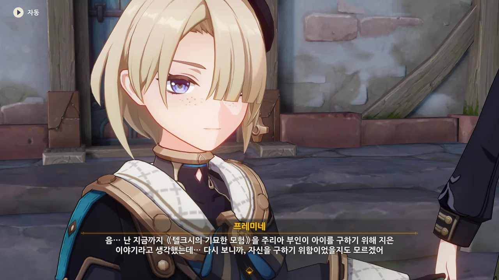

그래, 프레미네 말처럼, 주리아가 레스코를 위한 그림책을 완성하려 한 것은 어쩌면 무의식적으로 자기 자신을 구하기 위한 것이었을지도 모르겠다.



이 이야기를 완성해 주리아에게 보여주면 주리아가 자길 짓누르고 있는 감정의 무게에서 어느 정도 벗어나 현실을 직시할 수 있길 바라며 서둘러 물 님프 왕국으로 출발하기로 했다.



줄곧 신경 쓰였던 것이 하나 있다.

이벤트를 진행하며 곳곳에서 발견할 수 있었던 '글자가 새겨진 조개'. 주리아의 집 앞에 있는 세 번째 조개에 적힌 내용을 읽고 나서야 그게 폰타인 월드 임무를 위한 것이 아니라 이번 이벤트를 위한 것임을 깨달았다.

> 텔크시는 다섯 길 물속에 누웠고, 뼈는 산호가 되었네.
> 그의 눈동자는 진주처럼 빛나고, 그의 뼈는 영원히 사라지지 않으리.
> 들으라! 바다의 여신이 지팡이를 들어 올리니, 왕자의 마지막 종성이 울려 퍼진다.
> 딩--- 딩--- 딩---

원래 레스코의 환상 속 이야기는 텔크시 왕자가 결국 혼자 외로이 죽는 것으로 끝나는 비극이었다. 레스코 역시 그랬고.

자신을 텔크시 왕자와 동일시한 레스코가 물 님프들의 사랑을 의미하는 조개껍데기를 가득 몸에 두르고 물속에 들어갔다는 건, 마지막 순간에나마 물 님프들의 사랑 속에 잠기고 싶다는 자그마한 소망 때문이었을까?

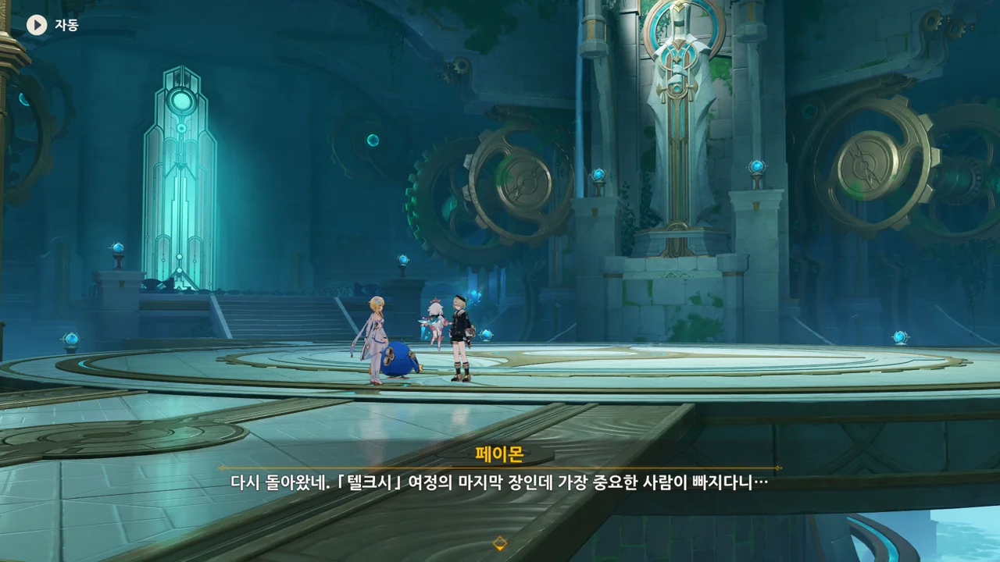

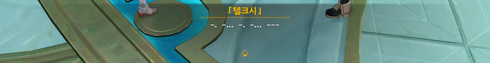

```
-· -··· -· -··· ---
MAMAN
엄마
```

그래. 제일 중요한 주리아가 없네...





그래도 이 이야기를 해피 엔딩으로 끝낸다면, 주리아의 상태도 분명 좋아질 거라는 믿음을 가지고 이야기를 계속하기로 했다.

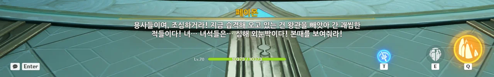

유적 시리즈를 어떻게 불러야 할지 모르니, 그냥 '심해 외눈박이'라고 퉁치는 페이몬. ㅋㅋㅋㅋㅋㅋ

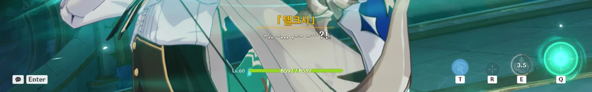

```
-·· -··· ·-- -··· ?!
CAVA?!
안녕?!
```

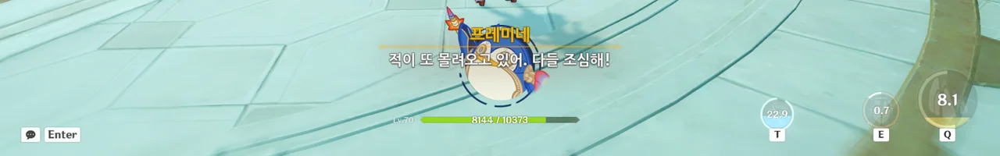

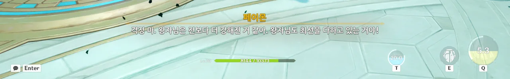

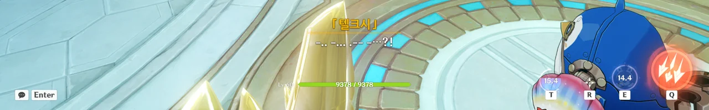

```
-·· -··· ·-- -··· ?!
CAVA?!
안녕?!
```

처음 그랬던 것과 달리, 이젠 말을 더듬지 않고 제대로 *싸우는* 텔크시.

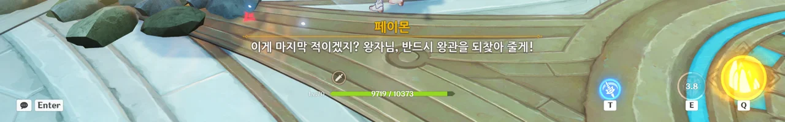

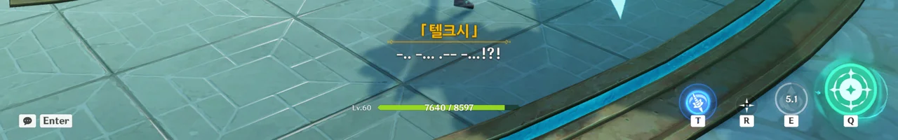

```
-·· -··· ·-- -··· !?!
CAVA!?!
안녕!?!
```

계속 CAVA만 말하니까, 텔크시가 적을 하나하나 죽일 때마다 생글생글 웃으며 매번 '안녕?'하고 인사하고 죽이는 사이코 캐릭터가 되어버린 것 같은데.





오늘은 ***텔크시***를 치료하는 중요한 날이라며, 약속 장소에 가봐야겠다는 주리아.

주치의 잘라캉이 확인차 아이의 이름을 묻자, 자신의 아이 이름이 *텔크시*이며 *물 님프 왕국의 왕자*라고 말하는 주리아.

처음 만났을 땐 텔크시와 레스코를 구분하고 있었는데, 환상이 더 악화한 건지 이젠 텔크시와 레스코를 구분하지 못하고 있다. 마치 레스코가 자신과 텔크시를 구분하지 못했던 것처럼 말이다.



마침 타이밍 좋게 여행자가 도착했다.



주리아를 위해 텔크시의 대관식은 아직 치르지 않았다.

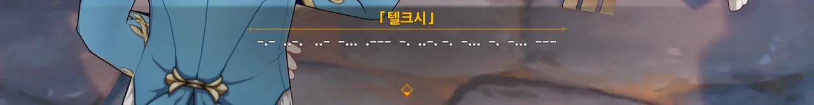

```
-·- ··-· ··- -··· ·--- -· ··-· -· -··· -· -··· ---
JE T'AIME MAMAN
엄마, 사랑해요
```



그림책의 마지막을 어떻게 마무리해야 할지 모르겠다는 주리아를 위해 우리가 이야기를 짜주기로 했다. 희망차고 행복한 결말을.





> 마침내 「텔크시」와 용사 동료들은 힘을 합쳐 남은 마물들을 멋지게 처치하여 왕관을 되찾고 완벽한 승리를 거뒀습니다.
> 고향을 되찾은 물 님프들은 환호하며 왕자를 맞이했습니다. 그들은 다시 진귀한 조개껍데기를 꺼내 무지개다리를 만들었습니다. 왕자는 정말 아름다운 광경이라고 생각했습니다.
> 감격에 젖은 왕자는 무지개다리에 올라 지금까지 함께해 온 동료들을 둘러봤습니다. 여행자, 페이몬 여신, 프레미네, 그리고...
> 응? 남은 한 명은 어디 간 거지? 왕자는 주변을 둘러봤지만 찾을 수 없었습니다. 그때 맞은편에서 한 사람이 걸어와 복면을 벗었습니다.
> 왕자는 눈물을 왈칵 터트렸습니다. 지금까지 함께 여행을 해온 신비한 사람이 바로 자신의 어머니였다는 걸 깨달았기 때문입니다.
> 주리아 부인은 왕자의 머리에 왕관을 씌워주고 웃으면서 말했습니다.
> 내 아가, 나의 왕. 이제 영원히 외롭지 않아도 된단다.

어디 하나 군더더기 없이 완벽하게 행복한 결말로 이야기가 끝났다.



이게 도움이 되었을까?



> 아가야, 엄마가 미안하구나. 네 곁에 더 있어 줘야 했는데... 듣고 있지? 더 이상 외롭지 않아도 된단다...

```
-·- ··-· ··- -··· ·--- -· ··-· -· -··· -· -··· ---
JE T'AIME MAMAN
엄마, 사랑해요
```

> 그럼! 엄마도 그래!

서로 말이 통하는 것처럼 대화하는 둘.




프레미네가 이걸 쓰면 텔크시의 말을 이해할 수 있을 거라며, 자신의 잠수모를 건네준다.



```
-·- ··-· ··- -··· ·--- -· ··-· -· -··· -· -··· ---
JE T'AIME MAMAN
엄마, 사랑해요
```

> 사랑해요, 엄마!
> 엄마도... 널 사랑한단다...





그런데 눈을 감았다 뜨자, 「텔크시」가 왕관을 쓴 레스코의 모습으로 변했다. 아니, 이게 어찌 된 일이지?

프레미네는 잠수모를 여행자에게 빌려준 탓에, 여행자가 지금 뭘 보고 있는지 전혀 모르고 있는 것 같다.



아, 주리아가 줄곧 흥얼거리던 노래가 레스코에게 불러주던 자장가였구나...





> 엄마는 영원히 널 사랑한단다... 여기서 물 님프 왕국까지 가는 거리만큼 말이야.
> 전 엄마를 여기에서 물 님프 왕국까지 왕복하는 거리만큼 사랑해요!

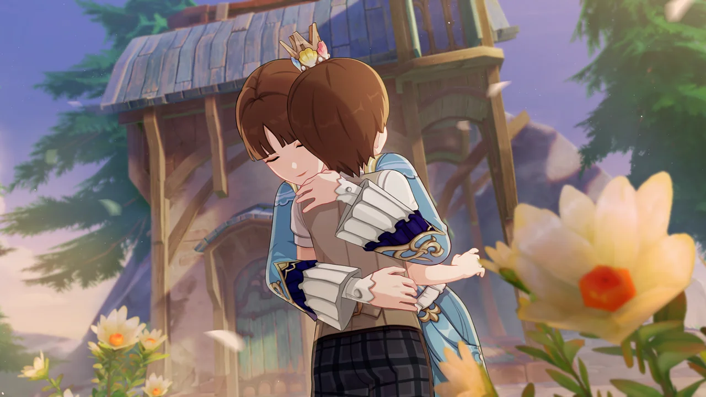

***








사흘 후, 여행자를 찾은 프레미네가 전해준 소식은 마음이 놓이는 소식뿐이었다.

주리아는 상태가 매우 호전되었으며 --- 아마 고독증과 통제 불능 환상이 모두 치료된 모양이다 --- 폰타인성으로 돌아가 전시회를 계속할 거라고 한다. 주치의와 함께 할 전시회의 주제는 고독증이며, 고독증 관련 그림책과 《텔크시의 기묘한 모험》, 환상 유도 치료법 등이 전시될 예정이다.



그리고 주리아는 프레미네를 통해 누군가 같은 문제를 겪게 된다면 《텔크시의 기묘한 모험》이 도움이 될 거라며, 그림책의 복제본을 여행자에게 건네주었다.

그래, 원본은 주리아에게 있어 엄청나게 중요한 것일 테니, 소중히 간직하고 있겠지.





그래, 내가 그때 프레미네의 잠수모를 통해 본 건 주리아의 환상이었구나. 아이에게 하지 못한 사과를 하고, 아이와 마지막 작별을 나누고 스스로를 치유한 환상.



> 환상 세계가 의미 없는 거짓일 뿐이라면, 어떻게 사람들에게 진실된 힘을 전달할 수 있는 걸까?

그래, 이번에 환상의 힘을 보았으니, 환상을 더 이상 무작정 부정하진 못하겠네.





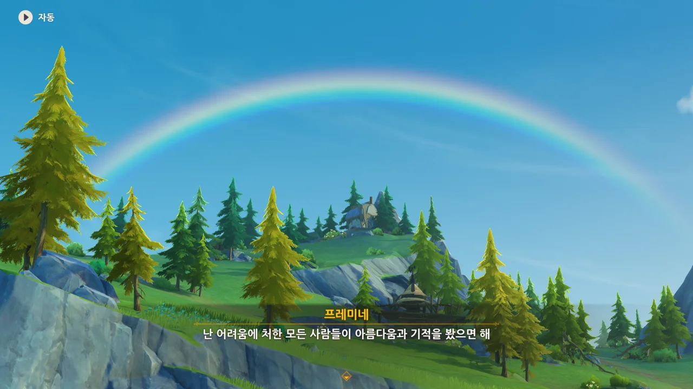

주리아의 앞날 역시 동화책의 내용처럼 밝고 희망찰 것이라고 말하듯이, 무지개가 밝게 떴다.

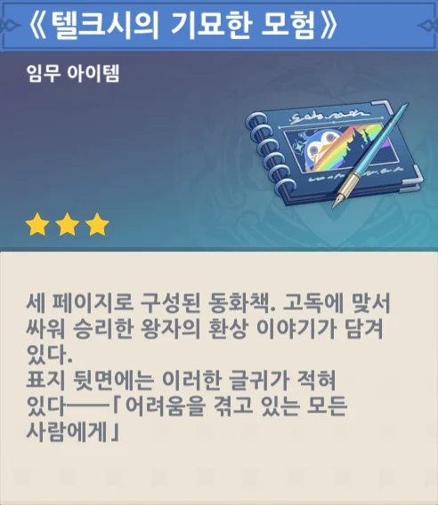

> 《텔크시의 기묘한 모험》
> ***
> 세 페이지로 구성된 동화책. 고독에 맞서 싸워 승리한 왕자의 환상 이야기가 담겨 있다.
> 표지 뒷면에는 이러한 글귀가 적혀 있다 --- 「어려움을 겪고 있는 모든 사람에게」
{.bq}



아, 저번에 지인이 왜 이벤트 일람 화면을 왜 찍어두라는지 알게 되었다.

이벤트 스토리를 모두 보게 되면, 「텔크시」가 레스코의 모습으로 변하게 되며, 주변에 다른 「텔크시」 인형이 나타나게 된다. 주리아가 들고 있는 그림책의 삽화도 칙칙한 색에서 화려한 책으로 변하게 되고.

이런 디테일이 있었구나.
