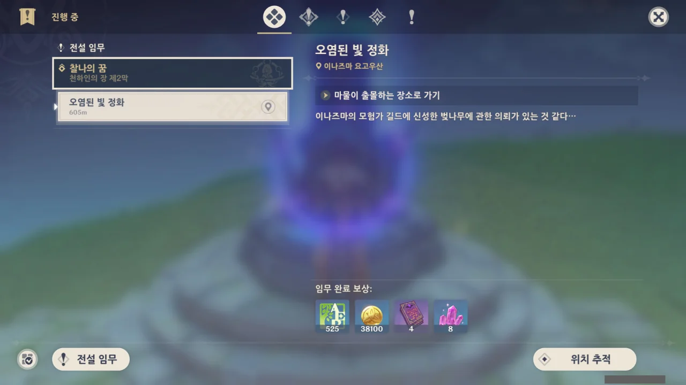
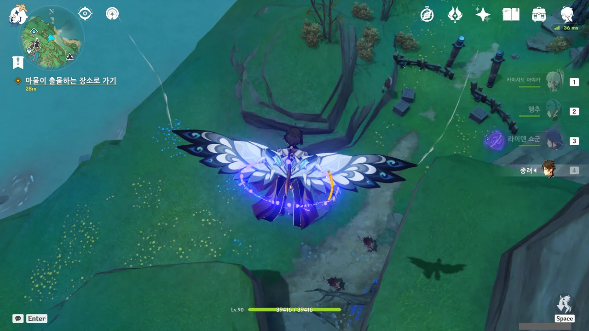

더 이상 이 전설 임무를 미뤄둘 수 없어, 오늘 하기로 했다.

이때는 몰랐지. 사진의 개수가 700개가 넘고, 총용량이 2GB가 넘게 될 줄은...

마물이 몰려있다길래 무슨 마물일까 궁금해하며 가보니 댕댕이다.

아, 젠장.



너무 많이 몰려오는 거 아냐? 벌써 웨이브만 세 번 이상이라고!



내가 다 처리할 수 있었는데, 갑자기 컷신으로 넘어갔다.

여행자가 위험에 처하자, 라이덴 쇼군이 나타나 '무념, 단절!'을 외치고 수계 늑대들을 전부 베어버렸다.



이름이 '라이덴 쇼군?'에서 '에이'로 바뀌는 걸 보고 살짝 감동했다.

라이덴 쇼군에게는 인형의 인격인 '쇼군'의 인격과, 일심정토 안의 '에이'의 인격이 동시에 존재하니까.



앞으로 다가올 일? 그게 뭔지는 잘 모르겠지만, 그걸 대비하기 위해서 밖으로 나왔다고 한다.



> 지난번에 너랑 같이 이나즈마를 산책하며 다양한 사람과 일을 겪었고, 과거엔 이해할 수 없던 이치도 어느 정도 이해했어.

'그림자에 비춰진 부세의 풍경: 천하인의 장 제1막' 이야기이다. 라이덴과 같이 돌아다니며 사진도 찍고 우유 당고인지 뭔지 하는 간식도 먹어보고 그랬는데...

그때 이후로, 고민할 게 있으면 나와서 둘러보며 생각을 정리한 듯하다.



> ... 다시 한번 말하지만, 이건 절대 심심풀이가 아니야.

ㅋㅋㅋㅋㅋㅋ



일심정토에서 외부의 변화를 관측하다, 수계 사냥개가 신성한 벚나무를 공격한 일을 포착하고 수계 사냥개를 쫓다 여행자와 마주친 듯하다.

그런데 그게 라이덴 쇼군이 직접 나설 일인가?





사실 이 일은 삼봉행이 해결해야 할 일이 맞긴 하지만, 수계 사냥개가 신성한 벚나무를 공격하면 과거에 있었던 재앙에 대한 기억이 떠오른다고 한다.

그래서 몸소 나서 수계 사냥개를 처리한 모양이다.





500년 전의 이나즈마에는 정말 큰 재앙이 들이닥쳤나 보다. 500년 전이면 켄리아가 멸망한 때이기도 한데...

검고 짙은 안개가 밤에 드리우고, 마물들이 날뛴다라... 지금도 이나즈마 곳곳에서 마물이 날뛰는 걸 보면 안개 빼고는 지금과 별 차이가 없는 거 아냐?

&nbsp;

수계 사냥개의 역할은 공간 통로를 열어 더 강력한 맹수를 불러내는 역할이라고 한다.

지금 마주치는 녀석들도 단단해서 애를 먹는데, 그보다 더 강력한 맹수가 나온다고?





나라 하나가 통째로 위기에 빠질 정도면 트라우마가 생기지 않을 수 없다. 암, 그 마음 이해하고말고.





에이와 함께 움직이기로 했다.

> 등 뒤에 호랑이

이게 무슨 호가호위도 아니고... 묘한 기분이긴 하다.



신성한 벚나무에서 새어 나온 푸른색 진액이 묻은 흔적이 멀리까지 이어져 있다.

신성한 벚나무는 진액이 왜 파란색이지?



심지어 진액에서 빛도 난다. 연기도 뿜어져 나온다.

아무리 생각해도 저거, 벚나무가 아닌 거 같은데.



몸이 노란색으로 빛나는 사람들이 곳곳에 쓰러져 있다. 아까 전만 해도 없었는데.

정말 페이몬 말처럼 유령 같은 것일지도 모른다.



에이의 말을 듣고 주변을 둘러본다.









주변의 다른 무사들 모두가 쓰러져있고, 키타무라 역시 금방이라도 쓰러질 것만 같다.

사방이 야수와 마물로 가득 차 있고, 라이덴 쇼군과 호재궁이 없는 상황이지만 "우린 마지막 순간까지 이나즈마를 포기하지 않아!"라며 투지를 불태우고 있다.

나, 이런 거 정말 좋아하는데. 개인의 힘으로 어쩔 수 없는 미증유의 재난 앞에서도 '우리 뒤에는 아직 지켜야 할 사람들이 있어!'라며 투지를 불태우는 그런 장면 말이다.





"쇼군님의 강력한 뇌광"이라고 하는 걸 보면, 라이덴 쇼군이 정말 강하긴 한가 보다.

생각해 보면, 마신 임무에서 우인단 집행관인 시뇨라를 단칼에 잿더미로 만들어 버리기도 했고, 천수각 정문에서 여행자를 급습할 때도 그 위압감을 거대한 모습으로 표현하기도 했었다.

그 외에도 마신 오로바스를 단칼에 썩둑 잘라 조각 내버렸으며, 그 여파가 섬을 반으로 갈라버리기도 했었다.

아니, 애당초 오로바스가 "나는 황금의 신과 나루카미의 신을 이길 수 없어 미지의 바다로 도망가는 걸 선택했다"라고 말했다지 않은가.

&nbsp;

그런데 더 무서운 건, 종려가 한끗발 날린 시절에는 라이덴 쇼군보다 더 강력했다고 하더라.





그런 그에게 이미 전쟁이 끝났다며 진정하라고 말하는 에이.

키타무라가 무슨 풍경 안에 있었는지는 모르지만, 지금 그의 주변에는 평화로운 광경만이 펼쳐져 있을 뿐이다.





키타무라는 라이덴 쇼군을 따르는 건 역시 옳은 선택이었다며, 에이에게 감사를 표하며 사라졌다.





에이의 설명에 따르면, 조금 전 상황은 신성한 벚나무에서 정화된 지맥의 오염이 흘러나와 실체화되어 과거의 기억을 보여준 것이라고 한다. 아직 정화되지 않은 오염은 실체화되었을 때 강한 공격성을 띤다고.

그러니까 조금 전의 것은 죽은 사람의 기억이라는 것이다.



500년 전, 켄리아는 물론이고 이나즈마에도 큰 재앙이 들이닥쳤다.

이나즈마를 먼저 챙기고 싶었지만, 켄리아에 서둘러 개입하지 않으면 켄리아에서 발생한 재해가 티바트 전체로 퍼질 수 있는 상황.



에이의 친우인 호재궁은 에이에게 자신이 무슨 일이 있어도 이나즈마를 수호하고 책임질 테니, 켄리아에 다녀오라고 말했다.



결국 호재궁은 사람들을 보호하기 위해 자기 목숨을 희생했다고 한다. 에이는 마지막으로 친구의 얼굴조차 보지 못했다고.



모두가 소중한 사람을 잃었다. 에이 역시 예외는 아니었다.



「잃어버린 것」들이 가져온 고통을 오랫동안 직시할 수 없었던 에이는 재앙신을 베고 마수를 토벌할 수는 있어도 시간을 이길 수 없고 아끼는 사람들을 붙잡아 둘 수 없는 자신을 보고 「영원」에 집착하게 되었다.

그 결과가 라이덴 쇼군 인형의 제작과 쇄국령과 안수령이었다.

하지만 여행자가 이나즈마 사람들의 「염원」을 에이에게 보여준 후, 그녀는 더는 과거에만 머무를 수 없다는 깨달음을 얻었다.



여행자와 함께 이나즈마를 거닐 때, 에이는 수백 년 동안 자신의 예상을 뛰어넘은 사람들의 발전과 가능성을 보고, 앞으로 나아가다 보면 잃는 것도 있겠지만 분명 새로 얻는 것도 있을 것이란 걸 깨달았다.



조금 전 무사 역시, 많은 것을 잃었지만 그럼에도 굴하지 않고 앞으로 나아가기 위해 싸웠다.



> 뜨거운 피를 흘리며 싸웠던 이나즈마의 전사들이여, 그대들의 빛나는 영혼은 이 땅에 녹아들었다.
> 나는 그대들의 노력을 잊지 않을 것이다.

난 이런 '인간 찬가' 같은 주제의 이야기를 굉장히 좋아한다. 그래서 내가 '죠죠의 기묘한 모험' 시리즈를 좋아하는 것일지도 모른다.
