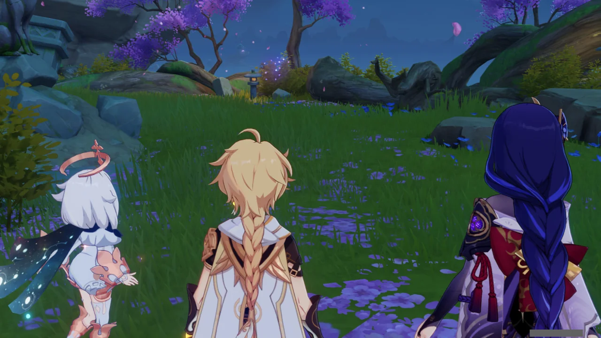
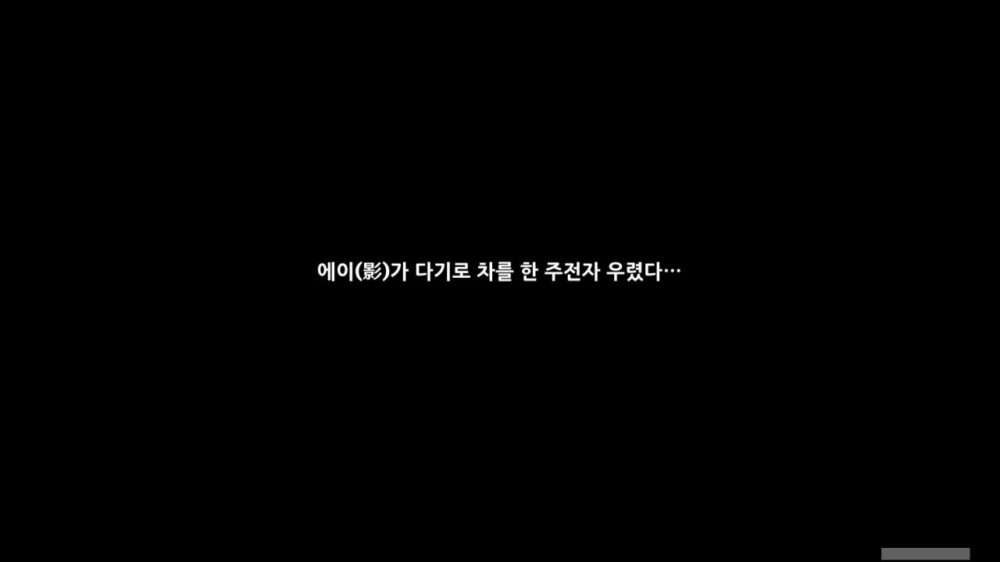
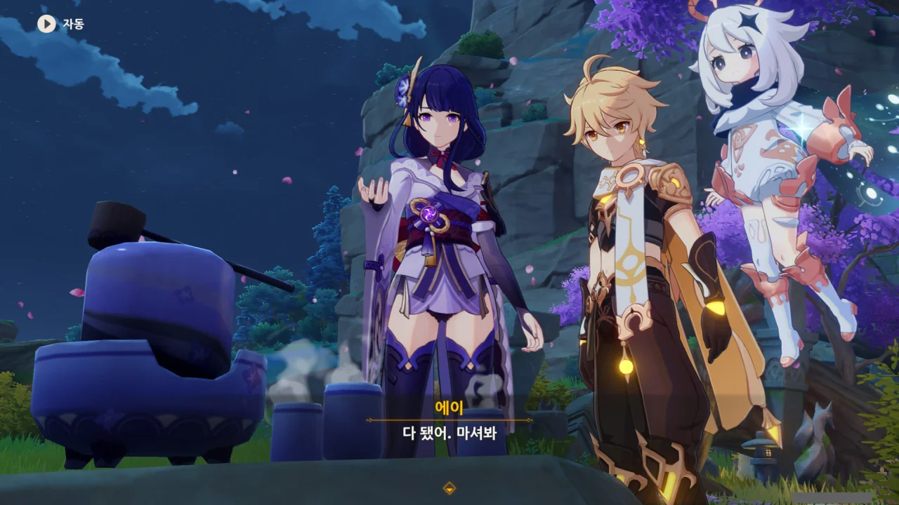
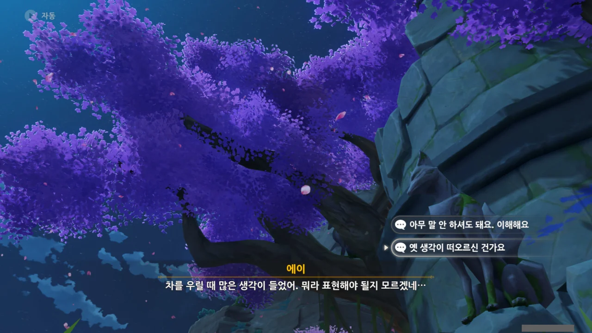



사라진 무사 유령을 뒤로하고, 다시 수계 사냥개를 쫓는 일행.

&nbsp;

아니, 이 사냥개들을 라이덴 쇼군 하나만으로 다 죽이라고?

미친 거 아냐? 나도 지금 라이덴 쇼군 돌파가 모자라서 서브 딜러로 쓰는 게 고작인데?

그런데 이상하게 라이덴 쇼군 혼자임에도 원소 폭발 게이지가 잘 찬다. 설마 캐릭터 하나만 쓸 때 힘들지 말라고 시스템적으로 지원을 해준 건가?





> 평소라면 더 깔끔하고 날렵하게 검을 뽑아서 「쓱」하고 베어버리잖아?

페이몬이 이렇게 말하니까 나도 에이가 좀 이상하게 느껴지긴 한다. 설마 어디 아픈 걸까?

그에 대해 에이는 사전에 정보를 얻긴 했지만, 변수가 언제 어디서 생길지 모르니 힘을 아끼고 있는 것뿐이라고 말한다.

&nbsp;

다르게 생각해 본다면, 마신 임무에서 나온 라이덴 쇼군의 성능에 비해 왜 플레이어가 조작하는 라이덴 쇼군의 성능이 약한지에 대한 설명도 된다고 생각한다. 아무튼 힘을 아끼고 있는 거라고.

그렇게 생각하니 조금 슬프기도 하다.

나도 라이덴에게 「어획」 말고 예초의 번개를 들려주고 싶었다고! 하지만 무뽑은 너무 창렬인걸! 어떻게 된 것이 확정 천장이 270연차냐! 캐릭터 확정 천장은 180연차라고!

여기서 12만 원을 질러보았자 겨우 50연차밖에 하지 못한다. 12만 원을 질러 얻을 수 있는 원석이 8,080개인데, 한 번 가챠를 하는 데 160개의 원석이 들거든.



이곳에 있는 나무뿌리도 상당히 손상되어 있다.

연기가 나오는 것으로 보아, 또 과거의 유령이 나오겠지.



연기에서 나온 건 '후루야마'라는 노인이었다. 에이와 서로 잘 아는 사이인 것 같은데.

라이덴 쇼군이 원정하러 갔다고 하는 것으로 보아, 아까 전처럼 500년 전의 일인 것 같다.





후루야마는 라이덴 쇼군을 따르던 다장(茶匠)이라고 한다. 다장이 뭔가 찾아보니, '차장인'이라고 하더라.

그는 눈이 보이지 않는 대신 뛰어난 감별력을 가져, 그가 우린 차는 이나즈마에서 손꼽히는 차라고 한다. 실제로 눈이 보이지 않는 사람은 그 대신 뛰어난 감각을 갖고 있는 편이라고 하더라.

에이의 칭찬에 '과찬입니다. 그저 요령이 생긴 것뿐입니다'라고 겸손하게 말하는 후루야마.

&nbsp;

아직 몇 마디도 채 나누지 않았지만, 그의 목소리와 태도에서 댄디함을 느낄 수 있었다. 이게 맞는 용어인지는 잘 모르겠지만, 아무튼 왜, '그런 느낌'이 있지 않은가. 바로 그거다.

마치 멋들어진 미중년 집사를 보는 느낌이라고 해야 할까? 다장이 집사는 아니지만 말이다.





이곳 역시 바깥에 마물과 야수가 가득 찬 모양.



이곳 근처의 주민들은 거의 다 도망갔지만, 후루야마는 자신도 데려가려는 사람들을 만류하고 여기에 혼자 남았다.

라이덴 쇼군이 여기에 있는데, 도망칠 이유가 없으며, 쇼군이 손쓸 수 없는 일이라면 도망쳐도 소용이 없을 것이라는 이유였다.

&nbsp;

곧 죽을지도 모르는 상황에서 후루야마는 이상하리만큼 침착하다.



> 도망은 살기 위해서입니다. 이루지 못한 것이 있기에 살고자 하는 것이지요.
> 하지만 전 그럴 생각도 없고, 후회도 남기지 않았지요.

삶과 죽음에 초연한 후루야마의 모습에서 경건함마저 느껴질 정도이다.





후루야마의 차를 마실 때, 종종 그에게 자신의 「꿈」을 이야기해 주었다는 라이덴 쇼군.

> 아름다운 것들은 시간의 흐름에 따라 변화하고 사라지니 살아있을 때 여한이 없도록 즐겨야 한다.

이런 말은 에이가 할법한 말이 아닌 것 같은데? 영원함을 추구한 에이와는 맞지 않는 말이다.

&nbsp;

이와 별개로, 저 말은 예전 축월절 이벤트에서 응광이 했던 말과도 일맥상통하는 것 같다.

> 공을 세워 이름을 떨치고 오랜 세월이 흘렀지만, 즐겁게 노니는 것 또한 잊어서는 안 돼.

적어도 난 저 말과 이 말 모두가 '현재를 즐길 줄 알아야 한다'라는 뜻이라고 이해했다.



> 지금 상황이 절망적이어도, 전 아름다운 것들을 많이 겪었으니 미련 없습니다.

한때 웰빙(Well-being)이 유행한 이후에는 웰다잉(Well-dying)이 유행했다고 한다. 잘 사는 것만큼 잘 죽는 것도 중요하다는 의미겠지.



> 모든 사람이 이나즈마가 검은색으로 변했다고 하지만, 제 눈에는 줄곧 검은색이었으니까요.

후루야마를 보자니, 모든 일에 해탈한 사람처럼 보인다.

눈이 보이지 않음에도, 곧 죽을지도 모르는데도 그저 담담하게 이야기하는 그. 무슨 깨달음이라도 얻은 사람 같다.



여행자 일행에게 차를 대접하려는 후루야마. 지금 이곳의 모습은 500년 전과는 확연하게 다를 테니, 근처에 다기가 있을 리가 없다.



하지만 근처에 다기를 구할 수 있는 곳은 알고 있다. 카미사토 저택에서 빌리면 되지 않을까?



손님에게 일을 시키는 건 예의에 어긋난다며 말리는 후루야마.

에이가 직접 가겠다고 하자, 몸 둘 바를 모르겠다고 한다.



> 이곳은 네가 기억하는 찻집과는 달리 아주 복잡해. 그러니 우리에게 맡기거라.

에이가 참 잘 돌려서 말했다. 유령에게 '너 이미 죽었어'라고 말할 수도 없고, '이미 500년 전 일이야'라고 말할 수도 없으니 말이다.

그저 '지금 주변은 후루야마가 기억하는 모습과 매우 다르다'라고 말할 수밖에.

그리고 그게 틀린 말도 아니다. 누가 여길 보고 옛날의 이곳에 찻집 같은 것이 있었으리라 생각하겠나?



자기 대신 라이덴 쇼군이 다기를 준비하는 일이 마지막 여한이 될지 행운이 될지 모르겠다며 허허 웃는 후루야마.



후루야마가 벚나무 진액에서 나왔다는 건 그 역시 500년 전 대재앙 때 목숨을 잃었다는 것이겠지.

에이가 그를 그리워할 만하다.



다짜고짜 카미사토 저택으로 쳐들어가 다기를 빌리고 싶다고 말하는 에이.





가주에게 알리겠다고 하는 병사에게 가주를 만나러 온 것이 아니라고 말하며, 자리를 비워달라고 말한다.

카미사토 가문의 가주가... 분명 아야카의 오빠, 아야토였지? 소매에 버블티를 넣고 다니는 사람 말이다.



후루야마가 말한, 라이덴 쇼군이 말했다던 말은 에이가 할법한 말이 아니었다. 과연 후루야마에게 그런 말을 한 사람은 누구였을까?





에이는 천생 무인인지라, 차를 마실 기회가 별로 없었다고 한다. 한가할 때는 거의 무술 연마에만 전념했던 에이.

그래서 후루야마가 우린 차는 대부분 에이의 언니, 라이덴 마코토를 위한 것이었다.

&nbsp;

후루야마 역시 라이덴 쇼군이 사실 둘이라는 것을 알고 있었던 것 같지만, 전혀 모르는 것처럼 행동했다고 한다.

눈이 보이지 않는 사람은 그 대신 다른 감각이 극도로 발달하게 되는데, 아마 그 발달한 기감을 통해 라이덴 쇼군이 사실 둘이었음을 알아챈 것이 아닐까?



에이와 마코토 사이의 견해 차이는 꽤 컸으며, 갈등 요소이기도 했다.



마코토는 세상에서 가장 귀한 것이 생명이 아름다운 미래를 향해 동경하는 「꿈」이라고 생각했다고 한다.

「꿈」과 「염원」은 비슷하긴 하지만 똑같은 개념은 아니라고 한다.



여행자가 사람들의 염원을 등에 업은 채 자신의 일심정토에 들어왔을 때, 그 수많은 염원이 하늘에서 빛나는 걸 보고 자신이 잘못된 길에 들어섰음을 깨달은 에이.

그 당시 있었던 전투 역시 에이가 일부러 져준 것에 가까웠다.





약간 이해하기 어렵지만, 마코토는 사람들의 소원 그 자체보다, 그 소원을 있게 만드는 원동력이 더 중요하다고 본 것 같다. 그 원동력이 중요한 것이지, 원동력의 결과물인 사람들의 소원 자체는 그리 중요하지 않다고 생각한 것이다.

나도 에이와 비슷한 생각이다. 왜 그것도 영원함의 일종인 걸까?

사람은 끊임없이 무언가를 원하기 때문에 그런 것일까? 그 상태 자체는 영원하다 볼 수 있으니 말이다.



난 아직 잘 모르겠는데.



과거에만 집착해 더 이상 아무것도 잃지 않으려는 그때의 에이보다는 지금이 훨씬 마코토와 생각이 비슷할 것 같기도 하다.

마코토의 생각을 잘 이해하지 못하니, 지금의 에이와 그때의 마코토가 화해한 것인지를 잘 모르겠네.





뭔가 더 이야기가 이어질 것 같았지만, 히라노가 다기를 갖고 돌아오는 바람에 이야기가 끊겼다.

어쩔 수 없지. 후루야마에게 돌아갈 시간이다.

아까 전 그곳에 다시 돌아와 보니, 후루야마가 흔적도 없이 사라졌다.





지맥의 기억이 구현된 것이니만큼, 후루야마 역시 다기를 갖고 돌아올 동안 오래 존재할 수 없었던 모양이다.



그래도 수많은 지맥의 기억 속에서 후루야마를 만난 것 자체가 기적이라고 하는 에이.

&nbsp;

그런데 왜 갑자기 페이몬이 침울해하는 이유가 후루야마가 우려 준 차를 먹지 못해서인 걸로 보이는 걸까?



에이가 대신 차를 우려주겠다고 한다. 후루야마가 차를 우리는 걸 곁에서 많이 봐왔으니, 비슷하게나마 따라 해보겠다고 한다.

꽤 그럴듯하게 차가 우려졌다.

어디서 들은 바에 따르면, 차를 끓이는 것도 정신 수양법의 일종이라고 한다.



카미사토 저택에서 한 가벼운 이야기 말고, 이번엔 무거운 이야기를 하겠다는 에이.



사실 500년 전 재앙에서 에이는 호재궁뿐만 아니라 자기 언니인 마코토도 잃었다고 한다.

번개 신의 자리가 내부적으로 마코토에서 에이로 교체되었다는 말은 들었지만, 그게 언제였는지 몰랐는데, 그게 500년 전이었구나...





에이를 뒤에 숨기기 위해 에이 몰래 먼저 켄리아로 떠난 마코토. 하지만 그녀는 에이와 달리 무예가 뛰어나지 않았다.

결국 에이가 마코토를 발견했을 때는 이미 마코토의 숨이 곧 끊어지기 일보 직전이었다.



마코토가 이미 의식을 잃었기에, 에이는 「일심정토」와 비슷한, 마코토의 의식 공간에 들어가 마코토와 마지막 작별 인사를 했다.



마코토의 죽음을 겪은 에이는 영원함을 쫓기로 결심하고, 마코토의 의식 공간을 보존해 이나즈마로 가져왔다. 일종의 유품 비슷한 것일까?



하지만 이나즈마에 돌아오자, 에이는 요고우 산에 거대한 벚나무가 느닷없이 나타났음을 알게 되었다. 그 나무가 지금의 신성한 벚나무라고 한다.

난 그 나무가 그 이전부터 존재했다고 알고 있었는데?



에이를 제외한 모두가 신성한 벚나무가 예전부터 있다고 생각하는 상황. 결국 에이는 이 현상이 의식 공간으로 인해 발생한, 기이한 현상이라고 생각할 수밖에 없었다.

지금 생각해 보니, 상식개변 수준의 충격이겠는걸.



마코토의 힘으로 추정되는, 지맥의 오염을 흡수하고 정화하는, 신성한 벚나무의 힘을 빌려 이나즈마의 재앙을 물리친 에이.

에이는 마코토가 보여준 이 땅과 사람들을 향한 사랑에 비하면 자신은 아직 한참 부족하다고 생각한다.



> 이별을 다시 마주하는 건 고통스러운 일이니까.
> 하지만 쓰디쓴 차를 마시고, 맛을 음미하니까 단맛이 나기도 하네.

시간이라는 것이 원래 그런 것이다. 시간은 우리에게서 많은 것을 앗아가기도 하지만, 동시에 그 아픔을 치유해 주기도 한다.

가슴이 찢어질 듯한 아픔도, 세상을 다 가진 것만 같은 행복도, 시간이 지나면 그때만큼의 아픔도, 행복도 느껴지지 않는다.

그런데 어른들이 단맛이 난다고 하는 소주는 언제 마셔도 쓰기만 하더라.





500년 전 켄리아에 갔다고 했으니, 에이에게 여동생의 행방을 물어본다.



하지만 에이가 켄리아에 도착했을 때는 이미 가장 치열했던 전투가 끝난 후였고, 에이 역시 이나즈마와 주변 사람들 때문에 다른 것에 신경 쓸 겨를이 없었다고 한다.


