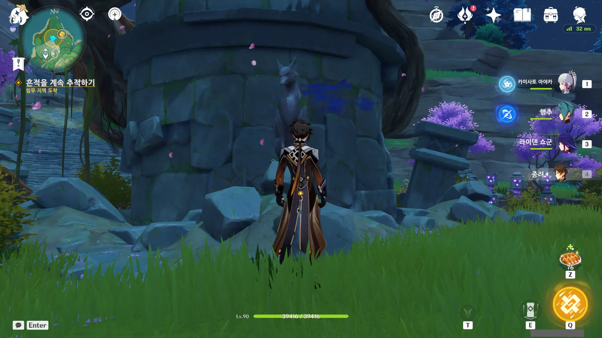
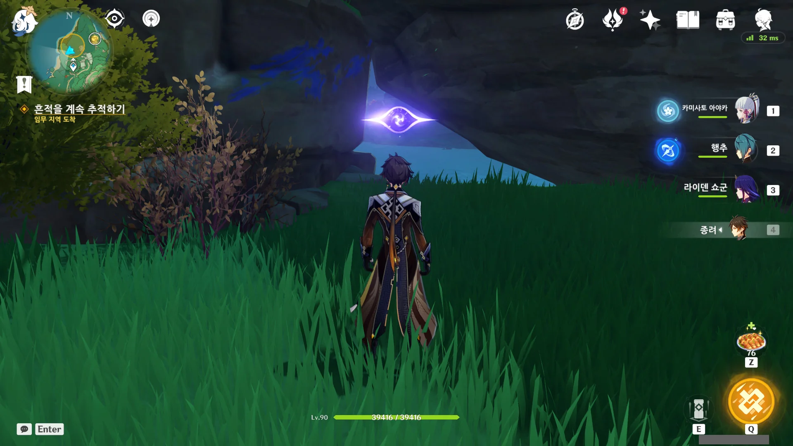
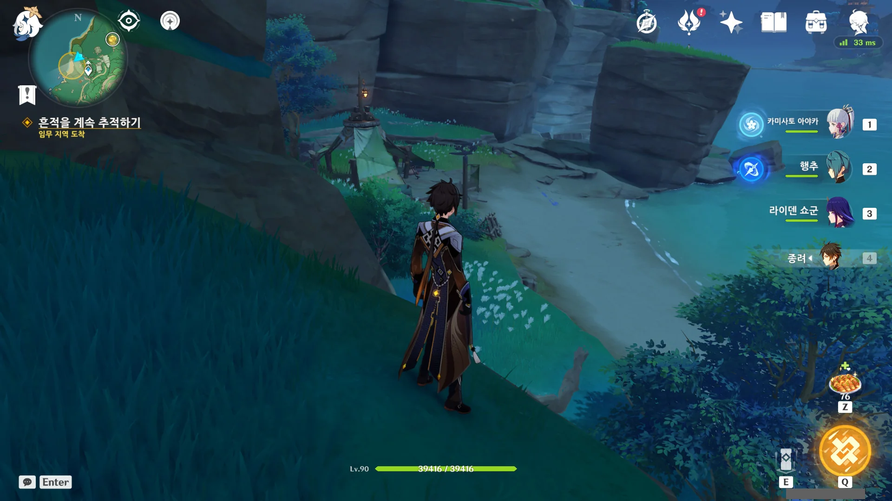
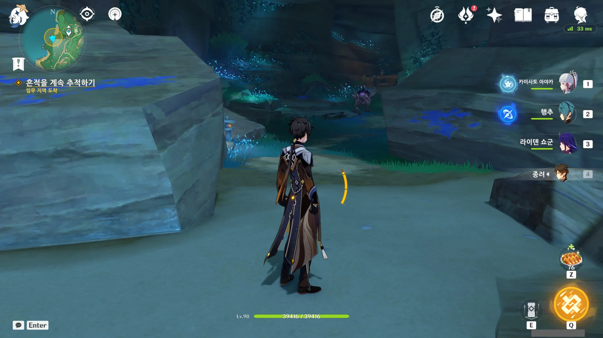
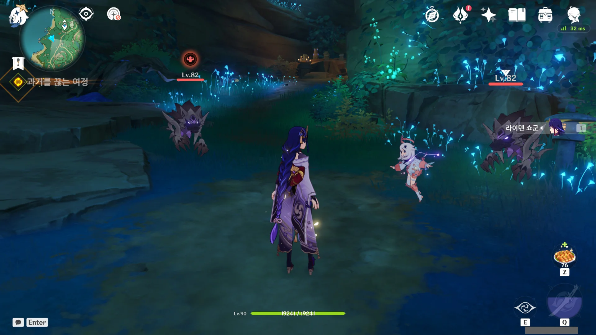
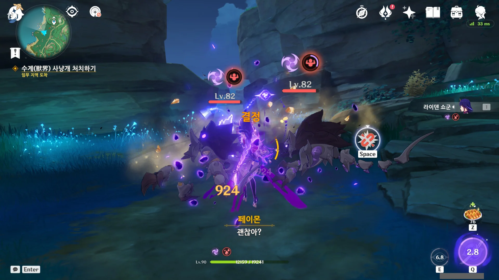
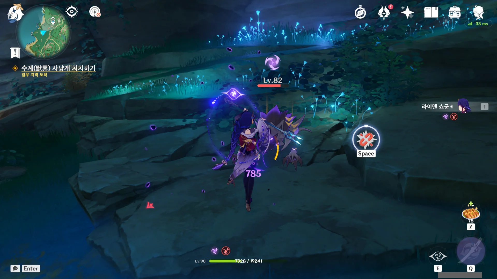
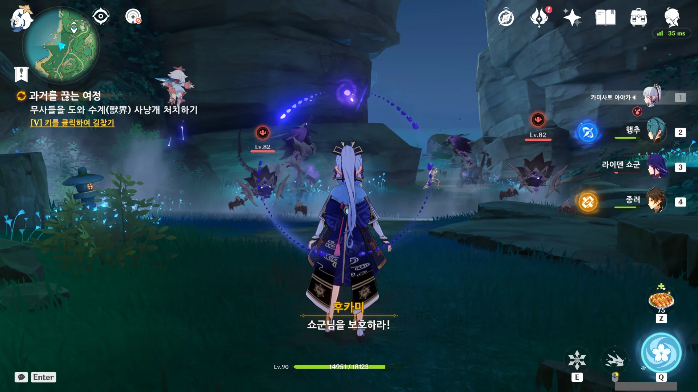
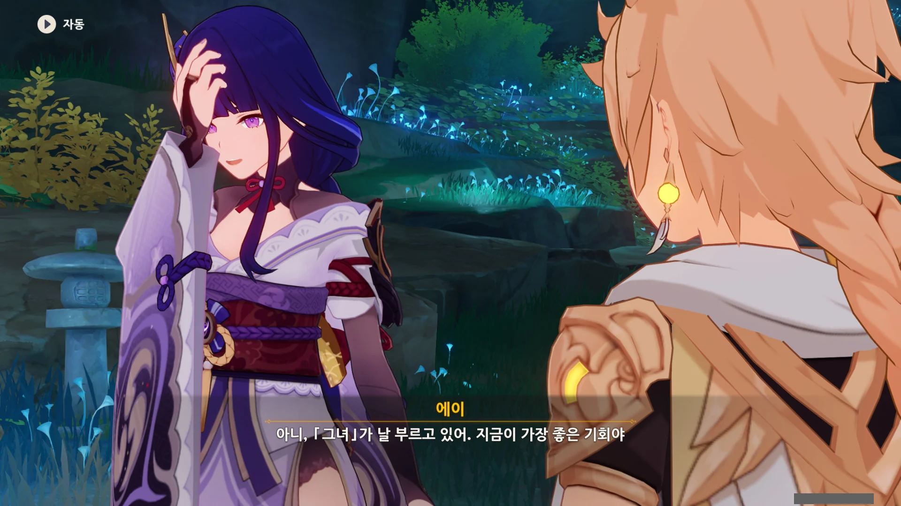

원신 전설 임무는 하나같이 뽕을 극한까지 채워준다.

딱 하나, 타르탈리아의 전설 임무만 빼고. '나는 스네즈나야 최고의 장난감 판매원'이라니. 그걸 본 이후로는 눈에 힘을 완전히 뺀 채, 스페이스 바와 F 키만 연타해 대화를 빨리 넘겨버렸다.





후루야마에게 바친 찻잔은 대화가 끝난 이후에도 여전히 남아있다.

후루야마가 라이덴 쇼군 자매에 대해 어디까지 알고 있었는지는 아마 영원히 모를 것이다. '후루야마는 라이덴 쇼군이 둘인 것을 알고 있었으나, 끝까지 모른 척했다'라는 것은 에이의 추측일 뿐이니.

이 여우 신상, 원래 여기에 있었던 건가? 왜 난 이걸 처음 보는 것 같지?

계속해서 수계 사냥개의 흔적을 따라가던 중, 있는지도 몰랐던 절벽 사이의 틈을 발견했다.

벚꽃 수구를 모으기 위해, 혹은 지맥의 꽃을 위해 이 지역을 수십 번이나 오고 다녔음에도 이걸 이제야 발견하다니, 꽤 충격적이다.

와, 이 수계 사냥개, 정말 멀리도 돌아다녔다. 체감상 나루카미 섬을 절반 정도 돈 것 같은데.

드디어 찾았다, 이 똥개.



이번에도 에이가 "방금처럼 나에게 맡겨"라고 하기에, 이번에도 라이덴 쇼군 혼자만 들려준 채 수계 사냥개와 싸워야 하나 생각했다.

정답이었다.

이러다가 라이덴 쇼군이 죽어버리겠는데? 수계 사냥개의 공격을 실드도 없이 다 맞아야 하지 않는가.

여기에는 분명 바닥에 고인 물도, 서리꽃 꽃술도 없는데 라이덴 쇼군이 마치 빙결에 걸린 것처럼 움직이질 못한다. 다만 평범한 빙결과는 달리, 라이덴 쇼군이 보랏빛으로 빛난다.

에이에게 무슨 문제가 생긴 것이 틀림없다.

또 굳었다.

수계 사냥개들이 좋다고 라이덴 쇼군을 공격하더라.



뭔가 몸이 편찮아 보이는 에이 대신 여행자가 싸우기로 했다.

에이는 아직 싸울 수 있다고 말하려다, 자기 몸 상태가 그렇지 않음을 깨닫고 미안하다고 말한다.



오, 그러면 이제 내가 구성한 파티로 수계 사냥개를 사냥할 수 있는 건가?

제발 그렇다고 말해줘.



이번에도 나무 진액에서 하얀 연기가 나오더니, 건장한 무사들이 나타났다.





라이덴 쇼군을 발견한 무사들은 라이덴 쇼군의 상태가 별로 좋지 않아 보이자, 곧바로 라이덴 쇼군을 둘러싸고 주변을 경계하기 시작한다.

와, 멋지다...



앞에 마물이 보이자, 아무런 망설임 없이 달려드는 무사들.

너무 위험하다고 에이가 말리지만, 위험을 두려워했다면 애초에 무기를 들지 않았을 것이라며 이 역시 자신들이 해야 할 일이라고 말한다.



그렇게 말하는 무사들의 허리춤에는 번개 신의 눈이 달려 있었다.

무사들은 전지전능한 라이덴 쇼군이 힘을 자신들에게 하사한 건 분명 자신들에게 무언가 큰 기대를 걸고 있기 때문이라고 굳게 믿고 있다.



자신들에게 힘을 하사한 라이덴 쇼군이 지금 곤경에 빠졌으니, 자신들이 약속을 지킬 차례라고 말한다.

&nbsp;

어쩜 저렇게 멋있을 수 있을까? 가슴의 두근거림이 멈추질 않는다.

그래서 망설임 없이 '투쟁의 마음은 흔들린 적이 없어'라는 선택지를 골랐다. 지금, 이 순간을 저 문장만큼 잘 표현할 수 있는 말은 아마 없을 것이다.



> 쇼군님은 바로 이곳에 계십니다.
> 쇼군님만 계신다면, 우리의 희망은 다시 타오를 것입니다.
> 이 희망은 어둠을 뚫고 나아가는 빛이 되어줄 것입니다.

후카미의 대사 하나하나가 전부 주옥같다.





보고 있자니 피가 끓어오른다. 여행자도 합세하여 마물을 잡는다.

야호! 4인 깽판 파티다!

이전에 강제로 홀로 꺼내 쓰게 했던 라이덴 쇼군은 수계 사냥개에게 잔뜩 맞은 터라 남은 체력이 간당간당한다. 하지만 종려의 실드를 두른 채, 쉴 새 없이 적이 공격할 틈새를 주지 않고 두드려 패면 침식 공격에 당하지 않을 수 있다.

&nbsp;

이렇게 NPC가 전투에 합세하는 경우, NPC가 적에게 주는 대미지는 매우 적거나 아예 없는 경우가 잦다. 그걸 한번 확인해 보았어야 했는데, 워낙 경황이 없어 그걸 보지 못했다.



근처에 있던 수계 사냥개들은 전부 갈아버렸다. 이 정도면 이제 더 나오진 않겠지.



에이의 몸 상태 역시 아까 전보다 많이 나아진 것 같다.





마물들이 다시 돌아올 테니, 라이덴 쇼군과 함께 이나즈마 성으로 돌아가 대장이 이끄는 군대와 합류해달라고 하는 무사.



이들은 이곳에 남아 다른 마물들이 더는 앞으로 나아가지 못하게 막겠다고 한다.

맨 처음 만났던 키타무라만큼 다친 건 아니지만, 이들도 마물이 계속해서 밀고 들어온다면 결국 다치고 죽을 텐데... 저것 역시 자기 죽음을 각오하고 하는 말이겠지.

흔히 볼 수 있는 '여기는 내게 맡기고 어서 가!'라는 내용이지만, 가슴이 벅차오른다.



키타무라와 후루야마에게 에이가 말했던 것처럼, 여행자 역시 이들의 「현실」을 깨트리지 않고 그들의 말에 따르겠다고 말한다.



> 쇼군님만이 이 절망적인 상황을 반전시킬 수 있습니다.
> 이나즈마가 어떤 위협에 직면하든, 저희는 영원히 쇼군님을 따를 것입니다!

이들에게 과연 라이덴 쇼군은 어떤 존재일까? 갑자기 궁금해진다.

아까 들은 '전지전능'이라는 말도 그렇고, 흡사 광신도를 연상케 할 정도의 믿음이다. 집정관 역시 피와 살, 한계를 가진 생물일 뿐인데 말이다.



> 정말 고마워. 이나즈마의 밝은 미래를 너희들한테 약속하지.
> 늦은 약속이지만, 적어도 지금부터 시작이야.

에이의 말은 단순히 이 무사들에게 하는 소리는 아닌 것 같다.





> 진리가 웅대하듯 번개 신 또한 영원하리!

굉장히 멋진 구호이지만, 이 당시 라이덴 마코토가 사망했다는 걸 생각해 보면 쓴웃음이 나는 구호이기도 하다.

&nbsp;

그리고 산통 다 깨는 저 '무사들이여' 오역이 너무 신경 쓰인다.



사람들의 희생을 보기 고통스러웠기에 에이는 그걸 외면했다. 하지만 그 희생은 사람들이 자신을 불태워 밝은 빛을 내는 모습이기도 했다.

이제서야 그들이 어떤 의지를 다지고 희생한 것인지 이해한 에이.

&nbsp;

저번 글에서 '웰다잉(Well-dying)', 잘 죽는 것에 관해 이야기했었다.

나는 인간이 할 수 있는 가장 숭고한 행동이 '자신을 불태워 밝은 빛을 내는 것'이라고 생각한다. 비록 죽더라도 그 최후의 순간까지 내가 믿는 바에 따라 행동했다면, 그것이야말로 '잘 죽은 것'이라고 할 수 있겠지.





물론, 지맥의 기억에 불과한 그 무사들에게 하는 말에는 아무런 의미가 없다. 하지만 에이는 단순한 지맥의 기억에 불과한 그들에게, 지금까지도 자신을 믿고 있는 이나즈마 사람들에게, 그리고 밝은 미래를 약속하고 싶었다. 자신에게 하는 다짐이기도 하니 말이다.

그래도 난 저렇게라도 말하는 것에 의미가 있다고 생각한다. 입 밖에 낸 말은 단순히 마음속에 품고 있는 말과는 그 무게가 달라지기 때문이다.





이나즈마에 필요한 건 한 명의 전사로서 감당해야 할 것만 감당하면 된다고 생각한 자신이 아닌 마코토라고 생각하지만, 에이는 마코토가 될 수 없고 마코토 역시 에이가 될 수 없다.

에이도 최근의 일로 한층 더 성장했으니, 이제 이나즈마를 위해 무엇을 해야 할지 잘 알겠지.



> 모두가 존경하는 라이덴 쇼군이 백성들의 발목을 잡을 순 없어.

에이가 큰 결심을 한 것 같다.



> 이나즈마는 새로운 변화와 가능성을 맞이할 거야. 하지만 아직 시간이 필요해.
> 시간이 오래 걸린다 해도, 난 포기하지 않아. 이게 나의 약속이야.



수계 사냥개를 처치했으니, 사건 원인 규명이나 신성한 벚나무 뿌리 보호와 같은 나머지 일은 이제 삼봉행에게 맡기면 될 것이다. 



아마 그렇겠지. 이번 일은 상처를 다시 잡아찢어 아픈 속살을 다시 끄집어내는 일과 다를 바가 없을 테니.

그래도 방문을 걸어 잠그고 영원만을 부르짖던 방구석 히키코모리와 비교하면 많이 달라졌다.



아까 전 분명 상태가 좋았던 것 같은데, 에이의 상태가 또다시 나빠졌다.

「그녀」? 그게 누구지? 설마 쇼군 인형의 인격인 걸까?





나루카미 다이샤 아래의 동굴까지 부축해달라는 에이.

그곳에는 '과거를 베어내고 미래로 나아갈 수 있는 전장'이 있다고 한다.

어휴, 누가 천성 무인 아니랄까 봐 비유하는 것도 싸움과 관련된 비유를 하네.
