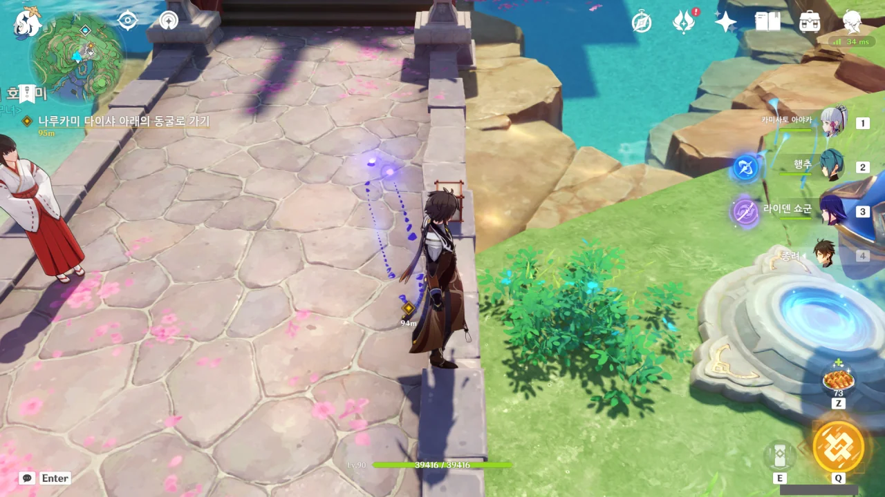

나루카미 다이샤 아래의 동굴로 가라는데... 그게 대체 어디지?

내가 아는 동굴 같은 곳은 나루카미 다이샤 가장 밑에 있는, 신성한 벚나무 대액막이에서 오염된 나무뿌리를 정화할 때 간 공동밖에 모른다고.



결국 나루카미 다이샤에서 나가는 길을 따라 천천히 내려가며 다른 동굴이 있는지 살펴보아야 했다.

아, 여기였어? 원래 이곳은 번개 장막으로 가로막혀서 번개 씨앗을 먹은 뒤 통과해야 했던 곳으로 기억하는데, 번개 장막이 사라졌다.



갑자기 없던 토리이가 나타났다.

이 동굴에 있는 작은 감실이 너무 구석진 곳에 있어, 지금 토리이가 나타난 곳에도 다른 뭔가가 있을 법하다고 생각하고 있었는데, 정말로 거기에 토리이가 나타났다.

에이의 상태가 아까보다 더 악화한 것 같지만, "곧 모든 걸 끝낼 수 있어"라고 말한다.

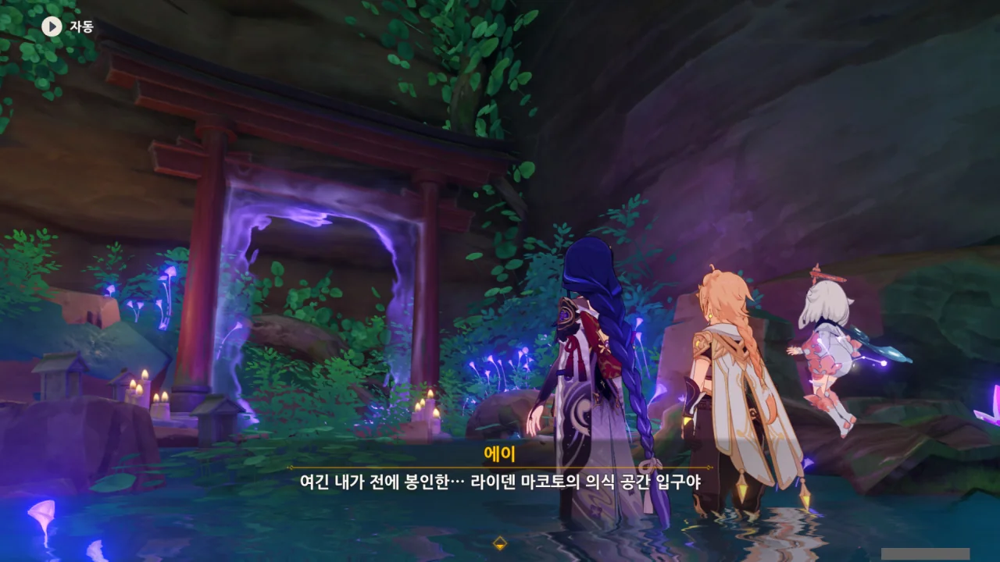

이곳은 에이가 보존해 가져온 마코토의 의식 공간의 입구라고 한다.

마코토의 의식 공간을 이나즈마로 가져왔다는 말만 하고, 그걸 어디에 두었는지는 말하지 않았는데, 여기에 계속 마코토의 의식 공간을 보관해 두고 있었던 모양이다.



> 「그녀」는 내가 이 몸을 멋대로 사용하는 걸 거부하고 있는 것 같군

에이의 말로 미루어 보건대, 에이가 말하는 「그녀」는 '라이덴 쇼군 인형의 인격'을 말하는 것으로 보인다.



에이를 따라 들어온 곳은 「일심정토」와는 비슷하지만, 회색과 붉은색 대신 푸른색으로 가득한 공간이었다.

하늘을 보니 마치 성운을 묘사한 칵테일이 생각난다.

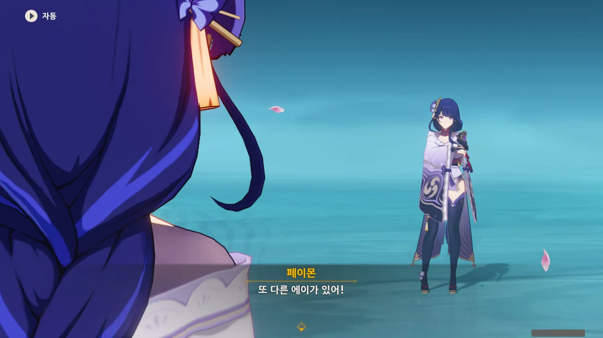

그리고 에이 맞은 편에는 또 다른 에이가 있다.

&nbsp;

에이가 둘이라고? 그러면...



'노 잼 예스 스트레스' 개그를 한번 쳐보고 싶었다.





라이덴 에이와 라이덴 쇼군의 인격은 별개인 것이 확실하다. 그렇지 않고서야는 "또 만났군, 여행자"라고 할 이유가 없지 않은가.

내부의 조력자이자 법칙의 수호자인 라이덴 쇼군은 에이가 법칙을 위반했다 판단한 모양이다.

&nbsp;

라이덴 쇼군이 다짜고짜 예초의 번개를 꺼내 드는데, 정말 부럽다. 나도 전무 줘요!



쇼군은 에이가 생각을 바꾼 것이 「마모」되어 그런 것으로 생각한다.

&nbsp;

종려도 「마모」를 언급하던데, 대체 「마모」란 정확히 무엇일까?



아니, 왜 질문의 대답을 「전투」로 해요? 무슨 전투 종족이야?  왜 서로 다짜고짜 칼을 꺼내는데?



아까 전과 다르게 움직임에 아무런 지장이 없는 에이.

에이는 이미 라이덴 쇼군 인형을 만든 후, 무상의 일심에 자신의 의식만을 집어넣어 명상만 하고 지내왔다. 그러니 평소 움직일 때 에이가 움직이는 것은 자기 몸이 아니라 라이덴 쇼군의 몸이다.

에이가 법칙을 위반했다 판단한 라이덴 쇼군이 에이의 통제에 저항했기에 에이가 제대로 몸을 움직이지 못했다.



쇼군의 말대로, 에이가 「영원」이 아닌 「변화」를 추구할 때, 쇼군은 에이를 적으로 삼는다.

하지만 의식 공간 안에서 라이덴 에이와 라이덴 쇼군은 서로 독립적으로 존재할 수 있다.

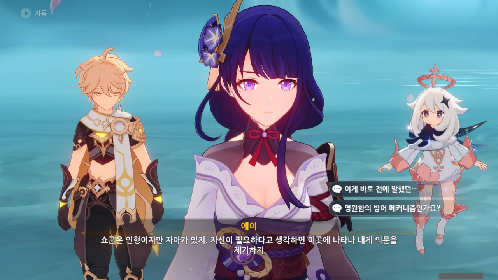

인형이지만 자아가 있는 쇼군은 에이가 「영원」을 추구하지 않는다고 판단할 때 이곳에 나타나 에이에게 의문을 제기한다고 한다.

그리고 그 의문이라는 것이 서로 싸우는 거고? 정말 「영원」 하나를 쫓기 위해 정신 나간 짓을 했구나...



의견 주장과 반박을 전투 하나로 한 번에 해결하려는 발상이 정말 놀랍다.

이게 그 '앞으로 나아가려면 과거의 너를 꺾어라!'라는 전개인 건가?



쇼군 인형을 만들 때, 에이는 당시 자신의 이념을 그대로 쇼군 인형에게 담았다. 그래서 쇼군 인형은 흔들리지 않는 「영원함」의 초석이 되었다.

그 말인즉슨, 쇼군은 처음 만들어졌을 때와 전혀 달라짐이 없다는 것이다.



천성 무인 아닌가. 절대 자신에게 물러설 여지를 남길 사람이 아니다.



다시 말해, 라이덴 쇼군은 쇼군 인형을 만들었을 때의 에이 그 자체와 다를 바가 없다. 그때 에이가 느꼈던 상실의 고통, 「영원함」에 도달하고자 하는 결심을 온전히 이어받았으니 말이다.

그리고 그렇게 했던 이유는 전부 「마모」에 저항하기 위함이었다.

&nbsp;

참... 일반적으로 상상하기 힘든 방법이긴 하다.

영원히 변하지 않을 인형을 만든 후, 그 인형에 자기 자신의 모든 걸 불어넣고, 「일심정토」에 틀어박혀 천년만년 명상만 하겠다는 게 보통 사람이 할 생각은 절대 아니지.



> 결심, 용기, 사랑, 원한... 전부 시간의 흐름 속에서 변질되고 왜곡되지. 오로지 「법칙」만이 영원하다.

쇼군의 저 말은 옛날 에이가 했던 생각과 완벽히 똑같겠지...



그렇기에 지금의 쇼군은 지금의 에이가 넘어서야 할 벽이다.

사람이 과거의 자기 자신을 넘어야 한다면, 에이는 쇼군을 넘어야 하는 것이다.



> 넌, 나와 적이 될 생각인가? 난 너의 과거이고, 영원불변의 법칙, 그리고 「영원함」의 수호자이다.

> 하지만 난, 백성에게 **꿈**을 약속한 「라이덴 에이」이기도 해.

그래서 이번 임무 이름이 '과거를 끊는 여정'이구나.

&nbsp;

처음 라이덴 쇼군을 만났을 때와 정반대로, 이번엔 에이가 몽상의 일심을 꺼내고 쇼군이 예초의 번개를 꺼낸다.

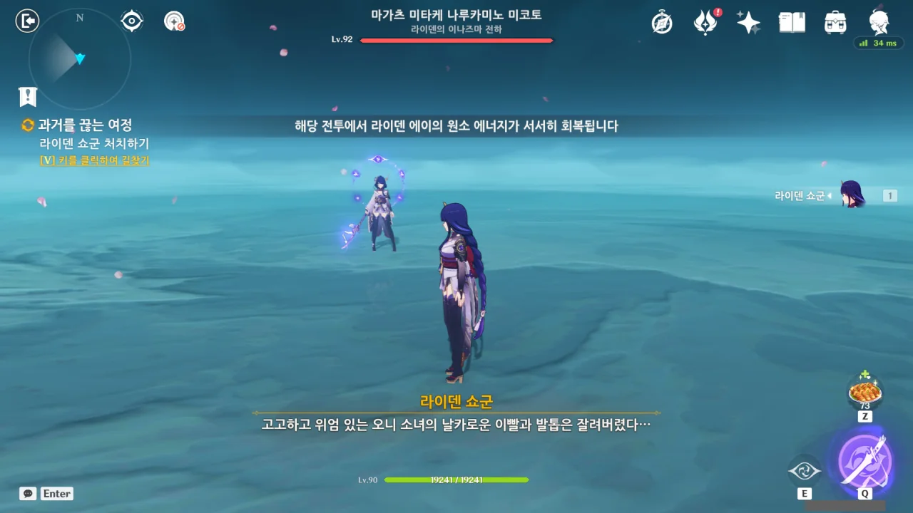

곧바로 라이덴 쇼군과의 전투가 시작된다.

이번에도 라이덴 하나만 쓸 수 있지만, '해당 전투에서 라이덴 에이의 원소 에너지가 서서히 회복됩니다'라고 말하며 버프를 준다.

이러면 다른 캐릭터가 없어도 지속해서 궁을 쓸 수 있다.

> 고고하고 위엄있는 오니 소녀의 날카로운 이빨과 발톱은 잘려버렸다...

이건 분명 미코시 치요의 이야기겠지. 미코시 치요는 마물과 싸우다가 심연에 오염되어 라이덴 쇼군에게 반기를 들었고, 결국 뿔과 팔이 잘린 채 도주했다가 자기 아들에게 최후를 맞이했다고 한다.

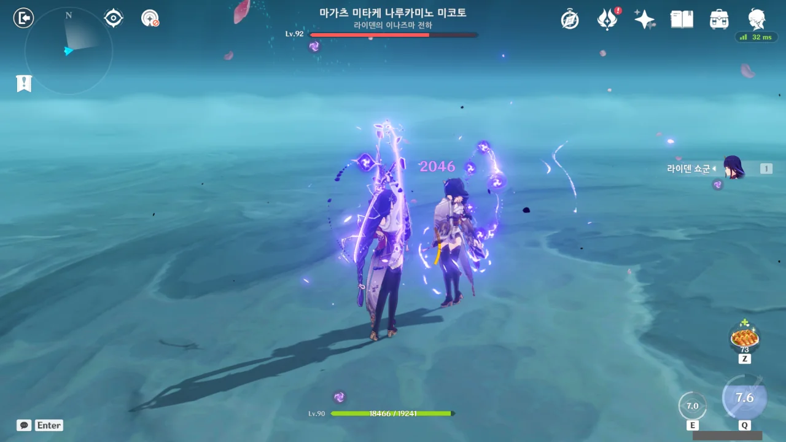

> 피와 오염은 정화되었다곤 하나, 너의 검은 영원히 처음처럼 빛나지 않을 것이다.

이건 라이덴 에이를 말하는 것이다. 500년 전의 대재앙으로 인해 에이는 언니와 친우를 잃었으니까.

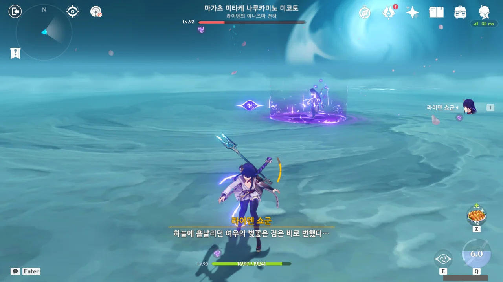

> 하늘에 흩날리던 여우의 벚꽃은 검은 비로 변했다...

호재궁의 이야기이다. 호재궁은 이나즈마에 닥친 재앙에 맞서다 사망했다. '검은 비'는 당시 이나즈마를 덮었던 검은 안개를 의미하는 것이겠지.

&nbsp;

저렇게 무슨 투명한 기둥 안에 있을 때, 라이덴 쇼군이 체력을 회복하더라. 실드인 줄 알고 그냥 때리지 않고 있었는데...

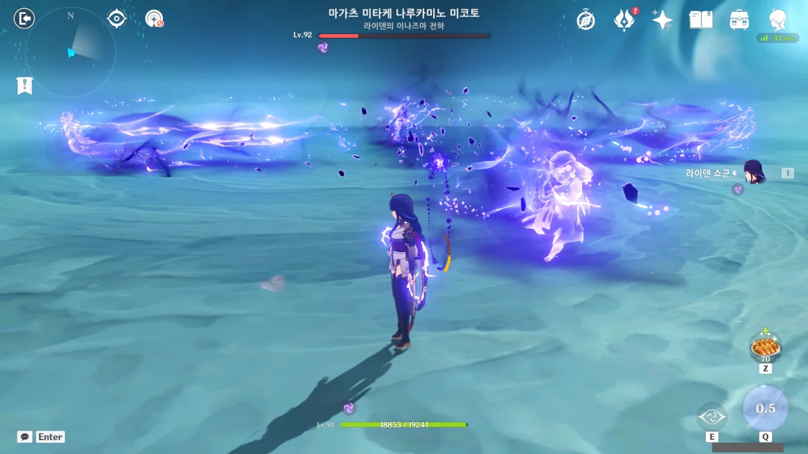

> 지맥이 흐르는 한, 시간의 고통은 끝이 없을 거다.

여기서 X자로 공격하는 분신을 때리면 쇼군이 '간파했군'이라고 말하며 그로기 상태에 빠졌을 거다.

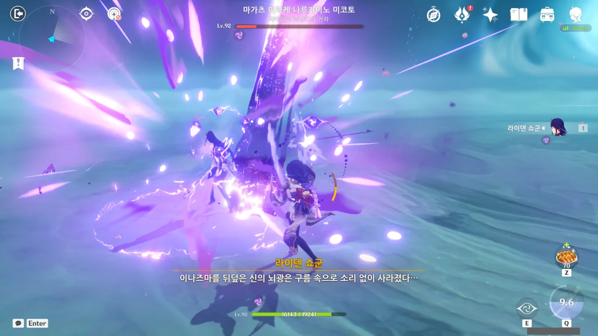

> 이나즈마를 뒤덮은 신의 뇌광은 구름 속으로 소리 없이 사라졌다...

이건 에이가 아니라 마코토 이야기겠지?

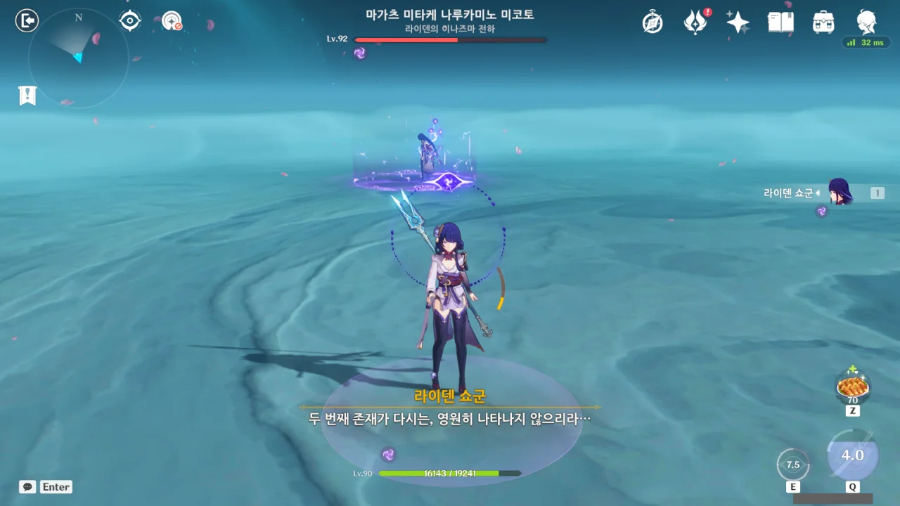

> 두 번째 존재가 다시는, 영원히 나타나지 않으리라...

여기서 말하는 '두 번째 존재'는 과연 누구일까?

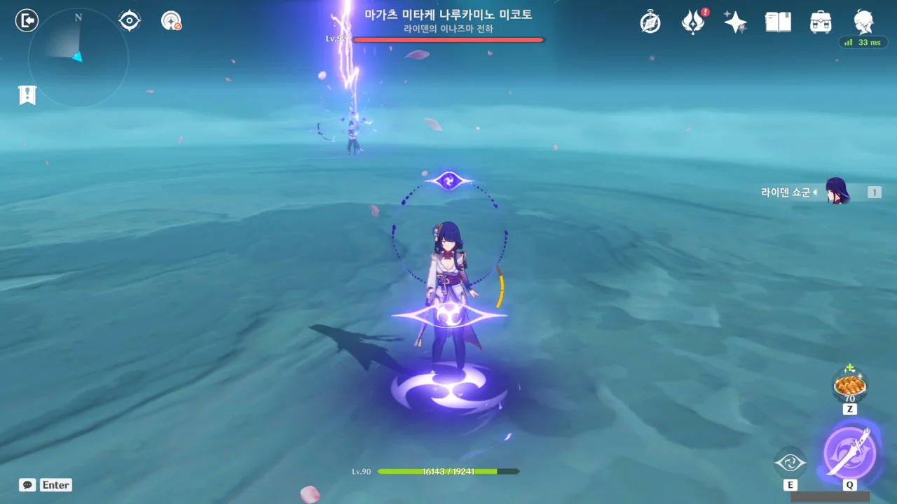

아니, 여기서 체력을 다시 회복한다고?

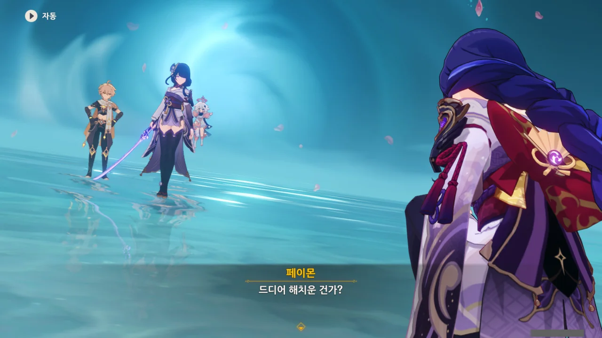

야야, 그 대사!



이게 다 페이몬 때문이다. 라이덴 쇼군이 멀쩡해졌잖아.



마모에 대항하기 위해 만든 쇼군 인형이니만큼, 의지 하나는 모든 생명보다 강하다고 한다. 다른 말로, 고집불통이라는 말이지.

하지만 에이는 자신의 의지가 마모의 결과가 아니며 자신이 만들 미래는 마모를 견딜 수 있는 위대한 미래라는 걸 증명해야 한다. 그렇지 않으면 쇼군의 법칙은 변하지 않을 것이고, 이나즈마 역시 전진할 수 없을 것이기 때문이다.

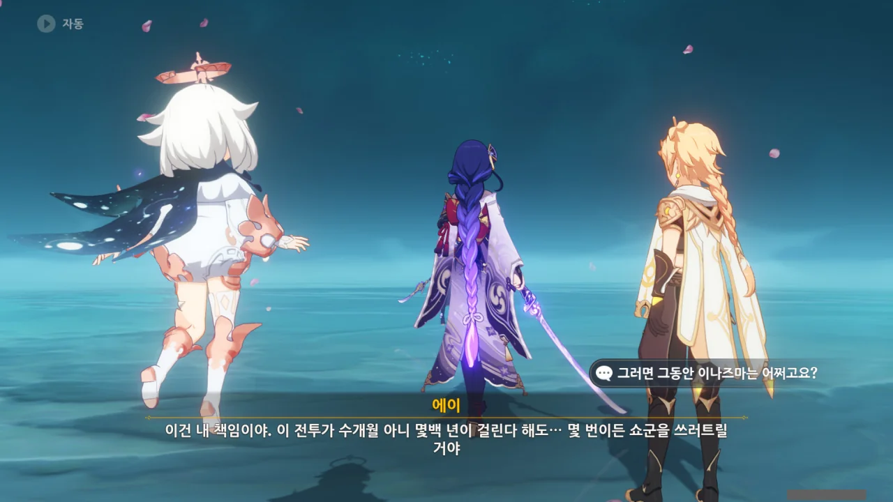

얼마나 오랜 시간이 걸려도 몇 번이고 쇼군을 쓰러트릴 것이라고 말하는 에이.

왠지 조금 불안한 느낌이 드는데. 



그러니까 '나 없어도 다들 잘할 거야'라는 거잖아.





> 마코토가 얘기한 「꿈」이 진짜 영원함이라면, 쇼군이 없는 「찰나」도 두려워할 게 없지.

> 이나즈마의 백성에게 꼭 돌아오리라고 약속했어. 네가 그 약속의 증인이 되어줘. 내가 없는 동안은 미코와 다른 사람들이 이나즈마를 맡아줄 거야.

어어, 아니, 진짜?



정말로 의식 공간에서 내쫓겼다.
